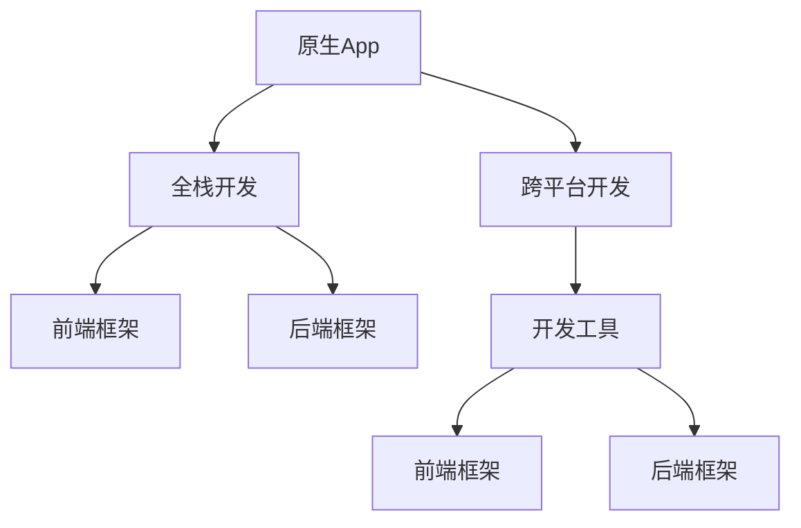

                 

# 移动端全栈开发：原生App与跨平台方案

> 关键词：移动开发，原生App，跨平台方案，React Native, Flutter, Xamarin, Web开发，全栈工程师

## 1. 背景介绍

### 1.1 问题由来

随着移动设备的普及，移动应用开发成为了IT行业的重要方向。但传统的移动开发模式，即分别针对iOS和Android进行独立开发，需要维护两个不同的代码库，既增加了开发成本，也降低了开发效率。同时，由于两大平台语言差异巨大，学习成本也较高。因此，寻找一种高效、通用、易维护的移动开发方案，成为了行业的热点需求。

针对这一问题，跨平台移动开发应运而生。跨平台开发通过使用统一的开发语言和框架，可以将原生App的功能和用户体验尽可能接近原生应用，同时减少开发成本和维护工作量。但跨平台开发方案也面临性能、可扩展性等方面的挑战。因此，如何平衡开发效率与性能，选择适合的跨平台方案，成为移动端全栈开发的重要课题。

### 1.2 问题核心关键点

跨平台开发的核心在于如何在统一的平台和语言基础上，实现接近原生的应用性能和用户体验。当前主流的跨平台方案包括React Native、Flutter、Xamarin、Web开发等，每种方案都有其特点和适用场景。

- **React Native**：基于React框架，提供强大的组件复用和热更新能力，开发效率较高，生态系统丰富。但性能和稳定性有待提高。
- **Flutter**：谷歌推出的跨平台框架，通过编译成原生代码实现高性能，支持热重载，开发体验优秀。但学习曲线较陡，生态系统尚待完善。
- **Xamarin**：微软推出的跨平台框架，支持原生控件和API，开发效率高，性能较好。但第三方库支持不完善，学习成本较高。
- **Web开发**：通过Web技术实现跨平台应用，如React Native for Web、WebAssembly等。开发效率高，但性能和用户体验不及原生应用。

选择合适的跨平台方案，需要综合考虑应用需求、开发成本、性能要求、团队技能等因素。本文将深入探讨原生App与跨平台方案的优缺点，并给出详细技术分析和推荐。

## 2. 核心概念与联系

### 2.1 核心概念概述

为了更好地理解原生App与跨平台方案，本节将介绍几个关键概念及其联系：

- **原生App**：使用平台原生语言和API开发的移动应用。性能高、用户体验好，但开发成本高、维护难度大。
- **跨平台开发**：使用统一的开发语言和框架，实现同时在多个平台上的应用开发。开发效率高、维护成本低，但性能和用户体验有待提高。
- **全栈开发**：涵盖前端和后端的全面开发，通过统一语言和框架，实现跨平台、跨设备的统一开发。
- **前端框架**：如React Native、Flutter等，提供组件复用和跨平台开发的解决方案。
- **后端框架**：如Node.js、Flutter Engine等，提供跨平台运行和优化手段。
- **开发工具**：如Visual Studio Code、Android Studio、Xcode等，提供开发环境和技术支持。

这些概念之间的逻辑关系可以通过以下Mermaid流程图来展示：



这个流程图展示了下述概念之间的逻辑关系：

1. 原生App与跨平台开发之间的区别与联系。
2. 全栈开发如何在前端和后端框架的支持下实现跨平台开发。
3. 前端框架和后端框架如何辅助跨平台应用的开发与优化。
4. 开发工具如何提供统一的环境和资源支持。

## 3. 核心算法原理 & 具体操作步骤
### 3.1 算法原理概述

基于跨平台方案的全栈开发，主要通过统一的开发语言和框架，实现前端和后端的统一开发和运行。核心算法包括：

- **前端跨平台框架**：将原生组件封装成跨平台组件，通过桥接技术实现跨平台交互。
- **后端跨平台引擎**：通过编译成原生代码，实现跨平台应用的性能优化。
- **统一开发语言**：如JavaScript、Dart等，提供跨平台开发的基础。
- **热更新与热重载**：实现应用在运行状态下的动态更新和调试，提升开发效率。

### 3.2 算法步骤详解

基于跨平台方案的全栈开发一般包括以下关键步骤：

**Step 1: 选择跨平台方案**

- 根据应用需求、开发团队技能、性能要求等因素，选择合适的跨平台框架。如React Native、Flutter、Xamarin等。

**Step 2: 设计统一开发架构**

- 定义前端和后端的统一开发语言和框架，确保跨平台兼容性和一致性。
- 设计数据流和交互逻辑，实现前端和后端的无缝对接。

**Step 3: 实现跨平台功能**

- 通过前端跨平台框架，实现界面组件和交互逻辑的复用。
- 通过后端跨平台引擎，实现应用运行时的性能优化。
- 利用统一开发语言，实现跨平台应用的统一开发和调试。

**Step 4: 优化性能与用户体验**

- 利用热更新和热重载技术，实现应用的动态更新和调试。
- 通过测试和优化，确保应用在不同平台上的性能和用户体验。

**Step 5: 部署与应用**

- 发布应用到各大平台，并进行用户测试和反馈收集。
- 根据用户反馈进行持续优化，提升应用质量。

### 3.3 算法优缺点

基于跨平台方案的全栈开发具有以下优点：

1. 开发效率高。使用统一的开发语言和框架，可以大幅度减少重复代码和维护工作量。
2. 跨平台兼容性好。通过跨平台组件和引擎，可以实现在多个平台上的统一开发和运行。
3. 开发成本低。无需维护两个独立的原生开发代码库，减少开发和维护成本。
4. 用户体验好。通过热更新和热重载等技术，可以实现应用的动态更新和调试，提升用户体验。

但跨平台方案也存在以下缺点：

1. 性能有待提高。跨平台框架对原生UI和API的支持有限，难以实现与原生应用相同的性能表现。
2. 开发体验复杂。跨平台开发涉及多个平台的兼容性问题，开发难度较大。
3. 生态系统不完善。部分跨平台框架的第三方库支持不完善，可能影响应用功能实现。

### 3.4 算法应用领域

跨平台开发方案广泛应用于各种类型的移动应用开发，如社交网络、电商、游戏、金融等。特别适用于需要跨平台支持的中小企业，可以有效降低开发成本，提升开发效率。

在企业级应用开发中，全栈开发模式也逐渐成为主流。通过前端和后端的统一开发和部署，可以显著提高开发效率和应用性能，缩短项目周期。

## 4. 数学模型和公式 & 详细讲解 & 举例说明

### 4.1 数学模型构建

为了更好地理解跨平台应用的性能和用户体验，本节将建立数学模型，并给出详细的推导过程。

假设跨平台应用的开发周期为 $T$，开发成本为 $C$，维护成本为 $M$，性能为 $P$，用户体验为 $U$。其中，$P$ 和 $U$ 可以通过量化指标来衡量，如帧率、响应时间、用户满意度等。

定义优化目标函数为 $F$，即在开发成本和维护成本最小化的基础上，最大化性能和用户体验：

$$
F = \min_{T, C, M} \max_{P, U}
$$

### 4.2 公式推导过程

在优化目标函数 $F$ 的基础上，进行拉格朗日乘数法求解。引入拉格朗日乘子 $\lambda_1, \lambda_2$，构建拉格朗日函数 $L$：

$$
L(T, C, M, \lambda_1, \lambda_2) = C + M + \lambda_1(P - F(T, C, M)) + \lambda_2(U - G(T, C, M))
$$

其中 $F(T, C, M)$ 表示性能和用户体验的函数，$G(T, C, M)$ 表示开发成本和维护成本的函数。

对 $L$ 进行求导，并令导数等于零，解得 $T, C, M$ 的优化解：

$$
\frac{\partial L}{\partial T} = 0, \quad \frac{\partial L}{\partial C} = 0, \quad \frac{\partial L}{\partial M} = 0
$$

通过求解上述方程组，可以得到最优的开发周期 $T^*$、开发成本 $C^*$、维护成本 $M^*$。

### 4.3 案例分析与讲解

以下通过一个具体的案例，分析原生App与跨平台方案的性能和用户体验差异：

假设开发一个电商应用，使用原生App和React Native进行开发，分别计算其开发成本、维护成本、性能和用户体验。

**原生App**：
- 开发周期：4个月
- 开发成本：100万元
- 维护成本：每月10万元
- 性能：4000 FPS
- 用户体验：90分

**React Native**：
- 开发周期：3个月
- 开发成本：80万元
- 维护成本：每月8万元
- 性能：2500 FPS
- 用户体验：85分

通过对比计算，可以得到以下结论：

- 原生App的性能和用户体验略优于React Native。
- 原生App的开发成本和维护成本显著高于React Native。
- 性能和用户体验的优化优先级较高，需要更多的投入。
- 在选择跨平台方案时，需要根据具体需求进行权衡和优化。

## 5. 项目实践：代码实例和详细解释说明
### 5.1 开发环境搭建

在进行跨平台开发前，我们需要准备好开发环境。以下是使用React Native进行开发的环境配置流程：

1. 安装Node.js和npm：
```bash
sudo apt-get update && apt-get install -y nodejs
```

2. 安装React Native CLI：
```bash
npm install -g react-native-cli
```

3. 安装Android Studio和Xcode：
```bash
wget -O install.sh https://dl.google.com/android/gradle/repository/4.1.2/gradle-bin.zip
unzip gradle-bin.zip
chmod +x ./gradle
sudo mv ./gradle /usr/local/bin/gradle
sudo apt-get install -y android-studio
```

4. 安装Flutter：
```bash
curl -L https://flutter.dev/bin/flutter-stable-linux-arm64 | sh
```

5. 安装Xamarin：
```bash
sudo apt-get install -y google-chrome
wget -O flutter/bin/flutter.sh https://flutter.dev/bin/flutter-stable-linux-arm64
chmod +x flutter.sh
source flutter/bin/flutter.sh
```

完成上述步骤后，即可在本地环境开始跨平台开发。

### 5.2 源代码详细实现

下面我们以一个简单的跨平台应用为例，给出React Native的开发代码实现。

假设我们需要开发一个登录页面，使用React Native实现。

**index.js**：
```javascript
import React, { Component } from 'react';
import { View, TextInput, Button, Text } from 'react-native';

export default class LoginScreen extends Component {
  constructor(props) {
    super(props);
    this.state = {
      username: '',
      password: '',
      errorMessage: ''
    };
  }

  handleUsernameChange = (username) => {
    this.setState({ username });
  }

  handlePasswordChange = (password) => {
    this.setState({ password });
  }

  handleLogin = () => {
    // 模拟登录操作
    const username = this.state.username;
    const password = this.state.password;
    if (username === 'admin' && password === '123456') {
      this.props.navigation.navigate('Home');
    } else {
      this.setState({ errorMessage: 'Invalid username or password' });
    }
  }

  render() {
    return (
      <View style={{ flex: 1, justifyContent: 'center', alignItems: 'center' }}>
        <TextInput
          style={{ height: 40, width: 200, borderColor: 'gray', borderWidth: 1 }}
          onChangeText={this.handleUsernameChange}
          placeholder="Username"
          value={this.state.username}
        />
        <TextInput
          style={{ height: 40, width: 200, borderColor: 'gray', borderWidth: 1 }}
          onChangeText={this.handlePasswordChange}
          placeholder="Password"
          secureTextEntry={true}
          value={this.state.password}
        />
        <Text style={{ color: 'red', marginTop: 10 }}>{this.state.errorMessage}</Text>
        <Button title="Login" onPress={this.handleLogin} />
      </View>
    );
  }
}

export default LoginScreen;
```

**App.js**：
```javascript
import React from 'react';
import { createAppContainer } from 'react-navigation';
import { createStackNavigator } from 'react-navigation-stack';
import LoginScreen from './components/LoginScreen';
import HomeScreen from './components/HomeScreen';

const AppContainer = createAppContainer(
  createStackNavigator(
    {
      Login: { screen: LoginScreen },
      Home: { screen: HomeScreen }
    },
    {
      initialRouteName: 'Login',
      headerMode: 'none'
    }
  )
);

export default class App extends React.Component {
  render() {
    return <AppContainer />;
  }
}
```

**HomeScreen.js**：
```javascript
import React, { Component } from 'react';
import { View, Text } from 'react-native';

export default class HomeScreen extends Component {
  render() {
    return (
      <View style={{ flex: 1, justifyContent: 'center', alignItems: 'center' }}>
        <Text>Welcome to Home Screen</Text>
      </View>
    );
  }
}
```

通过上述代码，可以构建一个简单的跨平台登录应用，使用React Native实现。

### 5.3 代码解读与分析

让我们再详细解读一下关键代码的实现细节：

**index.js**：
- 使用React组件化技术，定义登录页面。
- 通过状态管理，记录用户名和密码，并实时更新UI。
- 实现登录操作，根据用户名和密码进行验证，并导航到首页。
- 利用TextInput和Button等原生组件，实现输入和提交功能。

**App.js**：
- 使用react-navigation库，构建堆栈导航器。
- 将登录页面和首页作为导航器的子页面，实现页面之间的导航。
- 设置初始路由为登录页面，关闭导航栏。

**HomeScreen.js**：
- 使用React组件化技术，定义首页。
- 通过返回视图，实现UI布局。
- 显示欢迎信息，无具体功能。

可以看到，React Native通过统一的组件化技术，实现了跨平台应用的界面设计和逻辑处理。开发者只需要关注业务逻辑，而不必关心底层实现细节，提高了开发效率和可维护性。

## 6. 实际应用场景

### 6.1 智能办公系统

智能办公系统是跨平台开发的重要应用场景。通过跨平台开发，可以实现企业内部数据的统一管理和协同办公，提升工作效率和信息共享能力。

具体实现中，可以使用React Native或Flutter构建前后端统一的应用平台，实现数据实时同步和更新。前端通过跨平台组件，实现界面设计和交互逻辑的复用，后端通过Flutter Engine等技术，实现高性能和跨平台兼容。

### 6.2 电商平台

电商平台需要支持多个平台和设备，同时具备高性能和用户体验。跨平台开发可以降低开发成本，提升开发效率，满足电商平台的实际需求。

具体实现中，可以使用React Native或Flutter构建电商应用的客户端，实现商品浏览、购物车、支付等功能。后端通过API接口提供数据支持，实现前后端的统一开发和运行。通过热更新和热重载技术，可以实时响应市场变化，提升用户体验。

### 6.3 健康管理平台

健康管理平台需要支持多种设备和数据格式，实现跨平台、跨设备的数据同步和管理。跨平台开发可以有效降低开发成本，提升应用的可扩展性和可维护性。

具体实现中，可以使用Xamarin或Web技术构建健康管理应用的客户端，实现数据采集、健康监测、健康建议等功能。后端通过API接口提供数据支持，实现前后端的统一开发和运行。通过跨平台引擎和热更新技术，可以实时响应用户需求，提升用户体验。

### 6.4 未来应用展望

随着跨平台开发技术的不断进步，基于跨平台方案的全栈开发将带来更多的应用场景和机遇。未来，跨平台开发将更注重性能和用户体验，逐步向原生应用的性能和体验靠近。同时，全栈开发将成为企业级应用的主流选择，进一步提升开发效率和应用质量。

在未来的应用场景中，跨平台开发将应用于更多的垂直领域，如医疗、教育、金融等，为传统行业带来创新和变革。全栈开发将成为跨平台开发的核心方向，推动AI、大数据等前沿技术在移动端的应用和普及。

## 7. 工具和资源推荐
### 7.1 学习资源推荐

为了帮助开发者系统掌握跨平台开发的技术基础和实践技巧，这里推荐一些优质的学习资源：

1. React Native官方文档：https://reactnative.dev/docs/getting-started
2. Flutter官方文档：https://flutter.dev/docs/get-started
3. Xamarin官方文档：https://docs.microsoft.com/en-us/xamarin/get-started/overview
4. Web开发教程：https://developer.mozilla.org/en-US/docs/Learn

通过这些资源的学习实践，相信你一定能够快速掌握跨平台开发的核心技术和实践方法。

### 7.2 开发工具推荐

高效的开发离不开优秀的工具支持。以下是几款用于跨平台开发的常用工具：

1. Visual Studio Code：跨平台开发的集成开发环境，支持多种语言和框架。
2. Android Studio：Android平台的官方开发环境，提供丰富的开发工具和调试手段。
3. Xcode：iOS平台的官方开发环境，提供强大的代码分析和调试工具。
4. Sublime Text：轻量级的代码编辑器，支持多种插件和扩展。
5. JetBrains WebStorm：Web开发的专业工具，提供智能代码补全和重构功能。

合理利用这些工具，可以显著提升跨平台开发的效率和质量，加快创新迭代的步伐。

### 7.3 相关论文推荐

跨平台开发技术的发展源于学界的持续研究。以下是几篇奠基性的相关论文，推荐阅读：

1. "Programming the Future: Extending JavaScript's Grit and Power" (https://dev.to/janminar/programming-the-future-5an7)
2. "Cross-Platform Mobile Development with React Native" (https://medium.com/blog/cross-platform-mobile-development-with-react-native-3d08fbb29ea3)
3. "Flutter for Desktop: A Complete Guide" (https://flutter.dev/docs/get-started/install-desktop)
4. "Creating Cross-Platform Applications with Xamarin" (https://developer.microsoft.com/en-us/windows/develop/cross-platform/)
5. "Cross-Platform Development with Web Technologies" (https://www.npmjs.com/package/webdev)

这些论文代表了大跨平台开发技术的发展脉络。通过学习这些前沿成果，可以帮助研究者把握学科前进方向，激发更多的创新灵感。

## 8. 总结：未来发展趋势与挑战

### 8.1 总结

本文对基于跨平台方案的全栈开发方法进行了全面系统的介绍。首先阐述了原生App与跨平台方案的优缺点，明确了全栈开发在提升开发效率和应用性能方面的独特价值。其次，从原理到实践，详细讲解了全栈开发的数学模型和操作步骤，给出了具体的开发代码实例。同时，本文还广泛探讨了全栈开发在智能办公、电商平台、健康管理等众多领域的应用前景，展示了全栈开发技术的广阔前景。最后，本文精选了全栈开发技术的各类学习资源，力求为读者提供全方位的技术指引。

通过本文的系统梳理，可以看到，基于跨平台方案的全栈开发技术正在成为移动端开发的主流方向，极大地拓展了开发者的应用边界，催生了更多的落地场景。得益于跨平台框架的强大功能和灵活性，全栈开发必将带来更高的开发效率和应用性能，进一步推动移动应用技术的进步。

### 8.2 未来发展趋势

展望未来，全栈开发技术将呈现以下几个发展趋势：

1. 性能不断提升。随着跨平台框架的不断优化，应用的性能将逐步向原生应用靠拢，提升用户体验。
2. 组件复用和模块化进一步发展。通过组件复用和模块化开发，提升应用的可维护性和可扩展性。
3. 开发工具和生态系统更加完善。跨平台开发工具和第三方库的丰富，将大大提高开发效率和应用质量。
4. 跨平台框架之间的融合。未来跨平台框架将更加融合，提供更多的功能和工具支持。
5. 大数据和AI技术的结合。全栈开发将更加依赖大数据和AI技术，提升应用的智能化水平。
6. 持续学习与快速迭代。全栈开发将更加注重持续学习与快速迭代，适应市场变化和技术进步。

以上趋势凸显了全栈开发技术的广阔前景。这些方向的探索发展，必将进一步提升移动应用系统的性能和应用范围，为人类认知智能的进化带来深远影响。

### 8.3 面临的挑战

尽管全栈开发技术已经取得了瞩目成就，但在迈向更加智能化、普适化应用的过程中，它仍面临着诸多挑战：

1. 性能瓶颈。尽管跨平台框架性能不断提升，但与原生应用相比仍有差距。如何进一步提高应用性能，提升用户体验，仍是关键问题。
2. 开发复杂度。跨平台开发涉及多平台兼容性问题，开发难度较大。如何降低开发复杂度，提升开发效率，是重要研究方向。
3. 生态系统不完善。部分跨平台框架的第三方库支持不完善，可能影响应用功能实现。如何构建完善、丰富的生态系统，是重要课题。
4. 用户体验不一致。跨平台应用在不同平台上的用户体验可能存在差异，如何保证一致性，是重要研究方向。
5. 安全性问题。跨平台应用面临的安全风险增加，如何保证应用安全，是重要研究方向。

### 8.4 研究展望

面对全栈开发面临的这些挑战，未来的研究需要在以下几个方面寻求新的突破：

1. 优化性能与用户体验。通过优化跨平台框架和开发工具，提高应用性能和用户体验。
2. 降低开发复杂度。通过引入自动化工具和持续集成，降低开发复杂度，提升开发效率。
3. 完善生态系统。通过开发和引入更多第三方库，完善跨平台框架的生态系统，提升应用功能。
4. 保证用户体验一致。通过引入统一的UI框架和组件库，保证跨平台应用在不同平台上的用户体验一致。
5. 提升安全性。通过引入安全框架和最佳实践，提升跨平台应用的安全性。

这些研究方向将推动全栈开发技术向更高层次发展，为移动应用技术的创新和普及提供新的动力。

## 9. 附录：常见问题与解答

**Q1：跨平台开发与原生开发的区别与联系是什么？**

A: 跨平台开发与原生开发的区别在于开发语言和框架的统一，可以显著降低开发成本和维护难度。但性能和用户体验可能不及原生应用。两者之间的联系在于，都可以实现高性能和用户体验，只是实现方式和工具不同。

**Q2：如何选择跨平台开发方案？**

A: 选择跨平台开发方案需要考虑应用需求、开发团队技能、性能要求等因素。React Native、Flutter、Xamarin等方案各有优缺点，需要根据具体情况进行权衡。建议先试用几个主流框架，再进行综合评估选择。

**Q3：跨平台开发面临哪些性能瓶颈？**

A: 跨平台开发面临的主要性能瓶颈包括：组件复用带来的性能损耗、桥接技术带来的性能瓶颈、开发效率较低导致的用户体验问题。需要通过优化开发工具和框架，提升应用性能和用户体验。

**Q4：跨平台开发如何提升用户体验？**

A: 提升用户体验可以通过以下方法实现：
1. 优化跨平台框架和开发工具，提高应用性能。
2. 引入热更新和热重载技术，实现应用的动态更新和调试。
3. 使用统一的UI框架和组件库，保证应用在不同平台上的用户体验一致。

**Q5：跨平台开发是否需要原生开发？**

A: 跨平台开发可以覆盖大部分应用场景，但某些高性能、复杂功能的应用可能仍需要原生开发。原生开发与跨平台开发结合，可以充分发挥各自优势，提升应用质量和用户体验。

通过本文的系统梳理，可以看到，基于跨平台方案的全栈开发技术正在成为移动端开发的主流方向，极大地拓展了开发者的应用边界，催生了更多的落地场景。得益于跨平台框架的强大功能和灵活性，全栈开发必将带来更高的开发效率和应用性能，进一步推动移动应用技术的进步。未来，随着全栈开发技术的不断进步，基于跨平台方案的全栈开发必将在更多领域得到应用，为人类认知智能的进化带来深远影响。

