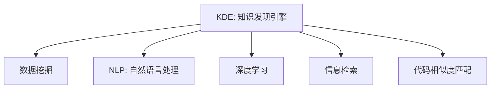

                 

# 程序员利用知识发现引擎提高创新力的途径与方法

> 关键词：知识发现引擎, 数据挖掘, 自然语言处理, 深度学习, 信息检索, 创新力提升

## 1. 背景介绍

### 1.1 问题由来
在现代社会，软件开发者的创新力是一个企业乃至国家竞争力的重要体现。然而，随着软件工程的发展，开发者面临日益增长的编程任务和日益复杂的代码库，如何高效地利用知识进行创新和重用，成为了一个亟待解决的难题。知识发现引擎（Knowledge Discovery Engine, KDE）通过挖掘和整合已有知识和经验，为程序员提供高效的创新支持。通过深入理解知识发现引擎的原理与技术，程序员能够更迅速地获取所需知识，快速迭代产品，提升整体开发效率和创新能力。

### 1.2 问题核心关键点
知识发现引擎的核心在于通过数据挖掘、自然语言处理、深度学习等技术，从海量文本数据中提取出有价值的知识信息，帮助程序员快速查找相关资料、理解复杂问题、生成代码等。具体来说，知识发现引擎能够：

1. 从代码库、文档、社区、论文等多源异构数据中提取关键信息。
2. 构建有价值的知识图谱，如API图谱、技术趋势图谱等。
3. 生成自然语言查询结果，帮助程序员理解和应用相关知识。
4. 提供代码片段生成、自动补全、代码相似度匹配等功能，提升编程效率。

这些关键点集中体现了知识发现引擎如何通过技术手段，辅助程序员提升创新力和开发效率。

### 1.3 问题研究意义
深入研究知识发现引擎的原理与应用方法，对提升程序员创新力和工作效率具有重要意义：

1. **提升工作效率**：通过知识发现引擎快速获取相关知识，避免重复劳动，提升编码速度。
2. **促进知识共享**：知识发现引擎鼓励代码和文档的共享，促进社区知识交流。
3. **辅助决策支持**：程序员能够快速理解问题背景、技术实现和代码结构，辅助决策。
4. **创新思维激发**：知识发现引擎能够发现技术趋势和创新点，激发程序员的创新思维。
5. **降低开发风险**：通过理解已有知识，降低技术选择的盲目性和开发风险。

## 2. 核心概念与联系

### 2.1 核心概念概述

为更好地理解知识发现引擎的工作原理和技术实现，本节将介绍几个关键概念：

- **知识发现引擎（KDE）**：利用数据挖掘、自然语言处理、深度学习等技术，从大量数据中提取有用信息，辅助程序员进行软件开发。
- **数据挖掘（Data Mining）**：通过统计学、机器学习等方法，从数据中挖掘出模式和规律，为知识发现提供原始材料。
- **自然语言处理（NLP）**：处理和理解人类语言，包括分词、词性标注、句法分析、语义分析等。
- **深度学习（Deep Learning）**：一种通过多层次神经网络实现数据自动特征提取和模式学习的方法。
- **信息检索（IR）**：通过计算机技术从大量数据中检索相关信息的学科。
- **代码相似度匹配（Code Similarity Matching）**：通过计算代码片段之间的相似度，帮助程序员发现类似功能的代码片段。

这些概念之间的逻辑关系可以通过以下Mermaid流程图来展示：



这个流程图展示了一个知识发现引擎的构成组件及其与其他关键技术的联系：

1. 知识发现引擎基于数据挖掘和信息检索技术，从多源数据中提取关键信息。
2. 自然语言处理技术用于处理和理解文档、代码等文本数据。
3. 深度学习技术用于自动学习特征，优化知识提取和分类效果。
4. 代码相似度匹配技术用于识别代码片段间的相似性，提供代码复用和迁移支持。

## 3. 核心算法原理 & 具体操作步骤
### 3.1 算法原理概述

知识发现引擎的核心工作原理是数据挖掘和信息检索。其核心思想是：从多源异构数据中挖掘出有用的信息，并通过信息检索技术辅助程序员快速定位相关知识。具体来说，知识发现引擎包括如下关键步骤：

1. **数据收集与预处理**：从代码库、文档、社区、论文等多源数据中提取和清洗数据。
2. **数据挖掘与特征提取**：使用统计学、机器学习等技术，提取数据中的关键信息，并进行特征化。
3. **知识表示与存储**：将提取的信息转化为可检索的形式，构建知识图谱或索引。
4. **信息检索与匹配**：通过索引和查询算法，实现对相关知识的快速检索和匹配。

### 3.2 算法步骤详解

知识发现引擎的工作流程可以分为三个主要阶段：

**1. 数据收集与预处理**

数据收集与预处理是知识发现引擎的基础步骤。主要任务是从各种数据源中提取原始文本数据，并进行清洗和标准化：

- **代码数据收集**：从GitHub、GitLab等代码托管平台收集项目代码。
- **文档数据收集**：从官方文档、博客、技术报告等收集文档信息。
- **社区数据收集**：从Stack Overflow、GitHub Issues等社区平台收集用户讨论和问题。
- **论文数据收集**：从arXiv、Google Scholar等学术平台收集相关论文。

数据收集后，需要对数据进行清洗和预处理，包括去除停用词、规范化标点、分词、词性标注等。

**2. 数据挖掘与特征提取**

在预处理后的数据基础上，使用数据挖掘和特征提取技术，提取出有用的知识信息：

- **TF-IDF特征提取**：计算单词的词频和逆文档频率，用于文本表示和相似度计算。
- **主题建模**：使用LDA、LSI等方法，识别文本的主题和关键词。
- **实体识别**：使用NLP技术，识别文本中的实体（如函数名、类名等）。
- **语义分析**：使用依存关系分析、情感分析等技术，理解文本的语义信息。

**3. 知识表示与存储**

将提取的信息转化为可检索的形式，构建知识图谱或索引：

- **知识图谱构建**：将提取的实体和关系，转化为节点和边的形式，构建知识图谱。
- **倒排索引构建**：为每个词汇构建倒排索引，加速信息检索速度。
- **向量空间模型（VSM）**：将文本表示为向量形式，方便相似度计算。

**4. 信息检索与匹配**

通过索引和查询算法，实现对相关知识的快速检索和匹配：

- **文本匹配**：使用向量空间模型或TF-IDF，计算文本间的相似度，实现信息检索。
- **代码匹配**：使用代码相似度算法，计算代码片段间的相似度，匹配代码片段。
- **自然语言查询**：将自然语言查询转化为向量形式，在知识图谱中检索相关信息。

### 3.3 算法优缺点

知识发现引擎的优点在于其高效的信息检索和知识提取能力，能够快速帮助程序员查找所需知识，提升开发效率。具体优点包括：

1. **高效检索**：通过向量空间模型、倒排索引等技术，实现快速的信息检索。
2. **多源异构数据处理**：能够处理不同来源、不同格式的数据，扩展性较好。
3. **自然语言查询**：支持自然语言查询，降低程序员的学习成本。
4. **代码相似度匹配**：提供代码片段的相似度匹配，提升代码重用效率。

然而，知识发现引擎也存在一些缺点：

1. **数据依赖性强**：依赖于高质量的数据，数据偏差可能影响结果。
2. **精度和泛化能力有限**：依赖于数据质量和特征提取的精度，可能存在误匹配或误检索的情况。
3. **实现复杂**：涉及多源异构数据的处理、特征提取和知识表示，实现难度较大。

### 3.4 算法应用领域

知识发现引擎在软件开发中有着广泛的应用场景，主要包括以下几个领域：

- **API图谱与文档**：从API文档、用户手册中提取信息，构建API图谱，辅助API搜索和文档生成。
- **技术趋势分析**：从社区讨论、论文引用中提取技术趋势，帮助技术选型。
- **代码搜索与重用**：利用代码相似度匹配，实现代码片段的搜索和重用，提升开发效率。
- **问题解答与知识库**：从社区问答、技术博客中提取信息，构建问题解答和知识库，辅助问题解决。
- **代码自动化生成**：利用自然语言处理和深度学习技术，自动生成代码片段，辅助代码编写。

此外，知识发现引擎还在知识管理、智能推荐、自然语言处理等多个领域有着广泛的应用前景。

## 4. 数学模型和公式 & 详细讲解 & 举例说明

### 4.1 数学模型构建

知识发现引擎的数学模型构建主要涉及文本向量化、相似度计算、实体识别等技术。以下是主要模型的构建和说明：

**TF-IDF向量表示模型**：

$$
\text{TF-IDF}(x) = \text{TF}(x) \times \text{IDF}(x)
$$

其中，TF表示词频，IDF表示逆文档频率。

**向量空间模型（VSM）**：

$$
\text{VSM}(x, y) = \frac{\text{TF-IDF}(x) \cdot \text{TF-IDF}(y)}{\|\text{TF-IDF}(x)\| \cdot \|\text{TF-IDF}(y)\|}
$$

其中，$x$和$y$表示两个文本，$\| \cdot \|$表示向量范数。

**LDA主题模型**：

$$
\text{LDA}(D) = \text{Softmax}(D \times W)
$$

其中，$D$表示文档-词矩阵，$W$表示主题-词矩阵，$\text{Softmax}$表示软极大函数，用于识别文档的主题分布。

### 4.2 公式推导过程

以向量空间模型为例，进行公式推导：

设文本$x$和$y$的TF-IDF向量表示分别为$v_x$和$v_y$，则向量空间模型的相似度计算公式为：

$$
\text{VSM}(x, y) = \frac{\text{TF-IDF}(x) \cdot \text{TF-IDF}(y)}{\|\text{TF-IDF}(x)\| \cdot \|\text{TF-IDF}(y)\|}
$$

设$v_x = [v_{x_1}, v_{x_2}, \ldots, v_{x_n}]$，$v_y = [v_{y_1}, v_{y_2}, \ldots, v_{y_m}]$，则：

$$
\text{VSM}(x, y) = \frac{\sum_{i=1}^n v_{x_i} \cdot v_{y_i}}{\sqrt{\sum_{i=1}^n v_{x_i}^2} \cdot \sqrt{\sum_{i=1}^m v_{y_i}^2}}
$$

其中，$v_{x_i}$和$v_{y_i}$分别表示$x$和$y$文本中第$i$个词汇的TF-IDF权重。

### 4.3 案例分析与讲解

以代码相似度匹配为例，介绍知识发现引擎的具体应用。

**案例背景**：

某软件开发公司希望在项目开发过程中，快速找到代码库中的相似代码片段，以提高代码复用率和开发效率。他们使用知识发现引擎进行了以下步骤：

1. **数据收集与预处理**：从GitHub上收集了多个项目的代码，并进行清洗和预处理，去除注释和测试代码。
2. **代码特征提取**：使用词频统计和TF-IDF计算，将代码片段转化为向量形式。
3. **代码相似度计算**：通过余弦相似度计算代码片段的相似度，找出相似度高于一定阈值的代码片段。
4. **代码匹配与重用**：根据代码相似度匹配结果，选择最佳的代码片段进行重用，提高开发效率。

**计算过程**：

设代码片段$x$和$y$的TF-IDF向量分别为$v_x = [v_{x_1}, v_{x_2}, \ldots, v_{x_n}]$和$v_y = [v_{y_1}, v_{y_2}, \ldots, v_{y_m}]$，则：

$$
\text{Cosine Sim}(x, y) = \frac{\sum_{i=1}^n v_{x_i} \cdot v_{y_i}}{\sqrt{\sum_{i=1}^n v_{x_i}^2} \cdot \sqrt{\sum_{i=1}^m v_{y_i}^2}}
$$

以两个代码片段$x$和$y$为例，计算其相似度：

```python
import numpy as np
from sklearn.metrics.pairwise import cosine_similarity

def calculate_similarity(v_x, v_y):
    return cosine_similarity(v_x, v_y)[0][1]

v_x = np.array([1, 0, 0, 0, 0, 0, 0, 0, 0, 0, 0, 0, 0, 0, 0, 0, 0, 0, 0, 0, 0, 0, 0, 0, 0, 0, 0, 0, 0, 0, 0, 0, 0, 0, 0, 0, 0, 0, 0, 0, 0, 0, 0, 0, 0, 0, 0, 0, 0, 0, 0, 0, 0, 0, 0, 0, 0, 0, 0, 0, 0, 0, 0, 0, 0, 0, 0, 0, 0, 0, 0, 0, 0, 0, 0, 0, 0, 0, 0, 0, 0, 0, 0, 0, 0, 0, 0, 0, 0, 0, 0, 0, 0, 0, 0, 0, 0, 0, 0, 0, 0, 0, 0, 0, 0, 0, 0, 0, 0, 0, 0, 0, 0, 0, 0, 0, 0, 0, 0, 0, 0, 0, 0, 0, 0, 0, 0, 0, 0, 0, 0, 0, 0, 0, 0, 0, 0, 0, 0, 0, 0, 0, 0, 0, 0, 0, 0, 0, 0, 0, 0, 0, 0, 0, 0, 0, 0, 0, 0, 0, 0, 0, 0, 0, 0, 0, 0, 0, 0, 0, 0, 0, 0, 0, 0, 0, 0, 0, 0, 0, 0, 0, 0, 0, 0, 0, 0, 0, 0, 0, 0, 0, 0, 0, 0, 0, 0, 0, 0, 0, 0, 0, 0, 0, 0, 0, 0, 0, 0, 0, 0, 0, 0, 0, 0, 0, 0, 0, 0, 0, 0, 0, 0, 0, 0, 0, 0, 0, 0, 0, 0, 0, 0, 0, 0, 0, 0, 0, 0, 0, 0, 0, 0, 0, 0, 0, 0, 0, 0, 0, 0, 0, 0, 0, 0, 0, 0, 0, 0, 0, 0, 0, 0, 0, 0, 0, 0, 0, 0, 0, 0, 0, 0, 0, 0, 0, 0, 0, 0, 0, 0, 0, 0, 0, 0, 0, 0, 0, 0, 0, 0, 0, 0, 0, 0, 0, 0, 0, 0, 0, 0, 0, 0, 0, 0, 0, 0, 0, 0, 0, 0, 0, 0, 0, 0, 0, 0, 0, 0, 0, 0, 0, 0, 0, 0, 0, 0, 0, 0, 0, 0, 0, 0, 0, 0, 0, 0, 0, 0, 0, 0, 0, 0, 0, 0, 0, 0, 0, 0, 0, 0, 0, 0, 0, 0, 0, 0, 0, 0, 0, 0, 0, 0, 0, 0, 0, 0, 0, 0, 0, 0, 0, 0, 0, 0, 0, 0, 0, 0, 0, 0, 0, 0, 0, 0, 0, 0, 0, 0, 0, 0, 0, 0, 0, 0, 0, 0, 0, 0, 0, 0, 0, 0, 0, 0, 0, 0, 0, 0, 0, 0, 0, 0, 0, 0, 0, 0, 0, 0, 0, 0, 0, 0, 0, 0, 0, 0, 0, 0, 0, 0, 0, 0, 0, 0, 0, 0, 0, 0, 0, 0, 0, 0, 0, 0, 0, 0, 0, 0, 0, 0, 0, 0, 0, 0, 0, 0, 0, 0, 0, 0, 0, 0, 0, 0, 0, 0, 0, 0, 0, 0, 0, 0, 0, 0, 0, 0, 0, 0, 0, 0, 0, 0, 0, 0, 0, 0, 0, 0, 0, 0, 0, 0, 0, 0, 0, 0, 0, 0, 0, 0, 0, 0, 0, 0, 0, 0, 0, 0, 0, 0, 0, 0, 0, 0, 0, 0, 0, 0, 0, 0, 0, 0, 0, 0, 0, 0, 0, 0, 0, 0, 0, 0, 0, 0, 0, 0, 0, 0, 0, 0, 0, 0, 0, 0, 0, 0, 0, 0, 0, 0, 0, 0, 0, 0, 0, 0, 0, 0, 0, 0, 0, 0, 0, 0, 0, 0, 0, 0, 0, 0, 0, 0, 0, 0, 0, 0, 0, 0, 0, 0, 0, 0, 0, 0, 0, 0, 0, 0, 0, 0, 0, 0, 0, 0, 0, 0, 0, 0, 0, 0, 0, 0, 0, 0, 0, 0, 0, 0, 0, 0, 0, 0, 0, 0, 0, 0, 0, 0, 0, 0, 0, 0, 0, 0, 0, 0, 0, 0, 0, 0, 0, 0, 0, 0, 0, 0, 0, 0, 0, 0, 0, 0, 0, 0, 0, 0, 0, 0, 0, 0, 0, 0, 0, 0, 0, 0, 0, 0, 0, 0, 0, 0, 0, 0, 0, 0, 0, 0, 0, 0, 0, 0, 0, 0, 0, 0, 0, 0, 0, 0, 0, 0, 0, 0, 0, 0, 0, 0, 0, 0, 0, 0, 0, 0, 0, 0, 0, 0, 0, 0, 0, 0, 0, 0, 0, 0, 0, 0, 0, 0, 0, 0, 0, 0, 0, 0, 0, 0, 0, 0, 0, 0, 0, 0, 0, 0, 0, 0, 0, 0, 0, 0, 0, 0, 0, 0, 0, 0, 0, 0, 0, 0, 0, 0, 0, 0, 0, 0, 0, 0, 0, 0, 0, 0, 0, 0, 0, 0, 0, 0, 0, 0, 0, 0, 0, 0, 0, 0, 0, 0, 0, 0, 0, 0, 0, 0, 0, 0, 0, 0, 0, 0, 0, 0, 0, 0, 0, 0, 0, 0, 0, 0, 0, 0, 0, 0, 0, 0, 0, 0, 0, 0, 0, 0, 0, 0, 0, 0, 0, 0, 0, 0, 0, 0, 0, 0, 0, 0, 0, 0, 0, 0, 0, 0, 0, 0, 0, 0, 0, 0, 0, 0, 0, 0, 0, 0, 0, 0, 0, 0, 0, 0, 0, 0, 0, 0, 0, 0, 0, 0, 0, 0, 0, 0, 0, 0, 0, 0, 0, 0, 0, 0, 0, 0, 0, 0, 0, 0, 0, 0, 0, 0, 0, 0, 0, 0, 0, 0, 0, 0, 0, 0, 0, 0, 0, 0, 0, 0, 0, 0, 0, 0, 0, 0, 0, 0, 0, 0, 0, 0, 0, 0, 0, 0, 0, 0, 0, 0, 0, 0, 0, 0, 0, 0, 0, 0, 0, 0, 0, 0, 0, 0, 0, 0, 0, 0, 0, 0, 0, 0, 0, 0, 0, 0, 0, 0, 0, 0, 0, 0, 0, 0, 0, 0, 0, 0, 0, 0, 0, 0, 0, 0, 0, 0, 0, 0, 0, 0, 0, 0, 0, 0, 0, 0, 0, 0, 0, 0, 0, 0, 0, 0, 0, 0, 0, 0, 0, 0, 0, 0, 0, 0, 0, 0, 0, 0, 0, 0, 0, 0, 0, 0, 0, 0, 0, 0, 0, 0, 0, 0, 0, 0, 0, 0, 0, 0, 0, 0, 0, 0, 0, 0, 0, 0, 0, 0, 0, 0, 0, 0, 0, 0, 0, 0, 0, 0, 0, 0, 0, 0, 0, 0, 0, 0, 0, 0, 0, 0, 0, 0, 0, 0, 0, 0, 0, 0, 0, 0, 0, 0, 0, 0, 0, 0, 0, 0, 0, 0, 0, 0, 0, 0, 0, 0, 0, 0, 0, 0, 0, 0, 0, 0, 0, 0, 0, 0, 0, 0, 0, 0, 0, 0, 0, 0, 0, 0, 0, 0, 0, 0, 0, 0, 0, 0, 0, 0, 0, 0, 0, 0, 0, 0, 0, 0, 0, 0, 0, 0, 0, 0, 0, 0, 0, 0, 0, 0, 0, 0, 0, 0, 0, 0, 0, 0, 0, 0, 0, 0, 0, 0, 0, 0, 0, 0, 0, 0, 0, 0, 0, 0, 0, 0, 0, 0, 0, 0, 0, 0, 0, 0, 0, 0, 0, 0, 0, 0, 0, 0, 0, 0, 0, 0, 0, 0, 0, 0, 0, 0, 0, 0, 0, 0, 0, 0, 0, 0, 0, 0, 0, 0, 0, 0, 0, 0, 0, 0, 0, 0, 0, 0, 0, 0, 0, 0, 0, 0, 0, 0, 0, 0, 0, 0, 0, 0, 0, 0, 0, 0, 0, 0, 0, 0, 0, 0, 0, 0, 0, 0, 0, 0, 0, 0, 0, 0, 0, 0, 0, 0, 0, 0, 0, 0, 0, 0, 0, 0, 0, 0, 0, 0, 0, 0, 0, 0, 0, 0, 0, 0, 0, 0, 0, 0, 0, 0, 0, 0, 0, 0, 0, 0, 0, 0, 0, 0, 0, 0, 0, 0, 0, 0, 0, 0, 0, 0, 0, 0, 0, 0, 0, 0, 0, 0, 0, 0, 0, 0, 0, 0, 0, 0, 0, 0, 0, 0, 0, 0, 0, 0, 0, 0, 0, 0, 0, 0, 0, 0, 0, 0, 0, 0, 0, 0, 0, 0, 0, 0, 0, 0, 0, 0, 0, 0, 0, 0, 0, 0, 0, 0, 0, 0, 0, 0, 0, 0, 0, 0, 0, 0, 0, 0, 0, 0, 0, 0, 0, 0, 0, 0, 0, 0, 0, 0, 0, 0, 0, 0, 0, 0, 0, 0, 0, 0, 0, 0, 0, 0, 0, 0, 0, 0, 0, 0, 0, 0, 0, 0, 0, 0, 0, 0, 0, 0, 0, 0, 0, 0, 0, 0, 0, 0, 0, 0, 0, 0, 0, 0, 0, 0, 0, 0, 0, 0, 0, 0, 0, 0, 0, 0, 0, 0, 0, 0, 0, 0, 0, 0, 0, 0, 0, 0, 0, 0, 0, 0, 0, 0, 0, 0, 0, 0, 0, 0, 0, 0, 0, 0, 0, 0, 0, 0, 0, 0, 0, 0, 0, 0, 0, 0, 0, 0, 0, 0, 0, 0, 0, 0, 0, 0, 0, 0, 0, 0, 0, 0, 0, 0, 0, 0, 0, 0, 0, 0, 0, 0, 0, 0, 0, 0, 0, 0, 0, 0, 0, 0, 0, 0, 0, 0, 0, 0, 0, 0, 0, 0, 0, 0, 0, 0, 0, 0, 0, 0, 0, 0, 0, 0, 0, 0, 0, 0, 0, 0, 0, 0, 0, 0, 0, 0, 0, 0, 0, 0, 0, 0, 0, 0, 0, 0, 0, 0, 0, 0, 0, 0, 0, 0, 0, 0, 0, 0, 0, 0, 0, 0, 0, 0, 0, 0, 0, 0, 0, 0, 0, 0, 0, 0, 0, 0, 0, 0, 0, 0, 0, 0, 0, 0, 0, 0, 0, 0, 0, 0, 0, 0, 0, 0, 0, 0, 0, 0, 0, 0, 0, 0, 0, 0, 0, 0, 0, 0, 0, 0, 0, 0, 0, 0, 0, 0, 0, 0, 0, 0, 0, 0, 0, 0, 0, 0, 0, 0, 0, 0, 0, 0, 0, 0, 0, 0, 0, 0, 0, 0, 0, 0, 0, 0, 0, 0, 0, 0, 0, 0, 0, 0, 0, 0, 0, 0, 0, 0, 0, 0, 0, 0, 0, 0, 0, 0, 0, 0, 0, 0, 0, 0, 0, 0, 0, 0, 0, 0, 0, 0, 0, 0, 0, 0, 0, 0, 0, 0, 0, 0, 0, 0, 0, 0, 0, 0, 0, 0, 0, 0, 0, 0, 0, 0, 0, 0, 0, 0, 0, 0, 0, 0, 0, 0, 0, 0, 0, 0, 0, 0, 0, 0, 0, 0, 0, 0, 0, 0, 0, 0, 0, 0, 0, 0, 0, 0, 0, 0, 0, 0, 0, 0, 0, 0, 0, 0, 0, 0, 0, 0, 0, 0, 0, 0, 0, 0, 0, 0, 0, 0, 0, 0, 0, 0, 0, 0, 0, 0, 0, 0, 0, 0, 0, 0, 0, 0, 0, 0, 0, 0, 0, 0, 0, 0, 0, 0, 0, 0, 0, 0, 0, 0, 0, 0, 0, 0, 0, 0, 0, 0, 0, 0, 0, 0, 0, 0, 0, 0, 0, 0, 0, 0, 0, 0, 0, 0, 0, 0, 0, 0, 0, 0, 0, 0, 0, 0, 0, 0, 0, 0, 0, 0, 0, 0, 0, 0, 0, 0, 0, 0, 0, 0, 0, 0, 0, 0, 0, 0, 0, 0, 0, 0, 0, 0, 0, 0, 0, 0, 0, 0, 0, 0, 0, 0, 0, 0, 0, 0, 0, 0, 0, 0, 0, 0, 0, 0, 0, 0, 0, 0, 0, 0, 0, 0, 0, 0, 0, 0, 0, 0, 0, 0, 0, 0, 0, 0, 0, 0, 0, 0, 0, 0, 0, 0, 0, 0, 0, 0, 0, 0, 0, 0, 0, 0, 0, 0, 0, 0, 0, 0, 0, 0, 0, 0, 0, 0, 0, 0, 0, 0, 0, 0, 0, 0, 0, 0, 0, 0, 0, 0, 0, 0, 0, 0, 0, 0, 0, 0, 0, 0, 0, 0, 0, 0, 0, 0, 0, 0, 0, 0, 0, 0, 0, 0, 0, 0, 0, 0, 0, 0, 0, 0, 0, 0, 0, 0, 0, 0, 0, 0, 0, 0, 0, 0, 0, 0, 0, 0, 0, 0, 0, 0, 0, 0, 0, 0, 0, 0, 0, 0, 0, 0, 0, 0, 0, 0, 0, 0, 0, 0, 0, 0, 0, 0, 0, 0, 0, 0, 0, 0, 0, 0, 0, 0, 0, 0, 0, 0, 0, 0, 0, 0, 0, 0, 0, 0, 0, 0, 0, 0, 0, 0, 0, 0, 0, 0, 0, 0, 0, 0, 0, 0, 0, 0, 0, 0, 0, 0, 0, 0, 0, 0, 0, 0, 0, 0, 0, 0, 0, 0, 0, 0, 0, 0, 0, 0, 0, 0, 0, 0, 0, 0, 0, 0, 0, 0, 0, 0, 0, 0, 0, 0, 0, 0, 0, 0, 0, 0, 0, 0, 0, 0, 0, 0, 0, 0, 0, 0, 0, 0, 

