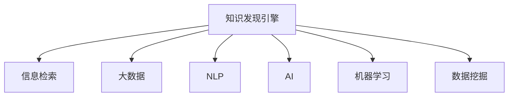

                 

# 程序员利用知识发现引擎提高学习效率的方法

> 关键词：知识发现引擎, 信息检索, 大数据, 自然语言处理(NLP), 人工智能, 机器学习, 数据挖掘

## 1. 背景介绍

### 1.1 问题由来
在快速发展的IT行业中，技术更新迭代周期不断缩短，作为一名程序员，持续学习和适应新技术是职业生涯的必由之路。然而，面对海量的技术文档、博客、论文和开源代码，如何在有限的时间里，高效地掌握新知识，成为每个程序员的难题。传统依靠搜索、浏览和阅读的方式，难以应对知识爆炸的挑战。

### 1.2 问题核心关键点
知识的获取、理解和应用是程序员工作中最重要的环节之一。如何更有效地从海量知识中发现并利用这些信息，成为提升学习效率的关键。知识发现引擎作为新兴的技术工具，正逐渐成为程序员学习和提升自我能力的有力助手。

知识发现引擎（Knowledge Discovery Engine, KDE）是一种基于大数据分析和人工智能的技术，能够自动地从大量非结构化数据中提取有用信息，并为用户提供个性化的知识推荐服务。通过分析程序员的阅读习惯和搜索行为，KDE能够推荐最相关和最有价值的技术文档、课程、教程和开源代码，从而大大提高学习效率和成果产出。

## 2. 核心概念与联系

### 2.1 核心概念概述

为更好地理解知识发现引擎如何帮助程序员提高学习效率，本节将介绍几个密切相关的核心概念：

- **知识发现引擎(KDE)**：利用数据挖掘、机器学习和自然语言处理等技术，从大量非结构化数据中提取有用信息，提供个性化知识推荐服务。
- **信息检索(Information Retrieval, IR)**：一种从文本数据中检索与查询相关的信息的技术，旨在快速定位到用户需要的信息。
- **大数据(Big Data)**：指数量庞大、种类繁多、高速增长、价值密度低、真实性高的数据集合，通过大数据分析技术可以揭示知识之间的关联性和规律性。
- **自然语言处理(NLP)**：研究如何让计算机理解、处理和生成自然语言的技术，是知识发现引擎的核心组成部分之一。
- **人工智能(AI)**：通过机器学习、深度学习和强化学习等技术，模拟人类智能行为，为知识发现和推荐提供智能决策支持。
- **机器学习(Machine Learning)**：一种利用数据和算法模型，从数据中学习规律，提升决策能力的技术，是知识发现引擎的重要技术基础。
- **数据挖掘(Data Mining)**：从大量数据中自动地发现有用信息和知识的技术，为知识发现引擎提供数据处理和分析能力。

这些核心概念之间的逻辑关系可以通过以下Mermaid流程图来展示：



这个流程图展示的知识发现引擎的核心概念及其之间的关系：

1. 知识发现引擎通过信息检索、大数据分析、自然语言处理、人工智能和机器学习等技术，自动从大量数据中提取有用的知识信息。
2. 信息检索和NLP技术，帮助搜索引擎快速定位到相关性最高的文档和资源。
3. 大数据和数据挖掘技术，提供数据处理和分析能力，帮助识别数据中的规律和趋势。
4. 机器学习和AI技术，通过智能算法对数据进行建模和预测，提升知识推荐的效果。

## 3. 核心算法原理 & 具体操作步骤
### 3.1 算法原理概述

知识发现引擎的核心算法原理包括数据预处理、特征提取、模型训练和推荐排序等几个关键步骤。以下是详细介绍：

- **数据预处理**：对原始数据进行清洗、归一化和标注等处理，以便于后续分析和建模。
- **特征提取**：从处理后的数据中提取有用的特征，如文本的TF-IDF值、关键词分布、文档长度、作者信誉等。
- **模型训练**：利用机器学习算法，如协同过滤、分类算法、深度学习等，对提取的特征进行建模，学习用户偏好和文档相关性。
- **推荐排序**：根据模型训练得到的用户偏好和文档相关性，对推荐结果进行排序，选择最符合用户需求的文档进行推荐。

### 3.2 算法步骤详解

知识发现引擎的具体操作步骤如下：

**Step 1: 数据采集与清洗**
- 采集程序员使用的技术文档、博客、论文、开源代码等非结构化数据。
- 清洗数据，去除噪声、重复和无关信息，确保数据的准确性和一致性。

**Step 2: 特征提取**
- 对清洗后的文档进行文本分析，提取关键词、TF-IDF值、作者信誉等特征。
- 对开源代码，提取文件结构、函数调用关系、代码质量等特征。

**Step 3: 用户建模**
- 分析程序员的搜索历史、阅读行为和互动记录，建立用户画像。
- 通过协同过滤、用户兴趣分类等方法，预测用户对不同文档的评分和偏好。

**Step 4: 文档建模**
- 使用TF-IDF、词嵌入等方法对文档进行特征提取。
- 应用机器学习算法，如SVM、随机森林、深度学习等，建立文档-文档的相似性模型。

**Step 5: 推荐排序**
- 根据用户偏好和文档相关性，使用排序算法（如Top-k排序、加权排序等）对推荐结果进行排序。
- 将排序后的文档呈现给用户，并提供交互反馈机制，进一步优化推荐模型。

### 3.3 算法优缺点

知识发现引擎具有以下优点：
1. **个性化推荐**：根据用户行为和兴趣，提供高度个性化的知识推荐，提升学习效率。
2. **智能筛选**：自动分析海量数据，过滤无关信息，减少无效学习时间。
3. **知识结构化**：通过分类、标签等手段，帮助程序员理清知识脉络，形成结构化的知识体系。
4. **交互反馈**：提供反馈机制，根据用户反馈不断优化推荐算法，提高推荐精度。

同时，该方法也存在一定的局限性：
1. **数据质量依赖**：知识发现引擎的效果很大程度上依赖于原始数据的准确性和完整性。
2. **计算成本高**：大规模数据的处理和建模需要高性能计算资源，对硬件要求较高。
3. **解释性不足**：推荐算法的黑盒特性，使得其内部决策过程难以解释和调试。
4. **隐私问题**：需要收集和分析用户行为数据，涉及隐私保护和伦理问题。

尽管存在这些局限性，但知识发现引擎在实际应用中仍具有显著优势，被广泛应用于技术社区、在线教育平台和软件开发工具中。

### 3.4 算法应用领域

知识发现引擎已经在多个领域得到了广泛应用，例如：

- 技术社区：如Stack Overflow、GitHub等，推荐相关的技术文章、代码片段和开源项目。
- 在线教育平台：如Udemy、Coursera等，推荐课程、视频教程和学习资源。
- 软件开发工具：如JIRA、Jenkins等，推荐最佳实践、代码规范和开发工具。

除了上述这些经典应用外，知识发现引擎还被创新性地应用到更多场景中，如知识图谱构建、智能问答系统、推荐系统优化等，为程序员的学习和工作提供了新的工具和支持。

## 4. 数学模型和公式 & 详细讲解  
### 4.1 数学模型构建

知识发现引擎的数学模型构建涉及多个步骤，以下以推荐系统的协同过滤为例，介绍其基本框架：

设用户集合为 $U$，文档集合为 $I$，用户-文档评分矩阵为 $R \in \mathbb{R}^{n \times m}$，其中 $n$ 为用户数，$m$ 为文档数。推荐算法目标是在给定用户 $u$ 时，预测其对文档 $i$ 的评分 $r_{ui}$，并将其排序后推荐给用户。

协同过滤算法基于用户行为数据，假设每个用户 $u$ 的兴趣由其评分矩阵 $R_u$ 描述，即 $R_u = \sum_{v \in U} R_{uv}$。同时，假设每个文档 $i$ 的受欢迎程度由其评分向量 $V_i$ 描述，即 $V_i = \sum_{u \in U} R_{ui}$。则推荐算法的目标是最小化预测评分与实际评分之间的差异：

$$
\min_{\theta} \sum_{u \in U} \sum_{i \in I} (r_{ui} - f_{\theta}(u,i))^2
$$

其中 $f_{\theta}(u,i)$ 为预测函数，可以采用多种模型，如矩阵分解、奇异值分解等。

### 4.2 公式推导过程

以下我们以矩阵分解为例，推导协同过滤算法的预测函数 $f_{\theta}(u,i)$ 及其梯度计算公式。

设用户向量 $U \in \mathbb{R}^n$ 和文档向量 $V \in \mathbb{R}^m$，预测函数可以表示为：

$$
f_{\theta}(u,i) = U_u \cdot V_i = \theta_{uu} \cdot \theta_{ii}
$$

其中 $\theta$ 为矩阵分解得到的权重矩阵，$\theta_{uu}$ 和 $\theta_{ii}$ 分别表示用户和文档的隐向量。

预测函数的梯度计算公式为：

$$
\nabla_{\theta} f_{\theta}(u,i) = \frac{\partial f_{\theta}(u,i)}{\partial \theta_{uu}} \cdot V_i + U_u \cdot \frac{\partial f_{\theta}(u,i)}{\partial \theta_{ii}}
$$

通过反向传播算法，可以高效地计算预测函数的梯度，并更新权重矩阵 $\theta$。

### 4.3 案例分析与讲解

以下以一个简单的例子，说明知识发现引擎如何在实际场景中应用：

假设程序员A正在学习Python编程，对机器学习感兴趣。知识发现引擎根据A的历史阅读记录和搜索行为，提取关键词如“Python”、“机器学习”、“TensorFlow”等，并分析A对相关文档的评分和偏好。同时，对所有相关的技术文档进行特征提取和建模，如提取TF-IDF值、关键词分布、文档长度等。

根据协同过滤算法，知识发现引擎可以预测A对未读文档的评分，并选择评分最高的文档推荐给A。例如，它可能会推荐一篇介绍TensorFlow基础教程的文档，一篇比较不同深度学习框架的对比文章，以及一篇Python编程最佳实践指南。A在阅读这些文档后，会提供评分反馈，进一步优化推荐模型，提高后续推荐的准确性。

## 5. 项目实践：代码实例和详细解释说明
### 5.1 开发环境搭建

在进行知识发现引擎的实践前，我们需要准备好开发环境。以下是使用Python进行TensorFlow开发的环境配置流程：

1. 安装Anaconda：从官网下载并安装Anaconda，用于创建独立的Python环境。

2. 创建并激活虚拟环境：
```bash
conda create -n tf-env python=3.8 
conda activate tf-env
```

3. 安装TensorFlow：根据CUDA版本，从官网获取对应的安装命令。例如：
```bash
conda install tensorflow -c tf -c conda-forge
```

4. 安装各类工具包：
```bash
pip install pandas numpy sklearn matplotlib
```

完成上述步骤后，即可在`tf-env`环境中开始知识发现引擎的实践。

### 5.2 源代码详细实现

下面我们以协同过滤推荐系统为例，给出使用TensorFlow实现的知识发现引擎代码实现。

首先，定义推荐系统的数据处理函数：

```python
import tensorflow as tf
from tensorflow.keras.layers import Input, Embedding, Dot, Dense

# 定义输入层
user_input = Input(shape=(n,), name='user_input')
doc_input = Input(shape=(m,), name='doc_input')

# 定义用户向量和文档向量
user_embed = Embedding(n, k, input_length=n)(user_input)
doc_embed = Embedding(m, k, input_length=m)(doc_input)

# 定义预测函数
dot_product = Dot(axes=[2, 2])([user_embed, doc_embed])
prediction = Dense(1)(dot_product)

# 定义损失函数和优化器
loss = tf.keras.losses.MeanSquaredError()
optimizer = tf.keras.optimizers.Adam()

# 定义推荐函数
def recommend(user_vec, doc_vec):
    pred = prediction(user_vec, doc_vec)
    return tf.argmax(pred, axis=1)
```

然后，定义训练和评估函数：

```python
# 定义训练函数
def train(model, train_data, validation_data, epochs=10):
    model.compile(optimizer=optimizer, loss=loss)
    model.fit(train_data, epochs=epochs, validation_data=validation_data)

# 定义评估函数
def evaluate(model, test_data):
    predictions = model.predict(test_data)
    return predictions
```

最后，启动训练流程并在测试集上评估：

```python
# 加载训练和测试数据
train_data = ...
validation_data = ...
test_data = ...

# 构建推荐模型
model = tf.keras.models.Sequential()
model.add(user_embed)
model.add(dot_product)
model.add(prediction)

# 训练模型
train(model, train_data, validation_data)

# 在测试集上评估
predictions = evaluate(model, test_data)
```

以上就是使用TensorFlow对协同过滤推荐系统进行知识发现引擎的完整代码实现。可以看到，TensorFlow提供了丰富的机器学习组件和优化算法，使得知识发现引擎的开发和实验变得相对简单高效。

### 5.3 代码解读与分析

让我们再详细解读一下关键代码的实现细节：

**Input层**：
- 定义用户输入和文档输入的占位符，分别用于存储用户ID和文档ID。

**Embedding层**：
- 将用户ID和文档ID嵌入到高维向量空间中，便于后续的向量运算。

**Dot层**：
- 计算用户向量和文档向量的点积，得到预测评分。

**Dense层**：
- 将点积结果通过线性层转换为单个预测值，表示用户对文档的评分。

**loss函数和optimizer**：
- 使用均方误差损失函数和Adam优化器，最小化预测评分与实际评分之间的差异。

**recommend函数**：
- 根据用户向量和文档向量，计算预测评分，选择评分最高的文档进行推荐。

以上代码展示了知识发现引擎的基本流程，从数据加载、模型构建到训练评估，每一个步骤都依赖于TensorFlow的强大功能。

## 6. 实际应用场景
### 6.1 在线学习平台

在线学习平台如Coursera、edX等，可以利用知识发现引擎推荐个性化的课程和资料，帮助用户高效学习。通过分析用户的浏览历史、搜索记录和评分反馈，知识发现引擎能够推荐最符合用户需求和学习进度的课程和资料，减少用户在课程选择上的时间和精力投入。

### 6.2 软件开发工具

软件开发工具如Visual Studio Code、IntelliJ IDEA等，可以通过知识发现引擎推荐最佳实践、代码模板和插件。通过对用户代码风格、项目结构和问题日志的分析，知识发现引擎能够提供个性化的工具和资源推荐，提升开发效率和代码质量。

### 6.3 智能搜索引擎

智能搜索引擎如Google、Bing等，可以利用知识发现引擎提高搜索结果的相关性和准确性。通过对用户搜索历史和查询行为的学习，知识发现引擎能够推荐最相关的搜索结果，提升用户搜索体验和满意度。

### 6.4 未来应用展望

随着知识发现引擎的不断发展，其在实际应用中还将涌现更多创新：

1. **多模态学习**：知识发现引擎将支持多模态数据的融合，能够处理文本、图像、音频等多种数据类型，提供更加全面和丰富的知识推荐。
2. **实时推荐**：通过实时分析用户行为数据，知识发现引擎可以提供动态的知识推荐，适应用户需求的变化。
3. **跨领域推荐**：知识发现引擎不仅能够推荐与用户兴趣相关的领域知识，还可以跨领域推荐，如将自然语言处理的知识推荐给机器学习开发者，促进知识共享和跨学科学习。
4. **社交化推荐**：结合用户社交网络和社区行为数据，知识发现引擎可以提供更加个性化和精准的推荐，增强社区互动和知识传播。

这些创新应用将进一步拓展知识发现引擎的边界，使其在更多领域发挥重要作用。

## 7. 工具和资源推荐
### 7.1 学习资源推荐

为了帮助开发者系统掌握知识发现引擎的理论基础和实践技巧，这里推荐一些优质的学习资源：

1. 《深度学习》（Deep Learning）书籍：Ian Goodfellow等人著作，系统介绍了深度学习的基本概念和算法，包括推荐系统的理论基础。
2. Coursera《Machine Learning by Stanford》课程：Andrew Ng讲授的机器学习课程，涵盖推荐系统的经典算法和实践技巧。
3 TensorFlow官方文档：详细介绍了TensorFlow的基本功能和API，提供了丰富的推荐系统案例和示例代码。
4 Kaggle推荐系统竞赛：通过参与Kaggle的推荐系统竞赛，可以深入了解推荐系统的实际应用和优化方法。
5 NIPS 2016《Structured Prediction with Memory Networks》论文：提出基于记忆网络的推荐系统，提升了推荐精度和泛化能力。

通过对这些资源的学习实践，相信你一定能够快速掌握知识发现引擎的核心技术，并用于解决实际的推荐问题。

### 7.2 开发工具推荐

高效的开发离不开优秀的工具支持。以下是几款用于知识发现引擎开发的常用工具：

1. TensorFlow：基于Python的开源深度学习框架，提供丰富的机器学习组件和优化算法。
2. PyTorch：基于Python的深度学习框架，支持动态图计算，适合快速迭代研究。
3. Hadoop和Spark：大数据处理框架，支持大规模数据的高效分析和建模。
4. Elasticsearch：开源搜索引擎，支持实时数据索引和查询。
5. Apache Kafka：分布式流处理平台，支持大规模数据的实时采集和处理。

合理利用这些工具，可以显著提升知识发现引擎的开发效率，加快创新迭代的步伐。

### 7.3 相关论文推荐

知识发现引擎和推荐系统的研究源于学界的持续研究。以下是几篇奠基性的相关论文，推荐阅读：

1. matrix factorization techniques for recommendation systems：提出矩阵分解方法，广泛应用于协同过滤推荐系统。
2. Diverse recommendations via causal structure learning：提出因果推断方法，提升推荐系统的多样性和相关性。
3. Recommender Systems in Social Media：分析社交媒体中的推荐问题，提出基于社交网络特征的推荐算法。
4. Query-Oriented Contextualization for Recommendations：提出基于查询特征的推荐方法，提升推荐模型的效果。
5. Deep learning based next item recommendation：提出基于深度学习的推荐系统，利用神经网络模型提升推荐精度。

这些论文代表了大规模推荐系统的研究方向，通过学习这些前沿成果，可以帮助研究者把握学科前进方向，激发更多的创新灵感。

## 8. 总结：未来发展趋势与挑战
### 8.1 总结

本文对知识发现引擎如何帮助程序员提高学习效率进行了全面系统的介绍。首先阐述了知识发现引擎和推荐系统在程序员学习和工作中的重要应用，明确了其在提升学习效率和产出成果方面的独特价值。其次，从原理到实践，详细讲解了知识发现引擎的数学模型和核心算法，给出了知识发现引擎的完整代码实现。同时，本文还广泛探讨了知识发现引擎在多个行业领域的应用前景，展示了其在提高学习效率方面的巨大潜力。最后，本文精选了知识发现引擎的相关学习资源、开发工具和研究论文，力求为读者提供全方位的技术指引。

通过本文的系统梳理，可以看到，知识发现引擎和推荐系统作为新兴技术，正在成为程序员学习和提升自我能力的有力助手。它通过分析用户行为和偏好，提供个性化的知识推荐，极大地提高了学习效率和效果。未来，伴随技术的不断演进，知识发现引擎必将在更多领域发挥重要作用，助力程序员更好地适应技术变革的挑战。

### 8.2 未来发展趋势

展望未来，知识发现引擎的发展趋势包括以下几个方面：

1. **个性化推荐技术的提升**：随着深度学习和大数据技术的进步，推荐系统的个性化推荐精度将进一步提升，推荐结果更加符合用户需求。
2. **实时推荐系统的构建**：结合实时数据流处理技术，知识发现引擎可以提供动态的推荐服务，实时响应用户需求的变化。
3. **跨领域知识推荐的拓展**：通过多模态数据的融合和知识图谱的构建，知识发现引擎可以跨领域推荐，促进不同领域之间的知识传播和融合。
4. **社交化和互动性增强**：结合用户社交网络和社区行为数据，知识发现引擎可以提供更加个性化和互动性强的推荐服务，增强社区互动和知识传播。
5. **移动化推荐的应用**：随着移动设备的普及，知识发现引擎将逐渐向移动端拓展，提供更加便捷和高效的推荐服务。

这些趋势展示了知识发现引擎和推荐系统的发展前景，为程序员的学习和工作带来了新的工具和机遇。

### 8.3 面临的挑战

尽管知识发现引擎和推荐系统在实际应用中已经取得了显著效果，但在迈向更加智能化、普适化应用的过程中，仍面临诸多挑战：

1. **数据质量瓶颈**：推荐系统的效果很大程度上依赖于数据的质量和多样性。低质量或单一来源的数据，可能导致推荐结果的偏差和失效。
2. **计算资源需求高**：大规模数据的高效处理和实时推荐，需要高性能计算资源，如GPU、TPU等。如何优化计算资源的使用，提升系统性能，是一大挑战。
3. **隐私和安全问题**：知识发现引擎需要收集和分析用户行为数据，涉及隐私保护和伦理问题。如何在保护隐私的同时，提供高质量的推荐服务，是一个亟待解决的问题。
4. **多模态数据融合困难**：不同数据类型的融合和处理，如文本、图像、音频等，需要更加复杂的算法和模型支持。如何高效融合多模态数据，提升推荐系统的泛化能力，是一大难题。
5. **模型的可解释性和透明性**：知识发现引擎的推荐算法往往具有黑盒特性，难以解释其内部决策过程。如何提高模型的可解释性和透明性，增强用户信任和理解，是一个重要的研究方向。

正视这些挑战，积极应对并寻求突破，将使知识发现引擎和推荐系统走向更加成熟和实用，为程序员的学习和工作提供更加高效和精准的推荐服务。

### 8.4 研究展望

面对知识发现引擎和推荐系统所面临的挑战，未来的研究需要在以下几个方面寻求新的突破：

1. **多模态数据融合技术**：开发更加高效的多模态数据融合算法，支持不同数据类型的整合和分析，提升推荐系统的泛化能力和效果。
2. **实时推荐系统优化**：结合流处理和实时计算技术，优化推荐系统的计算效率，提升推荐结果的实时性。
3. **隐私保护与伦理研究**：在推荐系统的设计和实现中，加强隐私保护和伦理设计，确保用户数据的安全和公平。
4. **模型解释与透明性**：引入可解释性和透明性机制，如特征可视化、模型可解释性算法等，提高推荐系统的可解释性和用户信任度。
5. **知识图谱构建与应用**：通过知识图谱构建和应用，提升推荐系统的知识表示和推理能力，实现更加智能和精准的推荐。

这些研究方向和技术的突破，将使知识发现引擎和推荐系统在程序员的学习和工作中发挥更大的作用，提升学习效率和产出成果，推动技术的不断演进和创新。

## 9. 附录：常见问题与解答

**Q1：知识发现引擎和推荐系统的区别是什么？**

A: 知识发现引擎和推荐系统虽然有相似之处，但也有明显的区别。知识发现引擎主要关注从大量数据中提取有用信息，提供个性化知识推荐；而推荐系统则更侧重于用户行为分析，提供商品、内容等领域的推荐。

**Q2：知识发现引擎的推荐算法有哪些？**

A: 知识发现引擎的推荐算法包括协同过滤、矩阵分解、协同过滤等。协同过滤和矩阵分解是最常用的推荐算法，可以基于用户行为数据和文档特征进行推荐。此外，还有一些基于深度学习的推荐算法，如神经协同过滤、神经矩阵分解等，能够更准确地预测用户评分和偏好。

**Q3：如何评估知识发现引擎的效果？**

A: 知识发现引擎的效果评估主要从准确性、多样性、个性化等方面进行。准确性通常通过预测评分与实际评分的差异来衡量；多样性可以通过推荐结果的多样性指标（如HITS、ALS等）来评估；个性化可以通过个性化推荐算法（如协同过滤、深度学习等）来提高。此外，还可以结合用户反馈和交互数据，进行实时的效果评估和优化。

**Q4：知识发现引擎的实现难点有哪些？**

A: 知识发现引擎的实现难点包括：
1. 数据质量和多样性：高质量和多样性的数据是推荐系统效果的基础，但如何获取和处理大规模数据是一大挑战。
2. 计算资源需求高：推荐系统需要处理大量数据，需要高性能计算资源，如何优化计算资源使用是一大挑战。
3. 模型可解释性：推荐算法的黑盒特性，使得其内部决策过程难以解释和调试，如何提高模型的可解释性和透明性是一大难题。
4. 隐私和安全问题：知识发现引擎需要收集和分析用户行为数据，涉及隐私保护和伦理问题，如何在保护隐私的同时，提供高质量的推荐服务是一大挑战。

这些难点需要跨学科的研究和探索，才能使知识发现引擎在实际应用中发挥最大的作用。

**Q5：知识发现引擎的未来发展方向有哪些？**

A: 知识发现引擎的未来发展方向包括：
1. 多模态数据融合：结合文本、图像、音频等多种数据类型，提供更加全面和丰富的知识推荐。
2. 实时推荐系统：结合实时数据流处理技术，提供动态的推荐服务，实时响应用户需求的变化。
3. 跨领域知识推荐：通过多模态数据的融合和知识图谱的构建，跨领域推荐，促进不同领域之间的知识传播和融合。
4. 社交化和互动性增强：结合用户社交网络和社区行为数据，提供更加个性化和互动性强的推荐服务。
5. 移动化推荐：随着移动设备的普及，知识发现引擎将逐渐向移动端拓展，提供更加便捷和高效的推荐服务。

这些方向展示了知识发现引擎和推荐系统的广阔前景，为程序员的学习和工作带来了新的工具和机遇。

---
作者：禅与计算机程序设计艺术 / Zen and the Art of Computer Programming

