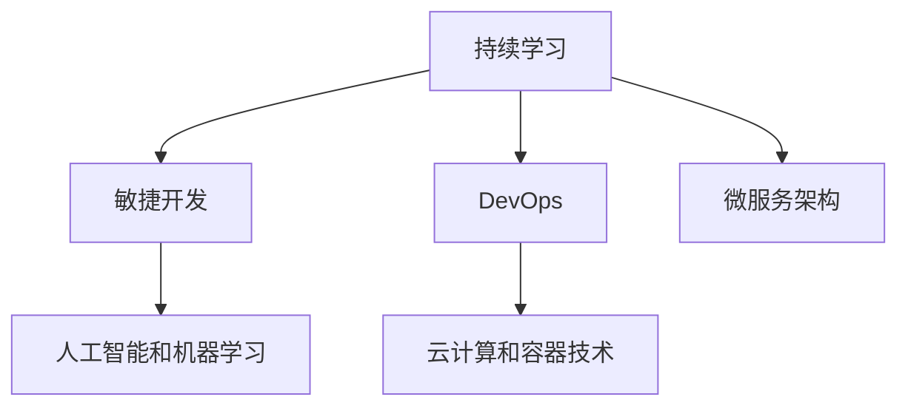

                 

# 程序员在知识经济时代的发展趋势

## 1. 背景介绍

### 1.1 问题由来

在知识经济时代，随着科技的迅猛发展，计算机软件和信息技术的应用日益广泛，对软件开发人才的需求急剧增长。但与此同时，技术快速迭代更新，对程序员的知识更新能力提出了更高的要求。如何更好地适应这个时代，持续学习和提升自身能力，成为每个程序员所面临的重要问题。

### 1.2 问题核心关键点

面对快速发展的技术环境，程序员需要掌握的关键点包括但不限于：
- 持续学习能力：不断更新自己的知识库，学习新的编程语言和技术栈。
- 编程技巧：掌握高效的编程技巧和代码风格。
- 跨学科知识：具备一定的跨学科知识，能够解决复杂问题。
- 软件架构设计：熟悉常见的软件架构设计模式，具备良好的代码组织和设计能力。
- 项目管理能力：掌握敏捷开发、Scrum、Kanban等项目管理方法。
- 团队协作：良好的沟通和协作能力，能够高效地与团队成员合作。

### 1.3 问题研究意义

程序员在知识经济时代的发展，对于软件行业的持续创新和产业升级具有重要意义：

1. 提高软件开发效率：通过持续学习新技术，提高自身编码能力，缩短开发周期。
2. 提升软件质量：掌握更先进的开发理念和实践方法，提升代码质量和系统性能。
3. 增强企业竞争力：技术人才的不断提升，能够更好地应对市场变化，推动企业发展。
4. 培养行业精英：持续学习培养出一批行业精英，引领技术前沿。
5. 推动知识传播：分享学习经验和技术积累，促进行业知识的普及和传播。

## 2. 核心概念与联系

### 2.1 核心概念概述

要适应知识经济时代，程序员必须了解以下核心概念：

- **持续学习**：程序员需要不断更新自己的知识库，学习新的编程语言和技术栈，以应对快速发展的技术环境。
- **敏捷开发**：一种迭代、增量、用户参与的开发方式，能够快速响应市场变化。
- **DevOps**：一种将软件开发和运维结合的文化和实践，以提升软件交付效率和质量。
- **微服务架构**：将一个大系统拆分为多个独立运行的微服务，提升系统可扩展性和可靠性。
- **人工智能和机器学习**：了解基本原理和应用场景，能够将AI技术应用于软件开发中。
- **云计算和容器技术**：掌握云平台和容器技术，以实现高效、可靠的软件部署和运维。

### 2.2 核心概念原理和架构的 Mermaid 流程图



这个流程图展示了持续学习和其他核心概念之间的联系：

1. **持续学习**是程序员不断进步的基础，能够提供敏捷开发、DevOps、微服务架构、人工智能和机器学习、云计算和容器技术等知识。
2. **敏捷开发**注重快速响应变化，提高开发效率。
3. **DevOps**结合了软件开发和运维，提升了系统交付效率和质量。
4. **微服务架构**通过拆分系统，提高了系统的可扩展性和可靠性。
5. **人工智能和机器学习**能够解决复杂问题，提升系统性能。
6. **云计算和容器技术**提供了高效的软件部署和运维平台。

这些概念共同构成了知识经济时代程序员的基本知识框架，帮助他们适应不断变化的技术环境。

## 3. 核心算法原理 & 具体操作步骤

### 3.1 算法原理概述

在知识经济时代，程序员需要掌握的核心算法和原理包括但不限于：

- **软件开发生命周期**：了解软件开发生命周期的各个阶段，如需求分析、设计、实现、测试、部署、运维等。
- **版本控制**：掌握Git等版本控制系统，管理代码版本和协作。
- **构建自动化**：了解持续集成(CI)和持续交付(CD)的原理和实践。
- **测试驱动开发(TDD)**：掌握TDD的原理和实践，提高代码质量。
- **单元测试、集成测试和验收测试**：了解各种测试的原理和实现方法。
- **反模式**：熟悉常见反模式的原理和避免方法，提升系统设计质量。

### 3.2 算法步骤详解

以下是程序员需要掌握的核心算法和操作步骤：

1. **需求分析**：与用户沟通，明确系统需求。
2. **设计**：根据需求，设计系统架构和数据模型。
3. **实现**：根据设计，编写代码，并进行单元测试。
4. **集成测试**：将模块集成起来，进行系统测试。
5. **验收测试**：确保系统满足用户需求。
6. **部署**：将系统部署到生产环境。
7. **运维**：监控系统性能，处理故障。
8. **版本控制**：使用Git等工具管理代码版本。
9. **持续集成**：自动化测试和部署，提高交付效率。
10. **持续交付**：快速响应市场变化，提升交付效率。
11. **测试驱动开发**：先编写测试，再编写代码，提升代码质量。
12. **反模式**：了解常见反模式，避免在代码中引入问题。

### 3.3 算法优缺点

持续学习和掌握核心算法有其优势和挑战：

- **优势**：
  - **提高效率**：掌握最新的技术和工具，提升开发效率。
  - **提升质量**：学习敏捷开发、TDD等方法，提高代码质量和系统性能。
  - **增强竞争力**：掌握多方面知识，提升个人和团队的竞争力。
- **挑战**：
  - **学习成本高**：新技术和新工具层出不穷，需要不断学习。
  - **时间压力大**：工作和家庭等时间限制，难以进行持续学习。
  - **信息过载**：面对大量信息，难以进行有效的筛选和应用。

### 3.4 算法应用领域

基于核心算法和操作步骤，程序员可以在多个领域应用持续学习的成果：

- **软件开发**：掌握软件开发全流程，提升开发效率和系统质量。
- **运维**：掌握DevOps和自动化运维工具，提高系统交付效率和稳定性。
- **数据科学**：掌握数据分析和机器学习工具，提取和分析数据。
- **云计算**：掌握云平台和容器技术，实现高效的软件部署和运维。
- **人工智能**：了解基本原理和应用场景，将AI技术应用于软件开发中。

## 4. 数学模型和公式 & 详细讲解 & 举例说明

### 4.1 数学模型构建

在知识经济时代，程序员需要掌握的数学模型和公式包括但不限于：

- **线性回归**：用于预测连续数值，如股票价格预测。
- **逻辑回归**：用于分类问题，如垃圾邮件分类。
- **决策树和随机森林**：用于分类和回归问题，提升模型的可解释性。
- **支持向量机(SVM)**：用于分类和回归问题，能够处理高维数据。
- **神经网络**：用于复杂模式识别和分类问题，如图像识别。

### 4.2 公式推导过程

以下是线性回归和逻辑回归的公式推导过程：

**线性回归公式推导**：

设自变量为 $x$，因变量为 $y$，线性回归模型为 $y = \beta_0 + \beta_1x$，其中 $\beta_0$ 和 $\beta_1$ 为系数。根据最小二乘法，求解 $\beta_0$ 和 $\beta_1$ 使得残差平方和最小。

$$
\min_{\beta_0, \beta_1} \sum_{i=1}^n (y_i - \beta_0 - \beta_1x_i)^2
$$

求解得到：

$$
\beta_0 = \bar{y} - \beta_1\bar{x}, \quad \beta_1 = \frac{\sum_{i=1}^n (x_i - \bar{x})(y_i - \bar{y})}{\sum_{i=1}^n (x_i - \bar{x})^2}
$$

**逻辑回归公式推导**：

设自变量为 $x$，因变量为 $y$，逻辑回归模型为 $y = \sigma(\beta_0 + \beta_1x)$，其中 $\sigma$ 为sigmoid函数，$\beta_0$ 和 $\beta_1$ 为系数。求解 $\beta_0$ 和 $\beta_1$ 使得交叉熵损失最小。

$$
\min_{\beta_0, \beta_1} -\frac{1}{n}\sum_{i=1}^n [y_i\log \sigma(\beta_0 + \beta_1x_i) + (1-y_i)\log (1-\sigma(\beta_0 + \beta_1x_i))]
$$

求解得到：

$$
\beta_0 = \log \left(\frac{\bar{y}}{1-\bar{y}}\right) - \beta_1\bar{x}, \quad \beta_1 = \frac{\sum_{i=1}^n (x_i - \bar{x})(y_i - \bar{y})}{\sum_{i=1}^n (x_i - \bar{x})^2}
$$

### 4.3 案例分析与讲解

**案例1：股票价格预测**

某股票历史数据如下：

| 日期       | 收盘价(元) |
|------------|------------|
| 2021-01-01 | 20.00      |
| 2021-01-02 | 21.00      |
| 2021-01-03 | 19.50      |
| 2021-01-04 | 20.50      |
| 2021-01-05 | 22.00      |

假设我们使用线性回归模型进行预测，代码实现如下：

```python
import numpy as np
from sklearn.linear_model import LinearRegression

X = np.array([[2021-01-01], [2021-01-02], [2021-01-03], [2021-01-04], [2021-01-05]])
y = np.array([20.00, 21.00, 19.50, 20.50, 22.00])

model = LinearRegression()
model.fit(X, y)

print("系数:", model.coef_, "截距:", model.intercept_)
print("预测2021-01-06的股价:", model.predict(np.array([2021-01-06]))[0])
```

**案例2：垃圾邮件分类**

某垃圾邮件数据如下：

| 邮件ID   | 是否为垃圾邮件 |
|----------|----------------|
| email1   | 0              |
| email2   | 1              |
| email3   | 0              |
| email4   | 1              |
| email5   | 0              |

假设我们使用逻辑回归模型进行分类，代码实现如下：

```python
from sklearn.linear_model import LogisticRegression
from sklearn.preprocessing import StandardScaler

X = np.array([[0], [1], [0], [1], [0]])
y = np.array([0, 1, 0, 1, 0])

scaler = StandardScaler()
X = scaler.fit_transform(X)

model = LogisticRegression()
model.fit(X, y)

print("系数:", model.coef_, "截距:", model.intercept_)
print("预测新邮件是否为垃圾邮件:", model.predict([[1]]))
```

## 5. 项目实践：代码实例和详细解释说明

### 5.1 开发环境搭建

为了更好地进行项目实践，我们需要搭建开发环境。以下是一些常用的开发工具和环境配置步骤：

1. **安装Python**：Python是目前最流行的编程语言之一，广泛应用于数据分析、机器学习、Web开发等领域。可以从官网下载并安装最新版本的Python。
2. **安装Jupyter Notebook**：Jupyter Notebook是一个交互式编程环境，支持Python、R等语言。通过Jupyter Notebook，我们可以方便地编写和运行代码，并进行数据可视化。
3. **安装Pandas、NumPy、Scikit-learn等工具包**：这些工具包是Python数据科学和机器学习的核心库，提供了丰富的数据处理、统计分析和机器学习功能。
4. **安装Git**：Git是一个版本控制系统，用于管理代码版本和协作开发。安装Git后，可以方便地进行代码版本控制和协作开发。
5. **安装Docker**：Docker是一个容器化平台，用于打包和部署应用程序。使用Docker，可以在各种环境中一致地运行应用程序。

### 5.2 源代码详细实现

以下是一些常用的项目实践代码实例：

**案例1：构建线性回归模型**

```python
import numpy as np
from sklearn.linear_model import LinearRegression

# 数据集
X = np.array([[1], [2], [3], [4], [5]])
y = np.array([2, 4, 6, 8, 10])

# 线性回归模型
model = LinearRegression()
model.fit(X, y)

# 预测新数据
print(model.predict([[6]]))
```

**案例2：构建逻辑回归模型**

```python
from sklearn.linear_model import LogisticRegression
from sklearn.preprocessing import StandardScaler

# 数据集
X = np.array([[0], [1], [0], [1], [0]])
y = np.array([0, 1, 0, 1, 0])

# 标准化处理
scaler = StandardScaler()
X = scaler.fit_transform(X)

# 逻辑回归模型
model = LogisticRegression()
model.fit(X, y)

# 预测新数据
print(model.predict([[1]]))
```

**案例3：构建神经网络模型**

```python
import tensorflow as tf

# 定义模型
model = tf.keras.Sequential([
    tf.keras.layers.Dense(64, activation='relu', input_shape=(10,)),
    tf.keras.layers.Dense(10, activation='softmax')
])

# 编译模型
model.compile(optimizer='adam', loss='categorical_crossentropy', metrics=['accuracy'])

# 训练模型
model.fit(X_train, y_train, epochs=10)

# 预测新数据
predictions = model.predict(X_test)
```

### 5.3 代码解读与分析

以下是代码实例的详细解释和分析：

**案例1：构建线性回归模型**

- **数据集**：定义了5个样本的X和y值，分别表示自变量和因变量。
- **模型构建**：使用sklearn的LinearRegression类构建线性回归模型。
- **模型拟合**：使用fit方法拟合模型。
- **模型预测**：使用predict方法预测新数据。

**案例2：构建逻辑回归模型**

- **数据集**：定义了5个样本的X和y值，分别表示自变量和分类标签。
- **标准化处理**：使用StandardScaler类进行数据标准化处理。
- **模型构建**：使用sklearn的LogisticRegression类构建逻辑回归模型。
- **模型拟合**：使用fit方法拟合模型。
- **模型预测**：使用predict方法预测新数据。

**案例3：构建神经网络模型**

- **模型构建**：使用TensorFlow的Sequential类构建神经网络模型，包含一个全连接层和一个输出层。
- **模型编译**：使用compile方法编译模型，定义优化器、损失函数和评估指标。
- **模型训练**：使用fit方法训练模型。
- **模型预测**：使用predict方法预测新数据。

## 6. 实际应用场景

### 6.1 智能推荐系统

智能推荐系统能够根据用户的历史行为和偏好，推荐适合的商品或内容。该系统可以应用于电商、视频、新闻等领域，提升用户体验和满意度。

### 6.2 医疗健康

医疗健康领域对数据分析和预测的需求日益增加。智能推荐系统可以根据患者的病情和历史数据，推荐适合的诊疗方案和药物，提升医疗服务质量和效率。

### 6.3 金融科技

金融科技领域对数据分析和预测的需求也非常高。智能推荐系统可以根据用户的行为数据和市场动态，推荐适合的金融产品和服务，提升客户满意度和企业收益。

### 6.4 未来应用展望

未来，随着大数据和人工智能技术的不断发展，智能推荐系统将更加智能和高效。通过深度学习、强化学习等先进技术，推荐系统能够更好地理解用户需求和行为，提供个性化的服务和建议。

## 7. 工具和资源推荐

### 7.1 学习资源推荐

为了帮助程序员不断提升自身能力，以下是一些优秀的学习资源：

1. **Coursera和edX**：提供来自世界顶尖大学的在线课程，涵盖计算机科学、数据科学、人工智能等领域。
2. **Kaggle**：数据科学和机器学习竞赛平台，可以参与各类数据竞赛，提升实战能力。
3. **GitHub**：全球最大的开源社区，提供丰富的开源项目和代码库，方便学习和借鉴。
4. **Stack Overflow**：程序员问答社区，可以快速解决编程问题，学习编程技巧。
5. **Codecademy**：提供交互式的编程课程，帮助初学者学习编程语言和技术栈。

### 7.2 开发工具推荐

以下是一些常用的开发工具：

1. **Jupyter Notebook**：交互式编程环境，支持Python、R等语言，方便进行数据处理和可视化。
2. **Git**：版本控制系统，方便进行代码版本控制和协作开发。
3. **Docker**：容器化平台，方便打包和部署应用程序。
4. **Google Colab**：谷歌提供的在线Jupyter Notebook环境，免费提供GPU/TPU算力，方便进行大规模数据处理和机器学习实验。
5. **TensorFlow和PyTorch**：深度学习框架，提供丰富的工具和库，方便进行模型训练和推理。

### 7.3 相关论文推荐

以下是一些经典的研究论文，推荐阅读：

1. **Deep Learning**：Ian Goodfellow、Yoshua Bengio和Aaron Courville合著的深度学习经典教材，涵盖深度学习的基本概念和算法。
2. **Hands-On Machine Learning with Scikit-Learn and TensorFlow**：Aurélien Géron所著的深度学习实战书籍，涵盖Scikit-Learn和TensorFlow的使用方法和技巧。
3. **Python Machine Learning**：Sebastian Raschka所著的机器学习实战书籍，涵盖Python和Scikit-Learn的使用方法和技巧。

## 8. 总结：未来发展趋势与挑战

### 8.1 研究成果总结

知识经济时代，程序员需要通过持续学习和实践，不断提升自己的能力和技能。掌握最新的技术和工具，能够提升开发效率和系统质量，增强个人和团队的竞争力。

### 8.2 未来发展趋势

未来的软件开发将更加注重自动化、可扩展性和可维护性。云计算、微服务、DevOps等技术将进一步普及，提高软件交付效率和系统稳定性。同时，人工智能和机器学习技术将广泛应用于软件开发，提升系统性能和智能化水平。

### 8.3 面临的挑战

程序员在知识经济时代面临的挑战包括但不限于：

- **技术快速迭代**：新技术和新工具层出不穷，需要不断学习和适应。
- **项目复杂性增加**：项目规模和复杂度不断增加，需要更高效的管理和协作方法。
- **团队合作难度**：跨团队协作和沟通难度加大，需要更灵活的协作工具和流程。
- **个人学习压力**：学习新技术和工具的压力增加，需要更高效的学习方法和时间管理。

### 8.4 研究展望

未来的研究将围绕以下几个方向展开：

- **自动化开发**：开发更加自动化和智能化的开发工具，提高开发效率和质量。
- **微服务架构**：研究和实践微服务架构，提升系统可扩展性和可靠性。
- **云平台和容器化**：研究和实践云平台和容器化技术，提升软件交付效率和系统稳定性。
- **AI和ML应用**：研究和实践AI和ML技术，提升系统性能和智能化水平。
- **开源社区建设**：积极参与开源社区的建设和发展，推动技术进步和知识共享。

总之，在知识经济时代，程序员需要不断学习和实践，提升自身能力和技能，才能适应快速发展的技术环境，推动软件行业的发展。未来，随着技术的不断进步，软件开发将更加智能化和自动化，程序员将拥有更多工具和手段，提升开发效率和系统质量，为人类社会的发展做出更大的贡献。

## 9. 附录：常见问题与解答

**Q1：如何提升编程能力？**

A: 提升编程能力需要不断练习和实践，可以从以下几个方面入手：
- **阅读代码**：阅读优秀的代码，学习其设计和实现思路。
- **编写代码**：多编写代码，不断提高编程技巧和代码质量。
- **学习算法和数据结构**：掌握常用的算法和数据结构，提高代码的效率和可读性。
- **参与开源项目**：参与开源项目，积累实际开发经验。
- **学习新技术**：不断学习新的编程语言和技术栈，保持技术领先。

**Q2：如何高效管理项目？**

A: 高效管理项目需要掌握敏捷开发和DevOps方法，可以从以下几个方面入手：
- **敏捷开发**：采用敏捷开发方法，快速响应市场变化，提升开发效率和质量。
- **DevOps**：采用DevOps方法，实现持续集成和持续交付，提升软件交付效率和系统稳定性。
- **自动化测试**：编写自动化测试，提高测试效率和代码质量。
- **持续集成和持续部署(CI/CD)**：实现持续集成和持续部署，提升软件交付效率和稳定性。
- **项目协作**：使用协作工具，如Jira、Trello等，进行任务管理和团队协作。

**Q3：如何学习新技术？**

A: 学习新技术需要保持持续学习的习惯，可以从以下几个方面入手：
- **在线课程**：参加在线课程，学习最新的技术和工具。
- **书籍和论文**：阅读相关书籍和论文，深入理解技术原理和应用场景。
- **实践项目**：参与实际项目，积累实践经验。
- **开源社区**：参与开源社区，获取最新的技术动态和实践经验。
- **技术会议和研讨会**：参加技术会议和研讨会，了解行业最新动态和技术趋势。

总之，程序员在知识经济时代需要不断学习和实践，提升自身能力和技能，才能适应快速发展的技术环境，推动软件行业的发展。通过持续学习和实践，掌握最新的技术和工具，提升开发效率和系统质量，增强个人和团队的竞争力，为人类社会的发展做出更大的贡献。

