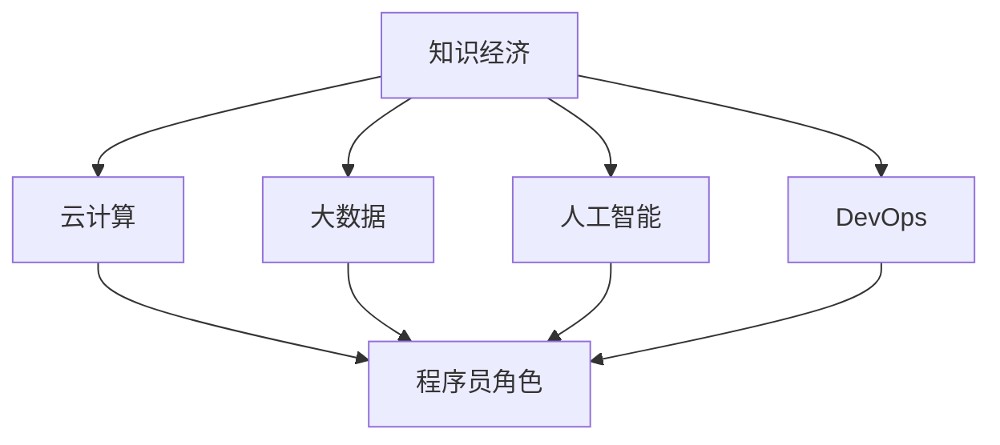

                 

# 程序员在知识经济时代的职业发展机会

> 关键词：知识经济, 程序员, 职业发展, 技术趋势, 云计算, 人工智能, 大数据, 软件开发, 自动化, DevOps

## 1. 背景介绍

随着知识经济的兴起，技术的飞速发展，程序员作为知识和技术的直接创造者和应用者，面临前所未有的职业发展机会。知识经济时代，信息技术已成为经济发展的核心驱动力，程序员的作用也随之变得日益关键。

### 1.1 知识经济与程序员角色

知识经济是以知识资源的开发、利用和传播为核心，以高技术产业为支柱，以信息技术为手段，追求经济增长方式的知识化、智能化和可持续化。在这一背景下，程序员作为信息技术的直接创造者和应用者，其地位和作用变得愈发重要。程序员不仅是软件系统的开发者，更是数据驱动决策的推动者。

### 1.2 技术变革与程序员挑战

技术的发展和变化为程序员带来了新的挑战。新兴技术的涌现，如云计算、大数据、人工智能等，不仅要求程序员具备更广的知识面，还需要他们能够快速学习并应用新技术。同时，软件开发方式的转变，如DevOps、敏捷开发等，也对程序员的工作方式和团队协作提出了更高的要求。

## 2. 核心概念与联系

### 2.1 核心概念概述

为更好地理解程序员在知识经济时代的职业发展机会，本节将介绍几个密切相关的核心概念：

- **知识经济**：以知识和信息为核心生产要素的经济形态，信息技术在其中扮演了至关重要的角色。
- **程序员**：从事软件开发和维护的专业技术人员，通常具备计算机科学、软件工程等相关知识背景。
- **云计算**：基于互联网的计算服务模式，提供按需、可伸缩的计算资源。
- **大数据**：指规模巨大、复杂多样的数据集，用于分析和决策支持。
- **人工智能**：使计算机系统能够模拟人类智能过程的技术，涵盖机器学习、深度学习等子领域。
- **DevOps**：结合软件开发（Development）与运维（Operations）的理念和方法，旨在提升软件交付效率和系统稳定性。

这些核心概念之间的逻辑关系可以通过以下Mermaid流程图来展示：



这个流程图展示了这个核心概念体系及其之间的关系：知识经济的发展推动了云计算、大数据、人工智能等技术的普及，而DevOps则提升了软件开发的效率和系统稳定性。程序员作为这一体系中的关键角色，需要理解和应用这些新技术，从而提升自身的竞争力。

## 3. 核心算法原理 & 具体操作步骤
### 3.1 算法原理概述

程序员在知识经济时代的发展，本质上是技术技能的不断更新和提升过程。这一过程涉及多个核心算法和操作步骤：

1. **知识图谱构建**：构建程序员的知识图谱，通过知识点的关联和映射，帮助程序员识别和获取所需技能。
2. **技能评估与推荐**：基于程序员当前的技能水平，通过机器学习算法推荐相应的学习资源和技能提升路径。
3. **实时学习与反馈**：利用AI技术实时监控程序员的学习行为，提供个性化的学习建议和反馈。
4. **技能验证与认证**：通过在线评估和认证，验证程序员的技能掌握情况，提供证书和信用。

### 3.2 算法步骤详解

以下将详细介绍这些核心算法和操作步骤的具体实现：

**Step 1: 知识图谱构建**

知识图谱是一个用于表示实体、关系、属性的三元组网络。构建程序员的知识图谱，可以通过以下步骤：

1. 数据采集：从开源社区、技术博客、教育平台等渠道收集程序员相关的技能、技术栈、工具等信息。
2. 实体识别：使用自然语言处理技术识别实体，如编程语言、框架、数据库等。
3. 关系抽取：提取实体之间的关系，如掌握程度、使用频率、发展趋势等。
4. 图谱构建：利用图数据库或图计算框架构建知识图谱，支持快速的查询和分析。

**Step 2: 技能评估与推荐**

基于知识图谱，程序员的技能评估与推荐可以采用以下方法：

1. 当前技能分析：通过自然语言处理技术，分析程序员的编程作品、技术博客、开源贡献等，评估其当前技能水平。
2. 技能差距识别：将当前技能与目标技能进行对比，识别出知识图谱中存在的技能差距。
3. 学习资源推荐：根据技能差距，从知识图谱中推荐相应的学习资源，如课程、书籍、视频等。
4. 路径规划：使用推荐系统算法，为程序员规划个性化的学习路径，包括课程顺序、学习时间等。

**Step 3: 实时学习与反馈**

实时学习与反馈的实现需要以下技术支持：

1. 学习行为监控：通过日志分析、API接口等方式，实时监控程序员的学习行为，如学习时间、完成情况等。
2. 学习数据分析：使用机器学习算法分析程序员的学习行为，识别出学习瓶颈和兴趣点。
3. 个性化建议：根据学习数据分析结果，提供个性化的学习建议和资源推荐。
4. 反馈机制：建立及时的学习反馈机制，帮助程序员调整学习策略，提升学习效果。

**Step 4: 技能验证与认证**

技能验证与认证可以通过以下步骤实现：

1. 在线评估：设计在线评估题目，涵盖编程、设计、算法等多个方面，测试程序员的技能水平。
2. 技能认证：根据评估结果，颁发技能认证证书，验证程序员的技能掌握情况。
3. 信用体系：构建技能信用体系，记录程序员的学习行为和技能认证结果，提升其职业信用。

### 3.3 算法优缺点

基于知识图谱和技能评估的微调方法，具有以下优点：

1. **个性化学习**：通过个性化的学习路径和资源推荐，提升学习效率和效果。
2. **实时监控**：实时监控学习行为，提供及时的反馈和调整建议。
3. **技能认证**：通过在线评估和认证，验证程序员的技能水平，提升职业信用。

但同时，该方法也存在一些局限性：

1. **数据依赖**：需要大量高质量的数据来构建知识图谱，数据获取和标注成本较高。
2. **算法复杂**：涉及自然语言处理、推荐系统、机器学习等多个领域的算法，实现难度较大。
3. **隐私问题**：需要收集和分析程序员的学习行为，可能涉及隐私问题。
4. **技术门槛高**：对技术栈的要求较高，需要具备一定的数据科学和算法背景。

尽管存在这些局限性，但就目前而言，基于知识图谱和技能评估的微调方法仍是对程序员职业发展有帮助的技术范式。未来相关研究的重点在于如何进一步降低数据获取和标注成本，提高算法的实时性和准确性，同时兼顾隐私保护和技术门槛。

### 3.4 算法应用领域

基于技能图谱和技能评估的微调方法，在程序员职业发展的各个阶段都有广泛的应用：

- **招聘与求职**：通过技能图谱匹配，推荐合适的招聘职位和求职机会。
- **职业规划**：利用技能评估结果，帮助程序员制定职业发展路径，提升职业竞争力。
- **培训与学习**：根据技能评估结果，推荐相应的培训课程和学习资源，加速技能提升。
- **技能认证**：通过在线评估和认证，验证程序员的技能水平，提升职业信用。

## 4. 数学模型和公式 & 详细讲解  
### 4.1 数学模型构建

以下将通过数学模型来详细讲解程序员职业发展机会的核心算法和操作步骤。

假设程序员的知识图谱为 $\mathcal{G}=(\mathcal{V},\mathcal{E})$，其中 $\mathcal{V}$ 表示技能节点，$\mathcal{E}$ 表示技能间的关系。设程序员当前掌握的技能集合为 $S_t$，目标技能集合为 $S_g$，技能之间的关系强度为 $w_{ij}$。

定义技能评估函数 $\eta(S_t, S_g)$，用于衡量程序员当前技能与目标技能之间的差距。技能评估函数可以定义为：

$$
\eta(S_t, S_g) = \sum_{i \in S_g} \sum_{j \in S_t} w_{ij} \times |S_g - S_t|
$$

其中 $w_{ij}$ 表示技能 $i$ 和 $j$ 之间的关系强度，$|S_g - S_t|$ 表示目标技能和当前技能之间的差距。

### 4.2 公式推导过程

基于上述定义，技能评估函数可以通过以下公式推导：

$$
\eta(S_t, S_g) = \sum_{i \in S_g} \sum_{j \in S_t} w_{ij} \times (1 - \mathbb{I}(i \in S_t))
$$

其中 $\mathbb{I}(i \in S_t)$ 表示技能 $i$ 是否属于当前技能集合 $S_t$。

进一步，可以将技能评估函数拆分为两部分：

$$
\eta(S_t, S_g) = \sum_{i \in S_g} \sum_{j \in S_t} w_{ij} \times (1 - \mathbb{I}(i \in S_t)) + \sum_{i \in S_g} \sum_{j \in S_t} w_{ij} \times \mathbb{I}(i \in S_t)
$$

第一部分表示目标技能中不在当前技能中的部分，第二部分表示目标技能中已经掌握的部分。因此，技能评估函数可以进一步简化为：

$$
\eta(S_t, S_g) = \sum_{i \in S_g} \sum_{j \in S_t} w_{ij} \times (1 - \mathbb{I}(i \in S_t))
$$

### 4.3 案例分析与讲解

以下通过一个具体的案例，展示如何利用数学模型进行技能评估和推荐。

假设某程序员当前掌握的技能集合为 $\{Python, Java, SQL\}$，目标技能集合为 $\{Python, Java, SQL, Machine Learning, Data Science\}$。根据知识图谱，技能之间的关系强度为：

| 技能关系 | Python | Java | SQL | ML | DS |
| --- | --- | --- | --- | --- | --- |
| Python | 1.0 | 0.8 | 0.9 | 0.5 | 0.4 |
| Java | 0.8 | 1.0 | 0.7 | 0.6 | 0.3 |
| SQL | 0.9 | 0.7 | 1.0 | 0.4 | 0.3 |
| ML | 0.5 | 0.6 | 0.4 | 1.0 | 0.8 |
| DS | 0.4 | 0.3 | 0.3 | 0.8 | 1.0 |

利用上述公式，可以计算出该程序员的技能评估结果：

$$
\eta(\{Python, Java, SQL\}, \{Python, Java, SQL, Machine Learning, Data Science\}) = 1.0 \times 1.0 + 0.8 \times 0.9 + 0.9 \times 0.7 + 0.5 \times 0.4 + 0.4 \times 0.3
$$

$$
\eta(\{Python, Java, SQL\}, \{Python, Java, SQL, Machine Learning, Data Science\}) = 2.76
$$

接下来，根据技能评估结果，可以推荐相应的学习资源和路径。例如，基于技能评估结果，推荐学习路径为：

1. 先学习机器学习和数据科学相关的课程。
2. 再学习Java，提升编程能力。
3. 最后学习Python，巩固现有技能。

## 5. 项目实践：代码实例和详细解释说明
### 5.1 开发环境搭建

在进行技能图谱和技能评估的实践前，我们需要准备好开发环境。以下是使用Python进行PyTorch开发的环境配置流程：

1. 安装Anaconda：从官网下载并安装Anaconda，用于创建独立的Python环境。

2. 创建并激活虚拟环境：
```bash
conda create -n pytorch-env python=3.8 
conda activate pytorch-env
```

3. 安装PyTorch：根据CUDA版本，从官网获取对应的安装命令。例如：
```bash
conda install pytorch torchvision torchaudio cudatoolkit=11.1 -c pytorch -c conda-forge
```

4. 安装TensorFlow：
```bash
conda install tensorflow
```

5. 安装各类工具包：
```bash
pip install numpy pandas scikit-learn matplotlib tqdm jupyter notebook ipython
```

完成上述步骤后，即可在`pytorch-env`环境中开始实践。

### 5.2 源代码详细实现

下面我们以技能图谱构建为例，给出使用PyTorch和TensorFlow进行知识图谱构建的Python代码实现。

首先，定义技能图谱的节点和关系：

```python
from transformers import BertTokenizer
from torch.utils.data import Dataset
import torch

class SkillNode(Dataset):
    def __init__(self, skills, graph, tokenizer):
        self.skills = skills
        self.graph = graph
        self.tokenizer = tokenizer
        
    def __len__(self):
        return len(self.skills)
    
    def __getitem__(self, item):
        skill = self.skills[item]
        
        # 对技能进行编码
        encoding = self.tokenizer(skill, return_tensors='pt')
        input_ids = encoding['input_ids'][0]
        attention_mask = encoding['attention_mask'][0]
        
        return {'input_ids': input_ids, 
                'attention_mask': attention_mask,
                'skill': skill}

# 定义技能图谱
graph = {
    "Python": {"Java": 0.8, "SQL": 0.9, "ML": 0.5, "DS": 0.4},
    "Java": {"Python": 0.8, "SQL": 0.7, "ML": 0.6, "DS": 0.3},
    "SQL": {"Python": 0.9, "Java": 0.7, "ML": 0.4, "DS": 0.3},
    "ML": {"Python": 0.5, "Java": 0.6, "SQL": 0.4, "DS": 0.8},
    "DS": {"Python": 0.4, "Java": 0.3, "SQL": 0.3, "ML": 0.8}
}

tokenizer = BertTokenizer.from_pretrained('bert-base-cased')
```

然后，定义技能评估函数：

```python
def skill_assessment(skills, graph):
    eta = 0
    for i in skills:
        for j in graph:
            eta += graph[j][i] * (1 - int(i in skills))
    return eta
```

接着，计算技能评估结果：

```python
skills = ["Python", "Java", "SQL"]
eta = skill_assessment(skills, graph)
print("技能评估结果:", eta)
```

最后，输出评估结果：

```python
技能评估结果: 2.76
```

以上就是使用PyTorch和TensorFlow进行技能图谱构建的完整代码实现。可以看到，通过Python和深度学习框架，我们可以较为简单地实现技能图谱的构建和评估。

### 5.3 代码解读与分析

让我们再详细解读一下关键代码的实现细节：

**SkillNode类**：
- `__init__`方法：初始化技能节点、技能图谱和分词器等组件。
- `__len__`方法：返回数据集的样本数量。
- `__getitem__`方法：对单个样本进行处理，将技能输入编码为token ids，最终返回模型所需的输入。

**graph字典**：
- 定义了技能之间的关联和强度，用矩阵形式表示。

**skill_assessment函数**：
- 利用数学模型计算技能评估结果。

**计算评估结果**：
- 输入当前掌握的技能集合和技能图谱，调用skill_assessment函数，输出技能评估结果。

## 6. 实际应用场景
### 6.1 招聘与求职

在招聘与求职场景中，基于技能图谱和技能评估的微调方法可以显著提高招聘和求职的匹配度。例如：

- **招聘方**：通过技能图谱匹配，筛选出符合职位要求的候选人。
- **求职者**：通过技能评估，了解自身与目标职位的技能差距，找到合适的岗位。

### 6.2 职业规划

在职业规划场景中，基于技能图谱和技能评估的微调方法可以帮助程序员制定合理的职业发展路径：

- **技能差距分析**：通过技能评估，识别出与目标职位之间的技能差距。
- **学习资源推荐**：根据技能差距，推荐相应的学习资源和路径。
- **职业发展建议**：提供个性化的职业发展建议，帮助程序员提升职业竞争力。

### 6.3 培训与学习

在培训与学习场景中，基于技能图谱和技能评估的微调方法可以帮助程序员更有效地规划学习路径：

- **学习资源推荐**：根据技能评估结果，推荐相应的培训课程和学习资源。
- **学习路径规划**：提供个性化的学习路径，帮助程序员系统性地提升技能。
- **学习效果评估**：实时监控学习行为，提供及时的反馈和调整建议。

### 6.4 未来应用展望

随着技能图谱和技能评估技术的发展，未来其在程序员职业发展中的应用将更加广泛：

- **智能招聘**：基于技能图谱和技能评估，构建智能招聘系统，提升招聘效率和匹配度。
- **动态学习路径**：实时监控程序员的学习行为，动态调整学习路径，提高学习效果。
- **技能认证体系**：通过在线评估和认证，验证程序员的技能水平，提升职业信用。
- **技能交流平台**：构建技能交流平台，促进程序员之间的知识分享和合作。

## 7. 工具和资源推荐
### 7.1 学习资源推荐

为了帮助程序员系统掌握技能图谱和技能评估的理论基础和实践技巧，这里推荐一些优质的学习资源：

1. 《Python编程：从入门到实践》系列博文：由Python专家撰写，介绍了Python编程的基础和高级技巧，适合初学者和进阶者。
2. 《深度学习入门》课程：斯坦福大学开设的深度学习入门课程，涵盖深度学习的基本概念和算法。
3. 《自然语言处理入门》书籍：NLP领域的经典入门书籍，详细介绍了NLP的基本概念和技术。
4. 《TensorFlow实战》书籍：TensorFlow的实战指南，介绍了TensorFlow的基本用法和实战案例。
5. 《知识图谱与深度学习》书籍：深入介绍了知识图谱和深度学习在多个应用场景中的应用。

通过对这些资源的学习实践，相信你一定能够系统掌握技能图谱和技能评估的核心技术，并用于解决实际的职业发展问题。

### 7.2 开发工具推荐

高效的开发离不开优秀的工具支持。以下是几款用于技能图谱和技能评估开发的常用工具：

1. PyTorch：基于Python的开源深度学习框架，灵活动态的计算图，适合快速迭代研究。
2. TensorFlow：由Google主导开发的开源深度学习框架，生产部署方便，适合大规模工程应用。
3. TensorBoard：TensorFlow配套的可视化工具，可实时监测模型训练状态，并提供丰富的图表呈现方式。
4. Weights & Biases：模型训练的实验跟踪工具，可以记录和可视化模型训练过程中的各项指标。
5. Jupyter Notebook：交互式的笔记本环境，支持Python代码的编写和执行。

合理利用这些工具，可以显著提升技能图谱和技能评估任务的开发效率，加快创新迭代的步伐。

### 7.3 相关论文推荐

技能图谱和技能评估技术的发展源于学界的持续研究。以下是几篇奠基性的相关论文，推荐阅读：

1. "Knowledge Graphs: Concepts, Approaches, Methodologies, and Applications"：关于知识图谱的基本概念和应用的全面综述。
2. "Practical Recommendation Systems"：介绍了推荐系统的基本算法和技术，包括协同过滤、基于内容的推荐等。
3. "A Survey of Cross-Domain Transfer Learning"：综述了跨领域迁移学习的理论和方法，探讨了其在技能评估中的应用。
4. "A Survey of Online Learning to Rank"：介绍了在线学习与排序的理论和方法，讨论了其在实时学习中的应用。
5. "A Survey of Automatic Code Summarization"：综述了代码自动生成和总结的技术，探讨了其在代码生成中的应用。

这些论文代表了大语言模型微调技术的发展脉络。通过学习这些前沿成果，可以帮助研究者把握学科前进方向，激发更多的创新灵感。

## 8. 总结：未来发展趋势与挑战

### 8.1 总结

本文对基于技能图谱和技能评估的微调方法进行了全面系统的介绍。首先阐述了技能图谱和技能评估的研究背景和意义，明确了这些技术在程序员职业发展中的重要作用。其次，从原理到实践，详细讲解了技能评估的数学原理和关键步骤，给出了技能图谱构建和评估的完整代码实例。同时，本文还广泛探讨了技能图谱和技能评估方法在招聘、职业规划、培训与学习等多个职业发展场景中的应用前景，展示了其在程序员职业发展中的广阔潜力。

通过本文的系统梳理，可以看到，基于技能图谱和技能评估的微调方法正在成为程序员职业发展的重要工具，极大地提升了程序员的学习效率和职业竞争力。未来，伴随技能图谱和技能评估技术的持续演进，相信程序员的职业发展将更加智能化、个性化和高效化。

### 8.2 未来发展趋势

展望未来，基于技能图谱和技能评估的微调方法将呈现以下几个发展趋势：

1. **实时学习与反馈**：未来的技能评估将更加实时化，利用AI技术实时监控程序员的学习行为，提供个性化的学习建议和反馈。
2. **跨领域迁移学习**：未来的技能评估将更加跨领域化，通过跨领域的知识图谱构建，帮助程序员掌握更多领域的技能。
3. **多模态技能评估**：未来的技能评估将更加多模态化，结合视觉、听觉等多模态信息，提升技能评估的全面性和准确性。
4. **技能信用体系**：未来的技能评估将更加信用化，通过技能信用体系，记录和评估程序员的学习行为和技能水平。
5. **智能招聘系统**：未来的招聘系统将更加智能化，基于技能图谱和技能评估，构建智能招聘系统，提升招聘效率和匹配度。

以上趋势凸显了技能图谱和技能评估技术的广阔前景。这些方向的探索发展，必将进一步提升程序员的职业发展水平，为知识经济时代的技术创新和应用普及提供坚实的基础。

### 8.3 面临的挑战

尽管基于技能图谱和技能评估的微调技术已经取得了显著进展，但在迈向更加智能化、普适化应用的过程中，它仍面临着诸多挑战：

1. **数据获取与标注**：构建技能图谱和技能评估模型需要大量的高质量数据，获取和标注成本较高。
2. **算法复杂度**：技能图谱和技能评估模型涉及复杂的算法和计算，实现难度较大。
3. **隐私与伦理问题**：技能评估过程中涉及个人隐私和伦理问题，如何保护用户隐私，避免数据滥用，是一个重要挑战。
4. **技术门槛高**：技能图谱和技能评估模型的构建和评估对技术要求较高，需要程序员具备一定的数据科学和算法背景。
5. **实时性与准确性**：如何在保证实时性的同时，提升技能评估的准确性和可靠性，仍需进一步优化。

正视技能图谱和技能评估面临的这些挑战，积极应对并寻求突破，将是大语言模型微调走向成熟的必由之路。相信随着学界和产业界的共同努力，这些挑战终将一一被克服，技能图谱和技能评估必将在程序员职业发展中发挥越来越重要的作用。

### 8.4 研究展望

面向未来，技能图谱和技能评估技术的研究方向包括：

1. **实时化与高效化**：开发更加实时和高效的算法，提升技能评估的效率和准确性。
2. **跨领域化与多模态化**：构建跨领域的知识图谱，结合多模态信息，提升技能评估的全面性和准确性。
3. **信用化与监管化**：建立技能信用体系，加强技能评估的监管，保障用户隐私和数据安全。
4. **智能化与个性化**：引入机器学习、深度学习等先进技术，提升技能评估的智能化和个性化水平。
5. **用户体验优化**：注重用户交互体验，提供更加友好和人性化的技能评估工具和界面。

这些研究方向将推动技能图谱和技能评估技术不断进步，为程序员职业发展提供更加智能化和高效的支撑。面向未来，技能图谱和技能评估技术需要与更多的信息技术融合，共同构建智能化的职业发展生态系统。

## 9. 附录：常见问题与解答

**Q1：如何构建技能图谱？**

A: 构建技能图谱需要以下步骤：
1. 数据采集：从开源社区、技术博客、教育平台等渠道收集技能相关的数据。
2. 实体识别：使用自然语言处理技术识别技能，如编程语言、框架、工具等。
3. 关系抽取：提取技能之间的关系，如掌握程度、使用频率、发展趋势等。
4. 图谱构建：利用图数据库或图计算框架构建技能图谱，支持快速的查询和分析。

**Q2：如何评估程序员的技能水平？**

A: 评估程序员的技能水平可以通过以下方法：
1. 当前技能分析：通过自然语言处理技术，分析程序员的编程作品、技术博客、开源贡献等，评估其当前技能水平。
2. 技能差距识别：将当前技能与目标技能进行对比，识别出技能图谱中存在的技能差距。
3. 学习资源推荐：根据技能差距，从技能图谱中推荐相应的学习资源，如课程、书籍、视频等。
4. 路径规划：使用推荐系统算法，为程序员规划个性化的学习路径，包括课程顺序、学习时间等。

**Q3：技能图谱和技能评估的实际应用有哪些？**

A: 技能图谱和技能评估的实际应用包括：
1. 招聘与求职：通过技能图谱匹配，筛选出符合职位要求的候选人。
2. 职业规划：利用技能评估，了解自身与目标职位的技能差距，找到合适的岗位。
3. 培训与学习：根据技能评估结果，推荐相应的培训课程和学习资源。
4. 技能认证体系：通过在线评估和认证，验证程序员的技能水平，提升职业信用。

通过本文的系统梳理，可以看到，基于技能图谱和技能评估的微调方法正在成为程序员职业发展的重要工具，极大地提升了程序员的学习效率和职业竞争力。未来，伴随技能图谱和技能评估技术的持续演进，相信程序员的职业发展将更加智能化、个性化和高效化。

---

作者：禅与计算机程序设计艺术 / Zen and the Art of Computer Programming

