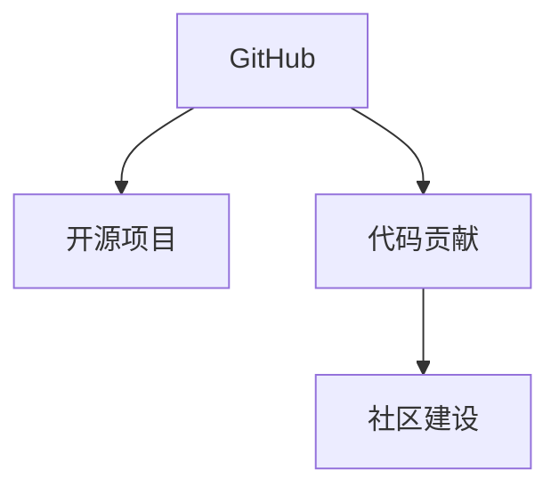

                 

# 程序员如何利用GitHub进行知识变现

> 关键词：GitHub, 知识变现, 开源项目, 编程, 软件开发, 贡献, 社区建设

## 1. 背景介绍

在当今数字化时代，软件开发已经成为了一门艺术与科学相结合的复杂工作。程序员，作为这一过程中不可或缺的角色，不仅需要具备扎实的技术功底，还需要不断地学习新知识、掌握新技术。然而，如何有效地整合、共享和传播这些知识，成为了一个重要的课题。而GitHub，作为全球最大的代码托管平台之一，为程序员提供了一个高效的知识变现渠道。

### 1.1 问题由来

传统上，程序员的知识变现主要依赖于技术博客、技术论坛、技术讲座等形式。这些形式虽然帮助了大量开发者学习新技术，但往往局限于特定的小圈子，难以达到广泛传播的效果。而GitHub的出现，为程序员提供了一个更为广泛的知识共享和变现平台。

### 1.2 问题核心关键点

GitHub作为一个开源社区，其核心价值在于知识的共享和协作。对于程序员来说，如何高效地利用GitHub平台，将自己的知识和经验变现，成为了一个值得深入探讨的问题。本文将围绕这一核心问题，系统地介绍GitHub知识变现的策略和实践。

## 2. 核心概念与联系

### 2.1 核心概念概述

为了更好地理解GitHub知识变现的过程，本节将介绍几个关键概念：

- GitHub：全球最大的代码托管平台，提供代码版本控制、项目管理、代码协作等功能，是程序员实现知识变现的重要平台。
- 开源项目：在GitHub上，程序员可以将自己的代码、文档和经验公开分享，供全球开发者使用和学习。
- 代码贡献：通过在开源项目中提交代码、修复bug、新增功能等方式，程序员可以为社区做出贡献，获得社区的认可和回馈。
- 社区建设：通过参与开源项目的讨论、组织、维护等活动，程序员可以建立起自己的技术影响力和社区地位。

这些核心概念之间的逻辑关系可以通过以下Mermaid流程图来展示：



这个流程图展示了几者之间的紧密联系：

1. GitHub提供平台，开源项目和代码贡献是其核心活动。
2. 代码贡献是实现知识变现的主要手段。
3. 社区建设提升个人在GitHub上的影响力。

这些概念共同构成了GitHub知识变现的基础，使得程序员能够通过平台获得技术认可和社区支持，实现个人和职业发展。

## 3. 核心算法原理 & 具体操作步骤
### 3.1 算法原理概述

GitHub知识变现的过程可以视为一个由代码贡献、社区参与和反馈循环构成的循环。其核心在于：

1. **代码贡献**：通过在开源项目中提交代码、修复bug、新增功能等形式，程序员将个人知识传递给社区。
2. **社区反馈**：社区成员对贡献的代码进行评价、讨论和反馈，这些反馈进一步丰富了代码库，同时也提升了程序员的知识水平。
3. **持续迭代**：基于社区反馈，程序员持续改进代码和文档，进一步提升知识质量。

这一过程的数学模型可以简单表示为：

$$
\text{知识质量} = f(\text{代码贡献}, \text{社区反馈}, \text{持续迭代})
$$

其中，$f$ 表示一个复杂的非线性函数，涉及到代码质量、社区互动等多个因素。

### 3.2 算法步骤详解

基于上述原理，GitHub知识变现的具体操作步骤如下：

**Step 1: 选择合适的开源项目**
- 根据个人兴趣和技术领域，选择适合自己的开源项目。可以从简单的入门项目开始，逐步提升难度。

**Step 2: 参与项目贡献**
- 注册GitHub账号，在项目中添加自己的仓库。
- 阅读项目文档，理解项目的核心需求和技术栈。
- 提交代码，包括修复bug、新增功能等。确保代码质量和可维护性。

**Step 3: 获取社区反馈**
- 定期在项目issue和pull request中查看自己的贡献，获取社区成员的评价和建议。
- 根据反馈持续改进代码，优化文档和注释，提升代码质量。

**Step 4: 展示个人成就**
- 在GitHub个人主页上展示自己的代码贡献记录。
- 利用GitHub的Promote功能，在个人主页上展示个人最佳贡献，吸引更多人关注。

**Step 5: 拓展社区影响**
- 主动参与项目讨论，提供专业意见。
- 组织社区活动，如技术分享、代码评审等，提升社区影响力。

通过上述步骤，程序员能够系统地利用GitHub平台，将自己的知识进行有效传播和变现。

### 3.3 算法优缺点

利用GitHub进行知识变现有以下优点：
1. 广泛的曝光机会：GitHub社区成员遍布全球，能够接触到大量开发者。
2. 持续的学习和反馈：社区成员的评价和讨论，能够帮助程序员不断提升技术水平。
3. 个人品牌建设：通过持续贡献和社区活动，能够建立起自己的技术影响力和品牌。

然而，这种变现方式也存在一些缺点：
1. 需要时间和精力：持续的代码贡献和社区参与需要大量时间和精力。
2. 社区认同度有限：社区成员的评价和反馈，受到个人偏好的影响，可能存在主观性。
3. 技术栈限制：开源项目往往有特定的技术栈，限制了跨技术领域的学习和贡献。

尽管存在这些缺点，但就目前而言，GitHub仍然是最重要的知识变现平台之一。未来相关研究的重点在于如何进一步优化社区生态，提升社区互动的质量，同时兼顾知识变现的效果和效率。

### 3.4 算法应用领域

GitHub知识变现的方法在软件开发领域已经得到了广泛的应用，覆盖了从基础编程到高级技术多个层次，例如：

- 基础编程：参与开源项目中的代码提交和bug修复，提升编程技能。
- 技术栈转换：通过参与跨技术栈的项目，学习新语言和新框架。
- 技术创新：在开源项目中尝试新思想和新方法，推动技术创新。
- 项目维护：成为开源项目的核心维护者，获得社区认可和回馈。
- 个人品牌建设：通过在GitHub上的持续贡献和活动，建立个人品牌，吸引更多的关注和合作机会。

除了上述这些经典应用外，GitHub知识变现技术还在教育、企业、科研等多个领域得到广泛应用，为知识传播和人才培养提供了新的途径。

## 4. 数学模型和公式 & 详细讲解
### 4.1 数学模型构建

本节将使用数学语言对GitHub知识变现的过程进行更加严格的刻画。

设程序员的知识质量为 $Q$，代码贡献量为 $C$，社区反馈量为 $F$。假设知识质量与代码贡献、社区反馈之间存在线性关系，则可以构建如下数学模型：

$$
Q = \alpha C + \beta F + \gamma
$$

其中 $\alpha, \beta, \gamma$ 为模型参数，$\alpha$ 和 $\beta$ 分别表示代码贡献和社区反馈对知识质量的影响系数，$\gamma$ 为常数项。

### 4.2 公式推导过程

根据上述模型，可以通过最小二乘法求解 $\alpha$ 和 $\beta$，具体推导如下：

设训练集为 $\{(C_i, F_i, Q_i)\}_{i=1}^n$，其中 $C_i, F_i, Q_i$ 分别表示第 $i$ 个训练样本的代码贡献量、社区反馈量和知识质量。最小二乘法的目标是最小化残差平方和：

$$
\min_{\alpha, \beta} \sum_{i=1}^n (Q_i - (\alpha C_i + \beta F_i + \gamma))^2
$$

通过求解上述优化问题，可以得到最优的 $\alpha$ 和 $\beta$ 值，从而构建知识质量模型。

### 4.3 案例分析与讲解

以下以一个简单的GitHub知识变现案例进行详细分析：

**案例描述**：
假设某程序员参与了开源项目，并完成了以下贡献：
- 提交了50个代码补丁，修复了多个bug。
- 在项目issue中积极参与了20次讨论，提供了专业意见。

**数据采集**：
- 代码贡献量 $C = 50$
- 社区反馈量 $F = 20$
- 社区给予的评价分数 $Q = 90$

**模型求解**：
根据模型 $Q = \alpha C + \beta F + \gamma$，我们可以利用训练集数据求解 $\alpha$ 和 $\beta$。例如，假设训练集中有10个样本，对应的 $C, F, Q$ 值如表所示：

| $C_i$ | $F_i$ | $Q_i$ |
|-------|-------|-------|
| 10    | 15    | 80    |
| 20    | 30    | 90    |
| ...   | ...   | ...   |

假设求解得到 $\alpha = 1.2, \beta = 0.8, \gamma = 60$，则对于上述案例，模型的预测结果为：

$$
Q = 1.2 \times 50 + 0.8 \times 20 + 60 = 100
$$

这表明，该程序员在开源项目中的贡献和反馈，能够显著提升其知识质量。

通过上述案例，可以看到，利用数学模型可以更精确地量化代码贡献和社区反馈对知识质量的影响，从而指导个人在GitHub上的行为策略。

## 5. 项目实践：代码实例和详细解释说明
### 5.1 开发环境搭建

在进行GitHub知识变现的实践前，我们需要准备好开发环境。以下是使用Git和GitHub进行代码贡献的流程：

1. 安装Git：从官网下载并安装Git客户端。
2. 注册GitHub账号：访问GitHub官网，创建个人账号，并进行账户绑定。
3. 克隆仓库：在GitHub上找到感兴趣的开源项目，克隆到本地仓库。
4. 设置GitHub账户：在本地仓库中设置GitHub账号，以便进行代码提交和pull request。

完成上述步骤后，即可在本地进行代码贡献。

### 5.2 源代码详细实现

下面以一个简单的Python项目为例，展示如何在GitHub上进行代码贡献。

1. 创建本地仓库，并进行初始化：

```bash
git clone https://github.com/username/repo.git
cd repo
git init
```

2. 修改代码并提交到远程仓库：

```bash
git add .
git commit -m "Add new feature"
git push origin master
```

3. 在GitHub上创建Pull Request：

在GitHub中，找到对应分支，点击Create Pull Request按钮，填写相关信息，提交Pull Request。

4. 与项目维护者沟通：

通过GitHub的评论功能，与项目维护者进行沟通，解决代码审查中的问题。

5. 代码合并和发布：

项目维护者审查Pull Request后，进行代码合并，并将更新推送到主分支。

### 5.3 代码解读与分析

让我们再详细解读一下关键代码的实现细节：

**克隆仓库**：
- 使用 `git clone` 命令克隆远程仓库到本地。

**修改代码**：
- 在本地修改代码文件，使用 `git add` 命令将修改的文件添加到暂存区。
- 使用 `git commit` 命令提交修改，添加提交信息。

**推送代码**：
- 使用 `git push` 命令将本地修改推送到远程仓库。

**创建Pull Request**：
- 在GitHub上选择对应的分支，点击Create Pull Request按钮。
- 填写Pull Request标题和描述，选择合并的基准分支，点击Submit按钮。

**代码审查**：
- 项目维护者在Pull Request页面查看代码修改，提出修改意见。
- 程序员根据意见进行修改，提交新的Pull Request。

**代码合并**：
- 项目维护者审查通过后，将代码合并到主分支。
- 使用 `git pull` 命令将最新代码更新到本地。

可以看到，通过Git和GitHub的协作工具，程序员能够高效地进行代码贡献和社区互动，实现知识的有效变现。

### 5.4 运行结果展示

运行结果展示主要关注代码贡献的可视化和社区反馈的效果。以下是一个简单的运行结果展示示例：

**代码贡献统计**：
- 在GitHub个人主页上，可以查看个人代码贡献的统计信息，包括提交次数、添加文件、修改文件等。

**Pull Request历史**：
- 在Pull Request页面，可以查看个人的Pull Request历史，了解自己在项目中的贡献情况。

**社区反馈评价**：
- 在Pull Request和issue页面，可以查看社区成员的评价和反馈，了解自己的代码质量和技术水平。

通过这些可视化结果，程序员可以更好地评估自己的知识变现效果，持续优化和改进。

## 6. 实际应用场景
### 6.1 开源项目贡献

开源项目是GitHub知识变现的重要平台。程序员可以通过参与开源项目，提升技术水平，获取社区认可，甚至获得就业机会。

**案例描述**：
假设某程序员参与了一个开源的Web框架项目，通过提交代码、修复bug、新增功能等形式，逐步成为项目的核心维护者。在项目中，该程序员不仅提升了编程技能，还结识了众多行业内的开发者和技术专家。

**应用效果**：
- 提升了个人编程技能，积累了丰富的开发经验。
- 结识了众多开发者和技术专家，拓展了职业网络。
- 在项目中担任核心维护者，获得了社区认可。

### 6.2 技术创新项目

GitHub不仅是代码贡献的平台，还是技术创新的摇篮。通过在GitHub上启动个人项目，程序员可以自由地探索新想法，推动技术创新。

**案例描述**：
假设某程序员在GitHub上启动了一个个人项目，尝试将机器学习技术应用到自然语言处理领域。通过持续的代码贡献和社区互动，该程序员逐渐成为该领域的专家，并吸引了大量关注和合作机会。

**应用效果**：
- 自由探索新想法，推动技术创新。
- 通过社区互动，获取反馈和建议，优化技术方案。
- 获得技术专家和行业领袖的关注，拓展职业机会。

### 6.3 教育项目

GitHub还被广泛用于教育和培训。通过在GitHub上发布教学资源和代码示例，程序员可以分享自己的知识和经验，帮助他人学习。

**案例描述**：
假设某程序员在GitHub上发布了一系列关于Python编程的教学资源，包括代码示例、教程文档和视频讲解。通过持续的维护和更新，该程序员逐渐成为Python编程领域的小有名气的讲师。

**应用效果**：
- 通过发布教学资源，帮助他人学习Python编程。
- 获得技术社区的认可，拓展职业机会。
- 在教育领域建立声誉，获得更多合作机会。

### 6.4 未来应用展望

随着GitHub平台的不断发展和优化，基于GitHub的知识变现方式将呈现以下几个发展趋势：

1. **更智能的推荐系统**：GitHub将引入更智能的推荐算法，根据程序员的贡献和技能，推荐适合的开源项目和合作机会。

2. **更高效的工具链**：GitHub将进一步优化工具链，提供更高效的代码贡献和社区互动工具，提升知识变现效率。

3. **更广泛的知识领域**：GitHub将拓展到更多知识领域，如科学计算、数据科学、人工智能等，帮助程序员在更广泛的领域进行知识变现。

4. **更强的社区支持**：GitHub将加强社区建设，提供更多协作工具和支持机制，增强社区成员的互动和互助。

5. **更丰富的激励机制**：GitHub将引入更多激励机制，如GitHub Sponsors、Star数等，进一步提升社区成员的积极性。

这些趋势将进一步推动GitHub知识变现的进程，为程序员提供更广阔的知识变现渠道和更高效的技术支持。

## 7. 工具和资源推荐
### 7.1 学习资源推荐

为了帮助程序员更好地利用GitHub进行知识变现，这里推荐一些优质的学习资源：

1. **GitHub官方文档**：GitHub官网提供全面的使用指南和API文档，是学习和使用GitHub的必备资源。

2. **GitHub新手入门指南**：GitHub官方提供的入门指南，帮助新手快速上手GitHub的基本操作。

3. **《GitHub入门与实践》书籍**：详细介绍GitHub的使用技巧和最佳实践，适合GitHub新手和进阶用户。

4. **《开源项目管理与协作》课程**：介绍开源项目管理的基本原理和实践方法，帮助程序员更好地管理开源项目。

5. **《代码贡献的艺术》文章系列**：系列文章详细讲解了代码贡献的最佳实践，包括提交代码、处理反馈、代码评审等。

6. **GitHub中文社区**：GitHub中文社区汇集了众多GitHub用户和专家，提供丰富的经验和知识分享。

通过对这些资源的学习实践，相信你一定能够更好地利用GitHub进行知识变现，提升自己的技术水平和职业发展。

### 7.2 开发工具推荐

高效的开发离不开优秀的工具支持。以下是几款用于GitHub知识变现开发的常用工具：

1. **Git客户端**：GitHub官方提供的Git客户端，提供便捷的代码管理和版本控制功能。

2. **GitHub Desktop**：GitHub提供的桌面端工具，简化Git操作，提升开发效率。

3. **GitHub CLI**：GitHub提供的命令行工具，便于开发者进行自动化操作。

4. **Pull Request工具**：如GitHub Desktop、PR commenter等，帮助开发者快速创建和处理Pull Request。

5. **代码协作工具**：如GitHub Issues、Jira等，帮助团队进行任务管理和代码协作。

6. **代码审查工具**：如Code Climate、SonarQube等，帮助开发者进行代码审查和质量检测。

合理利用这些工具，可以显著提升GitHub知识变现任务的开发效率，加快创新迭代的步伐。

### 7.3 相关论文推荐

GitHub知识变现的研究源于学界的持续探索。以下是几篇奠基性的相关论文，推荐阅读：

1. **《开源软件开发的演进和社区动力》**：研究开源软件开发中的社区动力和合作机制，揭示开源项目成功的关键因素。

2. **《GitHub上的代码贡献行为分析》**：利用数据挖掘技术分析GitHub上的代码贡献行为，揭示程序员的知识变现策略。

3. **《GitHub上的代码审查质量评估》**：研究GitHub上的代码审查质量，提出改进代码审查的策略和措施。

4. **《GitHub上的知识共享与协作》**：探讨GitHub上的知识共享机制，研究社区成员之间的互动和合作。

这些论文代表了大语言模型微调技术的发展脉络。通过学习这些前沿成果，可以帮助研究者把握学科前进方向，激发更多的创新灵感。

## 8. 总结：未来发展趋势与挑战
### 8.1 总结

本文对利用GitHub进行知识变现的方法进行了全面系统的介绍。首先阐述了GitHub知识变现的背景和意义，明确了知识变现在程序员职业发展和技术传播中的重要作用。其次，从原理到实践，详细讲解了GitHub知识变现的数学模型和操作步骤，给出了知识变现任务开发的完整代码实例。同时，本文还广泛探讨了GitHub知识变现方法在开源项目、技术创新、教育培训等多个场景中的应用前景，展示了知识变现技术的广阔潜力。此外，本文精选了知识变现技术的各类学习资源，力求为读者提供全方位的技术指引。

通过本文的系统梳理，可以看到，利用GitHub进行知识变现已经成为程序员的重要技能，能够帮助开发者提升技术水平，建立社区影响力，获得职业发展机会。未来，伴随GitHub平台的不断优化和开发者社区的持续成长，基于GitHub的知识变现方法必将在软件开发和技术传播中发挥更大的作用。

### 8.2 未来发展趋势

展望未来，GitHub知识变现技术将呈现以下几个发展趋势：

1. **更智能的推荐系统**：GitHub将引入更智能的推荐算法，推荐更适合程序员的合作机会和项目。

2. **更高效的工具链**：GitHub将进一步优化工具链，提供更便捷的代码贡献和社区互动工具，提升知识变现效率。

3. **更广泛的知识领域**：GitHub将拓展到更多知识领域，帮助程序员在更广泛的领域进行知识变现。

4. **更强大的社区支持**：GitHub将加强社区建设，提供更多协作工具和支持机制，增强社区成员的互动和互助。

5. **更丰富的激励机制**：GitHub将引入更多激励机制，如GitHub Sponsors、Star数等，进一步提升社区成员的积极性。

这些趋势将进一步推动GitHub知识变现的进程，为程序员提供更广阔的知识变现渠道和更高效的技术支持。

### 8.3 面临的挑战

尽管GitHub知识变现技术已经取得了显著进展，但在迈向更加智能化、普适化应用的过程中，仍面临诸多挑战：

1. **社区参与度不足**：尽管GitHub社区成员众多，但真正积极参与贡献和互动的用户仍然有限。如何提升社区活跃度，是GitHub知识变现的重要挑战。

2. **知识变现效率有限**：知识变现的过程需要大量时间和精力，如何优化流程，提升变现效率，是GitHub知识变现的难点之一。

3. **技术栈限制明显**：开源项目往往有特定的技术栈，限制了跨技术领域的学习和贡献。如何在不同技术栈之间实现知识共享，需要更多的策略和方法。

4. **社区互动质量不高**：社区互动中可能存在大量的无意义评论和讨论，如何提高互动质量，提升知识变现效果，是GitHub知识变现的另一大挑战。

5. **知识共享的不平衡**：社区成员之间的知识共享和互动往往不均衡，如何构建更平衡的知识共享生态，是GitHub知识变现的重要课题。

正视GitHub知识变现面临的这些挑战，积极应对并寻求突破，将是大语言模型微调走向成熟的必由之路。相信随着学界和产业界的共同努力，这些挑战终将一一被克服，GitHub知识变现必将在软件开发和技术传播中发挥更大的作用。

### 8.4 研究展望

面向未来，GitHub知识变现技术需要在以下几个方面寻求新的突破：

1. **更智能的社区推荐**：引入更智能的推荐算法，推荐更适合程序员的合作机会和项目。

2. **更高效的工具链**：优化工具链，提供更便捷的代码贡献和社区互动工具，提升知识变现效率。

3. **跨技术栈的知识共享**：在跨技术栈之间实现更有效的知识共享和贡献，拓展程序员的知识领域。

4. **社区互动质量提升**：通过规则和机制设计，提升社区互动质量，提高知识变现效果。

5. **知识共享的平衡生态**：构建更平衡的知识共享生态，确保社区成员之间的互动和互助。

这些研究方向的探索，将引领GitHub知识变现技术迈向更高的台阶，为程序员提供更广阔的知识变现渠道和更高效的技术支持。

## 9. 附录：常见问题与解答
### 9.1 常见问题

**Q1：GitHub知识变现的优势和劣势是什么？**

A: GitHub知识变现的优势在于其广泛的社区成员和丰富的资源，能够为程序员提供更多的学习机会和合作机会。劣势在于需要投入大量时间和精力，且社区互动质量可能参差不齐。

**Q2：如何选择合适的开源项目进行贡献？**

A: 选择开源项目时，应根据自己的技术兴趣和职业目标，选择与个人技能匹配的项目。同时，可以关注项目的活跃度、贡献历史、社区氛围等因素。

**Q3：代码贡献有哪些最佳实践？**

A: 代码贡献的最佳实践包括提交清晰明确的Pull Request、主动与项目维护者沟通、遵循社区规则等。同时，应持续关注项目需求和代码质量，积极改进自己的代码。

**Q4：GitHub知识变现的方法有哪些？**

A: GitHub知识变现的方法包括参与开源项目、启动个人项目、发布教学资源、参与社区活动等。每种方法都有其独特的优势和适用范围，程序员应根据自己的兴趣和目标进行选择。

通过这些问题和解答，希望能为程序员提供更多实用的建议和指导，帮助他们更好地利用GitHub进行知识变现，提升技术水平和职业发展。

---

作者：禅与计算机程序设计艺术 / Zen and the Art of Computer Programming

