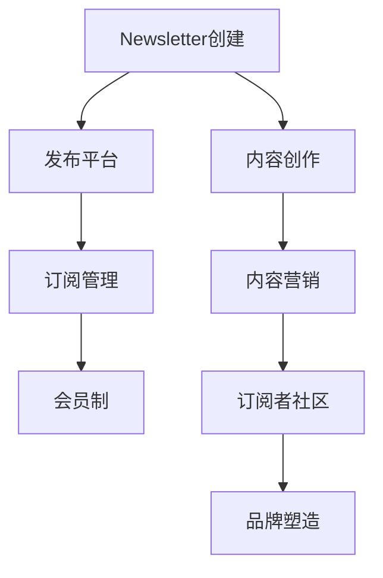

                 

# 程序员如何利用Newsletter进行知识变现

> 关键词：知识变现,技术交流,内容创作,订阅平台,订阅者社区,付费会员制,内容营销,个人品牌塑造

## 1. 背景介绍

在当今信息爆炸的时代，掌握最新科技动态、深度技术洞察成为每一个有志于技术进步的程序员的刚需。然而，繁杂的信息来源、碎片化的知识传递，使得许多程序员陷入了知识学习的困境。此时，**Newsletter**（电子报）作为一种有效的知识传播媒介，凭借其定制化、结构化的内容输出和长期稳定性，为程序员提供了便捷且高效的解决方案。

本文将探讨程序员如何利用Newsletter进行知识变现，并结合实例展示其运用策略。通过掌握Newsletter的运营技巧，程序员不仅能提升自身技术水平，还能开辟个人职业发展的新路径。

## 2. 核心概念与联系

为了更好地理解程序员如何利用Newsletter进行知识变现，本节将详细解释相关的核心概念及其联系。

### 2.1 核心概念概述

- **Newsletter**：即电子报，是一种定期发送的电子邮件订阅服务。内容通常涵盖特定主题的深度文章、技术博客、行业动态等，适合长期关注和深入学习。
- **知识变现**：通过内容创作、知识分享、技术培训等方式，将专业知识转化为经济效益的过程。
- **内容创作**：撰写高质量、有深度的技术文章、项目案例、解决方案等，为订阅者提供价值。
- **订阅平台**：如Substack、MailChimp、Segment.io等，提供的新闻letter发布和运营工具。
- **订阅者社区**：在Newsletter背后聚集的读者群体，通过内容互动形成紧密的社群关系。
- **付费会员制**：通过设置不同价格等级的会员订阅，提供有偿服务，如高质量报告、一对一技术咨询、专属课程等。
- **内容营销**：利用内容输出进行品牌推广、技术宣讲、影响力扩散，吸引更多订阅者。
- **个人品牌塑造**：通过长期稳定输出的优质内容，建立和提升个人在技术社区的影响力和权威性。

这些概念之间存在紧密的逻辑联系，通过系统化运营Newsletter，程序员能够有效进行知识变现，并在此过程中塑造个人品牌，提升技术影响力。

### 2.2 Mermaid流程图



该流程图展示了Newsletter运营的核心流程，从内容创作到发布平台、订阅管理、会员制、内容营销，最终形成订阅者社区和个人品牌塑造。

## 3. 核心算法原理 & 具体操作步骤

### 3.1 算法原理概述

程序员利用Newsletter进行知识变现，本质上是一个内容创作与市场运营的闭环过程。核心原理可以概括为：

1. **内容创作**：通过深入研究技术领域，创作高质量、有价值的内容，满足订阅者的学习需求。
2. **平台发布**：选择合适的发布平台，将内容推送至订阅者邮箱。
3. **订阅管理**：通过订阅管理工具，对订阅者进行分类、分组、个性化推送，提升用户留存率。
4. **会员制运营**：提供不同级别的会员订阅服务，增加收入来源。
5. **内容营销**：通过社交媒体、技术博客等渠道，进行内容推广，吸引新订阅者。
6. **品牌塑造**：长期输出高质量内容，逐步在技术社区中建立权威性和影响力。

### 3.2 算法步骤详解

下面将详细介绍利用Newsletter进行知识变现的详细步骤：

#### 3.2.1 创建Newsletter

1. **选择合适的发布平台**：
   - 评估Substack、MailChimp、Segment.io等平台的功能和费用。
   - 选择用户界面友好、功能丰富且成本可控的平台。

2. **注册账号**：
   - 访问平台官网，注册账号。
   - 填写基本信息，创建个人品牌logo。

3. **设计Newsletter模板**：
   - 使用平台提供的模板编辑器，设计邮件布局。
   - 设置邮件标题、封面图、主体内容、订阅按钮等元素。

#### 3.2.2 内容创作

1. **确定主题**：
   - 根据自身技术专长，选定一个或多个主要技术主题。
   - 调研市场需求，确保内容有价值且具有受众吸引力。

2. **撰写文章**：
   - 进行深入研究，撰写高质量技术文章。
   - 确保文章结构清晰、信息丰富、逻辑严密，避免信息冗余。

3. **审校内容**：
   - 邀请技术同行或行业专家审校文章，提升内容质量。
   - 修复语法错误、格式问题，优化阅读体验。

#### 3.2.3 发布与推送

1. **发布内容**：
   - 将最终确认的文章发布到平台。
   - 设置发布频率，确保内容持续稳定输出。

2. **推送邮件**：
   - 选择目标受众，推送到订阅者邮箱。
   - 设置邮件标题、封面图，提升打开率。

3. **用户互动**：
   - 鼓励订阅者留言、评论，增加互动性。
   - 定期开展问答、技术讨论等活动，提升用户粘性。

#### 3.2.4 订阅管理

1. **订阅设置**：
   - 在平台设置自动订阅功能，吸引潜在订阅者。
   - 提供免费订阅选项，降低订阅门槛。

2. **用户分类**：
   - 根据订阅者行为（如互动频率、订阅时长等），对用户进行分类。
   - 提供个性化推送，满足不同用户需求。

3. **用户流失管理**：
   - 定期分析用户流失原因，优化内容质量。
   - 主动与订阅者互动，提升用户体验。

#### 3.2.5 会员制运营

1. **设置会员等级**：
   - 根据内容价值和订阅者需求，设定不同等级的会员订阅。
   - 提供专属内容、技术咨询、课程等会员特权。

2. **推广会员制**：
   - 在内容中定期推广会员订阅。
   - 通过社交媒体、技术博客等渠道，进行会员推广。

3. **会员互动**：
   - 为会员提供专属客服支持。
   - 定期举办会员专享活动，增强会员忠诚度。

#### 3.2.6 内容营销

1. **社交媒体推广**：
   - 在LinkedIn、Twitter、GitHub等平台，分享文章和项目。
   - 定期发布技术动态，扩大影响力。

2. **技术博客更新**：
   - 将部分文章同步更新到个人技术博客。
   - 通过SEO优化，提升搜索引擎排名。

3. **技术演讲与讲座**：
   - 在技术会议、在线讲座中分享技术见解。
   - 增加线下和线上曝光率。

#### 3.2.7 品牌塑造

1. **持续输出优质内容**：
   - 定期发布深度技术文章、项目案例等。
   - 保持内容更新频率，提升用户依赖度。

2. **参与技术讨论**：
   - 在技术论坛、社交媒体中积极参与讨论。
   - 发布技术见解和解决方案，树立权威形象。

3. **个人技术社区建设**：
   - 创建技术兴趣小组或社群，定期举办技术分享会。
   - 通过社区互动，建立品牌认同感。

### 3.3 算法优缺点

利用Newsletter进行知识变现具有以下优点：

1. **内容定制化**：
   - 能够根据订阅者需求，提供定制化内容，满足不同学习者的需求。
   - 通过用户分类和个性化推送，提升用户满意度和留存率。

2. **长期稳定性**：
   - 相较于博客、视频等形式，Newsletter能提供长期、持续的知识输出。
   - 通过定期推送，保持用户订阅习惯，增加用户粘性。

3. **品牌推广**：
   - 利用内容营销和品牌塑造，提升个人或团队在技术社区中的影响力。
   - 通过品牌效应，吸引更多用户订阅，扩大受众群体。

4. **多渠道收益**：
   - 通过会员制、广告、品牌合作等方式，增加收入来源。
   - 多渠道收益模式，降低对单一来源的依赖，提升财务稳定性。

然而，利用Newsletter进行知识变现也存在以下缺点：

1. **内容创作压力**：
   - 需要持续创作高质量内容，内容创作的难度和压力较大。
   - 订阅者期待高，需要不断提升内容质量以满足预期。

2. **平台运营成本**：
   - 选择和维护合适的发布平台，需要一定的运营成本。
   - 订阅管理、会员制运营等环节，增加了运营复杂度。

3. **用户互动不足**：
   - 虽然部分平台支持订阅者互动，但互动频率和深度有限。
   - 用户反馈和互动不足，可能影响用户留存率。

### 3.4 算法应用领域

利用Newsletter进行知识变现的方法，适用于多种技术领域和职业路径，主要包括以下应用领域：

1. **技术专家与顾问**：
   - 利用个人技术深度，撰写技术博客、项目案例等，为订阅者提供技术咨询和解决方案。
   - 通过会员制和付费内容，增加收入来源。

2. **技术博主与自媒体**：
   - 创建技术主题的新闻letter，定期发布技术文章、项目案例、行业动态等。
   - 利用内容输出，吸引订阅者，提升个人品牌影响力。

3. **开源项目开发者**：
   - 定期发布项目进展和技术分享，增强项目曝光度。
   - 通过会员制订阅和项目捐赠等方式，获取社区支持。

4. **技术培训讲师**：
   - 通过Newsletter发布课程大纲、学习资源等，吸引学员订阅。
   - 提供付费课程和技术咨询，提升收入来源。

5. **技术创业者和团队**：
   - 定期发布产品更新和技术动态，增强品牌曝光。
   - 通过会员制订阅和品牌合作，提升用户黏性和市场影响力。

以上应用领域展示了Newsletter在技术社区中的广泛适用性，通过结合不同技术背景和职业路径，程序员能够有效利用Newsletter进行知识变现。

## 4. 数学模型和公式 & 详细讲解  
### 4.1 数学模型构建

利用Newsletter进行知识变现，核心数学模型可以概括为以下两个方面：

1. **用户增长模型**：
   - 用户增长模型描述了用户订阅数量随时间变化的规律。
   - 假设在初始时间t时，已有订阅用户数量为U(t)，新增订阅用户数量为G(t)，则用户总数N(t)可表示为：
     - \( N(t) = U(t) + G(t) \)

2. **订阅收益模型**：
   - 订阅收益模型描述了通过订阅带来的收入随时间变化的规律。
   - 假设订阅价格为P，会员订阅率为R，则总收入S(t)可表示为：
     - \( S(t) = P \times R \times t \)

### 4.2 公式推导过程

以下是对上述模型的详细推导：

#### 4.2.1 用户增长模型推导

1. **初始订阅用户数量**：
   - 假设在初始时间t0时，已有订阅用户数量为U(t0)。
   - \( U(t0) \)为常数，表示已有订阅用户数量。

2. **新增订阅用户数量**：
   - 假设每天新增订阅用户数量为G(t)，服从泊松分布，即：
     - \( G(t) \sim \text{Poisson}(\lambda) \)
     - 其中，\(\lambda\)为新用户日均增长率。

3. **用户总数模型**：
   - 根据上述假设，用户总数N(t)可表示为：
     - \( N(t) = U(t0) + \sum_{i=0}^{t-1}G(i) \)

4. **代入泊松分布**：
   - 由于G(t)服从泊松分布，用户总数模型进一步简化为：
     - \( N(t) = U(t0) + \lambda t \)

#### 4.2.2 订阅收益模型推导

1. **订阅价格和订阅率**：
   - 假设订阅价格为P，会员订阅率为R，即每天新增会员订阅比例。
   - \( R \)为常数，表示每天新增会员订阅比例。

2. **总收入模型**：
   - 假设每天新增订阅用户数量为G(t)，则总收入S(t)可表示为：
     - \( S(t) = P \times R \times t \)

3. **代入泊松分布**：
   - 由于G(t)服从泊松分布，总收入模型进一步简化为：
     - \( S(t) = P \times \lambda t \)

### 4.3 案例分析与讲解

假设某技术博主在初始时间t0时已有订阅用户数量为500，新用户日均增长率为1，订阅价格为9.99元/月，会员订阅率为0.2。利用上述模型，计算用户总数和总收入随时间变化规律：

1. **用户总数计算**：
   - 代入模型参数，得：
     - \( N(t) = 500 + 1 \times t \)
     - 假设t=6个月，则N(6) = 500 + 6 = 506

2. **总收入计算**：
   - 代入模型参数，得：
     - \( S(t) = 9.99 \times 0.2 \times t \)
     - 假设t=6个月，则S(6) = 9.99 \times 0.2 \times 6 = 59.94

以上案例展示了利用数学模型进行用户增长和收益预测的思路，通过系统化运营Newsletter，程序员可以更科学地规划内容创作和市场运营策略。

## 5. 项目实践：代码实例和详细解释说明

### 5.1 开发环境搭建

在进行项目实践前，首先需要搭建开发环境。以下是使用Python进行Substack Newsletter开发的流程：

1. **安装Substack API**：
   - 访问Substack官网，下载API文档和SDK。
   - 在Python环境中安装Substack SDK，如`substack-sdk-python`。

2. **创建项目**：
   - 使用Python Flask框架创建Web应用项目。
   - 配置数据库连接和API路由。

3. **设置Substack API**：
   - 创建Substack账号，生成API密钥。
   - 在项目代码中配置API密钥和新闻letter信息。

### 5.2 源代码详细实现

以下是一个简单的Python Flask新闻letter项目示例：

```python
from flask import Flask, request, jsonify
import substack

app = Flask(__name__)

# 初始化Substack API
substack_key = 'your_substack_api_key'
newsletter_title = 'Your Newsletter Title'
newsletter_description = 'Your Newsletter Description'
newsletter_url = 'https://yournewsletter.substack.com/'

# 获取订阅者信息
def get_subscribers():
    subscribers = substack.get_subscribers(substack_key)
    return subscribers

# 订阅新增通知
@app.route('/subscribe', methods=['POST'])
def subscribe():
    email = request.form['email']
    result = substack.add_subscriber(substack_key, email)
    return jsonify(result)

# 发布内容
@app.route('/publish', methods=['POST'])
def publish():
    content = request.form['content']
    substack.publish(substack_key, newsletter_title, content, newsletter_url)
    return jsonify({'success': True})

if __name__ == '__main__':
    app.run(debug=True)
```

**代码解读与分析**：

- **Flask框架**：使用Python Flask框架，快速搭建Web应用，支持RESTful API接口。
- **Substack SDK**：利用Substack提供的SDK，进行订阅者管理、内容发布等操作。
- **API路由**：定义订阅、发布等核心操作API路由。
- **API接口**：通过POST请求，向服务器提交订阅者信息、发布内容等。
- **结果返回**：服务器返回API操作结果，如订阅成功、内容发布成功等。

### 5.3 运行结果展示

运行上述代码后，可以通过访问`/subscribe`和`/publish`路由，完成订阅者信息提交和内容发布操作。例如，通过`POST /subscribe`提交邮箱信息，服务器返回订阅成功结果；通过`POST /publish`提交内容信息，服务器返回内容发布成功结果。

## 6. 实际应用场景

### 6.1 技术博客与自媒体

利用Newsletter进行技术博客与自媒体运营，可以建立稳定的知识输出渠道，提升个人品牌影响力。以下是一个实际应用场景的示例：

假设某技术博主每周发布一篇深度技术文章，每月发布一篇技术总结。通过设定不同的订阅价格，吸引不同层次的用户订阅：

1. **基础订阅**：
   - 价格：9.99元/月
   - 内容：每周一篇深度技术文章

2. **高级订阅**：
   - 价格：29.99元/月
   - 内容：每周一篇深度技术文章 + 每月一篇技术总结

3. **VIP订阅**：
   - 价格：59.99元/月
   - 内容：每周一篇深度技术文章 + 每月一篇技术总结 + 一对一技术咨询

通过以上设置，技术博主不仅能够获得稳定的收入来源，还能通过不同层次的订阅者互动，提升品牌影响力和用户黏性。

### 6.2 开源项目开发者

利用Newsletter进行开源项目开发者的技术分享和交流，可以增强项目曝光度，吸引更多开发者关注和贡献。以下是一个实际应用场景的示例：

假设某开源项目开发者定期发布项目进展和技术分享，通过设定不同的订阅价格，吸引不同层次的用户订阅：

1. **基础订阅**：
   - 价格：9.99元/月
   - 内容：每周一次项目进展和技术分享

2. **高级订阅**：
   - 价格：29.99元/月
   - 内容：每周一次项目进展和技术分享 + 专属代码审查

3. **VIP订阅**：
   - 价格：59.99元/月
   - 内容：每周一次项目进展和技术分享 + 专属代码审查 + 项目管理咨询

通过以上设置，开源项目开发者不仅能够获得稳定的收入来源，还能通过不同层次的订阅者互动，增强项目曝光度和社区活跃度。

### 6.3 技术培训讲师

利用Newsletter进行技术培训讲师的内容输出和品牌推广，可以吸引更多学员订阅和参加培训。以下是一个实际应用场景的示例：

假设某技术培训讲师定期发布课程大纲、学习资源等，通过设定不同的订阅价格，吸引不同层次的用户订阅：

1. **基础订阅**：
   - 价格：9.99元/月
   - 内容：每周一次课程大纲和学习资源

2. **高级订阅**：
   - 价格：29.99元/月
   - 内容：每周一次课程大纲和学习资源 + 专属课程演示

3. **VIP订阅**：
   - 价格：59.99元/月
   - 内容：每周一次课程大纲和学习资源 + 专属课程演示 + 一对一技术咨询

通过以上设置，技术培训讲师不仅能够获得稳定的收入来源，还能通过不同层次的订阅者互动，提升品牌影响力和学员转化率。

### 6.4 未来应用展望

随着技术的不断进步，利用Newsletter进行知识变现的应用场景将更加多样。以下是未来可能的应用展望：

1. **元宇宙技术**：
   - 利用元宇宙技术，创建虚拟新闻letter空间，提供沉浸式内容体验。
   - 通过虚拟现实和增强现实技术，增强用户互动和参与感。

2. **区块链技术**：
   - 利用区块链技术，创建去中心化的新闻letter平台，确保内容真实性和版权保护。
   - 通过智能合约，实现自动化订阅和收益分配。

3. **AI技术**：
   - 利用AI技术，自动生成订阅者兴趣标签，进行个性化内容推送。
   - 通过自然语言处理技术，提高内容推荐的准确性和用户满意度。

4. **AR/VR技术**：
   - 利用AR/VR技术，创建虚拟现实新闻letter，提供多维度内容展示。
   - 通过增强现实技术，增强用户沉浸感和互动体验。

5. **NFT技术**：
   - 利用NFT技术，发行订阅者专属数字资产，提升用户忠诚度和品牌价值。
   - 通过非同质化代币，实现用户行为激励和生态建设。

通过结合最新技术，利用Newsletter进行知识变现将更加智能化、个性化、多样化，为程序员开辟更广阔的职业发展路径。

## 7. 工具和资源推荐

### 7.1 学习资源推荐

为了帮助程序员系统掌握利用Newsletter进行知识变现的理论基础和实践技巧，以下是一些推荐的学习资源：

1. **《Content Marketing: Mastery of the Art》**：
   - 经典内容营销书籍，涵盖营销理论、实践技巧、案例分析等。
   - 适合深入理解内容创作和运营策略。

2. **《Blogging: A Symphony of Blogging: Your First Year Blogging》**：
   - 博主张志东的博客实战指南，涵盖博客运营、内容创作、品牌推广等。
   - 适合了解技术博客和自媒体运营的实战经验。

3. **《The Complete Guide to Technical Blogging》**：
   - 技术博客指南，涵盖技术写作技巧、SEO优化、数据分析等。
   - 适合提升技术博客写作水平和SEO优化能力。

4. **《The Ultimate Guide to Email Newsletters》**：
   - 关于Email Newsletters的全面指南，涵盖内容创作、订阅管理、平台运营等。
   - 适合深入理解Newsletter运营技巧。

5. **《Social Media Marketing All-in-One For Dummies》**：
   - 社交媒体营销指南，涵盖平台选择、内容创作、用户互动等。
   - 适合提升社交媒体营销能力。

6. **《The Content Strategy Principles: Guide to Creating an Effective Content Strategy》**：
   - 内容策略指南，涵盖内容策略制定、内容规划、内容发布等。
   - 适合系统理解内容创作和品牌推广的策略。

### 7.2 开发工具推荐

为了高效进行利用Newsletter进行知识变现的项目开发，以下是一些推荐的开发工具：

1. **Substack**：
   - 提供丰富的Newsletter运营工具，支持订阅管理、内容发布、用户互动等。
   - 适合创建和管理Newsletter。

2. **MailChimp**：
   - 提供强大的邮件营销工具，支持自动化订阅、个性化推送、数据分析等。
   - 适合进行邮件新闻letter的运营。

3. **Segment.io**：
   - 提供高级的订阅管理工具，支持多平台数据集成、用户行为分析等。
   - 适合复杂订阅场景的新闻letter管理。

4. **Flask**：
   - 轻量级Web框架，适合快速搭建新闻letter后台系统。
   - 支持RESTful API接口，便于内容发布和订阅管理。

5. **Substack SDK**：
   - 提供Python SDK，支持Substack API的调用。
   - 适合自动化订阅和内容发布。

6. **Django**：
   - 强大的Web开发框架，支持复杂的新闻letter运营和管理。
   - 提供全面的开发工具和插件，支持订阅管理、内容发布、用户互动等。

### 7.3 相关论文推荐

以下是几篇相关领域的重要论文，推荐阅读：

1. **《Content Discovery for Newsletters: A Deep Learning Approach》**：
   - 利用深度学习技术进行内容推荐，提升用户订阅体验。
   - 适合理解技术推荐系统的应用。

2. **《Evolving the Newsletter: The Evolution of Email Marketing》**：
   - 分析Newsletter的发展历程，探讨未来趋势。
   - 适合了解Newsletter的历史和未来方向。

3. **《The Future of Content Marketing: Trends and Predictions for 2022》**：
   - 分析内容营销的未来趋势，探讨新的运营策略。
   - 适合了解未来内容营销的发展方向。

4. **《The Ultimate Guide to Email Marketing Strategies》**：
   - 提供全面的Email Marketing策略指南，涵盖内容创作、用户互动、平台选择等。
   - 适合提升Email Marketing运营能力。

5. **《The Future of Newsletters: 2022 & Beyond》**：
   - 分析Newsletter的未来发展趋势，探讨新的运营模式。
   - 适合了解未来Newsletter的运营方向。

## 8. 总结：未来发展趋势与挑战

### 8.1 总结

本文详细探讨了程序员如何利用Newsletter进行知识变现，并结合实例展示了运营技巧。通过系统化运营Newsletter，程序员不仅能够提升自身技术水平，还能开辟个人职业发展的新路径。本文从内容创作、平台发布、订阅管理、会员制运营、内容营销等多个角度，全面展示了利用Newsletter进行知识变现的策略和方法。

通过本文的系统梳理，可以看到，利用Newsletter进行知识变现能够有效提升程序员的技术影响力，为职业发展提供新的增长点。未来，随着技术的不断进步和市场需求的演变，Newsletter将在内容创作、品牌推广、技术培训等领域发挥越来越重要的作用，程序员需要不断提升自身的运营能力和技术水平，才能在这个不断变化的市场环境中保持竞争力。

### 8.2 未来发展趋势

展望未来，利用Newsletter进行知识变现将呈现以下几个发展趋势：

1. **内容定制化**：
   - 通过用户行为分析和内容推荐系统，提供更加个性化的内容推荐。
   - 利用AI技术，动态调整内容输出，提升用户满意度。

2. **平台多样化**：
   - 结合多个平台（如Substack、MailChimp、Segment.io等），提供多渠道订阅和内容分发。
   - 利用社交媒体、博客、视频等多样化平台，扩大内容覆盖范围。

3. **运营自动化**：
   - 通过自动化工具和机器人，实现内容创作、用户互动、数据分析等自动化。
   - 利用自然语言处理、机器学习等技术，提升运营效率和效果。

4. **数据驱动**：
   - 利用大数据和数据分析，优化订阅者管理、内容推荐、收益分配等环节。
   - 通过数据驱动，提高运营决策的科学性和准确性。

5. **生态建设**：
   - 通过内容社区、开发者社区等生态建设，增强用户粘性和互动性。
   - 利用平台生态效应，提升品牌影响力和用户忠诚度。

6. **跨界融合**：
   - 结合元宇宙、区块链、AI、AR/VR等新兴技术，创新内容输出和互动方式。
   - 通过跨界融合，提升内容的沉浸式体验和互动效果。

### 8.3 面临的挑战

尽管利用Newsletter进行知识变现带来了诸多机遇，但在实际运营中也面临以下挑战：

1. **内容创作难度**：
   - 持续创作高质量内容，内容创作的难度和压力较大。
   - 订阅者期望高，需要不断提升内容质量以满足预期。

2. **运营成本高**：
   - 选择和维护合适的发布平台，需要一定的运营成本。
   - 订阅管理、会员制运营等环节，增加了运营复杂度。

3. **用户互动不足**：
   - 虽然部分平台支持订阅者互动，但互动频率和深度有限。
   - 用户反馈和互动不足，可能影响用户留存率。

4. **市场竞争激烈**：
   - 市场上存在大量内容创作者和品牌，竞争激烈。
   - 需要不断提升运营能力和内容质量，以保持市场竞争力。

5. **技术变革快**：
   - 技术发展迅速，需要持续学习和适应新技术。
   - 技术变革带来的运营成本和复杂度，可能影响运营效率。

6. **内容版权问题**：
   - 需要处理内容版权和版权保护问题，避免侵权风险。
   - 内容侵权和版权纠纷，可能影响品牌声誉和运营稳定。

### 8.4 研究展望

面对利用Newsletter进行知识变现所面临的挑战，未来的研究需要在以下几个方面寻求新的突破：

1. **内容创作自动化**：
   - 利用AI技术，自动生成高质量内容，提升内容创作效率。
   - 通过生成对抗网络(GAN)等技术，实现内容自动生成和优化。

2. **运营成本优化**：
   - 利用云计算和自动化工具，降低平台运营和内容发布的成本。
   - 通过订阅管理和数据分析，优化运营策略，提升效率。

3. **用户互动增强**：
   - 利用社交媒体、论坛、问答等平台，增加用户互动频率和深度。
   - 通过用户反馈和互动，提升用户满意度和忠诚度。

4. **市场竞争策略**：
   - 通过差异化内容、多样化平台、多渠道分发等策略，提升市场竞争力。
   - 利用数据分析和用户行为研究，优化市场策略。

5. **技术融合创新**：
   - 结合元宇宙、区块链、AI、AR/VR等新兴技术，创新内容输出和互动方式。
   - 通过跨界融合，提升内容的沉浸式体验和互动效果。

6. **版权保护机制**：
   - 利用区块链和数字水印技术，实现内容版权保护。
   - 通过智能合约和区块链技术，确保内容真实性和版权归属。

通过以上研究方向的探索，将有助于解决利用Newsletter进行知识变现所面临的挑战，提升运营效率和效果，实现更加智能化、个性化的知识变现策略。

## 9. 附录：常见问题与解答

**Q1: 如何选择合适的发布平台？**

A: 选择发布平台时，需要考虑以下几个因素：
1. **功能丰富性**：评估平台的功能和API接口，选择功能丰富、易于使用的平台。
2. **费用成本**：根据预算和需求，选择费用合理的平台。
3. **用户基数**：选择用户基数大、活跃度高的平台，有助于提高内容曝光率。
4. **平台口碑**：选择口碑良好、运营稳定的平台，确保内容安全和运营顺利。

**Q2: 如何提升内容创作效率？**

A: 提升内容创作效率，可以通过以下方法：
1. **内容模板**：使用内容模板，快速生成结构化的内容。
2. **自动化工具**：利用自动化工具，如Markdown编辑器、文本生成工具等，提升创作效率。
3. **内容库**：建立内容库，存储和管理常用内容模块，便于快速调用。
4. **协作工具**：利用协作工具，如GitHub、Notion等，进行团队协作，提升创作效率。

**Q3: 如何提升用户互动效果？**

A: 提升用户互动效果，可以通过以下方法：
1. **互动激励**：通过互动激励机制，如积分系统、优惠券等，增加用户互动积极性。
2. **用户反馈**：定期收集用户反馈，优化内容和运营策略。
3. **社交媒体推广**：利用社交媒体平台，推广内容，增加用户互动。
4. **专题讨论**：定期举办专题讨论活动，增加用户互动和参与感。

**Q4: 如何处理内容版权和版权保护问题？**

A: 处理内容版权和版权保护问题，可以通过以下方法：
1. **版权声明**：在内容中使用版权声明，明确版权归属。
2. **数字水印**：使用数字水印技术，保护内容版权。
3. **区块链技术**：利用区块链技术，实现内容版权保护和真实性验证。
4. **智能合约**：通过智能合约，确保内容真实性和版权归属。

**Q5: 如何处理市场竞争问题？**

A: 处理市场竞争问题，可以通过以下方法：
1. **差异化内容**：利用差异化内容，提升市场竞争力。
2. **多样化平台**：利用多平台分发，扩大内容覆盖范围。
3. **用户社区建设**：通过内容社区和开发者社区建设，增强用户粘性和互动性。
4. **多渠道合作**：通过多渠道合作，提升品牌影响力和用户忠诚度。

通过以上常见问题的解答，希望能够帮助程序员更好地理解和应对利用Newsletter进行知识变现时面临的挑战，提升运营效率和效果，实现更加智能化、个性化的知识变现策略。

---

作者：禅与计算机程序设计艺术 / Zen and the Art of Computer Programming

