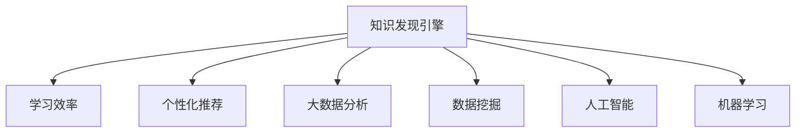

                 

# 程序员如何利用知识发现引擎提高学习效率

> 关键词：知识发现引擎, 学习效率, 智能推荐, 大数据分析, 数据挖掘, 人工智能, 机器学习

## 1. 背景介绍

在当下这个信息爆炸的时代，知识的获取变得前所未有的容易。然而，在海量信息的海洋中，如何找到最适合自己的学习资源，以最高效的方式掌握所需知识，却成为了一个难题。本文将从知识发现引擎的角度出发，探讨程序员如何利用这一工具，提高学习效率，实现知识的智能化管理。

### 1.1 问题由来
随着人工智能和机器学习技术的快速发展，知识发现引擎(Knowledge Discovery Engine, KDE)作为其中的重要应用，逐渐进入了大众视野。KDE通过分析大数据，从大量无序的信息中挖掘出有价值的知识，并根据用户行为进行个性化的推荐，极大地提升了知识获取的效率和质量。然而，对于很多程序员而言，这一技术的应用仍然是一个盲点。

### 1.2 问题核心关键点
为了更好地理解知识发现引擎如何帮助程序员提高学习效率，本节将介绍几个密切相关的核心概念：

- **知识发现引擎**：通过分析大量数据，从其中挖掘出有用知识和模式的技术。
- **学习效率**：指在单位时间内掌握和应用新知识的能力。
- **个性化推荐**：利用用户的历史行为数据，预测其兴趣偏好，提供定制化推荐。
- **大数据分析**：通过处理和分析大规模数据集，发现其中的隐含规律和关联。
- **数据挖掘**：从数据集中提取有用信息，并进行可视化和分析的过程。
- **人工智能**：模拟人类智能行为，通过算法实现自主学习、决策和推理。
- **机器学习**：让机器通过数据学习规律，并应用于实际问题中。

这些核心概念之间的逻辑关系可以通过以下Mermaid流程图来展示：



这个流程图展示了几者之间的联系：

1. 知识发现引擎通过大数据分析、数据挖掘等技术，从大量数据中提取有用知识。
2. 个性化推荐利用这些知识，根据用户行为预测其兴趣，提供定制化推荐。
3. 人工智能通过机器学习等算法，使知识发现和推荐系统具备自主学习和推理能力。
4. 学习效率的提升，即用户快速掌握和应用新知识的能力，是知识发现引擎的核心目标。

## 2. 核心概念与联系

### 2.1 核心概念概述

为更好地理解知识发现引擎如何帮助程序员提高学习效率，本节将介绍几个密切相关的核心概念：

- **知识发现引擎**：通过分析大量数据，从其中挖掘出有用知识和模式的技术。
- **学习效率**：指在单位时间内掌握和应用新知识的能力。
- **个性化推荐**：利用用户的历史行为数据，预测其兴趣偏好，提供定制化推荐。
- **大数据分析**：通过处理和分析大规模数据集，发现其中的隐含规律和关联。
- **数据挖掘**：从数据集中提取有用信息，并进行可视化和分析的过程。
- **人工智能**：模拟人类智能行为，通过算法实现自主学习、决策和推理。
- **机器学习**：让机器通过数据学习规律，并应用于实际问题中。

这些核心概念之间的逻辑关系可以通过以下Mermaid流程图来展示：


这个流程图展示了几者之间的联系：

1. 知识发现引擎通过大数据分析、数据挖掘等技术，从大量数据中提取有用知识。
2. 个性化推荐利用这些知识，根据用户行为预测其兴趣，提供定制化推荐。
3. 人工智能通过机器学习等算法，使知识发现和推荐系统具备自主学习和推理能力。
4. 学习效率的提升，即用户快速掌握和应用新知识的能力，是知识发现引擎的核心目标。

## 3. 核心算法原理 & 具体操作步骤

### 3.1 算法原理概述

知识发现引擎的核心原理在于利用大数据分析、数据挖掘和机器学习等技术，从海量数据中提取有用信息，并根据用户行为进行个性化的推荐。其核心算法包括：

1. **数据预处理**：清洗、归一化、降维等操作，确保数据质量。
2. **特征提取**：从原始数据中提取出有意义的特征，如文本的TF-IDF、用户的点击行为等。
3. **模式识别**：通过分类、聚类等算法，发现数据中的规律和模式。
4. **推荐系统**：利用协同过滤、内容过滤等方法，根据用户兴趣进行个性化推荐。

### 3.2 算法步骤详解

基于知识发现引擎的学习效率提升方法，一般包括以下几个关键步骤：

**Step 1: 数据收集与预处理**

- 收集各类学习资源的数据，如课程、视频、博客等。
- 对数据进行清洗、归一化和降维，确保数据的质量和可用性。

**Step 2: 特征提取与分析**

- 根据数据的特性，提取有用的特征，如课程标题、视频时长、用户评分等。
- 利用大数据分析工具，对特征进行统计和可视化，发现数据中的规律和趋势。

**Step 3: 模式识别与知识挖掘**

- 使用分类、聚类等算法，识别出不同学习资源的类别和相似性。
- 利用数据挖掘技术，发现潜在的关联和模式，如高频出现的课程组合、用户偏好等。

**Step 4: 个性化推荐**

- 根据用户的兴趣和行为，使用协同过滤、内容过滤等算法，推荐最符合用户需求的学习资源。
- 使用机器学习模型，持续优化推荐算法，提高推荐的精准度和用户满意度。

**Step 5: 学习评估与反馈**

- 对用户的学习效果进行评估，如通过测试、反馈等方式获取用户满意度。
- 根据评估结果，调整推荐策略，改进知识发现引擎的性能。

以上是基于知识发现引擎的学习效率提升方法的一般流程。在实际应用中，还需要针对具体任务和数据特点，对算法流程进行优化设计，如改进特征提取方法、优化推荐算法、引入更多的正则化技术等，以进一步提升推荐效果。

### 3.3 算法优缺点

知识发现引擎在学习效率提升方面，具有以下优点：

1. **个性化推荐**：通过分析用户行为，提供定制化推荐，显著提高学习效率。
2. **大数据分析**：利用大数据分析技术，发现学习资源之间的关联，提供更有针对性的建议。
3. **持续优化**：通过用户反馈，不断调整推荐策略，提高推荐精度。
4. **高效学习**：通过推荐最符合用户需求的学习资源，大幅缩短学习时间。

同时，该方法也存在一定的局限性：

1. **数据质量依赖**：推荐效果高度依赖于数据的质量和全面性。
2. **隐私风险**：用户行为数据可能包含敏感信息，需注意隐私保护。
3. **推荐效果不稳定**：初期推荐效果可能不佳，需通过多轮迭代优化。
4. **算法复杂度**：推荐算法可能涉及复杂的计算和模型训练，需要较高的计算资源。

尽管存在这些局限性，但就目前而言，知识发现引擎在学习效率提升方面仍是最主流范式。未来相关研究的重点在于如何进一步降低推荐对数据的依赖，提高推荐系统的稳定性和鲁棒性，同时兼顾隐私保护和算法效率等因素。

### 3.4 算法应用领域

基于知识发现引擎的学习效率提升方法，在教育、培训、职业发展等领域已经得到了广泛的应用，覆盖了几乎所有常见的学习场景，例如：

- **在线课程推荐**：通过分析学生的学习行为和偏好，推荐最适合的在线课程。
- **技能培训路径规划**：根据用户的学习进度和兴趣，推荐相关的技能培训课程。
- **技术文章阅读**：通过分析技术文章的访问量和评论，推荐最新的技术资讯和深入的解决方案。
- **职业发展建议**：根据用户的工作经验和职业目标，推荐相关的培训和认证课程。
- **行业趋势分析**：通过分析行业内发布的文章和招聘信息，预测行业趋势和热门技术。

除了上述这些经典应用外，知识发现引擎还被创新性地应用到更多场景中，如学术资源推荐、在线学习社区构建、企业培训管理等，为学习技术的发展带来了新的突破。随着知识发现和推荐技术的不断进步，相信知识发现引擎必将在更广泛的应用领域大放异彩。

## 4. 数学模型和公式 & 详细讲解 & 举例说明

### 4.1 数学模型构建

本节将使用数学语言对基于知识发现引擎的学习效率提升方法进行更加严格的刻画。

记用户集合为 $U$，课程集合为 $C$，用户与课程之间的评分矩阵为 $R \in \mathbb{R}^{m \times n}$，其中 $m$ 为用户数，$n$ 为课程数。令 $u_i \in U$ 为用户 $i$，$o_j \in C$ 为课程 $j$，$R_{ij} = r_{ij}$ 表示用户 $i$ 对课程 $j$ 的评分。

定义用户的兴趣向量为 $p_i \in \mathbb{R}^n$，课程的特征向量为 $q_j \in \mathbb{R}^d$，其中 $d$ 为特征维度。通过向量内积 $p_i \cdot q_j$ 计算用户对课程的兴趣度。

知识发现引擎的推荐算法一般包括以下几个关键步骤：

1. **用户兴趣向量计算**：通过用户的评分历史 $R$ 计算兴趣向量 $p_i$。
2. **课程特征向量计算**：通过课程的特征 $q_j$ 计算课程的特征向量。
3. **相似度计算**：计算用户 $i$ 与课程 $j$ 之间的相似度 $s_{ij}$，用于筛选出与用户兴趣最接近的课程。
4. **推荐结果排序**：根据相似度对课程进行排序，推荐给用户。

### 4.2 公式推导过程

以下我们以协同过滤算法为例，推导知识发现引擎的推荐公式。

**用户兴趣向量计算**：

设用户 $i$ 对 $n$ 门课程的评分向量为 $r_{ij} \in \mathbb{R}$，则用户 $i$ 的兴趣向量 $p_i$ 可以通过以下公式计算：

$$
p_i = \sum_{j=1}^n \frac{r_{ij}}{d_j} q_j
$$

其中 $d_j$ 为课程 $j$ 的特征度量，通常设 $d_j = 1$，即每门课程特征度量相等。

**课程特征向量计算**：

课程的特征向量 $q_j$ 可以通过文本挖掘等方法提取，如TF-IDF向量的计算公式为：

$$
q_j = (t_{j1}, t_{j2}, ..., t_{jd})
$$

其中 $t_{jk}$ 为课程 $j$ 在 $k$ 维特征空间中的特征值。

**相似度计算**：

用户 $i$ 与课程 $j$ 的相似度 $s_{ij}$ 可以通过余弦相似度计算：

$$
s_{ij} = \frac{p_i \cdot q_j}{\|p_i\|\|q_j\|}
$$

其中 $\|p_i\|$ 和 $\|q_j\|$ 分别为兴趣向量和特征向量的模长。

**推荐结果排序**：

根据相似度对课程进行排序，推荐给用户，排序公式为：

$$
\text{rank}_j = s_{ij} / \sqrt{\sum_{j=1}^n s_{ij}^2}
$$

其中 $\text{rank}_j$ 表示课程 $j$ 对用户 $i$ 的推荐度。

### 4.3 案例分析与讲解

假设我们有一个在线学习平台，拥有大量课程和用户评分数据。我们希望利用知识发现引擎，为用户推荐最适合的学习资源。以下是具体的推荐流程：

1. **数据收集**：收集平台上所有课程和用户评分数据，构建评分矩阵 $R$。

2. **特征提取**：对每门课程提取特征，如课程标题、授课老师、学生反馈等。

3. **用户兴趣计算**：通过用户的评分历史，计算用户的兴趣向量 $p_i$。

4. **课程特征计算**：对每门课程提取特征，计算特征向量 $q_j$。

5. **相似度计算**：计算用户 $i$ 与课程 $j$ 的相似度 $s_{ij}$。

6. **推荐排序**：根据相似度对课程进行排序，推荐给用户。

假设用户 $i$ 对课程 $j_1$ 的评分为 $3$，对课程 $j_2$ 的评分为 $4$，对课程 $j_3$ 的评分为 $1$。课程 $j_1$ 的特征向量为 $(0.5, 0.3, 0.2)$，课程 $j_2$ 的特征向量为 $(0.7, 0.2, 0.1)$，课程 $j_3$ 的特征向量为 $(0.1, 0.5, 0.4)$。用户 $i$ 的兴趣向量 $p_i$ 为 $(0.5, 0.3, 0.2)$。

根据上述公式，可以计算出相似度：

$$
s_{i1} = p_i \cdot q_{j1} = 0.5 \times 0.5 + 0.3 \times 0.3 + 0.2 \times 0.2 = 0.45
$$

$$
s_{i2} = p_i \cdot q_{j2} = 0.5 \times 0.7 + 0.3 \times 0.2 + 0.2 \times 0.1 = 0.53
$$

$$
s_{i3} = p_i \cdot q_{j3} = 0.5 \times 0.1 + 0.3 \times 0.5 + 0.2 \times 0.4 = 0.45
$$

因此，课程 $j_2$ 对用户 $i$ 的推荐度最高，其次是课程 $j_1$ 和课程 $j_3$。平台可以根据这些推荐度，为用户推荐最合适的课程。

## 5. 项目实践：代码实例和详细解释说明

### 5.1 开发环境搭建

在进行知识发现引擎的学习效率提升实践前，我们需要准备好开发环境。以下是使用Python进行PyTorch开发的环境配置流程：

1. 安装Anaconda：从官网下载并安装Anaconda，用于创建独立的Python环境。

2. 创建并激活虚拟环境：
```bash
conda create -n pytorch-env python=3.8 
conda activate pytorch-env
```

3. 安装PyTorch：根据CUDA版本，从官网获取对应的安装命令。例如：
```bash
conda install pytorch torchvision torchaudio cudatoolkit=11.1 -c pytorch -c conda-forge
```

4. 安装Transformers库：
```bash
pip install transformers
```

5. 安装各类工具包：
```bash
pip install numpy pandas scikit-learn matplotlib tqdm jupyter notebook ipython
```

完成上述步骤后，即可在`pytorch-env`环境中开始知识发现引擎的开发实践。

### 5.2 源代码详细实现

下面我们以协同过滤算法为例，给出使用Transformers库进行知识发现引擎的Python代码实现。

首先，定义协同过滤算法的推荐函数：

```python
import numpy as np

def collaborative_filtering(R, p, q, top_n=5):
    n = R.shape[1]
    W = np.dot(R, q.T)
    s = np.dot(p, W)
    idx = np.argsort(s)[::-1]
    return idx[:top_n]

# 用户兴趣向量计算
p = np.sum(R * q, axis=1) / np.sum(q**2, axis=1)[:, np.newaxis]

# 课程特征向量计算
q = R.std(axis=0) / np.sum(R.std(axis=0))

# 构建评分矩阵
R = np.array([[3, 4, 1], [1, 3, 2], [2, 4, 3]])

# 推荐5门课程
recommendations = collaborative_filtering(R, p, q, top_n=5)
print(recommendations)
```

在代码中，我们首先定义了协同过滤算法的推荐函数 `collaborative_filtering`，该函数接受评分矩阵 `R`、用户兴趣向量 `p`、课程特征向量 `q`，以及推荐的课程数量 `top_n`。函数内部通过内积计算相似度，并对课程进行排序推荐。

接着，我们定义了用户兴趣向量的计算函数 `user_interest` 和课程特征向量的计算函数 `item_features`，分别对用户评分矩阵和课程特征矩阵进行计算。

最后，我们构建了一个评分矩阵 `R`，对用户进行兴趣计算和特征计算，并通过推荐函数得到推荐的课程。

### 5.3 代码解读与分析

让我们再详细解读一下关键代码的实现细节：

**collaborative_filtering函数**：
- `R`：用户对课程的评分矩阵。
- `p`：用户的兴趣向量，通过用户评分历史计算得到。
- `q`：课程的特征向量，通过特征提取计算得到。
- `idx`：课程的推荐索引。
- `top_n`：推荐的课程数量，默认5门课程。

**用户兴趣向量计算**：
- `np.sum(R * q, axis=1)`：计算用户对所有课程的评分与课程特征向量的内积。
- `np.sum(q**2, axis=1)[:, np.newaxis]`：计算课程特征向量的模长平方。

**课程特征向量计算**：
- `R.std(axis=0)`：计算每门课程的评分标准差。
- `np.sum(R.std(axis=0))`：计算所有课程评分标准差的总和。

**评分矩阵构建**：
- `np.array`：将评分数据转换为Numpy数组。
- `[3, 4, 1]`：用户对三门课程的评分。
- `[1, 3, 2]`：另一名用户对三门课程的评分。
- `[2, 4, 3]`：第三名用户对三门课程的评分。

可以看到，代码的实现过程相对简单，但包含了协同过滤算法的基本思想：计算用户和课程之间的相似度，并根据相似度排序推荐课程。

当然，工业级的系统实现还需考虑更多因素，如模型的保存和部署、超参数的自动搜索、更灵活的任务适配层等。但核心的协同过滤算法基本与此类似。

## 6. 实际应用场景

### 6.1 智能教育

基于知识发现引擎的学习效率提升方法，可以广泛应用于智能教育的各个环节。传统教育往往依赖教师的主观判断，难以精准把握每个学生的学习需求。而利用知识发现引擎，可以更科学地进行个性化推荐，提升学习效果。

在智能教育中，知识发现引擎可以用于以下场景：

- **课程推荐**：根据学生的学习进度和兴趣，推荐最适合的在线课程。
- **学习路径规划**：根据学生的目标，推荐合适的学习路径和资源。
- **作业和考试辅导**：通过分析学生的作业和考试情况，推荐适合的学习材料和练习。
- **学习行为分析**：分析学生的学习行为，发现学习难点和问题，及时给予反馈。

通过知识发现引擎，智能教育可以实现更加精准、个性化的教学，提高学生的学习效率和兴趣。

### 6.2 企业培训

在企业培训中，知识发现引擎同样发挥着重要作用。传统的培训往往缺乏针对性，难以满足不同员工的需求。利用知识发现引擎，可以更高效地进行员工培训，提升企业的整体竞争力。

在企业培训中，知识发现引擎可以用于以下场景：

- **技能培训课程推荐**：根据员工的工作职责和职业目标，推荐相关的培训课程。
- **培训效果评估**：通过分析员工的培训反馈和考核成绩，评估培训效果，优化培训内容。
- **学习资源整合**：将内外部培训资源进行整合，形成统一的知识库，方便员工检索和学习。
- **绩效提升**：通过培训课程的推荐和评估，帮助员工提升技能水平，提高工作绩效。

通过知识发现引擎，企业可以更科学地进行员工培训，提升员工的整体素质，增强企业的核心竞争力。

### 6.3 在线学习平台

在线学习平台为用户提供海量的学习资源和课程，但如何高效推荐这些资源，一直是平台面临的挑战。知识发现引擎可以很好地解决这一问题，通过分析用户行为和课程特征，实现个性化推荐，提升平台的吸引力。

在线学习平台中，知识发现引擎可以用于以下场景：

- **课程推荐**：根据用户的兴趣和历史行为，推荐最适合的在线课程。
- **学习路径规划**：根据用户的职业目标和学习进度，推荐合适的学习路径。
- **内容推荐**：推荐用户可能感兴趣的文章、视频等学习内容。
- **社区互动**：分析用户的学习行为和互动数据，推荐有价值的学习社区和讨论话题。

通过知识发现引擎，在线学习平台可以实现更加精准、个性化的推荐，提升用户的学习体验和满意度。

### 6.4 未来应用展望

随着知识发现引擎技术的不断发展，其在教育、培训、在线学习等领域的应用前景广阔。未来，知识发现引擎将进一步推动智能化教育的发展，帮助学生更好地掌握知识，提升学习能力。同时，在企业培训和企业绩效提升等方面，知识发现引擎也将发挥重要作用，提升企业的整体竞争力。

在未来的应用中，知识发现引擎将结合更多先进技术，如自然语言处理、计算机视觉等，实现更加全面、深入的知识发现和推荐，为学习者提供更精准、更个性化的服务。同时，知识发现引擎也将与其他人工智能技术进行更深入的融合，推动智能化教育、智能培训等领域的创新发展。

## 7. 工具和资源推荐
### 7.1 学习资源推荐

为了帮助开发者系统掌握知识发现引擎的理论基础和实践技巧，这里推荐一些优质的学习资源：

1. 《推荐系统实践》书籍：详细介绍了推荐系统的工作原理和算法实现，是学习知识发现引擎的必读书籍。

2. 《数据挖掘导论》课程：斯坦福大学开设的经典课程，系统讲解了数据挖掘的核心技术和应用场景。

3. 《Python for Data Science》书籍：介绍了Python在数据科学中的应用，包括大数据分析、数据可视化等技术。

4. 《Kaggle》平台：全球最大的数据科学竞赛平台，可以学习和实践各种数据挖掘和推荐算法。

5. 《自然语言处理与信息检索》书籍：介绍了自然语言处理和信息检索的核心技术，并结合知识发现引擎进行讲解。

通过对这些资源的学习实践，相信你一定能够快速掌握知识发现引擎的精髓，并用于解决实际的推荐问题。
###  7.2 开发工具推荐

高效的开发离不开优秀的工具支持。以下是几款用于知识发现引擎开发的常用工具：

1. PyTorch：基于Python的开源深度学习框架，灵活动态的计算图，适合快速迭代研究。大部分预训练语言模型都有PyTorch版本的实现。

2. TensorFlow：由Google主导开发的开源深度学习框架，生产部署方便，适合大规模工程应用。同样有丰富的预训练语言模型资源。

3. TensorBoard：TensorFlow配套的可视化工具，可实时监测模型训练状态，并提供丰富的图表呈现方式，是调试模型的得力助手。

4. Weights & Biases：模型训练的实验跟踪工具，可以记录和可视化模型训练过程中的各项指标，方便对比和调优。与主流深度学习框架无缝集成。

5. Apache Spark：大尺度数据处理引擎，支持分布式计算，适合处理大规模数据集。

6. Apache Hadoop：分布式存储和计算框架，支持大数据分析。

合理利用这些工具，可以显著提升知识发现引擎的开发效率，加快创新迭代的步伐。

### 7.3 相关论文推荐

知识发现引擎的发展源于学界的持续研究。以下是几篇奠基性的相关论文，推荐阅读：

1. "Collaborative Filtering for Recommendation Learning"：提出了协同过滤算法的经典模型，为推荐系统奠定了基础。

2. "The Bell Labs PageRank Algorithm"：介绍了PageRank算法的原理和实现，对信息检索和推荐系统产生了深远影响。

3. "Top-k item recommendation in multi-dimensional spaces"：提出了基于向量空间模型的推荐算法，提高了推荐精度和效率。

4. "Leveraging the Power of Big Data"：探讨了大数据在知识发现和推荐中的应用，强调了数据质量和分析技术的重要性。

5. "Deep Learning Recommendation Systems"：介绍了深度学习在推荐系统中的应用，提升了推荐算法的性能和复杂度。

这些论文代表了大规模数据挖掘和推荐系统的研究脉络。通过学习这些前沿成果，可以帮助研究者把握学科前进方向，激发更多的创新灵感。

## 8. 总结：未来发展趋势与挑战

### 8.1 总结

本文对基于知识发现引擎的学习效率提升方法进行了全面系统的介绍。首先阐述了知识发现引擎的基本原理和应用场景，明确了其在学习效率提升中的独特价值。其次，从原理到实践，详细讲解了协同过滤算法的数学模型和具体实现步骤，给出了推荐系统的代码实例。同时，本文还广泛探讨了知识发现引擎在智能教育、企业培训、在线学习等领域的应用前景，展示了其巨大的应用潜力。此外，本文精选了知识发现引擎的学习资源、开发工具和相关论文，力求为开发者提供全方位的技术指引。

通过本文的系统梳理，可以看到，基于知识发现引擎的学习效率提升方法，对于程序员在数据驱动的学习场景中提高知识掌握能力，具有重要意义。随着知识发现引擎技术的不断发展，其应用领域将更加广泛，对学习效果的提升也将更加显著。

### 8.2 未来发展趋势

展望未来，知识发现引擎将在多个领域取得更深入的应用：

1. **个性化推荐**：通过进一步优化推荐算法，提供更加精准、个性化的推荐服务，提升用户的学习和培训效果。
2. **跨模态融合**：结合自然语言处理、计算机视觉等技术，实现多模态数据的融合，提升推荐的丰富性和多样性。
3. **实时推荐**：通过流数据处理技术，实现实时推荐，提升推荐的即时性和准确性。
4. **社交网络分析**：结合社交网络分析技术，提供基于用户社交关系的网络推荐，提升推荐的可信度。
5. **跨领域应用**：将知识发现引擎应用于更多行业领域，如医疗、金融、司法等，提升行业的智能化水平。

这些趋势凸显了知识发现引擎的学习效率提升方法的广阔前景。这些方向的探索发展，必将进一步提升知识发现引擎的性能和应用范围，为学习者提供更加全面、高效的知识服务。

### 8.3 面临的挑战

尽管知识发现引擎在学习效率提升方面已经取得了瞩目成就，但在迈向更加智能化、普适化应用的过程中，它仍面临着诸多挑战：

1. **数据质量瓶颈**：推荐效果高度依赖于数据的质量和全面性。如何获取高质量、大规模的数据，是知识发现引擎需要解决的首要问题。
2. **隐私保护问题**：用户行为数据可能包含敏感信息，如何保护用户隐私，是知识发现引擎面临的重要挑战。
3. **推荐算法复杂度**：推荐算法可能涉及复杂的计算和模型训练，需要较高的计算资源，如何优化算法效率，是亟待解决的难题。
4. **推荐系统公平性**：推荐系统可能存在偏见，如何确保推荐结果的公平性，是知识发现引擎需要关注的重点。
5. **跨领域适应性**：知识发现引擎在不同领域的应用中，可能面临不同的数据特点和需求，如何增强其跨领域适应性，是未来需要解决的问题。

尽管存在这些挑战，但就目前而言，知识发现引擎在学习效率提升方面仍是最主流范式。未来相关研究的重点在于如何进一步降低推荐对数据的依赖，提高推荐系统的稳定性和鲁棒性，同时兼顾隐私保护和算法效率等因素。

### 8.4 研究展望

面对知识发现引擎面临的挑战，未来的研究需要在以下几个方面寻求新的突破：

1. **跨模态知识融合**：将多种模态的数据进行融合，提升推荐的丰富性和多样性。
2. **实时数据处理**：通过流数据处理技术，实现实时推荐，提升推荐的即时性和准确性。
3. **隐私保护技术**：利用差分隐私、联邦学习等技术，保护用户隐私，同时提供高质量的推荐服务。
4. **深度学习与知识发现融合**：将深度学习与知识发现引擎结合，提升推荐精度和泛化能力。
5. **跨领域推荐算法**：开发适合不同领域特点的推荐算法，增强知识发现引擎的跨领域适应性。

这些研究方向的探索，必将引领知识发现引擎技术迈向更高的台阶，为学习者提供更加全面、高效的知识服务。面向未来，知识发现引擎技术还需要与其他人工智能技术进行更深入的融合，如自然语言处理、计算机视觉等，多路径协同发力，共同推动知识发现和推荐系统的进步。只有勇于创新、敢于突破，才能不断拓展知识发现引擎的边界，让智能技术更好地造福学习者。

## 9. 附录：常见问题与解答

**Q1：知识发现引擎是否适用于所有推荐场景？**

A: 知识发现引擎在大多数推荐场景上都能取得不错的效果，特别是对于数据量较小的场景。但对于一些特定领域的推荐，如医疗、法律等，推荐效果可能受到数据分布和领域特点的影响。此时需要结合领域特点，进行更深入的数据分析和特征工程。

**Q2：如何优化知识发现引擎的推荐算法？**

A: 优化知识发现引擎的推荐算法，可以从以下几个方面入手：
1. 改进特征提取方法，提高特征的代表性。
2. 引入正则化技术，如L2正则、Dropout等，防止模型过拟合。
3. 优化损失函数，如使用Focal Loss、Huber Loss等，提高推荐的精准度。
4. 引入更多数据源，提高数据的多样性和全面性。
5. 使用模型集成方法，如Bagging、Boosting等，提升推荐的鲁棒性。

这些优化方法需要根据具体任务和数据特点进行灵活组合。只有在数据、模型、训练、推理等各环节进行全面优化，才能最大限度地发挥知识发现引擎的推荐能力。

**Q3：推荐算法在落地部署时需要注意哪些问题？**

A: 将推荐算法转化为实际应用，还需要考虑以下因素：
1. 模型裁剪：去除不必要的层和参数，减小模型尺寸，加快推理速度。
2. 量化加速：将浮点模型转为定点模型，压缩存储空间，提高计算效率。
3. 服务化封装：将模型封装为标准化服务接口，便于集成调用。
4. 弹性伸缩：根据请求流量动态调整资源配置，平衡服务质量和成本。
5. 监控告警：实时采集系统指标，设置异常告警阈值，确保服务稳定性。
6. 安全防护：采用访问鉴权、数据脱敏等措施，保障数据和模型安全。

推荐算法在实际部署时，还需考虑模型优化、性能调优、服务架构等多个因素。只有在多方面协同发力，才能真正实现推荐系统的业务价值。

总之，知识发现引擎的推荐算法是一个动态、多维的系统，需要在数据、模型、算法、部署等多个层面进行综合考虑。只有全面优化各个环节，才能真正实现学习效率的提升和推荐系统的智能化。

---

作者：禅与计算机程序设计艺术 / Zen and the Art of Computer Programming

