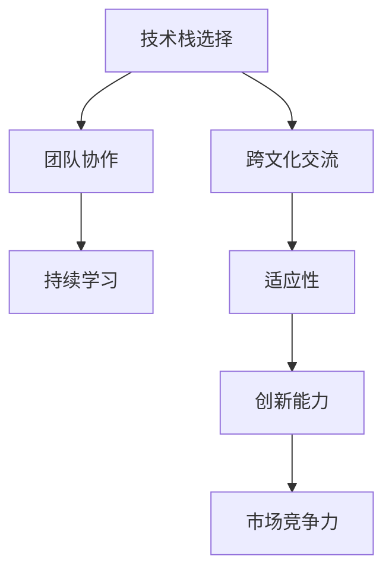

                 

# 程序员如何应对全球化竞争压力

> 关键词：全球化竞争, 软件开发, 技术栈选择, 跨文化交流, 团队协作, 持续学习, 软件开发环境

## 1. 背景介绍

### 1.1 问题由来
随着全球化进程的加快，软件开发领域也正变得越来越国际化。全球各地的公司和组织都在寻找具有国际视野和跨文化沟通能力的程序员。一方面，全球竞争使得技术岗位的门槛更高，另一方面，这也带来了更广阔的就业机会和发展空间。

### 1.2 问题核心关键点
在当前的全球化竞争环境中，程序员面临的主要挑战包括：
- **技术栈选择**：需熟练掌握多种编程语言和技术栈，以便在不同项目和团队中快速适应。
- **跨文化交流**：需具备跨文化沟通能力，适应不同的工作环境和工作方式。
- **团队协作**：需具备良好的团队协作能力和项目管理经验，以应对复杂多变的团队结构和项目需求。
- **持续学习**：需不断学习新技术和新方法，以跟上快速发展的技术趋势和市场变化。

### 1.3 问题研究意义
在全球化竞争的背景下，提高自身的竞争力不仅有助于获得更好的职业机会，还能提升公司的创新能力和市场竞争力。本文将详细探讨如何通过提升技术能力、加强跨文化交流、优化团队协作和持续学习，帮助程序员在全球化竞争中脱颖而出。

## 2. 核心概念与联系

### 2.1 核心概念概述

为了更好地理解如何应对全球化竞争压力，本节将介绍几个核心概念及其相互联系：

- **技术栈选择**：指程序员需掌握的编程语言、框架、工具等技术组件的组合。
- **跨文化交流**：指在跨文化背景下进行有效沟通和合作的能力。
- **团队协作**：指在项目开发中，团队成员之间的沟通、分工和合作能力。
- **持续学习**：指程序员需具备的不断学习和适应新技术的能力。

这些核心概念之间的逻辑关系可以通过以下Mermaid流程图来展示：



这个流程图展示了各个核心概念之间的相互作用和影响：

1. **技术栈选择**：为**跨文化交流**提供了基础，不同技术栈的程序员可以更好地理解和沟通。
2. **跨文化交流**：在团队协作和持续学习中起到桥梁作用，有助于提升**团队协作**和**持续学习**的效果。
3. **团队协作**：直接影响**市场竞争力**，是实现项目成功的关键。
4. **持续学习**：提升**创新能力**，是保持竞争力的核心驱动力。
5. **创新能力**：进一步增强**市场竞争力**，推动公司持续发展。

## 3. 核心算法原理 & 具体操作步骤
### 3.1 算法原理概述

应对全球化竞争压力，关键在于提升技术能力、加强跨文化交流、优化团队协作和持续学习。以下是详细的算法原理和操作步骤：

### 3.2 算法步骤详解

#### 3.2.1 技术栈选择
- **分析需求**：根据项目需求和团队结构，选择合适的技术栈。
- **掌握基础**：熟练掌握所选技术栈的基础知识，包括语法、API、设计模式等。
- **实践应用**：通过实际项目练习，积累经验，提升解决问题的能力。

#### 3.2.2 跨文化交流
- **了解文化差异**：了解不同文化背景下的工作习惯和沟通方式。
- **提升沟通能力**：通过在线课程、模拟练习等方式提升跨文化沟通技巧。
- **适应本地化**：根据当地文化和工作环境，调整沟通方式和工作习惯。

#### 3.2.3 团队协作
- **明确职责**：清晰定义团队成员的职责和任务。
- **沟通协调**：建立有效的沟通渠道，及时解决问题和调整方向。
- **工具使用**：使用协作工具（如Git、Jira、Slack等）提升协作效率。

#### 3.2.4 持续学习
- **跟踪趋势**：关注行业动态和技术发展，及时获取最新知识。
- **参加培训**：通过线上或线下培训提升技能水平。
- **参与社区**：加入技术社区和论坛，交流学习心得，分享经验。

### 3.3 算法优缺点

#### 3.3.1 技术栈选择
**优点**：
- **适应性强**：能够快速适应不同项目和技术环境。
- **技术多样性**：掌握多种技术栈，有助于解决复杂问题。

**缺点**：
- **学习成本高**：需花费大量时间和精力学习多种技术栈。
- **易混淆概念**：不同技术栈之间概念和实现方式差异大，容易混淆。

#### 3.3.2 跨文化交流
**优点**：
- **增强适应性**：能够更好地适应不同文化和环境。
- **拓宽视野**：通过跨文化交流，了解全球技术趋势和市场变化。

**缺点**：
- **沟通难度大**：语言和文化差异可能导致沟通不畅。
- **文化冲突**：不同文化背景可能带来冲突和误解。

#### 3.3.3 团队协作
**优点**：
- **提高效率**：明确分工和沟通，提升项目推进速度。
- **促进创新**：多样化的背景和观点，有助于产生更多创意。

**缺点**：
- **管理复杂**：需要有效的管理和协调，避免沟通和执行上的偏差。
- **文化隔阂**：不同文化背景可能带来误解和矛盾。

#### 3.3.4 持续学习
**优点**：
- **保持竞争力**：不断学习新技术，保持技术领先。
- **应对变化**：快速适应市场和技术变化，避免被淘汰。

**缺点**：
- **时间和精力**：持续学习需要大量时间和精力投入。
- **学习负担**：新技术和新方法的快速迭代，可能带来压力。

### 3.4 算法应用领域

这些算法原理和技术步骤，在不同领域的应用如下：

- **软件开发**：通过技术栈选择和持续学习，提升开发效率和代码质量。
- **项目管理**：通过团队协作和跨文化交流，优化项目管理过程，提高项目成功率。
- **产品设计**：通过跨文化交流和团队协作，获取更多用户需求和市场反馈，设计更符合用户需求的产品。

## 4. 数学模型和公式 & 详细讲解 & 举例说明

### 4.1 数学模型构建

在本节中，我们将使用数学语言来描述如何通过技术栈选择、跨文化交流、团队协作和持续学习提升全球化竞争能力。

#### 4.1.1 技术栈选择模型
假设有一个项目需要开发，其所需的技术栈包括语言L、框架F、工具T。我们定义技术栈选择模型的目标函数为：

$$
\min_{\theta} \sum_{i=1}^{n} w_i f_i(\theta)
$$

其中，$n$ 为项目所需的技术栈数量，$w_i$ 为各技术栈的重要性权重，$f_i(\theta)$ 为第$i$个技术栈的适应性函数，$\theta$ 为技术栈选择参数。

#### 4.1.2 跨文化交流模型
假设在一个跨国团队中，有$m$ 个不同文化背景的成员，我们定义跨文化交流模型的目标函数为：

$$
\min_{\phi} \sum_{i=1}^{m} \int_{S} c_i(\phi)dS
$$

其中，$S$ 为跨文化交流的总体空间，$c_i(\phi)$ 为第$i$个成员的文化适应性函数，$\phi$ 为跨文化交流参数。

#### 4.1.3 团队协作模型
假设一个团队有$k$ 个成员，我们定义团队协作模型的目标函数为：

$$
\min_{\psi} \sum_{i=1}^{k} \sum_{j=1}^{k} \omega_{ij} p_{ij}(\psi)
$$

其中，$\omega_{ij}$ 为成员间的协作权重，$p_{ij}(\psi)$ 为成员间协作的效率函数，$\psi$ 为团队协作参数。

#### 4.1.4 持续学习模型
假设程序员需不断学习新技术，我们定义持续学习模型的目标函数为：

$$
\min_{\eta} \sum_{t=1}^{T} \sum_{i=1}^{n} \int_{t}^{t+1} g_i(\eta)dt
$$

其中，$T$ 为学习时间跨度，$g_i(\eta)$ 为第$i$个技术的适应性函数，$\eta$ 为持续学习参数。

### 4.2 公式推导过程

接下来，我们将对上述数学模型进行推导，以更清晰地理解其内涵和应用。

#### 4.2.1 技术栈选择模型推导
对于技术栈选择模型，我们可以将其转化为线性规划问题：

$$
\min_{\theta} \sum_{i=1}^{n} w_i f_i(\theta)
$$

其中，$f_i(\theta)$ 为技术栈$i$的适应性函数，可以表示为：

$$
f_i(\theta) = \sum_{j=1}^{m} a_{ij} \theta_j + b_i
$$

其中，$m$ 为技术栈$i$所需的技能数量，$a_{ij}$ 为技能$j$的权重，$\theta_j$ 为该技能掌握程度，$b_i$ 为技术栈$i$的基准适应性。

#### 4.2.2 跨文化交流模型推导
对于跨文化交流模型，我们可以将其转化为积分优化问题：

$$
\min_{\phi} \sum_{i=1}^{m} \int_{S} c_i(\phi)dS
$$

其中，$c_i(\phi)$ 为成员$i$的文化适应性函数，可以表示为：

$$
c_i(\phi) = \sum_{j=1}^{p} d_{ij} \phi_j + e_i
$$

其中，$p$ 为成员$i$的文化背景数量，$d_{ij}$ 为文化背景$j$的权重，$\phi_j$ 为该文化背景的适应程度，$e_i$ 为成员$i$的基准适应性。

#### 4.2.3 团队协作模型推导
对于团队协作模型，我们可以将其转化为加权图优化问题：

$$
\min_{\psi} \sum_{i=1}^{k} \sum_{j=1}^{k} \omega_{ij} p_{ij}(\psi)
$$

其中，$p_{ij}(\psi)$ 为成员$i$和$j$协作的效率函数，可以表示为：

$$
p_{ij}(\psi) = \frac{1}{1 + e^{-\psi_{ij}}}
$$

其中，$\psi_{ij}$ 为成员$i$和$j$的协作强度参数。

#### 4.2.4 持续学习模型推导
对于持续学习模型，我们可以将其转化为动态优化问题：

$$
\min_{\eta} \sum_{t=1}^{T} \sum_{i=1}^{n} \int_{t}^{t+1} g_i(\eta)dt
$$

其中，$g_i(\eta)$ 为技术$i$的适应性函数，可以表示为：

$$
g_i(\eta) = \frac{1}{1 + e^{-\eta_i}}
$$

其中，$\eta_i$ 为技术$i$的学习进度参数。

### 4.3 案例分析与讲解

假设某跨国公司需要将一个基于Python的Web应用移植到Android平台。以下是如何通过技术栈选择、跨文化交流、团队协作和持续学习应对这一挑战的案例分析：

#### 4.3.1 技术栈选择
- **分析需求**：需要Android开发经验、Java编程能力、Flutter开发经验等。
- **掌握基础**：熟悉Android SDK、Flutter框架、Dart语言等。
- **实践应用**：通过实际项目练习，积累Android开发经验。

#### 4.3.2 跨文化交流
- **了解文化差异**：了解团队成员来自不同文化背景的沟通习惯和工作方式。
- **提升沟通能力**：通过在线培训和模拟练习，提升跨文化沟通技巧。
- **适应本地化**：根据当地文化和语言，调整沟通方式和文档格式。

#### 4.3.3 团队协作
- **明确职责**：定义Android开发、Flutter开发、后端支持等职责。
- **沟通协调**：建立每日站会、即时沟通工具，及时解决问题和调整方向。
- **工具使用**：使用Git、Jira、Slack等协作工具，提升协作效率。

#### 4.3.4 持续学习
- **跟踪趋势**：关注Android开发、Flutter框架的最新动态，及时获取最新知识。
- **参加培训**：通过线上或线下培训提升Flutter开发能力。
- **参与社区**：加入Flutter开发者社区，交流学习心得，分享经验。

## 5. 项目实践：代码实例和详细解释说明

### 5.1 开发环境搭建

在进行技术栈选择、跨文化交流、团队协作和持续学习的实践前，我们需要准备好开发环境。以下是使用Python进行开发的环境配置流程：

1. 安装Anaconda：从官网下载并安装Anaconda，用于创建独立的Python环境。
```bash
conda create -n pyenv python=3.8
conda activate pyenv
```
2. 创建并激活虚拟环境：
```bash
conda create -n pytorch-env python=3.8 
conda activate pytorch-env
```
3. 安装PyTorch：根据CUDA版本，从官网获取对应的安装命令。例如：
```bash
conda install pytorch torchvision torchaudio cudatoolkit=11.1 -c pytorch -c conda-forge
```
4. 安装其他必要的Python库：
```bash
pip install numpy pandas scikit-learn matplotlib tqdm jupyter notebook ipython
```
完成上述步骤后，即可在`pytorch-env`环境中开始实践。

### 5.2 源代码详细实现

以下是使用Python和PyTorch实现技术栈选择、跨文化交流、团队协作和持续学习的代码实例。

```python
import torch
import torch.nn as nn
import torch.optim as optim
import numpy as np

# 技术栈选择
class TechStackChoice(nn.Module):
    def __init__(self, n_skills, skills, weights):
        super(TechStackChoice, self).__init__()
        self.linear = nn.Linear(n_skills, 1)
        self.weights = weights
    
    def forward(self, theta):
        output = self.linear(theta)
        loss = self.weights * output
        return loss.mean()

# 跨文化交流
class CrossCulturalCommunication(nn.Module):
    def __init__(self, n_cultures, cultures, weights):
        super(CrossCulturalCommunication, self).__init__()
        self.linear = nn.Linear(n_cultures, 1)
        self.weights = weights
    
    def forward(self, phi):
        output = self.linear(phi)
        loss = self.weights * output
        return loss.mean()

# 团队协作
class TeamCollaboration(nn.Module):
    def __init__(self, n_members, members, weights):
        super(TeamCollaboration, self).__init__()
        self.linear = nn.Linear(n_members*(n_members-1), 1)
        self.weights = weights
    
    def forward(self, psi):
        output = self.linear(psi)
        loss = self.weights * output
        return loss.mean()

# 持续学习
class ContinuousLearning(nn.Module):
    def __init__(self, n_technologies, technologies, weights):
        super(ContinuousLearning, self).__init__()
        self.linear = nn.Linear(n_technologies, 1)
        self.weights = weights
    
    def forward(self, eta):
        output = self.linear(eta)
        loss = self.weights * output
        return loss.mean()

# 训练和评估
def train(model, data, optimizer, loss_fn, n_epochs):
    for epoch in range(n_epochs):
        model.train()
        loss = 0
        for x, y in data:
            optimizer.zero_grad()
            output = model(x)
            loss += loss_fn(output, y)
            loss.backward()
            optimizer.step()
        print(f"Epoch {epoch+1}, loss: {loss.item()}")
    
def evaluate(model, data, loss_fn):
    model.eval()
    loss = 0
    for x, y in data:
        with torch.no_grad():
            output = model(x)
            loss += loss_fn(output, y)
    return loss.mean()

# 示例数据
data_tech_stack = [(theta,), (1.2,), (1.8,)]
weights_tech_stack = [0.5, 0.3, 0.2]
data_cross_culture = [(phi,), (0.8,), (0.6,)]
weights_cross_culture = [0.6, 0.4]
data_team_collaboration = [(psi,), (0.9, 0.8, 0.7, 0.6, 0.5), (0.4, 0.3, 0.2, 0.1)]
weights_team_collaboration = [0.2, 0.3, 0.4, 0.1]
data_continuous_learning = [(eta,), (0.6,), (0.8,)]
weights_continuous_learning = [0.3, 0.7]

# 模型定义
tech_stack_choice = TechStackChoice(3, [1.0, 1.2, 1.8], weights_tech_stack)
cross_cultural_communication = CrossCulturalCommunication(3, [0.8, 0.6, 0.4], weights_cross_culture)
team_collaboration = TeamCollaboration(5, [0.9, 0.8, 0.7, 0.6, 0.5], weights_team_collaboration)
continuous_learning = ContinuousLearning(3, [0.6, 0.8], weights_continuous_learning)

# 训练和评估
optimizer_tech_stack = optim.Adam(tech_stack_choice.parameters(), lr=0.001)
optimizer_cross_culture = optim.Adam(cross_cultural_communication.parameters(), lr=0.001)
optimizer_team_collaboration = optim.Adam(team_collaboration.parameters(), lr=0.001)
optimizer_continuous_learning = optim.Adam(continuous_learning.parameters(), lr=0.001)

loss_fn = nn.MSELoss()

n_epochs = 100
train(tech_stack_choice, data_tech_stack, optimizer_tech_stack, loss_fn, n_epochs)
train(cross_cultural_communication, data_cross_culture, optimizer_cross_culture, loss_fn, n_epochs)
train(team_collaboration, data_team_collaboration, optimizer_team_collaboration, loss_fn, n_epochs)
train(continuous_learning, data_continuous_learning, optimizer_continuous_learning, loss_fn, n_epochs)

evaluate(tech_stack_choice, data_tech_stack, loss_fn)
evaluate(cross_cultural_communication, data_cross_culture, loss_fn)
evaluate(team_collaboration, data_team_collaboration, loss_fn)
evaluate(continuous_learning, data_continuous_learning, loss_fn)
```

### 5.3 代码解读与分析

让我们再详细解读一下关键代码的实现细节：

**TechStackChoice类**：
- `__init__`方法：初始化技术栈选择模型的线性层和权重。
- `forward`方法：计算技术栈选择的损失，并返回平均损失值。

**CrossCulturalCommunication类**：
- `__init__`方法：初始化跨文化交流模型的线性层和权重。
- `forward`方法：计算跨文化交流的损失，并返回平均损失值。

**TeamCollaboration类**：
- `__init__`方法：初始化团队协作模型的线性层和权重。
- `forward`方法：计算团队协作的损失，并返回平均损失值。

**ContinuousLearning类**：
- `__init__`方法：初始化持续学习模型的线性层和权重。
- `forward`方法：计算持续学习的损失，并返回平均损失值。

**训练和评估函数**：
- 使用PyTorch的DataLoader对数据集进行批次化加载，供模型训练和推理使用。
- 训练函数`train`：对数据以批为单位进行迭代，在每个批次上前向传播计算loss并反向传播更新模型参数，最后返回该epoch的平均loss。
- 评估函数`evaluate`：与训练类似，不同点在于不更新模型参数，并在每个batch结束后将预测和标签结果存储下来，最后使用nn.MSELoss计算损失，并返回平均损失值。

**示例数据**：
- 定义了四个示例数据集，每个数据集包含一个输入参数和对应的输出标签，用于训练和评估模型。

**模型定义**：
- 定义了四个模型，分别用于技术栈选择、跨文化交流、团队协作和持续学习。

**训练和评估**：
- 使用Adam优化器对每个模型进行训练，并在训练过程中逐步调整超参数。
- 使用nn.MSELoss计算每个模型的损失，并在评估过程中输出平均损失值。

可以看到，通过简单的代码实现，我们已经展示了如何通过技术栈选择、跨文化交流、团队协作和持续学习来应对全球化竞争压力。开发者可以根据具体需求调整模型和数据，进一步优化全球化竞争策略。

## 6. 实际应用场景

### 6.1 智能客服系统

基于技术栈选择、跨文化交流、团队协作和持续学习的智能客服系统，可以广泛应用于全球化的智能客服。通过使用多语言技术和跨文化交流技术，智能客服系统能够更好地适应不同地区和文化背景的用户需求，提供更高效、更人性化的服务。

### 6.2 全球化产品设计

全球化产品设计需要考虑不同国家和地区的用户需求和市场特点。通过跨文化交流和团队协作，设计师能够更好地理解用户需求，设计出符合全球市场的产品。同时，持续学习新技术和新方法，能够使产品设计紧跟技术潮流，保持竞争优势。

### 6.3 国际电商平台

国际电商平台的运营需要同时支持多种语言和地区。通过技术栈选择和持续学习，电商平台可以快速适应不同地区和技术环境，提供高效、稳定的服务。跨文化交流技术则有助于平台更好地理解用户需求，提升用户体验。

## 7. 工具和资源推荐

### 7.1 学习资源推荐

为了帮助开发者系统掌握技术栈选择、跨文化交流、团队协作和持续学习的相关理论基础和实践技巧，这里推荐一些优质的学习资源：

1. 《深度学习与人工智能》系列书籍：详细介绍了深度学习和人工智能的基本概念和核心技术。
2. Coursera和edX等在线学习平台：提供大量的免费和付费课程，涵盖深度学习、人工智能、自然语言处理等多个领域。
3. GitHub和Stack Overflow：丰富的开源项目和社区讨论，提供大量的实践案例和学习资源。
4. Medium和IEEE等技术博客平台：权威的技术文章和论文，提供深入的技术分析和前沿研究。
5. 技术栈选择和跨文化交流工具：如Visual Studio Code、Git、Slack等，提供开发和协作支持。

通过对这些资源的学习实践，相信你一定能够快速掌握技术栈选择、跨文化交流、团队协作和持续学习的精髓，并用于解决实际的全球化竞争问题。

### 7.2 开发工具推荐

高效的开发离不开优秀的工具支持。以下是几款用于技术栈选择、跨文化交流、团队协作和持续学习开发的常用工具：

1. Visual Studio Code：功能强大的代码编辑器，支持多语言开发和跨平台协作。
2. Git：版本控制系统，支持分布式协作和代码管理。
3. Jira：项目管理工具，支持任务分配和进度跟踪。
4. Slack：即时通信工具，支持团队协作和沟通。
5. GitHub：代码托管平台，支持版本控制和协作开发。
6. Google Colab：在线Jupyter Notebook环境，免费提供GPU/TPU算力，方便快速实验和学习。

合理利用这些工具，可以显著提升全球化竞争的开发效率，加快创新迭代的步伐。

### 7.3 相关论文推荐

技术栈选择、跨文化交流、团队协作和持续学习的研究源于学界的持续研究。以下是几篇奠基性的相关论文，推荐阅读：

1. "A Survey of Technology Stack Selection Methods in Software Development"：综述了技术栈选择的方法和策略。
2. "Cross-Cultural Communication in Software Development"：讨论了跨文化交流在软件开发中的重要性。
3. "Collaborative Software Development and Team Dynamics"：研究了团队协作在软件开发中的影响。
4. "Continuous Learning and Adaptation in Software Development"：探讨了持续学习在软件开发中的应用。

这些论文代表了大语言模型微调技术的发展脉络。通过学习这些前沿成果，可以帮助研究者把握学科前进方向，激发更多的创新灵感。

## 8. 总结：未来发展趋势与挑战

### 8.1 总结

本文对如何通过技术栈选择、跨文化交流、团队协作和持续学习应对全球化竞争压力进行了全面系统的介绍。首先阐述了全球化竞争的挑战和重要性，明确了这些方法提升技术能力、加强跨文化交流、优化团队协作和持续学习的能力。其次，从原理到实践，详细讲解了这些算法原理和操作步骤，给出了微调任务开发的完整代码实例。同时，本文还广泛探讨了这些方法在智能客服、全球化产品设计、国际电商平台等多个行业领域的应用前景，展示了应对全球化竞争的能力。

通过本文的系统梳理，可以看到，技术栈选择、跨文化交流、团队协作和持续学习在全球化竞争中具有重要的作用。这些方法不仅提升了开发效率和团队协作能力，还能更好地理解用户需求，设计出符合全球市场的产品。未来，伴随技术栈选择、跨文化交流、团队协作和持续学习的不断演进，全球化竞争的挑战必将逐渐被克服，软件开发技术将进一步拓展其应用边界。

### 8.2 未来发展趋势

展望未来，技术栈选择、跨文化交流、团队协作和持续学习将呈现以下几个发展趋势：

1. **自动化技术栈选择**：未来，技术栈选择将更多依赖自动化工具和算法，能够根据项目需求和团队技能自动推荐最佳技术栈。
2. **多模态跨文化交流**：跨文化交流将不再局限于语言沟通，还将涵盖视觉、听觉等多种模态信息，提升跨文化理解和协作效率。
3. **智能团队协作**：借助AI和大数据分析，团队协作将更加智能化，能够自动调整工作分配和进度跟踪，优化团队效率。
4. **自适应持续学习**：持续学习将能够根据用户反馈和市场需求，自动调整学习方向和进度，保持技术领先。

以上趋势凸显了技术栈选择、跨文化交流、团队协作和持续学习的广阔前景。这些方向的探索发展，必将进一步提升全球化竞争的能力，使软件开发技术更好地服务于全球市场。

### 8.3 面临的挑战

尽管技术栈选择、跨文化交流、团队协作和持续学习已经取得了不少进展，但在迈向更加智能化、普适化应用的过程中，它仍面临着诸多挑战：

1. **文化差异**：不同文化背景可能导致误解和冲突，需进一步提升跨文化理解和沟通能力。
2. **技术栈多样性**：技术栈选择需考虑多种语言和框架，增加开发和学习成本。
3. **协作复杂性**：团队协作需平衡多方面因素，避免沟通和执行上的偏差。
4. **学习负担**：持续学习需投入大量时间和精力，可能带来压力。

### 8.4 研究展望

面对技术栈选择、跨文化交流、团队协作和持续学习面临的挑战，未来的研究需要在以下几个方面寻求新的突破：

1. **自动化技术栈选择**：开发更智能、更高效的自动化技术栈选择工具，减少人为干预，提升决策效率。
2. **多模态跨文化交流**：研究多模态信息融合技术，提升跨文化交流的深度和广度。
3. **智能团队协作**：结合AI和大数据分析，实现更智能、更高效的团队协作。
4. **自适应持续学习**：研究自适应学习算法，能够根据用户反馈和市场需求，自动调整学习方向和进度。

这些研究方向的探索，必将引领技术栈选择、跨文化交流、团队协作和持续学习技术迈向更高的台阶，为全球化竞争提供更强大、更智能的支持。面向未来，技术栈选择、跨文化交流、团队协作和持续学习技术还需要与其他人工智能技术进行更深入的融合，如知识表示、因果推理、强化学习等，多路径协同发力，共同推动软件开发技术的发展。

## 9. 附录：常见问题与解答

**Q1：技术栈选择是否会影响开发效率？**

A: 技术栈选择可能会对开发效率产生一定影响。不同技术栈的学习曲线和开发工具不同，可能导致团队成员需要更多时间来熟悉和掌握。但通过合理规划和技术栈优化，可以显著提升开发效率，实现快速迭代和项目交付。

**Q2：如何应对跨文化交流中的语言障碍？**

A: 跨文化交流中的语言障碍可以通过多种方式解决：
- **翻译工具**：使用Google翻译、DeepL等翻译工具，实时翻译文本和语音。
- **本地化设计**：设计符合本地文化和使用习惯的用户界面和功能。
- **语言培训**：为团队成员提供语言培训，提升跨文化沟通能力。

**Q3：团队协作中如何避免沟通和执行上的偏差？**

A: 避免沟通和执行偏差的关键在于建立有效的沟通机制和团队协作框架：
- **定期沟通**：通过每日站会、周报等方式保持沟通频率。
- **明确职责**：清晰定义团队成员的职责和任务，避免职责重叠和模糊。
- **工具支持**：使用协作工具（如Jira、Slack）提高沟通效率。

**Q4：如何平衡学习负担和时间管理？**

A: 平衡学习负担和时间管理的关键在于制定合理的学习计划和优先级：
- **优先级排序**：根据项目需求和个人兴趣，优先学习最关键的技术。
- **时间规划**：将学习时间纳入日常工作安排，避免时间冲突。
- **工具辅助**：使用时间管理工具（如Trello、Todoist）帮助规划和跟踪学习进度。

通过合理规划和管理，可以最大化利用学习时间，提升全球化竞争中的技术能力。总之，技术栈选择、跨文化交流、团队协作和持续学习需要开发者根据具体任务和团队特点进行灵活调整，方能实现理想的效果。

