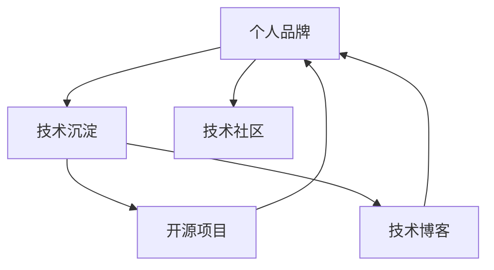

                 

# 程序员如何打造个人影响力

> 关键词：个人品牌, 技术沉淀, 开源项目, 技术博客, 技术社区

## 1. 背景介绍

在当今这个信息爆炸的时代，个人品牌已经成为了程序员们的重要资产。无论是在求职、技术交流、还是商业合作中，拥有强大个人影响力的程序员无疑更具竞争力。因此，如何在技术领域建立并维护个人品牌，就成为了每个程序员的必修课。本文将从多个角度深入探讨，并给出系统性、实用性强的建议，帮助程序员们打造个人影响力。

## 2. 核心概念与联系

### 2.1 核心概念概述

为了更好地理解本文内容，这里先介绍几个核心概念：

- **个人品牌**：指的是个人在某个领域或多个领域中，通过持续的创新和输出，建立起在同行和受众中的识别度和认可度。良好的个人品牌能带来更多的机会，如更好的工作机会、更高的薪酬、更多的合作项目等。

- **技术沉淀**：指的是个人在技术领域长期积累的专业知识、技能和经验。技术沉淀是形成个人品牌的基础，也是输出的核心内容。

- **开源项目**：指的是程序员在GitHub等平台上分享和维护的代码库。开源项目不仅能体现程序员的技术水平，还能让更多人看到自己的工作成果，为个人品牌的建立提供平台。

- **技术博客**：指的是程序员通过撰写技术文章，分享自己的技术见解、项目经验、学习心得等。技术博客是个人品牌的核心输出方式之一，能增强程序员的影响力和可信度。

- **技术社区**：指的是程序员参与的技术交流、讨论、分享的平台，如Stack Overflow、GitHub、CSDN等。技术社区是个人品牌建立的土壤，也是个人展示和互动的场所。

这些核心概念之间的逻辑关系可以通过以下Mermaid流程图来展示：



这个流程图展示了个体品牌与技术沉淀、开源项目、技术博客、技术社区之间的联系和互动：

1. **技术沉淀**是个人品牌的基础。
2. **开源项目**和**技术博客**是技术沉淀的展示和传播方式。
3. **技术社区**是技术沉淀展示和互动的平台。
4. **个人品牌**则是技术沉淀、开源项目和博客输出的结果和反馈。

## 3. 核心算法原理 & 具体操作步骤
### 3.1 算法原理概述

打造个人影响力，本质上是一个通过持续的技术输出，在技术社区和受众中建立识别度和认可度的过程。其核心算法原理可以概括为：

1. **输出高质量内容**：不断输出高水平的技术文章、代码和项目，提升自己在技术社区中的识别度和影响力。
2. **积极互动**：在技术社区中积极参与讨论、回答问题，建立个人品牌的人际关系网络。
3. **持续学习**：保持对新技术、新领域的关注和学习，避免内容过时，持续增加个人品牌的深度和广度。
4. **传播推广**：通过社交媒体、个人网站等渠道，扩大个人技术影响力，吸引更多的关注者。

### 3.2 算法步骤详解

以下是在技术社区中建立个人品牌的具体操作步骤：

**Step 1: 积累技术沉淀**

1. 选择主攻技术领域，持续学习和实践，积累丰富的技术知识和实战经验。
2. 通过参与开源项目、技术攻关、技术竞赛等方式，进一步提升自己的技术能力和实践经验。
3. 参与行业会议、研讨会、技术峰会，学习最新的技术趋势和前沿知识。

**Step 2: 创建并维护开源项目**

1. 选择感兴趣的开源项目或创建新项目，明确项目目标和功能。
2. 将个人技术沉淀和实践经验融入开源项目中，确保项目质量。
3. 积极在GitHub等平台上发布项目代码，参与项目讨论，吸引关注者。
4. 定期更新项目，修复bug，增加新功能，提升项目的活跃度和吸引力。

**Step 3: 撰写技术博客**

1. 选择一个博客平台，如Medium、博客园、CSDN等，创建个人博客。
2. 确定博客主题和方向，保持一定的内容更新频率，坚持定期输出高质量文章。
3. 文章内容应包含技术分享、项目实践、学习心得等，同时注意文章的逻辑清晰、信息丰富、图文并茂。
4. 通过社交媒体、邮件列表等渠道推广博客内容，扩大影响范围。

**Step 4: 积极参与技术社区**

1. 在Stack Overflow、GitHub、CSDN等技术社区中注册账号。
2. 积极参与社区讨论，回答问题，分享见解。
3. 关注和互动同领域的技术大咖，建立良好的人脉关系。
4. 参与社区的组织活动，如技术沙龙、线上线下Meetup等，增加曝光度和知名度。

**Step 5: 传播个人品牌**

1. 通过LinkedIn、Twitter等社交媒体平台，定期分享技术文章、项目进展、读书笔记等。
2. 创建个人网站，展示技术博客、开源项目和专业简历。
3. 参与技术讲座、培训课程等，扩大个人品牌的传播范围。

### 3.3 算法优缺点

建立个人品牌的好处包括：

1. 提升职业竞争力：拥有个人品牌能让个人在求职、招聘、晋升等方面更具优势。
2. 扩大影响力：个人品牌不仅能增强在技术社区中的影响力，还能拓展到更多的商业和学术领域。
3. 增强信任度：高质量的输出和持续的互动，能增强同行和受众对个人能力的信任。

但同时，建立个人品牌也面临以下挑战：

1. 时间和精力投入大：积累技术沉淀、创建和维护开源项目、撰写技术博客等都需要大量时间和精力。
2. 需要持续输出高质量内容：如果输出内容质量不高，可能影响个人品牌的效果。
3. 竞争激烈：技术社区中高水平人才众多，建立个人品牌需要具备较强的竞争力和创新能力。

### 3.4 算法应用领域

个人品牌的应用领域非常广泛，不仅限于技术领域，还延伸到商业、学术等多个方面：

- **技术社区**：程序员通过在GitHub、Stack Overflow等技术社区建立个人品牌，不仅能提升自己的技术影响力，还能在技术交流、问题解答等方面提供帮助。
- **商业合作**：具有个人品牌的企业家和程序员更容易获得投资和商业合作机会。
- **学术研究**：科研人员通过撰写学术论文、参与学术会议，可以提升在学术领域的影响力。
- **开源文化**：开源项目的贡献者通过持续的代码贡献、技术交流，可以建立强大的个人品牌，成为社区领袖。
- **教育培训**：教育培训师通过撰写技术书籍、参加行业论坛、创建技术博客，可以提升在教育领域的影响力。

## 4. 数学模型和公式 & 详细讲解
### 4.1 数学模型构建

在技术领域，建立个人品牌的模型可以用如下形式表示：

$$
B = S \times P \times C
$$

其中，$B$为个人品牌影响力，$S$为技术沉淀质量，$P$为开源项目和博客传播效果，$C$为社区互动和推广能力。

### 4.2 公式推导过程

公式的推导基于以下假设：

1. 技术沉淀质量$S$越高，个人品牌影响力$B$越大。
2. 开源项目和博客传播效果$P$越好，个人品牌影响力$B$越大。
3. 社区互动和推广能力$C$越强，个人品牌影响力$B$越大。

公式表达了技术沉淀、开源项目、技术博客和社区互动对个人品牌的影响。

### 4.3 案例分析与讲解

**案例1: Linus Torvalds的个人品牌**

Linus Torvalds是Linux操作系统的创始人，他的个人品牌在全球范围内具有极高的影响力。其成功的关键在于：

1. 技术沉淀：Linus在Unix、C语言等领域积累了深厚的技术知识和实践经验。
2. 开源项目：他通过创建并维护Linux内核，成为全球开源社区的领袖。
3. 技术博客：他定期在个人博客上分享技术见解和实践心得，增加了个人品牌的深度和广度。
4. 社区互动：他积极参与开源社区的讨论和技术支持，建立了广泛的人脉关系。
5. 传播推广：通过社交媒体和公开演讲，Linus成功推广了Linux操作系统，赢得了全球用户和企业的认可。

**案例2: 张晓楠的个人品牌**

张晓楠是一位知名的前端开发者，其个人品牌主要通过以下几个方面建立：

1. 技术沉淀：他在前端开发领域积累了丰富的实践经验，发布了多个开源项目，如D3.js、ECharts等。
2. 开源项目：通过在GitHub上维护这些开源项目，吸引了大量的关注者和贡献者。
3. 技术博客：他定期在博客上分享前端开发经验和技术文章，增加了个人品牌的影响力。
4. 社区互动：积极参与技术社区的讨论和问题解答，建立了良好的人际关系。
5. 传播推广：通过LinkedIn和Twitter等社交媒体平台，推广个人品牌和技术成果。

## 5. 项目实践：代码实例和详细解释说明
### 5.1 开发环境搭建

在进行个人品牌建设时，首先需要搭建良好的开发环境，以便于高效地进行技术沉淀和项目开发。以下是一个简单的开发环境搭建步骤：

1. 选择IDE：如Visual Studio Code、PyCharm、IntelliJ IDEA等，根据自己的技术栈和项目需求选择合适的IDE。
2. 安装编程语言：如Python、Java、C++等，根据项目需求安装所需语言。
3. 安装开发工具：如Git、Docker、Gradle等，提升开发效率和项目可移植性。
4. 创建本地仓库：如GitHub、GitLab等，建立项目的版本控制和管理。

### 5.2 源代码详细实现

以下是一个简单的开源项目示例，展示了如何创建一个GitHub项目并进行维护。

1. 创建一个GitHub仓库：
```
git init
git remote add origin https://github.com/username/project.git
git add .
git commit -m "Initial commit"
git push -u origin master
```

2. 开发并提交代码：
```
# 修改代码
# 提交修改
git add .
git commit -m "Add new feature"
git push
```

3. 参与社区讨论：
```
# 在GitHub上发布问题
# 回答社区问题
```

### 5.3 代码解读与分析

1. 代码管理：使用版本控制工具，如Git，可以高效地进行代码版本管理，防止代码丢失和冲突。
2. 代码质量：编写高质量的代码，并进行代码审查和测试，确保代码的健壮性和可维护性。
3. 社区互动：积极参与开源社区的讨论和问题解决，建立良好的人际关系，提升个人品牌影响力。

### 5.4 运行结果展示

通过GitHub仓库的访问量和贡献者数，可以直观地展示项目的活跃度和影响力。

```
git log
# 查看提交历史
git clone https://github.com/username/project.git
# 拉取最新代码
```

## 6. 实际应用场景
### 6.4 未来应用展望

随着技术社区的不断发展，建立个人品牌的方式也越来越多样化。以下是未来几个可能的趋势：

1. **跨平台传播**：除了传统的博客、技术社区，未来可以通过视频平台、播客等多种形式传播个人品牌，提升传播效果。
2. **多领域融合**：未来的个人品牌将不仅仅局限于技术领域，还可以延伸到设计、管理、艺术等多个领域，提升个人综合竞争力。
3. **人工智能辅助**：利用AI技术进行内容推荐、情感分析等，提高个人品牌的传播效率和效果。
4. **个性化定制**：根据个人兴趣和特点，定制个性化的个人品牌传播策略，提升传播效果。
5. **全球化推广**：随着国际化进程的推进，未来的个人品牌将更注重全球化的推广和传播。

## 7. 工具和资源推荐
### 7.1 学习资源推荐

1. 《The Art of Building a Developer Brand》：讲述如何打造个人品牌和建立技术社区的实用指南。
2. GitHub官方文档：GitHub的使用指南，涵盖项目管理、代码协作、社区互动等方面。
3. Medium和博客园：创建并维护个人技术博客的平台，便于分享技术心得和文章。
4. 技术社区：如Stack Overflow、GitHub、CSDN等，是建立个人品牌的重要场所。

### 7.2 开发工具推荐

1. Visual Studio Code：轻量级、功能强大的IDE，支持多种编程语言和框架。
2. PyCharm和IntelliJ IDEA：强大的Java开发环境，提供丰富的代码补全和调试功能。
3. Git和GitHub：版本控制和代码托管工具，提高代码管理和协作效率。
4. Docker和Kubernetes：容器化部署工具，提高应用程序的可移植性和部署效率。

### 7.3 相关论文推荐

1. "The Power of Social Media for Developer Brand Building"：关于社交媒体对个人品牌建立和传播的研究。
2. "Building Your Developer Brand: A Comprehensive Guide"：关于个人品牌建设的详细指南。
3. "Open Source Project Contribution and Brand Building: A Case Study"：通过开源项目建立个人品牌的成功案例。

## 8. 总结：未来发展趋势与挑战
### 8.1 研究成果总结

本文从技术沉淀、开源项目、技术博客、社区互动等方面，全面介绍了建立个人品牌的关键步骤和方法。通过系统的理论分析和案例分析，帮助程序员们理解个人品牌建立的内在逻辑和实际操作方法。

### 8.2 未来发展趋势

未来个人品牌的发展趋势包括：

1. 跨平台传播：技术传播的方式更加多样化，从传统的博客、技术社区，到视频平台、播客等，传播效果更加显著。
2. 多领域融合：个人品牌的影响力将延伸到多个领域，如设计、管理、艺术等，提升个人综合竞争力。
3. 人工智能辅助：利用AI技术进行内容推荐、情感分析等，提高个人品牌的传播效率和效果。
4. 全球化推广：个人品牌将更注重全球化的推广和传播，提升国际影响力。
5. 个性化定制：根据个人兴趣和特点，定制个性化的个人品牌传播策略，提升传播效果。

### 8.3 面临的挑战

尽管个人品牌建设具有广阔的前景，但也面临以下挑战：

1. 时间和精力投入大：建立个人品牌需要长期的技术沉淀和输出，需要大量时间和精力。
2. 竞争激烈：技术社区中高水平人才众多，建立个人品牌需要较强的竞争力和创新能力。
3. 持续输出高质量内容：如果输出内容质量不高，可能影响个人品牌的效果。
4. 社区互动难度高：需要积极参与社区互动，建立良好的人际关系，但社区氛围和文化差异较大，需要适应和适应。

### 8.4 研究展望

未来的研究可以在以下几个方向进行突破：

1. 自动化技术：利用AI技术进行内容生成、情感分析等，提高个人品牌的传播效率和效果。
2. 社区文化建设：建设更加友好和开放的社区文化，吸引更多的参与者和关注者。
3. 个性化推荐：利用推荐算法进行内容推荐，提高内容的传播效果和受众的兴趣度。
4. 跨文化传播：研究如何在不同文化背景下建立和传播个人品牌，提升全球化影响力。
5. 多领域融合：研究如何将个人品牌与不同领域的内容和技能相结合，提升综合竞争力。

## 9. 附录：常见问题与解答

**Q1: 如何选择一个合适的技术领域？**

A: 选择技术领域时，应考虑个人兴趣、市场需求、行业前景等多方面因素。可以通过阅读技术博客、参加行业会议、与行业大咖交流等方式，了解当前的技术趋势和未来的发展方向。

**Q2: 如何平衡技术沉淀和开源项目？**

A: 技术沉淀和开源项目并不矛盾，可以通过合理的分配时间和精力，既进行技术沉淀，又参与开源项目。建议在技术沉淀方面，采用更稳妥的策略，逐步建立个人品牌，在开源项目方面，积极参与，积累经验和人脉。

**Q3: 如何提高开源项目的影响力？**

A: 开源项目的影响力主要通过代码质量、项目活跃度、社区互动等方面提升。代码质量是基础，项目活跃度和社区互动是关键。可以通过定期更新代码、积极参与社区讨论、发布使用指南等方式，提升开源项目的影响力。

**Q4: 如何推广个人品牌？**

A: 推广个人品牌的关键在于内容质量和传播渠道的选择。应选择适合的内容形式和渠道，定期发布高质量的技术文章、项目进展、读书笔记等。同时，可以通过社交媒体、技术博客、技术讲座等渠道，扩大个人品牌的传播范围。

---

作者：禅与计算机程序设计艺术 / Zen and the Art of Computer Programming

