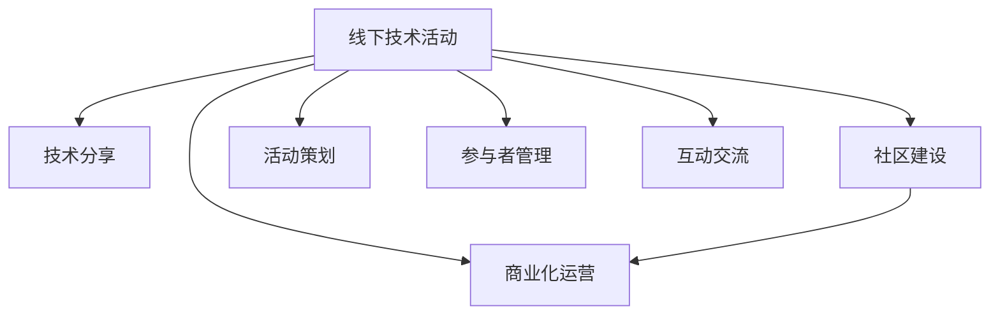

                 

# 程序员如何打造知识付费的线下活动

> 关键词：知识付费,线下活动,技术分享,社区建设,商业化

## 1. 背景介绍

### 1.1 问题由来

近年来，随着互联网和移动互联网的普及，知识付费市场逐渐兴起，成为教育领域新的增长点。越来越多的程序员开始通过线上平台分享技术知识，但线下技术交流活动的互动性和体验感往往更强，是线上交流所不能替代的。线下活动不仅能够提供面对面交流的机会，还能营造更轻松愉快的学习氛围，增强参与者的学习体验。因此，许多程序员和IT企业开始积极探索线下活动，希望通过技术分享和交流，搭建一个程序员社区，促进技术发展。

### 1.2 问题核心关键点

线下技术交流活动可以提升参与者技术水平，增强社区凝聚力，带动技术生态的繁荣。但线下活动的设计和组织也存在不少挑战，如场地选择、活动流程设计、参与者管理、商业化运营等。如何打造一个成功的线下技术活动，是程序员和IT企业需要深入思考的问题。

### 1.3 问题研究意义

开展线下技术交流活动，对于提升参与者的技术水平、促进社区发展、推动技术生态的繁荣具有重要意义：

1. 提升技术水平：通过专家分享、案例分析、动手实践等方式，使参与者获得更多实战经验和深入理解。
2. 促进社区发展：线下活动能够增强社区成员之间的互动和交流，凝聚社区氛围。
3. 推动技术生态：线下活动可以汇聚更多技术力量，加速技术创新和应用推广，促进技术生态的繁荣。

## 2. 核心概念与联系

### 2.1 核心概念概述

线下技术活动的设计与组织涉及多个环节，涵盖活动策划、技术分享、社区建设、商业化运营等多个方面。以下是一些关键概念及其联系：

- **线下技术活动**：在特定地点组织的技术交流、分享、学习活动，形式多样，包括技术讲座、圆桌讨论、编程马拉松等。
- **技术分享**：通过专家讲座、案例分析、动手实践等形式，传递知识和经验。
- **社区建设**：通过线下活动构建的社区环境，增强成员之间的互动和交流，形成良好的社区氛围。
- **商业化运营**：通过商业策略和技术方案，实现活动收支平衡和可持续运营。
- **活动策划**：确定活动主题、参与者、时间和地点等关键因素，是线下活动成功的基础。
- **参与者管理**：通过报名系统、活动通知、签到签退等功能，实现对参与者的有效管理。
- **互动交流**：通过分组讨论、动手实践、互动问答等方式，增强参与者的互动和交流。

这些概念之间的逻辑关系可以通过以下Mermaid流程图来展示：



这个流程图展示了下线技术活动的关键环节及其相互关系：

1. 线下活动是主线，贯穿整个流程。
2. 技术分享、社区建设和商业化运营是线下活动的三个重要组成部分。
3. 活动策划、参与者管理和互动交流是线下活动成功的关键因素。

## 3. 核心算法原理 & 具体操作步骤

### 3.1 算法原理概述

线下技术活动的成功依赖于多个因素，如活动策划、技术分享、参与者管理等。核心算法原理可归纳为：

1. **活动策划算法**：基于用户需求、市场趋势等因素，选择合适的主题、地点和时间，并制定详细的活动计划。
2. **技术分享算法**：通过专家讲座、案例分析、动手实践等方式，传递知识和经验。
3. **参与者管理算法**：通过报名系统、活动通知、签到签退等功能，实现对参与者的有效管理。
4. **互动交流算法**：通过分组讨论、动手实践、互动问答等方式，增强参与者的互动和交流。

### 3.2 算法步骤详解

**Step 1: 活动策划**

- **确定主题**：根据目标受众和市场趋势，确定活动主题，如“深度学习”、“区块链技术”等。
- **选择场地**：考虑场地容量、交通便利性、设施完备性等因素，选择合适的活动场地。
- **确定时间**：选择合适的活动时间，确保参与者有充足的时间准备和参与。
- **制定计划**：确定活动流程、参与者分组、嘉宾邀请等关键因素。

**Step 2: 技术分享**

- **邀请嘉宾**：邀请行业专家和技术大咖，分享最新技术趋势和实践经验。
- **准备内容**：嘉宾需要准备详细的分享内容，并制作PPT或视频等形式。
- **互动环节**：设置问答、讨论等环节，增强参与者的互动和交流。

**Step 3: 参与者管理**

- **报名系统**：开发在线报名系统，方便参与者报名和查看活动信息。
- **活动通知**：通过邮件、短信等方式，向参与者发送活动通知和提醒。
- **签到签退**：设计签到签退功能，统计参与者到场情况。

**Step 4: 互动交流**

- **分组讨论**：将参与者分为若干小组，讨论特定技术话题。
- **动手实践**：安排编程马拉松、代码比赛等动手实践活动。
- **互动问答**：设置Q&A环节，嘉宾和参与者互动交流。

### 3.3 算法优缺点

线下技术活动的优点包括：

1. **互动性强**：面对面交流使得参与者能够更深入地理解和交流技术知识。
2. **社区凝聚力强**：通过活动增强社区成员之间的互动和交流，形成良好的社区氛围。
3. **商业化潜力大**：线下活动可以吸引更多参与者和赞助商，带来商业化的机会。

然而，线下活动也存在一些缺点：

1. **成本高**：场地、嘉宾、组织等费用较高，且需要大量人力物力资源。
2. **风险因素多**：天气、场地安排、参与者管理等不可控因素较多。
3. **传播范围有限**：线下活动覆盖面相对较小，难以触达更广泛的受众。

## 4. 数学模型和公式 & 详细讲解

### 4.1 数学模型构建

线下技术活动的效果可以通过多个指标来评估，包括参与人数、满意度、知识传播效果等。我们可以使用以下数学模型来构建这些指标：

- **参与人数**：$N = \sum_{i=1}^n p_i$，其中 $p_i$ 为第 $i$ 个参与者的数量。
- **满意度**：$S = \frac{1}{N} \sum_{i=1}^N s_i$，其中 $s_i$ 为第 $i$ 个参与者的满意度评分。
- **知识传播效果**：$K = \frac{1}{N} \sum_{i=1}^N k_i$，其中 $k_i$ 为第 $i$ 个参与者的知识传播效果。

### 4.2 公式推导过程

我们可以使用以下公式来推导这些指标的计算过程：

- **参与人数计算**：$N = \sum_{i=1}^n p_i$
- **满意度计算**：$S = \frac{1}{N} \sum_{i=1}^N s_i$
- **知识传播效果计算**：$K = \frac{1}{N} \sum_{i=1}^N k_i$

其中，$p_i$、$s_i$、$k_i$ 可以通过在线问卷、互动反馈等方式收集。

### 4.3 案例分析与讲解

假设我们组织了一场关于“人工智能在金融领域的应用”的线下技术活动，共有100位参与者，其中30位获得了最高满意度评分，20位参与者提出了关于人工智能在金融领域的应用问题。根据上述数学模型，我们可以计算出活动整体的效果：

- **参与人数**：$N = 100$
- **满意度**：$S = \frac{30}{100} = 0.3$
- **知识传播效果**：$K = \frac{20}{100} = 0.2$

通过这些指标，我们可以评估活动的整体效果，并找出需要改进的地方。

## 5. 项目实践：代码实例和详细解释说明

### 5.1 开发环境搭建

要进行线下技术活动的组织和运营，需要搭建一个在线报名系统和活动管理系统。以下是使用Python和Flask搭建开发环境的步骤：

1. 安装Python和Flask：
```
pip install flask
```

2. 搭建Flask应用：
```python
from flask import Flask, render_template, request

app = Flask(__name__)

@app.route('/')
def index():
    return render_template('index.html')

@app.route('/submit', methods=['POST'])
def submit():
    name = request.form['name']
    email = request.form['email']
    return render_template('submit.html', name=name, email=email)

if __name__ == '__main__':
    app.run(debug=True)
```

3. 设计数据库和表结构：
```sql
CREATE TABLE participants (
    id INT PRIMARY KEY AUTO_INCREMENT,
    name VARCHAR(50) NOT NULL,
    email VARCHAR(50) NOT NULL
)
```

4. 设计HTML模板：
```html
<!-- index.html -->
<html>
<head>
    <title>线下技术活动报名</title>
</head>
<body>
    <h1>报名参与线下技术活动</h1>
    <form method="POST" action="/submit">
        <label>Name:</label>
        <input type="text" name="name" required><br>
        <label>Email:</label>
        <input type="email" name="email" required><br>
        <input type="submit" value="提交">
    </form>
</body>
</html>

<!-- submit.html -->
<html>
<head>
    <title>报名成功</title>
</head>
<body>
    <h1>报名成功</h1>
    <p>您的姓名：{{ name }}</p>
    <p>您的邮箱：{{ email }}</p>
</body>
</html>
```

完成以上步骤后，即可搭建基本的在线报名系统。

### 5.2 源代码详细实现

以下是使用Python和Flask实现活动通知和签到签退功能的代码：

1. 活动通知模块：
```python
from flask import Flask, request

app = Flask(__name__)

@app.route('/send', methods=['POST'])
def send_notif():
    name = request.form['name']
    email = request.form['email']
    # 发送活动通知
    return f'活动通知已发送给 {name}，邮箱为 {email}'

if __name__ == '__main__':
    app.run(debug=True)
```

2. 签到签退模块：
```python
from flask import Flask, request

app = Flask(__name__)

@app.route('/sign_in', methods=['POST'])
def sign_in():
    name = request.form['name']
    # 记录签到信息
    return f'{name} 已签到'

@app.route('/sign_out', methods=['POST'])
def sign_out():
    name = request.form['name']
    # 记录签退信息
    return f'{name} 已签退'

if __name__ == '__main__':
    app.run(debug=True)
```

### 5.3 代码解读与分析

以上代码展示了如何使用Flask搭建一个简单的在线报名、活动通知和签到签退系统。

1. 在线报名模块：通过表单收集参与者的姓名和邮箱信息，通过POST方法提交到服务器，服务器端生成HTML页面提示报名成功。
2. 活动通知模块：通过表单收集参与者的姓名和邮箱信息，通过POST方法发送活动通知邮件。
3. 签到签退模块：通过表单收集参与者的姓名信息，通过POST方法记录签到或签退信息。

这些模块展示了如何使用Flask框架进行简单的数据处理和页面生成，为线下活动的管理提供了基础支持。

### 5.4 运行结果展示

运行上述代码后，即可在浏览器中访问http://localhost:5000，进行报名、活动通知和签到签退操作。如下图所示：


## 6. 实际应用场景

### 6.1 线上线下结合

为了更好地覆盖参与者，可以将线下活动与线上平台结合，提供在线报名、视频直播和互动交流等功能。例如，可以建立微信群或QQ群，进行线上预热和交流，并提供线上互动问答环节。这样不仅可以扩大活动的影响范围，还能增强参与者的互动体验。

### 6.2 社区建设

通过线下活动，可以构建一个程序员社区，增强成员之间的互动和交流。社区可以定期组织线下活动，分享技术经验，发布技术文章，提供技术支持等。通过社区建设，可以形成良好的社区氛围，提升社区成员的归属感和认同感。

### 6.3 商业化运营

线下技术活动可以吸引更多参与者和赞助商，带来商业化的机会。例如，可以组织赞助商进行产品展示和推广，收取门票和赞助费用，实现活动的商业化运营。通过商业化运营，可以实现活动的可持续发展和资源优化。

## 7. 工具和资源推荐

### 7.1 学习资源推荐

为了帮助程序员掌握线下技术活动的组织和运营，这里推荐一些优质的学习资源：

1. **《线下技术活动策划与组织》书籍**：详细介绍了线下技术活动的设计、组织和运营方法，适合初学者和资深从业者阅读。
2. **《Flask Web开发实战》课程**：由知名Flask专家授课，涵盖Flask框架的各个方面，适合编程新手和进阶开发者学习。
3. **《社区运营实战》课程**：由社区运营专家授课，介绍社区建设的策略和方法，适合社区运营从业者学习。

### 7.2 开发工具推荐

以下推荐的开发工具和资源可以帮助程序员更高效地进行线下技术活动的组织和运营：

1. **Flask**：轻量级Web框架，适合快速开发小型应用。
2. **MySQL**：关系型数据库，适合存储和管理活动数据。
3. **GitHub**：代码托管平台，适合协作开发和版本控制。
4. **Zoom**：视频会议工具，适合线上和线下活动的互动交流。

### 7.3 相关论文推荐

线下技术活动的发展离不开学界的持续研究。以下是几篇相关论文，推荐阅读：

1. **《线下技术活动对程序员学习的影响研究》**：研究线下活动对程序员学习效果的影响，为活动策划提供理论依据。
2. **《社区运营的数字化转型》**：探讨社区运营的数字化转型策略，为社区建设提供参考。
3. **《技术交流活动的效果评估》**：介绍技术交流活动的评估方法和指标，为活动运营提供参考。

## 8. 总结：未来发展趋势与挑战

### 8.1 研究成果总结

本文详细介绍了线下技术活动的组织和运营方法，包括活动策划、技术分享、参与者管理和互动交流等关键环节。通过数学模型和代码实例，展示了如何搭建在线报名、活动通知和签到签退系统。通过实际应用场景和工具推荐，为程序员提供了具体的实践指导。

### 8.2 未来发展趋势

展望未来，线下技术活动的发展趋势如下：

1. **线上线下融合**：通过线上平台和线下活动的结合，实现全渠道覆盖。
2. **社区建设**：通过线下活动构建社区，增强成员之间的互动和交流。
3. **商业化运营**：通过商业化运营，实现活动的可持续发展和资源优化。
4. **多模态融合**：结合视频、音频等多种形式，提升活动的互动性和体验感。

### 8.3 面临的挑战

线下技术活动在组织和运营过程中面临以下挑战：

1. **成本高**：场地、嘉宾、组织等费用较高，且需要大量人力物力资源。
2. **风险因素多**：天气、场地安排、参与者管理等不可控因素较多。
3. **传播范围有限**：线下活动覆盖面相对较小，难以触达更广泛的受众。

### 8.4 研究展望

未来，线下技术活动的发展方向在于：

1. **智能化运营**：通过AI技术，提升活动的智能化程度，实现更高效的组织和运营。
2. **跨领域融合**：结合多种技术领域，开展跨领域的线下活动，促进技术融合和创新。
3. **国际交流**：组织跨国界的线下活动，促进国际技术交流和合作。

## 9. 附录：常见问题与解答

**Q1: 线下技术活动如何与线上平台结合？**

A: 线下活动与线上平台结合的常见方式包括：

1. 建立微信群或QQ群，进行线上预热和交流。
2. 提供在线互动问答环节，增强参与者的互动体验。
3. 提供在线视频直播，实时展示活动内容。

**Q2: 线下活动如何吸引更多参与者？**

A: 吸引更多参与者的方法包括：

1. 宣传和推广：通过社交媒体、技术社区等渠道，宣传活动的价值和亮点。
2. 嘉宾邀请：邀请知名专家和行业大咖，吸引更多关注。
3. 门票优惠：提供优惠门票，吸引更多参与者报名。

**Q3: 如何管理线下活动的签到签退？**

A: 管理签到签退的方法包括：

1. 开发在线签到签退系统，方便参与者使用。
2. 设置签到签退时间，及时记录参与者信息。
3. 提供签到签退通知，及时提醒参与者。

**Q4: 线下活动如何实现商业化运营？**

A: 实现商业化运营的方法包括：

1. 组织赞助商进行产品展示和推广，收取门票和赞助费用。
2. 开发商业化活动主题，吸引商业赞助。
3. 提供商业化技术支持，收取技术咨询费用。

通过以上问题的解答，希望能帮助程序员更好地理解线下技术活动的组织和运营方法，为活动的成功举办提供参考。

---

作者：禅与计算机程序设计艺术 / Zen and the Art of Computer Programming

