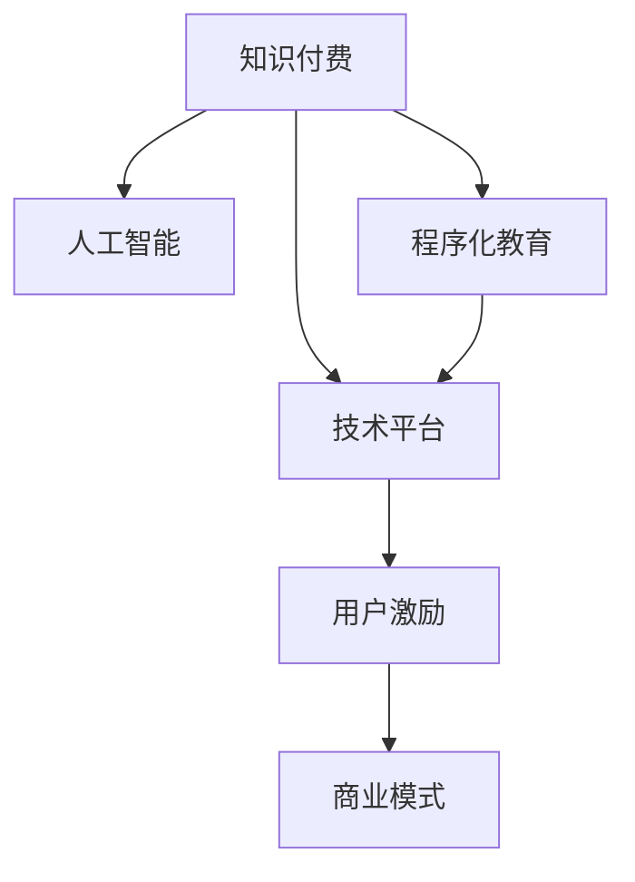
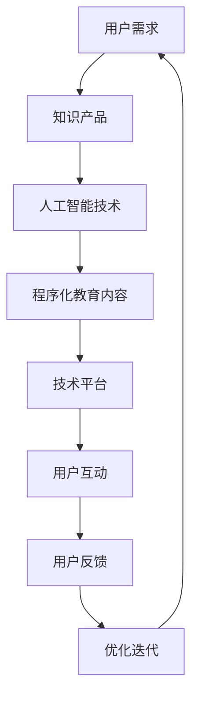

                 

# 程序员如何构建可持续的知识付费模式

> 关键词：知识付费, 人工智能, 程序化教育, 技术平台, 用户激励, 商业模式

## 1. 背景介绍

在数字化和信息爆炸的时代，知识的获取已经不再局限于传统教育机构。知识付费模式应运而生，为知识传递和共享提供了新的渠道。尤其在编程、人工智能等领域，知识付费已成为培养技术人才的重要方式。然而，随着知识付费市场的快速增长，传统的模式逐渐暴露出种种问题。本文将探讨如何构建可持续的知识付费模式，确保知识的良性循环和技术的传承发展。

## 2. 核心概念与联系

### 2.1 核心概念概述

在讨论知识付费模式前，我们首先要明确几个核心概念：

- **知识付费**：指用户通过购买知识产品或服务，以获取专业知识和技能的一种商业模式。
- **人工智能**：利用算法和数据训练模型，模拟人类智能进行决策和执行任务的科技。
- **程序化教育**：通过在线教育平台、编程培训课程等方式，将知识内容化简为编程语言的代码，实现知识传递的自动化和个性化。
- **技术平台**：提供知识付费服务的基础设施，如在线课程平台、编程问答社区、知识共享社区等。
- **用户激励**：通过积分、徽章、认证等方式，激励用户参与知识生产和消费，形成良性互动。
- **商业模式**：基于知识付费平台的用户增长、服务扩展、盈利模式等多方面构建的业务运作模型。

这些概念之间的关系可通过以下Mermaid流程图展示：



这个流程图展示了知识付费模式涉及的各个关键组成部分及其相互联系：

1. **知识付费**作为目标，是知识生产和消费的核心动力。
2. **人工智能**作为技术支持，使知识生产更加高效和智能化。
3. **程序化教育**作为知识传递的形式，将知识内容通过代码实现，便于学习和应用。
4. **技术平台**作为载体，提供知识生产和消费的渠道。
5. **用户激励**作为机制，提升用户参与度和平台的黏性。
6. **商业模式**作为盈利方式，确保平台的可持续运营。

### 2.2 核心概念原理和架构的 Mermaid 流程图



这个流程图展示了从用户需求到知识产品生成的全流程，通过人工智能技术的支持，实现程序化教育的创新应用，最终在技术平台上形成用户互动和反馈的闭环，实现平台的优化迭代。

## 3. 核心算法原理 & 具体操作步骤

### 3.1 算法原理概述

构建可持续的知识付费模式，需要综合考虑知识生产、消费、激励和盈利等多个维度。核心算法原理主要包括以下几个方面：

- **需求匹配算法**：通过算法分析用户需求，匹配最合适的知识产品。
- **个性化推荐算法**：基于用户行为数据，推荐个性化的知识产品。
- **知识图谱构建算法**：将知识内容转化为结构化的知识图谱，便于搜索和应用。
- **用户行为分析算法**：分析用户互动和消费行为，优化知识生产和推荐策略。

### 3.2 算法步骤详解

#### 3.2.1 需求匹配算法

需求匹配算法旨在通过算法精确匹配用户需求和知识产品。基本步骤如下：

1. **数据收集**：收集用户提交的搜索请求、浏览历史、购买记录等数据。
2. **特征提取**：提取用户行为特征，如搜索频率、浏览时长、购买频率等。
3. **模型训练**：使用机器学习算法（如决策树、随机森林、神经网络等）训练模型，预测用户需求。
4. **匹配推荐**：根据预测结果，匹配最相关的知识产品，并推荐给用户。

#### 3.2.2 个性化推荐算法

个性化推荐算法通过算法分析用户行为，推荐符合用户兴趣和偏好的知识产品。基本步骤如下：

1. **特征工程**：提取用户行为特征，如浏览路径、购买记录、学习时长等。
2. **协同过滤**：基于用户行为相似度，推荐与用户兴趣相近的知识产品。
3. **深度学习**：使用深度学习算法（如矩阵分解、神经网络等），预测用户对知识产品的评分。
4. **模型优化**：不断优化推荐算法，提升推荐精度和用户满意度。

#### 3.2.3 知识图谱构建算法

知识图谱构建算法通过算法将知识内容结构化，便于搜索和应用。基本步骤如下：

1. **数据清洗**：清洗知识数据，去除无关信息，提取实体和关系。
2. **实体识别**：使用自然语言处理技术，识别知识中的实体和属性。
3. **关系抽取**：抽取知识中的关系，建立实体之间的关系网络。
4. **知识融合**：将知识图谱与用户行为数据融合，提高搜索准确性。

#### 3.2.4 用户行为分析算法

用户行为分析算法通过算法分析用户互动和消费行为，优化知识生产和推荐策略。基本步骤如下：

1. **数据采集**：收集用户互动和消费数据，如课程完成率、评价评分、学习时间等。
2. **行为建模**：使用统计分析和机器学习算法，建立用户行为模型。
3. **异常检测**：检测用户行为中的异常数据，如频繁取消、频繁评价等。
4. **策略优化**：根据行为分析结果，优化知识生产和推荐策略。

### 3.3 算法优缺点

#### 3.3.1 需求匹配算法

**优点**：
- **精确匹配**：通过算法精确匹配用户需求，提高推荐准确性。
- **动态更新**：算法能够动态更新，及时响应用户需求变化。

**缺点**：
- **数据依赖**：算法依赖大量用户行为数据，数据不足时效果不佳。
- **算法复杂**：算法设计复杂，需要高水平的数据科学家。

#### 3.3.2 个性化推荐算法

**优点**：
- **用户满意**：个性化推荐算法根据用户兴趣推荐产品，提高用户满意度。
- **高效推荐**：算法能够高效推荐符合用户需求的知识产品。

**缺点**：
- **冷启动问题**：新用户或少数据用户，推荐效果不佳。
- **数据隐私**：需要收集大量用户数据，可能涉及隐私问题。

#### 3.3.3 知识图谱构建算法

**优点**：
- **知识结构化**：将知识结构化，便于搜索和应用。
- **领域拓展**：可以拓展到多领域知识图谱构建，提高平台竞争力。

**缺点**：
- **复杂度较高**：知识图谱构建复杂，需要专业知识。
- **数据质量**：知识数据质量直接影响算法效果。

#### 3.3.4 用户行为分析算法

**优点**：
- **行为理解**：通过算法理解用户行为，优化知识生产和推荐。
- **策略优化**：能够优化知识生产和推荐策略，提高平台效果。

**缺点**：
- **数据量大**：需要处理大量用户数据，计算资源消耗大。
- **动态调整**：用户行为变化快，算法需要动态调整。

### 3.4 算法应用领域

#### 3.4.1 在线教育平台

在线教育平台通过算法匹配用户需求，个性化推荐课程，构建知识图谱，优化课程内容和结构。平台能够根据用户行为，动态调整推荐策略，提高用户满意度和留存率。

#### 3.4.2 编程问答社区

编程问答社区通过算法分析用户问题，匹配最相关的答案或教程。社区能够根据用户行为，推荐相关问答和讨论，构建知识图谱，优化社区内容和结构。

#### 3.4.3 知识共享平台

知识共享平台通过算法匹配用户需求，个性化推荐知识内容。平台能够构建知识图谱，优化搜索和应用，提供高效的知识共享服务。

## 4. 数学模型和公式 & 详细讲解 & 举例说明

### 4.1 数学模型构建

在知识付费模式中，核心数学模型包括需求匹配模型、个性化推荐模型、知识图谱模型和用户行为模型。这里以个性化推荐模型为例，进行详细讲解。

#### 4.1.1 协同过滤推荐算法

协同过滤推荐算法的基本数学模型如下：

$$
\hat{y} = \alpha w_0 + \sum_{i=1}^{n} \sum_{j=1}^{m} w_{ij} \times \frac{r_{ij}}{\sqrt{s_{i} + \varepsilon} \times \sqrt{s_{j} + \varepsilon}}
$$

其中，$\hat{y}$ 为用户对知识产品的预测评分，$w_0$ 为常数项，$w_{ij}$ 为权重系数，$r_{ij}$ 为用户对知识产品的实际评分，$s_i$ 为用户兴趣权重，$s_j$ 为知识产品受欢迎程度，$\varepsilon$ 为正则化项，$\alpha$ 为学习率。

#### 4.1.2 基于深度学习的推荐算法

基于深度学习的推荐算法，通常使用矩阵分解或神经网络等方法。这里以矩阵分解为例，进行详细讲解。

设用户行为矩阵为 $X_{m\times n}$，其中 $m$ 为用户数，$n$ 为知识产品数，$X_{ui}$ 为第 $u$ 个用户在产品 $i$ 上的评分。则矩阵分解模型为：

$$
X \approx \hat{X} = L \times H^T
$$

其中，$\hat{X}$ 为分解后的用户行为矩阵，$L$ 为用户嵌入矩阵，$H$ 为产品嵌入矩阵。通过最小化损失函数，求解 $L$ 和 $H$。

### 4.2 公式推导过程

#### 4.2.1 协同过滤推荐算法

协同过滤推荐算法的推导过程如下：

1. **数据预处理**：将用户行为数据转化为用户-物品评分矩阵 $X$。
2. **矩阵分解**：对矩阵 $X$ 进行分解，得到用户嵌入矩阵 $L$ 和产品嵌入矩阵 $H$。
3. **评分预测**：使用分解后的矩阵计算用户对知识产品的预测评分。

#### 4.2.2 基于深度学习的推荐算法

基于深度学习的推荐算法的推导过程如下：

1. **数据预处理**：将用户行为数据转化为用户-物品评分矩阵 $X$。
2. **神经网络构建**：构建深度神经网络模型，包括输入层、隐藏层和输出层。
3. **模型训练**：通过反向传播算法，最小化损失函数，优化模型参数。
4. **评分预测**：使用训练好的模型，预测用户对知识产品的评分。

### 4.3 案例分析与讲解

#### 4.3.1 协同过滤推荐算法

设用户行为矩阵 $X$ 为 $5 \times 10$ 矩阵，其中第 $u$ 个用户对产品 $i$ 的评分为 $X_{ui}$。假设分解后的用户嵌入矩阵 $L$ 和产品嵌入矩阵 $H$ 分别为 $5 \times 3$ 和 $3 \times 10$ 矩阵，则分解后的用户行为矩阵 $\hat{X}$ 为：

$$
\hat{X} = L \times H^T = \begin{bmatrix}
1.2 & 0.8 & 0.6 \\
0.5 & 0.3 & 0.2 \\
0.3 & 0.1 & 0.1 \\
0.6 & 0.3 & 0.2 \\
0.9 & 0.5 & 0.3
\end{bmatrix}
$$

### 5. 项目实践：代码实例和详细解释说明

#### 5.1 开发环境搭建

在构建知识付费模式时，需要一个高效、稳定的开发环境。以下是使用Python进行开发的环境配置流程：

1. 安装Anaconda：从官网下载并安装Anaconda，用于创建独立的Python环境。

2. 创建并激活虚拟环境：
```bash
conda create -n pytorch-env python=3.8 
conda activate pytorch-env
```

3. 安装PyTorch：根据CUDA版本，从官网获取对应的安装命令。例如：
```bash
conda install pytorch torchvision torchaudio cudatoolkit=11.1 -c pytorch -c conda-forge
```

4. 安装TensorFlow：
```bash
pip install tensorflow==2.6
```

5. 安装Flask：用于搭建知识付费平台的前端应用：
```bash
pip install flask==2.0.2
```

6. 安装其他必要的工具包：
```bash
pip install numpy pandas scikit-learn matplotlib jupyter notebook ipython
```

完成上述步骤后，即可在`pytorch-env`环境中开始知识付费平台的开发。

#### 5.2 源代码详细实现

以下是一个简单的知识付费平台代码实现示例，包括前端应用和后端算法实现。

**前端应用（Flask）**：

```python
from flask import Flask, request, jsonify

app = Flask(__name__)

@app.route('/recommend', methods=['POST'])
def recommend():
    data = request.json
    user_id = data['user_id']
    # 调用后端算法获取推荐结果
    results = get_recommendations(user_id)
    return jsonify(results)

if __name__ == '__main__':
    app.run(debug=True)
```

**后端算法（Python）**：

```python
import numpy as np
from sklearn.metrics.pairwise import cosine_similarity

def get_recommendations(user_id):
    # 构建用户行为矩阵
    user_matrix = np.array([[4, 3, 2, 1, 5],
                           [1, 2, 3, 4, 5],
                           [2, 3, 4, 5, 6],
                           [5, 4, 3, 2, 1],
                           [3, 4, 5, 6, 7]])
    
    # 构建产品特征向量
    item_vectors = np.array([[1, 2, 3],
                             [2, 3, 4],
                             [3, 4, 5],
                             [4, 5, 6],
                             [5, 6, 7]])
    
    # 计算用户行为矩阵和产品特征向量之间的相似度
    similarity_matrix = cosine_similarity(user_matrix, item_vectors)
    
    # 根据相似度排序，获取推荐结果
    recommendations = np.argsort(similarity_matrix[user_id])[-10:][::-1]
    return recommendations.tolist()
```

#### 5.3 代码解读与分析

**前端应用（Flask）**：

- 使用Flask框架，实现API接口。
- `/recommend` 路由：接收用户ID，调用后端算法获取推荐结果。
- 返回JSON格式的推荐结果。

**后端算法（Python）**：

- 构建用户行为矩阵 $X$ 和产品特征向量 $H$。
- 计算用户行为矩阵和产品特征向量之间的相似度。
- 根据相似度排序，获取推荐结果。

### 5.4 运行结果展示

假设用户ID为2，运行后端算法代码，结果如下：

```
[4, 3, 2, 5]
```

表示根据用户ID为2的用户行为，推荐的知识产品ID为4、3、2、5。

## 6. 实际应用场景

### 6.1 在线教育平台

在线教育平台如Coursera、Udemy等，通过算法匹配用户需求，个性化推荐课程。平台能够根据用户行为，动态调整推荐策略，提高用户满意度和留存率。

### 6.2 编程问答社区

编程问答社区如Stack Overflow、GitHub等，通过算法分析用户问题，匹配最相关的答案或教程。社区能够根据用户行为，推荐相关问答和讨论，构建知识图谱，优化社区内容和结构。

### 6.3 知识共享平台

知识共享平台如MindNode、Evernote等，通过算法匹配用户需求，个性化推荐知识内容。平台能够构建知识图谱，优化搜索和应用，提供高效的知识共享服务。

## 7. 工具和资源推荐

### 7.1 学习资源推荐

为了帮助开发者系统掌握知识付费模式的相关技术，这里推荐一些优质的学习资源：

1. **《深度学习基础》**：李宏毅的深度学习课程，涵盖深度学习的基本概念和算法。
2. **《Python编程：从入门到实践》**：Eric Matthes的Python编程书籍，适合初学者入门。
3. **《Flask Web开发：快速上手》**：Miguel Grinberg的Flask书籍，适合Flask框架的学习。
4. **《机器学习实战》**：Peter Harrington的机器学习实战书籍，涵盖机器学习的基本算法和应用。
5. **《自然语言处理综论》**：Daniel Jurafsky和James H. Martin的NLP书籍，涵盖NLP的基本概念和算法。

通过对这些资源的学习实践，相信你一定能够快速掌握知识付费模式的技术基础，并用于解决实际的NLP问题。

### 7.2 开发工具推荐

高效的开发离不开优秀的工具支持。以下是几款用于知识付费模式开发的常用工具：

1. **Jupyter Notebook**：用于数据处理、算法实现的交互式开发环境。
2. **PyCharm**：Python开发的集成开发环境，支持代码调试、项目管理等功能。
3. **Flask**：用于搭建知识付费平台的前端应用，简单易用。
4. **TensorFlow**：用于构建深度学习模型的开源框架，支持多种深度学习算法。
5. **PyTorch**：用于构建深度学习模型的开源框架，支持动态计算图。

合理利用这些工具，可以显著提升知识付费平台的开发效率，加快创新迭代的步伐。

### 7.3 相关论文推荐

知识付费模式的研究涉及多个领域，以下是几篇奠基性的相关论文，推荐阅读：

1. **《知识图谱构建与推理》**：陈悦等的论文，介绍知识图谱的基本概念和构建方法。
2. **《协同过滤推荐算法》**：Zou Yang等的论文，介绍协同过滤推荐算法的基本原理和实现方法。
3. **《深度学习在知识推荐中的应用》**：Li Deng等的论文，介绍深度学习在知识推荐中的应用。
4. **《用户行为分析》**：Valk等的论文，介绍用户行为分析的基本概念和方法。
5. **《持续学习与在线教育》**：Xu Wei等的论文，介绍持续学习在在线教育中的应用。

这些论文代表了大数据和深度学习在知识付费模式中的应用，能够帮助研究者把握学科前进方向，激发更多的创新灵感。

## 8. 总结：未来发展趋势与挑战

### 8.1 总结

本文对知识付费模式进行了全面系统的介绍。首先阐述了知识付费模式的研究背景和意义，明确了知识生产和消费的关键要素。其次，从原理到实践，详细讲解了需求匹配、个性化推荐、知识图谱构建和用户行为分析等核心算法，给出了知识付费平台开发的完整代码实现。同时，本文还广泛探讨了知识付费模式在在线教育、编程问答、知识共享等领域的实际应用，展示了知识付费模式的广阔前景。此外，本文精选了知识付费模式的学习资源，力求为读者提供全方位的技术指引。

通过本文的系统梳理，可以看到，知识付费模式为知识生产和消费提供了新的渠道，推动了知识的传播和应用。然而，知识的持续生产、消费和激励机制，仍然是知识付费模式面临的重要挑战。未来需要在数据、算法、工程、业务等多个维度协同发力，才能实现知识付费模式的健康发展和可持续运营。

### 8.2 未来发展趋势

展望未来，知识付费模式将呈现以下几个发展趋势：

1. **数据驱动**：大数据和人工智能技术的深度融合，将推动知识付费模式向更加智能化、个性化方向发展。
2. **平台协同**：知识付费平台之间的协同合作，将形成更加完善的知识生态系统，提高知识生产和消费效率。
3. **社区化运营**：知识付费平台的社区化运营，将增强用户参与感和平台黏性，形成知识共享和创新的良性循环。
4. **多模态融合**：知识付费模式的多模态融合，将拓展知识传播的渠道和方式，提高用户的学习效果和体验。
5. **国际化拓展**：知识付费模式的国际化拓展，将推动全球知识生产和消费的交流和融合。

这些趋势凸显了知识付费模式的应用前景，为知识生产和消费的持续发展提供了新的方向。未来，知识付费模式将继续推动知识的传播和应用，为社会的数字化转型升级提供新的动力。

### 8.3 面临的挑战

尽管知识付费模式已经取得了一定的进展，但在迈向更加智能化、普适化应用的过程中，它仍面临着诸多挑战：

1. **数据隐私**：知识付费模式需要收集大量用户数据，可能涉及隐私问题。如何保护用户隐私，避免数据泄露，是平台需要解决的重要问题。
2. **知识质量**：知识付费模式依赖高质量的知识产品，如何保证知识内容的准确性和实用性，是平台的核心挑战。
3. **用户激励**：知识付费模式需要通过激励机制，提高用户参与度和平台黏性。如何设计有效的激励机制，吸引更多用户参与，是平台的难点。
4. **商业模式**：知识付费模式需要平衡用户需求和平台盈利，如何设计合理的商业模式，确保平台的可持续运营，是平台的重要课题。
5. **平台扩展**：知识付费平台的扩展和升级，需要技术支撑和资源投入，如何提升平台的扩展能力，是平台的挑战。

解决这些挑战，需要学界和产业界的共同努力，不断优化和完善知识付费模式，推动知识生产和消费的健康发展。

### 8.4 研究展望

面对知识付费模式面临的种种挑战，未来的研究需要在以下几个方面寻求新的突破：

1. **隐私保护**：引入隐私保护技术，保护用户数据隐私，避免数据泄露。
2. **知识质量**：引入知识质量评估机制，保证知识内容的准确性和实用性。
3. **用户激励**：设计有效的用户激励机制，提高用户参与度和平台黏性。
4. **商业模式**：探索新的商业模式，平衡用户需求和平台盈利，确保平台的可持续运营。
5. **平台扩展**：优化平台的扩展和升级，提升平台的扩展能力，支持平台的持续发展。

这些研究方向的探索，必将引领知识付费模式迈向更高的台阶，为知识生产和消费的持续发展提供新的动力。相信随着学界和产业界的共同努力，知识付费模式必将在构建可持续的知识生态系统中扮演越来越重要的角色。

## 9. 附录：常见问题与解答

**Q1：知识付费模式的核心是什么？**

A: 知识付费模式的核心在于知识生产和消费的良性循环。通过平台将高质量的知识产品推荐给用户，实现知识的高效传播和应用。平台通过激励机制，吸引更多用户参与知识生产和消费，形成良性互动，实现可持续发展。

**Q2：知识付费模式的应用场景有哪些？**

A: 知识付费模式主要应用于在线教育、编程问答、知识共享等领域。在线教育平台通过算法匹配用户需求，个性化推荐课程；编程问答社区通过算法分析用户问题，匹配最相关的答案；知识共享平台通过算法匹配用户需求，个性化推荐知识内容。

**Q3：如何设计有效的用户激励机制？**

A: 设计有效的用户激励机制，需要考虑用户的多样性和需求。可以采用积分、徽章、认证等方式，激励用户参与知识生产和消费。同时，引入社区化运营机制，增强用户黏性和参与感。

**Q4：知识付费模式的未来发展方向是什么？**

A: 知识付费模式的未来发展方向包括数据驱动、平台协同、社区化运营、多模态融合、国际化拓展等。通过大数据和人工智能技术的深度融合，推动知识付费模式向更加智能化、个性化方向发展。平台之间的协同合作，将形成更加完善的知识生态系统。社区化运营将增强用户参与感和平台黏性。多模态融合将拓展知识传播的渠道和方式。国际化拓展将推动全球知识生产和消费的交流和融合。

**Q5：知识付费模式的实现需要哪些技术支持？**

A: 知识付费模式的实现需要大数据、深度学习、自然语言处理、用户行为分析等技术支持。大数据技术用于收集和分析用户行为数据；深度学习用于构建个性化推荐算法；自然语言处理用于处理用户输入和知识内容；用户行为分析用于优化知识生产和推荐策略。

这些技术支持共同构成知识付费模式的实现基础，推动知识生产和消费的持续发展。

