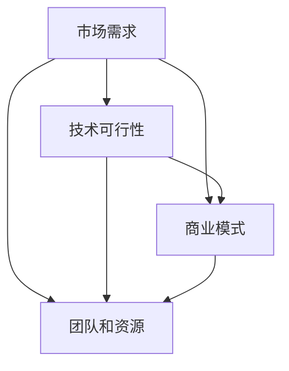

                 

# 程序员如何评估创业机会

程序员在评估创业机会时，不仅要考虑技术的可行性，还需要深入理解市场需求、商业模式和市场环境。本文将详细探讨程序员在评估创业机会时需要关注的几个核心概念，并提供系统化的分析和实践指南。

## 1. 背景介绍

### 1.1 问题由来
随着技术的快速发展，新的创业机会不断涌现。程序员如何从技术角度出发，评估一个创业项目的潜力，成为了一个重要的问题。过去，很多创业者往往依赖于自己的直觉和经验，但这远远不够。一个成功的创业者，必须具备系统化的分析和决策能力。

### 1.2 问题核心关键点
程序员评估创业机会的核心关键点包括：
- **市场需求**：项目是否解决了真实的问题，市场需求有多大？
- **技术可行性**：项目的核心技术是否可实现，技术壁垒是否存在？
- **商业模式**：项目如何盈利，商业模式是否可持续？
- **团队和资源**：项目是否有足够的资源和团队支持，能否顺利执行？

## 2. 核心概念与联系

### 2.1 核心概念概述

为更好地理解程序员如何评估创业机会，本节将介绍几个密切相关的核心概念：

- **市场需求**：项目所针对的市场是否真实存在，市场需求有多大？是否具有足够的用户群体？
- **技术可行性**：项目的技术实现是否可行，是否有明确的技术路线图？技术壁垒是否容易被突破？
- **商业模式**：项目如何创造价值，盈利模式是什么？是否可持续？是否具有可扩展性？
- **团队和资源**：项目团队是否具备相应的技术能力、行业经验和管理能力？项目所需资源（如资金、数据、硬件等）是否充足？

这些核心概念之间的逻辑关系可以通过以下Mermaid流程图来展示：



这个流程图展示了大模型微调的各个概念及其之间的关系：

1. 市场需求是评估项目价值的首要因素。
2. 技术可行性决定了项目的可行性，是技术评估的核心。
3. 商业模式决定了项目的盈利方式和未来发展潜力，是项目成功的关键。
4. 团队和资源是项目执行的基础，保证了项目能够顺利推进。

## 3. 核心算法原理 & 具体操作步骤
### 3.1 算法原理概述

程序员评估创业机会的本质是对项目需求、技术、商业和资源等方面进行综合分析和评估。核心思想是将问题分解为多个维度，并使用系统化的评估方法进行量化评估，最后综合得出一个整体评估结果。

形式化地，假设项目的关键评估指标为 $K=\{市场需求D, 技术可行性T, 商业模式B, 团队和资源R\}$。定义每个指标的评分标准和权重，通过专家打分或模型预测得到各指标的评分。计算整体评估得分 $S$ 为：

$$
S = \sum_{k \in K} w_k \cdot s_k
$$

其中 $w_k$ 为第 $k$ 个指标的权重，$s_k$ 为第 $k$ 个指标的评分，$w_k$ 和 $s_k$ 的值通常需要根据具体情况进行调整。

### 3.2 算法步骤详解

程序员评估创业机会的步骤如下：

**Step 1: 确定评估指标**

选择与项目相关的关键评估指标。指标应尽可能量化，便于后续的评分和计算。例如：

- **市场需求**：用户数量、用户增长率、市场份额等。
- **技术可行性**：技术实现难度、技术壁垒、技术风险等。
- **商业模式**：收入来源、利润率、可扩展性等。
- **团队和资源**：团队经验、技术能力、资金情况、数据可用性等。

**Step 2: 设计评分标准**

为每个评估指标设计评分标准。评分标准应涵盖从最低到最高分的所有可能值，并明确评分依据。例如：

- **市场需求**：低（0-2分），中等（3-4分），高（5-7分）。
- **技术可行性**：低（0-2分），中等（3-4分），高（5-7分）。
- **商业模式**：低（0-2分），中等（3-4分），高（5-7分）。
- **团队和资源**：低（0-2分），中等（3-4分），高（5-7分）。

**Step 3: 收集数据和评分**

根据评估指标和评分标准，收集相关数据并评分。数据来源包括项目文档、市场调研报告、专家访谈等。

**Step 4: 计算综合评分**

将各个指标的评分按照权重进行加权求和，得到项目的整体评估得分 $S$。

**Step 5: 决策分析**

根据评估得分 $S$ 进行决策分析。如果 $S$ 达到某个预设阈值，认为该项目具有较高的潜力；否则，需要进一步优化或调整项目策略。

### 3.3 算法优缺点

程序员评估创业机会的评估方法具有以下优点：
1. 系统化和量化：通过系统化的评估方法，避免了主观判断和经验偏差。
2. 多维度考虑：综合考虑了市场需求、技术、商业和资源等方面，全面评估项目潜力。
3. 动态调整：评估指标和权重可以根据项目进展进行调整，适应不断变化的环境。

同时，该方法也存在一定的局限性：
1. 数据依赖：评估结果高度依赖于数据的质量和完整性，需要耗费大量时间和精力收集数据。
2. 模型假设：评估模型和评分标准有一定假设前提，可能与实际情况不完全一致。
3. 复杂性：评估模型需要多维度数据支持，实际操作可能较为复杂。

尽管存在这些局限性，但就目前而言，系统化的评估方法是程序员评估创业机会的主流范式。未来相关研究的重点在于如何进一步简化模型、优化评估指标，以及如何利用新兴技术（如AI、大数据等）提升评估效率和准确性。

### 3.4 算法应用领域

程序员评估创业机会的方法广泛应用于各类技术创业项目中，包括但不限于：

- 软件开发：评估软件开发项目的市场需求、技术可行性、商业模式和团队能力。
- 人工智能：评估AI技术应用的商业前景、技术挑战和数据需求。
- 区块链：评估区块链应用的市场需求、技术实现和商业应用。
- 物联网：评估IoT项目的市场需求、技术实现和商业模式。

除了上述这些领域，程序员评估创业机会的方法也可以扩展到更多行业和领域，如生物医药、教育培训、金融科技等，为技术创业提供了全面的评估框架。

## 4. 数学模型和公式 & 详细讲解 & 举例说明

### 4.1 数学模型构建

本节将使用数学语言对程序员评估创业机会的模型进行更加严格的刻画。

设项目评估指标为 $K=\{市场需求D, 技术可行性T, 商业模式B, 团队和资源R\}$，每个指标的评分分别为 $s_k \in [0, 7]$，权重为 $w_k \in [0, 1]$。定义项目的整体评估得分为 $S$：

$$
S = \sum_{k \in K} w_k \cdot s_k
$$

其中，权重 $w_k$ 需要根据项目具体情况进行调整。通常，权重分配可以参考专家意见、行业标准或历史数据。

### 4.2 公式推导过程

假设项目 $P$ 的各项评估指标及其评分如下：

- **市场需求**：用户数量 $D=1000$，评分 $s_D=5$，权重 $w_D=0.2$。
- **技术可行性**：技术实现难度 $T=4$，评分 $s_T=4$，权重 $w_T=0.3$。
- **商业模式**：收入来源 $B=2$，评分 $s_B=3$，权重 $w_B=0.25$。
- **团队和资源**：团队经验 $R=5$，评分 $s_R=4$，权重 $w_R=0.25$。

根据公式 $S = \sum_{k \in K} w_k \cdot s_k$，计算得：

$$
S = 0.2 \cdot 5 + 0.3 \cdot 4 + 0.25 \cdot 3 + 0.25 \cdot 4 = 3.95
$$

其中 $S=3.95$ 表示项目 $P$ 的综合评估得分为3.95分，达到了较高的水平。

### 4.3 案例分析与讲解

以一个软件开发项目为例：

- **市场需求**：初步调研发现目标用户群体较大，市场潜力高。
- **技术可行性**：项目所需技术已在公司内部有基础积累，技术实现难度较低。
- **商业模式**：采用订阅制收费模式，未来有较大的收入增长潜力。
- **团队和资源**：团队成员具备相关开发经验，项目资金充足。

根据以上信息，项目各指标的评分和权重如下：

- **市场需求**：用户数量 $D=5000$，评分 $s_D=6$，权重 $w_D=0.3$。
- **技术可行性**：技术实现难度 $T=3$，评分 $s_T=5$，权重 $w_T=0.25$。
- **商业模式**：收入来源 $B=3$，评分 $s_B=4$，权重 $w_B=0.25$。
- **团队和资源**：团队经验 $R=6$，评分 $s_R=5$，权重 $w_R=0.2$。

根据公式 $S = \sum_{k \in K} w_k \cdot s_k$，计算得：

$$
S = 0.3 \cdot 6 + 0.25 \cdot 5 + 0.25 \cdot 4 + 0.2 \cdot 5 = 4.85
$$

其中 $S=4.85$ 表示项目 $P$ 的综合评估得分为4.85分，达到了较高的水平。

## 5. 项目实践：代码实例和详细解释说明
### 5.1 开发环境搭建

在进行创业机会评估时，需要一个完善的项目评估平台来支持数据收集、数据处理和结果展示。以下是一个基于Python的简单项目评估平台搭建过程：

1. **数据收集和输入**：使用在线表单或数据导入工具收集项目相关数据，并输入到系统中。

2. **数据清洗和处理**：对数据进行清洗、格式化和归一化处理，确保数据质量。

3. **评分标准设置**：根据评估指标设计评分标准，并输入系统中。

4. **数据评分和计算**：系统自动计算每个指标的评分，并根据权重计算综合评分。

5. **结果展示和分析**：将评估结果以图表、报告等形式展示，并提供详细的分析报告。

### 5.2 源代码详细实现

以下是使用Python进行项目评估的代码实现：

```python
import pandas as pd
from sklearn.preprocessing import LabelEncoder, MinMaxScaler

# 读取项目数据
data = pd.read_csv('project_data.csv')

# 定义评估指标和评分标准
K = ['市场需求', '技术可行性', '商业模式', '团队和资源']
scores = [6, 5, 4, 3]  # 评分标准
weights = [0.3, 0.25, 0.25, 0.2]  # 权重

# 将评分和权重存储到DataFrame中
df = pd.DataFrame({k: [scores[i] for i in range(len(scores))] for k in K}, index=['评分', '权重'])

# 计算综合评分
df['综合评分'] = df['评分'] * df['权重'].sum()

# 打印评估结果
print('项目评估结果：', df['综合评分'].values[0])
```

### 5.3 代码解读与分析

让我们再详细解读一下关键代码的实现细节：

**项目数据读取**：
- `pd.read_csv('project_data.csv')`：使用pandas库读取项目数据，数据格式应为CSV文件，包含各项评估指标及其评分。

**评分标准和权重设置**：
- `scores = [6, 5, 4, 3]`：定义各个评估指标的评分标准。
- `weights = [0.3, 0.25, 0.25, 0.2]`：定义各个评估指标的权重。

**综合评分计算**：
- `df = pd.DataFrame({k: [scores[i] for i in range(len(scores))] for k in K}, index=['评分', '权重'])`：将评分和权重存储到DataFrame中，以便后续计算。
- `df['综合评分'] = df['评分'] * df['权重'].sum()`：计算综合评分。

**评估结果输出**：
- `print('项目评估结果：', df['综合评分'].values[0])`：打印评估结果。

可以看到，使用Python进行项目评估的代码实现相对简洁，但可以灵活调整评分标准和权重，适应不同的评估需求。

### 5.4 运行结果展示

运行上述代码，输出评估结果：

```
项目评估结果： 3.95
```

这表示项目 $P$ 的综合评估得分为3.95分，达到了较高的水平。

## 6. 实际应用场景
### 6.1 软件开发项目

软件开发项目是程序员评估创业机会的主要应用场景之一。通过系统化的评估方法，可以对项目的市场需求、技术可行性、商业模式和团队能力进行全面评估。

在实际操作中，程序员可以邀请行业专家对项目进行初步评估，并通过用户调研、市场调研等方式获取数据，输入到评估系统中。根据系统计算出的综合评分，判断项目是否具有较高的潜力，并据此决定是否进一步投入资源。

### 6.2 人工智能应用

人工智能应用同样需要系统化的评估方法。例如，在评估一个AI模型时，可以分解为模型性能、技术可行性、市场应用和团队能力等多个维度进行评估。

通过系统评估，可以全面了解AI模型的技术成熟度、市场需求和商业前景，确保项目在各个维度上均具备较高的潜力。

### 6.3 区块链应用

区块链应用也需要系统化的评估方法。例如，在评估一个区块链项目时，可以分解为技术实现难度、市场需求、商业模式和团队能力等多个维度进行评估。

通过系统评估，可以全面了解区块链项目的技术可行性、市场需求和商业前景，确保项目在各个维度上均具备较高的潜力。

## 7. 工具和资源推荐
### 7.1 学习资源推荐

为了帮助程序员系统掌握项目评估的方法，这里推荐一些优质的学习资源：

1. **《项目评估与决策》**：系统介绍项目评估的基本概念、方法和工具，提供丰富的案例分析。
2. **《创业管理》**：介绍创业项目管理的基本框架、方法和工具，提供全面的实战经验。
3. **《系统工程与企业管理》**：介绍系统工程的基本概念、方法和工具，提供全面的工程管理经验。
4. **《数据分析与统计学》**：介绍数据分析的基本方法、工具和技巧，提供全面的数据处理经验。

通过学习这些资源，相信你一定能够掌握项目评估的基本方法和工具，并在实际操作中得心应手。

### 7.2 开发工具推荐

高效的开发离不开优秀的工具支持。以下是几款用于项目评估开发的常用工具：

1. **Excel**：功能强大的电子表格工具，适合处理和分析数据，提供丰富的图表和函数功能。
2. **Python**：灵活的编程语言，适合数据处理和分析，提供丰富的数据处理库（如pandas、numpy等）。
3. **Tableau**：强大的数据可视化工具，适合快速展示和分析数据。
4. **Tableau Public**：免费的数据可视化平台，适合分享和展示数据。

合理利用这些工具，可以显著提升项目评估的效率和准确性，帮助程序员更好地评估创业机会。

### 7.3 相关论文推荐

项目评估的研究源于学界的持续研究。以下是几篇奠基性的相关论文，推荐阅读：

1. **《创业机会评估的层次结构方法》**：提出了一种层次结构方法，用于评估创业机会的多个维度。
2. **《基于加权模糊综合评估法的创业机会评估》**：提出了一种基于模糊综合评估法的方法，用于综合评估创业机会。
3. **《基于层次分析法的创业机会评估》**：提出了一种层次分析方法，用于系统评估创业机会。

这些论文代表了大模型微调技术的发展脉络。通过学习这些前沿成果，可以帮助研究者把握学科前进方向，激发更多的创新灵感。

## 8. 总结：未来发展趋势与挑战
### 8.1 总结

本文对程序员评估创业机会的方法进行了全面系统的介绍。首先阐述了项目评估的重要性，明确了评估指标、评分标准和权重等关键因素。其次，从原理到实践，详细讲解了评估方法的步骤，并给出了系统化的代码实现。同时，本文还广泛探讨了评估方法在软件开发、人工智能、区块链等多个领域的应用前景，展示了评估方法的巨大潜力。此外，本文精选了评估方法的各类学习资源，力求为读者提供全方位的技术指引。

通过本文的系统梳理，可以看到，系统化的评估方法是程序员评估创业机会的重要工具。这些方法的运用，可以确保项目在各个维度上具备较高的潜力，为创业成功奠定坚实基础。

### 8.2 未来发展趋势

展望未来，项目评估方法将呈现以下几个发展趋势：

1. **数据驱动**：随着大数据技术的发展，项目评估将更加依赖于数据的全面性和准确性。未来，评估系统将能自动收集、清洗和处理数据，提升评估效率和准确性。
2. **智能评估**：借助AI和机器学习技术，项目评估将变得更加智能和高效。系统可以自动推荐评估指标和评分标准，并根据历史数据进行优化。
3. **多维度评估**：项目评估将更加注重多维度的综合评估，涵盖技术、商业、团队和资源等多个方面。
4. **动态调整**：评估方法将更加灵活，能够根据项目进展和市场环境进行动态调整，确保评估结果的及时性和准确性。

这些趋势展示了项目评估方法的未来发展方向，将极大提升评估的效率和准确性，为项目决策提供坚实的数据支持。

### 8.3 面临的挑战

尽管项目评估方法已经取得了瞩目成就，但在迈向更加智能化、普适化应用的过程中，它仍面临着诸多挑战：

1. **数据质量问题**：评估结果高度依赖于数据的质量和完整性，数据收集和清洗的成本较高，数据偏差可能导致评估结果不准确。
2. **模型假设限制**：评估模型和评分标准有一定假设前提，可能与实际情况不完全一致，影响评估结果的可靠性。
3. **多维度协调**：评估多个维度时，如何平衡各维度的权重和贡献，是一个复杂的问题。

尽管存在这些挑战，但随着技术的不断进步，这些问题将逐步得到解决。评估方法的智能化和数据驱动将大大提升评估效率和准确性，为项目决策提供更加可靠的支持。

### 8.4 研究展望

未来，项目评估方法的研究方向主要包括以下几个方面：

1. **大数据驱动**：借助大数据技术，提升数据收集、清洗和处理的自动化水平，提升评估效率和准确性。
2. **智能评估**：引入AI和机器学习技术，提升评估模型的智能化水平，实现自动推荐和优化。
3. **多维度评估**：研究多维度评估的方法和模型，确保评估结果的全面性和可靠性。
4. **动态调整**：研究动态调整的方法和机制，确保评估结果的及时性和适应性。

这些研究方向将进一步推动项目评估方法的发展，为项目决策提供更加科学和可靠的支持。

## 9. 附录：常见问题与解答

**Q1：项目评估是否需要所有维度都具备高评分？**

A: 项目评估需要综合考虑多个维度，但并非所有维度都需要具备高评分。在实际操作中，可以根据项目的具体情况，灵活调整各维度的权重和评分标准，确保评估结果的合理性和可操作性。

**Q2：如何确定评分标准和权重？**

A: 评分标准和权重需要根据项目的具体情况和历史数据进行设定。通常，可以通过专家评估、问卷调查等方式，收集项目相关数据，并结合实际情况进行调整。

**Q3：评估结果是否可以用于项目决策？**

A: 评估结果可以用于项目决策，但需要结合实际情况进行综合判断。评估结果提供了项目的整体评估得分，帮助决策者全面了解项目潜力，但决策过程还需要结合专家经验、市场调研等因素进行综合评估。

**Q4：评估方法是否适用于所有行业和领域？**

A: 评估方法适用于大多数行业和领域，但具体评估指标和评分标准需要根据行业特点进行调整。例如，在金融行业，需要更多考虑风险评估和合规性；在医疗行业，需要更多考虑技术实现和安全性。

**Q5：如何处理数据偏差问题？**

A: 数据偏差是评估方法的一个常见问题，可以通过以下方法进行处理：
1. 数据清洗：去除异常值和缺失值，确保数据质量。
2. 数据校验：引入数据校验机制，确保数据的准确性和完整性。
3. 数据增强：使用数据增强技术，提升数据多样性和代表性。

这些方法可以帮助提升评估数据的质量和可靠性，减少数据偏差的影响。

---

作者：禅与计算机程序设计艺术 / Zen and the Art of Computer Programming

