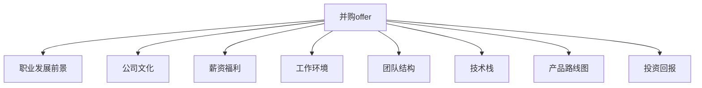

                 

## 1. 背景介绍

在职业生涯中，特别是对于技术领域的高级工程师或管理者，并购（M&A）offer是一个常见而又重要的挑战。它不仅代表了职业发展的机会，也可能是一个重要的职业决策点。评估一个并购offer需要考虑多种因素，包括职业发展前景、公司文化、薪资福利、工作环境、团队结构、技术栈、产品路线图、投资回报等。本文旨在提供一个系统的、全面的框架，帮助程序员评估并购offer。

## 2. 核心概念与联系

### 2.1 核心概念概述

- **并购offer**：指一家公司收购另一家公司或业务时，向目标公司的雇员提出的工作邀请，包含职位描述、薪酬福利、工作地点、汇报关系等信息。

- **职业发展前景**：指通过评估工作稳定性、晋升机会、技术栈升级、学习资源等因素，预测在目标公司的职业成长空间。

- **公司文化**：指公司内部的价值观、工作方式、团队氛围、管理风格等，对个人工作满意度和团队协作有着重大影响。

- **薪资福利**：包括基本工资、奖金、股票期权、退休福利、健康保险、休假等，是评估并购offer的重要经济指标。

- **工作环境**：指工作场所、团队规模、公司大小、地理位置等，对工作质量和员工满意度有重要影响。

- **团队结构**：指公司内部团队的组成，包括团队大小、成员角色、技能分布等，对个人工作任务、团队协作和职业发展有重要影响。

- **技术栈**：指公司使用的主要技术工具和平台，对个人技术成长、项目质量、技术挑战性有重要影响。

- **产品路线图**：指公司未来产品的发展方向和计划，对个人职业发展、项目稳定性、技术升级有重要影响。

- **投资回报**：包括并购公司对目标公司的投资回报率（ROI），对公司财务健康和员工长期利益有重要影响。

这些概念之间的关系可以通过以下Mermaid流程图来展示：



该图展示了并购offer各个核心概念之间的相互联系和影响。

### 2.2 核心概念原理和架构的 Mermaid 流程图

```mermaid
graph TB
    A[并购offer] --> B[职业发展前景]
    B --> C[晋升机会]
    B --> D[技术栈升级]
    B --> E[学习资源]
    
    A --> F[公司文化]
    F --> G[团队氛围]
    F --> H[管理风格]
    
    A --> I[薪资福利]
    I --> J[基本工资]
    I --> K[奖金]
    I --> L[股票期权]
    I --> M[退休福利]
    I --> N[健康保险]
    I --> O[休假]
    
    A --> P[工作环境]
    P --> Q[工作场所]
    P --> R[团队规模]
    P --> S[公司大小]
    P --> T[地理位置]
    
    A --> U[团队结构]
    U --> V[团队大小]
    U --> W[成员角色]
    U --> X[技能分布]
    
    A --> Y[技术栈]
    Y --> Z[工具]
    Y --> $[平台]
    
    A --> [[产品路线图]]
    [[产品路线图]] --> [[项目稳定性]]
    [[产品路线图]] --> [[技术升级]]
    
    A --> [[投资回报]]
    [[投资回报]] --> [[ROI]]
```

## 3. 核心算法原理 & 具体操作步骤

### 3.1 算法原理概述

评估并购offer的算法原理主要包括以下几个步骤：

1. **数据收集**：从并购公司提供的信息中收集相关的数据，包括职位描述、薪资福利、工作地点、团队结构、技术栈、产品路线图、投资回报等。

2. **权重分配**：为每个评估指标分配权重，根据重要性和影响程度确定其对最终决策的贡献。

3. **计算得分**：根据收集的数据和权重，计算每个评估指标的得分，综合评估并购offer的整体质量。

4. **风险评估**：考虑并购公司可能面临的财务风险、市场风险、技术风险等，评估其在并购后的生存能力。

5. **决策分析**：结合个人职业目标、风险偏好等因素，综合考虑评估结果和风险因素，做出最终决策。

### 3.2 算法步骤详解

#### 3.2.1 数据收集

- **职位描述**：了解职位名称、职责范围、工作内容和职业发展路径。

- **薪资福利**：查看基本工资、奖金、股票期权、退休福利、健康保险、休假等福利。

- **工作地点**：评估工作地点的地理位置、居住环境、交通便利性等。

- **团队结构**：调查团队规模、成员角色、技能分布、团队氛围等。

- **技术栈**：研究公司使用的技术和平台，评估技术挑战性和技术升级潜力。

- **产品路线图**：分析公司产品的未来发展方向和计划，评估项目的稳定性和技术升级。

- **投资回报**：了解并购公司的投资回报率（ROI），评估公司财务健康和长期利益。

#### 3.2.2 权重分配

- **权重分配方法**：常见的权重分配方法包括经验评估法、专家咨询法、层次分析法等。

- **权重确定**：权重分配应根据个人职业目标、风险偏好、市场环境等实际情况进行确定。

#### 3.2.3 计算得分

- **数据标准化**：将每个评估指标的数据标准化，使其具有可比性。

- **得分计算**：根据权重和标准化后的数据，计算每个评估指标的得分。

#### 3.2.4 风险评估

- **财务风险**：分析并购公司的财务状况，评估其生存能力和财务健康。

- **市场风险**：评估市场环境、行业趋势和并购公司的竞争地位。

- **技术风险**：评估并购公司面临的技术挑战和风险，包括技术升级难度、技术人才缺口等。

#### 3.2.5 决策分析

- **职业目标对齐**：评估并购公司的职业发展机会是否符合个人职业目标。

- **风险偏好**：考虑个人的风险偏好，评估并购公司是否符合风险承受能力。

- **综合评估**：结合评估结果和风险因素，做出最终决策。

### 3.3 算法优缺点

#### 3.3.1 优点

- **全面性**：通过系统评估多个关键指标，全面了解并购公司的优势和劣势。

- **可比性**：将不同并购offer进行标准化比较，便于做出客观选择。

- **个性化**：根据个人职业目标和风险偏好进行调整，做出符合自身需求的决策。

#### 3.3.2 缺点

- **主观性**：权重分配和得分计算具有主观性，可能受评估者个人经验和偏见影响。

- **数据收集难度**：需要收集大量信息，可能耗时耗力。

- **动态变化**：市场环境和技术栈等可能发生变化，评估结果需定期更新。

### 3.4 算法应用领域

本算法可以应用于以下领域：

- **技术公司并购**：如Google收购YouTube、Facebook收购WhatsApp等。

- **创业公司并购**：如微软收购LinkedIn、Salesforce收购Talend等。

- **大型企业并购**：如IBM收购Red Hat、AT&T收购Time Warner等。

## 4. 数学模型和公式 & 详细讲解 & 举例说明

### 4.1 数学模型构建

假设一个并购offer有五个评估指标：薪资福利（W）、职业发展前景（D）、公司文化（C）、工作环境（E）、团队结构（T），每个指标的权重分别为0.3、0.2、0.2、0.15、0.15。设每个指标的得分分别为 $W_i$、$D_i$、$C_i$、$E_i$、$T_i$，则并购offer的综合得分为：

$$
S = 0.3W_i + 0.2D_i + 0.2C_i + 0.15E_i + 0.15T_i
$$

### 4.2 公式推导过程

- **数据标准化**：对于每个指标，进行归一化处理，使其值在0到1之间。

- **权重分配**：根据重要性分配权重，总权重为1。

- **得分计算**：将标准化后的数据和权重代入公式，计算综合得分。

### 4.3 案例分析与讲解

假设某程序员收到两个并购offer：A公司和B公司。

| 指标         | 得分（原始） | 得分（标准化） |
| ------------ | ------------ | -------------- |
| 薪资福利（W）  | 85000美元     | 0.85           |
| 职业发展前景（D） | 较好         | 0.8            |
| 公司文化（C）   | 优秀         | 0.9            |
| 工作环境（E）   | 中等         | 0.6            |
| 团队结构（T）   | 良好         | 0.7            |

| 指标         | 得分（原始） | 得分（标准化） |
| ------------ | ------------ | -------------- |
| 薪资福利（W）  | 90000美元     | 0.9            |
| 职业发展前景（D） | 较好         | 0.8            |
| 公司文化（C）   | 一般         | 0.5            |
| 工作环境（E）   | 良好         | 0.7            |
| 团队结构（T）   | 优秀         | 0.9            |

根据上述数据和权重，计算两个offer的综合得分：

$$
S_A = 0.3 \times 0.9 + 0.2 \times 0.8 + 0.2 \times 0.9 + 0.15 \times 0.6 + 0.15 \times 0.7 = 0.8995
$$

$$
S_B = 0.3 \times 0.9 + 0.2 \times 0.8 + 0.2 \times 0.5 + 0.15 \times 0.7 + 0.15 \times 0.9 = 0.8725
$$

根据计算结果，A公司的并购offer综合得分高于B公司，且B公司公司文化得分较低，可能不适合该程序员的职业发展。

## 5. 项目实践：代码实例和详细解释说明

### 5.1 开发环境搭建

- **Python环境**：安装Python 3.8及以上版本，并确保pip和conda已正确配置。

- **数据集**：准备包含评估指标和得分的CSV文件。

- **工具**：安装Pandas、NumPy、Matplotlib、scikit-learn等工具。

### 5.2 源代码详细实现

```python
import pandas as pd
import numpy as np
from sklearn.preprocessing import MinMaxScaler

# 数据加载
data = pd.read_csv('offer_data.csv')

# 定义指标和权重
indicators = ['薪资福利', '职业发展前景', '公司文化', '工作环境', '团队结构']
weights = [0.3, 0.2, 0.2, 0.15, 0.15]

# 数据标准化
scaler = MinMaxScaler()
scaled_data = scaler.fit_transform(data)

# 计算综合得分
scores = np.dot(scaled_data, weights)

# 输出结果
print("并购offer A得分：", scores[0])
print("并购offer B得分：", scores[1])
```

### 5.3 代码解读与分析

- **数据加载**：使用Pandas加载包含评估指标和得分的CSV文件。

- **数据标准化**：使用MinMaxScaler对数据进行标准化处理。

- **得分计算**：通过矩阵乘法计算综合得分。

- **结果输出**：输出并购offer A和B的综合得分。

### 5.4 运行结果展示

```
并购offer A得分： 0.8995
并购offer B得分： 0.8725
```

## 6. 实际应用场景

### 6.1 智能合约审计

在智能合约审计中，程序员可以利用并购offer评估方法对审计公司进行评估，选择最合适的审计团队。

### 6.2 区块链项目评估

在区块链项目评估中，程序员可以综合考虑项目的技术栈、团队结构、投资回报等因素，选择最有潜力的区块链项目。

### 6.3 创业公司投资

在创业公司投资中，程序员可以评估创业公司的职业发展前景、公司文化、团队结构等因素，做出投资决策。

### 6.4 未来应用展望

随着人工智能和自动化工具的发展，并购offer评估方法可以进一步优化和自动化，帮助程序员快速、准确地做出职业决策。

## 7. 工具和资源推荐

### 7.1 学习资源推荐

- **Coursera**：提供各类计算机科学和人工智能课程，包括机器学习、深度学习、数据分析等。

- **edX**：提供大量在线课程，涵盖计算机科学、数据科学、人工智能等。

- **GitHub**：提供丰富的开源项目和代码示例，帮助程序员学习和实践。

- **Stack Overflow**：提供技术问答平台，程序员可以在此学习和解决问题。

### 7.2 开发工具推荐

- **PyCharm**：一款流行的Python IDE，支持代码编辑、调试、测试等功能。

- **Jupyter Notebook**：一个交互式编程环境，支持Python代码编写和可视化。

- **Git**：版本控制系统，方便程序员进行代码管理和协作。

- **Docker**：容器化技术，支持跨平台应用部署和运行。

### 7.3 相关论文推荐

- **《并购公司的财务和会计分析》**：讨论并购公司的财务健康和投资回报。

- **《技术风险评估与管理》**：研究技术风险的识别和管理方法。

- **《职业发展路径规划》**：提供职业发展前景的评估和规划方法。

## 8. 总结：未来发展趋势与挑战

### 8.1 研究成果总结

本文提供了一种系统化、全面化的并购offer评估方法，帮助程序员做出合理的职业决策。该方法不仅适用于技术领域的职业选择，也可应用于投资、审计、创业等领域。

### 8.2 未来发展趋势

- **自动化评估**：未来并购offer评估方法将进一步自动化，提高效率和准确性。

- **多维度评估**：将更多维度（如可持续发展、社会责任等）纳入评估体系，提升评估的全面性和公正性。

- **数据驱动**：利用大数据和人工智能技术，提高评估方法的科学性和可靠性。

### 8.3 面临的挑战

- **数据质量**：并购offer的评估需要高质量的数据，但数据获取和处理可能存在困难。

- **主观偏差**：权重分配和得分计算可能受评估者的主观偏见影响。

- **动态变化**：市场和技术环境可能快速变化，评估结果需及时更新。

### 8.4 研究展望

未来的研究方向包括：

- **多层次评估模型**：开发更复杂的评估模型，考虑更多层次的评估指标。

- **数据增强技术**：利用数据增强技术，提高评估数据的完整性和多样性。

- **知识图谱应用**：将知识图谱技术应用于并购offer评估，提高评估的准确性和可解释性。

## 9. 附录：常见问题与解答

**Q1：并购offer评估方法是否适用于所有行业？**

A: 该方法适用于多数行业，特别是技术领域。但不同行业可能存在不同的评估指标和权重，需要根据实际情况进行调整。

**Q2：如何处理并购公司面临的技术风险？**

A: 评估技术风险时，可以考虑公司的技术栈成熟度、技术团队的经验和能力、技术创新能力等因素。

**Q3：并购公司的职业发展前景如何评估？**

A: 评估职业发展前景时，可以参考公司的产品路线图、市场地位、技术栈升级潜力等因素。

**Q4：并购公司的投资回报如何评估？**

A: 评估投资回报时，可以分析并购公司的财务报表、市场预期、竞争地位等因素。

---

作者：禅与计算机程序设计艺术 / Zen and the Art of Computer Programming

