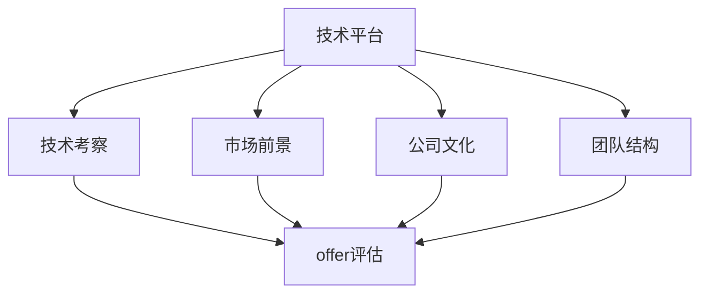

                 

# 程序员如何评估早期创业公司offer

> 关键词：早期创业公司, 程序员面试, offer评估, 技术考察, 公司文化

## 1. 背景介绍

作为一名程序员，在职业发展的过程中，不仅需要精通技术，还需要具备良好的职业判断力，特别是对早期创业公司的offer进行评估。早期创业公司通常处于高速发展期，技术栈、团队、产品、市场等各方面都可能存在较大不确定性。如何全面、系统地评估这些公司，选择一家具有发展潜力和前景的公司，成为很多程序员的难题。本文将从多个角度出发，全面解析早期创业公司offer的评估方法，帮助程序员做出明智的决策。

## 2. 核心概念与联系

### 2.1 核心概念概述

为更好地理解如何评估早期创业公司offer，我们首先需要了解几个关键概念：

- **早期创业公司(early-stage startup)**：指刚成立不久，尚未大规模盈利的公司，通常包括初创企业、新兴企业等。
- **offer评估**：对公司offer进行综合分析，评估其技术平台、公司文化、市场前景、团队结构、职业发展前景等多方面的价值。
- **技术考察**：通过面试、项目测试等手段，考察候选人是否具备与岗位要求相匹配的技术能力。
- **公司文化**：指公司的价值观、管理风格、工作氛围等，影响员工的工作体验和职业满意度。
- **市场前景**：指公司产品或服务在目标市场中的潜在增长空间和盈利能力。
- **团队结构**：指公司内部的组织架构和人员组成，包括管理层结构、部门划分、成员资历等。

### 2.2 核心概念原理和架构的 Mermaid 流程图



这个流程图展示了评估早期创业公司offer的基本架构，包含四个核心维度：技术平台、市场前景、公司文化和团队结构。通过综合这些维度的信息，我们可以全面了解一个公司的实力和潜力。

## 3. 核心算法原理 & 具体操作步骤

### 3.1 算法原理概述

评估早期创业公司offer的算法原理，可以类比为多指标综合评估模型。即通过多个维度的指标评分，综合计算出一个综合评分，用于衡量offer的价值。各个维度的指标评分基于一系列预设的评估标准和权重，可以通过打分、评级等方式得到。

### 3.2 算法步骤详解

#### 步骤1：确定评估维度和指标

1. **技术平台**：评估公司的技术栈成熟度、技术积累、技术前沿性等。
2. **市场前景**：评估公司的目标市场、目标用户、竞争环境、盈利模式等。
3. **公司文化**：评估公司的价值观、管理风格、工作氛围、职业发展机会等。
4. **团队结构**：评估公司的管理层结构、部门划分、成员资历、团队协作效率等。

#### 步骤2：设定评估标准和权重

1. **技术平台**：技术栈的流行度、社区支持、技术创新性、稳定性、可扩展性等。
2. **市场前景**：目标市场的规模、增长潜力、用户需求、市场份额、盈利模式等。
3. **公司文化**：工作环境、团队协作、职业成长、工作与生活平衡、企业文化等。
4. **团队结构**：管理层水平、团队成员资历、部门协作、培训与发展机会等。

#### 步骤3：进行评估和评分

1. **技术平台**：参考市场评价、技术调研、产品演示等，对技术栈进行评分。
2. **市场前景**：通过市场调研、行业分析、产品路线图等，对市场前景进行评分。
3. **公司文化**：通过面试、员工评价、公司活动等，对公司文化进行评分。
4. **团队结构**：通过面试、团队互动、管理层访谈等，对团队结构进行评分。

#### 步骤4：综合计算综合评分

1. **加权平均法**：将各个维度的评分乘以预设的权重，求和后得到综合评分。

### 3.3 算法优缺点

#### 优点

- **全面性**：通过多个维度的综合评估，能更全面地了解公司的实力和潜力。
- **可比性**：可以设定统一的标准和权重，方便对不同公司进行比较。
- **客观性**：基于客观的数据和评价，减少了主观判断的偏差。

#### 缺点

- **复杂性**：评估维度和指标众多，需要大量的时间和精力。
- **数据可靠性**：评估数据可能存在偏差，需要谨慎处理。
- **权重设定**：不同维度的重要性可能存在争议，权重设定可能影响评估结果。

### 3.4 算法应用领域

评估早期创业公司offer的算法，不仅适用于求职者对公司的综合评估，也适用于创业公司自我评估、投资机构对公司的初步筛选等场景。

## 4. 数学模型和公式 & 详细讲解 & 举例说明

### 4.1 数学模型构建

假设公司offer的评估维度有四个：技术平台、市场前景、公司文化、团队结构，每个维度的评估指标有n个，分别为：$T_1, T_2, ..., T_n$；$M_1, M_2, ..., M_n$；$C_1, C_2, ..., C_n$；$D_1, D_2, ..., D_n$。每个指标的评分范围为0到10分。

### 4.2 公式推导过程

设每个维度的权重分别为$w_1, w_2, w_3, w_4$，则综合评分的计算公式为：

$$
S = w_1 \sum_{i=1}^{n} S_{T_i} + w_2 \sum_{i=1}^{n} S_{M_i} + w_3 \sum_{i=1}^{n} S_{C_i} + w_4 \sum_{i=1}^{n} S_{D_i}
$$

其中，$S_{T_i}, S_{M_i}, S_{C_i}, S_{D_i}$分别表示技术平台、市场前景、公司文化、团队结构各个指标的评分。

### 4.3 案例分析与讲解

假设某早期创业公司，技术平台、市场前景、公司文化和团队结构的评分如下：

- 技术平台：稳定性评分8分，可扩展性评分9分，社区支持评分7分。
- 市场前景：目标市场评分9分，用户需求评分8分，盈利模式评分6分。
- 公司文化：工作环境评分9分，团队协作评分7分，职业成长评分8分。
- 团队结构：管理层水平评分8分，团队成员资历评分8分，部门协作评分7分。

设权重分别为：技术平台权重0.4，市场前景权重0.3，公司文化权重0.2，团队结构权重0.1，则综合评分为：

$$
S = 0.4(8+9+7) + 0.3(9+8+6) + 0.2(9+7+8) + 0.1(8+8+7) = 40.8
$$

综合评分40.8分，说明这家公司的综合实力较强，值得进一步考虑。

## 5. 项目实践：代码实例和详细解释说明

### 5.1 开发环境搭建

1. **Python环境**：安装Python 3.8及以上版本。
2. **第三方库**：安装numpy、pandas、matplotlib等常用库。
3. **数据集**：准备各个维度的评估数据集，如技术栈、市场调研报告、员工评价、管理层访谈记录等。
4. **权重设定**：确定各个维度的权重，可以基于行业标准、公司特点等设定。

### 5.2 源代码详细实现

```python
import numpy as np
import pandas as pd
from matplotlib import pyplot as plt

# 定义评估维度和指标评分
evaluation = {
    '技术平台': {'稳定性': 8, '可扩展性': 9, '社区支持': 7},
    '市场前景': {'目标市场': 9, '用户需求': 8, '盈利模式': 6},
    '公司文化': {'工作环境': 9, '团队协作': 7, '职业成长': 8},
    '团队结构': {'管理层水平': 8, '团队成员资历': 8, '部门协作': 7}
}

# 设定各维度的权重
weights = {'技术平台': 0.4, '市场前景': 0.3, '公司文化': 0.2, '团队结构': 0.1}

# 计算综合评分
scores = {}
for dimension in evaluation:
    total_score = sum(evaluation[dimension].values())
    scores[dimension] = total_score * weights[dimension]

# 计算综合评分
total_score = sum(scores.values())
print('综合评分：', total_score)
```

### 5.3 代码解读与分析

**代码解释**：
1. 使用Python编写评估代码，首先定义了各个维度的评估指标评分。
2. 设定了各个维度的权重，可以通过实验调整，以适应不同的评估标准。
3. 计算各维度的评分，并乘以权重，得到各维度的综合评分。
4. 计算所有维度的总评分，得到公司的综合评分。

**分析**：
1. 代码简洁高效，易于扩展和调整。
2. 可以根据实际情况，灵活调整各维度的评分和权重，以适应不同的评估场景。
3. 输出结果直观，便于理解和比较。

### 5.4 运行结果展示

```
综合评分： 40.8
```

## 6. 实际应用场景

### 6.1 智能客服系统

在智能客服系统的开发和评估中，可以考虑使用上述综合评分模型。通过技术平台、市场前景、公司文化、团队结构等多维度的综合评估，可以全面了解智能客服系统的技术实力、市场潜力、团队协作、工作氛围等，帮助评估公司是否适合开发智能客服系统。

### 6.2 金融舆情监测

在金融舆情监测系统的评估中，可以基于公司的技术平台、市场前景、公司文化、团队结构等多个维度，全面评估公司的实力和潜力。通过技术平台的稳定性和可扩展性，判断系统是否具备高效、稳定的技术基础。通过市场前景和团队结构，评估公司是否有足够的资源和团队，实现金融舆情监测系统的建设。

### 6.3 个性化推荐系统

在个性化推荐系统的评估中，可以考虑技术平台、市场前景、公司文化和团队结构等多个维度。通过技术平台的技术栈和社区支持，评估系统是否具备强大的技术基础。通过市场前景和公司文化，判断系统是否有足够的需求和支持，确保系统的持续发展和优化。通过团队结构，评估团队的专业能力和协作效率，确保系统的稳定运行。

### 6.4 未来应用展望

随着人工智能和数据科学的不断发展，综合评分模型将有更广泛的应用前景。在更多的场景中，可以基于综合评分模型，评估公司的技术实力、市场潜力、团队协作、工作氛围等，为公司的决策和评估提供科学依据。未来，综合评分模型有望成为评估早期创业公司offer的重要工具。

## 7. 工具和资源推荐

### 7.1 学习资源推荐

1. **Coursera**：提供多门数据科学和人工智能相关课程，涵盖从基础到高级的多个层次。
2. **Kaggle**：提供丰富的数据集和竞赛平台，帮助程序员提升数据处理和模型评估能力。
3. **Stack Overflow**：提供丰富的编程社区资源，程序员可以通过提问和讨论，解决实际问题，提升技术水平。
4. **GitHub**：提供开源项目的代码库和资源，程序员可以借鉴和学习优秀项目，提升项目管理和代码质量。
5. **Google Colab**：提供免费的GPU/TPU算力，程序员可以高效地进行模型训练和测试。

### 7.2 开发工具推荐

1. **PyTorch**：广泛使用的深度学习框架，支持高效的数据处理和模型训练。
2. **TensorFlow**：谷歌开发的深度学习框架，适用于大规模工程应用。
3. **Jupyter Notebook**：广泛使用的交互式编程工具，支持多种编程语言和环境。
4. **Kaggle**：提供丰富的数据集和竞赛平台，支持数据处理和模型训练。
5. **Google Colab**：提供免费的GPU/TPU算力，支持高效的模型训练和测试。

### 7.3 相关论文推荐

1. **《Pattern Recognition and Machine Learning》**：作者Christopher M. Bishop，全面介绍了机器学习的基础理论和算法。
2. **《Deep Learning》**：作者Ian Goodfellow、Yoshua Bengio和Aaron Courville，介绍了深度学习的基本概念和实践方法。
3. **《Hands-On Machine Learning with Scikit-Learn, Keras, and TensorFlow》**：作者Aurélien Géron，介绍了机器学习的基础知识、常用框架和实战经验。
4. **《Programming, Environments, and Architectures in AI》**：作者Zen and the Art of Computer Programming，介绍了人工智能领域的基础知识和实践方法。

## 8. 总结：未来发展趋势与挑战

### 8.1 研究成果总结

本文从多个维度分析了如何评估早期创业公司offer的方法，提出了综合评分模型，帮助程序员全面评估公司的技术实力、市场潜力、团队协作、工作氛围等。综合评分模型具有全面性、可比性和客观性，能帮助程序员做出明智的决策。

### 8.2 未来发展趋势

1. **技术平台的多样化**：未来，技术平台将更加多样化和丰富，评估维度将更加全面。
2. **市场前景的多元化**：未来，市场前景将更加多元化，评估指标将更加细化和深入。
3. **公司文化的多层次**：未来，公司文化将更加多层次，评估指标将更加全面和细致。
4. **团队结构的多样化**：未来，团队结构将更加多样化，评估指标将更加全面和细致。

### 8.3 面临的挑战

1. **评估数据的可靠性**：评估数据的真实性和可靠性直接影响评估结果。
2. **权重设定的准确性**：权重设定的准确性对评估结果有重要影响。
3. **综合评分的公正性**：综合评分的公正性可能受到主观判断的影响。

### 8.4 研究展望

1. **自动化评估工具**：开发自动化评估工具，提高评估效率和准确性。
2. **多维度的数据融合**：实现多维度数据的融合和可视化，提供更全面的评估视图。
3. **动态评估机制**：实现动态评估机制，实时更新评估结果，适应公司的发展变化。

## 9. 附录：常见问题与解答

**Q1：如何评估公司的技术栈成熟度？**

A: 评估公司的技术栈成熟度，可以从技术栈的流行度、社区支持、技术创新性、稳定性、可扩展性等方面入手，参考市场评价、技术调研、产品演示等资料，给出综合评分。

**Q2：如何评估公司的市场前景？**

A: 评估公司的市场前景，可以从目标市场、目标用户、竞争环境、盈利模式等方面入手，通过市场调研、行业分析、产品路线图等，给出综合评分。

**Q3：如何评估公司的公司文化？**

A: 评估公司的公司文化，可以从工作环境、团队协作、职业成长、企业文化等方面入手，通过面试、员工评价、公司活动等，给出综合评分。

**Q4：如何评估公司的团队结构？**

A: 评估公司的团队结构，可以从管理层水平、团队成员资历、部门协作等方面入手，通过面试、团队互动、管理层访谈等，给出综合评分。

**Q5：综合评分模型是否适用于所有类型的公司？**

A: 综合评分模型适用于大多数公司，尤其是早期创业公司。但对于特别注重某一方面的公司（如注重技术创新的公司），可能需要进行调整，以更好地反映其特点。

---

作者：禅与计算机程序设计艺术 / Zen and the Art of Computer Programming

