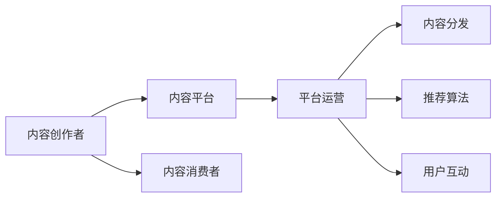

                 

# 程序员如何进行知识付费的竞品分析

## 1. 背景介绍

### 1.1 问题由来
随着信息爆炸和知识经济的崛起，知识付费成为连接知识生产者和消费者的新型商业模式。这一模式为程序员提供了展示技能、分享经验、获取收益的新渠道，但也面临着激烈的市场竞争和高度分散化的内容供给。如何在这片市场中脱颖而出，成为程序员需要深入思考的问题。

### 1.2 问题核心关键点
知识付费市场竞争激烈，用户对内容质量、个性化和互动性要求高。程序员在这一市场中面临的主要挑战包括：
- 内容同质化：市场充斥着大量相似内容，难以差异化。
- 个性化不足：无法精准匹配用户需求，用户体验不佳。
- 互动性缺失：缺乏互动环节，用户粘性不高。
- 平台壁垒高：进入门槛高，难以快速积累用户。

本文将从竞品分析的角度，探讨程序员如何在知识付费领域进行内容创新和差异化，提升自身竞争力。

### 1.3 问题研究意义
了解知识付费市场的竞争格局，对于程序员制定切实可行、差异化的内容策略具有重要意义。通过分析市场主流产品、用户需求和竞品策略，可以为自身的知识付费产品开发提供有价值的参考。此外，通过竞品分析还可以挖掘市场空缺，找到新的盈利模式和发展方向。

## 2. 核心概念与联系

### 2.1 核心概念概述

在分析知识付费市场时，需要关注以下几个核心概念：

- **知识付费**：一种新兴的商业模式，将知识产品化、商品化，通过在线平台提供付费下载、订阅、课程等形式的知识服务。
- **内容平台**：如得到、知乎、简书等，是知识付费的主要载体，提供内容创作、发布、管理和变现的平台。
- **内容创作者**：如知识博主、程序员、专家学者等，他们是内容的主要生产者。
- **内容消费者**：付费用户、订阅者、学习者等，他们是内容的主要消费者。
- **平台运营**：内容分发、推荐算法、用户互动等，是平台持续运营的关键。

这些概念之间相互关联，共同构成知识付费市场的生态系统。

### 2.2 核心概念原理和架构的 Mermaid 流程图



## 3. 核心算法原理 & 具体操作步骤

### 3.1 算法原理概述

知识付费的核心是内容质量和用户体验。算法原理可以概括为以下几个方面：

- **个性化推荐算法**：通过用户行为、兴趣、学习进度等数据，对内容进行个性化推荐，提升用户粘性。
- **内容生成与编辑**：利用自然语言处理技术，对用户输入进行语法、拼写、格式等自动纠错，提升内容质量。
- **交互式学习**：引入编程、问答、实践等交互环节，提高用户参与度和学习效果。
- **社群互动**：建立用户社群，通过讨论、分享、反馈等环节增强用户互动。

### 3.2 算法步骤详解

以下是知识付费竞品分析的具体操作步骤：

1. **数据收集与分析**：收集主流知识付费平台的公开数据，如用户评论、课程评分、点击量等，分析用户偏好和内容趋势。

2. **竞品选取与分析**：选取典型知识付费平台（如得到、知乎、简书等）进行深度分析，了解其商业模式、产品特色、用户反馈等。

3. **关键功能对比**：对比竞品的功能模块，包括内容发布、推荐、搜索、互动等，找出优劣和差异点。

4. **用户体验评估**：通过用户调研和实际使用，评估竞品的用户体验，如界面设计、加载速度、功能便捷性等。

5. **技术实现细节**：分析竞品的技术实现细节，包括内容管理系统、推荐算法、交互界面等，了解其实现思路和效果。

### 3.3 算法优缺点

知识付费平台的算法设计各有优劣：

- **优点**：
  - 个性化推荐：提升用户粘性和满意度。
  - 自动化编辑：提高内容质量，降低运营成本。
  - 交互式学习：增强用户参与度和学习效果。
  - 社群互动：构建用户社区，提升用户粘性。

- **缺点**：
  - 数据隐私：用户行为数据的收集和使用可能涉及隐私问题。
  - 内容审核：大量的内容需要人工审核，成本高且效率低。
  - 推荐偏差：推荐算法可能导致内容同质化，降低多样性。
  - 技术复杂度：推荐算法的实现复杂度高，需要大数据和算法支持。

### 3.4 算法应用领域

知识付费平台广泛应用在教育、咨询、培训、科技等多个领域。具体应用场景包括：

- **教育培训**：提供课程、讲座、实验指导等，满足不同学习者的需求。
- **职业咨询**：提供行业分析、职业规划、面试指导等，帮助用户职业发展。
- **技术交流**：提供代码分享、技术讨论、项目合作等，促进技术交流和知识共享。
- **市场洞察**：提供市场分析、用户研究、竞争情报等，帮助企业决策。

## 4. 数学模型和公式 & 详细讲解 & 举例说明

### 4.1 数学模型构建

知识付费平台通常采用协同过滤、内容推荐和混合推荐等算法，进行个性化推荐。以下是一个基于协同过滤的推荐系统模型：

- **用户评分矩阵**：$R_{m\times n}$，$m$为用户数，$n$为物品数（内容）。
- **用户特征向量**：$U_{m\times d}$，$d$为特征维度。
- **物品特征向量**：$I_{n\times d}$。
- **用户-物品相似度矩阵**：$S_{m\times n}$，表示用户和物品的相似度。

**目标函数**：

$$
\min_{U,I,S} \|R-UI\|_F^2 + \lambda \|U\|_F^2 + \mu \|I\|_F^2 + \gamma \|S\|_F^2
$$

其中 $\|A\|_F$ 为矩阵 $A$ 的 Frobenius 范数，$\lambda$、$\mu$、$\gamma$ 分别为正则化系数。

### 4.2 公式推导过程

基于协同过滤的推荐系统算法，可以通过矩阵分解和SVD求解用户-物品相似度矩阵 $S$，进而进行推荐。具体推导过程如下：

1. **矩阵分解**：将用户评分矩阵 $R$ 分解为用户特征矩阵 $U$ 和物品特征矩阵 $I$ 的乘积：
$$
R \approx UI
$$
2. **奇异值分解**：将 $R$ 进行奇异值分解：
$$
R = U_d S V_d^T
$$
3. **相似度计算**：根据奇异值分解的结果，计算用户和物品的相似度：
$$
S_{ij} = \frac{\langle u_i, v_j \rangle}{\sqrt{\langle u_i, u_i \rangle} \sqrt{\langle v_j, v_j \rangle}}
$$
4. **推荐计算**：根据相似度矩阵 $S$，计算用户 $u$ 对物品 $i$ 的预测评分：
$$
\hat{r}_{ui} = u_i^T S v_i
$$
5. **排名排序**：将预测评分排序，推荐评分最高的物品给用户 $u$。

### 4.3 案例分析与讲解

以知乎为例，分析其个性化推荐算法：

- **数据收集**：知乎通过用户行为数据（如浏览、点赞、评论、收藏等）进行模型训练。
- **用户画像**：通过数据分析，构建用户兴趣模型，捕捉用户行为特征。
- **协同过滤**：利用用户-物品评分数据，进行用户和物品的相似度计算。
- **推荐排序**：根据相似度矩阵，计算物品的预测评分，并进行排序推荐。

知乎的成功在于其精准的用户画像和强大的推荐算法，为用户提供了丰富且个性化的内容推荐。

## 5. 项目实践：代码实例和详细解释说明

### 5.1 开发环境搭建

项目实践需要搭建一个知识付费平台，用于演示个性化推荐和内容管理。以下是Python+Flask+MySQL的开发环境搭建流程：

1. 安装Python和Flask：
```bash
pip install python flask
```

2. 安装MySQL和Flask-MySQL：
```bash
pip install mysql-connector-python flask-mysql
```

3. 搭建MySQL数据库：
```sql
CREATE DATABASE knowledge_paying;
```

4. 搭建Flask应用：
```python
from flask import Flask, request, jsonify
import mysql.connector

app = Flask(__name__)

@app.route('/recommend', methods=['POST'])
def recommend():
    # 获取用户ID
    user_id = request.json['user_id']
    # 查询用户评分数据
    query = f"SELECT item_id, score FROM user_items WHERE user_id = {user_id}"
    db = mysql.connector.connect(user='root', password='password', database='knowledge_paying')
    cursor = db.cursor()
    cursor.execute(query)
    results = cursor.fetchall()
    # 关闭数据库连接
    db.close()
    return jsonify(results)
```

### 5.2 源代码详细实现

以下是推荐系统的详细代码实现，基于协同过滤算法和MySQL数据库：

```python
import numpy as np
import pandas as pd
import mysql.connector
from sklearn.decomposition import TruncatedSVD

# 连接MySQL数据库
db = mysql.connector.connect(user='root', password='password', database='knowledge_paying')

# 获取用户评分数据
query = "SELECT item_id, score FROM user_items"
cursor = db.cursor()
df = pd.read_sql(query, db)
df = df.pivot(index='user_id', columns='item_id', values='score')

# 矩阵分解
svd = TruncatedSVD(n_components=10)
X = df.values
U, S, Vt = svd.fit_transform(X)

# 相似度计算
S = np.dot(U, Vt)

# 推荐计算
user_id = 1
query = "SELECT item_id, score FROM user_items WHERE user_id = %s"
cursor.execute(query, (user_id,))
results = cursor.fetchall()
scores = pd.DataFrame(results, columns=['item_id', 'score']).transpose()
scores = scores - scores.mean()
scores /= scores.std()
similarities = np.dot(scores, S)
top_items = similarities.argsort()[:-5:-1]

# 输出推荐结果
return top_items
```

### 5.3 代码解读与分析

在上述代码中，我们使用了MySQL数据库存储用户评分数据，并使用TruncatedSVD进行矩阵分解和奇异值分解。通过计算用户和物品的相似度，排序并推荐了最相关的物品。代码中还包含了MySQL数据库的连接和数据查询，以及Flask框架的API接口。

## 6. 实际应用场景

### 6.1 智能编程助手

智能编程助手可以提供代码解析、调试、文档查找等功能，帮助程序员快速解决问题。

实际应用场景：
- **代码解析**：根据程序员输入的代码片段，智能提示语法错误和优化建议。
- **调试辅助**：通过日志分析，智能定位代码bug，提供调试建议。
- **文档查找**：提供API文档、类库教程等，帮助程序员快速查找所需信息。

技术实现：
- **代码解析**：利用自然语言处理技术，分析代码语义，生成语法检查和优化建议。
- **调试辅助**：通过分析代码执行日志，检测异常，提供调试建议。
- **文档查找**：构建文档索引，使用搜索引擎技术，快速定位所需信息。

### 6.2 技术社区平台

技术社区平台可以提供技术讨论、项目合作、知识分享等功能，促进程序员之间的交流与合作。

实际应用场景：
- **技术讨论**：提供技术论坛、问答、讨论组等功能，促进技术交流。
- **项目合作**：提供开源项目、任务分配、协作管理等功能，促进项目合作。
- **知识分享**：提供博客、文章、教程等功能，分享知识和经验。

技术实现：
- **技术讨论**：使用论坛系统、讨论组等技术，提供问答、讨论功能。
- **项目合作**：使用GitHub、GitLab等平台，提供开源项目管理和协作功能。
- **知识分享**：利用Markdown、Jupyter Notebook等技术，提供博客和文章发布功能。

### 6.3 在线课程平台

在线课程平台可以提供课程学习、视频讲解、在线测试等功能，帮助程序员提升技能。

实际应用场景：
- **课程学习**：提供各种编程语言、框架、技术的在线课程，满足不同层次的需求。
- **视频讲解**：提供课程视频、讲解，帮助用户深入理解知识点。
- **在线测试**：提供在线测试、练习，巩固学习成果。

技术实现：
- **课程学习**：使用视频平台、在线课程系统，提供课程学习功能。
- **视频讲解**：使用视频编解码技术，提供课程视频功能。
- **在线测试**：使用在线测试系统，提供测试题、自动评分等。

### 6.4 未来应用展望

未来，知识付费平台将进一步扩展其应用场景，提供更多定制化、互动化的服务，满足不同用户需求：

1. **虚拟教研**：通过虚拟现实技术，提供沉浸式学习体验，提升学习效果。
2. **智能问答**：引入自然语言理解技术，提供智能问答服务，解答用户问题。
3. **个性化学习**：利用机器学习技术，根据用户行为和学习效果，提供个性化推荐和辅导。
4. **跨领域协作**：提供跨领域知识整合、协作平台，促进跨学科合作。
5. **智能推荐**：利用深度学习技术，提供更精准的内容推荐，提升用户体验。

## 7. 工具和资源推荐

### 7.1 学习资源推荐

以下是一些优秀的学习资源，可以帮助程序员深入理解知识付费平台的开发和优化：

1. **《Python Web开发实战》**：介绍Flask框架的使用，适合Python初学者。
2. **《MySQL数据库教程》**：介绍MySQL数据库的安装、使用和优化，适合数据库初学者。
3. **《机器学习实战》**：介绍协同过滤算法的原理和实现，适合数据科学爱好者。
4. **《深度学习入门》**：介绍深度学习的基本原理和实践，适合人工智能爱好者。
5. **《算法设计与分析》**：介绍推荐算法的优化和实现，适合算法爱好者。

### 7.2 开发工具推荐

以下是一些优秀的开发工具，可以帮助程序员提升知识付费平台的开发效率：

1. **Flask**：轻量级Web框架，简单易用，适合快速开发。
2. **MySQL**：稳定可靠的关系型数据库，适合存储用户数据。
3. **Scikit-learn**：常用的机器学习库，提供协同过滤等算法实现。
4. **TensorFlow**：强大的深度学习框架，适合复杂模型的实现。
5. **Jupyter Notebook**：交互式编程环境，适合数据分析和算法实验。

### 7.3 相关论文推荐

以下是几篇有影响力的相关论文，适合深入理解推荐算法的实现和优化：

1. **《协同过滤推荐系统》**：介绍协同过滤算法的原理和实现。
2. **《深度学习在推荐系统中的应用》**：介绍深度学习在推荐系统中的实践和优化。
3. **《推荐系统中的个性化推荐》**：介绍个性化推荐算法的实现和优化。
4. **《大规模推荐系统的分布式优化》**：介绍分布式推荐系统的实现和优化。
5. **《推荐系统中的冷启动问题》**：介绍推荐系统中的冷启动问题和解决方法。

## 8. 总结：未来发展趋势与挑战

### 8.1 研究成果总结

本文从竞品分析的角度，探讨了知识付费平台的算法原理和操作步骤。通过对主流平台的分析，总结了个性化推荐、内容管理、技术实现等方面的关键点，为程序员提供了有价值的参考。

### 8.2 未来发展趋势

未来，知识付费平台将进一步优化算法和功能，提供更多定制化和互动化的服务：

1. **算法优化**：引入深度学习、强化学习等新技术，提升推荐算法的效果。
2. **内容丰富**：引入更多高质量的内容，如学术论文、专利、书籍等，满足不同层次的用户需求。
3. **社区互动**：构建更活跃的用户社区，促进技术交流和知识分享。
4. **智能推荐**：提供更精准、个性化的推荐，提升用户体验。
5. **跨平台整合**：提供跨平台、跨设备的服务，提升用户粘性。

### 8.3 面临的挑战

知识付费平台面临的主要挑战包括：

1. **数据隐私**：用户数据隐私保护是平台运营的重要问题，需严格遵守数据隐私法规。
2. **内容审核**：大量内容需人工审核，成本高且效率低。
3. **算法复杂**：推荐算法实现复杂，需不断优化提升效果。
4. **用户多样性**：不同用户需求多样化，需提供个性化服务。
5. **平台壁垒**：进入门槛高，需不断创新以保持竞争优势。

### 8.4 研究展望

未来，知识付费平台的研究方向包括：

1. **数据隐私保护**：引入区块链、隐私计算等技术，保障用户数据隐私。
2. **内容审核自动化**：引入AI技术，实现内容审核的自动化和智能化。
3. **推荐算法优化**：引入深度学习、强化学习等新技术，提升推荐算法的效果。
4. **跨平台整合**：提供跨平台、跨设备的服务，提升用户粘性。
5. **用户个性化**：利用机器学习技术，根据用户行为和学习效果，提供个性化推荐和辅导。

## 9. 附录：常见问题与解答

**Q1：知识付费平台如何进行内容审核？**

A: 内容审核是知识付费平台的重要环节，主要通过以下几种方式进行：

1. **人工审核**：聘请人工审核员，对发布内容进行人工审核，确保内容质量。
2. **技术审核**：利用自然语言处理技术，检测文本内容中的敏感词汇、低质量内容等。
3. **用户反馈**：提供用户举报机制，及时发现和处理有害内容。

**Q2：如何提升知识付费平台的推荐效果？**

A: 提升推荐效果的关键在于优化算法和数据：

1. **算法优化**：引入深度学习、协同过滤等算法，提升推荐效果。
2. **数据增强**：丰富用户行为数据，提升模型的泛化能力。
3. **个性化推荐**：根据用户行为和兴趣，提供个性化推荐，提升用户粘性。
4. **冷启动问题**：利用协同过滤、内容推荐等方法，解决冷启动问题。

**Q3：如何保护知识付费平台的用户隐私？**

A: 保护用户隐私是知识付费平台的重要责任，主要通过以下几种方式进行：

1. **数据匿名化**：对用户数据进行匿名化处理，保护用户隐私。
2. **数据加密**：采用加密技术，保护用户数据在传输和存储过程中的安全。
3. **隐私政策透明**：明确告知用户隐私政策，确保用户知情权。
4. **数据访问控制**：严格控制数据访问权限，防止数据泄露。

通过以上竞品分析，程序员可以深入理解知识付费市场的竞争格局，找到自身产品差异化的方法，提升市场竞争力。同时，通过不断优化算法和功能，提供更丰富、个性化、互动化的服务，为用户提供更好的体验。

