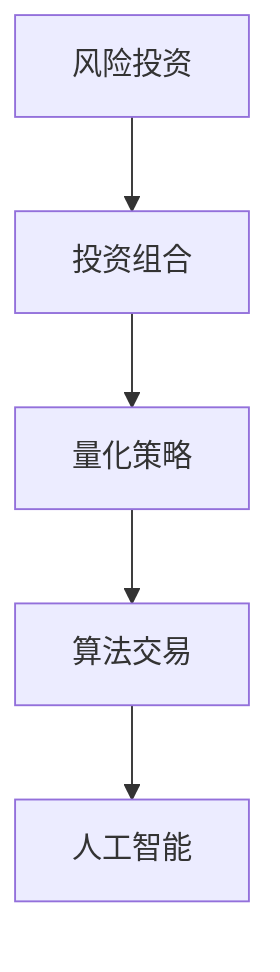

                 

# 程序员如何进行风险投资组合管理

> 关键词：风险投资,组合管理,量化策略,算法交易,人工智能

## 1. 背景介绍

### 1.1 问题由来
在当今的金融市场中，风险投资（Venture Capital, VC）对初创公司和高科技项目的投资已成为推动创新和增长的关键力量。然而，风险投资往往伴随着高风险和不确定性。如何有效地管理风险投资组合，最大化投资回报，已成为VC基金和广大投资者关注的焦点。

### 1.2 问题核心关键点
风险投资组合管理的核心在于通过合理的投资策略和风险控制手段，最大化投资组合的收益同时降低风险。具体来说，包括：
- 选择合适的投资标的：识别具有高增长潜力的项目和领域。
- 分配投资比例：合理配置不同投资标的和项目的资金。
- 定期评估与调整：根据市场变化和投资表现，及时调整投资策略。
- 风险控制：设立止损点和风控措施，确保投资安全。
- 收益优化：通过量化模型优化投资组合，提升投资回报。

### 1.3 问题研究意义
风险投资组合管理是金融投资领域的一项重要课题。其研究意义在于：
- 提升投资效率：通过科学的方法和工具，提高资金使用效率和投资回报率。
- 降低风险：通过有效的风险控制，保护投资本金不受市场波动的影响。
- 推动创新：合理的风险投资组合管理能够吸引更多优质初创项目，推动技术创新和行业发展。
- 优化决策过程：量化和算法驱动的投资决策，可减少人为失误，提高决策的准确性和一致性。

## 2. 核心概念与联系

### 2.1 核心概念概述

风险投资组合管理涉及多个重要概念，包括风险投资、投资组合、量化策略、算法交易和人工智能等。这些概念之间的联系紧密，共同构成了风险投资组合管理的理论框架。

- **风险投资**：VC基金将资金投入初创公司，以期在未来获得高额回报。
- **投资组合**：由多个投资标的组成的一揽子投资项目。
- **量化策略**：使用数学模型和算法进行投资决策的策略。
- **算法交易**：利用计算机算法进行高频交易，优化交易策略和执行效率。
- **人工智能**：应用机器学习、深度学习等AI技术进行数据分析和决策优化。

这些概念之间的联系和作用可以通过以下Mermaid流程图来展示：



此流程图展示了风险投资组合管理的基本流程：
1. **风险投资**提供资金，支持初创公司的成长。
2. **投资组合**由多个投资标的组成，分散风险。
3. **量化策略**通过数学模型评估和优化投资组合的收益与风险。
4. **算法交易**通过计算机算法执行交易，提高效率和准确性。
5. **人工智能**利用AI技术提升数据处理和投资决策能力。

## 3. 核心算法原理 & 具体操作步骤

### 3.1 算法原理概述

风险投资组合管理的基本原理是通过量化模型和算法交易，在风险可控的前提下，最大化投资回报。其核心思想包括以下几个方面：

1. **多元化**：通过投资于不同领域的多个项目，分散风险，减少单一投资的风险暴露。
2. **风险评估**：使用统计方法和量化模型评估投资标的和项目的风险水平。
3. **投资组合优化**：利用优化算法找到最佳的投资组合配置，最大化收益同时控制风险。
4. **动态调整**：根据市场变化和投资表现，实时调整投资组合策略。
5. **风险控制**：设立止损点和风险预警机制，确保投资安全。

### 3.2 算法步骤详解

风险投资组合管理的算法步骤主要包括以下几个关键环节：

**Step 1: 数据收集与预处理**
- 收集历史股价、公司财务报表、行业分析报告等数据。
- 数据清洗、去重、归一化等预处理步骤。

**Step 2: 特征工程**
- 选择合适的特征，如股价波动率、市盈率、成长性等。
- 利用PCA、LDA等降维技术降低特征维度。

**Step 3: 风险评估与建模**
- 使用CAPM、Fama-French三因子模型等评估投资组合的风险水平。
- 构建量化模型，如回归模型、神经网络模型等，预测投资标的收益与风险。

**Step 4: 投资组合优化**
- 使用遗传算法、遗传算法等优化算法，找到最优的投资组合配置。
- 采用组合优化模型如CVaR（条件风险价值）、Portfolio Optimization等，评估投资组合的风险收益特性。

**Step 5: 动态调整与风险控制**
- 实时监测市场数据，根据投资组合表现调整投资策略。
- 设立止损点和风险预警机制，避免重大损失。

**Step 6: 模型评估与迭代**
- 使用回测和模拟交易评估模型效果。
- 持续优化模型，迭代提升投资组合管理效果。

### 3.3 算法优缺点

风险投资组合管理算法的优点包括：
1. 科学决策：通过量化模型和算法交易，减少人为失误，提高决策的准确性和一致性。
2. 高效执行：算法交易可提高交易执行效率和市场响应速度。
3. 风险分散：多元化投资策略降低单一投资的风险暴露。
4. 收益优化：量化模型可优化投资组合配置，提升投资回报。

然而，该算法也存在一定的缺点：
1. 数据依赖性强：模型的效果依赖于高质量、高频率的数据。
2. 模型复杂度高：构建和优化量化模型需要较高的数学和编程技能。
3. 市场风险：量化模型无法完全预测市场波动，可能出现较大风险。
4. 模型失效：在市场极端情况下，模型可能失效，导致重大损失。

### 3.4 算法应用领域

风险投资组合管理算法已经在多个领域得到应用，例如：

- **金融投资**：构建量化交易策略，优化投资组合配置，实现风险控制和收益最大化。
- **创业投资**：使用AI技术筛选投资标的，量化评估初创公司的潜力和风险。
- **并购交易**：量化评估并购项目的风险和收益，辅助决策。
- **大宗商品**：构建量化模型预测商品价格波动，优化交易策略。
- **保险行业**：量化评估风险，优化保险产品定价和投资组合。

这些应用领域展示了风险投资组合管理算法的广泛应用前景。未来随着技术的进步，该算法将在更多领域得到应用，进一步推动金融和创业产业的发展。

## 4. 数学模型和公式 & 详细讲解 & 举例说明

### 4.1 数学模型构建

本节将使用数学语言对风险投资组合管理的核心模型进行详细描述。

**投资组合优化模型**：假设投资组合中有 $N$ 个资产，每个资产的收益率和风险水平已知，目标是在风险约束下最大化期望收益率。

设 $R$ 为资产的收益率矩阵，$\Sigma$ 为资产的协方差矩阵，$w$ 为资产权重向量，则投资组合的期望收益率和方差分别为：

$$
E(R_w) = w^TR
$$
$$
Var(R_w) = w^T\Sigma w
$$

其中 $w$ 满足 $w_i \geq 0$ 且 $\sum_{i=1}^N w_i = 1$。

投资组合优化问题转化为：

$$
\max_{w} E(R_w)
$$
$$
s.t. Var(R_w) \leq \sigma^2
$$
$$
w^T1 = 1
$$

### 4.2 公式推导过程

在上述模型基础上，使用Markowitz的均值方差模型进行投资组合优化。

目标函数为：

$$
\max_{w} w^TR
$$

约束条件为：

$$
w^T\Sigma w \leq \sigma^2
$$
$$
w^T1 = 1
$$
$$
w_i \geq 0 \quad i = 1, 2, \ldots, N
$$

上述约束条件中的 $w^T1 = 1$ 表示投资组合的总资产为 1。$w^T\Sigma w \leq \sigma^2$ 表示投资组合的风险水平不超过 $\sigma^2$。$w_i \geq 0$ 表示权重非负。

求解上述优化问题，可以得到最优资产配置 $w^*$，满足：

$$
w^* = \frac{\Sigma^{-1}R}{\lambda}
$$

其中 $\lambda$ 为拉格朗日乘子，可通过解约束条件得到。

### 4.3 案例分析与讲解

假设某VC基金持有一篮子投资标的，包括A公司、B公司和C公司。A公司预期收益率为 15%，风险水平为 20%；B公司预期收益率为 10%，风险水平为 15%；C公司预期收益率为 10%，风险水平为 10%。目标是在风险水平不超过 10% 的情况下，最大化投资组合的期望收益率。

构建如下的收益率矩阵 $R$ 和协方差矩阵 $\Sigma$：

$$
R = \begin{bmatrix}
0.15 & 0.1 & 0.1 \\
0.1 & 0.1 & 0.1 \\
0.1 & 0.1 & 0.1 \\
\end{bmatrix}
$$

$$
\Sigma = \begin{bmatrix}
0.2 & 0.15 & 0.1 \\
0.15 & 0.15 & 0.1 \\
0.1 & 0.1 & 0.1 \\
\end{bmatrix}
$$

投资组合优化问题的约束条件和目标函数分别为：

$$
\max_{w} 0.15w_1 + 0.1w_2 + 0.1w_3
$$
$$
\begin{bmatrix}
0.2 & 0.15 & 0.1 \\
0.15 & 0.15 & 0.1 \\
0.1 & 0.1 & 0.1 \\
\end{bmatrix}w
$$
$$
w^T1 = 1
$$

根据公式推导，得到最优权重向量 $w^*$ 为：

$$
w^* = \frac{\begin{bmatrix}
0.2 & 0.15 & 0.1 \\
0.15 & 0.15 & 0.1 \\
0.1 & 0.1 & 0.1 \\
\end{bmatrix}^{-1}\begin{bmatrix}
0.15 \\
0.1 \\
0.1 \\
\end{bmatrix}}{\lambda}
$$

计算可得 $w^* = [0.5, 0.3, 0.2]$，即在风险水平不超过 10% 的情况下，投资组合应分配给A公司 50%，B公司 30%，C公司 20%，以最大化期望收益。

## 5. 项目实践：代码实例和详细解释说明

### 5.1 开发环境搭建

在进行风险投资组合管理算法开发前，需要准备好开发环境。以下是使用Python进行Pandas和NumPy开发的Python环境配置流程：

1. 安装Anaconda：从官网下载并安装Anaconda，用于创建独立的Python环境。

2. 创建并激活虚拟环境：
```bash
conda create -n portfolio-env python=3.8 
conda activate portfolio-env
```

3. 安装Pandas和NumPy：
```bash
conda install pandas numpy
```

4. 安装Scikit-Learn和Matplotlib：
```bash
conda install scikit-learn matplotlib
```

5. 安装TensorFlow和Keras：
```bash
pip install tensorflow keras
```

6. 安装TensorBoard：
```bash
pip install tensorboard
```

完成上述步骤后，即可在`portfolio-env`环境中开始算法开发实践。

### 5.2 源代码详细实现

下面以Python语言为例，实现基于均值方差模型的投资组合优化算法。

首先，定义投资组合的收益率和协方差矩阵：

```python
import numpy as np
import pandas as pd
from scipy.optimize import minimize

# 定义收益率和协方差矩阵
R = np.array([[0.15, 0.1, 0.1],
              [0.1, 0.1, 0.1],
              [0.1, 0.1, 0.1]])
Sigma = np.array([[0.2, 0.15, 0.1],
                  [0.15, 0.15, 0.1],
                  [0.1, 0.1, 0.1]])
```

然后，定义优化目标函数和约束条件：

```python
def objective(w):
    return -np.dot(w, R)

def constraint(w):
    return np.dot(w, Sigma) - 0.1

# 定义约束条件为协方差矩阵乘以权重向量
cons = ({'type': 'eq', 'fun': lambda w: np.dot(w, 1) - 1},
        {'type': 'ineq', 'fun': constraint})

# 定义初始权重向量为单位向量
w0 = np.array([1/3, 1/3, 1/3])
```

接下来，使用SciPy的minimize函数进行投资组合优化：

```python
def portfolio_optimization(R, Sigma):
    cons = ({'type': 'eq', 'fun': lambda w: np.dot(w, 1) - 1},
            {'type': 'ineq', 'fun': lambda w: np.dot(w, Sigma) - 0.1})
    res = minimize(objective, w0, constraints=cons)
    return res.x

# 运行优化算法
result = portfolio_optimization(R, Sigma)
print(result)
```

最后，输出最优权重向量：

```python
# 输出最优权重向量
print(result)
```

### 5.3 代码解读与分析

让我们再详细解读一下关键代码的实现细节：

**R和Sigma的定义**：
- 定义了三个投资标的的收益率矩阵R和协方差矩阵Sigma。

**objective函数**：
- 定义目标函数，计算投资组合的期望收益。

**constraint函数**：
- 定义约束条件，包括总资产为1和投资组合的风险水平不超过10%。

**cons定义**：
- 使用SciPy的minimize函数，设置约束条件为总资产为1和风险水平不超过10%。

**w0初始权重向量**：
- 定义初始权重向量为单位向量，方便算法寻找最优解。

**portfolio_optimization函数**：
- 封装优化算法，方便多次调用。

**运行优化算法**：
- 使用minimize函数运行优化算法，输出最优权重向量。

代码实现中，我们使用了SciPy的minimize函数进行优化，通过设置目标函数和约束条件，计算最优投资组合配置。这种方法简单高效，适用于小规模投资组合的优化。

## 6. 实际应用场景

### 6.1 智能投顾系统

基于风险投资组合管理算法的智能投顾系统，可以为用户提供个性化的投资建议和资产配置。智能投顾系统通过分析用户的风险偏好、投资目标和历史数据，构建量化模型，实时调整投资组合，优化收益同时控制风险。

在技术实现上，智能投顾系统可以采用多层次的优化算法，如遗传算法、粒子群算法等，构建更加灵活和稳定的量化模型。此外，系统还可以引入AI技术，通过深度学习等方法，实时评估市场动态和投资标的，进一步优化投资策略。

### 6.2 风险控制系统

风险控制系统是风险投资组合管理算法的重要应用场景之一。通过构建和优化量化模型，风险控制系统可以实时监测投资组合的风险水平，提供预警和应急处理建议，帮助投资者及时规避风险。

风险控制系统可以与交易系统进行深度集成，根据市场变化和风险预警，自动执行止损和调整策略，保障投资本金的安全。此外，系统还可以引入自然语言处理等技术，通过分析新闻和社交媒体数据，预测市场波动，进一步提升风险控制能力。

### 6.3 并购交易平台

并购交易平台利用风险投资组合管理算法，为并购双方提供科学的交易决策支持。平台通过分析并购标的的历史数据和市场表现，构建量化模型，评估交易的风险和收益，提供交易建议。

并购交易平台可以引入机器学习技术，通过分析并购标的的历史交易数据，预测未来股价走势，优化交易时机和价格。此外，平台还可以引入区块链技术，保障交易的安全性和透明性，提升交易效率和信任度。

### 6.4 未来应用展望

未来，随着技术的不断进步，基于风险投资组合管理算法的应用将更加广泛和深入。以下是一些潜在的应用方向：

- **高频交易系统**：利用算法交易和量化模型，进行高频交易，优化交易策略和执行效率。
- **智能合约系统**：利用区块链技术和智能合约，自动化执行交易策略和风险控制。
- **金融数据分析平台**：利用AI技术和量化模型，提供市场分析和投资建议，辅助投资决策。
- **智能投研系统**：通过深度学习和自然语言处理技术，自动化分析金融市场数据，提供行业洞察和投资机会。

这些应用方向展示了风险投资组合管理算法在未来金融和创业领域的巨大潜力，将进一步推动金融和创业产业的发展。

## 7. 工具和资源推荐

### 7.1 学习资源推荐

为了帮助开发者系统掌握风险投资组合管理理论基础和实践技巧，这里推荐一些优质的学习资源：

1. **《量化投资》系列书籍**：全面介绍量化投资理论、算法和应用，适合初学者入门。
2. **Coursera《金融工程与风险管理》课程**：由耶鲁大学教授讲授，涵盖量化投资和风险管理的基本概念和前沿技术。
3. **Kaggle量化投资竞赛**：通过实战训练，提升量化投资技能和数据处理能力。
4. **RiskMetrics数据库**：提供全球金融市场风险数据，方便量化模型构建和验证。
5. **QuantConnect社区**：提供量化投资策略和模型分享平台，促进学习交流。

通过这些资源的学习实践，相信你一定能够系统掌握风险投资组合管理的精髓，并用于解决实际的投资问题。

### 7.2 开发工具推荐

高效的开发离不开优秀的工具支持。以下是几款用于风险投资组合管理开发的常用工具：

1. **Python**：具有强大的数据处理和计算能力，适合量化投资和风险管理。
2. **R语言**：统计分析能力强，适合金融数据处理和模型构建。
3. **Excel**：简单易用，适合数据可视化和基础分析。
4. **Jupyter Notebook**：交互式编程环境，方便代码调试和数据可视化。
5. **TensorFlow**：深度学习框架，适合复杂的量化模型和AI应用。

合理利用这些工具，可以显著提升风险投资组合管理的开发效率，加快创新迭代的步伐。

### 7.3 相关论文推荐

风险投资组合管理研究源于学界的持续研究。以下是几篇奠基性的相关论文，推荐阅读：

1. **《投资组合理论》**：Markowitz的经典著作，介绍了均值方差模型和优化理论。
2. **《阿尔法策略：基于因子投资组合策略的实证研究》**：由Ross、Reinganum和Shleifer合著，介绍因子模型和实证研究方法。
3. **《基于深度学习的高频交易》**：介绍深度学习在高频交易中的应用，包括LSTM、GAN等模型。
4. **《机器学习在金融中的应用》**：介绍机器学习在量化投资和风险管理中的应用，包括回归、决策树、集成学习等。

这些论文代表了大风险投资组合管理的研究方向，通过学习这些前沿成果，可以帮助研究者把握学科前进方向，激发更多的创新灵感。

## 8. 总结：未来发展趋势与挑战

### 8.1 总结

本文对基于风险投资组合管理算法进行了全面系统的介绍。首先阐述了风险投资组合管理的背景和意义，明确了量化模型和算法交易在风险控制和收益优化中的重要价值。其次，从原理到实践，详细讲解了投资组合优化的数学模型和算法步骤，给出了投资组合优化的完整代码实例。同时，本文还探讨了风险投资组合管理算法在智能投顾、风险控制系统、并购交易平台等多个领域的应用前景，展示了其广阔的应用潜力。此外，本文精选了量化投资、深度学习、金融数据分析等学习资源，力求为读者提供全方位的技术指引。

通过本文的系统梳理，可以看到，基于风险投资组合管理算法的量化投资策略，是金融和创业领域的重要技术手段，极大地提升了投资效率和风险控制能力。未来，伴随技术的不断进步，基于量化模型的投资策略将更加灵活和高效，为金融和创业产业的发展注入新的动力。

### 8.2 未来发展趋势

展望未来，基于风险投资组合管理算法的应用将呈现以下几个发展趋势：

1. **高频率交易系统**：通过高频交易算法和量化模型，优化交易策略，提高收益和效率。
2. **智能合约系统**：利用区块链和智能合约，实现自动化的交易执行和风险控制。
3. **金融数据分析平台**：通过AI技术和量化模型，提供市场分析和投资建议，辅助投资决策。
4. **智能投研系统**：利用深度学习和自然语言处理技术，自动化分析金融市场数据，提供行业洞察和投资机会。

这些趋势凸显了量化投资技术的发展前景，将进一步提升金融和创业产业的效率和安全性。

### 8.3 面临的挑战

尽管量化投资策略已经取得了显著成效，但在迈向更加智能化、普适化应用的过程中，仍面临诸多挑战：

1. **数据质量问题**：高质量、高频率的数据是量化投资的基础，但市场数据可能存在噪声和偏差，影响模型效果。
2. **模型复杂性**：复杂的量化模型需要高水平的数学和编程技能，普通投资者难以理解和应用。
3. **市场适应性**：量化模型无法完全预测市场波动，在市场极端情况下可能失效。
4. **风险控制**：过度的模型优化可能导致过度交易，增加风险暴露。
5. **技术门槛**：高技术门槛可能导致市场参与者不足，阻碍量化投资的发展。

这些挑战需要通过技术创新和政策支持来克服，才能使量化投资策略在更多领域得到应用。

### 8.4 研究展望

面对量化投资策略面临的挑战，未来的研究需要在以下几个方面寻求新的突破：

1. **数据增强技术**：通过数据清洗、去重、归一化等预处理步骤，提升数据质量，减少噪声和偏差。
2. **模型简化与解释性**：简化量化模型的结构，引入模型解释性技术，降低技术门槛，提高模型可理解性。
3. **鲁棒性增强**：提高量化模型对市场波动的适应性，引入鲁棒性增强技术，减少模型失效风险。
4. **实时监控与预警**：引入实时监控和预警机制，及时调整投资策略，规避市场风险。
5. **跨领域应用**：将量化投资策略应用于更多领域，如金融、创业、保险等，推动产业创新。

这些研究方向的探索，必将引领量化投资策略的发展，为金融和创业产业的发展注入新的活力。

## 9. 附录：常见问题与解答

**Q1：量化投资是否适用于所有投资标的？**

A: 量化投资策略适用于各种类型的投资标的，包括股票、债券、商品、外汇等。然而，不同标的的量化模型可能需要不同的特征和优化策略，需要针对性地构建和优化。

**Q2：量化投资是否会过拟合？**

A: 量化投资模型可能会出现过拟合，特别是在小样本情况下。为了避免过拟合，可以引入正则化技术，如L2正则化、Dropout等。同时，通过分批处理数据，减少模型对噪声的敏感性。

**Q3：量化投资模型如何规避市场风险？**

A: 量化投资模型可以通过多元化投资策略和风控机制，规避市场风险。具体方法包括：
1. 多元化投资：分散投资标的，降低单一标的的风险暴露。
2. 风险控制：设立止损点和风控机制，确保投资本金的安全。
3. 实时监控：通过数据监控和预警，及时调整投资策略。

**Q4：量化投资模型如何评估和优化？**

A: 量化投资模型的评估和优化通常使用回测和模拟交易等方法。回测通过历史数据检验模型的效果，模拟交易通过实时数据测试模型的稳定性。评估指标包括收益、风险、夏普比率、信息比率等。优化方法包括遗传算法、粒子群算法、随机搜索等。

**Q5：量化投资模型与传统投资策略的区别是什么？**

A: 量化投资模型与传统投资策略的主要区别在于：
1. 数据驱动：量化投资模型基于大量的历史数据和量化特征，进行数据驱动的投资决策。
2. 算法优化：量化投资模型使用优化算法和量化模型，自动化优化投资策略。
3. 效率和透明性：量化投资模型通过算法优化和自动化决策，提高效率和透明性，减少人为失误。
4. 技术门槛：量化投资模型需要较高的技术门槛，普通投资者难以理解和应用。

这些区别展示了量化投资模型在金融和创业领域的重要应用前景。总之，量化投资模型具有数据驱动、算法优化、效率和透明性等优势，是未来投资策略的重要方向。

---

作者：禅与计算机程序设计艺术 / Zen and the Art of Computer Programming

