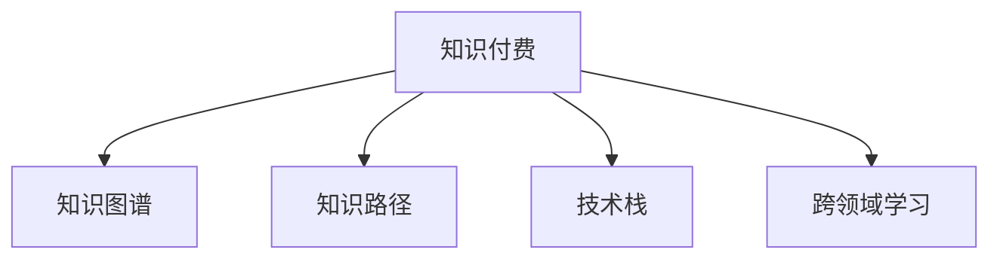

                 

# 程序员如何选择适合自己的知识付费方向

## 1. 背景介绍

在技术快速发展的今天，知识付费成为程序员获取新知识、提升技术能力的重要途径。然而，琳琅满目的知识付费产品让许多程序员难以选择。如何选择适合自己的知识付费方向，成为了一个关键问题。本文将系统阐述程序员在知识付费选择上的几个核心考虑因素，以帮助程序员找到最适合自己的学习方向。

## 2. 核心概念与联系

### 2.1 核心概念概述

在讨论如何选择适合自己的知识付费方向之前，首先需要了解几个核心概念：

- **知识付费**：指通过付费获取新知识、技能或技术的服务。通常包括在线课程、培训、电子书、技术文章等形式。
- **知识图谱**：指将各种知识领域间的关联通过节点和边进行结构化的表示。
- **知识路径**：指从已知领域出发，通过相关知识领域的学习和探索，最终到达目标领域的知识旅程。
- **技术栈**：指程序员掌握的不同编程语言、框架、工具等技术组合。
- **跨领域学习**：指程序员跨出原本技术栈，学习新的领域知识，以拓宽技能面。

这些概念之间的联系可以通过以下Mermaid流程图展示：



该图展示了知识付费与知识图谱、知识路径、技术栈、跨领域学习之间的关系。知识付费是起点，通过学习构建知识图谱，通过设计知识路径，结合技术栈，促进跨领域学习，从而获得全面的技术提升。

## 3. 核心算法原理 & 具体操作步骤
### 3.1 算法原理概述

选择适合自己的知识付费方向，实际上是一个基于知识图谱和技能图谱的路径规划问题。算法原理主要包括以下几个步骤：

1. **需求分析**：分析当前技能水平和目标技能水平，确定知识差距。
2. **路径规划**：根据知识图谱，设计从当前技能到目标技能的路径，确保路径科学且高效。
3. **资源选择**：根据路径上的每一步，选择适合的知识付费资源，包括在线课程、书籍、论文等。
4. **效果评估**：在学习过程中，定期评估学习效果，根据评估结果调整路径和资源选择。

### 3.2 算法步骤详解

算法步骤详解如下：

**Step 1: 需求分析**

需求分析是选择知识付费方向的第一步。需要明确自己的目标和现状：

- **目标技能**：明确希望掌握的高级技术或新领域。
- **当前技能**：评估自己现有的知识水平，确定已掌握和需要提升的技能。
- **知识差距**：确定需要学习的知识，以及知识的具体要求（深度、广度等）。

**Step 2: 路径规划**

基于需求分析，规划从当前技能到目标技能的路径。一般分为以下几步：

1. **基础阶段**：掌握必要的理论基础和基本技能，如数据结构、算法等。
2. **进阶阶段**：学习高级技术和工具，如分布式系统、机器学习等。
3. **实践阶段**：通过项目实践，应用所学技术解决实际问题，如参与开源项目、编写博客等。
4. **进阶阶段**：深入学习和实践新的技术，成为该领域的专家，如参与学术研究、发表技术文章等。

**Step 3: 资源选择**

选择合适的知识付费资源：

- **在线课程**：如Coursera、Udacity、Udemy等平台上的课程，系统性强，适合系统学习。
- **电子书和论文**：如亚马逊Kindle Store、Google Scholar上的资源，内容详尽，适合自学和深入研究。
- **技术博客和社区**：如Medium、Stack Overflow等，获取最新技术资讯和解决方案。
- **培训和研讨会**：如Meetup、Globe App等，提供实践和社交机会，适合提升实战能力。

**Step 4: 效果评估**

定期评估学习效果，调整路径和资源选择：

- **自测和测验**：通过编程挑战、在线测验等，评估学习效果。
- **项目实践**：通过实际项目，检验所学技术的应用能力。
- **反馈和调整**：根据评估结果，调整学习路径和资源选择，确保学习效果最大化。

### 3.3 算法优缺点

基于知识图谱和路径规划选择知识付费方向，具有以下优点：

1. **系统性**：能够系统性地规划学习路径，避免知识碎片化。
2. **效率高**：根据知识图谱和路径规划，高效地选择资源，避免盲目学习。
3. **目标明确**：通过明确目标和需求，避免陷入盲目学习的误区。

但同时也存在以下缺点：

1. **时间成本高**：系统性学习需要较长时间，对于希望快速提升技能的用户，可能不适用。
2. **资源丰富性**：需要自行选择资源，存在资源丰富但难以筛选的问题。
3. **灵活性不足**：学习路径较为固定，难以应对突发情况和兴趣变化。

### 3.4 算法应用领域

知识付费选择的算法原则不仅适用于程序员，也适用于其他技术领域和跨领域学习者。以下是几个具体应用领域：

1. **IT技术**：适用于各种编程语言、框架、工具的学习，如Python、Java、Kubernetes等。
2. **数据科学**：适用于数据挖掘、机器学习、大数据分析等方向，如TensorFlow、PyTorch、Spark等。
3. **人工智能**：适用于深度学习、自然语言处理、计算机视觉等方向，如OpenAI、Google AI等。
4. **网络安全**：适用于网络攻防、漏洞分析、安全编程等方向，如Kali Linux、OWASP等。
5. **跨领域学习**：适用于艺术、历史、心理学等领域的知识获取，如Coursera、Khan Academy等。

## 4. 数学模型和公式 & 详细讲解  
### 4.1 数学模型构建

选择知识付费方向，可以抽象为一个多阶段、多目标的路径规划问题。数学模型构建如下：

设学习路径为 $P = (P_1, P_2, ..., P_n)$，其中 $P_i$ 表示第 $i$ 阶段的目标技能。目标技能 $T$ 与当前技能 $S$ 之间的距离 $D$ 可以通过以下模型表示：

$$
D = \begin{cases}
\text{距离}_1, & \text{如果} \ T \in P_i \\
0, & \text{如果} \ T = S
\end{cases}
$$

其中 $\text{距离}_1$ 表示技能 $T$ 到阶段 $P_i$ 的距离。

**公式推导过程**

基于上述模型，目标技能 $T$ 到当前技能 $S$ 的路径 $P$ 的长度为：

$$
L = \sum_{i=1}^n D_{i,i+1}
$$

其中 $D_{i,i+1}$ 表示从技能 $P_i$ 到技能 $P_{i+1}$ 的距离。

**案例分析与讲解**

假设一个程序员希望从掌握基本的数据结构（$S_0$）学习到机器学习（$T$），路径规划如下：

1. 从 $S_0$ 到 $P_1$：学习数据结构基础。
2. 从 $P_1$ 到 $P_2$：学习算法和基础编程技能。
3. 从 $P_2$ 到 $P_3$：学习机器学习理论和应用。
4. 从 $P_3$ 到 $T$：通过项目实践，应用机器学习解决实际问题。

每个阶段的路径长度根据学习难度和时间投入计算。最终路径长度 $L$ 为：

$$
L = D_{0,1} + D_{1,2} + D_{2,3} + D_{3,T}
$$

## 5. 项目实践：代码实例和详细解释说明
### 5.1 开发环境搭建

在实际项目中，选择合适的开发环境是成功的第一步。以下是搭建开发环境的步骤：

**Step 1: 确定技术栈**

明确自己希望学习的技术栈，如Python、Java、JavaScript等。

**Step 2: 安装开发工具**

安装相应的IDE和编译器，如PyCharm、Visual Studio、Eclipse等。

**Step 3: 配置开发环境**

配置开发环境，如安装依赖库、设置环境变量等。

**Step 4: 学习路径规划**

制定详细的学习计划，明确每个阶段的学习目标和时间安排。

### 5.2 源代码详细实现

以学习Python为例，以下是代码实现的步骤：

**Step 1: 安装Python**

使用Anaconda或Miniconda安装Python和相关库，如NumPy、Pandas、Matplotlib等。

**Step 2: 学习基础**

1. 安装在线课程：选择Coursera的Python for Everybody。
2. 编写基础代码：如编写打印Hello World的代码。
3. 完成在线测验：通过编程挑战和测验，巩固基础知识。

**Step 3: 进阶学习**

1. 安装高级课程：选择Coursera的Python Data Structures and Algorithms。
2. 实现算法题：如二分查找、排序等算法题。
3. 完成实践项目：如实现基本的Web应用。

**Step 4: 实践应用**

1. 安装实战项目：选择GitHub上的Python实战项目。
2. 阅读项目代码：理解项目的实现思路和代码结构。
3. 编写代码并调试：将项目中的代码复制到本地环境，进行调试和优化。

### 5.3 代码解读与分析

以下是学习Python的代码实现和分析：

**Step 1: 基础代码**

```python
# 打印Hello World
print("Hello, World!")
```

**Step 2: 进阶代码**

```python
# 实现二分查找
def binary_search(arr, target):
    left, right = 0, len(arr) - 1
    while left <= right:
        mid = (left + right) // 2
        if arr[mid] == target:
            return mid
        elif arr[mid] < target:
            left = mid + 1
        else:
            right = mid - 1
    return -1

# 测试代码
arr = [1, 3, 5, 7, 9]
target = 3
print(binary_search(arr, target))
```

**Step 3: 实践项目代码**

```python
# 实现简单的Web应用
from flask import Flask

app = Flask(__name__)

@app.route('/')
def index():
    return 'Hello, Flask!'

if __name__ == '__main__':
    app.run(debug=True)
```

### 5.4 运行结果展示

通过以上代码实现，可以完成基础代码的打印、进阶代码的二分查找、实战项目的Web应用。运行结果如下：

- 基础代码打印：`Hello, World!`
- 二分查找：`2`（目标值 `3` 在数组中的位置）
- Web应用：`Hello, Flask!`

## 6. 实际应用场景
### 6.1 跨领域学习

跨领域学习是程序员拓展技能面的重要方式。以下是一个跨领域学习的实际应用场景：

**场景描述**：一位Java程序员希望学习Web开发技术，扩展其技能面。

**解决思路**：

1. **需求分析**：明确学习Web开发技术的动机和当前技能水平。
2. **路径规划**：从Java基础知识到HTML/CSS/JavaScript基础，再到Web框架（如Django、Spring），最后通过实战项目提升实战能力。
3. **资源选择**：选择Coursera的Web开发课程、GitHub上的Django实战项目。
4. **效果评估**：通过在线测验和项目实践评估学习效果。

**具体步骤**：

1. 学习Java Web基础：使用Coursera的Java for Beginners。
2. 学习HTML/CSS/JavaScript基础：使用MDN Web Docs。
3. 学习Django框架：使用Coursera的Django for Beginners。
4. 实践Web应用：选择GitHub上的Django实战项目，编写并调试代码。

## 7. 工具和资源推荐
### 7.1 学习资源推荐

为了帮助程序员系统学习知识付费内容，以下是一些推荐的资源：

1. **在线平台**：Coursera、Udacity、edX等，提供各种技术领域的在线课程。
2. **电子书和论文**：亚马逊Kindle Store、Google Scholar等，获取系统化、深入的知识。
3. **技术博客**：Medium、TechCrunch等，获取最新技术资讯和解决方案。
4. **开源项目**：GitHub、GitLab等，获取实际的代码示例和实践项目。

### 7.2 开发工具推荐

以下是一些推荐的开发工具：

1. **IDE**：PyCharm、Visual Studio、Eclipse等，提供代码编辑和调试功能。
2. **版本控制**：Git、GitHub、GitLab等，提供代码版本管理和协作功能。
3. **代码编辑器**：Visual Studio Code、Atom等，提供代码编辑和自动补全功能。
4. **容器化工具**：Docker、Kubernetes等，提供应用的部署和运行环境。

### 7.3 相关论文推荐

以下是几篇重要的相关论文，推荐阅读：

1. **Deep Learning for Self-Directed Learning**：探讨如何通过深度学习算法优化学习路径规划。
2. **Reinforcement Learning for Personalized Learning Path Planning**：研究如何使用强化学习算法规划个性化学习路径。
3. **Semantic Path Planning for Self-Paced Learning**：探讨如何利用语义信息优化学习路径规划。

## 8. 总结：未来发展趋势与挑战
### 8.1 总结

本文系统阐述了程序员如何选择适合自己的知识付费方向。首先分析了需求分析、路径规划、资源选择和效果评估等核心步骤。通过数学模型和具体实例，展示了知识付费选择的科学性和系统性。

## 8.2 未来发展趋势

未来，知识付费领域将呈现以下几个趋势：

1. **个性化学习**：利用个性化推荐算法，根据用户的学习习惯和兴趣推荐个性化课程。
2. **跨领域学习**：跨领域学习成为常态，促进知识融合和技术创新。
3. **自适应学习**：通过自适应学习系统，动态调整学习路径和资源选择。
4. **实时反馈**：利用实时反馈机制，及时调整学习策略和效果评估。
5. **社区化学习**：建立学习社区，促进知识分享和互动，增强学习效果。

### 8.3 面临的挑战

尽管知识付费选择具有诸多优势，但也面临以下挑战：

1. **资源丰富但难以筛选**：知识付费资源丰富，但难以筛选，需要花费大量时间精力。
2. **学习路径不科学**：缺乏科学合理的学习路径，容易导致知识碎片化。
3. **缺乏实时反馈**：缺乏实时反馈机制，难以动态调整学习策略。
4. **学习效果难以评估**：难以量化评估学习效果，容易导致学习效果不佳。
5. **学习动力不足**：缺乏学习动力和兴趣，容易导致学习效果不佳。

### 8.4 研究展望

未来，需要在以下几个方面进行研究：

1. **自适应学习系统**：开发自适应学习系统，根据用户的学习进度和效果，动态调整学习路径和资源选择。
2. **个性化推荐算法**：研究个性化推荐算法，推荐适合用户的学习资源。
3. **实时反馈机制**：建立实时反馈机制，及时调整学习策略和评估学习效果。
4. **跨领域知识图谱**：构建跨领域知识图谱，促进不同领域知识的融合和创新。

## 9. 附录：常见问题与解答

**Q1: 如何选择适合自己的知识付费方向？**

A: 首先明确自己的目标技能和当前技能水平，然后根据知识图谱和路径规划，选择合适的知识付费资源。

**Q2: 如何科学规划学习路径？**

A: 使用数学模型构建学习路径，根据目标技能和当前技能，确定每个阶段的学习目标和时间安排。

**Q3: 如何选择合适的知识付费资源？**

A: 选择系统性强、实战性高的在线课程、电子书和开源项目。

**Q4: 如何评估学习效果？**

A: 定期进行编程挑战和在线测验，通过项目实践检验所学技术的应用能力。

**Q5: 如何保持学习动力？**

A: 设立阶段性目标，建立学习社区，参与实践项目，增强学习成就感。

---

作者：禅与计算机程序设计艺术 / Zen and the Art of Computer Programming

