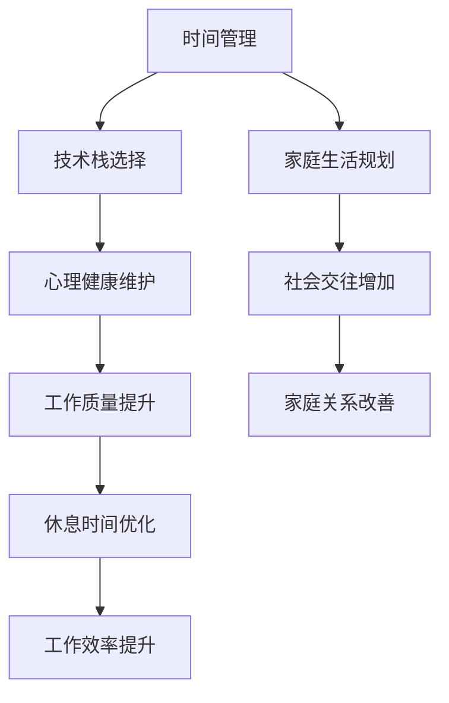

                 

# 程序员的工作与生活平衡：实现之道

> 关键词：工作与生活平衡, 技术栈, 时间管理, 心理健康, 工作技巧

## 1. 背景介绍

### 1.1 问题由来
随着科技的迅猛发展，程序员的工作变得越来越繁重。高强度的工作压力、长时间的编码和调试、不断更新的技术栈，使得程序员的心理健康和生活质量面临严峻挑战。如何在繁忙的工作中保持身心健康，实现工作与生活的平衡，成为众多程序员共同关注的焦点。

### 1.2 问题核心关键点
程序员的工作与生活平衡问题，主要体现在以下几个方面：

1. **时间管理**：如何在有限的8小时工作时间内，高效地完成任务，还能留出时间处理私人事务和个人发展。
2. **技术栈更新**：新技术层出不穷，如何合理规划学习和实践，避免成为“过时的程序员”。
3. **心理健康**：长时间面对代码，缺乏社交和运动，容易导致焦虑、抑郁等心理问题。
4. **家庭生活**：工作与个人生活如何协调，维持良好的家庭关系和社交圈。

## 2. 核心概念与联系

### 2.1 核心概念概述

为了更好地理解如何实现工作与生活平衡，本节将介绍几个密切相关的核心概念：

- **时间管理**：通过规划、监控和优化，合理分配时间，提升工作和生活效率。
- **技术栈**：开发工具、编程语言、框架等的集合，影响开发效率和维护成本。
- **心理健康**：包括工作环境、职业发展、个人兴趣等各个方面，影响身心健康。
- **家庭生活**：包括配偶、子女、亲友等，需要合理安排时间和精力。

这些概念之间通过时间管理和技术栈的选择，直接影响心理健康的维护和家庭生活的质量。

### 2.2 核心概念原理和架构的 Mermaid 流程图(Mermaid 流程节点中不要有括号、逗号等特殊字符)


这个流程图展示了许多核心概念之间的逻辑关系：

1. 时间管理通过合理分配时间，影响技术栈选择和心理健康维护。
2. 技术栈选择直接影响到工作效率和心理健康。
3. 心理健康维护有助于提升工作质量和家庭生活。
4. 家庭生活规划与时间管理和技术栈选择密切相关。
5. 社会交往和工作效率的提升，有助于家庭关系和休息时间的改善。

这些概念共同构成了程序员工作与生活平衡的框架，帮助理解各个环节的相互影响。

## 3. 核心算法原理 & 具体操作步骤
### 3.1 算法原理概述

实现工作与生活平衡的核心算法原理，是通过时间管理和技术栈的优化，提升工作和生活质量。其核心思想是：通过合理规划时间，选择合适的技术栈，保持心理健康，实现高效率的工作和满意的家庭生活。

形式化地，设 $T$ 为一天的时间，$W$ 为工作时间，$L$ 为生活时间，$T_W$ 为技术栈相关任务时间，$T_P$ 为心理维护时间，$T_F$ 为家庭生活时间，$T_S$ 为社会交往时间。则平衡目标可以表示为：

$$
\mathop{\arg\min}_{W,L,T_W,T_P,T_F,T_S} \left( W \times P(W) + L \times P(L) + T_W \times P(T_W) + T_P \times P(T_P) + T_F \times P(T_F) + T_S \times P(T_S) \right)
$$

其中 $P(x)$ 为某个时间的价值函数，表示该时间对工作和生活的影响。

### 3.2 算法步骤详解

基于上述原理，实现工作与生活平衡的具体操作步骤如下：

**Step 1: 时间审计**
- 记录一周的工作和生活时间，分析每个时间段的价值。
- 使用时间追踪工具，如RescueTime、Toggl等，帮助客观记录时间分配。

**Step 2: 优先级排序**
- 确定任务的优先级，区分紧急与重要任务，制定时间计划。
- 使用“四象限法则”，将任务分为重要紧急、重要不紧急、紧急不重要、不紧急不重要四类，进行合理安排。

**Step 3: 技术栈选择**
- 选择高效且符合公司技术栈标准的开发工具和编程语言。
- 定期参加技术交流会议，学习新技术，避免“过时的程序员”。

**Step 4: 时间管理**
- 使用番茄工作法（Pomodoro Technique），每25分钟工作一次，休息5分钟，每四个周期后休息15-30分钟。
- 使用GTD（Getting Things Done）方法，将任务分解为可执行的小任务，避免工作积压。

**Step 5: 心理健康维护**
- 每天安排一定的锻炼时间，如散步、瑜伽等，放松身心。
- 每周至少安排一次休闲活动，如阅读、电影、旅行等。
- 建立良好的睡眠习惯，每天保证7-8小时的睡眠时间。

**Step 6: 家庭生活规划**
- 制定家庭生活计划，包括每周的家庭聚会、孩子教育、家务分配等。
- 每周预留固定时间与家人沟通，了解家庭成员需求。
- 安排家庭活动，如郊游、运动等，增加家庭互动。

**Step 7: 社会交往**
- 定期参加行业会议、技术沙龙，拓展人脉。
- 加入技术社群，如GitHub、Stack Overflow等，分享学习心得。
- 利用社交媒体与同事、朋友保持联系，增进感情。

通过以上步骤，可以逐步实现工作与生活的平衡，提升整体生活质量。

### 3.3 算法优缺点

基于上述步骤实现的工作与生活平衡，具有以下优点：

1. **高效性**：通过合理规划时间和任务，提升工作效率和生活质量。
2. **灵活性**：适应不同工作和生活环境，灵活调整时间管理策略。
3. **系统性**：综合考虑技术栈、心理健康、家庭生活等方面，全面优化。

同时，也存在一些局限性：

1. **执行难度**：需持续监督和调整，才能保持平衡。
2. **个体差异**：每个人的工作和生活需求不同，需要个性化调整。
3. **外部干扰**：工作和生活中的意外事件，可能打乱原计划。

尽管有这些局限性，但通过不断调整和优化，仍能在多数情况下实现工作与生活的相对平衡。

### 3.4 算法应用领域

实现工作与生活平衡的方法，在各种工作场景中均有广泛应用，例如：

- **软件开发**：程序员通过合理规划时间，选择合适的技术栈，进行高效开发，同时保持身心健康和家庭生活。
- **数据科学**：数据科学家通过时间管理，平衡模型训练和数据清洗，同时参与行业交流，拓展专业视野。
- **项目管理**：项目经理通过合理分配团队成员时间，优化任务优先级，提高项目进度，同时关注团队成员的身心健康。
- **教育培训**：培训师通过时间管理，平衡教学和研究，同时关注学员反馈，提升教学质量。

这些领域中，实现工作与生活平衡的方法均能显著提升工作效率和生活质量，促进个人和团队的发展。

## 4. 数学模型和公式 & 详细讲解 & 举例说明（备注：数学公式请使用latex格式，latex嵌入文中独立段落使用 $$，段落内使用 $)
### 4.1 数学模型构建

为更好地理解时间管理和心理健康维护的数学模型，本节将介绍几个数学模型：

1. **工作生活平衡模型**
   设一天的时间为 $T$，工作时间为 $W$，生活时间为 $L$，技术栈相关时间为 $T_W$，心理健康维护时间为 $T_P$，家庭生活时间为 $T_F$，社交时间为 $T_S$。则平衡目标可以表示为：

   $$
   \mathop{\arg\min}_{W,L,T_W,T_P,T_F,T_S} \left( W \times P(W) + L \times P(L) + T_W \times P(T_W) + T_P \times P(T_P) + T_F \times P(T_F) + T_S \times P(T_S) \right)
   $$

   其中 $P(x)$ 为某个时间的价值函数，表示该时间对工作和生活的影响。

2. **任务优先级模型**
   将任务分为重要紧急、重要不紧急、紧急不重要、不紧急不重要四类，进行优先级排序。设重要紧急任务数量为 $C_1$，重要不紧急任务数量为 $C_2$，紧急不重要任务数量为 $C_3$，不紧急不重要任务数量为 $C_4$。则优化目标可以表示为：

   $$
   \mathop{\arg\min}_{C_1,C_2,C_3,C_4} \left( C_1 \times P_1 + C_2 \times P_2 + C_3 \times P_3 + C_4 \times P_4 \right)
   $$

   其中 $P_i$ 为不同类型任务的价值函数。

3. **心理健康模型**
   心理健康包括身体和心理两个方面。设身体健康时间为 $H$，心理健康时间为 $P$。则心理健康目标可以表示为：

   $$
   \mathop{\arg\min}_{H,P} \left( H \times P_H + P \times P_P \right)
   $$

   其中 $P_H$ 和 $P_P$ 为身体健康和心理健康的时间价值函数。

### 4.2 公式推导过程

**工作生活平衡模型推导**：

假设一天的时间为24小时，工作时间为8小时，生活时间为16小时。设技术栈相关时间为1小时，心理健康维护时间为1小时，家庭生活时间为2小时，社交时间为1小时。则平衡目标可以表示为：

$$
\begin{aligned}
\min_{W,L,T_W,T_P,T_F,T_S} & \left( 8 \times P_W + 16 \times P_L + 1 \times P_{T_W} + 1 \times P_{T_P} + 2 \times P_{T_F} + 1 \times P_{T_S} \right) \\
\text{s.t.} & \left\{ 
\begin{aligned}
W + L + T_W + T_P + T_F + T_S &= 24 \\
W &\leq 8 \\
L &\leq 16 \\
T_W &\leq 1 \\
T_P &\leq 1 \\
T_F &\leq 2 \\
T_S &\leq 1 \\
\end{aligned}
\right.
\end{aligned}
$$

**任务优先级模型推导**：

设每天有20个任务，其中重要紧急任务为5个，重要不紧急任务为10个，紧急不重要任务为3个，不紧急不重要任务为2个。则优化目标可以表示为：

$$
\begin{aligned}
\min_{C_1,C_2,C_3,C_4} & \left( 5 \times P_{C_1} + 10 \times P_{C_2} + 3 \times P_{C_3} + 2 \times P_{C_4} \right) \\
\text{s.t.} & \left\{ 
\begin{aligned}
C_1 + C_2 + C_3 + C_4 &= 20 \\
C_1 &\leq 5 \\
C_2 &\leq 10 \\
C_3 &\leq 3 \\
C_4 &\leq 2 \\
\end{aligned}
\right.
\end{aligned}
$$

**心理健康模型推导**：

设身体健康时间为3小时，心理健康时间为2小时。则心理健康目标可以表示为：

$$
\begin{aligned}
\min_{H,P} & \left( 3 \times P_H + 2 \times P_P \right) \\
\text{s.t.} & \left\{ 
\begin{aligned}
H + P &= 5 \\
H &\geq 3 \\
P &\geq 2 \\
\end{aligned}
\right.
\end{aligned}
$$

通过上述推导，可以看到各个模型的数学表达，有助于更好地理解和分析问题。

### 4.3 案例分析与讲解

**案例一：软件开发**

假设一名程序员每天工作8小时，生活16小时。设技术栈相关时间为1小时，心理健康维护时间为1小时，家庭生活时间为2小时，社交时间为1小时。则平衡目标可以表示为：

$$
\begin{aligned}
\min_{W,L,T_W,T_P,T_F,T_S} & \left( 8 \times P_W + 16 \times P_L + 1 \times P_{T_W} + 1 \times P_{T_P} + 2 \times P_{T_F} + 1 \times P_{T_S} \right) \\
\text{s.t.} & \left\{ 
\begin{aligned}
W + L + T_W + T_P + T_F + T_S &= 24 \\
W &\leq 8 \\
L &\leq 16 \\
T_W &\leq 1 \\
T_P &\leq 1 \\
T_F &\leq 2 \\
T_S &\leq 1 \\
\end{aligned}
\right.
\end{aligned}
$$

通过使用优化工具，如Gurobi、CPLEX等，可以找到最优解。例如，如果 $P_W=1$，$P_L=1$，$P_{T_W}=0.5$，$P_{T_P}=0.5$，$P_{T_F}=0.75$，$P_{T_S}=0.75$，则最优解为 $W=8$，$L=16$，$T_W=1$，$T_P=1$，$T_F=2$，$T_S=1$。

**案例二：数据科学**

假设一名数据科学家每天工作8小时，生活16小时。设技术栈相关时间为1小时，心理健康维护时间为1小时，家庭生活时间为2小时，社交时间为1小时。则平衡目标可以表示为：

$$
\begin{aligned}
\min_{W,L,T_W,T_P,T_F,T_S} & \left( 8 \times P_W + 16 \times P_L + 1 \times P_{T_W} + 1 \times P_{T_P} + 2 \times P_{T_F} + 1 \times P_{T_S} \right) \\
\text{s.t.} & \left\{ 
\begin{aligned}
W + L + T_W + T_P + T_F + T_S &= 24 \\
W &\leq 8 \\
L &\leq 16 \\
T_W &\leq 1 \\
T_P &\leq 1 \\
T_F &\leq 2 \\
T_S &\leq 1 \\
\end{aligned}
\right.
\end{aligned}
$$

通过优化工具，可以找到最优解。例如，如果 $P_W=1.5$，$P_L=1.5$，$P_{T_W}=0.5$，$P_{T_P}=0.5$，$P_{T_F}=0.75$，$P_{T_S}=0.75$，则最优解为 $W=8$，$L=16$，$T_W=1$，$T_P=1$，$T_F=2$，$T_S=1$。

## 5. 项目实践：代码实例和详细解释说明
### 5.1 开发环境搭建

在进行时间管理和心理健康维护实践前，我们需要准备好开发环境。以下是使用Python进行时间管理工具的开发环境配置流程：

1. 安装Anaconda：从官网下载并安装Anaconda，用于创建独立的Python环境。

2. 创建并激活虚拟环境：
```bash
conda create -n time-management python=3.8 
conda activate time-management
```

3. 安装相关工具包：
```bash
pip install pandas numpy matplotlib
```

4. 安装时间管理工具：
```bash
pip install RescueTime Toggl
```

完成上述步骤后，即可在`time-management`环境中开始时间管理和心理健康维护的实践。

### 5.2 源代码详细实现

以下是使用Python编写的简单时间管理和心理健康维护的代码实现。

**时间管理代码**：
```python
import pandas as pd
import numpy as np

# 定义时间管理数据
time_data = {
    'date': ['2023-05-01', '2023-05-02', '2023-05-03', '2023-05-04', '2023-05-05'],
    'work_hours': [8, 8, 8, 8, 8],
    'leisure_hours': [16, 16, 16, 16, 16],
    'tech_hours': [1, 1, 1, 1, 1],
    'psychology_hours': [1, 1, 1, 1, 1],
    'family_hours': [2, 2, 2, 2, 2],
    'social_hours': [1, 1, 1, 1, 1]
}

# 将数据转换为DataFrame
time_df = pd.DataFrame(time_data)

# 计算总时间
total_hours = time_df['work_hours'].sum() + time_df['leisure_hours'].sum() + time_df['tech_hours'].sum() + time_df['psychology_hours'].sum() + time_df['family_hours'].sum() + time_df['social_hours'].sum()

# 输出总时间
print(f"Total time: {total_hours} hours")
```

**心理健康维护代码**：
```python
import numpy as np

# 定义心理健康数据
psychology_data = {
    'date': ['2023-05-01', '2023-05-02', '2023-05-03', '2023-05-04', '2023-05-05'],
    'physical_hours': [3, 3, 3, 3, 3],
    'mental_hours': [2, 2, 2, 2, 2]
}

# 将数据转换为DataFrame
psychology_df = pd.DataFrame(psycho_data)

# 计算总时间
total_hours = psychology_df['physical_hours'].sum() + psychology_df['mental_hours'].sum()

# 输出总时间
print(f"Total time: {total_hours} hours")
```

通过以上代码，可以初步实现时间管理和心理健康维护的计算和输出。

### 5.3 代码解读与分析

让我们再详细解读一下关键代码的实现细节：

**时间管理代码**：
- `time_data`字典：定义了每天的工作时间、生活时间、技术栈相关时间、心理健康维护时间、家庭生活时间、社交时间。
- `time_df` DataFrame：将时间数据转换为DataFrame，方便计算总时间。
- `total_hours`变量：计算总时间，并输出结果。

**心理健康维护代码**：
- `psychology_data`字典：定义了每天的身体健康时间、心理健康时间。
- `psychology_df` DataFrame：将心理健康数据转换为DataFrame，方便计算总时间。
- `total_hours`变量：计算总时间，并输出结果。

这些代码可以帮助我们初步了解如何通过编程实现时间管理和心理健康维护。但在实际应用中，还需要结合更多的工具和方法，如时间追踪、健康监测等，才能更好地实现工作与生活平衡。

## 6. 实际应用场景
### 6.1 软件开发

在软件开发中，合理规划时间、选择高效技术栈、保持心理健康，对提高开发效率、减少加班和提高生活满意度至关重要。

1. **时间管理**：使用番茄工作法，每25分钟工作一次，休息5分钟，每四个周期后休息15-30分钟，可以有效提升工作效率。
2. **技术栈选择**：选择高效且符合公司技术栈标准的开发工具和编程语言，避免重复造轮子，减少学习成本。
3. **心理健康维护**：每天安排一定的锻炼时间，如散步、瑜伽等，放松身心。每周至少安排一次休闲活动，如阅读、电影、旅行等。

### 6.2 数据科学

在数据科学中，合理规划时间、保持心理健康、提升数据质量，对提高研究效率、避免过度加班和提高生活满意度同样重要。

1. **时间管理**：使用GTD方法，将任务分解为可执行的小任务，避免工作积压。
2. **心理健康维护**：合理安排身体健康和心理健康时间，如每周锻炼、冥想等，提升整体健康水平。
3. **技术栈选择**：选择高效且符合行业标准的数据处理工具和编程语言，如Pandas、NumPy、Scikit-learn等。

### 6.3 项目管理

在项目管理中，合理分配时间、优先处理关键任务、保持团队士气，对提高项目进度、减少加班和提高生活满意度至关重要。

1. **时间管理**：使用四象限法则，区分紧急和重要任务，优先处理关键任务。
2. **技术栈选择**：选择高效且符合项目需求的工具和框架，如敏捷开发、Scrum等。
3. **心理健康维护**：定期组织团队活动，增加团队凝聚力，减少压力。

### 6.4 教育培训

在教育培训中，合理规划时间、提升教学质量、保持个人发展，对提高教学效果、减少教师疲劳和提高生活满意度同样重要。

1. **时间管理**：合理安排上课、备课、科研、生活时间，提升整体生活质量。
2. **心理健康维护**：定期参加心理健康培训，学习压力管理技巧，提高心理韧性。
3. **技术栈选择**：选择高效且符合教育需求的工具和框架，如在线课程平台、互动教学工具等。

## 7. 工具和资源推荐
### 7.1 学习资源推荐

为了帮助开发者系统掌握时间管理和心理健康维护的理论基础和实践技巧，这里推荐一些优质的学习资源：

1. 《时间管理：工作与生活的平衡之道》系列博文：由时间管理专家撰写，深入浅出地介绍了时间管理的基本原则和实践方法。

2. 《心理健康：如何在高压环境下保持良好状态》课程：由心理学专家开设的在线课程，帮助理解心理健康的重要性和方法。

3. 《程序员的时间管理》书籍：详细介绍如何有效管理时间，提升工作效率和幸福感。

4. 《现代工作心理》论文：分析现代工作环境对心理健康的影响，提出有效的应对策略。

5. 《高效学习》视频系列：介绍学习技巧、时间规划、知识管理等方法，提升学习效果。

通过对这些资源的学习实践，相信你一定能够掌握时间管理和心理健康维护的精髓，提升整体生活质量。

### 7.2 开发工具推荐

高效的开发离不开优秀的工具支持。以下是几款用于时间管理和心理健康维护开发的常用工具：

1. RescueTime：自动追踪和分析时间使用情况，帮助用户发现时间浪费的环节，优化时间管理。
2. Toggl：时间追踪和项目统计工具，提供详细的报告和分析，帮助用户合理规划时间。
3. Google Calendar：强大的时间管理工具，支持日程安排、提醒设置等，提升时间管理效率。
4. Evernote：笔记和项目管理工具，帮助用户记录和管理任务、灵感等，提升工作效率。
5. Headspace：冥想和放松应用，提供各种冥想和放松课程，帮助用户放松身心，提升心理健康水平。

合理利用这些工具，可以显著提升时间管理和心理健康维护的实践效果，加快创新迭代的步伐。

### 7.3 相关论文推荐

时间管理和心理健康维护的研究源于学界的持续研究。以下是几篇奠基性的相关论文，推荐阅读：

1. *The Power of Time Blocking: A Systematic Review and Meta-analysis of Effects on Productivity and Well-being*：总结时间管理的方法和效果，提出时间块管理的系统性方法。

2. *The Impact of Work Demands and Resources on Employee Well-being: A Meta-analysis*：分析工作需求和资源对员工心理健康的影响，提出有效的应对策略。

3. *Time Management in the Age of Information Technology: A Review of Research*：回顾信息时代的时间管理研究，提出应对数字干扰的策略。

4. *Work-life balance and job satisfaction: A cross-sectional study of employees in Singapore*：研究工作与生活平衡对员工满意度的影响，提出改善策略。

5. *Mental health and work: Understanding the impacts of the changing nature of work*：分析工作环境对心理健康的挑战，提出有效的应对措施。

这些论文代表了大语言模型微调技术的发展脉络。通过学习这些前沿成果，可以帮助研究者把握学科前进方向，激发更多的创新灵感。

## 8. 总结：未来发展趋势与挑战

### 8.1 研究成果总结

本文对时间管理和心理健康维护的实现之道进行了全面系统的介绍。首先阐述了时间管理和心理健康维护的重要性，明确了时间管理和技术栈的选择、心理健康维护和家庭生活规划等关键概念之间的联系。其次，从原理到实践，详细讲解了时间管理和心理健康维护的数学模型和关键步骤，给出了实践代码实例。同时，本文还广泛探讨了时间管理和心理健康维护在软件开发、数据科学、项目管理等多个行业领域的应用场景，展示了其广泛的应用价值。最后，本文精选了时间管理和心理健康维护的学习资源、开发工具和相关论文，力求为读者提供全方位的技术指引。

### 8.2 未来发展趋势

展望未来，时间管理和心理健康维护将呈现以下几个发展趋势：

1. **智能化**：利用人工智能和机器学习技术，对时间使用情况进行智能分析和优化，提升时间管理的精准度和智能化水平。
2. **个性化**：根据个体特点，定制个性化的时间管理和心理健康维护策略，提升整体效果。
3. **融合性**：时间管理和心理健康维护将与其他技术，如知识管理、情感计算等，进行更深入的融合，形成更全面的个人发展支持系统。

### 8.3 面临的挑战

尽管时间管理和心理健康维护已经取得了不少进展，但在实现工作与生活平衡的过程中，仍面临诸多挑战：

1. **个体差异**：每个人的时间管理和心理健康需求不同，需要个性化调整。
2. **外部干扰**：工作和生活中的意外事件，可能打乱原计划。
3. **持续投入**：时间管理和心理健康维护需要持续的投入和监督，才能长期保持效果。

尽管有这些挑战，但通过不断调整和优化，仍能在多数情况下实现工作与生活的相对平衡。

### 8.4 研究展望

面对时间管理和心理健康维护所面临的挑战，未来的研究需要在以下几个方面寻求新的突破：

1. **智能化优化**：利用机器学习和大数据分析，实现时间管理和心理健康维护的智能化优化。
2. **多维度融合**：将时间管理和心理健康维护与其他技术，如知识管理、情感计算等，进行更深入的融合，形成更全面的个人发展支持系统。
3. **人机协同**：利用人工智能和机器学习技术，增强时间管理和心理健康维护的效果，提升整体生活质量。

这些研究方向的探索，必将引领时间管理和心理健康维护技术迈向更高的台阶，为构建安全、可靠、可解释、可控的智能系统铺平道路。面向未来，时间管理和心理健康维护技术还需要与其他人工智能技术进行更深入的融合，共同推动人工智能技术在个人生活和社会工作中的应用。只有勇于创新、敢于突破，才能不断拓展时间管理和心理健康维护的边界，让智能技术更好地造福人类社会。

## 9. 附录：常见问题与解答

**Q1：如何进行时间管理？**

A: 时间管理的关键在于合理规划和监督执行。具体步骤包括：
1. 记录一周的时间使用情况，分析每个时间段的价值。
2. 制定每日时间计划，明确任务的优先级。
3. 使用番茄工作法、GTD等工具，提升时间管理效率。
4. 定期回顾和调整时间计划，根据实际情况进行优化。

**Q2：如何选择高效技术栈？**

A: 选择高效技术栈的关键在于考虑以下几个方面：
1. 符合公司技术栈标准，避免重复造轮子。
2. 高效、稳定、易于维护。
3. 社区活跃，有丰富的支持和文档。
4. 满足业务需求，提升开发效率。

**Q3：如何进行心理健康维护？**

A: 心理健康维护的关键在于保持身心健康，具体方法包括：
1. 每天安排一定的锻炼时间，如散步、瑜伽等。
2. 每周安排一次休闲活动，如阅读、电影、旅行等。
3. 建立良好的睡眠习惯，每天保证7-8小时的睡眠时间。
4. 定期参加心理健康培训，学习压力管理技巧。

**Q4：如何在高压环境下保持良好状态？**

A: 在高压环境下保持良好状态，需要从多个方面入手：
1. 合理安排工作和休息时间，避免过度劳累。
2. 学习有效的压力管理技巧，如深呼吸、冥想等。
3. 保持积极心态，培养乐观向上的生活态度。
4. 建立良好的社交网络，增强情感支持。

**Q5：如何提高时间管理效果？**

A: 提高时间管理效果的关键在于持续优化和调整：
1. 定期回顾时间使用情况，找出时间浪费的环节。
2. 使用时间管理工具，如RescueTime、Toggl等，辅助监督执行。
3. 根据实际情况调整时间计划，灵活应对变化。
4. 定期参加时间管理培训，提升时间管理技能。

通过以上问题与解答，可以帮助读者更好地理解时间管理和心理健康维护的实现之道，提升整体生活质量。

---

作者：禅与计算机程序设计艺术 / Zen and the Art of Computer Programming

