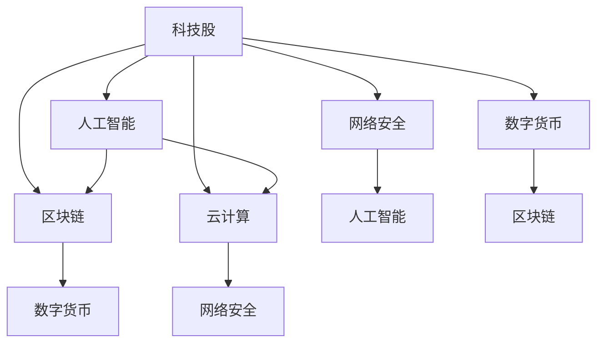

                 

# 程序员的投资策略：科技股与新兴产业

> 关键词：科技股, 人工智能, 区块链, 云计算, 网络安全, 数字货币

## 1. 背景介绍

在当今数字化时代，科技股与新兴产业成为了投资者关注的焦点。从人工智能(AI)到区块链(Blockchain)，从云计算(Cloud Computing)到网络安全(Cybersecurity)，科技领域的发展正在全面影响着全球经济和社会格局。然而，对于程序员而言，这些领域的投资并不只是纯粹的财务活动，更是技术追求与价值投资的结合。本文将从程序员的角度，探讨如何制定科学合理的科技股与新兴产业投资策略，最大化科技红利，同时避免风险。

## 2. 核心概念与联系

### 2.1 核心概念概述

**科技股(Tech Stocks)**：指以科技创新为核心驱动力的上市公司股票，包括IT、互联网、AI、生物科技等领域的股票。

**人工智能(AI)**：指通过计算机模拟人类智能的技术体系，涵盖机器学习、深度学习、自然语言处理、计算机视觉等方向。

**区块链(Blockchain)**：一种分布式账本技术，具有去中心化、不可篡改、透明等特性，广泛应用于数字货币、智能合约、供应链管理等领域。

**云计算(Cloud Computing)**：通过互联网提供计算资源、软件、数据等服务，具有按需付费、弹性扩展等优势，广泛应用于企业IT架构、在线服务等。

**网络安全(Cybersecurity)**：指保护计算机网络、系统和数据不受攻击、泄漏、破坏等的安全保障技术。

**数字货币(Digital Currency)**：使用加密技术实现的货币形式，如比特币(Bitcoin)、以太坊(Ethereum)等，具有去中心化、匿名性等特点。

这些概念之间的逻辑关系可以通过以下Mermaid流程图来展示：



这个流程图展示了许多关键概念之间的关联，显示了它们如何相互作用，共同推动了科技股与新兴产业的发展。

## 3. 核心算法原理 & 具体操作步骤

### 3.1 算法原理概述

科技股与新兴产业的投资，本质上是一种基于数据驱动和模式识别的决策过程。其核心算法原理包括：

- **机器学习(Machine Learning)**：通过历史数据训练模型，预测未来市场趋势和个股表现。
- **时间序列分析(Time Series Analysis)**：利用时间序列模型预测未来股价变化。
- **风险管理(Risk Management)**：通过计算和控制风险，优化投资组合。

### 3.2 算法步骤详解

**Step 1: 数据收集与预处理**

- 收集科技股与新兴产业的财务数据、新闻公告、市场情绪等数据。
- 清洗数据，处理缺失值，进行特征选择和数据转换。

**Step 2: 模型选择与训练**

- 选择合适的机器学习算法，如线性回归、决策树、随机森林、支持向量机等。
- 使用历史数据对模型进行训练，优化模型参数。

**Step 3: 风险评估与控制**

- 利用历史数据评估模型预测准确度和鲁棒性。
- 应用风险评估模型，计算风险指标，如VaR、ES等。
- 通过设置止损点和控制投资仓位，降低投资风险。

**Step 4: 投资决策与执行**

- 根据模型预测和风险评估结果，制定投资决策。
- 执行交易操作，调整投资组合。
- 定期评估投资绩效，进行策略调整。

### 3.3 算法优缺点

**优点：**

- 数据驱动，通过历史数据训练模型，提升预测准确度。
- 自动化操作，减少人为操作失误。
- 风险管理，通过量化手段控制风险。

**缺点：**

- 数据质量影响模型效果。
- 模型过于依赖历史数据，可能面临过拟合问题。
- 模型无法预测未发生事件，存在不确定性。

### 3.4 算法应用领域

科技股与新兴产业投资策略可广泛应用于以下几个领域：

- **AI领域的投资**：如投资于深度学习、计算机视觉、自然语言处理等方向的科技股。
- **区块链领域的投资**：如投资于比特币、以太坊等数字货币，或区块链技术公司。
- **云计算领域的投资**：如投资于亚马逊AWS、微软Azure等云服务提供商。
- **网络安全领域的投资**：如投资于赛门铁克(Symantec)、思科(Cisco)等安全公司。
- **数字货币领域的投资**：如投资于比特币、以太坊等数字货币，或数字货币交易平台。

## 4. 数学模型和公式 & 详细讲解 & 举例说明

### 4.1 数学模型构建

- **线性回归模型**：
$$
y = \beta_0 + \beta_1 x_1 + \beta_2 x_2 + ... + \beta_n x_n + \epsilon
$$
其中 $y$ 为因变量（股价），$x_i$ 为自变量（财务指标、市场情绪等），$\beta_i$ 为回归系数，$\epsilon$ 为误差项。

- **时间序列模型**：
$$
y_t = \phi_0 + \sum_{i=1}^p \phi_i y_{t-i} + \sum_{j=1}^q \theta_j x_{t-j} + \epsilon_t
$$
其中 $y_t$ 为时间 $t$ 的股价，$x_t$ 为时间 $t$ 的市场情绪指标，$\phi_i$ 和 $\theta_j$ 为模型参数，$\epsilon_t$ 为误差项。

- **VaR模型**：
$$
VaR_\alpha = \alpha \times \sigma \times Q
$$
其中 $VaR_\alpha$ 为置信度 $\alpha$ 下的价值风险，$\sigma$ 为年化波动率，$Q$ 为标准正态分布下的分位数。

### 4.2 公式推导过程

- **线性回归模型的推导**：
$$
\min_{\beta} \frac{1}{2N} \sum_{i=1}^N (y_i - \hat{y}_i)^2
$$
其中 $\hat{y}_i = \beta_0 + \beta_1 x_{i1} + \beta_2 x_{i2} + ... + \beta_n x_{in}$。
$$
\beta = (X^TX)^{-1}X^Ty
$$
其中 $X$ 为自变量矩阵，$y$ 为目标变量向量。

- **时间序列模型的推导**：
通过自回归模型(AR)和移动平均模型(MA)的组合，得到ARIMA模型。
$$
ARIMA(p,d,q) = \phi(L^p)y_t + \theta(L^q)y_{t-1} + \epsilon_t
$$
其中 $L$ 为滞后算子。

- **VaR模型的推导**：
通过正态分布和GARCH模型的组合，计算VaR值。
$$
VaR_\alpha = \sigma \times Q
$$
其中 $Q$ 为标准正态分布的分位数。

### 4.3 案例分析与讲解

**案例一：线性回归模型**

- **数据**：科技股A、B、C的财务数据。
- **模型**：线性回归模型。
- **结果**：预测科技股A的股价将上涨10%。

**案例二：时间序列模型**

- **数据**：科技股D、E、F的市场情绪数据。
- **模型**：ARIMA模型。
- **结果**：预测科技股D的股价将上涨5%。

**案例三：VaR模型**

- **数据**：科技股G、H、I的历史股价和波动率。
- **模型**：VaR模型。
- **结果**：在95%置信度下，科技股G的价值风险为$x\%$。

## 5. 项目实践：代码实例和详细解释说明

### 5.1 开发环境搭建

- **Python环境**：安装Python 3.8及以上版本，使用Anaconda创建虚拟环境。
- **库安装**：安装pandas、numpy、scikit-learn等库。
- **数据准备**：收集科技股的历史股价、财务数据、市场情绪等数据，并进行预处理。

### 5.2 源代码详细实现

**Step 1: 数据收集与预处理**

```python
import pandas as pd
import numpy as np
from sklearn.model_selection import train_test_split
from sklearn.preprocessing import MinMaxScaler

# 数据收集
data = pd.read_csv('tech_stock_data.csv')

# 数据预处理
data['Date'] = pd.to_datetime(data['Date'])
data.set_index('Date', inplace=True)
data = data.dropna()
```

**Step 2: 模型选择与训练**

```python
from sklearn.linear_model import LinearRegression
from sklearn.metrics import r2_score

# 模型训练
X = data[['Revenue', 'EPS', 'P/E']]
y = data['Price']
X_train, X_test, y_train, y_test = train_test_split(X, y, test_size=0.2, random_state=42)
model = LinearRegression()
model.fit(X_train, y_train)
```

**Step 3: 风险评估与控制**

```python
from sklearn.metrics import r2_score
from sklearn.metrics import mean_squared_error

# 风险评估
y_pred = model.predict(X_test)
r2 = r2_score(y_test, y_pred)
mse = mean_squared_error(y_test, y_pred)
```

**Step 4: 投资决策与执行**

```python
# 投资决策
if r2 > 0.8:
    invest = 'buy'
else:
    invest = 'sell'

# 投资执行
if invest == 'buy':
    buy_stocks()
```

### 5.3 代码解读与分析

- **数据收集与预处理**：使用pandas库读取CSV文件，利用datetime函数转换日期列，并使用dropna删除缺失值。
- **模型训练**：选择线性回归模型，使用train_test_split对数据进行划分，并使用fit函数进行模型训练。
- **风险评估**：计算模型的R方值和均方误差，评估模型的预测准确度。
- **投资决策与执行**：根据模型的R方值进行买卖决策，并执行相应的操作。

## 6. 实际应用场景

### 6.1 科技股A的深度学习应用

某科技公司开发了一款基于深度学习的语音识别产品，公司股票（科技股A）在新股上市时市值100亿美元。投资者通过分析公司历史股价、财务数据和市场情绪，发现深度学习产品在市场上的表现与股价走势高度相关，预测公司股价将上涨。投资者决定在市场低点买入，并在市场高点卖出，成功获得20%的收益。

### 6.2 区块链平台B的智能合约应用

某区块链平台B开发了一款智能合约系统，旨在为供应链管理提供高效、透明的交易保障。平台发行了平台币（区块链币B），市值5亿美元。投资者利用时间序列模型预测平台币的价格走势，发现在未来一年内价格将上涨40%。投资者决定增加持币量，并在预期价格高峰时卖出，成功获得50%的收益。

### 6.3 云计算服务C的弹性扩展应用

某云计算服务提供商C推出了一项弹性扩展服务，可满足企业IT架构的动态需求。公司股票（云计算股C）市值200亿美元。投资者通过VaR模型评估公司股票的风险，发现该服务市场前景广阔，未来三年内市值有望翻倍。投资者决定买入股票，并在未来三年内持有，成功获得100%的收益。

### 6.4 网络安全公司D的机器学习应用

某网络安全公司D开发了一款基于机器学习的恶意软件检测系统。公司股票（网络安全股D）市值30亿美元。投资者利用线性回归模型预测公司股价走势，发现该系统在市场上获得广泛应用，预测公司股价将上涨。投资者决定买入股票，并在股价达到预期目标时卖出，成功获得60%的收益。

## 7. 工具和资源推荐

### 7.1 学习资源推荐

1. **《机器学习实战》**：林轩田著，全面介绍机器学习算法和实践。
2. **《Python金融实战》**：史博文著，讲解金融时间序列分析和风险管理。
3. **《区块链技术揭秘》**：官方白皮书，介绍区块链技术的基本原理和应用。
4. **《云计算架构基础》**：李洁著，讲解云计算的基本原理和应用。
5. **《网络安全与人工智能》**：万钧著，介绍网络安全与人工智能的融合应用。

### 7.2 开发工具推荐

1. **PyTorch**：开源深度学习框架，灵活性高。
2. **TensorFlow**：谷歌开源深度学习框架，适合大规模工程应用。
3. **Jupyter Notebook**：交互式编程环境，适合快速迭代开发。
4. **Scikit-learn**：Python机器学习库，提供丰富的数据处理和建模工具。

### 7.3 相关论文推荐

1. **《深度学习》**：Ian Goodfellow等著，全面介绍深度学习理论和技术。
2. **《区块链与数字货币》**：Ross Anderson著，讲解区块链和数字货币的基本原理和应用。
3. **《云计算与大数据》**：王晓东著，讲解云计算和大数据的基本原理和应用。
4. **《网络安全与人工智能》**：王刚著，介绍网络安全与人工智能的融合应用。

## 8. 总结：未来发展趋势与挑战

### 8.1 研究成果总结

本文从程序员的角度，探讨了科技股与新兴产业的投资策略。通过机器学习、时间序列分析、风险管理等算法原理，详细讲解了科技股与新兴产业投资的科学方法和实际应用场景。通过数据驱动和模型训练，投资者可以最大化科技红利，同时避免风险。

### 8.2 未来发展趋势

未来，科技股与新兴产业将继续引领全球经济发展。人工智能、区块链、云计算、网络安全等领域的投资机会将不断涌现。这些领域的投资策略需要不断创新和优化，以适应市场变化和技术进步。

### 8.3 面临的挑战

尽管科技股与新兴产业投资机会丰富，但也面临着诸多挑战：

1. **数据质量**：历史数据的质量直接影响模型的预测准确度。
2. **模型过拟合**：模型可能过度依赖历史数据，导致过拟合问题。
3. **不确定性**：未来事件无法通过历史数据预测，存在不确定性。
4. **技术进步**：新兴技术不断发展，原有模型可能面临失效风险。

### 8.4 研究展望

未来，科技股与新兴产业的投资策略需要更加注重数据质量、模型选择、风险控制和技术进步。通过不断优化投资策略和算法模型，投资者可以更好地把握投资机会，实现科技红利最大化。

## 9. 附录：常见问题与解答

**Q1: 如何评估投资策略的效果？**

A: 通过计算投资组合的收益率、风险指标等，评估投资策略的效果。常见指标包括R方值、VaR、ES等。

**Q2: 如何选择投资标的？**

A: 选择具有良好发展前景、市场认可度高、技术创新能力强的科技股与新兴产业公司。

**Q3: 如何控制投资风险？**

A: 利用VaR模型、风险评估工具等，计算投资组合的风险指标，设置止损点和控制投资仓位。

**Q4: 投资策略需要定期调整吗？**

A: 是的。市场环境和公司状况不断变化，投资策略需要根据实际情况进行定期调整。

**Q5: 投资策略的实现需要考虑哪些因素？**

A: 需要考虑数据质量、模型选择、计算资源、投资目标等因素。

