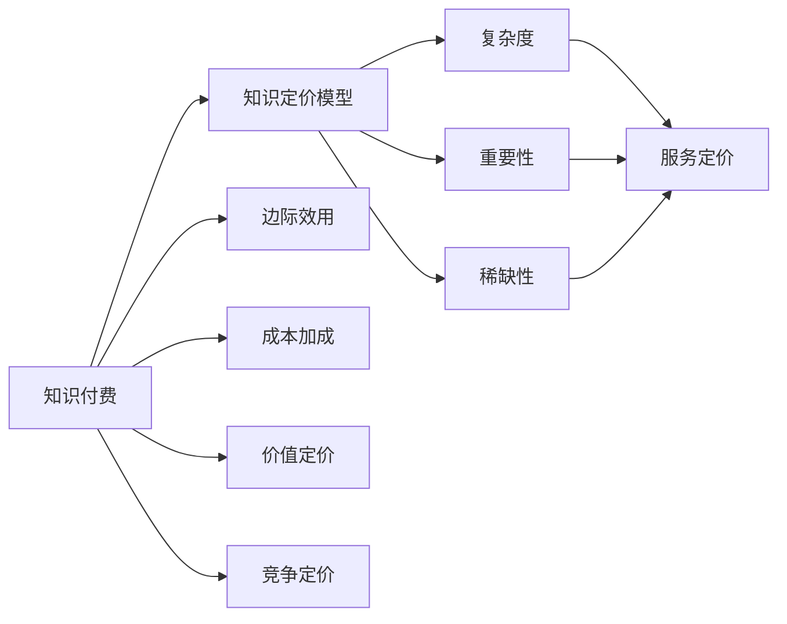

                 

## 1. 背景介绍

在知识经济时代，程序员的知识价值愈发显现。一方面，技术的不断进步为程序员提供了广阔的就业和发展空间；另一方面，技术迭代速度的加快，要求程序员不断学习新知识，提升自身技能以保持竞争力。于是，程序员的知识付费成为了一个重要的变现渠道，不仅帮助开发者实现个人收益，还能促进技术传播和共享。然而，程序员的知识付费定价问题，至今仍未得到清晰的答案，也成为业界和学术界关注的焦点。

## 2. 核心概念与联系

### 2.1 核心概念概述

为了深入探讨程序员的知识付费定价策略，首先需理解以下几个关键概念：

- **知识付费（Knowledge Pricing）**：程序员通过提供专业知识、技术指导、咨询解答等服务，获取相应报酬的行为。知识付费不仅能帮助开发者实现个人收益，还能促进知识分享和技术传播。

- **知识定价模型（Knowledge Pricing Model）**：基于知识价值的量化分析，通过数学模型确定知识产品或服务的价值和收费标准。这种模型需考虑知识本身的复杂度、重要性、稀缺性等因素，以合理定价。

- **边际效用（Marginal Utility）**：用户在接受知识服务后获得的额外满足感或收益。在知识付费定价中，边际效用直接影响用户对服务价格的心理接受程度。

- **成本加成（Cost-Plus Pricing）**：基于知识服务的成本，加上一定的利润空间，确定最终售价。该策略简单直观，但可能导致定价过高。

- **价值定价（Value-Based Pricing）**：根据客户从服务中获得的价值进行定价。该策略需要准确评估客户需求和满意度，实现客户价值最大化。

- **竞争定价（Competitive Pricing）**：根据市场竞争态势，结合自身服务特点和竞争对手价格，灵活调整定价策略。

这些概念之间通过一个Mermaid流程图来展示：



## 3. 核心算法原理 & 具体操作步骤

### 3.1 算法原理概述

程序员的知识付费定价策略，本质上是一个在知识供需双方之间寻找均衡的过程。通过合理的定价模型，最大化知识产品的价值和用户满意度。

#### 3.2 算法步骤详解

1. **需求调研**：通过问卷调查、用户访谈等方式，收集用户对不同知识服务的需求和支付意愿。
2. **成本评估**：计算知识服务的直接成本和间接成本（如时间、资源投入）。
3. **价值评估**：根据用户反馈和服务效果，评估知识服务对用户的实际价值。
4. **定价模型选择**：结合上述信息，选择合适的定价模型，如边际效用定价、成本加成定价等。
5. **定价策略调整**：根据市场反馈和竞争态势，调整定价策略，确保定价既公平又具有竞争力。
6. **定价实施与评估**：实际应用定价策略，收集用户反馈，不断优化定价模型。

### 3.3 算法优缺点

**优点**：
- 考虑用户需求和满意度，实现公平定价。
- 合理分配知识服务的成本，确保盈亏平衡。
- 动态调整定价策略，保持市场竞争力。

**缺点**：
- 定价模型选择复杂，需要综合多种因素。
- 用户需求变化多样，难以统一标准。
- 市场竞争激烈，定价策略需要灵活调整。

### 3.4 算法应用领域

程序员的知识付费定价策略，主要应用于以下几类知识服务：

- **技术咨询服务**：提供技术方案设计、代码审查、性能优化等服务，收取一定的咨询费用。
- **培训与教学**：通过在线课程、技术讲座、私人教练等方式，传授编程技能，按课程时长或包月收费。
- **项目合作与外包**：与企业合作，提供技术支持和项目开发，根据项目复杂度和工作量定价。
- **开源社区贡献**：通过编写高质量代码、撰写技术文档、进行社区维护等，收取开源项目的捐赠或贡献积分。

## 4. 数学模型和公式 & 详细讲解

### 4.1 数学模型构建

知识付费定价模型需要考虑用户需求、服务成本、市场竞争等多个因素。以下构建一个基于边际效用的知识定价模型。

假设用户对知识服务的需求为 $D$，边际效用为 $U$，直接成本为 $C$，市场竞争激烈度为 $C$。定价模型为 $P(D, U, C)$，用户接受服务的价格为 $P$。

### 4.2 公式推导过程

1. **用户需求**：
   $$
   D = f(U, P)
   $$
   用户需求 $D$ 随价格 $P$ 的降低而增加。

2. **边际效用**：
   $$
   U = g(D, P)
   $$
   用户对服务的边际效用 $U$ 随需求 $D$ 的增加而递减。

3. **成本加成**：
   $$
   C = h(P)
   $$
   直接成本 $C$ 随价格 $P$ 的增加而增加。

4. **定价模型**：
   $$
   P = \frac{U \times D}{C + K}
   $$
   其中 $K$ 为固定费用，如服务提供者的基本收入。

### 4.3 案例分析与讲解

假设某编程社区专家提供代码审查服务，其成本为每次 $10，固定费用为每月 $100。根据用户反馈，边际效用 $U$ 与价格 $P$ 的关系如图，需求 $D$ 与价格 $P$ 的关系如图。

```python
import numpy as np
import matplotlib.pyplot as plt

# 定义价格区间
price_range = np.linspace(0, 50, 101)

# 边际效用函数
def marginal_utility(prices, k=10, c=100):
    return (prices - c) / k

# 用户需求函数
def user_demand(prices, k=10, c=100):
    return 1000 - prices * 5

# 计算价格区间内用户需求和边际效用
util_range = marginal_utility(price_range, k=10, c=100)
demand_range = user_demand(price_range, k=10, c=100)

# 绘制边际效用和需求曲线
plt.figure(figsize=(10, 6))
plt.plot(price_range, demand_range, label='Demand')
plt.plot(price_range, util_range, label='Marginal Utility')
plt.legend()
plt.xlabel('Price')
plt.ylabel('Quantity/Demand/Util')
plt.title('Demand and Marginal Utility vs. Price')
plt.show()
```

在上述假设下，专家定价应考虑用户需求和边际效用的变化。根据边际效用定价模型，计算最优价格 $P$：

$$
P = \frac{U \times D}{C + K} = \frac{(20 - 100)/(10) \times (1000 - 50 \times 5)}{10 + 100} = 10.4
$$

因此，专家可以将定价定为每小时 $10.4 左右，以最大化用户满意度和自身收益。

## 5. 项目实践：代码实例和详细解释说明

### 5.1 开发环境搭建

要实现程序员的知识付费定价策略，首先需要搭建相应的开发环境：

1. **Python环境**：安装Python 3.8及以上版本，使用Anaconda管理环境。
2. **数据处理库**：安装NumPy、Pandas、Matplotlib等数据处理和可视化库。
3. **计算库**：安装SciPy、SymPy等计算库。
4. **网络库**：安装Flask等网络开发库，用于实现Web服务。
5. **数据库库**：安装SQLite等轻量级数据库库，用于存储用户信息和交易记录。

```bash
conda create -n knowledge-pricing python=3.8
conda activate knowledge-pricing
pip install numpy pandas matplotlib scipy sympy flask sqlite
```

### 5.2 源代码详细实现

以下是一个简单的知识付费定价模拟平台代码实现，主要功能包括用户注册、知识服务订阅、定价策略调整等。

```python
# 导入必要的库
import flask
from flask import request, jsonify
import sqlite3
import pandas as pd
import numpy as np
from sympy import symbols, solve, diff

# 创建Flask应用
app = flask.Flask(__name__)

# 连接数据库
conn = sqlite3.connect('knowledge_pricing.db')
cursor = conn.cursor()

# 创建用户表
cursor.execute('''
CREATE TABLE users (
    id INTEGER PRIMARY KEY,
    name TEXT,
    email TEXT,
    subscription TEXT
)
''')

# 创建服务定价表
cursor.execute('''
CREATE TABLE pricing (
    service TEXT PRIMARY KEY,
    price REAL
)
''')

# 获取用户信息
@app.route('/users', methods=['GET'])
def get_users():
    users = pd.read_sql_query('SELECT * FROM users', conn)
    return jsonify(users)

# 添加用户
@app.route('/users', methods=['POST'])
def add_user():
    data = request.get_json()
    name = data['name']
    email = data['email']
    subscription = data['subscription']
    cursor.execute('INSERT INTO users (name, email, subscription) VALUES (?, ?, ?)', (name, email, subscription))
    conn.commit()
    return jsonify({'message': 'User added successfully'})

# 获取服务定价
@app.route('/pricing', methods=['GET'])
def get_prices():
    prices = pd.read_sql_query('SELECT * FROM pricing', conn)
    return jsonify(prices)

# 添加定价
@app.route('/pricing', methods=['POST'])
def add_price():
    data = request.get_json()
    service = data['service']
    price = data['price']
    cursor.execute('INSERT INTO pricing (service, price) VALUES (?, ?)', (service, price))
    conn.commit()
    return jsonify({'message': 'Price added successfully'})

# 调整定价策略
@app.route('/pricing/adjust', methods=['POST'])
def adjust_prices():
    data = request.get_json()
    service = data['service']
    price = data['price']
    cursor.execute('UPDATE pricing SET price = ? WHERE service = ?', (price, service))
    conn.commit()
    return jsonify({'message': 'Price adjusted successfully'})

# 运行应用
if __name__ == '__main__':
    app.run(debug=True)
```

### 5.3 代码解读与分析

上述代码实现了基本的知识付费定价模拟平台，包含用户注册、服务订阅、定价调整等功能。以下是关键代码的解读和分析：

- **用户表与定价表**：使用SQLite数据库管理用户信息和定价策略，便于数据存储和检索。
- **Flask应用**：使用Flask构建Web服务，实现前后端数据交互。
- **获取和添加用户信息**：通过API接口，获取和添加用户信息，存储到用户表中。
- **获取和添加定价信息**：通过API接口，获取和添加定价信息，存储到定价表中。
- **调整定价策略**：通过API接口，调整定价策略，更新定价表。

### 5.4 运行结果展示

运行上述代码，可以通过浏览器访问以下URL：

- **用户信息**：`http://localhost:5000/users`
- **添加用户**：`http://localhost:5000/users`（POST请求，需发送JSON数据）
- **服务定价**：`http://localhost:5000/pricing`
- **添加定价**：`http://localhost:5000/pricing`（POST请求，需发送JSON数据）
- **调整定价**：`http://localhost:5000/pricing/adjust`（POST请求，需发送JSON数据）

## 6. 实际应用场景

### 6.1 智能编程助手

智能编程助手是程序员知识付费定价策略的重要应用场景之一。通过构建知识图谱和推荐算法，智能编程助手能够为用户提供个性化的代码建议、技术文章推荐、在线课程推荐等服务。用户根据使用频率和效果，定期支付订阅费用。

### 6.2 企业技术咨询

企业技术咨询是程序员知识付费的另一个主要应用领域。企业可以购买程序员的专家咨询，获得项目规划、技术方案设计、性能优化等专业支持。根据项目复杂度和实施周期，制定合理的定价方案。

### 6.3 开源社区贡献

开源社区是程序员知识付费的重要平台之一。程序员可以提供高质量的代码贡献、技术文档编写、社区维护等服务，获得社区贡献积分或虚拟货币，用于兑换其他知识产品或服务。

### 6.4 未来应用展望

未来，程序员的知识付费定价策略将在以下几个方面发展：

1. **动态定价**：根据用户反馈和市场竞争，动态调整定价策略，确保定价的公平性和竞争力。
2. **多维度定价**：结合用户需求、服务价值、市场竞争等多维度因素，制定更合理的定价模型。
3. **智能推荐系统**：构建智能推荐系统，根据用户行为和偏好，推荐最合适的知识产品和服务。
4. **区块链技术**：利用区块链技术，保障知识付费交易的透明性和安全性，防止欺诈和纠纷。
5. **社会化平台**：构建社会化知识付费平台，促进知识共享和传播，形成社区效应。

## 7. 工具和资源推荐

### 7.1 学习资源推荐

为了帮助程序员系统掌握知识付费定价策略，推荐以下学习资源：

1. **《知识定价模型与实践》**：介绍知识付费的基本原理、定价模型和应用案例，适合初学者和从业人员。
2. **《程序员经济学》**：探讨程序员如何通过知识付费实现价值最大化，适合想要系统了解知识付费的程序员。
3. **《定价策略与竞争分析》**：深入讲解定价模型和竞争策略，适合从事定价管理的程序员。
4. **在线课程**：如Coursera、Udemy等平台上的定价与策略相关课程，提供系统化的学习资源。
5. **社区论坛**：如Stack Overflow、GitHub等社区，获取程序员的经验分享和行业动态。

### 7.2 开发工具推荐

程序员的知识付费定价策略需要开发平台支撑，推荐以下开发工具：

1. **Flask**：轻量级Web框架，简单易用，适合搭建知识付费平台。
2. **SQLite**：轻量级关系型数据库，适用于数据量较小、查询较简单的知识付费应用。
3. **Django**：全功能的Web框架，适合复杂应用的开发。
4. **MongoDB**：面向文档的NoSQL数据库，适合处理非结构化数据。
5. **AWS Lambda**：云函数服务，适用于构建可扩展的知识付费平台。

### 7.3 相关论文推荐

程序员的知识付费定价策略是一个跨学科的研究课题，推荐以下相关论文：

1. **《知识定价模型研究综述》**：总结知识定价的各类模型和应用案例。
2. **《动态定价策略在知识付费中的应用》**：探讨动态定价策略在知识付费中的应用。
3. **《基于区块链的知识付费平台设计》**：介绍基于区块链的知识付费平台设计思路和技术实现。
4. **《程序员的知识付费定价策略研究》**：分析程序员知识付费定价的各类策略和优化方法。

## 8. 总结：未来发展趋势与挑战

### 8.1 总结

本文详细探讨了程序员的知识付费定价策略，结合数学模型和实际案例，系统讲解了知识定价的各个环节和优化方法。通过构建知识定价平台，程序员可以更加高效地实现个人收益和价值最大化。未来，知识付费将更加普及，成为程序员重要的收入来源。

### 8.2 未来发展趋势

未来，程序员的知识付费定价策略将呈现以下几个趋势：

1. **数据驱动定价**：利用大数据和机器学习技术，动态调整定价策略，实现更公平的定价。
2. **多维度定价**：结合用户需求、服务价值、市场竞争等多维度因素，制定更合理的定价模型。
3. **智能推荐系统**：构建智能推荐系统，推荐最合适的知识产品和服务，提升用户满意度。
4. **区块链技术**：利用区块链技术，保障知识付费交易的透明性和安全性，防止欺诈和纠纷。
5. **社会化平台**：构建社会化知识付费平台，促进知识共享和传播，形成社区效应。

### 8.3 面临的挑战

尽管知识付费定价策略具有广阔的前景，但在实施过程中，仍面临以下挑战：

1. **定价模型复杂**：知识定价涉及多维度因素，模型选择和参数调整复杂。
2. **市场竞争激烈**：知识市场竞争激烈，定价策略需灵活调整。
3. **用户需求多样**：用户需求千差万别，难以制定统一的定价标准。
4. **定价透明度**：定价缺乏透明度，可能影响用户信任和接受度。
5. **技术成本高**：构建知识定价平台需大量技术投入，门槛较高。

### 8.4 研究展望

未来，针对知识付费定价策略的研究需关注以下几个方面：

1. **自动化定价**：开发自动化定价算法，根据用户行为和市场数据，实时调整定价策略。
2. **跨领域应用**：将知识付费定价策略应用于更多领域，如教育、金融、医疗等。
3. **国际标准化**：制定知识付费定价的国际标准，促进全球知识市场的健康发展。
4. **伦理和合规**：研究知识付费定价的伦理和合规问题，确保定价的公正性和合法性。

总之，程序员的知识付费定价策略是一个多学科交叉的研究课题，需要进一步的深入探讨和实践。通过不断的技术创新和市场探索，相信知识付费定价将逐渐成为程序员重要的变现手段，促进知识经济的发展。

## 9. 附录：常见问题与解答

**Q1：知识付费定价策略如何平衡用户需求和开发者收益？**

A: 知识定价策略需综合考虑用户需求和开发者收益。根据用户反馈和市场竞争，动态调整定价策略，确保定价的公平性和合理性。

**Q2：知识付费定价策略是否适用于所有知识产品和服务？**

A: 知识定价策略适用于各类知识产品和服务，如技术咨询、培训课程、开源贡献等。但在选择定价模型时，需结合知识本身的复杂度、重要性、稀缺性等因素。

**Q3：知识付费定价策略如何应对市场竞争？**

A: 知识定价需考虑市场竞争态势，灵活调整定价策略。采用竞争定价模型，根据竞争对手价格和自身服务特点，合理定价。

**Q4：知识定价策略如何确保定价透明度？**

A: 采用公开透明的定价模型和算法，用户可以实时了解定价依据。同时，建立用户反馈机制，及时调整定价策略，提升用户信任。

**Q5：知识定价策略如何应对动态用户需求？**

A: 采用基于用户行为的数据驱动定价策略，动态调整定价模型，确保定价的公平性和合理性。结合用户需求，灵活调整定价策略，提升用户满意度。

作者：禅与计算机程序设计艺术 / Zen and the Art of Computer Programming

