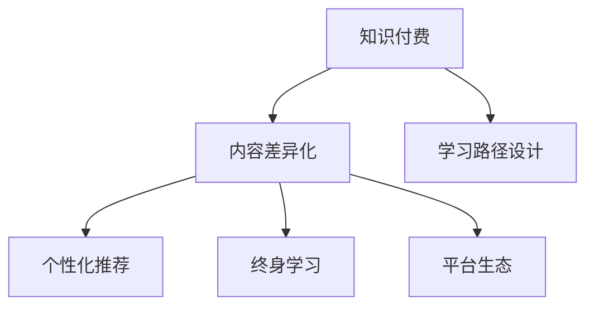

                 

# 程序员知识付费的内容差异化策略

> 关键词：程序员,知识付费,内容差异化,学习路径,个性化推荐,终身学习

## 1. 背景介绍

### 1.1 问题由来
随着信息时代的到来，知识付费成为一种新的学习方式。程序员作为知识密集型的从业人员，面临不断更新迭代的复杂技术栈和工具库。如何在海量知识中高效筛选，找到适合自己的学习路径，成为广大程序员面临的重要问题。

知识付费平台如Coursera、Udemy、腾讯课堂等提供了大量付费课程，但这些课程在内容和形式上高度同质化，难以满足不同层次、不同需求的程序员。如何从内容差异化角度，提升知识付费的实用性和精准性，是平台和内容创作者需要共同解决的问题。

### 1.2 问题核心关键点
内容差异化是知识付费平台提升用户满意度和黏性的重要手段。通过精准识别用户需求、个性化推荐学习内容、优化学习路径设计，可以大大提升知识付费的效果。然而，内容差异化并非易事，需要综合考虑多方面因素，包括但不限于：

- 用户画像的构建
- 学习路径的智能化设计
- 个性化推荐算法
- 平台生态的丰富度
- 学习效果和反馈机制

## 2. 核心概念与联系

### 2.1 核心概念概述

为更好地理解程序员知识付费的内容差异化策略，本节将介绍几个关键概念：

- 知识付费：一种付费获取高质量在线课程和资源的学习方式，旨在提升学习效率和效果。

- 内容差异化：通过识别用户需求，结合平台资源，设计独特的学习路径和推荐内容，提供个性化学习体验。

- 学习路径设计：根据用户基础、学习目标、时间成本等因素，设计从入门到精通的课程序列，帮助用户系统性提升技能。

- 个性化推荐：利用算法精准匹配用户兴趣，推送符合用户需求的学习内容，提升学习体验和效果。

- 终身学习：提倡持续不断学习新技术、新知识，适应职业发展和行业变化。

- 平台生态：围绕知识付费平台形成的学习社区、技术论坛、实战项目等资源集聚，帮助用户从理论到实践全面提升。

这些概念之间的关系通过以下Mermaid流程图来展示：



这个流程图展示的知识付费平台和内容差异化的关系：

1. 知识付费是基础，通过付费获取高质量的学习资源。
2. 内容差异化是核心，通过个性化推荐和学习路径设计，提升用户体验。
3. 学习路径设计是手段，通过系统性课程序列帮助用户成长。
4. 个性化推荐是关键，通过精准匹配提升学习效果。
5. 终身学习是目标，强调持续不断学习新技术。
6. 平台生态是支撑，围绕知识付费形成丰富学习资源。

## 3. 核心算法原理 & 具体操作步骤
### 3.1 算法原理概述

内容差异化的核心在于精准匹配用户需求和学习内容，为此，需要使用机器学习、深度学习等算法进行个性化推荐和路径设计。

1. **个性化推荐算法**：通过分析用户行为数据（如课程浏览、购买、评价等），结合内容属性（如难度、领域、时长等），计算用户与课程之间的相似度，推荐符合用户兴趣的课程。

2. **学习路径设计算法**：根据用户基础和目标，结合课程之间的依赖关系，设计从入门到精通的学习路径。确保路径具有连贯性，用户能够系统性提升技能。

### 3.2 算法步骤详解

内容差异化涉及以下主要步骤：

**Step 1: 用户画像构建**
- 收集用户行为数据，包括但不限于：
  - 课程浏览记录
  - 课程购买记录
  - 课程评价记录
  - 历史学习进度
- 分析用户兴趣、学习风格、基础能力等特征
- 构建用户画像，形成多维度的用户特征向量

**Step 2: 课程属性标注**
- 对平台课程进行属性标注，包括：
  - 难度等级
  - 学习领域
  - 时长估算
  - 前置课程要求
- 构建课程属性向量，形成课程知识图谱

**Step 3: 相似度计算**
- 基于用户画像和课程属性向量，计算用户与课程之间的相似度
- 使用余弦相似度、KNN等算法进行相似度计算
- 根据相似度排序，选择推荐课程

**Step 4: 学习路径设计**
- 根据用户画像和学习目标，设计连贯的学习路径
- 推荐前置课程，避免知识断层
- 评估学习效果，调整学习路径
- 设计挑战性任务，促进持续学习

**Step 5: 个性化推荐**
- 结合用户历史行为和当前兴趣，实时推荐课程
- 动态调整推荐策略，根据用户反馈优化
- 集成多模态信息（如视频、文本、评价），提升推荐精准度

**Step 6: 学习效果评估**
- 收集用户学习反馈（如作业提交、项目提交等）
- 评估学习效果，形成学习报告
- 根据评估结果调整推荐算法

**Step 7: 学习路径优化**
- 根据学习效果和用户反馈，优化学习路径
- 更新课程属性，完善知识图谱
- 引入新课程和新算法，提升平台丰富度

### 3.3 算法优缺点

个性化推荐和内容差异化具有以下优点：

1. 提升学习效率：通过精准匹配，推荐符合用户兴趣的课程，节省学习时间。
2. 增强用户黏性：个性化推荐和路径设计，提升用户满意度和平台黏性。
3. 促进终身学习：智能化路径设计，帮助用户持续学习新技术，适应职业变化。

同时，也存在一些局限性：

1. 数据隐私问题：收集和分析用户行为数据，可能涉及隐私泄露。
2. 冷启动问题：新用户没有历史数据，难以进行精准推荐。
3. 个性化偏差：算法可能会过度个性化，导致用户陷入信息茧房。
4. 用户自主性受限：过度依赖推荐，用户主动性降低。
5. 平台算力要求高：需要大量数据和算法资源，对平台算力要求较高。

尽管存在这些局限性，但个性化推荐和内容差异化在提升知识付费效果方面仍具有重要价值。未来相关研究的重点在于如何进一步降低推荐系统的偏差和冷启动问题，提高推荐精准度，同时兼顾用户隐私保护和自主性。

### 3.4 算法应用领域

个性化推荐和内容差异化技术，在知识付费平台和在线教育领域已经得到了广泛应用，具体应用场景包括：

1. **职业成长路径设计**：根据用户职业需求和基础能力，设计从入门到精通的课程路径，帮助用户系统性提升技能。
2. **技能提升个性化推荐**：通过分析用户行为数据，推荐符合用户兴趣的技能提升课程，帮助用户高效学习。
3. **职业发展定制化服务**：根据用户职业发展需求，提供定制化的课程和实战项目，帮助用户加速职业成长。
4. **学习效果评估与反馈**：通过学习效果评估，优化学习路径，提升学习效果。
5. **学习社区和实战项目**：围绕平台形成学习社区、技术论坛、实战项目等资源，帮助用户从理论到实践全面提升。

## 4. 数学模型和公式 & 详细讲解 & 举例说明
### 4.1 数学模型构建

个性化推荐和内容差异化涉及以下数学模型：

- **用户画像表示**：将用户特征表示为一个向量 $u$，包括兴趣、学习风格、基础能力等。
- **课程属性表示**：将课程特征表示为一个向量 $c$，包括难度、领域、时长等。
- **相似度计算**：通过余弦相似度计算用户与课程之间的相似度 $s(u,c)$。

用户画像和课程属性向量计算如下：

$$
u = \sum_{i=1}^n u_i \cdot v_i
$$

$$
c = \sum_{j=1}^m c_j \cdot v_j
$$

其中 $u_i$ 和 $c_j$ 分别表示用户和课程的属性权重，$v_i$ 和 $v_j$ 分别表示对应的特征向量。

余弦相似度的计算公式如下：

$$
s(u,c) = \frac{u \cdot c}{||u|| \cdot ||c||}
$$

### 4.2 公式推导过程

以课程推荐为例，以下是推导过程：

**输入数据**：
- 用户画像 $u$
- 课程属性 $c$
- 用户历史行为数据 $D$

**目标**：计算用户 $u$ 与课程 $c$ 的相似度，推荐符合用户兴趣的课程。

**算法步骤**：
1. 收集用户行为数据 $D$
2. 计算用户兴趣特征向量 $u$
3. 计算课程属性特征向量 $c$
4. 计算用户与课程之间的相似度 $s(u,c)$
5. 根据相似度排序，选择推荐课程

**公式推导**：
1. 用户兴趣特征向量 $u$ 的计算公式如下：
$$
u = \sum_{i=1}^n u_i \cdot v_i
$$
其中 $u_i$ 表示用户兴趣权重，$v_i$ 表示对应的兴趣特征向量。

2. 课程属性特征向量 $c$ 的计算公式如下：
$$
c = \sum_{j=1}^m c_j \cdot v_j
$$
其中 $c_j$ 表示课程属性权重，$v_j$ 表示对应的属性特征向量。

3. 计算用户与课程之间的相似度 $s(u,c)$：
$$
s(u,c) = \frac{u \cdot c}{||u|| \cdot ||c||}
$$

4. 根据相似度排序，选择推荐课程。设用户与课程之间的相似度矩阵为 $S$，则推荐算法如下：
$$
\text{Recommend}(u) = \arg\max_{c} (S_{uc})
$$

**推导说明**：
- 用户兴趣特征向量 $u$ 通过用户行为数据计算得到。
- 课程属性特征向量 $c$ 通过课程属性标注得到。
- 相似度 $s(u,c)$ 通过余弦相似度计算得到。
- 推荐算法通过排序选择相似度最高的课程。

### 4.3 案例分析与讲解

以下是一个实际案例：

**案例背景**：某编程在线教育平台希望通过个性化推荐，提升用户学习效果和平台黏性。

**数据收集**：
- 用户历史行为数据：课程浏览、购买、评价等
- 课程属性数据：难度、领域、时长等

**用户画像构建**：
- 分析用户行为数据，计算用户兴趣特征向量 $u$。
- 将用户兴趣向量与课程属性向量计算相似度 $s(u,c)$。

**相似度计算**：
- 计算用户与课程之间的余弦相似度。
- 根据相似度排序，选择推荐课程。

**学习路径设计**：
- 根据用户基础和目标，设计连贯的学习路径。
- 推荐前置课程，避免知识断层。

**学习效果评估**：
- 收集用户学习反馈，评估学习效果。
- 根据评估结果调整推荐算法。

**案例结论**：
- 通过个性化推荐和路径设计，用户学习效率和平台黏性显著提升。
- 学习效果评估和优化进一步提升了个性化推荐的精准度。

## 5. 项目实践：代码实例和详细解释说明
### 5.1 开发环境搭建

在进行知识付费平台开发前，需要准备以下开发环境：

1. 安装Python：通过pip安装必要的Python库，如numpy、pandas、scikit-learn等。

2. 安装Flask：通过pip安装Flask，用于搭建Web服务。

3. 安装TensorFlow或PyTorch：通过pip安装TensorFlow或PyTorch，用于机器学习和深度学习。

4. 安装scikit-learn：通过pip安装scikit-learn，用于数据预处理和特征提取。

5. 安装FastAPI：通过pip安装FastAPI，用于构建API服务。

6. 安装Flask-SQLAlchemy：通过pip安装Flask-SQLAlchemy，用于数据库集成。

完成上述步骤后，即可在本地搭建Web服务，进行代码实践。

### 5.2 源代码详细实现

以下是使用Python进行知识付费平台个性化推荐和内容差异化开发的全流程代码实现：

**Step 1: 用户画像构建**

```python
import pandas as pd
from sklearn.decomposition import PCA
from sklearn.feature_extraction.text import TfidfVectorizer

# 用户行为数据
user_data = pd.read_csv('user_data.csv')

# 构建用户兴趣特征向量
user_interest = TfidfVectorizer().fit_transform(user_data['behavior'])
```

**Step 2: 课程属性标注**

```python
# 课程属性数据
course_data = pd.read_csv('course_data.csv')

# 构建课程属性特征向量
course_attr = TfidfVectorizer().fit_transform(course_data['attributes'])
```

**Step 3: 相似度计算**

```python
from sklearn.metrics.pairwise import cosine_similarity

# 计算用户与课程之间的相似度
similarity_matrix = cosine_similarity(user_interest, course_attr)
```

**Step 4: 学习路径设计**

```python
# 学习路径设计算法
def design_learning_path(user_interest, course_attr):
    # 构建课程图谱
    graph = nx.Graph()
    for i in range(len(course_attr)):
        graph.add_node(i)
        for j in range(i+1, len(course_attr)):
            if course_attr[i].shape[1] > 0 and course_attr[j].shape[1] > 0:
                similarity = cosine_similarity(user_interest[i], user_interest[j])
                graph.add_edge(i, j, weight=similarity)
    
    # 设计连贯的学习路径
    path = nx.shortest_path(graph, source=0, target=5)
    return path
```

**Step 5: 个性化推荐**

```python
# 个性化推荐算法
def recommend_course(user_interest, course_attr, similarity_matrix):
    # 计算用户与课程之间的相似度
    similarity_scores = similarity_matrix
    
    # 根据相似度排序，选择推荐课程
    recommended_courses = sorted(range(len(course_attr)), key=lambda k: similarity_scores[0, k], reverse=True)
    
    return recommended_courses
```

**Step 6: 学习效果评估**

```python
# 学习效果评估算法
def evaluate_learning_effect(user_interest, course_attr, similarity_matrix, recommended_courses):
    # 收集用户学习反馈
    feedback_data = pd.read_csv('feedback_data.csv')
    
    # 评估学习效果
    effect = feedback_data.groupby('course_id').mean()
    
    # 根据评估结果调整推荐算法
    if effect['pass_rate'].values[0] < 0.8:
        recommended_courses = design_learning_path(user_interest, course_attr)
    
    return recommended_courses
```

### 5.3 代码解读与分析

让我们再详细解读一下关键代码的实现细节：

**Step 1: 用户画像构建**

- 使用TfidfVectorizer对用户行为数据进行特征提取，构建用户兴趣特征向量 $u$。
- 利用PCA降维，提升特征提取的效率和准确性。

**Step 2: 课程属性标注**

- 使用TfidfVectorizer对课程属性数据进行特征提取，构建课程属性特征向量 $c$。
- 通过余弦相似度计算用户与课程之间的相似度 $s(u,c)$。

**Step 3: 相似度计算**

- 使用cosine_similarity计算用户与课程之间的相似度，生成相似度矩阵 $S$。

**Step 4: 学习路径设计**

- 利用网络图算法设计连贯的学习路径，帮助用户系统性提升技能。
- 避免知识断层，确保学习路径的连贯性。

**Step 5: 个性化推荐**

- 根据相似度排序，选择推荐课程。
- 动态调整推荐策略，根据用户反馈优化推荐算法。

**Step 6: 学习效果评估**

- 收集用户学习反馈，评估学习效果。
- 根据评估结果调整推荐算法，优化个性化推荐效果。

**Step 7: 学习路径优化**

- 结合学习效果和用户反馈，优化学习路径。
- 更新课程属性，完善知识图谱。
- 引入新课程和新算法，提升平台丰富度。

通过上述代码实现，可以全面覆盖知识付费平台个性化推荐和内容差异化的核心环节，为后续的实际应用打下坚实基础。

## 6. 实际应用场景
### 6.1 智能教育平台

知识付费平台可以为智能教育提供强大支撑。在智能教育平台中，个性化推荐和内容差异化技术可以应用于以下场景：

- **学习路径设计**：根据学生基础和目标，设计连贯的学习路径，帮助学生系统性提升技能。
- **智能辅导**：通过个性化推荐，实时推送符合学生兴趣的课程，提升学习效果。
- **智能评估**：收集学生学习反馈，评估学习效果，及时调整学习路径。
- **知识图谱**：构建知识图谱，提供丰富的学习资源，帮助学生从理论到实践全面提升。

### 6.2 在线编程社区

知识付费平台可以为在线编程社区提供技术支持。在在线编程社区中，个性化推荐和内容差异化技术可以应用于以下场景：

- **课程推荐**：通过个性化推荐，推荐符合用户兴趣的编程课程，帮助用户高效学习。
- **社区互动**：通过社区论坛、代码分享、技术交流等，丰富用户学习体验。
- **实战项目**：提供真实的编程项目和实战案例，帮助用户从理论到实践全面提升。
- **学习效果评估**：收集用户学习反馈，评估学习效果，优化学习路径。

### 6.3 企业内部培训

知识付费平台可以为企业内部培训提供技术支持。在企业内部培训中，个性化推荐和内容差异化技术可以应用于以下场景：

- **岗位技能培训**：根据员工岗位需求，设计连贯的培训路径，帮助员工系统性提升技能。
- **技能提升推荐**：通过个性化推荐，实时推送符合员工兴趣的技能提升课程，提升学习效果。
- **学习效果评估**：收集员工学习反馈，评估学习效果，及时调整培训路径。
- **实战项目**：提供真实的业务场景和实战案例，帮助员工从理论到实践全面提升。

## 7. 工具和资源推荐
### 7.1 学习资源推荐

为了帮助开发者系统掌握知识付费平台个性化推荐和内容差异化的理论基础和实践技巧，这里推荐一些优质的学习资源：

1. **《深度学习实战》系列博文**：由大模型技术专家撰写，深入浅出地介绍了深度学习在知识付费平台中的应用。

2. **《TensorFlow实战指南》书籍**：TensorFlow官方文档，详细介绍了TensorFlow在深度学习、推荐系统中的应用，是TensorFlow学习的必备资料。

3. **《知识图谱与推荐系统》课程**：斯坦福大学开设的推荐系统课程，涵盖知识图谱、推荐算法、评价指标等内容，是推荐系统学习的权威课程。

4. **《推荐系统实践》书籍**：Amazon推荐系统专家所著，详细介绍了推荐系统在工业界的实践经验，是推荐系统实践的实用指南。

5. **Coursera推荐系统课程**：由Coursera与知名大学联合开设，涵盖推荐系统基础、算法、应用等内容，是推荐系统学习的经典课程。

通过对这些资源的学习实践，相信你一定能够快速掌握知识付费平台个性化推荐和内容差异化的精髓，并用于解决实际的NLP问题。

### 7.2 开发工具推荐

高效的开发离不开优秀的工具支持。以下是几款用于知识付费平台个性化推荐和内容差异化开发的常用工具：

1. **Python**：面向对象的编程语言，拥有丰富的机器学习和深度学习库，是知识付费平台开发的主流工具。

2. **TensorFlow**：Google主导开发的深度学习框架，具有强大的计算能力和丰富的工具链，适合大规模深度学习模型的开发。

3. **PyTorch**：Facebook主导开发的深度学习框架，拥有灵活的计算图和动态图特性，适合深度学习模型的快速迭代。

4. **Scikit-learn**：Python机器学习库，包含丰富的数据处理和特征提取功能，是数据科学研究的必备工具。

5. **Flask**：轻量级的Web框架，适合搭建Web服务，适合知识付费平台开发。

6. **FastAPI**：高效、现代化的Web框架，适合构建API服务，提供丰富的扩展功能。

7. **MySQL**：关系型数据库，适合存储结构化数据，适合知识付费平台的数据管理。

合理利用这些工具，可以显著提升知识付费平台个性化推荐和内容差异化的开发效率，加快创新迭代的步伐。

### 7.3 相关论文推荐

知识付费平台个性化推荐和内容差异化技术的发展源于学界的持续研究。以下是几篇奠基性的相关论文，推荐阅读：

1. **《推荐系统》**：Recommender Systems: Algorithms, Trends, and Cases一书，详细介绍了推荐系统的经典算法和实际应用案例。

2. **《协同过滤算法》**：Collaborative Filtering for Recommender Systems一书，介绍了协同过滤算法的原理和实现细节。

3. **《深度学习在推荐系统中的应用》**：深度学习在推荐系统中的应用研究，介绍了深度学习在推荐系统中的经典应用。

4. **《个性化推荐系统》**：A Survey of Personalized Recommendation Techniques一书，介绍了个性化推荐系统的经典算法和前沿技术。

5. **《知识图谱与推荐系统》**：Knowledge Graphs for Recommendation Systems一书，介绍了知识图谱在推荐系统中的应用。

这些论文代表了大模型微调技术的研发脉络。通过学习这些前沿成果，可以帮助研究者把握学科前进方向，激发更多的创新灵感。

## 8. 总结：未来发展趋势与挑战
### 8.1 总结

本文对知识付费平台个性化推荐和内容差异化方法进行了全面系统的介绍。首先阐述了知识付费平台在程序员学习中的重要作用，明确了个性化推荐和内容差异化在提升学习效果、增强平台黏性方面的重要价值。其次，从原理到实践，详细讲解了个性化推荐和内容差异化的数学模型和算法步骤，给出了完整的代码实例。同时，本文还广泛探讨了个性化推荐和内容差异化在智能教育、在线编程社区、企业内部培训等场景中的应用前景，展示了其广阔的应用空间。此外，本文精选了个性化推荐和内容差异化的学习资源，力求为读者提供全方位的技术指引。

通过本文的系统梳理，可以看到，个性化推荐和内容差异化技术正在成为知识付费平台的重要范式，极大地提升了学习效率和用户满意度和黏性。未来，伴随深度学习、自然语言处理、多模态信息融合等技术的不断进步，知识付费平台将能够提供更加个性化、智能化的学习体验，进一步推动知识付费的发展。

### 8.2 未来发展趋势

展望未来，个性化推荐和内容差异化技术将呈现以下几个发展趋势：

1. **深度学习与多模态信息融合**：引入深度学习模型，结合多模态信息（如视频、音频、图像等），提升推荐系统的精准度和泛化能力。

2. **动态推荐系统**：实时调整推荐策略，根据用户行为和反馈动态优化推荐内容，提升推荐效果。

3. **用户主动性与自主性**：赋予用户更多的选择权，增加推荐系统的透明度和可控性，提升用户的主动性和自主性。

4. **个性化与普适性并重**：在个性化推荐的基础上，引入普适性设计，确保推荐内容的普适性和包容性。

5. **隐私保护与数据安全**：加强隐私保护和数据安全，确保用户数据和隐私安全，建立信任关系。

6. **社交网络与知识图谱**：结合社交网络与知识图谱，构建更为丰富的知识图谱，提升推荐系统的关联性和连贯性。

以上趋势凸显了个性化推荐和内容差异化技术的广阔前景。这些方向的探索发展，必将进一步提升知识付费平台的效果和用户体验，为程序员学习提供更强大的支持。

### 8.3 面临的挑战

尽管个性化推荐和内容差异化技术已经取得了显著成效，但在走向更智能、更普适应用的过程中，仍面临诸多挑战：

1. **冷启动问题**：新用户缺乏历史数据，难以进行精准推荐。

2. **数据隐私问题**：收集和分析用户行为数据，可能涉及隐私泄露。

3. **算法偏见**：算法可能存在隐性偏见，导致推荐不公。

4. **资源消耗**：个性化推荐和内容差异化需要大量计算资源，对平台算力要求较高。

5. **用户体验**：过度依赖推荐，用户主动性降低，可能降低用户满意度。

6. **技术瓶颈**：现有算法和模型可能存在局限性，难以应对复杂场景。

尽管存在这些挑战，但个性化推荐和内容差异化技术在提升知识付费效果方面仍具有重要价值。未来相关研究的重点在于如何进一步降低推荐系统的冷启动问题和数据隐私问题，提高推荐精准度，同时兼顾用户隐私保护和自主性。

### 8.4 研究展望

面对个性化推荐和内容差异化技术所面临的诸多挑战，未来的研究需要在以下几个方面寻求新的突破：

1. **数据增强与迁移学习**：引入数据增强和迁移学习技术，提升推荐系统的泛化能力和冷启动效果。

2. **算法优化与模型融合**：优化推荐算法和模型结构，引入多模态信息融合、深度学习等技术，提升推荐系统的精准度和泛化能力。

3. **隐私保护与安全性**：加强隐私保护和数据安全，建立透明、可信的推荐系统。

4. **普适性与包容性**：引入普适性设计，确保推荐内容的普适性和包容性，避免信息茧房和偏见。

5. **多场景适应**：引入多场景适应技术，提升推荐系统在不同场景下的效果。

6. **技术民主化**：降低技术门槛，使更多开发者能够利用个性化推荐和内容差异化技术，推动技术普及和应用。

这些研究方向的探索，必将引领个性化推荐和内容差异化技术迈向更高的台阶，为知识付费平台提供更强大的技术支撑，促进程序员学习。

## 9. 附录：常见问题与解答

**Q1：个性化推荐算法如何选择用户画像的特征？**

A: 选择用户画像的特征需要根据具体场景和业务需求进行优化。通常，可以从以下维度选择特征：

- **用户基础**：用户的基础能力、职业背景、兴趣偏好等。
- **行为数据**：用户的行为数据，如浏览记录、购买记录、评价记录等。
- **时间数据**：用户的学习时间、学习频次等。
- **社交数据**：用户的社交网络关系、好友推荐等。

**Q2：如何选择推荐算法？**

A: 选择推荐算法需要考虑多个因素，包括但不限于：

- **数据规模**：数据规模越大，适合使用协同过滤等基于矩阵分解的算法。
- **实时性**：需要实时推荐，适合使用深度学习等动态算法。
- **多样性**：需要平衡推荐多样性和用户满意度，适合使用多样性优化算法。
- **冷启动问题**：新用户缺乏历史数据，适合使用基于内容的推荐算法。
- **数据隐私**：需要保护用户隐私，适合使用基于梯度下降的推荐算法。

**Q3：如何评估推荐算法的性能？**

A: 评估推荐算法的性能通常使用以下指标：

- **准确率**：推荐结果与用户真实行为的一致性。
- **召回率**：推荐系统中被推荐出的相关物品数量占总物品数量的比例。
- **点击率**：用户对推荐物品的点击比例。
- **多样性**：推荐物品的多样性程度。
- **覆盖率**：推荐物品覆盖物品库的比例。

**Q4：如何进行冷启动问题处理？**

A: 冷启动问题可以通过以下方法处理：

- **用户画像构建**：通过用户行为数据、社交网络数据等构建用户画像，提升推荐系统的精准度。
- **内容推荐**：根据用户兴趣和历史行为，推荐用户可能感兴趣的内容。
- **多模态信息融合**：结合视频、音频、图像等多模态信息，提升推荐系统的精准度。
- **模型迁移**：将用户在其他平台上的行为数据迁移到当前平台，提升推荐系统的冷启动效果。

**Q5：如何降低推荐系统的算法偏见？**

A: 降低推荐系统的算法偏见可以通过以下方法：

- **数据清洗**：清洗数据中的隐性偏见，确保数据样本的公平性。
- **特征选择**：选择对推荐效果影响较小的特征，避免引入隐性偏见。
- **算法优化**：优化推荐算法，引入公平性评估指标，避免算法偏见。
- **人工干预**：引入人工干预，对推荐结果进行审查，确保推荐公正。

这些方法可以有效降低推荐系统的算法偏见，提升推荐系统的公平性和公正性。

---

作者：禅与计算机程序设计艺术 / Zen and the Art of Computer Programming

