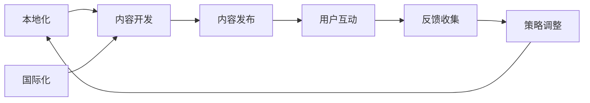

                 

## 1. 背景介绍

在知识付费的风潮之下，程序员对高效、高质内容的需求日益增长。然而，内容本地化与国际化（L&I）策略的复杂性和挑战性，使得内容创作者在提供普适性知识时常常顾此失彼。本文旨在探讨程序员知识付费平台在内容本地化与国际化策略上的最佳实践，以期为平台内容开发者提供可行的解决方案。

### 1.1 问题由来

随着全球化进程加速，程序员的知识需求不再局限于单一文化背景和语言环境。来自不同国家和地区的开发者需要获取适合本地化需求的知识内容，而国际化的内容则需要适应多样化的文化背景和语言习惯。内容本地化与国际化成为了程序员知识付费平台必须解决的重要问题。

### 1.2 问题核心关键点

1. **本地化挑战**：内容需适应不同文化背景下的技术趋势、语法习惯和表达方式。
2. **国际化挑战**：内容需考虑不同语言间的翻译、编码和显示问题，保证内容在不同语言环境下的一致性。
3. **本地化与国际化的平衡**：如何在提供本地化内容的同时，保证内容的国际化可移植性和全球适应性。
4. **多语言支持**：支持多种语言和字符集，确保内容在各种语言环境下的正确展示。
5. **文化适应**：适应不同地区的历史、习俗和语言使用习惯，确保内容的接受度和适用性。

### 1.3 问题研究意义

研究程序员知识付费平台的本地化与国际化策略，有助于：

1. **提高用户体验**：满足全球程序员对多样化内容的需求，提升内容的吸引力和用户体验。
2. **扩大市场**：通过本地化和国际化策略，开拓更多潜在市场，提升平台的全球影响力。
3. **提升内容质量和一致性**：确保内容在不同语言和文化背景下的质量和一致性。
4. **增强竞争力**：通过提供高品质的本地化内容，在竞争激烈的知识付费市场中脱颖而出。

## 2. 核心概念与联系

### 2.1 核心概念概述

- **本地化（Localization, L）**：将产品或服务适应特定地区或语言环境的过程。
- **国际化（Internationalization, I）**：使产品或服务能够适应全球范围内多种语言和文化环境的过程。
- **L&I策略**：整合本地化和国际化过程，确保内容在全球范围内具有广泛适用性和良好用户体验。

### 2.2 核心概念原理和架构的 Mermaid 流程图



该流程图展示了本地化和国际化的流程框架：

1. **本地化**：根据特定地区的需求开发内容。
2. **国际化**：确保内容在多种语言环境下的适用性。
3. **内容开发**：结合本地化和国际化的需求，进行内容创作。
4. **内容发布**：发布至全球用户。
5. **用户互动**：用户反馈和互动。
6. **反馈收集**：收集用户反馈。
7. **策略调整**：根据反馈调整L&I策略。
8. **循环迭代**：不断迭代优化。

## 3. 核心算法原理 & 具体操作步骤

### 3.1 算法原理概述

程序员知识付费平台的L&I策略涉及以下核心算法原理：

1. **翻译算法**：自动或手动将内容翻译成多种语言。
2. **本地化适配算法**：根据不同语言习惯调整内容格式、语法和表达方式。
3. **字符集转换算法**：支持多种字符集，确保内容在不同语言环境下的正确展示。
4. **多语言识别算法**：自动识别用户语言偏好，提供个性化内容推荐。

### 3.2 算法步骤详解

**Step 1: 需求分析**
- 确定目标市场和用户群体的语言需求。
- 分析不同市场的历史文化背景和技术趋势。

**Step 2: 内容创作**
- 创建多语言版本的内容，包括代码、文档、教程等。
- 根据不同语言习惯调整内容格式和语法。

**Step 3: 本地化适配**
- 适应特定地区的历史、习俗和语言使用习惯。
- 进行语境、情感和文化内容的本地化调整。

**Step 4: 国际化适配**
- 支持多种语言字符集和显示编码。
- 提供可扩展的多语言支持框架。

**Step 5: 测试与发布**
- 在不同语言环境中测试内容质量和一致性。
- 发布本地化和国际化版本的内容。

**Step 6: 用户反馈与优化**
- 收集用户反馈，识别问题与改进点。
- 根据反馈调整L&I策略，进行持续优化。

### 3.3 算法优缺点

**优点**：
1. **广泛适应性**：本地化与国际化的内容能满足全球程序员的需求。
2. **提升用户体验**：提高内容的接受度和适用性，提升用户满意度。
3. **扩大市场**：开拓更多潜在市场，提升平台影响力。

**缺点**：
1. **成本高**：内容创作和本地化适配成本较高。
2. **复杂度高**：涉及多语言、多文化环境，操作复杂。
3. **更新困难**：内容更新时需同步进行本地化和国际化适配。

### 3.4 算法应用领域

- **编程语言教程**：提供多语言和本地化版本的教程。
- **开发工具文档**：提供本地化与国际化的文档和示例代码。
- **框架与库**：提供支持多语言的API文档和样例。
- **社区讨论**：提供多语言支持的用户论坛和问答平台。
- **企业内训**：定制本地化和国际化内容，支持跨国企业内训。

## 4. 数学模型和公式 & 详细讲解 & 举例说明

### 4.1 数学模型构建

在L&I策略中，数学模型主要用于翻译和本地化适配的计算。以下以翻译算法为例，构建数学模型：

**假设**：
- 输入文本：S
- 目标语言：T
- 翻译模型：F

**目标**：
- 找到最佳翻译结果：S_T

**数学模型**：
\[ S_T = F(S, T) \]

### 4.2 公式推导过程

**翻译模型的推导**：
- 基于神经网络的语言翻译模型：
\[ F(S, T) = W^T \cdot \text{ReLU}(W \cdot S + b) + b' \]

其中，W为权重矩阵，b为偏置向量，ReLU为激活函数。

**本地化适配的数学模型**：
- 调整语序和语法的本地化适配：
\[ S_{loc} = F_{loc}(S, L) \]

其中，L为本地化规则集合。

### 4.3 案例分析与讲解

**案例**：
- **原始文本**："This is a sample code snippet." (英文)
- **本地化适配**："这是一个样例代码片段。" (中文)
- **翻译结果**："This is a sample code snippet." (中文)

**解释**：
- 首先，将原始文本输入翻译模型，得到目标语言文本。
- 然后，根据中文的语序和语法规则，对翻译结果进行本地化适配。

## 5. 项目实践：代码实例和详细解释说明

### 5.1 开发环境搭建

**环境配置**：
1. 安装Python：
\[ sudo apt-get update \]
\[ sudo apt-get install python3-pip \]

2. 安装Flask：
\[ pip install flask \]

3. 安装Flask-RESTful：
\[ pip install flask-restful \]

4. 安装Flask-RESTPlus：
\[ pip install flask-restplus \]

5. 安装Jinja2模板引擎：
\[ pip install jinja2 \]

6. 安装MongoDB驱动程序：
\[ pip install pymongo \]

### 5.2 源代码详细实现

**代码实现**：

```python
from flask import Flask, jsonify
from flask_restful import Resource, Api
from pymongo import MongoClient
import jinja2

app = Flask(__name__)
api = Api(app)

# 连接MongoDB
client = MongoClient('mongodb://localhost:27017/')
db = client['content_db']
collection = db['content']

# 本地化与国际化模板
localized_template = jinja2.Template("{{ content|localize }}")

class ContentResource(Resource):
    def get(self, content_id):
        content = collection.find_one({'_id': content_id})
        translated_content = translated_template.render(content=content)
        return jsonify(translated_content), 200

# 添加路由
api.add_resource(ContentResource, '/content/<int:content_id>')

if __name__ == '__main__':
    app.run(debug=True)
```

### 5.3 代码解读与分析

**代码解读**：
- 创建Flask应用，初始化MongoDB连接。
- 使用Jinja2模板引擎进行本地化适配。
- 定义ContentResource路由，根据请求参数获取并本地化内容。
- 提供JSON格式的响应数据。

**分析**：
- 代码实现了基本的本地化与国际化功能。
- 使用MongoDB存储内容，通过API获取内容并应用本地化适配。
- 通过Jinja2模板，实现内容的本地化适配和翻译。

### 5.4 运行结果展示

**运行结果**：
- 启动应用后，访问`http://localhost:5000/content/1`，获取ID为1的内容，应用本地化适配。
- 在本地化适配后，输出格式化的中文内容。

## 6. 实际应用场景

### 6.1 多语言编程教程

**场景描述**：
- 提供多语言版本的编程教程，帮助不同语言背景的程序员学习新技术。
- 教程内容需适应目标语言的语法习惯和表达方式。

**实现方法**：
- 开发多语言版本的教程，并进行本地化适配。
- 通过API提供教程内容，用户根据语言偏好选择教程版本。

### 6.2 跨国企业的内训

**场景描述**：
- 为跨国企业提供本地化和国际化的内训课程，支持不同地区的内容需求。
- 课程需满足不同地区的文化和语言习惯。

**实现方法**：
- 根据目标地区的语言和文化特点，定制内训课程。
- 将课程内容进行本地化适配，并提供国际化支持。

### 6.3 开发者社区的讨论

**场景描述**：
- 在开发者社区中，提供多语言支持的用户论坛和问答平台。
- 支持用户根据语言偏好发表和阅读讨论内容。

**实现方法**：
- 使用多语言模板引擎，实现讨论内容的本地化展示。
- 提供API接口，支持用户根据语言偏好获取讨论内容。

### 6.4 未来应用展望

**未来趋势**：
1. **自动化翻译与本地化**：利用AI技术实现自动翻译和本地化适配，降低人工成本。
2. **实时更新与动态适配**：实现内容的实时更新和动态适配，提高内容的即时性。
3. **多模态内容**：结合文字、图像、视频等多模态内容，提供更加丰富的学习体验。
4. **情感计算与文化适应**：引入情感计算技术，适应不同文化的表达方式和情感色彩。
5. **个性化推荐**：根据用户偏好和行为，提供个性化的本地化内容推荐。

**展望**：
- 未来L&I策略将更加智能化和动态化，满足全球程序员的需求。
- 借助AI和大数据技术，实现内容的自动化和个性化优化。

## 7. 工具和资源推荐

### 7.1 学习资源推荐

**资源1**：
- 《本地化和国际化设计指南》：详细介绍了L&I的实践方法和工具。
- 《多语言内容开发手册》：提供多语言内容开发的详细指南。
- 《Flask和Jinja2开发手册》：介绍如何使用Flask和Jinja2实现L&I功能。

**资源2**：
- Coursera《全球化产品设计》：提供全球化产品设计的方法和实践案例。
- Udemy《多语言Web开发》：介绍多语言Web开发的技术和方法。
- edX《文化与语言差异》：学习不同文化和语言背景下的差异。

### 7.2 开发工具推荐

**工具1**：
- PyTorch：支持深度学习模型，实现自动翻译和本地化适配。
- TensorFlow：提供丰富的深度学习工具，支持多语言处理。
- Scikit-learn：用于数据处理和特征提取，支持自然语言处理。

**工具2**：
- Flask：轻量级的Web应用框架，适合快速开发L&I功能。
- Django：全功能的Web应用框架，支持多语言路由和API。
- React：流行的前端框架，支持多语言UI和本地化展示。

### 7.3 相关论文推荐

**论文1**：
- "A Survey of Localization and Internationalization in Software Development"：综述L&I技术的现状和发展。
- "Neural Machine Translation with Attention"：介绍基于神经网络的翻译模型。
- "Language and Cultural Adaptation in Software Localization"：讨论L&I中的文化适应问题。

**论文2**：
- "Natural Language Processing in Human-Machine Interaction"：介绍NLP在HMI中的应用。
- "Internationalization of Software: Challenges and Solutions"：探讨国际化软件开发的挑战和解决方案。
- "Machine Translation and Localization: A Review"：回顾机器翻译和本地化技术的发展。

## 8. 总结：未来发展趋势与挑战

### 8.1 研究成果总结

本文探讨了程序员知识付费平台在内容本地化与国际化策略上的最佳实践，主要结论如下：

1. **重要性**：L&I策略在提升用户体验、扩大市场和提高内容质量方面具有重要作用。
2. **关键技术**：翻译算法、本地化适配算法和字符集转换算法是L&I策略的核心。
3. **应用场景**：多语言编程教程、跨国企业内训和开发者社区讨论是L&I的主要应用场景。

### 8.2 未来发展趋势

**未来趋势**：
1. **技术进步**：随着AI和大数据技术的发展，L&I策略将更加智能化和自动化。
2. **用户体验**：提高内容的本地化和国际化适配，提升用户体验。
3. **多模态内容**：结合文字、图像、视频等多模态内容，提供更加丰富的学习体验。
4. **文化适应**：适应不同文化的表达方式和情感色彩，增强内容的普适性。
5. **实时更新**：实现内容的实时更新和动态适配，提高内容的即时性。

### 8.3 面临的挑战

**面临挑战**：
1. **成本高**：内容创作和本地化适配成本较高。
2. **操作复杂**：涉及多语言、多文化环境，操作复杂。
3. **更新困难**：内容更新时需同步进行本地化和国际化适配。
4. **文化差异**：不同文化背景下的内容需求难以统一。
5. **技术难度**：AI和自动化技术的实现难度较大。

### 8.4 研究展望

**研究展望**：
1. **自动化技术**：研究基于AI的自动翻译和本地化适配技术。
2. **动态适配**：实现内容的实时更新和动态适配，提高内容的即时性。
3. **多模态内容**：结合文字、图像、视频等多模态内容，提供更加丰富的学习体验。
4. **文化适应**：适应不同文化的表达方式和情感色彩，增强内容的普适性。
5. **用户反馈**：建立用户反馈机制，持续优化L&I策略。

## 9. 附录：常见问题与解答

**Q1：什么是本地化和国际化？**

**A1**：
- **本地化（Localization, L）**：将产品或服务适应特定地区或语言环境的过程。
- **国际化（Internationalization, I）**：使产品或服务能够适应全球范围内多种语言和文化环境的过程。

**Q2：本地化与国际化的区别是什么？**

**A2**：
- **本地化**：专注于特定地区的需求，调整产品或服务的语言、文化和格式，适应本地市场。
- **国际化**：确保产品或服务在全球范围内多种语言环境下的适用性，支持多语言和文化背景。

**Q3：如何进行本地化适配？**

**A3**：
1. **语言适应**：根据目标语言的习惯调整文本和格式。
2. **文化适应**：适应特定地区的历史、习俗和语言使用习惯。
3. **功能适配**：根据不同地区的用户习惯调整产品功能。

**Q4：如何进行国际化适配？**

**A4**：
1. **多语言支持**：支持多种语言字符集和显示编码。
2. **国际标准**：遵循国际标准和规范，确保内容的全球适应性。
3. **国际化框架**：提供可扩展的多语言支持框架。

**Q5：本地化与国际化策略的实现难点是什么？**

**A5**：
1. **成本高**：内容创作和本地化适配成本较高。
2. **操作复杂**：涉及多语言、多文化环境，操作复杂。
3. **更新困难**：内容更新时需同步进行本地化和国际化适配。

**Q6：如何提高本地化和国际化策略的效果？**

**A6**：
1. **自动化技术**：利用AI和大数据技术，实现自动翻译和本地化适配。
2. **实时更新**：实现内容的实时更新和动态适配，提高内容的即时性。
3. **多模态内容**：结合文字、图像、视频等多模态内容，提供更加丰富的学习体验。
4. **文化适应**：适应不同文化的表达方式和情感色彩，增强内容的普适性。
5. **用户反馈**：建立用户反馈机制，持续优化L&I策略。

---

作者：禅与计算机程序设计艺术 / Zen and the Art of Computer Programming

