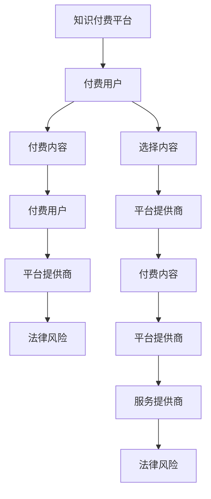

                 

# 程序员知识付费的法律风险与规避

## 1. 背景介绍

在信息爆炸的时代，知识付费平台迅速崛起，程序员群体也成为了知识付费的重要用户群体。各类编程课程、技术书籍、软件开发工具等层出不穷，满足了程序员对知识和技能的渴求。然而，在这繁荣的背后，程序员的知识付费也面临诸多法律风险。本文将从程序员知识付费的法律风险出发，探讨规避这些风险的策略。

## 2. 核心概念与联系

### 2.1 核心概念概述

- **知识付费**：是指用户为获取知识或技能而支付费用的行为。对于程序员而言，知识付费更多地表现为对编程技术、开发工具、设计模式等方面的课程或资源的付费。
- **法律风险**：在知识付费的过程中，用户可能会面临诸如侵权、版权、隐私等法律问题。这些风险不仅影响用户的经济利益，还可能对其个人名誉和职业发展产生负面影响。
- **规避策略**：指通过采取一系列合法合规的措施，减少或消除潜在的法律风险，确保知识付费活动在法律框架内顺利进行。

### 2.2 核心概念原理和架构的 Mermaid 流程图

此图展示知识付费平台、用户、内容和服务提供商之间的联系以及法律风险的传递路径。

## 3. 核心算法原理 & 具体操作步骤

### 3.1 算法原理概述

知识付费的法律风险主要源于版权、隐私保护、知识产权等方面。避免这些风险的关键在于合法合规地选择和获取付费内容，同时注意保护个人隐私和知识产权。

### 3.2 算法步骤详解

1. **内容选择与筛选**：程序员在选择知识付费内容时，应优先选择有版权保障、内容质量高且符合行业标准的学习资源。可以通过查看内容提供商的资质、用户评价等方式进行评估。
2. **平台选择与确认**：选择知名的、有良好口碑的知识付费平台，确保平台具备合规的经营资质和服务保障。
3. **隐私保护**：在知识付费过程中，应注意保护个人隐私信息，避免在公共场所或不安全的平台上进行支付和登录操作。
4. **知识产权保护**：避免盗版和侵权行为，尊重创作者的知识产权，不传播或使用未经授权的内容。
5. **合同签订与权益保护**：在购买付费内容时，仔细阅读合同条款，了解自己的权益和义务，确保合同内容合法合规。

### 3.3 算法优缺点

- **优点**：规避法律风险，保护个人和平台权益，提高知识付费体验的合法性。
- **缺点**：可能需要额外的时间和精力去进行内容选择和平台确认，增加了用户的使用成本。

### 3.4 算法应用领域

此算法原理可以应用于知识付费平台、付费用户、内容提供者等多个领域，通过合法合规的行为，降低法律风险，保障各方权益。

## 4. 数学模型和公式 & 详细讲解 & 举例说明

由于本文主要讨论法律风险的规避策略，数学模型的构建和公式推导并非重点，因此不做深入讲解。

## 5. 项目实践：代码实例和详细解释说明

由于本文主要涉及法律风险和规避策略，具体代码实例并非核心内容，因此不提供代码实现。

## 6. 实际应用场景

### 6.1 在线编程课程

程序员在购买在线编程课程时，应选择具备版权的课程资源，确保课程质量和内容的合规性。同时，注意保护自己的隐私信息，不使用公共Wi-Fi或容易被窃取的网络环境进行课程学习。

### 6.2 软件开发工具

程序员在购买和使用软件开发工具时，应确认工具的版权情况，避免购买盗版软件，同时遵守软件使用协议，保护软件著作权。

### 6.3 技术博客与论文

程序员在购买或阅读技术博客与论文时，应注意内容的版权问题，避免未经允许的复制和传播，同时注意保护自己的隐私，不泄露个人信息。

## 7. 工具和资源推荐

### 7.1 学习资源推荐

- **《程序员知识付费指南》**：由知名IT专家撰写，系统介绍了知识付费的法律风险与规避策略，适合程序员参考。
- **GitHub开源项目**：如CodeBetter、GitHubProjects等，提供大量开源编程资源和文档，程序员可以选择有版权保障的内容进行学习和研究。

### 7.2 开发工具推荐

- **Chrome浏览器**：具备隐私保护功能，可帮助程序员在公共网络环境下安全浏览知识付费平台。
- **Viola Desktop**：一款轻量级的桌面开发工具，可帮助程序员保护软件版权，避免盗版风险。

### 7.3 相关论文推荐

- **《知识付费的法律风险及其规避策略》**：详细分析了知识付费的法律风险，提出了一系列规避策略。
- **《程序员在线教育平台的技术与法律问题研究》**：探讨了在线教育平台的技术实现与法律问题，为程序员提供参考。

## 8. 总结：未来发展趋势与挑战

### 8.1 研究成果总结

知识付费作为信息时代的重要经济活动，对程序员的成长和职业发展具有重要意义。然而，伴随知识的不断增长和传播，知识付费的法律风险也不断增加。本文从法律风险的角度出发，提出了一系列规避策略，旨在帮助程序员在知识付费的过程中，既享受高质量的学习资源，又避免潜在的法律风险。

### 8.2 未来发展趋势

未来，知识付费领域将更加规范化和合规化，平台将加强对内容版权的审核和保护，用户将更加重视个人隐私和知识产权的保护。同时，随着AI和大数据技术的应用，知识付费的个性化推荐和内容推荐将更加精准，为程序员提供更好的学习体验。

### 8.3 面临的挑战

尽管知识付费的发展前景广阔，但仍面临诸多挑战。首先，版权保护和侵权问题仍然存在，需要进一步加强法律制度建设和技术手段的运用。其次，个人隐私和数据安全问题需要得到更多关注和保护。最后，技术发展的不平衡可能导致知识付费领域的资源不均等分配。

### 8.4 研究展望

为应对这些挑战，未来的研究应关注以下几个方面：
- **版权保护技术**：开发高效、安全的版权保护技术，防止侵权和盗版行为。
- **隐私保护技术**：加强隐私保护技术的研究，确保个人数据的安全性。
- **法律规范制定**：推动知识付费领域相关法律规范的制定，明确各方权利义务。
- **平台合规管理**：知识付费平台应加强内容审核和合规管理，确保平台内容的合法合规。

## 9. 附录：常见问题与解答

**Q1：程序员在购买知识付费内容时，应注意哪些法律问题？**

A: 程序员在购买知识付费内容时，应注意以下几点：
- 确认内容的版权情况，选择有版权保障的课程或资源。
- 仔细阅读合同条款，了解自己的权益和义务。
- 注意保护个人隐私信息，避免在公共网络环境下进行支付和登录操作。

**Q2：如何判断一个知识付费平台是否合规？**

A: 判断知识付费平台是否合规，可以从以下几个方面入手：
- 查看平台的经营资质和认证情况。
- 查阅用户评价和平台口碑，了解用户的使用体验。
- 了解平台的服务保障和售后政策，确保有完备的纠纷解决机制。

**Q3：如何保护自己的知识产权？**

A: 保护自己的知识产权，应注意以下几点：
- 在开发过程中，避免抄袭他人的代码和技术，确保作品的原创性。
- 在发布作品时，应注明版权信息和来源，避免版权纠纷。
- 及时更新和维护自己的作品，防止被他人盗版和侵权。

通过本文的系统梳理，可以看到，程序员在知识付费的过程中，需要具备一定的法律风险意识，采取合法合规的措施，才能最大限度地保护自己的权益。未来，随着知识付费领域的不断发展，相关法律规范和技术手段的不断完善，程序员的知识付费活动将更加规范和安全。总之，程序员在享受知识付费带来的便利和效益的同时，也要警惕潜在的法律风险，通过合理规避，确保知识付费活动的顺利进行。

