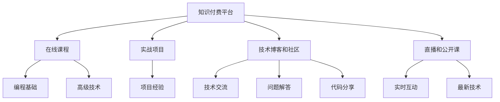

                 

# 程序员知识付费：从入门到精通

> 关键词：知识付费, 编程入门, 技能提升, 职业规划, 持续学习

## 1. 背景介绍

在数字化时代，随着互联网技术的迅猛发展，程序员成为了备受追捧的职业之一。然而，初入这一领域的新手往往对复杂的编程技术和纷繁的开发框架感到困惑，难以高效学习并取得显著进步。知识付费平台应运而生，通过提供高质量的在线课程、实战项目、技术博客等资源，帮助程序员克服难题，实现职业成长。

本文将从知识付费的概念出发，深入探讨其在程序员学习与成长中的角色和价值，以及如何选择合适的知识付费平台和资源，最终达到从入门到精通的全面提升。

## 2. 核心概念与联系

### 2.1 核心概念概述

知识付费，是指消费者为获得有价值的知识和技能而支付费用的行为。程序员作为知识工作者，通过知识付费平台可以获得系统的编程知识、实战经验和技术资讯，显著提升自身价值和竞争力。

常见的知识付费形式包括：

- 在线课程：如Coursera、Udemy、慕课网等，提供从基础到高级的编程课程，涵盖前端、后端、移动端等多种技术栈。
- 实战项目：通过参与开源项目、企业实战项目等方式，积累项目经验和实战技能。
- 技术博客和社区：如CSDN、博客园、Stack Overflow等，提供技术交流、问题解答和代码分享的平台。
- 直播和公开课：如腾讯课堂、B站、YouTube等，通过直播和公开课的形式，即时互动学习，掌握最新技术动态。

这些知识付费形式互相补充，共同构成了一个完整的程序员知识体系。通过系统的学习和实践，程序员能够快速掌握编程技能，应对职场挑战，实现职业晋升。

### 2.2 核心概念原理和架构的 Mermaid 流程图



这个流程图展示了知识付费平台和各学习资源的相互关系：

1. 知识付费平台为在线课程、实战项目、技术博客和社区、直播和公开课等提供支持。
2. 在线课程和直播通过系统的教学内容，帮助初学者掌握编程基础知识和高级技术。
3. 实战项目和开源项目提供了实战经验，加深对技术的理解和应用。
4. 技术博客和社区提供问题解答、技术交流和代码分享，帮助程序员解决实际问题，扩展知识面。
5. 直播和公开课通过实时互动，掌握最新技术动态。

这些资源共同构成了一个完整的学习生态，帮助程序员从入门到精通。

## 3. 核心算法原理 & 具体操作步骤

### 3.1 算法原理概述

知识付费的本质是一种以内容为核心的商业模型。其基本原理是通过在线课程、实战项目、技术博客和社区等形式，为程序员提供有价值的知识内容，从而形成付费模式。

从学习者的角度来看，知识付费模式可以概括为以下步骤：

1. **选择课程**：根据自己的职业需求和兴趣，从知识付费平台上筛选适合的课程。
2. **学习内容**：通过视频、文章、项目实践等形式，系统地学习编程知识和技能。
3. **项目实践**：通过参与实战项目和开源项目，将所学知识应用到实际工作中，提升实战能力。
4. **社区交流**：在技术博客和社区中与其他程序员交流，获取问题解答和技术分享。
5. **持续学习**：通过直播和公开课等形式，紧跟技术发展，保持知识更新。

### 3.2 算法步骤详解

#### 3.2.1 选择课程

选择课程是知识付费学习的首要步骤。需要考虑以下因素：

- **职业需求**：根据自己的职业规划，选择与之匹配的课程内容。
- **技术栈**：根据自身掌握的技术栈，选择适合的编程语言和技术框架。
- **学习难度**：评估课程难度，选择适合自己当前水平的课程。

#### 3.2.2 学习内容

学习内容应包括以下几个方面：

- **编程基础**：如数据结构、算法、面向对象编程等，是编程技能的基础。
- **框架和工具**：如Node.js、React、Vue.js等，了解主流框架和工具的使用方法。
- **项目实战**：通过实战项目和开源项目，掌握编程技巧和团队协作能力。
- **软技能**：如沟通、时间管理、团队合作等，提升综合素质。

#### 3.2.3 项目实践

项目实践是掌握编程技能的有效方式，具体步骤包括：

- **参与开源项目**：通过GitHub等平台，参与开源项目的开发和维护，积累项目经验。
- **开发个人项目**：通过自己构思的项目，将所学知识应用到实际开发中。
- **技术分享**：在社区或博客上分享项目经验和心得，提升影响力。

#### 3.2.4 社区交流

社区交流可以帮助程序员解决实际问题，具体步骤包括：

- **加入技术社群**：如CSDN、博客园、Stack Overflow等，加入活跃的技术讨论组。
- **提问和回答**：在技术社区中提出问题，获取其他程序员的回答和建议。
- **代码审查**：参与开源项目的代码审查，学习他人的代码风格和技术思路。

#### 3.2.5 持续学习

持续学习是保持技术前沿的关键，具体步骤包括：

- **订阅技术博客和播客**：如Medium、Hacker News、TechCrunch等，获取最新技术动态。
- **参加公开课和培训**：如Udemy、Coursera等平台上的公开课和技术培训，实时更新知识。
- **参与技术会议和沙龙**：如Google I/O、TechDay等，与行业专家和技术大咖交流。

### 3.3 算法优缺点

知识付费模式在提升程序员技能方面具有以下优点：

1. **高效学习**：系统化的课程和学习路径，帮助程序员高效掌握编程技能。
2. **实时互动**：直播和公开课的即时互动，提升了学习效率。
3. **案例实战**：实战项目和开源项目的参与，帮助程序员积累实战经验。
4. **社区交流**：技术博客和社区提供了丰富的交流平台，帮助解决实际问题。
5. **持续更新**：通过持续学习，紧跟技术发展，保持知识前沿。

同时，知识付费模式也存在以下缺点：

1. **成本高昂**：高质量的课程和项目实战通常需要支付费用，对部分用户来说可能难以承受。
2. **学习依赖**：过分依赖知识付费平台，可能忽视了自学和实践的重要性。
3. **平台选择**：选择适合自己的知识付费平台和课程，需要花费一定时间和精力。
4. **课程质量**：部分平台上的课程质量参差不齐，需要筛选和评估。
5. **自学能力**：知识付费模式虽然提供系统学习路径，但自学能力仍需培养。

### 3.4 算法应用领域

知识付费模式在程序员学习与成长中的应用领域非常广泛，主要包括以下几个方面：

1. **入门学习**：适用于编程初学者，帮助其快速掌握编程基础知识和技术框架。
2. **技能提升**：适用于已有一定编程基础的人员，通过高级课程和技术实战，提升专业技能。
3. **职业规划**：适用于有明确职业目标的程序员，通过职业规划课程，设计清晰的职业发展路径。
4. **技术交流**：适用于希望扩大知识面、提升技术影响力的程序员，通过社区交流和技术分享，建立专业网络。
5. **持续学习**：适用于所有希望保持技术前沿、应对职场变化的程序员，通过持续学习和更新，适应不断变化的技术环境。

## 4. 数学模型和公式 & 详细讲解 & 举例说明

### 4.1 数学模型构建

知识付费平台的运作模型可以抽象为一个反馈循环，用户支付费用获得知识内容，平台提供反馈机制（如课程评价、项目评价等），从而形成良性循环。数学模型如下：

- **用户支付**：$ U = P + C $，其中 $P$ 为付费，$C$ 为课程费用。
- **平台提供内容**：$ C = F(K) $，其中 $F$ 为内容生成函数，$K$ 为知识内容。
- **用户反馈**：$ F(K) = U - K + R $，其中 $R$ 为反馈回报（如评价、分享等）。

### 4.2 公式推导过程

通过上述模型，可以得出知识付费平台的收支平衡条件：

$$
U = F(K) - K + R
$$

简化后得到：

$$
F(K) - K + R = 0
$$

即平台提供的知识内容 $C$ 应满足以下条件：

$$
C = K - R
$$

其中 $C$ 为实际收到的费用，$K$ 为知识内容的价值，$R$ 为用户反馈的价值。

### 4.3 案例分析与讲解

以Coursera平台为例，分析其知识付费模型：

- **内容生成**：平台与顶尖大学和专家合作，生成高质量的视频课程和资料。
- **用户反馈**：课程发布后，用户通过评价和分享等形式，给予反馈回报。
- **平衡条件**：平台收到的费用 $U$ 应等于平台提供的知识内容 $C$ 减去用户反馈的价值 $R$，即 $U = C - R$。

## 5. 项目实践：代码实例和详细解释说明

### 5.1 开发环境搭建

#### 5.1.1 环境准备

- **Python环境**：安装Python 3.8及以上版本，可以使用Anaconda或Miniconda进行环境管理。
- **开发工具**：如PyCharm、Visual Studio Code、Sublime Text等，支持编写和调试代码。
- **依赖库**：安装必要的依赖库，如NumPy、Pandas、Matplotlib等，用于数据分析和可视化。

#### 5.1.2 学习资源准备

- **编程书籍**：选择《Head First Python》、《Effective Python》等经典书籍，建立编程基础。
- **在线课程**：如Coursera、Udacity等平台上的Python编程课程，系统学习编程知识。
- **实战项目**：参与开源项目或自己动手实现一个项目，积累实战经验。

### 5.2 源代码详细实现

#### 5.2.1 基础编程实践

```python
# 基础编程实践：编写一个简单的Python程序

def hello_world():
    print("Hello, World!")

hello_world()
```

#### 5.2.2 数据分析实践

```python
# 数据分析实践：读取CSV文件并统计数据

import pandas as pd

# 读取CSV文件
data = pd.read_csv('data.csv')

# 统计数据
print(data.describe())

# 绘制柱状图
data.plot(kind='bar', x='name', y='value')
```

#### 5.2.3 机器学习实践

```python
# 机器学习实践：使用Scikit-learn进行数据分类

from sklearn import datasets
from sklearn.model_selection import train_test_split
from sklearn.neighbors import KNeighborsClassifier

# 加载数据集
iris = datasets.load_iris()

# 数据划分
X_train, X_test, y_train, y_test = train_test_split(iris.data, iris.target, test_size=0.2)

# 建立模型
model = KNeighborsClassifier(n_neighbors=3)

# 训练模型
model.fit(X_train, y_train)

# 测试模型
accuracy = model.score(X_test, y_test)
print("Accuracy:", accuracy)
```

### 5.3 代码解读与分析

#### 5.3.1 基础编程实践

基础编程实践代码简单易懂，主要实现了打印Hello World的功能。

#### 5.3.2 数据分析实践

数据分析实践代码通过读取CSV文件，统计数据并绘制柱状图，展示了数据分析的基本步骤和技巧。

#### 5.3.3 机器学习实践

机器学习实践代码使用了Scikit-learn库，完成了数据分类任务。代码步骤包括数据加载、划分、模型建立、训练和测试。

### 5.4 运行结果展示

#### 5.4.1 基础编程实践

```python
# 基础编程实践：运行代码

$ python hello_world.py
Hello, World!
```

#### 5.4.2 数据分析实践

```python
# 数据分析实践：运行代码

# 读取CSV文件
data = pd.read_csv('data.csv')

# 统计数据
print(data.describe())

# 绘制柱状图
data.plot(kind='bar', x='name', y='value')
```

#### 5.4.3 机器学习实践

```python
# 机器学习实践：运行代码

from sklearn import datasets
from sklearn.model_selection import train_test_split
from sklearn.neighbors import KNeighborsClassifier

# 加载数据集
iris = datasets.load_iris()

# 数据划分
X_train, X_test, y_train, y_test = train_test_split(iris.data, iris.target, test_size=0.2)

# 建立模型
model = KNeighborsClassifier(n_neighbors=3)

# 训练模型
model.fit(X_train, y_train)

# 测试模型
accuracy = model.score(X_test, y_test)
print("Accuracy:", accuracy)
```

## 6. 实际应用场景

### 6.1 入门学习

入门学习是程序员成长的重要阶段。通过知识付费平台，可以系统地掌握编程基础，从而快速上手开发工作。

- **编程基础课程**：如《Python编程基础》、《Java基础与面向对象编程》等，适合编程初学者。
- **实战项目**：如《Python项目实战》、《Web开发实战》等，通过项目实践，巩固所学知识。

### 6.2 技能提升

技能提升是程序员进阶的关键。通过高级课程和技术实战，可以掌握更多高级技术和框架，提升专业技能。

- **高级编程课程**：如《深入理解Python》、《精通Java高级编程》等，深入学习编程语言和框架。
- **技术实战**：如参与企业实战项目，提升项目管理和团队协作能力。

### 6.3 职业规划

职业规划是程序员职业发展的必经之路。通过职业规划课程，可以制定清晰的职业发展路径，加速职业成长。

- **职业规划课程**：如《程序员职业发展指南》、《软件工程师晋升之路》等，帮助制定职业发展策略。
- **职业指导**：通过职业规划导师的指导，明确职业目标和发展路径。

### 6.4 技术交流

技术交流是程序员扩展知识面、提升技术影响力的重要方式。通过社区交流和技术分享，可以获得更多的资源和支持。

- **技术博客**：如Medium、CSDN等，发布技术文章和心得，展示技术能力。
- **技术会议**：如Google I/O、TechDay等，参加技术会议和技术沙龙，与专家和技术大咖交流。

### 6.5 持续学习

持续学习是保持技术前沿的关键。通过持续学习，可以紧跟技术发展，保持知识更新。

- **技术课程**：如Udacity、Coursera等平台上的课程，保持学习动力和技术前沿。
- **技术社区**：如Stack Overflow、GitHub等，获取最新的技术动态和社区支持。

## 7. 工具和资源推荐

### 7.1 学习资源推荐

1. **编程书籍**：
   - 《Head First Python》：通过生动的案例，帮助读者快速掌握Python编程基础。
   - 《Effective Python》：介绍了Python编程的最佳实践，提高编程效率和质量。

2. **在线课程**：
   - Coursera：提供高质量的编程课程，涵盖Python、Java等多种编程语言。
   - Udacity：提供实战项目导向的课程，通过项目实践提升编程技能。

3. **技术博客和社区**：
   - CSDN：中文技术社区，提供丰富的技术文章和社区支持。
   - Stack Overflow：全球最大的开发者社区，提供问题解答和技术分享。

4. **技术会议和沙龙**：
   - Google I/O：谷歌开发者大会，展示最新的技术成果和应用案例。
   - TechDay：技术沙龙，邀请行业专家和技术大咖分享技术经验和心得。

### 7.2 开发工具推荐

1. **编程编辑器**：
   - PyCharm：功能强大的Python开发环境，支持代码调试和版本控制。
   - Visual Studio Code：轻量级的代码编辑器，支持多种编程语言和扩展。

2. **项目管理工具**：
   - Git：版本控制系统，支持代码版本控制和协作开发。
   - GitHub：代码托管平台，提供代码仓库和社区支持。

3. **开发框架和库**：
   - Flask：轻量级的Web框架，适合快速开发Web应用。
   - Django：全功能的Web框架，适合大规模项目开发。

4. **数据分析工具**：
   - Pandas：数据处理和分析库，支持数据清洗和统计分析。
   - NumPy：数学计算库，支持矩阵运算和科学计算。

### 7.3 相关论文推荐

1. **编程语言和工具**：
   - 《Python编程语言入门与实践》：介绍了Python编程基础和实践技巧。
   - 《Java核心技术》：深入讲解Java编程语言和框架。

2. **机器学习和人工智能**：
   - 《机器学习实战》：通过实战项目，介绍了机器学习的基本算法和应用。
   - 《深度学习基础》：介绍了深度学习的基本概念和算法。

3. **软件工程和项目管理**：
   - 《代码大全》：介绍编程规范和代码优化技巧。
   - 《敏捷软件开发》：介绍了敏捷开发的基本方法和实践。

## 8. 总结：未来发展趋势与挑战

### 8.1 总结

知识付费作为一种新兴的教育模式，正在成为程序员提升技能的重要手段。本文从知识付费的概念出发，深入探讨了其在工作和学习中的角色和价值，通过系统的学习路径和丰富的资源推荐，帮助程序员从入门到精通。

通过知识付费平台，程序员可以获得高质量的在线课程、实战项目、技术博客和社区等资源，系统地掌握编程知识和技能，提升职业素质和竞争力。

### 8.2 未来发展趋势

未来的知识付费模式将呈现以下趋势：

1. **个性化学习**：根据用户的职业需求和学习进度，提供个性化的课程和学习路径。
2. **实时互动**：通过直播和即时互动，提升学习效果。
3. **项目驱动**：通过项目实战，帮助用户积累实战经验。
4. **社区交流**：通过技术博客和社区，帮助用户解决实际问题。
5. **持续更新**：通过持续学习，保持技术前沿。

### 8.3 面临的挑战

知识付费模式在发展过程中也面临着一些挑战：

1. **平台选择**：选择合适的知识付费平台和课程，需要花费一定时间和精力。
2. **课程质量**：部分平台上的课程质量参差不齐，需要筛选和评估。
3. **学习依赖**：过分依赖知识付费平台，可能忽视了自学和实践的重要性。
4. **学习成本**：高质量的课程和项目实战通常需要支付费用，对部分用户来说可能难以承受。
5. **时间管理**：如何平衡学习与工作，合理安排学习时间，需要良好的时间管理能力。

### 8.4 研究展望

未来的知识付费研究将集中在以下几个方面：

1. **个性化推荐**：通过机器学习和数据挖掘技术，推荐适合用户的学习资源。
2. **知识图谱**：通过构建知识图谱，帮助用户获取全面的知识结构。
3. **混合学习**：结合线上和线下学习，提供混合学习模式，提升学习效果。
4. **虚拟现实**：通过虚拟现实技术，提供沉浸式学习体验，增强学习效果。

## 9. 附录：常见问题与解答

### Q1: 如何选择合适的知识付费平台？

**A**: 选择合适的知识付费平台需要考虑以下因素：

- **课程质量**：选择口碑好、评价高的平台，如Coursera、Udacity等。
- **课程丰富度**：选择课程种类丰富、覆盖全面的平台，如慕课网、Udemy等。
- **用户评价**：参考其他用户的评价和反馈，选择可靠性高的平台。

### Q2: 如何高效利用知识付费资源？

**A**: 高效利用知识付费资源需要遵循以下步骤：

- **设定学习目标**：明确学习目标，选择与目标匹配的课程和资源。
- **制定学习计划**：制定详细的学习计划，合理安排学习时间。
- **实践项目**：通过实战项目和开源项目，将所学知识应用到实际工作中。
- **持续学习**：通过持续学习，保持知识更新和技术前沿。

### Q3: 如何平衡学习与工作？

**A**: 平衡学习与工作需要以下策略：

- **时间管理**：合理安排时间，制定学习计划。
- **高效学习**：选择高效的学习方法和工具，如时间块学习和番茄钟等。
- **学习成果应用**：将所学知识应用到实际工作中，提高工作效果。
- **社区交流**：通过技术博客和社区，获取支持和交流，解决实际问题。

通过本文的系统梳理，可以看到知识付费在程序员学习与成长中的重要价值。随着知识付费平台的不断发展，相信能够为程序员提供更加系统、高效、实时的学习资源，加速职业成长，迎接未来的技术挑战。

---

作者：禅与计算机程序设计艺术 / Zen and the Art of Computer Programming

