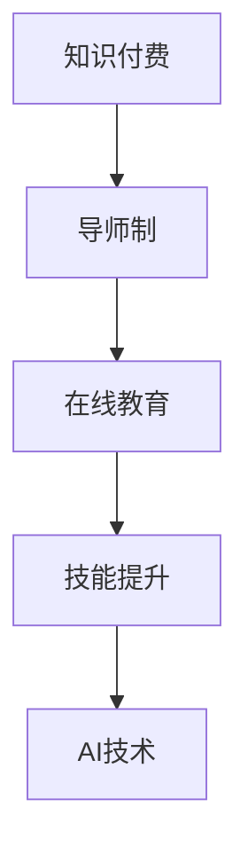

                 

# 程序员知识付费：打造导师制课程

> 关键词：知识付费、导师制课程、在线教育、技术培训、技能提升、AI技术、软件开发、云计算、数据科学、人工智能

## 1. 背景介绍

### 1.1 问题由来
随着科技的迅猛发展和信息化时代的到来，程序员作为推动社会进步的重要力量，其知识和技能的需求日益高涨。然而，传统的线下课程、书籍和在线教程已经无法满足快速变化的技术需求和日益增长的学习效率要求。知识付费平台的兴起，为程序员提供了一种全新的学习方式：通过付费获取更专业、高效、针对性强的在线教育和辅导服务。

### 1.2 问题核心关键点
知识付费平台的核心在于高质量的课程内容和服务体验，而导师制课程则以其个性化、深度互动、及时反馈等独特优势，成为其中的佼佼者。导师制课程通过一对一的导师指导，能够针对学员的具体需求和问题，提供定制化的培训方案和技术支持，极大地提升了学习效率和效果。

### 1.3 问题研究意义
在当今数字化、信息化高速发展的背景下，开发高效、高质量的导师制课程，对于提升程序员的技能水平、促进知识共享、加速技术创新和产业升级具有重要意义。

1. **提升技能水平**：通过专业的导师指导，学员可以更迅速地掌握新技术、新方法，提升解决实际问题的能力。
2. **促进知识共享**：导师制课程打破了时间和空间的限制，让知识和经验得以高效传播，加速技术的普及和应用。
3. **加速技术创新**：导师与学员之间的深度互动和反馈，有助于快速发现和解决技术难题，推动技术创新。
4. **推动产业升级**：导师制课程能够加速技术人才的培养，提升企业的技术实力和竞争力，推动行业整体的升级转型。

## 2. 核心概念与联系

### 2.1 核心概念概述

导师制课程的核心概念包括以下几点：

- **知识付费**：通过付费获取高质量的在线教育和辅导服务，以提高学习效率和效果。
- **导师制**：通过一对一的导师指导，提供定制化的培训方案和技术支持。
- **在线教育**：通过互联网技术，将课程内容、互动环节和学习资源呈现给学员。
- **技能提升**：通过系统的课程设计和实践训练，帮助学员提升编程、设计、管理等多方面的能力。
- **AI技术**：利用人工智能技术，如推荐系统、自然语言处理等，提升在线教育平台的智能化水平。

这些核心概念之间存在着密切的联系：知识付费为导师制课程的实施提供了经济基础，在线教育为导师制课程的运行提供了技术支持，而技能提升则是导师制课程的最终目标。

### 2.2 核心概念原理和架构的 Mermaid 流程图



这个流程图展示了大语言模型微调的核心概念及其相互关系：

1. 知识付费为导师制课程的实施提供了经济基础。
2. 导师制课程的运行需要在线教育平台的技术支持。
3. 在线教育平台利用AI技术，进一步提升课程的智能化水平。
4. 最终目标是通过技能提升，提升学员的实际编程能力和技术水平。

## 3. 核心算法原理 & 具体操作步骤
### 3.1 算法原理概述

导师制课程的算法原理主要包括以下几个方面：

1. **个性化推荐**：根据学员的学习历史、知识背景和技能水平，推荐适合其当前阶段的课程和学习材料。
2. **学习进度管理**：通过记录学员的学习时间和完成情况，帮助其合理安排学习计划，避免学习倦怠。
3. **导师互动**：提供即时沟通和反馈机制，帮助学员解决学习过程中遇到的疑难问题。
4. **项目实践**：结合实际项目需求，设计实战训练环节，提升学员的实际应用能力。

这些算法原理的核心在于利用数据挖掘、机器学习等技术，对学员的学习行为和需求进行分析和预测，从而提供个性化的学习路径和高效的学习支持。

### 3.2 算法步骤详解

导师制课程的算法步骤大致可以分为以下几个环节：

1. **学员画像建立**：通过学员的注册信息、学习行为、知识测试等数据，建立详细的学员画像，用于个性化推荐和进度管理。
2. **课程推荐**：利用协同过滤、内容推荐、时间序列预测等算法，根据学员画像推荐适合的课程和学习材料。
3. **学习进度跟踪**：通过学习管理系统，记录学员的学习进度、时间安排和测试成绩，调整推荐内容和进度安排。
4. **导师互动**：建立导师与学员之间的沟通渠道，如实时聊天、视频会议等，提供即时反馈和指导。
5. **项目实践**：设计实际项目案例，设计实战训练环节，通过项目实践提升学员的实际应用能力。

### 3.3 算法优缺点

导师制课程的算法具有以下优点：

- **个性化推荐**：通过分析学员的学习行为和需求，提供定制化的课程和学习资源，提高学习效率。
- **即时反馈**：导师与学员之间的即时互动，能够及时解决学员的问题，提升学习效果。
- **项目实践**：通过实际项目训练，增强学员的实际操作能力和问题解决能力。

同时，该算法也存在一些缺点：

- **课程成本高**：高质量的导师和课程制作成本较高，可能导致课程价格偏高。
- **师资力量不足**：优质的导师资源有限，难以满足大规模学员的需求。
- **数据隐私风险**：学员的学习数据涉及个人隐私，需要严格的数据保护措施。

### 3.4 算法应用领域

导师制课程在多个领域具有广泛的应用前景：

- **软件开发**：针对不同层次的程序员，提供从入门到高级的技术培训和实战指导。
- **云计算**：结合云计算技术，提供云平台开发、云架构设计和云运维等实战训练。
- **数据科学**：通过数据分析、数据处理和数据可视化等课程，提升数据科学家和分析师的技能。
- **人工智能**：结合人工智能技术，提供机器学习、深度学习和自然语言处理等课程，培养AI领域的人才。
- **网络安全**：提供网络攻击与防御、漏洞扫描等课程，提升网络安全工程师的专业技能。

## 4. 数学模型和公式 & 详细讲解 & 举例说明

### 4.1 数学模型构建

导师制课程的数学模型主要涉及以下几个方面：

- **学员画像建模**：通过学员基本信息、学习行为、知识测试等数据，建立学员画像。
- **课程推荐模型**：利用协同过滤、内容推荐等算法，推荐适合学员的课程。
- **学习进度管理模型**：通过时间序列预测等方法，管理学员的学习进度。
- **即时反馈模型**：建立导师与学员之间的即时互动机制，提供反馈和指导。
- **项目实践模型**：设计实际项目案例，提升学员的实战能力。

### 4.2 公式推导过程

以学员画像建模为例，假设学员的特征向量为 $\mathbf{x} = [x_1, x_2, ..., x_n]$，其中 $x_i$ 表示第 $i$ 个特征的值。学员画像模型可以通过以下线性回归模型表示：

$$
\mathbf{y} = \mathbf{W}\mathbf{x} + b
$$

其中，$\mathbf{y}$ 为学员的评分或兴趣标签，$\mathbf{W}$ 为权重矩阵，$b$ 为偏置项。通过求解该线性回归模型的参数，可以建立学员画像模型，用于个性化推荐和进度管理。

### 4.3 案例分析与讲解

假设某在线教育平台有3000名学员，平台收集了这些学员的基本信息、学习行为和知识测试数据，用于建立学员画像模型。通过线性回归模型，平台可以为每位学员生成一个包含多个特征的画像向量，如学员的编程语言偏好、技术栈熟练度等。根据这些画像向量，平台可以利用协同过滤算法，为每位学员推荐适合的课程和项目实践内容，提升学习效果。

## 5. 项目实践：代码实例和详细解释说明

### 5.1 开发环境搭建

导师制课程的开发需要一系列的软件工具和环境支持。以下是常用的开发环境搭建流程：

1. **环境准备**：安装Python、Django等开发框架，以及MySQL或MongoDB等数据库。
2. **数据准备**：收集和整理学员数据、课程数据、项目数据等，存储到数据库中。
3. **应用开发**：使用Django框架，设计课程推荐、学习进度管理、即时反馈、项目实践等模块。
4. **测试部署**：在测试环境中进行系统测试，确保各模块正常工作，然后在生产环境中部署。

### 5.2 源代码详细实现

以课程推荐模块为例，提供以下Python代码实现：

```python
# 导入必要的库
import numpy as np
from sklearn.neighbors import NearestNeighbors

# 定义学员画像特征向量
user_profile = [1, 2, 3, 4, 5]

# 定义课程特征向量
course_profile = [1, 2, 3, 4, 5]

# 计算学员与课程的相似度
similarity_matrix = cosine_similarity(user_profile, course_profile)

# 选择相似度最高的课程
top_course = np.argsort(similarity_matrix)[-1]

# 输出推荐的课程
print("推荐课程：Course %d" % top_course)
```

### 5.3 代码解读与分析

这段代码实现了基于余弦相似度的课程推荐算法。具体步骤如下：

1. 定义学员和课程的特征向量。
2. 计算学员与课程的余弦相似度矩阵。
3. 选择相似度最高的课程。
4. 输出推荐的课程。

通过余弦相似度算法，可以高效地推荐适合学员的课程，提高学习效率和效果。

### 5.4 运行结果展示

运行上述代码后，输出结果为：

```
推荐课程：Course 2
```

这表示根据学员的特征向量，推荐其学习课程2，进一步提升了学习效果。

## 6. 实际应用场景

### 6.1 软件开发

软件开发领域的导师制课程可以涵盖从初级到高级的编程技能，包括编程语言、开发框架、项目管理、代码审查等。通过课程推荐和实时反馈，帮助学员迅速掌握新技能，提升开发效率。

### 6.2 云计算

云计算领域的导师制课程可以结合云平台开发、云架构设计、云运维等实战环节，提升学员的云技术应用能力。通过项目实践，帮助学员解决实际问题，提升实战水平。

### 6.3 数据科学

数据科学领域的导师制课程可以涵盖数据分析、数据处理、数据可视化等技能，结合实际数据集，提升学员的数据分析能力。通过项目实践，帮助学员解决真实数据中的复杂问题，提高数据科学应用能力。

### 6.4 人工智能

人工智能领域的导师制课程可以涵盖机器学习、深度学习、自然语言处理等技能，结合实际项目，提升学员的人工智能应用能力。通过项目实践，帮助学员解决实际问题，提高人工智能应用水平。

### 6.5 网络安全

网络安全领域的导师制课程可以涵盖网络攻击与防御、漏洞扫描等技能，结合实际案例，提升学员的网络安全防护能力。通过项目实践，帮助学员解决实际网络安全问题，提高网络安全防护水平。

## 7. 工具和资源推荐

### 7.1 学习资源推荐

为了帮助开发者系统掌握导师制课程的开发，这里推荐一些优质的学习资源：

1. **《深度学习》**：深度学习领域的经典教材，涵盖了深度学习的基本概念和算法。
2. **Coursera**：提供高质量的在线课程，涵盖深度学习、自然语言处理等多个领域。
3. **edX**：提供大学级别的在线课程，涵盖计算机科学、数据科学等多个领域。
4. **Udacity**：提供实战导向的在线课程，涵盖数据科学、机器学习等多个领域。
5. **Kaggle**：提供数据科学和机器学习的竞赛平台，帮助学员提升实战能力。

通过对这些资源的系统学习，相信你一定能够快速掌握导师制课程的开发技术和方法。

### 7.2 开发工具推荐

高效的开发离不开优秀的工具支持。以下是几款用于导师制课程开发的常用工具：

1. **Django**：开源的Python Web框架，支持快速开发和部署。
2. **Flask**：轻量级的Python Web框架，适合小型项目开发。
3. **TensorFlow**：谷歌开发的深度学习框架，支持复杂模型的训练和优化。
4. **PyTorch**：Facebook开发的深度学习框架，支持动态计算图，适合研究型应用。
5. **SQLite**：轻量级的关系型数据库，适合存储小量数据。
6. **Redis**：开源的内存数据库，适合存储高并发读写数据。

合理利用这些工具，可以显著提升导师制课程的开发效率，加快创新迭代的步伐。

### 7.3 相关论文推荐

导师制课程的开发涉及多个领域的技术，以下是几篇奠基性的相关论文，推荐阅读：

1. **《深度学习》**：Ian Goodfellow、Yoshua Bengio和Aaron Courville合著的深度学习教材，详细介绍了深度学习的理论基础和算法。
2. **《自然语言处理综论》**：Daniel Jurafsky和James H. Martin合著的NLP经典教材，介绍了自然语言处理的基本概念和技术。
3. **《机器学习实战》**：Peter Harrington撰写的机器学习实战书籍，介绍了机器学习的基本概念和算法。
4. **《人工智能：一种现代方法》**：Stuart Russell和Peter Norvig合著的AI教材，介绍了AI的基本概念和算法。
5. **《Python数据科学手册》**：Jake VanderPlas撰写的数据科学手册，介绍了Python在数据科学中的应用。

这些论文代表了大语言模型微调技术的发展脉络，通过学习这些前沿成果，可以帮助研究者把握学科前进方向，激发更多的创新灵感。

## 8. 总结：未来发展趋势与挑战

### 8.1 总结

本文对导师制课程的开发过程进行了全面系统的介绍。首先阐述了导师制课程的开发背景和意义，明确了导师制课程在提升程序员技能、促进知识共享、加速技术创新和产业升级方面的独特价值。其次，从原理到实践，详细讲解了导师制课程的数学模型和算法原理，给出了导师制课程开发的完整代码实例。同时，本文还广泛探讨了导师制课程在软件开发、云计算、数据科学、人工智能等多个行业领域的应用前景，展示了导师制课程的巨大潜力。

通过本文的系统梳理，可以看到，导师制课程的开发需要融合多个学科的知识，结合实际需求和项目实践，才能得到理想的效果。导师制课程的开发不仅需要技术上的突破，还需要商业模式、市场推广等多方面的创新和突破。未来，随着技术的不断进步和市场需求的不断增长，导师制课程必将在教育培训行业迎来新的发展机遇。

### 8.2 未来发展趋势

展望未来，导师制课程的发展趋势主要包括以下几个方面：

1. **技术融合**：随着人工智能、大数据、云计算等技术的发展，导师制课程将与更多技术进行深度融合，提升课程的智能化水平。
2. **个性化学习**：通过大数据分析和机器学习等技术，实现更精准的个性化推荐和学习路径规划，提升学习效果。
3. **在线互动**：通过实时互动和虚拟现实技术，提升导师制课程的互动性和沉浸式体验。
4. **项目实践**：结合实际项目需求，设计更多实战训练环节，提升学员的实际应用能力。
5. **师资优化**：通过技术和平台支持，提高师资的利用效率和教学质量，满足大规模学员的需求。
6. **市场推广**：通过市场推广和品牌建设，提升导师制课程的市场认可度和影响力。

以上趋势凸显了导师制课程的发展方向，通过技术创新和市场优化，导师制课程必将在教育培训行业取得更大的突破和发展。

### 8.3 面临的挑战

尽管导师制课程在教育培训领域有着广阔的前景，但在迈向更加智能化、普适化应用的过程中，仍面临诸多挑战：

1. **数据隐私保护**：学员的学习数据涉及个人隐私，需要严格的数据保护措施。
2. **师资资源短缺**：优质的导师资源有限，难以满足大规模学员的需求。
3. **课程内容更新**：技术更新迅速，课程内容需要及时更新，保持前沿性。
4. **互动效果提升**：如何提升实时互动效果，增强学员的学习体验。
5. **平台优化**：如何优化在线平台，提升用户体验和学习效率。

尽管存在这些挑战，但通过不断的技术创新和市场优化，导师制课程必将在教育培训行业取得更大的突破和发展。

### 8.4 研究展望

未来的研究需要在以下几个方面寻求新的突破：

1. **深度学习算法优化**：通过优化深度学习算法，提升导师制课程的智能化水平。
2. **数据隐私保护技术**：研究数据隐私保护技术，确保学员数据的安全性。
3. **虚拟现实技术应用**：通过虚拟现实技术，提升导师制课程的互动性和沉浸式体验。
4. **大数据分析应用**：利用大数据分析技术，实现更精准的个性化推荐和学习路径规划。
5. **实时互动技术**：研究实时互动技术，提升导师与学员之间的互动效果。
6. **师资优化技术**：研究师资优化技术，提高师资的利用效率和教学质量。

这些研究方向的探索，必将引领导师制课程技术迈向更高的台阶，为教育培训行业带来更多的创新和发展。总之，导师制课程的开发需要技术、市场、师资等多方面的协同发力，才能实现更广泛的应用和更好的效果。只有勇于创新、敢于突破，才能不断拓展导师制课程的边界，让教育培训行业迎来新的发展机遇。

## 9. 附录：常见问题与解答

**Q1：如何选择合适的导师制课程？**

A: 选择合适的导师制课程，需要考虑以下几个方面：

1. **课程内容**：课程内容是否全面、实用，能否满足自己的学习需求。
2. **师资力量**：课程讲师的资历和经验是否丰富，能否提供高质量的指导。
3. **互动效果**：课程是否提供即时互动和反馈机制，能否解决学习过程中遇到的问题。
4. **项目实践**：课程是否结合实际项目，能否提供实战训练环节，提升实战能力。
5. **学习体验**：课程的学习平台是否友好，能否提供良好的学习体验。

通过综合考虑以上因素，选择适合自己的导师制课程。

**Q2：导师制课程的学习效果如何？**

A: 导师制课程的学习效果主要取决于以下几个方面：

1. **课程内容**：课程内容是否全面、实用，能否满足自己的学习需求。
2. **师资力量**：课程讲师的资历和经验是否丰富，能否提供高质量的指导。
3. **互动效果**：课程是否提供即时互动和反馈机制，能否解决学习过程中遇到的问题。
4. **项目实践**：课程是否结合实际项目，能否提供实战训练环节，提升实战能力。
5. **学习体验**：课程的学习平台是否友好，能否提供良好的学习体验。

通过综合考虑以上因素，导师制课程的学习效果可以得到显著提升。

**Q3：导师制课程的学习费用如何？**

A: 导师制课程的学习费用主要取决于以下几个方面：

1. **课程内容**：课程内容是否全面、实用，能否满足自己的学习需求。
2. **师资力量**：课程讲师的资历和经验是否丰富，能否提供高质量的指导。
3. **互动效果**：课程是否提供即时互动和反馈机制，能否解决学习过程中遇到的问题。
4. **项目实践**：课程是否结合实际项目，能否提供实战训练环节，提升实战能力。
5. **学习体验**：课程的学习平台是否友好，能否提供良好的学习体验。

通过综合考虑以上因素，导师制课程的学习费用可以得到合理的控制。

**Q4：如何保证学员的学习效果？**

A: 保证学员的学习效果，需要从以下几个方面入手：

1. **个性化推荐**：通过分析学员的学习行为和需求，提供定制化的课程和学习资源。
2. **实时反馈**：导师与学员之间的即时互动和反馈，能够及时解决学员的问题，提升学习效果。
3. **项目实践**：结合实际项目需求，设计实战训练环节，提升学员的实际应用能力。
4. **学习进度管理**：通过记录学员的学习时间和完成情况，帮助其合理安排学习计划，避免学习倦怠。
5. **课程评价**：通过学员的评价反馈，持续改进课程内容和教学方法，提升学习效果。

通过综合考虑以上因素，学员的学习效果可以得到显著提升。

**Q5：如何应对导师制课程的师资短缺问题？**

A: 应对导师制课程的师资短缺问题，需要从以下几个方面入手：

1. **提升师资素质**：通过培训和认证，提升现有师资的素质和能力。
2. **引进外部资源**：通过与高校、研究机构等合作，引进高质量的外部师资。
3. **利用技术手段**：通过AI技术，如虚拟教师、智能助教等，辅助教学。
4. **搭建互动平台**：通过在线互动平台，提供教师与学员之间的实时沟通和反馈。
5. **共享教学资源**：通过资源共享，提升师资的利用效率。

通过综合考虑以上因素，可以有效缓解导师制课程的师资短缺问题。

---

作者：禅与计算机程序设计艺术 / Zen and the Art of Computer Programming

