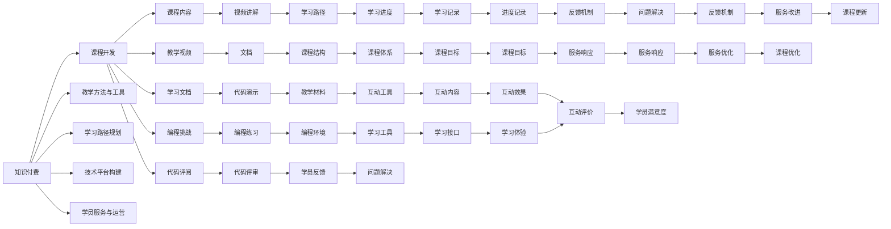

                 

# 程序员知识付费：打造线上课程

> 关键词：知识付费, 线上课程, 课程开发, 在线教育, 课程设计

## 1. 背景介绍

### 1.1 问题由来
随着互联网和移动设备的普及，在线教育逐渐成为学习的主流方式之一。传统的线下教育资源匮乏、成本高昂、时间地点限制等问题，逐渐被互联网教育的灵活性和便捷性所取代。然而，面对海量课程资源，如何选择优质课程、高效学习、获得最佳学习体验，成为一个新的挑战。

程序员知识付费现象的兴起，正是基于在线教育时代的需求驱动。随着互联网技术的发展和普及，越来越多的程序员通过付费订阅在线课程，提升自身技能，推动了知识付费的兴起。

### 1.2 问题核心关键点
程序员知识付费的核心在于如何高效、便捷、系统化地构建优质的在线课程，并提供丰富的学习资源，帮助程序员快速掌握新技能，实现职业成长。

这其中涉及的决策点和关键问题包括：

- **课程内容的选择与设计**：选择符合程序员需求的课程内容，并进行有深度的系统化设计。
- **教学方法与工具的选择**：根据课程特点，选择适合的互动工具和教学方法，提升学习效果。
- **学习路径规划**：规划系统的学习路径，帮助学员按需学习，逐步提升技能。
- **技术平台构建**：选择或构建技术平台，提供课程的发布、管理和学习等功能。
- **学员服务与运营**：提供高效的学员服务与运营支持，如学习进度跟踪、问题反馈、社区交流等。

### 1.3 问题研究意义
在程序员知识付费浪潮中，打造优质在线课程，不仅能够帮助程序员系统化、高效化地提升技能，还能够为教育机构、技术社区、知识平台等提供新的盈利模式和价值增长点。

课程的成功打造，有助于：

- 提高程序员技能，推动技术创新与产业升级。
- 帮助教育机构降低教育成本，提高教育质量和覆盖面。
- 为知识平台创造新的收入来源，提升市场竞争力。
- 形成内容生态，促进技术与教育的深度融合。

## 2. 核心概念与联系

### 2.1 核心概念概述

为更好地理解程序员知识付费和线上课程的构建，本节将介绍几个关键概念：

- **知识付费**：指通过付费方式获取优质知识资源的商业模式。程序员知识付费强调的是通过专业课程和技术资源，帮助程序员提升编程技能和职业竞争力。
- **线上课程**：指通过互联网平台提供的学习课程，包括视频讲解、文档、代码演示等多样化学习资源。
- **课程开发**：指根据课程目标和学员需求，设计和制作课程内容、教学资源、互动工具等的过程。
- **教学方法与工具**：指在课程开发中使用的互动教学工具和方法，如交互式练习、编程挑战、代码评阅等。
- **学习路径规划**：指为课程设置合理的学习顺序和结构，帮助学员按照预期目标逐步提升技能。
- **技术平台构建**：指开发或选择合适的技术平台，提供课程的管理、发布、学习等功能。
- **学员服务与运营**：指对学员提供的学习进度跟踪、问题反馈、社区交流等服务，提升学员体验。

这些概念之间具有紧密联系，共同构成了程序员知识付费和线上课程开发的系统框架。

### 2.2 核心概念原理和架构的 Mermaid 流程图



该流程图展示了知识付费和课程开发的整个流程，以及各环节之间的紧密联系。

## 3. 核心算法原理 & 具体操作步骤

### 3.1 算法原理概述

程序员知识付费的线上课程开发，本质上是一个系统的需求分析、内容设计、技术实现和运营支持的过程。

**算法原理**：

- **需求分析**：通过市场调研、用户访谈、需求反馈等手段，分析目标受众的需求、痛点和期望。
- **课程设计**：根据需求分析结果，设计课程内容、结构、进度和互动方式。
- **技术实现**：选择合适的技术平台和工具，实现课程内容的制作、管理和学习功能。
- **运营支持**：提供学员服务与运营支持，如进度跟踪、问题反馈、社区交流等，确保课程高效运行。

### 3.2 算法步骤详解

**算法步骤**：

1. **需求调研**：
   - 进行市场调研，收集目标受众的需求和痛点。
   - 进行用户访谈，了解学员的具体需求和期望。
   - 收集反馈，分析受众的痛点和期望。

2. **课程设计**：
   - 根据需求分析结果，设计课程内容、结构、进度和互动方式。
   - 制定课程大纲和教学计划。
   - 确定教学目标和预期成果。

3. **内容制作**：
   - 制作教学视频、文档、代码示例等课程内容。
   - 设计编程挑战、代码评阅等互动工具。
   - 选择技术平台和工具，实现课程内容的发布和管理。

4. **技术实现**：
   - 选择合适的技术平台和工具，如教育云平台、在线视频平台等。
   - 开发课程发布和管理功能，如课程创建、内容上传、学员管理等。
   - 实现学习功能，如视频播放、代码运行、进度跟踪等。

5. **运营支持**：
   - 提供学员服务与运营支持，如学习进度跟踪、问题反馈、社区交流等。
   - 定期收集学员反馈，优化课程内容和教学方法。
   - 维护技术平台和工具，确保课程的高效运行。

### 3.3 算法优缺点

**算法优点**：

- **灵活性**：线上课程可以灵活调整课程内容和学习进度，适应学员的多样化需求。
- **可访问性**：在线课程打破了时间和地点的限制，学员可以随时随地学习。
- **互动性**：互动工具和教学方法，提升了学员的学习效果和参与感。

**算法缺点**：

- **质量控制**：在线课程缺乏传统面授课程的即时反馈和互动，质量控制难度较大。
- **技术门槛**：需要一定的技术实力和资源，开发和维护在线课程平台。
- **学习效果**：线上课程的效果和动机，容易受到学员自控力和外界干扰的影响。

### 3.4 算法应用领域

程序员知识付费的线上课程开发，已经在多个领域得到广泛应用，包括但不限于：

- **技术社区**：通过课程开发和技术分享，提升社区活跃度和用户粘性。
- **教育机构**：利用在线课程平台，提供高质量的技术教育资源。
- **知识平台**：如Coursera、Udacity等，通过课程和认证体系，提供技术教育和职业培训。
- **企业培训**：如Google的内部技术培训课程，提升员工技能，推动技术创新。

## 4. 数学模型和公式 & 详细讲解 & 举例说明

### 4.1 数学模型构建

为了更好地描述程序员知识付费和线上课程的开发过程，我们可以构建一个数学模型：

**目标函数**：

$$
\min_{x} \left\{ \sum_{i=1}^{n} f_i(x_i) + \lambda \cdot g(x) \right\}
$$

其中 $x$ 为课程开发的各个变量，$f_i(x_i)$ 为第 $i$ 个目标函数，$g(x)$ 为约束条件。

**目标函数解释**：

- $f_i(x_i)$ 代表课程设计的各项指标，如课程内容的质量、互动性、教学方法等。
- $g(x)$ 代表技术实现和运营支持的各项约束条件，如学员的满意度、学习进度、问题反馈等。

### 4.2 公式推导过程

**公式推导**：

- **课程设计优化**：
  - 设定课程内容质量 $C$ 和互动性 $I$，通过调研和用户反馈，计算 $C$ 和 $I$ 的权重和期望值。
  - 使用决策树或遗传算法等优化方法，计算最优的课程设计方案。

- **技术实现优化**：
  - 设定技术平台选择 $P$ 和工具选择 $T$，通过成本和效率评估，计算 $P$ 和 $T$ 的权重和期望值。
  - 使用线性规划或整数规划等方法，计算最优的技术实现方案。

- **运营支持优化**：
  - 设定学员满意度 $S$ 和问题反馈 $F$，通过调查和反馈，计算 $S$ 和 $F$ 的权重和期望值。
  - 使用多目标优化方法，计算最优的运营支持方案。

### 4.3 案例分析与讲解

**案例分析**：

- **案例1**：某技术社区通过线上课程开发，提升社区活跃度和用户粘性。
  - **需求调研**：通过问卷和访谈，收集社区成员的课程需求和期望。
  - **课程设计**：设计多个技术主题的课程内容，并引入互动工具和讨论区。
  - **技术实现**：选择开源教育平台，开发课程发布和管理功能。
  - **运营支持**：提供学员进度跟踪、问题反馈和社区交流，提升学员满意度。

**案例2**：某企业通过内部培训课程开发，提升员工技能和推动技术创新。
  - **需求调研**：通过部门访谈，了解员工的具体需求和期望。
  - **课程设计**：设计多个技术主题的课程内容，并引入案例分析和实战演练。
  - **技术实现**：选择企业内部培训平台，开发课程发布和管理功能。
  - **运营支持**：提供学员进度跟踪、问题反馈和知识共享，提升员工满意度。

## 5. 项目实践：代码实例和详细解释说明

### 5.1 开发环境搭建

**开发环境**：

1. **Python环境**：安装Python 3.x版本，建议使用Anaconda或Miniconda，方便依赖管理。
   - 安装命令：
   ```bash
   conda create -n myenv python=3.8
   conda activate myenv
   ```

2. **教育平台开发框架**：
   - **Django**：常用的教育平台开发框架，提供丰富的教育功能。
   - **Flask**：轻量级的Web框架，适合快速开发和部署。
   - **PyTorch**：用于课程内容的制作，如视频和代码演示。

3. **数据库**：
   - **MySQL**：用于课程和学员数据的管理。
   - **MongoDB**：用于存储和查询非结构化数据，如课程内容和视频。

### 5.2 源代码详细实现

**代码实现**：

```python
# Django框架实现课程发布和管理
from django.views import View
from django.shortcuts import render
from .models import Course, Video, Quiz

class CourseListView(View):
    def get(self, request):
        courses = Course.objects.all()
        return render(request, 'courses.html', {'courses': courses})

class VideoListView(View):
    def get(self, request, course_id):
        course = Course.objects.get(id=course_id)
        videos = course.video_set.all()
        return render(request, 'videos.html', {'videos': videos})

class QuizListView(View):
    def get(self, request, course_id):
        course = Course.objects.get(id=course_id)
        quizzes = course.quiz_set.all()
        return render(request, 'quizzes.html', {'quizzes': quizzes})

# Flask框架实现在线视频教学
from flask import Flask, render_template
from flask_sqlalchemy import SQLAlchemy

app = Flask(__name__)
app.config['SQLALCHEMY_DATABASE_URI'] = 'sqlite:///course.db'
db = SQLAlchemy(app)

class Video(db.Model):
    id = db.Column(db.Integer, primary_key=True)
    title = db.Column(db.String(100))
    url = db.Column(db.String(200))
    course_id = db.Column(db.Integer, db.ForeignKey('course.id'))

@app.route('/')
def home():
    videos = Video.query.all()
    return render_template('home.html', videos=videos)
```

**代码解释**：

- **Django**：实现课程列表、视频列表、练习列表等功能。
- **Flask**：实现视频教学和播放功能。
- **SQLAlchemy**：用于数据库操作，管理课程和视频数据。

### 5.3 代码解读与分析

**代码解读**：

1. **Django实现**：
   - **CourseListView**：获取所有课程，渲染课程列表页面。
   - **VideoListView**：根据课程ID获取视频列表，渲染视频列表页面。
   - **QuizListView**：根据课程ID获取练习列表，渲染练习列表页面。

2. **Flask实现**：
   - **home**：获取所有视频，渲染视频列表页面。

**代码分析**：

- **Django框架**：适用于大型的课程管理应用，支持丰富的数据查询和管理功能。
- **Flask框架**：适用于轻量级的视频教学应用，灵活性高，易于部署。
- **SQLAlchemy**：提供对象关系映射功能，方便数据库操作。

### 5.4 运行结果展示

**运行结果**：

- **Django**：
  - 课程列表页面：展示所有课程的信息，如课程名称、教师、简介等。
  - 视频列表页面：展示课程中的所有视频，支持视频播放和评论。
  - 练习列表页面：展示课程中的所有练习，支持提交答案和批改。

- **Flask**：
  - 视频播放页面：提供视频的在线播放和下载功能，支持播放控制和注释。

## 6. 实际应用场景

### 6.1 智能学习辅助平台

智能学习辅助平台通过线上课程开发，为学生提供个性化学习路径和互动工具，提升学习效果和体验。

**应用场景**：
- **技术大学**：通过线上课程和虚拟实验室，辅助学生进行编程学习。
- **高中教育**：利用在线视频和互动练习，提升学生的学习兴趣和效果。
- **在线培训机构**：提供丰富的课程资源和互动工具，吸引更多学生报名学习。

**技术实现**：
- **个性化学习路径**：通过算法分析学生的学习进度和效果，生成个性化学习路径。
- **互动工具**：引入编程挑战、代码评阅、在线讨论等互动工具，提升学习效果。
- **学习平台**：选择开源或商业的教育平台，提供课程发布、管理和学习功能。

### 6.2 企业内部培训系统

企业内部培训系统通过线上课程开发，提升员工技能，推动技术创新和组织发展。

**应用场景**：
- **技术公司**：通过在线课程和培训，提升员工编程能力和项目实战能力。
- **金融行业**：利用在线视频和案例分析，提升员工的金融知识和技能。
- **医疗行业**：通过在线课程和模拟实验，提升医生的临床技能和医疗知识。

**技术实现**：
- **课程内容**：选择适合企业需求的课程内容，引入案例分析和实战演练。
- **技术平台**：选择企业内部培训平台，开发课程发布和管理功能。
- **运营支持**：提供学员进度跟踪、问题反馈和知识共享，提升员工满意度。

## 7. 工具和资源推荐

### 7.1 学习资源推荐

**学习资源**：

1. **《教育云平台开发教程》**：详细介绍如何使用Django、Flask等框架，开发教育云平台。
2. **《Flask Web开发实战》**：通过实战项目，讲解Flask框架的使用和应用。
3. **《Python教育应用开发》**：介绍Python在教育中的应用，包括课程开发和教学设计。
4. **《Python视频教程》**：提供Python编程和视频教学的详细教程。
5. **《在线教育平台设计》**：讲解在线教育平台的设计思路和功能实现。

### 7.2 开发工具推荐

**开发工具**：

1. **Django**：功能丰富的教育云平台开发框架。
2. **Flask**：轻量级Web框架，适用于视频教学和在线应用。
3. **PyTorch**：强大的深度学习框架，用于课程内容的生成和处理。
4. **SQLAlchemy**：对象关系映射工具，方便数据库操作。
5. **TensorFlow**：用于教育内容生成和课程管理。

### 7.3 相关论文推荐

**相关论文**：

1. **《大规模在线教育平台的开发与实践》**：详细介绍在线教育平台的设计和实现方法。
2. **《教育云平台的技术架构与性能优化》**：分析教育云平台的技术架构和性能优化策略。
3. **《在线视频教学系统设计与实现》**：讲解在线视频教学系统的设计和实现。
4. **《教育平台的个性化推荐系统》**：讨论教育平台的个性化推荐算法和技术。
5. **《企业内部培训系统的设计与实现》**：讲解企业内部培训系统的设计和实现。

## 8. 总结：未来发展趋势与挑战

### 8.1 研究成果总结

本文系统介绍了程序员知识付费和线上课程开发的各个方面，从需求调研、课程设计、技术实现到运营支持，提供了完整的开发框架和方法。通过案例分析和代码实例，详细讲解了课程开发的具体步骤和技术实现。

**主要研究成果**：
1. **需求调研与分析**：通过问卷和访谈，了解目标受众的需求和期望，制定课程设计方案。
2. **课程设计优化**：设定课程内容质量、互动性和技术平台选择等目标函数，使用优化算法设计最优方案。
3. **技术实现与支持**：选择合适的技术平台和工具，实现课程发布、管理和学习功能。
4. **运营支持与优化**：提供学员服务与运营支持，如学习进度跟踪、问题反馈和社区交流，提升学员满意度。

### 8.2 未来发展趋势

**未来发展趋势**：

1. **智能推荐系统**：通过机器学习和大数据技术，实现学员的个性化推荐，提升学习效果。
2. **虚拟实验室和模拟环境**：利用虚拟现实和仿真技术，提供更真实的编程实验环境。
3. **互动教学工具**：引入更多互动工具和教学方法，提升学习参与度和效果。
4. **自适应学习系统**：根据学员的学习进度和效果，动态调整课程内容和难度，实现自适应学习。
5. **多语言学习支持**：提供多语言课程和学习资源，满足全球化学习需求。
6. **社会化学习平台**：构建学习社区，促进学员之间的交流和合作，提升学习效果。

### 8.3 面临的挑战

**面临挑战**：

1. **质量控制**：在线课程缺乏传统面授课程的即时反馈和互动，质量控制难度较大。
2. **技术门槛**：需要一定的技术实力和资源，开发和维护在线课程平台。
3. **学习效果**：线上课程的效果和动机，容易受到学员自控力和外界干扰的影响。
4. **内容更新**：需要持续更新课程内容和技术平台，保持课程的及时性和前瞻性。
5. **学员服务**：提供高效的学员服务与运营支持，如学习进度跟踪、问题反馈、社区交流等。

### 8.4 研究展望

**研究展望**：

1. **技术创新**：探索更多智能推荐、自适应学习等新技术，提升在线课程的学习效果。
2. **平台优化**：优化技术平台和工具，提升课程发布、管理和学习的效率。
3. **内容丰富**：引入更多互动工具和教学方法，丰富课程内容和形式。
4. **运营提升**：优化学员服务与运营支持，提升学员的学习体验和满意度。
5. **跨领域应用**：拓展在线课程的应用领域，推动教育、技术、企业培训等多领域的创新发展。

## 9. 附录：常见问题与解答

**Q1：在线课程开发需要注意哪些问题？**

**A1**：在线课程开发需要注意以下几个问题：

1. **需求调研**：通过问卷和访谈，了解目标受众的需求和期望，制定课程设计方案。
2. **课程设计**：设定课程内容质量、互动性和技术平台选择等目标函数，使用优化算法设计最优方案。
3. **技术实现**：选择合适的技术平台和工具，实现课程发布、管理和学习功能。
4. **运营支持**：提供学员服务与运营支持，如学习进度跟踪、问题反馈和社区交流，提升学员满意度。

**Q2：如何提升在线课程的互动性？**

**A2**：提升在线课程的互动性可以从以下几个方面入手：

1. **引入互动工具**：如编程挑战、代码评阅、在线讨论等，提升学习参与度和效果。
2. **设计互动内容**：在课程中加入互动性内容，如实战演练、案例分析等，增加学习趣味性和挑战性。
3. **建立学习社区**：构建学员之间的交流和合作平台，促进学员的互动和分享。

**Q3：在线课程的质量控制难度大，如何解决？**

**A3**：解决在线课程质量控制难度大的问题，可以从以下几个方面入手：

1. **严格内容审核**：在课程制作过程中，严格审核课程内容的质量和准确性。
2. **引入反馈机制**：建立学员反馈机制，及时收集和分析学员的反馈意见，不断优化课程内容。
3. **定期更新内容**：持续更新课程内容和技术平台，保持课程的及时性和前瞻性。

**Q4：如何降低在线课程的技术门槛？**

**A4**：降低在线课程的技术门槛，可以从以下几个方面入手：

1. **使用开源框架**：选择开源的教育平台和工具，如Django、Flask等，降低开发和部署成本。
2. **模块化设计**：将课程内容和技术平台进行模块化设计，方便后续的扩展和维护。
3. **云服务支持**：利用云服务提供的教育功能，降低技术实现的难度。

**Q5：在线课程的运营支持有哪些具体措施？**

**A5**：在线课程的运营支持可以从以下几个方面入手：

1. **学习进度跟踪**：记录学员的学习进度和效果，提供个性化的学习路径。
2. **问题反馈机制**：建立学员反馈机制，及时解决学员在学习过程中遇到的问题。
3. **社区交流平台**：构建学员之间的交流和合作平台，促进学员的互动和分享。

---

作者：禅与计算机程序设计艺术 / Zen and the Art of Computer Programming

