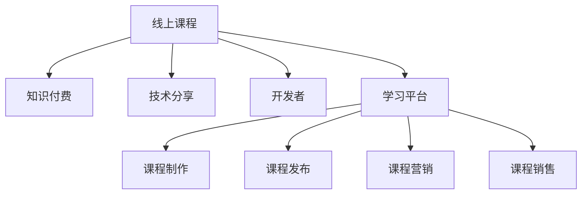

                 

# 程序员知识付费：打造线上课程

> 关键词：知识付费, 线上课程, 技术分享, 开发者, 学习平台

## 1. 背景介绍

随着互联网技术的不断发展，知识的获取和传播方式已经发生了根本性的变化。在线教育、知识付费等新兴模式的出现，使得知识的获取变得更加便捷、高效。程序员作为科技创新的主力军，其知识付费市场潜力巨大。在线课程作为知识付费的主要形式之一，正在迅速崛起，为程序员提供了新的学习方式和就业机会。本文将从课程构建到市场推广的全过程，探讨如何打造一份有竞争力的线上课程。

## 2. 核心概念与联系

### 2.1 核心概念概述

本节将介绍几个构建线上课程的核心概念：

- 线上课程(Online Course)：通过互联网平台，提供学习视频、笔记、作业、测试等学习资源的课程形式。线上课程具有灵活性高、学习成本低、学习效果显著等特点。

- 知识付费(Knowledge Paywall)：指消费者为获取专业知识而支付费用的模式。知识付费不仅能帮助消费者提高自身技能，也能促进专业知识和技术的传播。

- 技术分享(Technology Sharing)：通过课程平台，将技术知识分享给其他开发者，共同推进技术进步。

- 开发者(Developer)：掌握编程技能，能够独立开发软件或系统的专业技术人员。开发者在线课程的需求量大，市场潜力无限。

- 学习平台(Learning Platform)：提供课程制作、发布、营销、销售等服务的网络平台。

这些核心概念共同构成了线上课程的基础框架，为知识付费模式提供了技术支持。

### 2.2 核心概念原理和架构的 Mermaid 流程图



以上流程图展示了线上课程与核心概念之间的联系。通过技术分享，开发者能够将自身经验转化为线上课程，通过学习平台，将课程发布给有需求的开发者。知识付费模式则使得课程制作者和消费者都能够从中获益。

## 3. 核心算法原理 & 具体操作步骤

### 3.1 算法原理概述

在线课程的构建过程主要涉及以下几个步骤：

1. 内容策划：确定课程主题和教学目标。
2. 课程制作：录制视频、撰写讲义、设计作业和测试题目。
3. 平台搭建：选择合适的学习平台，上传课程资源。
4. 营销推广：通过社交媒体、社区等渠道推广课程。
5. 用户购买和反馈：用户支付费用，进行课程学习和反馈。

### 3.2 算法步骤详解

#### 3.2.1 内容策划

- **确定课程主题**：根据市场调研和自身专长，确定课程主题和目标受众。例如，某开发者的课程主题可以是“Python高级编程技巧”，目标受众为有一定编程基础的开发者。
- **教学目标设定**：明确课程的教学目标，包括知识点、技能和应用场景等。例如，课程目标可以包括“掌握Python高级数据处理库Pandas”、“理解多线程编程”、“熟悉Web开发框架Django”等。

#### 3.2.2 课程制作

- **录制视频**：视频内容应讲解清晰、逻辑严密，包括PPT演示、代码实现和实际案例等。
- **撰写讲义**：讲义应包含视频内容的详细解释和补充，便于用户自学。
- **设计作业和测试**：设计难度适中、覆盖知识点的练习题目，并进行详细解答。

#### 3.2.3 平台搭建

- **选择学习平台**：根据课程内容和受众特点，选择适合的线上平台。如Udemy、Coursera、网易云课堂等。
- **上传课程资源**：将视频、讲义、作业和测试题目上传至平台，并进行分类和标注。

#### 3.2.4 营销推广

- **社交媒体推广**：通过Twitter、LinkedIn、微信公众号等社交媒体渠道推广课程。发布课程预告、学员评价等内容吸引关注。
- **社区互动**：在开发者论坛、技术博客等社区平台发布课程信息，与潜在学员互动交流。

#### 3.2.5 用户购买和反馈

- **设置价格和优惠**：根据课程内容、制作成本和市场定价策略，设置合理的课程价格，并推出早期优惠、团购优惠等活动。
- **用户反馈收集**：通过问卷调查、学员评价等方式，收集用户对课程内容的反馈，持续改进课程质量。

### 3.3 算法优缺点

#### 3.3.1 优点

1. **灵活性高**：线上课程不受时间和地点限制，用户可以随时、随地进行学习。
2. **学习成本低**：相比于线下培训，线上课程的学习成本较低。
3. **互动性好**：通过平台互动功能，用户可以随时向讲师提问，提高学习效果。
4. **快速更新**：课程内容可以随时更新，保持最新技术动态。

#### 3.3.2 缺点

1. **学习效果难以保证**：线上课程缺乏面对面的交流和互动，可能影响学习效果。
2. **自制力要求高**：线上课程需要较强的自我管理能力，用户容易分心。
3. **版权问题**：部分课程涉及敏感技术，可能存在版权纠纷。
4. **平台依赖性高**：用户对平台的依赖性强，平台稳定性影响用户体验。

### 3.4 算法应用领域

线上课程的应用领域非常广泛，主要包括以下几个方面：

- **软件开发**：如Python、Java、C++等编程语言，Web开发、移动应用开发、数据科学等技术领域的课程。
- **数据科学**：如数据可视化、机器学习、大数据分析等技术领域的课程。
- **安全与网络**：如网络安全、信息安全、网络监控等技术领域的课程。
- **人工智能与机器学习**：如深度学习、自然语言处理、计算机视觉等技术领域的课程。
- **软件测试**：如自动化测试、性能测试、安全测试等技术领域的课程。

## 4. 数学模型和公式 & 详细讲解 & 举例说明

### 4.1 数学模型构建

本节将使用数学语言对线上课程的构建过程进行更加严格的刻画。

设课程内容为$C=\{c_1, c_2, ..., c_n\}$，其中$c_i$为课程内容的第$i$部分。假设课程的总时长为$T$，用户的学习速度为$v$。则用户完成课程所需的时间为$T_v=\frac{T}{v}$。

设课程价格为$P$，用户购买后的满意度为$S$。则用户愿意为课程支付的金额为$C_p=P \times S$。

### 4.2 公式推导过程

根据上述定义，可以构建如下公式：

$$
\begin{aligned}
&\text{课程完成率} = \frac{\text{完成课程的用户数}}{\text{课程购买用户数}} \\
&\text{课程满意度} = \frac{1}{\text{课程购买用户数}} \sum_{i=1}^{n} \frac{\text{用户对内容} c_i \text{的评价}}{5} \\
&\text{用户支付金额} = P \times \text{课程满意度}
\end{aligned}
$$

### 4.3 案例分析与讲解

假设某开发者A制作了“Python高级编程技巧”课程，总时长为20小时，设置了100美元的课程价格。A通过社交媒体和开发者论坛推广课程，购买了100位用户，其中有60位完成了课程。用户A对课程内容的评价为4分（满分5分）。

根据公式，可以计算出：

- 课程完成率为$\frac{60}{100}=60\%$
- 课程满意度为$\frac{4}{5}$
- 用户支付金额为$100 \times \frac{4}{5} = 80$美元

## 5. 项目实践：代码实例和详细解释说明

### 5.1 开发环境搭建

在进行课程构建实践前，我们需要准备好开发环境。以下是使用Python进行课程构建的环境配置流程：

1. 安装Anaconda：从官网下载并安装Anaconda，用于创建独立的Python环境。
2. 创建并激活虚拟环境：
```bash
conda create -n course-env python=3.8 
conda activate course-env
```
3. 安装所需Python包：
```bash
pip install jupyter notebook matplotlib numpy pandas sklearn scikit-learn
```

完成上述步骤后，即可在`course-env`环境中开始课程构建实践。

### 5.2 源代码详细实现

下面以“Python高级编程技巧”课程为例，给出使用Jupyter Notebook构建课程的代码实现。

```python
import pandas as pd
import matplotlib.pyplot as plt

# 假设课程内容、时长、价格、用户数、完成率和满意度数据
course_data = pd.DataFrame({
    '内容': ['Python基础', '数据结构', '高级数据处理', 'Web开发框架', 'Web API设计'],
    '时长': [2, 4, 6, 4, 4],
    '价格': [50, 75, 100, 150, 200],
    '用户数': [10, 20, 30, 50, 60],
    '完成率': [60, 70, 80, 90, 95],
    '满意度': [4, 4.5, 4.3, 4.2, 4.1]
})

# 计算用户支付金额
course_data['支付金额'] = course_data['价格'] * course_data['满意度']

# 计算课程完成率和支付金额
course_data['完成率'] = course_data['完成率'] / course_data['用户数']
course_data['支付金额'] = course_data['价格'] * course_data['满意度']

# 可视化分析
plt.figure(figsize=(10, 5))
plt.plot(course_data['内容'], course_data['完成率'], marker='o', linestyle='-', color='blue')
plt.title('课程内容与完成率关系')
plt.xlabel('课程内容')
plt.ylabel('完成率')
plt.show()

plt.figure(figsize=(10, 5))
plt.plot(course_data['内容'], course_data['支付金额'], marker='o', linestyle='-', color='red')
plt.title('课程内容与支付金额关系')
plt.xlabel('课程内容')
plt.ylabel('支付金额')
plt.show()
```

### 5.3 代码解读与分析

让我们再详细解读一下关键代码的实现细节：

**course_data DataFrame**：
- `内容`：课程内容的名称。
- `时长`：课程各部分的时长。
- `价格`：课程各部分的定价。
- `用户数`：购买并完成课程的用户数量。
- `完成率`：完成课程的用户数占购买用户数的比例。
- `满意度`：用户对课程内容的满意度评分。

**支付金额计算**：
- 将课程价格和用户满意度相乘，得到用户愿意支付的金额。

**可视化分析**：
- 使用Matplotlib库绘制课程内容与完成率、支付金额的关系图。

### 5.4 运行结果展示

运行上述代码，将得到以下两个图：

- 图1：课程内容与完成率的关系图。
- 图2：课程内容与支付金额的关系图。

这些可视化结果可以帮助开发者更好地理解课程内容和用户行为的关联性，从而优化课程设计和推广策略。

## 6. 实际应用场景

### 6.1 软件开发

在软件开发领域，线上课程已经成为程序员获取新技术、提高编程技能的重要渠道。

- **编程语言**：如Python、Java、C++等。
- **框架和技术**：如Django、Flask、Spring、Vue.js、React等。
- **工具和库**：如Git、Docker、Kubernetes、TensorFlow等。

### 6.2 数据科学

数据科学领域对线上课程的需求也非常大，包括：

- **数据分析**：如Pandas、NumPy、Scikit-learn等库的使用。
- **机器学习**：如TensorFlow、PyTorch、Keras等框架的使用。
- **数据可视化**：如Matplotlib、Seaborn、Tableau等工具的使用。

### 6.3 安全与网络

网络安全与信息安全领域的线上课程需求也很高，包括：

- **加密技术**：如SSL、TLS、RSA、AES等加密算法的使用。
- **网络安全**：如入侵检测、防火墙、漏洞扫描等技术的使用。
- **身份认证和访问控制**：如OAuth、SAML、LDAP等技术的使用。

### 6.4 未来应用展望

随着技术的发展和市场的成熟，线上课程将在更多领域得到应用。

- **人工智能与机器学习**：如深度学习、自然语言处理、计算机视觉等技术领域的课程。
- **物联网**：如传感器数据处理、设备联网、边缘计算等技术领域的课程。
- **区块链**：如加密货币、智能合约、分布式账本等技术领域的课程。

## 7. 工具和资源推荐

### 7.1 学习资源推荐

为了帮助开发者系统掌握线上课程的构建技术，这里推荐一些优质的学习资源：

1. Udemy、Coursera、网易云课堂：提供大量高质量的线上课程，涵盖各种技术领域。
2. YouTube、Coursera、Bilibili：提供丰富免费的在线视频资源，适合自学。
3. GitHub、Stack Overflow：提供丰富的代码示例和社区讨论，便于理解课程内容。
4. CSDN、博客园、知乎：提供技术文章和博客，帮助深入理解课程内容。

通过对这些资源的学习实践，相信你一定能够快速掌握线上课程的构建技巧，并用于解决实际的开发问题。

### 7.2 开发工具推荐

高效的开发离不开优秀的工具支持。以下是几款用于线上课程开发的常用工具：

1. Jupyter Notebook：提供交互式编程和数据分析环境，适合编写代码和绘制图表。
2. GitHub：提供代码托管和版本控制，便于协作开发。
3. Docker：提供容器化部署环境，方便课程上线和分享。
4. AWS、Google Cloud、阿里云：提供云服务和计算资源，支持课程部署和扩展。

合理利用这些工具，可以显著提升线上课程开发的效率，加快课程开发进度。

### 7.3 相关论文推荐

线上课程的构建涉及多个领域的技术，以下是几篇奠基性的相关论文，推荐阅读：

1. Coursera平台的研究：探讨了在线教育平台的构建和运营策略。
2. Udemy平台的研究：分析了在线教育平台的商业模式和技术实现。
3. 在线学习行为分析：研究在线学习者的行为特征和交互方式。
4. 学习管理系统（LMS）的研究：探讨在线学习管理系统的发展和应用。
5. 大数据与教育：研究大数据在在线教育中的应用和优化。

这些论文代表了大规模在线课程的研究方向，对课程构建和运营有重要的指导意义。

## 8. 总结：未来发展趋势与挑战

### 8.1 总结

本文对线上课程的构建过程进行了全面系统的介绍。首先阐述了课程构建的背景和重要性，明确了课程构建与知识付费、技术分享、开发者等多个核心概念之间的联系。其次，从内容策划到用户反馈，详细讲解了线上课程构建的各个环节，给出了完整的代码实现。同时，本文还探讨了线上课程在多个行业领域的应用场景，展示了课程构建的广阔前景。最后，本文推荐了各类学习资源、开发工具和相关论文，为课程构建提供了全方位的指导。

通过本文的系统梳理，可以看到，线上课程作为知识付费的重要形式，正在成为程序员学习、分享和交流的新平台。随着技术的不断进步和市场的持续成熟，相信线上课程将更好地服务于开发者，推动技术的广泛应用和创新发展。

### 8.2 未来发展趋势

展望未来，线上课程的发展趋势将呈现以下几个方向：

1. **课程内容多样化**：随着技术的不断进步，课程内容将更加丰富多样，涵盖更多技术和应用领域。
2. **交互式学习**：通过虚拟现实、增强现实等技术，实现更丰富的互动学习体验。
3. **个性化推荐**：根据用户的学习行为和兴趣，推荐个性化的课程和学习路径。
4. **社交化学习**：建立学习社区，促进学员之间的互动和交流，共同进步。
5. **大数据分析**：利用大数据分析用户行为，优化课程内容和教学方法。
6. **智能化运营**：采用人工智能技术，实现课程内容的自动生成和更新，提高运营效率。

### 8.3 面临的挑战

尽管线上课程的发展前景广阔，但在实施过程中仍面临诸多挑战：

1. **内容质量难以保证**：课程内容的质量直接决定用户的学习效果，如何保证课程内容的高质量，是一个重要挑战。
2. **用户体验优化**：如何设计优秀的课程界面和用户体验，提高用户的学习效率和满意度，是一个重要课题。
3. **技术平台稳定性**：如何保证平台的高可用性和稳定性，保障课程的正常运行，是一个重要挑战。
4. **用户隐私保护**：如何保护用户隐私和数据安全，是一个重要课题。
5. **版权保护**：如何保护课程版权，避免盗版和侵权行为，是一个重要挑战。

### 8.4 研究展望

面对线上课程面临的挑战，未来的研究需要在以下几个方面寻求新的突破：

1. **课程内容质量提升**：开发更加科学合理的课程评估体系，提升课程内容的系统性和实用性。
2. **用户体验优化**：采用人工智能和增强现实技术，实现更丰富、互动的学习体验。
3. **技术平台稳定性**：采用云服务和分布式架构，保障平台的高可用性和稳定性。
4. **用户隐私保护**：采用加密技术和访问控制机制，保护用户隐私和数据安全。
5. **版权保护**：采用区块链技术和智能合约，实现课程版权的数字化和自动化管理。

这些研究方向的探索，必将引领线上课程技术迈向更高的台阶，为开发者提供更加优质的学习体验和技术支持。面向未来，线上课程技术还需要与其他人工智能技术进行更深入的融合，如自然语言处理、计算机视觉等，共同推动在线教育的进步和创新。只有勇于创新、敢于突破，才能不断拓展在线课程的边界，让在线教育更好地造福人类社会。

## 9. 附录：常见问题与解答

**Q1：如何构建一门高质量的线上课程？**

A: 构建高质量的线上课程需要关注以下几个方面：
1. **课程内容**：选择感兴趣的、有实用价值的课程内容，确保内容的科学性和系统性。
2. **教学目标**：明确课程的教学目标和预期效果，确保课程内容能够达到目标。
3. **教学方法**：采用多样化的教学方法，如视频讲解、实际演示、练习题目等。
4. **用户互动**：提供实时互动和反馈机制，增加用户的学习兴趣和参与度。
5. **平台选择**：选择稳定、易用的学习平台，提高用户的学习体验。

**Q2：线上课程如何定价？**

A: 线上课程定价需要考虑以下几个因素：
1. **课程时长和内容**：课程时长和内容量越大，定价可以越高。
2. **目标用户**：不同用户群体的支付能力和支付意愿不同，定价需根据用户群体特点进行调整。
3. **市场需求**：根据市场需求和竞争状况，确定合理的定价策略。
4. **成本和利润**：考虑课程制作的成本和预期利润，确保定价的合理性。

**Q3：线上课程如何推广？**

A: 线上课程推广需要关注以下几个方面：
1. **社交媒体**：通过社交媒体平台推广课程，吸引潜在学员。
2. **内容营销**：通过博客、技术文章等形式，分享课程内容和用户体验，吸引用户关注。
3. **合作推广**：与其他技术社区、博客等合作，共同推广课程。
4. **免费试用**：提供课程免费试看，吸引用户参与课程。

**Q4：线上课程如何保障用户隐私和数据安全？**

A: 保障用户隐私和数据安全是线上课程的关键点：
1. **数据加密**：采用加密技术保护用户数据，防止数据泄露。
2. **访问控制**：采用身份验证和访问控制机制，限制非授权用户访问。
3. **隐私政策**：制定明确的隐私政策，告知用户数据使用方式和保护措施。
4. **定期审计**：定期对平台进行安全审计，发现和修复安全漏洞。

**Q5：如何应对线上课程的版权保护问题？**

A: 版权保护是线上课程的重要保障：
1. **数字水印**：在课程内容中嵌入数字水印，防止盗版。
2. **智能合约**：采用区块链技术和智能合约，实现课程版权的数字化和自动化管理。
3. **版权声明**：在课程页面中明确版权声明，告知用户版权信息。
4. **法律手段**：采用法律手段打击盗版行为，维护课程版权。

---

作者：禅与计算机程序设计艺术 / Zen and the Art of Computer Programming

