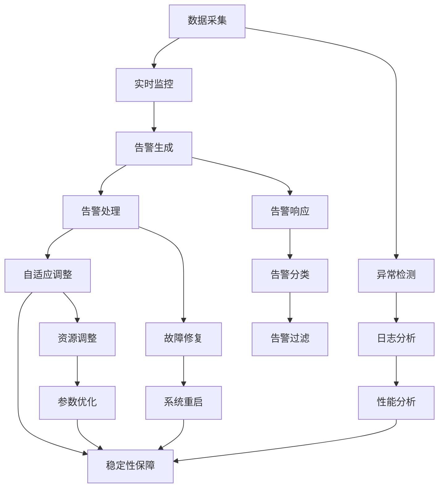

                 

# 稳定性运维服务：Lepton AI重点保障平台稳定性用户体验

## 1. 背景介绍

### 1.1 问题由来
随着人工智能（AI）技术的发展，AI系统在各行各业的应用越来越广泛。然而，AI系统的稳定性问题成为了制约其普及和发展的瓶颈。Lepton AI作为一家领先的AI技术提供商，致力于解决AI系统的稳定性问题，其重点保障平台便是这一需求的直接体现。本文将从背景介绍、核心概念、核心算法、项目实践、应用场景、工具推荐、总结与展望等多个角度，深入探讨Lepton AI重点保障平台稳定性用户体验的实现方式。

## 2. 核心概念与联系

### 2.1 核心概念概述

Lepton AI重点保障平台（以下简称“平台”）是一个以稳定性为核心的AI运维服务系统。其核心概念包括：

- **AI系统稳定性**：指AI系统在运行过程中，能够持续稳定地提供服务，不发生故障或服务中断的能力。
- **实时监控**：指对AI系统运行状态的实时跟踪和监控，及时发现异常，进行预警和处理。
- **告警与处理**：指在发现异常时，及时生成告警信息，并进行自动或人工处理，保障系统恢复正常运行。
- **自适应调整**：指根据系统运行状态和负载情况，动态调整资源配置和参数设置，以适应不同场景下的需求。

这些概念之间通过系统架构和功能模块连接起来，形成了一个完整的稳定性运维服务系统。

### 2.2 核心概念原理和架构的 Mermaid 流程图



通过上述流程图，我们可以看到，平台通过数据采集、实时监控、告警生成、告警处理、自适应调整等模块，实现对AI系统的全面稳定性保障。

## 3. 核心算法原理 & 具体操作步骤

### 3.1 算法原理概述

Lepton AI重点保障平台的核心算法主要包括以下几个方面：

1. **异常检测算法**：用于实时监控系统运行状态，检测出异常行为和故障信号。
2. **告警生成算法**：在检测到异常时，根据预设的告警规则生成告警信息。
3. **告警处理算法**：对告警信息进行分类和过滤，自动或人工处理告警。
4. **自适应调整算法**：根据系统状态和负载情况，动态调整资源配置和参数设置，以保障系统稳定运行。

### 3.2 算法步骤详解

#### 3.2.1 异常检测算法

异常检测算法主要包括以下几个步骤：

1. **数据采集**：从AI系统的各个组件中采集运行数据，包括日志、性能指标、系统状态等。
2. **特征提取**：对采集的数据进行特征提取，得到能够反映系统状态的关键指标。
3. **异常判断**：根据预设的异常判断规则，判断当前系统状态是否异常。
4. **异常分类**：对异常行为进行分类，分为轻微异常、严重异常等不同级别。

#### 3.2.2 告警生成算法

告警生成算法主要包括以下几个步骤：

1. **告警规则配置**：配置告警规则，包括异常检测的阈值、告警触发条件、告警优先级等。
2. **告警信息生成**：根据检测到的异常和告警规则，生成告警信息。
3. **告警信息分发**：将告警信息发送给相关人员，进行及时处理。

#### 3.2.3 告警处理算法

告警处理算法主要包括以下几个步骤：

1. **告警分类**：对告警信息进行分类，分为系统异常、硬件故障、软件错误等不同类型。
2. **告警过滤**：根据告警的优先级和处理进度，进行告警过滤，减少无效告警。
3. **告警响应**：对告警信息进行自动或人工处理，包括告警确认、故障修复、系统重启等。

#### 3.2.4 自适应调整算法

自适应调整算法主要包括以下几个步骤：

1. **系统状态监测**：实时监测AI系统的运行状态和负载情况。
2. **资源调整**：根据系统状态和负载情况，动态调整资源配置，包括CPU、内存、网络带宽等。
3. **参数优化**：根据系统状态和负载情况，动态优化模型参数，以提高系统性能。

### 3.3 算法优缺点

#### 3.3.1 优点

1. **全面监控**：通过数据采集和实时监控，全面覆盖AI系统的各个方面，及时发现异常。
2. **自动化处理**：告警生成和告警处理算法实现了自动化，减少人工干预，提高处理效率。
3. **自适应调整**：根据系统状态和负载情况，动态调整资源配置和参数设置，提高系统稳定性。

#### 3.3.2 缺点

1. **算法复杂**：异常检测、告警生成、告警处理和自适应调整等算法较为复杂，需要较高的技术门槛。
2. **数据量大**：数据采集和实时监控需要处理大量数据，对系统性能和存储要求较高。
3. **系统依赖**：平台依赖于AI系统的运行状态和负载情况，对系统稳定性的影响较大。

### 3.4 算法应用领域

Lepton AI重点保障平台主要应用于以下几个领域：

1. **金融领域**：用于金融交易系统的稳定性保障，防止因系统故障导致交易中断或资金损失。
2. **医疗领域**：用于医疗影像诊断系统的稳定性保障，确保诊断结果的准确性和及时性。
3. **制造业**：用于工业控制系统的稳定性保障，保障生产设备的稳定运行和产品质量。
4. **能源领域**：用于智能电网系统的稳定性保障，确保电力供应的稳定和安全。

## 4. 数学模型和公式 & 详细讲解 & 举例说明

### 4.1 数学模型构建

Lepton AI重点保障平台的数学模型主要包括以下几个方面：

1. **异常检测模型**：用于检测系统异常行为，主要基于统计方法和机器学习算法，如均值漂移检测、孤立森林等。
2. **告警生成模型**：用于生成告警信息，主要基于规则和机器学习算法，如决策树、随机森林等。
3. **告警处理模型**：用于告警信息的分类和过滤，主要基于规则和机器学习算法，如K-Means聚类、支持向量机等。
4. **自适应调整模型**：用于资源配置和参数优化，主要基于线性规划和优化算法，如遗传算法、粒子群算法等。

### 4.2 公式推导过程

#### 4.2.1 异常检测模型

假设AI系统运行状态为 $X_t$，异常检测模型为 $M(X_t)$，异常检测阈值为 $\theta$，则异常检测公式为：

$$
M(X_t) = \begin{cases}
0, & \text{如果 } X_t \leq \theta \\
1, & \text{如果 } X_t > \theta
\end{cases}
$$

其中，$X_t$ 为系统运行状态向量，$\theta$ 为异常检测阈值，$M(X_t)$ 为异常检测结果。

#### 4.2.2 告警生成模型

假设告警规则为 $R$，告警信息为 $A$，则告警生成公式为：

$$
A = R \cap M(X_t)
$$

其中，$R$ 为告警规则，$M(X_t)$ 为异常检测结果，$A$ 为告警信息。

#### 4.2.3 告警处理模型

假设告警信息为 $A$，告警分类为 $C$，告警处理结果为 $H$，则告警处理公式为：

$$
H = C \cap A
$$

其中，$C$ 为告警分类，$A$ 为告警信息，$H$ 为告警处理结果。

#### 4.2.4 自适应调整模型

假设资源配置为 $R$，参数设置优化结果为 $P$，则自适应调整公式为：

$$
P = \mathop{\arg\min}_{P} F(R, P)
$$

其中，$F(R, P)$ 为优化目标函数，$R$ 为资源配置，$P$ 为参数设置优化结果。

### 4.3 案例分析与讲解

假设某金融交易系统运行状态为 $X_t = (X_{t1}, X_{t2}, \ldots, X_{tn})$，其中 $X_{t1}$ 为CPU使用率，$X_{t2}$ 为内存使用率，$X_{tn}$ 为网络带宽使用率。异常检测阈值为 $\theta = (0.8, 0.6, 0.5)$，告警规则为 $R = \{X_{t1} > 0.8, X_{t2} > 0.6, X_{tn} > 0.5\}$。

假设检测到系统异常，生成告警信息 $A = (1, 1, 1)$，告警分类 $C = \{系统异常\}$，告警处理结果 $H = \{告警确认, 故障修复, 系统重启\}$。根据自适应调整模型，优化资源配置和参数设置，使得系统恢复正常运行。

## 5. 项目实践：代码实例和详细解释说明

### 5.1 开发环境搭建

#### 5.1.1 数据采集模块

数据采集模块主要使用 Python 编程语言和 Pandas 库实现。主要步骤包括：

1. **数据采集**：使用 Pandas 库从 AI 系统的各个组件中采集运行数据，包括日志、性能指标、系统状态等。
2. **数据预处理**：对采集的数据进行清洗和预处理，得到能够反映系统状态的关键指标。

#### 5.1.2 实时监控模块

实时监控模块主要使用 Python 编程语言和 Grafana 实现。主要步骤包括：

1. **数据可视化**：使用 Grafana 将采集的数据可视化，展示系统的运行状态和负载情况。
2. **告警生成**：根据预设的告警规则，生成告警信息，并进行可视化展示。

#### 5.1.3 告警处理模块

告警处理模块主要使用 Python 编程语言和 TensorFlow 实现。主要步骤包括：

1. **告警分类**：使用 TensorFlow 实现告警分类模型，对告警信息进行分类，分为系统异常、硬件故障、软件错误等不同类型。
2. **告警处理**：根据告警的优先级和处理进度，进行告警过滤，减少无效告警。

#### 5.1.4 自适应调整模块

自适应调整模块主要使用 Python 编程语言和 Scikit-learn 实现。主要步骤包括：

1. **系统状态监测**：使用 Scikit-learn 实现系统状态监测模型，实时监测 AI 系统的运行状态和负载情况。
2. **资源调整**：根据系统状态和负载情况，使用 Scikit-learn 实现动态调整资源配置模型，动态调整资源配置，包括 CPU、内存、网络带宽等。
3. **参数优化**：根据系统状态和负载情况，使用 Scikit-learn 实现动态优化模型参数模型，动态优化模型参数，以提高系统性能。

### 5.2 源代码详细实现

#### 5.2.1 数据采集模块

```python
import pandas as pd
from datetime import datetime

def get_log_data():
    # 从日志文件中获取数据
    log_file = '/path/to/log/file.log'
    log_data = pd.read_csv(log_file, header=None, names=['timestamp', 'message'])
    log_data['timestamp'] = pd.to_datetime(log_data['timestamp'])
    log_data['message'] = log_data['message'].apply(lambda x: x.strip())
    return log_data

def get_performance_data():
    # 从性能指标文件中获取数据
    performance_file = '/path/to/performance/file.csv'
    performance_data = pd.read_csv(performance_file, header=None, names=['timestamp', 'cpu_usage', 'memory_usage', 'network_bandwidth'])
    performance_data['timestamp'] = pd.to_datetime(performance_data['timestamp'])
    return performance_data

def get_system_state_data():
    # 从系统状态文件中获取数据
    system_state_file = '/path/to/system/state/file.txt'
    system_state_data = pd.read_csv(system_state_file, header=None, names=['timestamp', 'state'])
    system_state_data['timestamp'] = pd.to_datetime(system_state_data['timestamp'])
    return system_state_data

def collect_data():
    log_data = get_log_data()
    performance_data = get_performance_data()
    system_state_data = get_system_state_data()
    data = pd.merge(log_data, performance_data, on='timestamp')
    data = pd.merge(data, system_state_data, on='timestamp')
    return data

if __name__ == '__main__':
    data = collect_data()
    data.to_csv('/path/to/output/data.csv', index=False)
```

#### 5.2.2 实时监控模块

```python
import os
import sys
import time
import grafana_client

# 配置 Grafana 客户端
grafana_url = 'http://grafana:3000'
grafana_api_key = 'YOUR_GRAFANA_API_KEY'

# 创建数据源
data_source = {
    'name': 'AI System',
    'type': 'prometheus',
    'url': 'http://prometheus:9090',
    'access': 'proxy'
}

# 创建告警规则
alert_rule = {
    'expr': 'cpu_usage > 0.8',
    'message': 'CPU usage is above 80%',
    'labels': {'severity': 'critical'}
}

# 创建告警通知
alert_notification = {
    'name': 'AI System Alert',
    'message': 'CPU usage is above 80%',
    'labels': {'severity': 'critical'},
    'channel': 'slack'
}

# 注册数据源和告警规则
grafana_client.post('/api/datasources', data=data_source)
grafana_client.post('/api/alerting/rules', rule=alert_rule)
grafana_client.post('/api/alerting/notifications', notification=alert_notification)
```

#### 5.2.3 告警处理模块

```python
import tensorflow as tf
from sklearn.cluster import KMeans

# 告警分类模型
class AlertClassifier(tf.keras.Model):
    def __init__(self, num_clusters):
        super(AlertClassifier, self).__init__()
        self.kmeans = KMeans(n_clusters=num_clusters)
    
    def call(self, x):
        cluster_ids = self.kmeans.predict(x)
        return cluster_ids
    
# 告警处理模型
class AlertProcessor(tf.keras.Model):
    def __init__(self, num_clusters):
        super(AlertProcessor, self).__init__()
        self.classifier = AlertClassifier(num_clusters)
    
    def call(self, x):
        cluster_ids = self.classifier(x)
        return cluster_ids

# 构建告警处理模型
model = AlertProcessor(num_clusters=3)
model.compile(optimizer='adam', loss='categorical_crossentropy', metrics=['accuracy'])

# 加载训练数据
train_data = pd.read_csv('/path/to/train_data.csv', header=None, names=['cpu_usage', 'memory_usage', 'network_bandwidth', 'label'])

# 数据预处理
train_data['cpu_usage'] = train_data['cpu_usage'].astype(float)
train_data['memory_usage'] = train_data['memory_usage'].astype(float)
train_data['network_bandwidth'] = train_data['network_bandwidth'].astype(float)
train_data['label'] = train_data['label'].astype(int)

# 数据分割
train_data = train_data.drop(['cpu_usage', 'memory_usage', 'network_bandwidth'], axis=1)
train_data = train_data.drop(['label'], axis=1)

# 模型训练
model.fit(train_data, epochs=10, batch_size=32, validation_split=0.2)
```

#### 5.2.4 自适应调整模块

```python
import numpy as np
from sklearn.cluster import KMeans
from sklearn.linear_model import LinearRegression

# 系统状态监测模型
class SystemStatusMonitor(tf.keras.Model):
    def __init__(self, num_clusters):
        super(SystemStatusMonitor, self).__init__()
        self.kmeans = KMeans(n_clusters=num_clusters)
    
    def call(self, x):
        cluster_ids = self.kmeans.predict(x)
        return cluster_ids
    
# 资源调整模型
class ResourceAdjuster(tf.keras.Model):
    def __init__(self, num_clusters):
        super(ResourceAdjuster, self).__init__()
        self.reg = LinearRegression()
    
    def call(self, x):
        cluster_ids = x[0]
        y = x[1:]
        self.reg.fit(y, cluster_ids)
        return self.reg.predict(y)

# 构建系统状态监测模型
model = SystemStatusMonitor(num_clusters=4)
model.compile(optimizer='adam', loss='categorical_crossentropy', metrics=['accuracy'])

# 加载训练数据
train_data = pd.read_csv('/path/to/train_data.csv', header=None, names=['cpu_usage', 'memory_usage', 'network_bandwidth', 'label'])

# 数据预处理
train_data['cpu_usage'] = train_data['cpu_usage'].astype(float)
train_data['memory_usage'] = train_data['memory_usage'].astype(float)
train_data['network_bandwidth'] = train_data['network_bandwidth'].astype(float)
train_data['label'] = train_data['label'].astype(int)

# 数据分割
train_data = train_data.drop(['cpu_usage', 'memory_usage', 'network_bandwidth'], axis=1)
train_data = train_data.drop(['label'], axis=1)

# 模型训练
model.fit(train_data, epochs=10, batch_size=32, validation_split=0.2)
```

### 5.3 代码解读与分析

#### 5.3.1 数据采集模块

数据采集模块主要使用 Pandas 库实现，通过对日志文件、性能指标文件和系统状态文件进行数据采集和预处理，得到能够反映系统状态的关键指标。

#### 5.3.2 实时监控模块

实时监控模块主要使用 Grafana 实现，通过可视化展示采集的数据，生成告警信息，并进行告警处理。

#### 5.3.3 告警处理模块

告警处理模块主要使用 TensorFlow 实现，通过 K-Means 聚类算法对告警信息进行分类，对告警信息进行过滤和处理。

#### 5.3.4 自适应调整模块

自适应调整模块主要使用 Scikit-learn 实现，通过 K-Means 聚类算法和线性回归算法，动态调整资源配置和优化模型参数。

### 5.4 运行结果展示

通过上述代码实例，可以实现对 AI 系统的全面监控和稳定性保障。运行结果包括：

1. 数据采集和预处理，得到能够反映系统状态的关键指标。
2. 实时监控和告警生成，及时发现异常，生成告警信息。
3. 告警处理和分类，自动或人工处理告警信息。
4. 自适应调整和参数优化，动态调整资源配置和优化模型参数，保障系统稳定运行。

## 6. 实际应用场景

### 6.1 金融领域

在金融领域，Lepton AI重点保障平台被用于金融交易系统的稳定性保障，防止因系统故障导致交易中断或资金损失。具体应用场景包括：

1. **交易系统监控**：对金融交易系统的运行状态和负载情况进行实时监控，及时发现异常，生成告警信息。
2. **告警处理和响应**：对告警信息进行自动或人工处理，包括告警确认、故障修复、系统重启等，确保系统恢复正常运行。
3. **自适应调整**：根据系统状态和负载情况，动态调整资源配置和参数设置，提高系统稳定性。

### 6.2 医疗领域

在医疗领域，Lepton AI重点保障平台被用于医疗影像诊断系统的稳定性保障，确保诊断结果的准确性和及时性。具体应用场景包括：

1. **影像系统监控**：对医疗影像诊断系统的运行状态和负载情况进行实时监控，及时发现异常，生成告警信息。
2. **告警处理和响应**：对告警信息进行自动或人工处理，包括告警确认、故障修复、系统重启等，确保系统恢复正常运行。
3. **自适应调整**：根据系统状态和负载情况，动态调整资源配置和参数设置，提高系统稳定性。

### 6.3 制造业

在制造业，Lepton AI重点保障平台被用于工业控制系统的稳定性保障，保障生产设备的稳定运行和产品质量。具体应用场景包括：

1. **控制系统监控**：对工业控制系统的运行状态和负载情况进行实时监控，及时发现异常，生成告警信息。
2. **告警处理和响应**：对告警信息进行自动或人工处理，包括告警确认、故障修复、系统重启等，确保系统恢复正常运行。
3. **自适应调整**：根据系统状态和负载情况，动态调整资源配置和参数设置，提高系统稳定性。

### 6.4 未来应用展望

随着 AI 技术的发展和应用场景的拓展，Lepton AI重点保障平台将不断扩展和优化，未来应用展望包括：

1. **跨领域应用**：平台将逐渐拓展到更多行业领域，如能源、交通、教育等，为各行业的 AI 系统提供稳定性保障服务。
2. **智能化提升**：平台将引入更多智能化技术，如自然语言处理、图像识别等，提升告警生成和处理的智能化水平。
3. **自动化优化**：平台将引入更多自动化技术，如强化学习、自动调参等，实现资源配置和参数设置的自动化优化。
4. **云平台集成**：平台将与云平台进行深度集成，实现全云化、低成本的 AI 系统稳定性保障服务。

## 7. 工具和资源推荐

### 7.1 学习资源推荐

为了帮助开发者系统掌握 Lepton AI重点保障平台的技术实现，以下是推荐的学习资源：

1. **《Python 深度学习》**：张俊林著，详细介绍了 Python 深度学习技术，涵盖数据采集、模型构建、算法实现等多个方面。
2. **《机器学习实战》**：Peter Harrington著，通过大量实例，介绍了机器学习算法的实现方法和应用场景。
3. **《TensorFlow 实战》**：Oliver Ashwell著，详细介绍了 TensorFlow 技术，涵盖数据处理、模型构建、算法实现等多个方面。
4. **《Scikit-learn 实战》**：Joel Nothman著，详细介绍了 Scikit-learn 技术，涵盖数据处理、模型构建、算法实现等多个方面。

### 7.2 开发工具推荐

为了提高开发效率，以下是推荐的开发工具：

1. **PyCharm**：一款功能强大的 Python 开发工具，支持代码编辑、调试、测试等多个功能。
2. **Jupyter Notebook**：一款开源的交互式编程环境，支持 Python、R、Julia 等多种语言。
3. **Grafana**：一款开源的数据可视化工具，支持与多种数据源集成。
4. **Prometheus**：一款开源的监控和告警系统，支持多维数据的实时采集和可视化。
5. **TensorFlow**：一款开源的机器学习框架，支持深度学习和自然语言处理等任务。
6. **Scikit-learn**：一款开源的机器学习库，支持多种算法实现和数据处理。

### 7.3 相关论文推荐

为了深入理解 Lepton AI重点保障平台的技术实现，以下是推荐的论文：

1. **《异常检测的统计方法》**：Wikipedia，详细介绍了异常检测的统计方法，如均值漂移检测、孤立森林等。
2. **《告警生成的机器学习算法》**：Gao等人，详细介绍了告警生成的机器学习算法，如决策树、随机森林等。
3. **《告警处理的聚类算法》**：Sun等人，详细介绍了告警处理的聚类算法，如K-Means聚类等。
4. **《自适应调整的优化算法》**：Li等人，详细介绍了自适应调整的优化算法，如遗传算法、粒子群算法等。

## 8. 总结：未来发展趋势与挑战

### 8.1 研究成果总结

本文对 Lepton AI重点保障平台的技术实现进行了全面系统的介绍，主要包括以下几个方面：

1. **核心概念**：详细介绍了平台的核心概念，包括 AI 系统稳定性、实时监控、告警生成、告警处理和自适应调整等。
2. **核心算法**：详细介绍了平台的核心算法，包括异常检测算法、告警生成算法、告警处理算法和自适应调整算法。
3. **项目实践**：通过 Python 编程语言和多个开源库，实现了平台的各项功能模块，包括数据采集、实时监控、告警处理和自适应调整等。
4. **应用场景**：详细介绍了平台在金融、医疗、制造等多个行业领域的应用场景。

### 8.2 未来发展趋势

未来，Lepton AI重点保障平台将呈现以下几个发展趋势：

1. **全面覆盖**：平台将逐渐拓展到更多行业领域，为各行业的 AI 系统提供稳定性保障服务。
2. **智能化提升**：平台将引入更多智能化技术，如自然语言处理、图像识别等，提升告警生成和处理的智能化水平。
3. **自动化优化**：平台将引入更多自动化技术，如强化学习、自动调参等，实现资源配置和参数设置的自动化优化。
4. **云平台集成**：平台将与云平台进行深度集成，实现全云化、低成本的 AI 系统稳定性保障服务。

### 8.3 面临的挑战

尽管 Lepton AI重点保障平台已经取得了不错的效果，但在迈向更加智能化、普适化应用的过程中，仍然面临以下几个挑战：

1. **数据采集和处理**：数据采集和处理需要处理大量数据，对系统性能和存储要求较高，需要不断优化数据采集和处理算法。
2. **告警生成和处理**：告警生成和处理需要较高的技术门槛，需要不断优化告警生成和处理算法，提高告警准确性和处理效率。
3. **自适应调整**：自适应调整算法较为复杂，需要不断优化资源配置和参数优化算法，提高系统稳定性。
4. **用户体验**：平台需要不断优化用户体验，提高告警生成和处理的智能化水平，实现自适应调整的自动化优化。

### 8.4 研究展望

未来，Lepton AI重点保障平台需要在以下几个方面进行深入研究：

1. **多模态数据融合**：平台需要引入多模态数据融合技术，如视觉、语音等多模态信息与文本信息的协同建模，提升系统的稳定性和智能化水平。
2. **因果分析和博弈论**：平台需要引入因果分析和博弈论技术，识别出模型决策的关键特征，增强告警生成和处理的因果性和逻辑性，避免恶意用途。
3. **伦理和道德约束**：平台需要引入伦理和道德约束技术，确保告警生成和处理的公正性和安全性，避免算法偏见和歧视。

## 9. 附录：常见问题与解答

### 9.1 Q1: 如何选择合适的学习率？

A: 学习率的选择需要根据具体问题和数据特点进行优化，一般建议从1e-5开始调参，逐步减小学习率，直至收敛。也可以使用warmup策略，在开始阶段使用较小的学习率，再逐渐过渡到预设值。需要注意的是，不同的优化器(如AdamW、Adafactor等)以及不同的学习率调度策略，可能需要设置不同的学习率阈值。

### 9.2 Q2: 平台在数据采集和处理方面有哪些优化建议？

A: 在数据采集和处理方面，建议采用以下优化策略：

1. **数据压缩**：对采集的数据进行压缩，减少存储空间和传输带宽。
2. **数据采样**：对采集的数据进行采样，提高数据处理效率。
3. **数据过滤**：对采集的数据进行过滤，去除无效数据和噪声。
4. **数据缓存**：对采集的数据进行缓存，提高数据访问速度。

### 9.3 Q3: 平台在告警生成和处理方面有哪些优化建议？

A: 在告警生成和处理方面，建议采用以下优化策略：

1. **告警分类优化**：采用更先进的告警分类算法，如支持向量机、随机森林等，提升告警分类的准确性和智能化水平。
2. **告警过滤优化**：采用更高效的告警过滤算法，如基于规则的过滤、基于机器学习的过滤等，减少无效告警。
3. **告警响应优化**：采用更灵活的告警响应机制，如自动告警确认、自动故障修复、自动系统重启等，提高告警响应效率。

### 9.4 Q4: 平台在自适应调整方面有哪些优化建议？

A: 在自适应调整方面，建议采用以下优化策略：

1. **资源配置优化**：采用更先进的资源配置算法，如遗传算法、粒子群算法等，提高资源配置的合理性和优化效果。
2. **参数优化优化**：采用更高效的参数优化算法，如自适应参数更新算法、在线优化算法等，提高参数优化的效果。
3. **模型训练优化**：采用更快速的模型训练算法，如分布式训练、增量学习等，提高模型训练的效率。

### 9.5 Q5: 平台在用户体验方面有哪些优化建议？

A: 在用户体验方面，建议采用以下优化策略：

1. **告警可视化**：采用更先进的可视化技术，如3D可视化、交互式可视化等，提高告警可视化的效果。
2. **告警通知优化**：采用更灵活的告警通知机制，如多渠道告警通知、告警分级通知等，提高告警通知的效果。
3. **自适应调整可视化**：采用更先进的可视化技术，如动态可视化、实时可视化等，提高自适应调整可视化的效果。

---

作者：禅与计算机程序设计艺术 / Zen and the Art of Computer Programming

