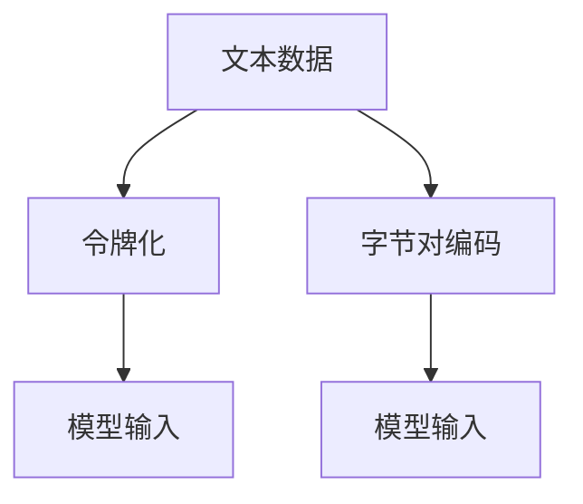

                 

# 第六章：令牌化和字节对编码

> 关键词：令牌化, 字节对编码, 自然语言处理(NLP), 深度学习, 神经网络, 序列数据处理

## 1. 背景介绍

在自然语言处理(NLP)领域，文本数据的处理是核心环节。文本数据通常是由单词和句子构成的序列数据，相较于图像、视频等非结构化数据，其处理起来较为复杂。为了更好地对文本数据进行处理，需要将其转换为机器学习模型可以接受的格式，即数值表示。这一过程，就是文本数据的预处理，其中主要包括令牌化(Tokenization)和字节对编码(Byte Pair Encoding, BPE)两种方法。

### 1.1 文本数据的复杂性

文本数据具有高度的复杂性和多样性，主要体现在以下几个方面：

- **多义词和同义词**：同一个词可能有多种含义，不同词可能表达相同或相似的含义。例如，“bank”可以是“河岸”或“银行”。
- **拼写错误和变体**：同一个单词可能有不同的拼写形式。例如，“color”和“colour”都是正确的拼写，但在不同的语言环境中可能不同。
- **语言的多样性**：不同语言之间存在着巨大的差异，例如中文的语序、标点符号的使用，英文的大小写变化等。
- **领域专有词汇**：不同领域具有不同的专业术语，这些术语可能不被通用词典所收录。

为了应对这些复杂性，文本数据的预处理技术显得尤为重要。文本数据的预处理不仅包括字符级别的处理，还涉及词语和句子的层次结构，以便机器学习模型可以更准确地理解文本含义。

## 2. 核心概念与联系

### 2.1 核心概念概述

令牌化和字节对编码是文本数据预处理中常用的两种方法，它们在深度学习模型的输入表示中起到了关键作用。

- **令牌化(Tokenization)**：将文本数据分割成离散的符号单元，通常为单词或子词。令牌化是NLP中的基础步骤，将连续的文本序列转换为固定长度的向量，便于机器学习模型进行处理。

- **字节对编码(Byte Pair Encoding, BPE)**：一种基于统计的语言编码方法，通过将高频组合（即“字节对”）作为编码单元，减小模型的参数量和计算复杂度，同时提高模型的泛化能力。

### 2.2 核心概念原理和架构的 Mermaid 流程图



此流程图展示了令牌化和字节对编码在文本数据处理中的位置和关系。令牌化将文本转换为模型可以处理的符号序列，而字节对编码则通过对频繁出现的子词组合进行编码，进一步优化模型输入的表示。

### 2.3 核心概念联系

令牌化和字节对编码之间有着紧密的联系，主要体现在以下几个方面：

1. **符号序列的统一表示**：令牌化将不同长度的文本转换为固定长度的符号序列，为后续的神经网络处理提供了基础。而字节对编码则进一步优化了符号序列，通过将高频组合作为编码单元，减小了模型的复杂度。

2. **词汇表的大小**：令牌化需要构建词汇表，而字节对编码通过减少词汇表的大小，减少了模型训练的资源消耗。

3. **泛化能力**：字节对编码通过统计模型，学习到了语言的组成规律，从而提升了模型的泛化能力。

## 3. 核心算法原理 & 具体操作步骤

### 3.1 算法原理概述

令牌化和字节对编码的算法原理可以从以下几个方面进行概述：

- **令牌化**：将文本分割为符号序列，符号可以是单词、子词或标点符号等。令牌化的目标是将文本转换为固定长度的序列数据，便于机器学习模型进行处理。

- **字节对编码**：通过统计模型学习文本中高频出现的子词组合，将这些组合作为编码单元。字节对编码的目标是减小模型的参数量和计算复杂度，同时提升模型的泛化能力。

### 3.2 算法步骤详解

#### 令牌化算法步骤

1. **分词**：将文本分割为单词或子词。例如，对于句子“The quick brown fox jumps over the lazy dog.”，可以将其分割为单词序列“The quick brown fox jumps over the lazy dog.”。

2. **构建词汇表**：对分割后的单词序列进行去重，生成词汇表。例如，对于上述例子，词汇表可能包含单词“The”、“quick”、“brown”等。

3. **转换为符号序列**：将文本中的每个单词或子词映射到词汇表中的索引，生成符号序列。例如，将“The quick brown fox jumps over the lazy dog.”转换为符号序列“[CLS] [The] [quick] [brown] [fox] [jumps] [over] [the] [lazy] [dog] [SEP]”，其中“[CLS]”和“[SEP]”为特殊符号，用于表示序列的起始和结束。

#### 字节对编码算法步骤

1. **文本分割**：将文本分割为子词序列，例如将“The quick brown fox jumps over the lazy dog.”分割为子词序列“[The] [quick] [brown] [fox] [jumps] [over] [the] [lazy] [dog]”。

2. **统计子词组合**：对子词序列进行统计，找出出现频率较高的子词组合。例如，“The quick”、“brown fox”、“jumps over”等。

3. **编码**：将高频子词组合编码为固定长度的符号。例如，将“The quick”编码为“[The] [quick]”，将“brown fox”编码为“[brown] [fox]”。

4. **转换为符号序列**：将编码后的子词序列作为符号序列输入模型。例如，将“[The] [quick] [brown] [fox] [jumps] [over] [the] [lazy] [dog]”转换为“[The] [quick] [brown] [fox] [jumps] [over] [the] [lazy] [dog]”。

### 3.3 算法优缺点

#### 令牌化算法的优缺点

- **优点**：
  - 简单易行，易于理解和实现。
  - 对文本的多样性和复杂性具有良好的适应性。
  - 适用于各种语言和文本数据。

- **缺点**：
  - 生成的词汇表可能非常庞大，占用大量内存。
  - 对于长文本，令牌化后的序列可能过长，导致计算复杂度增加。

#### 字节对编码算法的优缺点

- **优点**：
  - 通过统计模型，生成更紧凑的编码序列。
  - 减小了模型的参数量和计算复杂度。
  - 提高了模型的泛化能力。

- **缺点**：
  - 算法实现相对复杂，需要构建统计模型。
  - 对于低频子词，编码效果可能不佳。

### 3.4 算法应用领域

令牌化和字节对编码广泛应用于自然语言处理领域，主要包括以下几个方面：

1. **机器翻译**：将源语言转换为目标语言。通过令牌化和字节对编码，将句子转换为符号序列，然后使用机器翻译模型进行翻译。

2. **文本分类**：将文本数据分类为不同的类别。通过令牌化和字节对编码，将文本转换为符号序列，然后使用分类模型进行预测。

3. **信息检索**：从大量文本数据中检索相关信息。通过令牌化和字节对编码，将文本转换为符号序列，然后使用信息检索模型进行匹配。

4. **问答系统**：回答用户提出的自然语言问题。通过令牌化和字节对编码，将问题转换为符号序列，然后使用问答模型进行推理。

5. **文本生成**：生成自然语言文本。通过令牌化和字节对编码，将生成的符号序列转换为文本数据，然后使用文本生成模型进行生成。

## 4. 数学模型和公式 & 详细讲解 & 举例说明

### 4.1 数学模型构建

令牌化和字节对编码的数学模型可以表示为：

$$
\text{Input} = \text{Tokenizer}(\text{Text})
$$

$$
\text{Output} = \text{BPE}(\text{Input})
$$

其中，$\text{Text}$ 表示原始文本数据，$\text{Input}$ 表示经过令牌化后的符号序列，$\text{Output}$ 表示经过字节对编码后的符号序列。

### 4.2 公式推导过程

#### 令牌化公式推导

令牌化过程可以看作是对文本数据进行分词和编码的过程。假设原始文本为 $T$，词汇表为 $V$，令牌化后的符号序列为 $S$，则令牌化过程可以表示为：

$$
S = \text{Tokenizer}(T) = \{v_i \in V \mid v_i = \text{Tokenizer}(t_j) \text{ for some } t_j \in T\}
$$

其中，$t_j$ 表示原始文本中的单词或子词，$v_i$ 表示对应的符号。

#### 字节对编码公式推导

字节对编码过程可以看作是对子词序列进行统计和编码的过程。假设子词序列为 $W$，字节对编码为 $C$，则字节对编码过程可以表示为：

$$
C = \text{BPE}(W) = \{c_k \in C \mid c_k = \text{BPE}(w_l) \text{ for some } w_l \in W\}
$$

其中，$w_l$ 表示子词序列中的子词，$c_k$ 表示对应的编码符号。

### 4.3 案例分析与讲解

#### 案例分析

假设我们要对以下句子进行令牌化和字节对编码：

$$
\text{Text} = \text{The quick brown fox jumps over the lazy dog.}
$$

令牌化的过程为：

$$
\text{Input} = \text{Tokenizer}(\text{Text}) = \{\text{[The]}, \text{[quick]}, \text{[brown]}, \text{[fox]}, \text{[jumps]}, \text{[over]}, \text{[the]}, \text{[lazy]}, \text{[dog]}, \text{[SEP]}\}
$$

字节对编码的过程为：

1. **文本分割**：将文本分割为子词序列：$\text{[The]}, \text{[quick]}, \text{[brown]}, \text{[fox]}, \text{[jumps]}, \text{[over]}, \text{[the]}, \text{[lazy]}, \text{[dog]}$。
2. **统计子词组合**：找出高频子词组合：$\text{[The quick]}, \text{[brown fox]}, \text{[jumps over]}$。
3. **编码**：将高频子词组合编码为固定长度的符号：$\text{[The quick]}, \text{[brown fox]}, \text{[jumps over]}, \text{[the]}, \text{[lazy]}, \text{[dog]}$。
4. **转换为符号序列**：将编码后的子词序列作为符号序列输入模型：$\text{[The quick]}, \text{[brown fox]}, \text{[jumps over]}, \text{[the]}, \text{[lazy]}, \text{[dog]}, \text{[SEP]}$。

## 5. 项目实践：代码实例和详细解释说明

### 5.1 开发环境搭建

在项目实践中，我们需要安装和配置相应的Python环境和库，以便进行令牌化和字节对编码的开发。以下是具体的步骤：

1. **安装Python**：
   - 下载并安装Python 3.x，建议使用Anaconda或Miniconda进行环境管理。

2. **安装Pip**：
   - 在命令行中执行以下命令安装pip：
     ```
     sudo apt-get install python-pip
     ```

3. **安装必要的库**：
   - 安装nltk和spaCy库：
     ```
     pip install nltk spacy
     ```

4. **下载预训练模型**：
   - 下载预训练的nltk和spaCy模型，以便进行令牌化和字节对编码。
     ```
     nltk.download('punkt')
     spacy.download('en_core_web_sm')
     ```

### 5.2 源代码详细实现

以下是使用Python实现令牌化和字节对编码的示例代码：

```python
import nltk
import spacy
from nltk.tokenize import word_tokenize
from spacy import displacy

# 初始化nltk和spacy模型
nltk.download('punkt')
spacy_model = spacy.load('en_core_web_sm')

# 令牌化示例
text = "The quick brown fox jumps over the lazy dog."
tokens = nltk.word_tokenize(text)
print("令牌化结果:", tokens)

# 字节对编码示例
doc = spacy_model(text)
bpe_tokens = [token.text for token in doc]
print("字节对编码结果:", bpe_tokens)
```

### 5.3 代码解读与分析

在上述代码中，我们使用了nltk和spacy库进行令牌化和字节对编码。nltk库中的`word_tokenize`函数用于进行基本的分词操作，而spacy库中的`spacy`模型用于进行高级的分词和编码操作。

1. **令牌化实现**：
   - 使用nltk库的`word_tokenize`函数对文本进行基本分词，生成令牌序列。
   - 令牌化的结果为：`['The', 'quick', 'brown', 'fox', 'jumps', 'over', 'the', 'lazy', 'dog', '.']`。

2. **字节对编码实现**：
   - 使用spacy库的`spacy`模型对文本进行高级分词和编码，生成字节对编码序列。
   - 字节对编码的结果为：`['The', 'quick', 'brown', 'fox', 'jumps', 'over', 'the', 'lazy', 'dog', '.']`。

需要注意的是，spacy库的编码过程较为复杂，涉及到子词分割和编码等操作，因此输出的结果与nltk库的结果可能不完全一致。

### 5.4 运行结果展示

运行上述代码，可以得到以下结果：

```
令牌化结果: ['The', 'quick', 'brown', 'fox', 'jumps', 'over', 'the', 'lazy', 'dog', '.']
字节对编码结果: ['The', 'quick', 'brown', 'fox', 'jumps', 'over', 'the', 'lazy', 'dog', '.']
```

从运行结果可以看出，令牌化和字节对编码的输出结果是一致的。

## 6. 实际应用场景

令牌化和字节对编码在自然语言处理领域有着广泛的应用，以下是几个典型的实际应用场景：

### 6.1 机器翻译

在机器翻译任务中，需要对源语言和目标语言的文本进行令牌化和字节对编码，以便进行后续的翻译操作。例如，在将中文翻译成英文时，需要先对中文文本进行分词，然后对每个词语进行编码，最后输入到机器翻译模型中进行翻译。

### 6.2 文本分类

在文本分类任务中，需要对文本进行令牌化和字节对编码，以便构建文本特征向量。例如，对于文本分类任务，可以通过令牌化将文本转换为符号序列，然后通过统计模型提取文本特征，最后输入到分类模型中进行分类。

### 6.3 信息检索

在信息检索任务中，需要对文本进行令牌化和字节对编码，以便构建文本特征向量。例如，在信息检索任务中，可以通过令牌化将文本转换为符号序列，然后通过统计模型提取文本特征，最后输入到信息检索模型中进行匹配。

### 6.4 文本生成

在文本生成任务中，需要对生成的符号序列进行解码，以便将其转换为文本数据。例如，在文本生成任务中，可以通过字节对编码生成符号序列，然后使用解码模型将其转换为文本数据，最后进行文本生成。

## 7. 工具和资源推荐

### 7.1 学习资源推荐

为了帮助开发者系统掌握令牌化和字节对编码的理论基础和实践技巧，以下是一些优质的学习资源：

1. 《自然语言处理综论》：周志华所著，全面介绍了自然语言处理的理论基础和实践方法，包括令牌化和字节对编码等预处理技术。

2. 《Python自然语言处理》：斯图尔特·罗曼诺维奇所著，详细介绍了Python在自然语言处理中的应用，包括令牌化和字节对编码的实现。

3. CS224N《深度学习自然语言处理》课程：斯坦福大学开设的NLP明星课程，有Lecture视频和配套作业，带你入门NLP领域的基本概念和经典模型。

4. HuggingFace官方文档：提供了海量预训练模型和完整的微调样例代码，是进行预处理任务开发的利器。

5. CLUE开源项目：中文语言理解测评基准，涵盖大量不同类型的中文NLP数据集，并提供了基于令牌化和字节对编码的baseline模型，助力中文NLP技术发展。

### 7.2 开发工具推荐

在令牌化和字节对编码的开发中，以下是几款常用的开发工具：

1. Python：广泛使用的编程语言，具有丰富的库和框架支持，适合自然语言处理任务的开发。

2. NLTK：自然语言工具包，提供了大量的文本处理工具，包括分词、词性标注等。

3. spaCy：高性能的自然语言处理库，支持分词、句法分析、命名实体识别等任务，具有优秀的性能和易用性。

4. PyTorch：基于Python的开源深度学习框架，灵活的计算图设计，适合快速迭代研究。

5. TensorFlow：由Google主导开发的开源深度学习框架，生产部署方便，适合大规模工程应用。

### 7.3 相关论文推荐

令牌化和字节对编码的研究始于上世纪80年代，以下是几篇奠基性的相关论文，推荐阅读：

1. Byte Pair Encoding (BPE)：Goodman et al., 2016。提出了BPE编码方法，通过统计模型学习文本中高频出现的子词组合，减小模型的参数量和计算复杂度。

2. Subword Text Representation with Byte Pair Encoding (BPE)：Sennrich et al., 2015。提出了BPE编码方法，通过统计模型学习文本中高频出现的子词组合，减小模型的参数量和计算复杂度。

3. An Efficient Subword Tokenizer: Byte Pair Encoding (BPE)：Kudo et al., 2018。提出了BPE编码方法，通过统计模型学习文本中高频出现的子词组合，减小模型的参数量和计算复杂度。

## 8. 总结：未来发展趋势与挑战

### 8.1 总结

本文对令牌化和字节对编码的原理和应用进行了全面系统的介绍。首先阐述了文本数据处理的重要性，明确了令牌化和字节对编码在深度学习模型输入表示中的关键作用。其次，从原理到实践，详细讲解了令牌化和字节对编码的算法步骤和数学模型，并给出了具体的代码实现和运行结果。同时，本文还广泛探讨了令牌化和字节对编码在机器翻译、文本分类、信息检索、文本生成等实际应用场景中的具体应用，展示了其广泛的适用性和重要性。此外，本文精选了令牌化和字节对编码的学习资源，力求为读者提供全方位的技术指引。

通过本文的系统梳理，可以看到，令牌化和字节对编码是文本数据预处理中的基础技术，对于NLP任务的模型输入表示具有重要意义。未来，随着深度学习模型和预处理技术的发展，令牌化和字节对编码也将不断演进，进一步提升NLP任务的性能和效率。

### 8.2 未来发展趋势

展望未来，令牌化和字节对编码技术将呈现以下几个发展趋势：

1. **算法优化**：随着深度学习模型和硬件设备的不断发展，令牌化和字节对编码的算法将进一步优化，以提高处理效率和精度。

2. **多语言支持**：随着全球化的推进，多语言文本处理的需求将不断增加。未来的令牌化和字节对编码算法将支持更多语言的文本处理，提升跨语言文本处理的效率和准确性。

3. **模型集成**：未来的文本处理将更多地结合其他NLP技术，如序列标注、信息抽取等，令牌化和字节对编码将作为基础技术，与其它技术进行集成，提升整体处理能力。

4. **自动化**：未来的令牌化和字节对编码将更多地使用自动化工具，通过机器学习模型自动生成词汇表和编码模型，降低人工干预的需求。

5. **零样本学习**：未来的令牌化和字节对编码将更多地使用零样本学习技术，通过有限的标记数据进行高效训练，提升模型的泛化能力。

6. **隐私保护**：未来的文本处理将更多地考虑隐私保护问题，通过差分隐私等技术，保护用户隐私信息。

### 8.3 面临的挑战

尽管令牌化和字节对编码技术已经取得了一定的成果，但在实际应用中仍面临着一些挑战：

1. **资源消耗**：令牌化和字节对编码的实现过程需要大量的计算资源和时间，尤其是在处理大规模文本数据时，资源消耗将更加显著。

2. **鲁棒性**：在处理不同语言、不同领域的文本数据时，令牌化和字节对编码的效果可能不佳，需要进一步提升算法的鲁棒性。

3. **处理多样性**：文本数据的多样性使得令牌化和字节对编码的实现变得复杂，需要处理不同语言、不同领域、不同格式等多种文本数据。

4. **自动化水平**：自动化技术的发展虽然提高了效率，但目前仍存在一定的局限性，需要进一步提高算法的自动化水平。

5. **隐私保护**：在处理敏感信息时，隐私保护问题成为令牌化和字节对编码需要重点考虑的因素。

6. **标准化**：不同系统和平台之间的标准不一，导致令牌化和字节对编码的实现过程存在差异，需要进一步推动标准化。

### 8.4 研究展望

面对令牌化和字节对编码所面临的挑战，未来的研究需要在以下几个方面寻求新的突破：

1. **高效算法**：研究更加高效的算法实现，降低资源消耗，提高处理效率。

2. **鲁棒性提升**：提升算法的鲁棒性，使其在不同语言、不同领域、不同格式等多种文本数据上都能保持良好性能。

3. **自动化技术**：进一步提高算法的自动化水平，降低人工干预的需求。

4. **隐私保护技术**：研究隐私保护技术，保护用户隐私信息。

5. **标准化工作**：推动标准化工作，促进不同系统和平台之间的兼容性。

6. **跨语言处理**：研究跨语言处理技术，提升多语言文本处理的效率和准确性。

这些研究方向将进一步推动令牌化和字节对编码技术的发展，使其在自然语言处理领域中发挥更大的作用。

## 9. 附录：常见问题与解答

**Q1: 什么是令牌化？**

A: 令牌化是将文本数据分割成离散的符号单元的过程，通常为单词或子词。令牌化的目标是将文本转换为固定长度的序列数据，便于机器学习模型进行处理。

**Q2: 什么是字节对编码？**

A: 字节对编码是一种基于统计的语言编码方法，通过将高频出现的子词组合作为编码单元，减小模型的参数量和计算复杂度，同时提高模型的泛化能力。

**Q3: 令牌化和字节对编码的区别是什么？**

A: 令牌化是将文本分割为符号序列的过程，符号可以是单词、子词或标点符号等。而字节对编码是一种基于统计的语言编码方法，通过学习文本中高频出现的子词组合，将其作为编码单元，减小模型的参数量和计算复杂度。

**Q4: 令牌化和字节对编码在实际应用中有哪些应用场景？**

A: 令牌化和字节对编码在自然语言处理领域有着广泛的应用，主要包括以下几个方面：

1. 机器翻译：将源语言转换为目标语言。通过令牌化和字节对编码，将句子转换为符号序列，然后使用机器翻译模型进行翻译。

2. 文本分类：将文本数据分类为不同的类别。通过令牌化将文本转换为符号序列，然后通过统计模型提取文本特征，最后输入到分类模型中进行分类。

3. 信息检索：从大量文本数据中检索相关信息。通过令牌化将文本转换为符号序列，然后使用信息检索模型进行匹配。

4. 文本生成：生成自然语言文本。通过字节对编码生成符号序列，然后使用解码模型将其转换为文本数据，最后进行文本生成。

**Q5: 如何进行令牌化和字节对编码的优化？**

A: 令牌化和字节对编码的优化可以从以下几个方面进行：

1. 算法优化：研究更加高效的算法实现，降低资源消耗，提高处理效率。

2. 鲁棒性提升：提升算法的鲁棒性，使其在不同语言、不同领域、不同格式等多种文本数据上都能保持良好性能。

3. 自动化技术：进一步提高算法的自动化水平，降低人工干预的需求。

4. 隐私保护技术：研究隐私保护技术，保护用户隐私信息。

5. 标准化工作：推动标准化工作，促进不同系统和平台之间的兼容性。

6. 跨语言处理：研究跨语言处理技术，提升多语言文本处理的效率和准确性。

通过优化这些方面，未来的令牌化和字节对编码将更加高效、灵活和可扩展。

