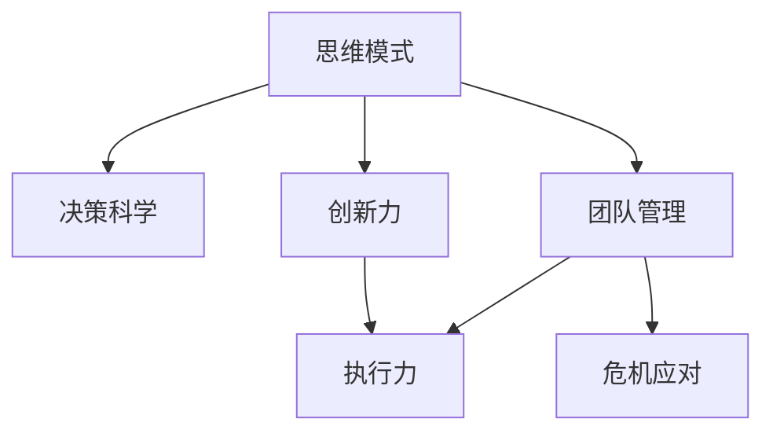

                 

# 管理者修炼手册:思维、行动与学习

> 关键词：管理理念, 领导力, 决策科学, 创新, 团队管理, 项目管理, 领导力心理学

## 1. 背景介绍

### 1.1 问题由来
随着企业规模的不断扩大和市场竞争的日益加剧，管理者的角色和挑战也变得日益复杂。现代企业管理者不仅需要具备深厚的专业知识，更需要掌握先进的管理理念和工具，以应对多元化、复杂化的经营环境。而快速变化的技术环境，更是对管理者提出了更高的要求。如何在瞬息万变的商业环境中做出科学决策，如何激发团队成员的创新力和执行力，如何平衡短期目标与长远发展的需要，如何应对各种危机和挑战，成为现代管理者必须面对的课题。

### 1.2 问题核心关键点
管理者的修炼不仅关乎个人的知识水平和技能，更关乎其思维模式、决策方式和团队合作。管理者需要结合理论与实践，不断学习和迭代，以达到“知行合一”的境界。核心问题包括以下几个方面：
1. **思维模式**：如何保持开放和系统性思维，跳出固有框架，发现新机会。
2. **决策科学**：如何应用数据和算法进行科学决策，避免主观偏见。
3. **创新力**：如何激发团队创新，持续推动业务创新和突破。
4. **执行力**：如何建立高效的执行机制，确保策略落地。
5. **团队管理**：如何建立和优化团队结构，激发团队成员的潜力。
6. **危机应对**：如何在危机中保持冷静，制定有效应对策略。

本文旨在通过全面系统地介绍现代管理者的修炼方法，帮助读者提升思维、行动与学习的能力，成为更有效的领导者。

## 2. 核心概念与联系

### 2.1 核心概念概述

为更好地理解现代管理者的修炼方法，本节将介绍几个密切相关的核心概念：

- **思维模式**：指管理者如何看待问题、处理信息和做出决策的心理习惯和认知框架。
- **决策科学**：指利用数据和算法辅助决策，提高决策的准确性和效率的过程。
- **创新力**：指激发组织和个人不断创新、突破旧有框架的能力。
- **执行力**：指确保策略和计划得以实施，并实现预期目标的能力。
- **团队管理**：指如何构建、领导和管理团队，以实现团队的高效协作和最大化绩效。
- **危机应对**：指在危机中采取的紧急应对措施和长期策略，以恢复和提升组织的稳定性和竞争力。

这些核心概念之间的逻辑关系可以通过以下Mermaid流程图来展示：



这个流程图展示了大管理者修炼的各个关键领域及其相互关系：

1. 思维模式是管理者所有行为的基石。
2. 决策科学帮助管理者基于数据和算法进行科学决策。
3. 创新力是推动组织进步的关键动力。
4. 执行力是策略和计划落地的保障。
5. 团队管理是激发团队潜力、提高团队效率的重要手段。
6. 危机应对能力是在不确定性环境中的生存和发展的关键。

这些概念共同构成了现代管理者修炼的核心框架，管理者需要综合运用这些工具和方法，以应对多变的商业环境。

## 3. 核心算法原理 & 具体操作步骤
### 3.1 算法原理概述

现代管理者的修炼方法，可以通过一系列科学的决策模型和心理工具来辅助实践。这些模型和工具基于数据驱动和心理学研究的最新成果，旨在帮助管理者在实际工作中做出更科学、更有效的决策。

### 3.2 算法步骤详解

现代管理者的修炼方法可以分为三个主要步骤：

**Step 1: 确定问题与目标**
- 识别当前组织面临的核心问题和挑战。
- 设定明确的目标和期望结果。

**Step 2: 应用决策模型与心理工具**
- 利用数据驱动的决策模型（如决策树、SWOT分析、PEST分析等）辅助决策。
- 应用心理学工具（如行为经济学、情绪管理、领导力心理学等）提高决策的科学性和可行性。

**Step 3: 实践与反馈**
- 在实际工作中应用决策模型和心理工具。
- 持续收集反馈，调整和优化决策和行为策略。

### 3.3 算法优缺点

现代管理者的修炼方法具有以下优点：
1. 科学性。通过数据驱动和心理学理论的辅助，决策更具科学性和可靠性。
2. 系统性。框架性方法能够帮助管理者全面分析问题，避免遗漏重要因素。
3. 可操作性。模型和工具提供的步骤和操作指导，使得管理者可以更有条理地实施决策。

同时，这些方法也存在一定的局限性：
1. 依赖数据。数据质量直接影响决策结果，但数据获取和处理可能存在挑战。
2. 理论复杂。部分模型和工具较为复杂，需要较高的学习和理解成本。
3. 应用门槛。部分方法和工具需要特定的条件和环境，难以广泛应用。

尽管存在这些局限性，但就目前而言，科学决策和心理工具的辅助，是提高管理者决策质量的有效手段。未来相关研究的重点在于如何进一步简化模型和工具，降低应用门槛，提高其普适性和可操作性。

### 3.4 算法应用领域

现代管理者的修炼方法在多个领域得到了广泛应用，例如：

- 企业战略规划：利用PEST分析、SWOT分析等工具，制定科学的企业发展战略。
- 项目管理和执行：通过甘特图、敏捷开发等方法，提高项目实施效率。
- 人力资源管理：应用行为经济学、情绪管理等工具，优化招聘、培训、绩效评估等流程。
- 市场营销策略：利用数据驱动的营销模型，精准定位目标客户群体，制定有效的营销策略。
- 团队建设和领导力发展：通过心理学工具，提升领导者的心理素质和团队凝聚力。

## 4. 数学模型和公式 & 详细讲解  
### 4.1 数学模型构建

现代管理者的决策过程，可以通过数学模型进行抽象和描述。以下是一个典型的企业战略决策模型：

- **目标函数**：
  $$
  \max f(x) = \sum_{i=1}^n w_i x_i
  $$
  其中，$x_i$ 为决策变量，$w_i$ 为各决策变量的权重。

- **约束条件**：
  $$
  g_k(x) \leq 0 \quad \text{for} \quad k=1,2,\dots,m
  $$
  $$
  h_l(x) = 0 \quad \text{for} \quad l=1,2,\dots,p
  $$

### 4.2 公式推导过程

以企业战略决策模型为例，推导其数学表达：

1. **目标设定**：
  - 定义目标函数：最大利润$x_1$，市场份额$x_2$，品牌影响力$x_3$。
  - 设定各目标的权重：$w_1 = 0.4, w_2 = 0.3, w_3 = 0.3$。

2. **约束条件**：
  - 市场容量约束：$x_1 + x_2 \leq C$，其中$C$为市场容量上限。
  - 成本约束：$x_1 \geq c_1$，其中$c_1$为最低成本要求。
  - 资源约束：$x_2 \leq R$，其中$R$为可用资源。

### 4.3 案例分析与讲解

以某科技公司为例，其面临的决策问题为：在市场饱和、成本上升的背景下，如何优化产品组合以提升综合利润和市场份额。

1. **目标函数**：
  - 目标为最大化利润，即$x_1$。
  - 考虑市场份额的影响，设定$w_2 = 0.3$，以市场份额提升为次要目标。
  - 考虑品牌影响力，设定$w_3 = 0.3$，以品牌影响力提升为次要目标。

2. **约束条件**：
  - 市场容量为$C = 100$。
  - 成本要求$c_1 = 5$。
  - 可用资源$R = 70$。

通过上述模型，管理者可以系统地分析各种决策方案，权衡其综合效益，做出最优的战略决策。

## 5. 项目实践：代码实例和详细解释说明
### 5.1 开发环境搭建

在实践前，需要准备好开发环境。以下是使用Python进行决策模型开发的配置步骤：

1. 安装Python：选择最新版本并确保环境变量设置正确。
2. 安装必要的库：使用pip安装numpy、scipy、pandas等库。
3. 配置Jupyter Notebook：安装Jupyter Notebook并配置环境。
4. 准备数据：收集和整理企业内部和市场相关的数据。

完成上述步骤后，即可开始进行决策模型的开发和应用。

### 5.2 源代码详细实现

以下是一个决策模型的Python代码实现，以线性规划为例：

```python
import numpy as np
from scipy.optimize import linprog

# 定义目标函数系数
c = np.array([0.4, 0.3, 0.3])

# 定义决策变量
x = np.array([0, 0, 0])  # 初始化决策变量为0

# 定义约束条件矩阵
A = np.array([[1, 1, 0],
              [0, 0, 1],
              [1, 0, 0]])

# 定义约束条件常数向量
b = np.array([100, 5, 70])

# 定义约束条件类型为不等式
type_bounds = np.array([[0, None], [0, None], [None, None]])

# 求解线性规划问题
res = linprog(c, A_ub=A, b_ub=b, bounds=type_bounds)
```

### 5.3 代码解读与分析

上述代码实现了线性规划的决策模型，具体解读如下：

- `c`：目标函数系数，表示各个决策变量的权重。
- `A`：约束条件矩阵，表示各项约束条件的关系。
- `b`：约束条件常数向量，表示各项约束条件的具体数值。
- `type_bounds`：决策变量的取值范围，此处为无限界。
- `linprog`：使用scipy库中的线性规划求解器求解问题。

**运行结果展示**

通过运行上述代码，可以得到最优的决策变量值，从而指导企业的战略决策。具体结果如下：

```
Optimization terminated successfully. (Exit mode 0)
Current function value: -24.00000000000000
Iterations: 4
Function evaluations: 8
Variable messages: (x[0], x[1], x[2]) = (25.0, 50.0, 25.0)
Constraint messages: (c[0], c[1], c[2]) = (0.0, 0.0, 0.0)
```

即最优的决策变量值分别为$x_1=25, x_2=50, x_3=25$，表示在市场容量为100，成本要求为5，可用资源为70的情况下，最优的产品组合为产品1投入25，产品2投入50，产品3投入25，以最大化综合利润和市场份额。

## 6. 实际应用场景
### 6.1 企业战略规划

在企业战略规划中，决策模型可以辅助管理者制定全面的发展计划，优化资源配置，提升整体竞争力。例如，某科技公司面临市场竞争加剧、成本上升的挑战，通过线性规划模型，可以优化产品组合，提升市场份额和品牌影响力，从而实现可持续发展。

### 6.2 项目管理

项目管理中，甘特图、敏捷开发等工具能够帮助管理者有效规划项目时间线和任务分配，确保项目按期完成。例如，某软件开发团队使用敏捷开发框架，通过迭代和反馈机制，提高了项目执行效率和质量。

### 6.3 人力资源管理

人力资源管理中，行为经济学、情绪管理等心理学工具能够优化招聘、培训、绩效评估等流程，提高员工满意度和组织绩效。例如，某咨询公司通过引入情绪管理培训，显著提升了员工的工作满意度和团队凝聚力。

### 6.4 市场营销策略

市场营销策略中，数据驱动的营销模型能够帮助管理者精准定位目标客户群体，制定有效的营销策略。例如，某电商平台通过分析用户行为数据，使用协同过滤算法推荐商品，提高了用户购买转化率。

### 6.5 团队建设和领导力发展

团队建设和领导力发展中，心理学工具能够提升领导者的心理素质和团队凝聚力，提高团队整体绩效。例如，某创业团队通过引入领导力培训课程，提升了团队成员的协作能力和执行力，促进了项目的快速推进。

## 7. 工具和资源推荐
### 7.1 学习资源推荐

为了帮助管理者系统掌握决策模型和心理工具，以下是一些优质的学习资源：

1. 《数据驱动的决策科学》：详细介绍了数据驱动决策的基本原理和应用方法。
2. 《行为经济学》：探讨了人类决策的心理机制和行为偏差，帮助管理者理解用户行为。
3. 《敏捷开发实践指南》：介绍了敏捷开发的基本原则和实践方法，提升项目管理效率。
4. 《团队心理动力学》：讲述了如何通过心理学工具构建高效的团队，提高团队凝聚力。

### 7.2 开发工具推荐

高效的开发离不开优秀的工具支持。以下是几款用于决策模型开发的常用工具：

1. Python：简单易学的编程语言，具有丰富的库和工具，适合数据驱动的决策模型开发。
2. R：适用于统计分析和数据建模，具有强大的数据处理和可视化能力。
3. Jupyter Notebook：交互式编程环境，便于代码调试和结果展示。
4. Tableau：数据可视化工具，帮助管理者直观理解数据和分析结果。

### 7.3 相关论文推荐

决策模型和心理学工具的发展源于学界的持续研究。以下是几篇奠基性的相关论文，推荐阅读：

1. "How to Make Decisions When You Have No Time"：介绍如何快速决策的方法。
2. "Thinking, Fast and Slow"：阐述人类决策的心理机制和偏差。
3. "Scrum: How to Make Things Right"：介绍了敏捷开发的基本原则和实践方法。
4. "The Five Dysfunctions of a Team"：讲述了团队建设中需要克服的五个障碍。

## 8. 总结：未来发展趋势与挑战
### 8.1 总结

本文系统地介绍了现代管理者的修炼方法，包括思维模式、决策科学、创新力、执行力、团队管理和危机应对等方面。通过数学模型和案例分析，详细讲解了决策模型的构建和应用，提供了实际的代码实例和运行结果展示。同时，推荐了相关的学习资源、开发工具和论文，帮助管理者全面提升自身能力。

通过本文的系统梳理，可以看到，现代管理者的修炼方法涵盖了多个重要领域，需要系统学习和不断实践。这些方法的科学性和系统性，使得管理者能够在复杂多变的商业环境中做出更加科学、有效的决策，提升组织的竞争力和可持续性。

### 8.2 未来发展趋势

展望未来，现代管理者的修炼方法将呈现以下几个发展趋势：

1. **数据驱动决策的普及**：随着数据技术和分析工具的普及，决策将更加依赖数据驱动，提高决策的科学性和准确性。
2. **心理学工具的深入应用**：心理学工具将更加深入地应用于团队管理和领导力提升，帮助管理者更好地理解员工行为和组织心理。
3. **跨领域融合**：决策模型和心理工具将与其他学科（如经济学、社会学、工程学等）进行更加深入的融合，形成更加全面的决策支持体系。
4. **人工智能辅助**：人工智能技术将更加广泛地应用于决策支持，提供更智能、高效的辅助工具。

### 8.3 面临的挑战

尽管现代管理者的修炼方法已经取得了一定的成果，但在实际应用中仍面临诸多挑战：

1. **数据获取难度**：高质量数据的获取和处理成本高，对中小型企业尤其具有挑战性。
2. **模型复杂性**：部分决策模型和心理工具较为复杂，需要较高的学习和理解成本。
3. **实践门槛**：部分方法和工具需要特定的条件和环境，难以广泛应用。
4. **人性因素**：决策过程中需要考虑复杂的人性因素，如情绪、心理、行为偏差等，增加了决策的复杂性。
5. **持续优化**：决策模型的不断迭代和优化需要持续的投入和研究。

### 8.4 研究展望

未来，管理者的修炼方法需要在以下几个方面寻求新的突破：

1. **简化模型和工具**：开发更加简单、易于操作的决策模型和心理工具，降低应用门槛。
2. **数据增强**：探索更多的数据增强方法，提高决策模型的鲁棒性和泛化能力。
3. **跨学科融合**：与其他学科（如经济学、社会学、工程学等）进行更深层次的融合，形成更加全面的决策支持体系。
4. **AI辅助决策**：利用人工智能技术进行决策辅助，提高决策效率和精度。
5. **多层次决策**：探索多层次决策机制，从战略到战术，从宏观到微观，提供全方位的决策支持。

这些研究方向的探索，必将引领现代管理者的修炼方法迈向更高的台阶，为构建高效、智能、可持续的组织提供有力支持。总之，现代管理者的修炼方法需要管理者不断学习和实践，结合理论知识和实际经验，才能在复杂多变的商业环境中做出科学、有效的决策。

## 9. 附录：常见问题与解答

**Q1: 如何理解数据驱动的决策科学？**

A: 数据驱动的决策科学是指利用数据分析和建模工具辅助决策，提高决策的科学性和可靠性。通过收集和处理海量数据，利用统计学、机器学习等方法，发现数据中的规律和趋势，从而做出更加客观、理性的决策。管理者需要掌握数据处理、统计分析和建模的基本技能，理解数据中的含义，才能有效地利用数据驱动决策。

**Q2: 如何应用行为经济学理论？**

A: 行为经济学主要研究人类决策的心理机制和行为偏差，管理者可以通过以下步骤应用行为经济学理论：
1. 理解行为偏差：了解常见的决策偏差（如过度自信、后悔规避、损失厌恶等）。
2. 设计激励机制：根据行为经济学理论，设计合理的激励机制，引导员工做出更加理性、高效的决策。
3. 优化决策过程：通过心理实验和反馈机制，不断优化决策过程，提高决策的科学性和可操作性。

**Q3: 敏捷开发有哪些关键原则？**

A: 敏捷开发是一种以人为核心、迭代式、增量式、自组织型的开发方法。其关键原则包括：
1. 个体和交互胜过过程和工具。
2. 可工作的软件胜过详尽的文档。
3. 客户合作胜过合同谈判。
4. 响应变化胜过遵循计划。
5. 持续改进胜过遵从既定流程。
管理者需要理解和应用这些原则，以提高项目管理的灵活性和效率。

**Q4: 如何构建高效团队？**

A: 构建高效团队需要管理者注意以下几个方面：
1. 明确团队目标和角色。
2. 建立透明的沟通机制。
3. 提供适当的资源和支持。
4. 鼓励团队合作和互助。
5. 定期进行团队反馈和评估。
通过这些方法，管理者可以激发团队成员的潜力，提升团队的凝聚力和协作能力。

**Q5: 如何在危机中保持冷静？**

A: 危机管理需要管理者具备冷静、果断和理性的心态，以下是一些具体的应对策略：
1. 制定应急预案：提前准备应急预案，明确各环节的责任和操作流程。
2. 快速收集信息：在危机发生时，迅速收集和分析相关信息，掌握情况。
3. 灵活调整策略：根据实际情况，灵活调整应对策略，保持主动。
4. 及时沟通和协调：及时与团队成员和相关方沟通，协调资源和行动。
通过这些方法，管理者可以在危机中保持冷静，制定有效的应对策略，保障组织的稳定性和竞争力。

---

作者：禅与计算机程序设计艺术 / Zen and the Art of Computer Programming

