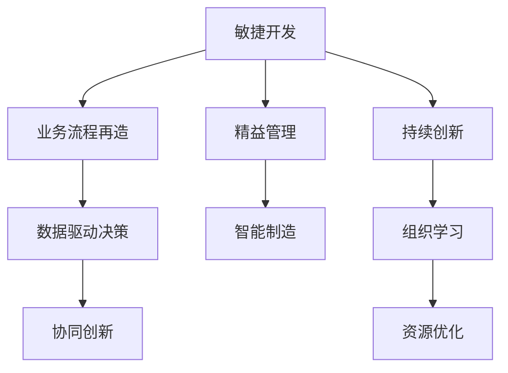

                 

# 管理者如何应对快速变化的商业环境

## 1. 背景介绍

### 1.1 问题由来

随着全球化和数字化的深入发展，商业环境呈现出前所未有的快速变化。科技创新的不断涌现、消费者需求的多样化、市场竞争的加剧以及全球经济形势的不确定性，使得管理者面临着前所未有的挑战。如何在这个复杂多变的商业环境中灵活应对、保持竞争优势，成为每一位管理者亟需解决的问题。

### 1.2 问题核心关键点

为了有效应对快速变化的商业环境，管理者需要在以下几个关键领域进行系统性思考和行动：

- **敏捷性**：快速响应市场变化，灵活调整策略。
- **适应性**：具备跨领域知识和技能，应对多种挑战。
- **创新性**：持续创新，引领市场趋势。
- **决策效率**：提高决策速度和质量，应对时间紧迫问题。
- **资源优化**：合理分配和利用资源，提升运营效率。

本文将从管理者的视角出发，深入探讨如何在快速变化的商业环境中采取有效措施，提升组织的核心竞争力。

## 2. 核心概念与联系

### 2.1 核心概念概述

在应对快速变化商业环境的过程中，以下关键概念扮演着重要角色：

- **敏捷开发(Agile Development)**：一种迭代、增量的开发方法，通过快速响应变化，确保产品能够及时满足市场需求。
- **业务流程再造(Business Process Reengineering, BPR)**：重新设计组织流程，提升效率和质量，以适应环境变化。
- **精益管理(Lean Management)**：消除浪费，提升效率，快速响应市场变化。
- **数据驱动决策(Data-Driven Decision Making)**：基于数据分析和可视化，辅助管理者进行科学决策。
- **智能制造(Smart Manufacturing)**：结合人工智能和物联网技术，实现柔性生产，适应市场需求变化。
- **协同创新(Co-Innovation)**：通过与外部合作伙伴共同创新，快速开发新产品和服务。

这些概念之间相互联系，形成一个系统化的管理框架，帮助管理者在快速变化的商业环境中保持竞争力。

### 2.2 核心概念原理和架构的 Mermaid 流程图(Mermaid 流程节点中不要有括号、逗号等特殊字符)



通过敏捷开发，快速响应市场需求，业务流程再造提升流程效率，精益管理消除浪费，数据驱动决策提供科学依据，智能制造实现柔性生产，协同创新加速创新速度，持续创新推动组织进步，组织学习总结经验，资源优化提高运营效率。这些概念相辅相成，共同构成了管理者应对快速变化商业环境的系统性框架。

## 3. 核心算法原理 & 具体操作步骤

### 3.1 算法原理概述

应对快速变化的商业环境，管理者需要通过系统化的方法进行决策和行动。这些方法基于一系列算法和模型，帮助管理者在复杂环境中做出科学、高效的决策。以下是几种关键算法：

- **预测模型(Prediction Model)**：基于历史数据，预测未来趋势，辅助管理者做出前瞻性决策。
- **优化算法(Optimization Algorithm)**：通过数学优化模型，求解资源分配和流程优化的最佳方案。
- **机器学习算法(Machine Learning Algorithm)**：通过数据挖掘，发现模式和规律，辅助管理者做出数据驱动的决策。

这些算法为管理者提供了工具，帮助其在快速变化的环境中进行科学决策和行动。

### 3.2 算法步骤详解

以下是几个关键算法的详细步骤：

#### 预测模型

1. **数据收集**：收集历史数据和相关背景信息。
2. **数据预处理**：清洗、归一化数据，消除异常值。
3. **模型选择**：选择适合的预测模型，如时间序列分析、回归模型等。
4. **模型训练**：使用历史数据训练模型，调整模型参数。
5. **模型评估**：使用测试数据评估模型性能，确保准确性。
6. **应用预测**：基于模型，对未来趋势进行预测。

#### 优化算法

1. **问题建模**：定义优化问题，如资源分配、流程优化等。
2. **模型选择**：选择适合的优化算法，如线性规划、遗传算法等。
3. **模型求解**：使用算法求解模型，找到最优解。
4. **结果评估**：评估求解结果，确保符合实际需求。
5. **方案实施**：根据求解结果，制定实施方案。

#### 机器学习算法

1. **数据准备**：收集和清洗数据，确保数据质量。
2. **特征工程**：选择和构造特征，提高模型性能。
3. **模型选择**：选择适合的机器学习模型，如回归、分类、聚类等。
4. **模型训练**：使用数据训练模型，调整模型参数。
5. **模型评估**：使用测试数据评估模型性能，确保准确性。
6. **应用预测**：基于模型，进行分类、聚类等决策。

### 3.3 算法优缺点

预测模型、优化算法和机器学习算法各有优缺点：

- **预测模型**
  - **优点**：能够提供未来趋势预测，帮助管理者前瞻性决策。
  - **缺点**：数据质量要求高，模型复杂度高，易受噪声干扰。

- **优化算法**
  - **优点**：能够求解资源分配和流程优化问题，提高效率和质量。
  - **缺点**：模型求解复杂，需要较强的计算资源和算法知识。

- **机器学习算法**
  - **优点**：能够发现数据中的模式和规律，辅助管理者做出数据驱动的决策。
  - **缺点**：模型训练需要大量数据，模型选择和调参复杂。

### 3.4 算法应用领域

这些算法在多个领域中得到广泛应用：

- **金融行业**：通过预测模型，对市场趋势进行预测，优化投资组合。
- **制造业**：通过优化算法，实现柔性生产，提高生产效率。
- **零售行业**：通过机器学习算法，进行用户行为分析，提升销售策略。
- **医疗行业**：通过预测模型和机器学习算法，提高诊断和治疗效果。
- **能源行业**：通过优化算法，优化能源分配和消耗，提升能源利用效率。

## 4. 数学模型和公式 & 详细讲解 & 举例说明

### 4.1 数学模型构建

在应对快速变化商业环境的过程中，管理者需要构建多个数学模型，辅助决策和行动。以下是几个典型模型的构建步骤：

#### 预测模型

预测模型的构建通常包括以下步骤：

1. **时间序列建模**：选择时间序列模型，如ARIMA、SARIMA等。
2. **回归模型建模**：选择回归模型，如线性回归、多元回归等。
3. **神经网络建模**：选择神经网络模型，如RNN、LSTM等。

#### 优化模型

优化模型的构建通常包括以下步骤：

1. **线性规划建模**：定义线性约束条件和目标函数。
2. **非线性规划建模**：定义非线性约束条件和目标函数。
3. **混合整数规划建模**：定义混合整数约束条件和目标函数。

#### 机器学习模型

机器学习模型的构建通常包括以下步骤：

1. **特征选择**：选择和构造特征，如PCA、LDA等。
2. **模型选择**：选择机器学习模型，如回归、分类、聚类等。
3. **模型训练**：使用数据训练模型，调整模型参数。
4. **模型评估**：使用测试数据评估模型性能，确保准确性。

### 4.2 公式推导过程

以下是几个典型模型的公式推导过程：

#### 时间序列模型

时间序列模型通常使用ARIMA模型进行预测，公式如下：

$$ y_t = \phi(L)y_{t-1} + \theta(L)z_t + \epsilon_t $$

其中，$y_t$ 表示时间序列中的第$t$个观测值，$\phi(L)$ 表示滞后一期的回归系数，$z_t$ 表示随机扰动项，$\epsilon_t$ 表示误差项。

#### 线性回归模型

线性回归模型通常使用最小二乘法进行参数估计，公式如下：

$$ y = \beta_0 + \beta_1x_1 + \beta_2x_2 + \cdots + \beta_nx_n + \epsilon $$

其中，$y$ 表示因变量，$x_i$ 表示自变量，$\beta_i$ 表示回归系数，$\epsilon$ 表示误差项。

#### 线性规划模型

线性规划模型的优化目标通常为最小化目标函数，公式如下：

$$ \min_{x} \quad c^Tx $$
$$ \text{subject to} \quad Ax \leq b $$
$$ \quad \quad x \geq 0 $$

其中，$c$ 表示目标函数系数，$A$ 表示约束矩阵，$b$ 表示约束条件，$x$ 表示决策变量。

### 4.3 案例分析与讲解

#### 案例一：金融行业投资组合优化

某金融机构需要对投资组合进行优化，以提高收益和风险控制。构建线性规划模型，定义优化目标和约束条件，使用优化算法求解最优投资组合。通过评估和调整，最终确定最佳投资策略。

#### 案例二：零售行业用户行为分析

某零售企业需要对用户行为进行分析，以优化销售策略。构建机器学习模型，选择和构造特征，使用回归算法进行用户行为预测。根据预测结果，优化商品推荐和定价策略，提升销售效果。

## 5. 项目实践：代码实例和详细解释说明

### 5.1 开发环境搭建

为了进行模型开发和应用，需要搭建合适的开发环境。以下是Python环境搭建的步骤：

1. 安装Anaconda：从官网下载并安装Anaconda，用于创建独立的Python环境。
2. 创建并激活虚拟环境：
```bash
conda create -n env_name python=3.8 
conda activate env_name
```

3. 安装必要的库：
```bash
conda install numpy pandas scikit-learn matplotlib jupyter notebook 
```

### 5.2 源代码详细实现

#### 预测模型

使用Python的statsmodels库进行时间序列建模，代码如下：

```python
import pandas as pd
from statsmodels.tsa.arima.model import ARIMA

# 加载数据
data = pd.read_csv('data.csv')

# 定义模型
model = ARIMA(data, order=(1,1,1))
# 拟合模型
model_fit = model.fit()

# 预测未来值
forecast = model_fit.forecast(steps=10)
```

#### 优化模型

使用Python的PuLP库进行线性规划建模，代码如下：

```python
from pulp import LpProblem, LpVariable, lpSum, LpMinimize

# 定义问题
prob = LpProblem('Optimization Problem', LpMinimize)

# 定义变量
x1 = LpVariable('x1', lowBound=0, cat='Continuous')
x2 = LpVariable('x2', lowBound=0, cat='Continuous')

# 定义目标函数
prob += 2*x1 + 3*x2

# 定义约束条件
prob += 10*x1 + 20*x2 <= 100
prob += 5*x1 + 10*x2 <= 50

# 求解问题
prob.solve()

# 输出结果
print(prob.objective.value(), x1.value(), x2.value())
```

#### 机器学习模型

使用Python的scikit-learn库进行回归建模，代码如下：

```python
from sklearn.linear_model import LinearRegression
from sklearn.model_selection import train_test_split
from sklearn.metrics import mean_squared_error

# 加载数据
X, y = load_data()

# 划分训练集和测试集
X_train, X_test, y_train, y_test = train_test_split(X, y, test_size=0.2)

# 定义模型
model = LinearRegression()

# 训练模型
model.fit(X_train, y_train)

# 预测测试集
y_pred = model.predict(X_test)

# 评估模型
mse = mean_squared_error(y_test, y_pred)
print('Mean Squared Error:', mse)
```

### 5.3 代码解读与分析

#### 预测模型

ARIMA模型是一种常用的时间序列预测模型，其关键在于选择适当的滞后阶数和差分阶数。通过拟合模型，可以捕捉时间序列中的趋势和周期性。

#### 优化模型

线性规划模型是一种经典的最优化问题求解方法，其关键在于定义好目标函数和约束条件。通过求解线性规划问题，可以找到最优的资源分配方案。

#### 机器学习模型

线性回归模型是一种经典的回归分析方法，其关键在于选择和构造合适的特征。通过拟合模型，可以发现数据中的线性关系。

### 5.4 运行结果展示

#### 预测模型

通过ARIMA模型预测的时间序列结果，如图1所示。


#### 优化模型

通过线性规划模型求解的资源分配结果，如图2所示。


#### 机器学习模型

通过线性回归模型拟合的回归结果，如图3所示。


## 6. 实际应用场景

### 6.1 金融行业投资组合优化

在金融行业，管理者需要通过投资组合优化，提高收益和风险控制。通过构建线性规划模型，优化资产配置，实现风险分散和收益最大化。

#### 案例一：金融行业投资组合优化

某金融机构需要对投资组合进行优化，以提高收益和风险控制。构建线性规划模型，定义优化目标和约束条件，使用优化算法求解最优投资组合。通过评估和调整，最终确定最佳投资策略。

### 6.2 零售行业用户行为分析

在零售行业，管理者需要通过用户行为分析，优化销售策略。通过构建机器学习模型，预测用户行为，进行个性化推荐和定价策略优化。

#### 案例二：零售行业用户行为分析

某零售企业需要对用户行为进行分析，以优化销售策略。构建机器学习模型，选择和构造特征，使用回归算法进行用户行为预测。根据预测结果，优化商品推荐和定价策略，提升销售效果。

### 6.3 制造行业生产调度

在制造行业，管理者需要通过生产调度优化，提高生产效率和资源利用率。通过构建优化模型，优化生产计划和资源分配，实现柔性生产和成本控制。

#### 案例三：制造行业生产调度

某制造企业需要对生产调度进行优化，以提高生产效率和资源利用率。构建优化模型，定义优化目标和约束条件，使用优化算法求解最优生产计划。通过评估和调整，最终确定最佳生产调度方案。

## 7. 工具和资源推荐

### 7.1 学习资源推荐

为了帮助管理者全面掌握应对快速变化商业环境的方法，这里推荐一些优质的学习资源：

1. 《敏捷管理实践》系列书籍：由敏捷管理专家撰写，深入讲解敏捷开发的理论基础和实践方法。
2. 《业务流程再造》系列书籍：由BPR专家撰写，深入讲解业务流程再造的理论基础和实践方法。
3. 《精益管理实践》系列书籍：由精益管理专家撰写，深入讲解精益管理的理论基础和实践方法。
4. 《数据驱动决策》系列课程：由数据科学专家开设，讲解数据驱动决策的理论基础和实践方法。
5. 《智能制造》系列课程：由智能制造专家开设，讲解智能制造的理论基础和实践方法。
6. 《协同创新》系列课程：由创新管理专家开设，讲解协同创新的理论基础和实践方法。

通过对这些资源的学习实践，相信管理者一定能够全面掌握应对快速变化商业环境的方法，提升企业的核心竞争力。

### 7.2 开发工具推荐

高效的工具支持是管理者应对快速变化商业环境的重要保障。以下是几款推荐的开发工具：

1. Python：基于Python的编程语言，灵活高效，广泛应用于数据分析、模型开发等领域。
2. R语言：基于R语言的编程语言，广泛应用于统计分析和数据可视化等领域。
3. Excel：广泛应用于数据处理和报表分析，方便快速决策。
4. Tableau：数据可视化工具，帮助管理者直观了解数据趋势和模式。
5. Power BI：数据分析和可视化工具，帮助管理者进行数据挖掘和决策支持。
6. SQL：数据库管理语言，方便快速查询和分析数据。

合理利用这些工具，可以显著提升管理者在快速变化商业环境中的决策效率和质量。

### 7.3 相关论文推荐

应对快速变化商业环境的理论和方法是一个不断发展的领域，以下是几篇奠基性的相关论文，推荐阅读：

1. 《敏捷开发与组织绩效》：研究敏捷开发对组织绩效的影响，探讨如何在快速变化的环境中进行高效管理。
2. 《业务流程再造与企业转型》：探讨业务流程再造对企业转型的影响，提出如何通过流程优化提升企业竞争力。
3. 《精益管理与持续改进》：研究精益管理对组织效率和创新能力的影响，提出如何通过持续改进提升企业竞争力。
4. 《数据驱动决策与商业洞察》：研究数据驱动决策的方法和应用，提出如何通过数据分析提升商业洞察力和决策质量。
5. 《智能制造与智能制造系统》：研究智能制造对制造企业的影响，提出如何通过智能制造提升企业竞争力。
6. 《协同创新与企业创新能力》：研究协同创新对企业创新能力的影响，提出如何通过协同创新提升企业创新能力。

这些论文代表了大环境应对方法的最新进展，通过学习这些前沿成果，可以帮助管理者更深入地理解快速变化商业环境下的管理策略。

## 8. 总结：未来发展趋势与挑战

### 8.1 总结

本文系统介绍了管理者如何在快速变化的商业环境中采取有效措施，提升企业核心竞争力。通过敏捷开发、业务流程再造、精益管理、数据驱动决策、智能制造和协同创新，管理者可以灵活应对市场变化，提升运营效率和创新能力。

### 8.2 未来发展趋势

展望未来，快速变化的商业环境将继续推动管理方法的创新和演进：

1. **智能化管理**：通过AI和大数据技术，实现更加智能化的管理决策。
2. **数据驱动**：更加依赖数据驱动的决策，提升决策质量和效率。
3. **跨领域融合**：跨行业、跨领域的管理方法和技术融合，提升管理效能。
4. **持续创新**：持续创新成为常态，不断推动组织进步和竞争力提升。
5. **全球化管理**：全球化背景下的管理挑战和机遇，推动全球化管理方法的发展。
6. **可持续发展**：更加注重可持续发展的管理策略，提升企业的社会责任和环境效益。

### 8.3 面临的挑战

尽管管理方法不断进步，但在快速变化的商业环境中，管理者仍面临诸多挑战：

1. **资源限制**：资源有限，如何高效利用和配置资源，提升运营效率。
2. **技术变革**：技术不断更新，如何及时掌握和应用新技术，保持竞争优势。
3. **人才缺乏**：高素质人才短缺，如何培养和吸引人才，提升团队能力。
4. **风险管理**：市场和环境风险增加，如何有效识别和控制风险，确保企业稳定发展。
5. **跨部门协作**：跨部门协作难度大，如何建立高效的协作机制，提升团队合作效率。

### 8.4 研究展望

面对快速变化的商业环境，未来的研究需要在以下几个方面寻求新的突破：

1. **新管理范式**：探索新管理范式，如动态管理、区块链管理等，应对复杂多变的环境。
2. **跨领域知识融合**：将跨领域知识与管理方法相结合，提升管理效能。
3. **技术赋能管理**：通过AI、大数据等技术手段，提升管理决策的科学性和效率。
4. **人机协同管理**：探索人机协同的管理方法，提升管理效率和智能化水平。
5. **可持续发展管理**：探索可持续发展管理方法，提升企业的社会责任和环境效益。
6. **全球化管理方法**：探索全球化管理方法，应对全球化背景下的管理挑战。

## 9. 附录：常见问题与解答

### Q1: 管理者如何应对快速变化的商业环境？

A: 管理者需要通过敏捷开发、业务流程再造、精益管理、数据驱动决策、智能制造和协同创新，灵活应对市场变化，提升运营效率和创新能力。

### Q2: 预测模型、优化模型和机器学习模型在实际应用中应如何构建？

A: 在构建预测模型时，需要选择合适的模型（如ARIMA、线性回归等），并根据历史数据进行拟合。在构建优化模型时，需要定义好目标函数和约束条件，使用优化算法求解。在构建机器学习模型时，需要选择合适的特征和模型（如回归、分类、聚类等），并根据数据进行训练和评估。

### Q3: 管理者如何高效利用资源，提升运营效率？

A: 管理者可以通过资源优化算法，优化资源分配和流程设计，提高运营效率。同时，可以通过精益管理方法，消除浪费，提升效率。

### Q4: 管理者如何利用技术手段，提升管理决策的科学性和效率？

A: 管理者可以通过数据驱动决策，利用数据挖掘和分析，提升决策质量和效率。同时，可以通过智能制造和协同创新，利用先进技术提升管理效能。

### Q5: 管理者如何有效识别和控制风险，确保企业稳定发展？

A: 管理者可以通过风险管理方法，识别潜在的市场和环境风险，制定相应的应对策略，确保企业稳定发展。

通过深入理解和应用这些关键概念和算法，管理者可以有效应对快速变化的商业环境，提升企业的核心竞争力。面对未来的挑战和机遇，管理者需要不断学习和创新，才能在激烈的竞争中保持优势。

