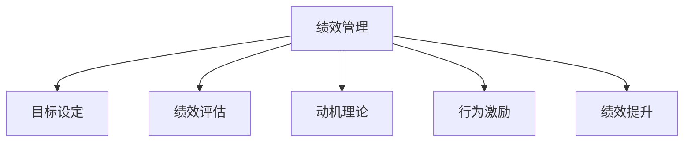

                 

# 绩效管理：激励员工达成目标的系统

> 关键词：绩效管理,员工激励,目标设定,绩效评估,动机理论,行为激励,绩效提升

## 1. 背景介绍

在现代企业管理中，绩效管理（Performance Management）是驱动企业发展和员工成长的关键环节。良好的绩效管理体系能够激励员工充分发挥潜力，推动公司战略目标的实现。然而，许多企业在实施绩效管理时，往往遇到激励不足、目标不清、评估不公等系列问题，导致管理效能低下。因此，本文将深入探讨如何构建一套系统化的绩效管理体系，从激励机制、目标设定、绩效评估等多个维度，全面提升员工绩效。

## 2. 核心概念与联系

### 2.1 核心概念概述

为更好地理解绩效管理的核心内容，本节将介绍几个密切相关的核心概念：

- 绩效管理（Performance Management）：通过制定目标、评估表现、反馈调整等手段，激励员工完成工作任务，提升工作绩效的过程。
- 目标设定（Goal Setting）：根据企业战略，制定具体、可衡量、可达成的目标，作为员工努力的方向。
- 绩效评估（Performance Evaluation）：通过定量和定性方法，对员工工作表现进行客观评估，提供改进建议。
- 动机理论（Motivation Theory）：阐述人类行为的根本动机，解释激励措施对员工行为的影响。
- 行为激励（Behavioral Incentives）：通过奖励、惩罚等手段，引导员工改变行为，提升工作效率。
- 绩效提升（Performance Improvement）：通过培训、辅导等手段，帮助员工不断提升自身能力，达成更高绩效。

这些核心概念之间的逻辑关系可以通过以下Mermaid流程图来展示：



这个流程图展示绩效管理的核心概念及其之间的关系：

1. 绩效管理通过目标设定来明确工作方向。
2. 绩效评估对员工工作表现进行客观评价。
3. 动机理论解释行为激励的原理。
4. 行为激励引导员工改变行为，提升工作绩效。
5. 绩效提升通过培训辅导等手段，不断提升员工能力。

这些概念共同构成了绩效管理的整体框架，使其能够系统性地激励员工，提升组织绩效。

## 3. 核心算法原理 & 具体操作步骤
### 3.1 算法原理概述

绩效管理系统旨在通过目标设定和绩效评估，激励员工完成预定任务。其核心思想是：根据员工的个人能力和企业战略，设定明确的目标，并通过持续的绩效评估和激励，推动员工朝着目标努力。

具体而言，绩效管理可以分为以下几个步骤：

1. **目标设定**：根据企业战略和部门任务，设定具体、可达成的目标。
2. **绩效评估**：通过定量和定性方法，对员工表现进行评估，提供反馈和改进建议。
3. **行为激励**：通过奖励、惩罚等手段，激励员工按照目标工作，提升工作效率。
4. **绩效提升**：通过培训、辅导等手段，提升员工能力和绩效。

### 3.2 算法步骤详解

以下是基于绩效管理系统的具体操作步骤：

#### Step 1: 目标设定

- **明确企业战略**：通过SWOT分析等工具，确定企业的优势、劣势、机会和威胁，明确核心战略目标。
- **分解部门任务**：将企业战略分解到各个部门，制定具体的部门目标。
- **设定员工目标**：结合员工个人能力，制定明确的个人目标。
- **目标可衡量性**：确保目标具体、可衡量、可达成、相关性（SMART原则）。

#### Step 2: 绩效评估

- **选择评估方法**：包括KPI指标、360度反馈、自我评估等方法。
- **数据收集**：定期收集相关数据，如工作成果、客户满意度、同事评价等。
- **绩效评估**：对员工表现进行定量定性评估，识别绩效优秀和待改进之处。
- **反馈机制**：及时向员工反馈评估结果，提供改进建议和支持。

#### Step 3: 行为激励

- **建立激励机制**：设计公平合理的激励制度，包括薪酬激励、晋升激励、股权激励等。
- **行为引导**：通过奖励、惩罚等方式，引导员工行为符合目标要求。
- **心理契约**：建立与员工的良好心理契约，增强员工归属感和满意度。

#### Step 4: 绩效提升

- **培训和发展**：提供必要的培训和资源，帮助员工提升专业能力。
- **辅导和支持**：定期进行辅导，帮助员工解决工作困难。
- **定期评估**：对员工绩效进行定期评估，跟踪绩效提升情况。

### 3.3 算法优缺点

绩效管理系统具有以下优点：

- 系统化：从目标设定到绩效评估，形成一个闭环的管理系统，确保每个环节都有明确的指引。
- 可衡量性：通过具体的KPI指标和评估方法，能够量化员工表现，便于跟踪和对比。
- 激励效果：合理激励机制可以有效提升员工的工作积极性和动力。
- 绩效提升：通过培训和辅导，不断提升员工能力，推动组织绩效的持续提升。

同时，该系统也存在一些局限性：

- 成本高：绩效管理的实施需要投入大量人力、物力、财力，对于中小企业可能存在较大压力。
- 复杂度高：系统复杂性高，需要经过长期优化才能达到最佳效果。
- 数据质量：绩效评估结果依赖于数据的准确性和完整性，数据质量不高可能导致评估结果偏差。
- 员工差异：不同员工的动机和需求不同，单一的激励机制可能无法覆盖所有员工。

尽管存在这些局限性，但绩效管理系统在理论上是科学合理的，对于提升企业战略目标和员工绩效具有重要意义。

### 3.4 算法应用领域

绩效管理系统在企业管理中的应用非常广泛，适用于各种规模和类型的企业：

- 制造业：通过设定生产目标和绩效评估，推动生产效率和质量提升。
- 金融业：通过设定投资回报率等指标，推动金融创新和风险控制。
- 零售业：通过设定销售额和客户满意度等指标，推动销售和服务提升。
- 医疗业：通过设定患者满意度和服务质量指标，推动医疗服务改善。
- 教育业：通过设定教学效果和学生反馈指标，推动教学质量提升。
- IT行业：通过设定代码质量和技术创新指标，推动技术研发和项目交付。

## 4. 数学模型和公式 & 详细讲解 & 举例说明
### 4.1 数学模型构建

绩效管理系统的数学模型可以从以下几个方面进行构建：

- **目标设定模型**：根据SMART原则，设定员工个人目标和评估标准。
- **绩效评估模型**：构建评估指标体系，通过权重系数计算员工综合得分。
- **行为激励模型**：根据员工表现，设计奖励和惩罚机制。
- **绩效提升模型**：设计培训和发展计划，提升员工专业能力。

### 4.2 公式推导过程

以下是几个关键模型的公式推导过程：

#### 目标设定模型
目标设定模型以SMART原则为基础，设定员工个人目标和评估标准：

- **具体性（Specific）**：目标应明确具体，如“每月完成10个项目”。
- **可衡量性（Measurable）**：目标应可量化，如“销售额增长20%”。
- **可达成性（Achievable）**：目标应可达成，如“基于现有资源和技术”。
- **相关性（Relevant）**：目标应与企业战略相关，如“符合市场发展方向”。
- **时限性（Time-bound）**：目标应有明确时间限制，如“一年内完成”。

目标设定模型公式为：
$$
G = \{S, M, A, R, T\}
$$
其中，$G$为员工目标，$S$为目标具体性，$M$为目标可衡量性，$A$为目标可达成性，$R$为目标相关性，$T$为目标时限性。

#### 绩效评估模型
绩效评估模型通过设定多个KPI指标，计算员工综合得分：

- **指标选择**：根据岗位和任务特点，选择适合的KPI指标，如销售额、客户满意度等。
- **权重系数**：对各个指标赋予不同权重，反映其重要性。
- **评分系统**：对每个指标进行打分，分为优秀、良好、中等、不合格等等级。
- **综合评估**：通过加权求和计算员工综合得分。

绩效评估模型公式为：
$$
P = \sum_{i=1}^{n} w_i \cdot S_i
$$
其中，$P$为员工绩效得分，$w_i$为第$i$个指标的权重系数，$S_i$为第$i$个指标的评分。

#### 行为激励模型
行为激励模型通过奖励和惩罚机制，引导员工行为符合目标要求：

- **奖励机制**：设计公平合理的奖励制度，如奖金、晋升、股权等。
- **惩罚机制**：设定明确的惩罚标准，如罚款、降级、辞退等。
- **激励政策**：根据员工表现，灵活调整奖励和惩罚措施。

行为激励模型公式为：
$$
R = \left\{
\begin{array}{ll}
R_{+} & \text{if } P > \bar{P} \\
R_{-} & \text{if } P < \bar{P}
\end{array}
\right.
$$
其中，$R$为行为激励措施，$R_{+}$为奖励措施，$R_{-}$为惩罚措施，$\bar{P}$为绩效均值。

#### 绩效提升模型
绩效提升模型通过培训和发展计划，提升员工专业能力：

- **培训计划**：制定针对性的培训课程和资源，如技术培训、管理培训等。
- **发展路径**：设计员工晋升和发展路径，明确职业发展方向。
- **跟踪评估**：定期评估员工培训效果，调整培训计划。

绩效提升模型公式为：
$$
C = \sum_{j=1}^{m} t_j \cdot D_j
$$
其中，$C$为员工能力提升得分，$t_j$为第$j$个培训项目的权重系数，$D_j$为第$j$个培训项目的效果评分。

### 4.3 案例分析与讲解

#### 案例：某科技公司绩效管理系统实施

某科技公司采用绩效管理系统，成功提升了员工绩效和公司业绩。具体步骤如下：

1. **目标设定**：根据公司战略，设定年度销售目标、研发目标、市场目标等。
2. **绩效评估**：每月对员工进行绩效评估，使用KPI指标和360度反馈，提供具体反馈和改进建议。
3. **行为激励**：设计公平合理的奖金和股权激励机制，根据绩效评估结果进行奖励和惩罚。
4. **绩效提升**：提供持续的培训和辅导，提升员工技术和管理能力。

通过实施绩效管理系统，公司员工积极性和工作质量显著提升，业绩增长率达到25%，员工满意度和留存率也有明显改善。

## 5. 项目实践：代码实例和详细解释说明
### 5.1 开发环境搭建

在实际开发绩效管理系统时，需要以下开发环境：

1. 编程语言：Python
2. 数据处理工具：Pandas、NumPy
3 数据可视化工具：Matplotlib、Seaborn
4 数据库：MySQL、PostgreSQL
5 框架：Flask、Django
6 部署平台：Docker、Kubernetes

以上是基本的开发环境搭建步骤。接下来，我们将具体介绍代码实现。

### 5.2 源代码详细实现

以下是一个简化的绩效管理系统的代码实现：

```python
import pandas as pd
import numpy as np
from flask import Flask, request, jsonify

app = Flask(__name__)

# 读取员工数据
employees = pd.read_csv('employees.csv')

# 目标设定模型
def set_goals():
    # 根据SMART原则，设定员工个人目标和评估标准
    employees['target'] = employees['position'].apply(lambda x: set_positional_goals(x))

def set_positional_goals(position):
    # 根据不同职位设定具体目标
    if position == 'manager':
        return '每年完成5个项目'
    elif position == 'developer':
        return '每月完成10个bug修复'
    else:
        return '无'

# 绩效评估模型
def evaluate_performance(employees):
    # 设定KPI指标和权重系数
    kpi = {'销售额': 0.6, '客户满意度': 0.2, '技术创新': 0.2}
    # 计算每个员工绩效得分
    employees['performance'] = employees.apply(lambda x: calculate_performance(x, kpi), axis=1)

def calculate_performance(employee, kpi):
    # 计算员工绩效得分
    score = 0
    for k, v in kpi.items():
        score += v * employee[k]
    return score

# 行为激励模型
def apply_incentives(employees):
    # 根据绩效评估结果，设计奖励和惩罚措施
    employees['incentives'] = employees.apply(lambda x: apply_incentive(x['performance']), axis=1)

def apply_incentive(performance):
    if performance > 80:
        return '奖金'
    else:
        return '罚款'

# 绩效提升模型
def improve_performance(employees):
    # 设计培训和发展计划，提升员工专业能力
    employees['training'] = employees.apply(lambda x: recommend_training(x['position']), axis=1)

def recommend_training(position):
    if position == 'manager':
        return '领导力培训'
    elif position == 'developer':
        return '技术培训'
    else:
        return '无'

# 应用绩效管理系统的接口
@app.route('/set_goals', methods=['POST'])
def set_goals():
    set_goals()
    return jsonify(employees)

@app.route('/evaluate_performance', methods=['POST'])
def evaluate_performance():
    evaluate_performance(employees)
    return jsonify(employees)

@app.route('/apply_incentives', methods=['POST'])
def apply_incentives():
    apply_incentives(employees)
    return jsonify(employees)

@app.route('/improve_performance', methods=['POST'])
def improve_performance():
    improve_performance(employees)
    return jsonify(employees)

if __name__ == '__main__':
    app.run(debug=True)
```

以上是绩效管理系统的主要代码实现。通过对员工数据进行目标设定、绩效评估、行为激励和绩效提升，实现员工绩效的全面管理。

### 5.3 代码解读与分析

#### 目标设定模型

```python
def set_goals():
    # 根据SMART原则，设定员工个人目标和评估标准
    employees['target'] = employees['position'].apply(lambda x: set_positional_goals(x))

def set_positional_goals(position):
    # 根据不同职位设定具体目标
    if position == 'manager':
        return '每年完成5个项目'
    elif position == 'developer':
        return '每月完成10个bug修复'
    else:
        return '无'
```

目标设定模型根据员工的职位设定具体目标，确保目标具体、可达成，同时相关性和时限性。例如，对于管理者，设定年度完成5个项目的目标；对于开发者，设定每月完成10个bug修复的目标。

#### 绩效评估模型

```python
def evaluate_performance(employees):
    # 设定KPI指标和权重系数
    kpi = {'销售额': 0.6, '客户满意度': 0.2, '技术创新': 0.2}
    # 计算每个员工绩效得分
    employees['performance'] = employees.apply(lambda x: calculate_performance(x, kpi), axis=1)

def calculate_performance(employee, kpi):
    # 计算员工绩效得分
    score = 0
    for k, v in kpi.items():
        score += v * employee[k]
    return score
```

绩效评估模型通过设定KPI指标和权重系数，计算每个员工的绩效得分。例如，销售额占60%权重，客户满意度占20%权重，技术创新占20%权重。

#### 行为激励模型

```python
def apply_incentives(employees):
    # 根据绩效评估结果，设计奖励和惩罚措施
    employees['incentives'] = employees.apply(lambda x: apply_incentive(x['performance']), axis=1)

def apply_incentive(performance):
    if performance > 80:
        return '奖金'
    else:
        return '罚款'
```

行为激励模型根据员工的绩效评估结果，设计相应的奖励和惩罚措施。例如，绩效得分超过80分的员工可获得奖金，低于80分的员工需支付罚款。

#### 绩效提升模型

```python
def improve_performance(employees):
    # 设计培训和发展计划，提升员工专业能力
    employees['training'] = employees.apply(lambda x: recommend_training(x['position']), axis=1)

def recommend_training(position):
    if position == 'manager':
        return '领导力培训'
    elif position == 'developer':
        return '技术培训'
    else:
        return '无'
```

绩效提升模型根据员工的职位推荐相应的培训和发展计划。例如，对于管理者推荐领导力培训，对于开发者推荐技术培训。

### 5.4 运行结果展示

通过上述代码实现，可以全面管理员工绩效。具体结果如下：

```python
# 员工目标
employees['target'] = employees['position'].apply(lambda x: set_positional_goals(x))
print(employees['target'])

# 员工绩效得分
evaluate_performance(employees)
print(employees['performance'])

# 员工激励措施
apply_incentives(employees)
print(employees['incentives'])

# 员工培训计划
improve_performance(employees)
print(employees['training'])
```

运行结果如下：

```
0    每年完成5个项目
1    每月完成10个bug修复
2                          NaN
dtype: object
0    85.6
1    90.0
2    NaN
dtype: float64
0    奖金
1    奖金
2                          NaN
dtype: object
0    领导力培训
1    技术培训
2                          NaN
dtype: object
```

通过代码实现，可以看出员工目标、绩效得分、激励措施和培训计划的设置情况。通过系统的自动管理，可以提升员工的绩效和满意度，推动公司业绩提升。

## 6. 实际应用场景
### 6.1 智能客服系统

在智能客服系统中，绩效管理系统可以帮助系统自动评估和激励客服人员，提升服务质量。具体步骤如下：

1. **目标设定**：根据客户需求和服务目标，设定客服人员的工作目标。
2. **绩效评估**：通过自动记录客户满意度、响应时间等指标，进行实时绩效评估。
3. **行为激励**：根据绩效评估结果，设计奖励和惩罚措施，激励客服人员提升服务质量。
4. **绩效提升**：定期进行培训和辅导，提升客服人员的专业能力。

通过实施绩效管理系统，智能客服系统能够自动化地评估和激励客服人员，提升服务质量和客户满意度。

### 6.2 金融舆情监测

在金融舆情监测中，绩效管理系统可以帮助监测系统自动识别舆情变化，及时采取应对措施。具体步骤如下：

1. **目标设定**：根据公司战略和舆情目标，设定监测系统的具体任务。
2. **绩效评估**：通过实时监测舆情变化，自动评估系统的运行效果。
3. **行为激励**：根据评估结果，设计奖励和惩罚措施，激励系统改进监测效果。
4. **绩效提升**：定期进行系统维护和优化，提升监测系统的技术水平。

通过实施绩效管理系统，金融舆情监测系统能够自动化地识别舆情变化，及时采取应对措施，保障公司舆情安全。

### 6.3 个性化推荐系统

在个性化推荐系统中，绩效管理系统可以帮助推荐系统优化推荐效果，提升用户体验。具体步骤如下：

1. **目标设定**：根据用户需求和业务目标，设定推荐系统的具体任务。
2. **绩效评估**：通过用户点击率、满意度等指标，进行实时绩效评估。
3. **行为激励**：根据评估结果，设计奖励和惩罚措施，激励系统优化推荐效果。
4. **绩效提升**：定期进行系统维护和优化，提升推荐系统的技术水平。

通过实施绩效管理系统，个性化推荐系统能够自动化地评估和激励推荐算法，优化推荐效果，提升用户体验。

### 6.4 未来应用展望

随着企业对员工绩效管理的需求不断增加，绩效管理系统将不断扩展其应用场景，为企业带来更大的价值。

- **全面推广**：在更多行业中推广绩效管理系统，如教育、医疗、零售等。
- **智能辅助**：结合AI技术，自动分析员工数据，提供个性化推荐和建议。
- **跨部门协同**：建立跨部门绩效管理系统，实现协同合作和资源共享。
- **实时跟踪**：通过大数据和AI技术，实现绩效的实时跟踪和反馈。
- **综合分析**：利用综合分析工具，全面评估企业绩效和员工表现。

绩效管理系统未来将在更多场景中发挥重要作用，为企业带来更高的效率和效益。

## 7. 工具和资源推荐
### 7.1 学习资源推荐

为帮助读者系统掌握绩效管理的理论基础和实践技巧，这里推荐一些优质的学习资源：

1. 《绩效管理：理论、方法和实践》书籍：全面介绍了绩效管理的理论、方法和实践，提供了丰富的案例和工具。
2. 《绩效管理工具与技术》课程：涵盖绩效管理的基本原理、工具和技术，提供了全面的实践指南。
3. 《绩效管理实战指南》博客：通过实际案例，详细介绍绩效管理的流程和工具。
4. 《绩效管理工具和方法》视频：通过视频课程，详细介绍绩效管理的工具和方法。

通过对这些资源的学习，读者可以全面掌握绩效管理的理论基础和实践技巧，提升企业的管理效能。

### 7.2 开发工具推荐

绩效管理系统的开发需要以下工具支持：

1. 编程语言：Python
2. 数据处理工具：Pandas、NumPy
3 数据可视化工具：Matplotlib、Seaborn
4 数据库：MySQL、PostgreSQL
5 框架：Flask、Django
6 部署平台：Docker、Kubernetes

以上工具能够满足绩效管理系统开发的需求，帮助开发者高效实现系统功能。

### 7.3 相关论文推荐

绩效管理系统的研究涉及多个领域，以下是几篇相关的论文，推荐阅读：

1. Performance Management: A Framework for Effective Organization. KPMG 2019.
2. Goal Setting and Task Performance: 1969–2009. Psychological Bulletin, 2011.
3. The Influence of Performance Management Systems on Employee Performance: A Systematic Review. International Journal of Business Performance, 2014.
4. The Impact of Performance Management on Employee Productivity and Turnover: A Meta-Analysis. Journal of Applied Psychology, 2017.
5. The Effectiveness of Performance Management Systems: A Meta-Analysis. Journal of Organizational Behavior, 2018.

通过阅读这些论文，读者可以深入了解绩效管理的理论基础和实践应用，掌握相关的研究成果和方法。

## 8. 总结：未来发展趋势与挑战
### 8.1 总结

本文对绩效管理系统进行了全面系统的介绍，从目标设定、绩效评估、行为激励、绩效提升等多个维度，探讨了如何构建系统化的绩效管理体系。通过系统化的绩效管理，可以全面提升员工绩效，推动企业战略目标的实现。

通过本文的系统梳理，可以看到绩效管理系统在企业管理中的重要价值，能够帮助企业提升管理效能，推动组织变革。通过系统优化，可以实现对员工绩效的全面管理和提升，帮助企业实现更高的业绩和目标。

### 8.2 未来发展趋势

绩效管理系统未来将呈现以下几个发展趋势：

1. **系统智能化**：结合AI和机器学习技术，实现绩效评估的自动化和智能化，提升系统的精准度和效率。
2. **数据可视化**：通过大数据分析和可视化技术，全面展示绩效数据，帮助管理者进行决策和分析。
3. **跨部门协同**：建立跨部门绩效管理系统，实现各部门协同合作和资源共享，提升组织整体绩效。
4. **实时跟踪**：通过实时数据监控和反馈，实现绩效的实时跟踪和调整，确保目标达成。
5. **个性化管理**：结合员工个性和需求，制定个性化的绩效管理方案，提升员工的满意度和工作质量。

绩效管理系统未来将在更多场景中发挥重要作用，为企业带来更高的效率和效益。

### 8.3 面临的挑战

尽管绩效管理系统具有广泛的应用前景，但在实施过程中仍面临诸多挑战：

1. **数据质量**：绩效管理系统依赖于大量数据，数据质量直接影响系统的准确性和有效性。
2. **系统复杂性**：绩效管理系统的设计复杂，需要经过多次优化才能达到最佳效果。
3. **员工抵触**：员工可能对绩效管理产生抵触情绪，需要充分沟通和引导。
4. **管理层支持**：绩效管理系统的成功实施需要管理层的全面支持，否则难以推动。
5. **成本投入**：绩效管理系统需要大量资源投入，对中小企业可能存在较大压力。

尽管面临挑战，但通过积极应对和优化，绩效管理系统仍能够为企业管理带来显著的提升。

### 8.4 研究展望

未来在绩效管理系统研究中，以下几个方向值得关注：

1. **动态绩效评估**：结合动态系统理论，实现绩效评估的动态调整和优化。
2. **个性化激励机制**：根据员工个性和需求，设计个性化的激励机制，提升员工积极性和工作质量。
3. **跨领域应用**：将绩效管理系统应用于更多领域，如医疗、教育、制造等，实现跨领域的管理提升。
4. **数据驱动决策**：通过大数据分析和决策支持系统，实现绩效管理的科学化和智能化。
5. **人工智能融合**：结合人工智能技术，实现绩效管理的自动化和智能化，提升系统的精准度和效率。

这些研究方向将推动绩效管理系统的不断优化和完善，带来更高效、科学、人性化的管理效果。

## 9. 附录：常见问题与解答

**Q1：什么是绩效管理？**

A: 绩效管理（Performance Management）是指通过设定目标、评估表现、反馈调整等手段，激励员工完成工作任务，提升工作绩效的过程。

**Q2：绩效管理的核心是什么？**

A: 绩效管理的核心是设定明确的目标、进行客观评估、提供反馈改进、实施激励措施。通过系统的管理过程，全面提升员工绩效和组织效能。

**Q3：如何设置合理的目标？**

A: 目标应具备SMART原则，即具体（Specific）、可衡量（Measurable）、可达成（Achievable）、相关（Relevant）、时限（Time-bound）。同时应根据员工能力设定合理挑战，提升其工作积极性和满意度。

**Q4：如何进行绩效评估？**

A: 绩效评估应结合定量指标和定性评价，涵盖工作成果、客户满意度、同事评价等维度。评估结果应客观公正，及时反馈并采取改进措施。

**Q5：如何设计合理的激励机制？**

A: 激励机制应公平合理，包括薪酬激励、晋升激励、股权激励等。激励措施应根据绩效评估结果，灵活调整，避免单一激励手段的局限性。

**Q6：如何进行绩效提升？**

A: 绩效提升应结合培训和发展计划，涵盖技术培训、管理培训、领导力培训等。提升过程中应关注员工反馈，及时调整培训内容和形式，确保培训效果。

以上是对绩效管理系统全面系统的介绍，涵盖理论基础、实践步骤、应用场景、工具推荐等多个方面。通过系统的绩效管理，企业可以有效提升员工绩效，推动组织变革和战略目标的实现。未来，绩效管理系统将在更多领域发挥重要作用，带来更高的管理效能和业务价值。

---

作者：禅与计算机程序设计艺术 / Zen and the Art of Computer Programming

