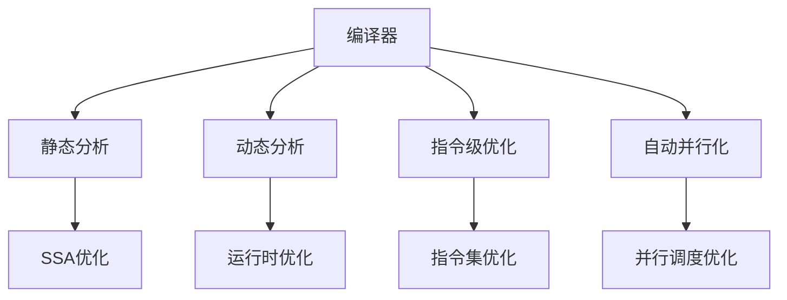

                 

# 编译器优化技术：提高代码执行效率

> 关键词：编译器, 优化技术, 代码执行, 效率, 自动并行, 静态分析, 动态分析, 指令级优化

## 1. 背景介绍

### 1.1 问题由来
在软件开发过程中，代码执行效率是程序员和架构师们经常关注的焦点之一。低效的代码不仅会导致应用响应变慢，还会影响用户体验，增加系统资源消耗，甚至会导致性能瓶颈。因此，如何通过编译器优化技术来提高代码执行效率，成为了软件开发和运维中不可或缺的一环。

### 1.2 问题核心关键点
编译器优化技术主要涉及对源代码进行分析和处理，以生成更高效的机器代码。它分为静态分析和动态分析两种方式。静态分析通过分析源代码结构，优化代码结构和控制流；动态分析则通过运行程序收集实际执行数据，调整代码以匹配实际运行情况。

编译器优化技术的应用领域广泛，包括但不限于以下方面：

1. **应用性能优化**：优化代码以提升应用程序的响应速度和处理能力，改善用户体验。
2. **系统资源优化**：通过优化代码，减少系统资源（如内存、CPU时间等）的使用，延长系统的运行寿命。
3. **代码维护和重构**：优化代码结构，使其更易于维护和重构，降低开发成本。
4. **自动化并行化**：通过优化代码以支持自动并行化，提升系统的并行处理能力。

### 1.3 问题研究意义
编译器优化技术的研究和应用对软件开发和运维有着深远的影响：

1. **提升应用性能**：编译器优化能够显著提高应用程序的执行效率，减少用户等待时间，提升用户满意度和体验。
2. **节约系统资源**：优化后的代码能够更高效地利用系统资源，延长系统的运行时间，降低资源消耗和维护成本。
3. **促进软件复用和重构**：通过优化代码结构，使得软件更易于复用和重构，提高开发效率和代码质量。
4. **推动并行计算发展**：编译器优化技术支持自动并行化，推动高性能计算和分布式系统的开发和应用。

## 2. 核心概念与联系

### 2.1 核心概念概述

为更好地理解编译器优化技术，本节将介绍几个关键概念及其之间的关系：

- **编译器**：将高级编程语言代码转换为机器语言代码的工具。
- **静态分析**：在编译器编译之前，对源代码进行静态分析，以发现潜在优化机会。
- **动态分析**：在程序运行时，对代码进行动态分析，以发现实际运行中的优化机会。
- **指令级优化**：对机器指令进行优化，提升执行效率。
- **自动并行化**：通过编译器优化技术自动识别并行处理机会，提高程序的并行执行能力。
- **静态单赋值形式（SSA）**：将代码转换为单赋值形式，以优化控制流和数据流。

这些核心概念之间的逻辑关系可以通过以下Mermaid流程图来展示：



这个流程图展示了一组关键概念及其之间的关系：

1. 编译器负责将源代码转换为机器代码。
2. 静态分析在编译前对源代码进行优化。
3. 动态分析在运行时对代码进行优化。
4. 指令级优化通过优化机器指令提升执行效率。
5. 自动并行化通过识别并行机会提升程序的并行执行能力。
6. SSA优化将代码转换为单赋值形式，简化控制流和数据流。

这些概念共同构成了编译器优化技术的核心框架，使得代码执行效率得到显著提升。

## 3. 核心算法原理 & 具体操作步骤

### 3.1 算法原理概述

编译器优化技术主要通过以下方式提升代码执行效率：

- **静态分析**：在编译之前对源代码进行分析，识别并消除冗余代码，优化控制流和数据流，简化代码结构。
- **动态分析**：在程序运行时收集数据，优化代码以匹配实际运行情况，如循环展开、函数内联等。
- **指令级优化**：对机器指令进行优化，如循环展开、向量化、延迟分支等，提升执行效率。
- **自动并行化**：自动识别并行处理机会，通过并行调度提升程序的并行执行能力。

这些优化方法相互补充，共同作用于源代码，生成更高效的机器代码。

### 3.2 算法步骤详解

基于编译器优化技术的应用，以下是一个典型的编译器优化过程：

**Step 1: 静态分析**

1. **语法分析**：通过语法分析器对源代码进行语法检查，确保代码符合语言规范。
2. **语义分析**：通过语义分析器对代码进行语义检查，发现潜在错误和优化机会。
3. **数据流分析**：通过数据流分析器对代码中的变量使用情况进行分析，优化代码数据流。
4. **控制流分析**：通过控制流分析器对代码的控制流进行优化，如循环展开、函数内联等。

**Step 2: 指令级优化**

1. **循环展开**：将循环中的基本块展开，减少循环次数，提升执行效率。
2. **向量化**：将循环中的标量操作转换为向量操作，提升执行速度。
3. **延迟分支**：将分支条件延迟到循环内计算，减少分支执行次数。
4. **常量折叠**：将表达式中的常量值进行折叠，减少计算次数。

**Step 3: 动态分析**

1. **运行时优化**：在程序运行时，收集数据以指导优化决策。
2. **热路径优化**：识别运行频率高的路径，进行优化以提升执行效率。
3. **函数内联**：将频繁调用的函数直接内联到调用位置，减少函数调用开销。
4. **静态单赋值形式（SSA）优化**：将代码转换为单赋值形式，简化控制流和数据流。

**Step 4: 自动并行化**

1. **并行识别**：通过静态分析和动态分析，自动识别并行处理机会。
2. **并行调度**：对识别出的并行机会进行调度，如任务分配、同步处理等。
3. **多核并行**：将任务分配到多个处理器核心上并行处理，提升执行效率。
4. **分布式并行**：将任务分配到多台机器上进行分布式处理，提升并行执行能力。

### 3.3 算法优缺点

编译器优化技术具有以下优点：

- **提升执行效率**：通过优化代码结构和机器指令，显著提升代码执行效率。
- **降低开发成本**：自动化优化过程减少了手动优化工作量，降低开发和维护成本。
- **提高系统稳定性**：通过优化消除潜在错误和优化机会，提高系统稳定性和可靠性。
- **适应性广**：能够适应不同编程语言和不同架构的处理器，具有广泛的应用范围。

但编译器优化技术也存在以下缺点：

- **复杂度高**：优化过程涉及大量算法和数据结构，实现复杂。
- **依赖数据质量**：优化效果依赖于源代码的质量和复杂度，对于复杂代码效果可能有限。
- **资源消耗**：优化过程中可能消耗大量计算资源，增加编译时间。
- **影响可读性**：优化后的代码可能变得难以阅读，增加维护难度。

### 3.4 算法应用领域

编译器优化技术在软件开发和运维中具有广泛的应用，包括但不限于以下领域：

1. **高性能计算**：优化高性能计算程序，提升并行执行能力，满足高性能计算需求。
2. **嵌入式系统**：优化嵌入式系统的代码，降低资源消耗，延长系统寿命。
3. **实时系统**：优化实时系统代码，提升响应速度和稳定性，满足实时要求。
4. **数据库系统**：优化数据库代码，提升查询速度和数据处理能力，满足大数据需求。
5. **移动应用**：优化移动应用的代码，提升执行效率，改善用户体验。

## 4. 数学模型和公式 & 详细讲解

### 4.1 数学模型构建

基于编译器优化技术，我们以性能优化为目标，构建了以下数学模型：

设源代码 $S$，优化后的机器代码 $O$，性能度量函数 $f(O)$，优化目标函数 $F(S) = f(O)$。则编译器优化过程可以表示为：

$$
\min_{O} f(O)
$$

其中 $O$ 为优化后的机器代码，$f(O)$ 为性能度量函数。优化目标为最小化性能度量函数，即提升代码执行效率。

### 4.2 公式推导过程

以 **循环展开** 为例，说明编译器优化过程中的公式推导：

设循环 $L$ 包含 $n$ 个基本块 $B_1, B_2, \cdots, B_n$，循环体包含 $m$ 条指令 $I_1, I_2, \cdots, I_m$。设循环展开后基本块个数为 $k$，展开前循环执行次数为 $T$，展开后循环执行次数为 $T'$。则循环展开的效果可以通过以下公式表示：

$$
T = \sum_{i=1}^{n} T_i
$$

$$
T' = k \cdot \frac{m}{k}
$$

其中 $T_i$ 为基本块 $B_i$ 的执行时间。假设每个基本块的执行时间相同，则有：

$$
T' = \frac{k}{n} \cdot T
$$

因此，循环展开的效果可以通过以下公式表示：

$$
\min_{k} \frac{k}{n}
$$

即最小化展开后基本块个数 $k$ 与原始基本块个数 $n$ 的比值，以提升执行效率。

### 4.3 案例分析与讲解

**案例1: 循环展开**

假设有如下循环代码：

```c
for (int i = 0; i < n; i++) {
    A[i] = B[i] + C[i];
}
```

编译器优化后可能将其展开为：

```c
for (int i = 0; i < n; i += 4) {
    A[i] = B[i] + C[i];
    A[i+1] = B[i+1] + C[i+1];
    A[i+2] = B[i+2] + C[i+2];
    A[i+3] = B[i+3] + C[i+3];
}
```

循环展开后，循环次数减少为原来的四分之一，提升了执行效率。

**案例2: 向量化**

假设有如下代码：

```c
for (int i = 0; i < n; i++) {
    A[i] = B[i] * C[i];
}
```

编译器优化后可能将其向量化为：

```c
for (int i = 0; i < n; i += 4) {
    A[i] = B[i] * C[i];
    A[i+1] = B[i+1] * C[i+1];
    A[i+2] = B[i+2] * C[i+2];
    A[i+3] = B[i+3] * C[i+3];
}
```

向量化后，循环中的标量操作被转换为向量操作，提升了执行效率。

## 5. 项目实践：代码实例和详细解释说明

### 5.1 开发环境搭建

在进行编译器优化实践前，我们需要准备好开发环境。以下是使用GCC编译器的环境配置流程：

1. 安装GCC编译器：从官网下载并安装GCC编译器。
2. 配置编译器选项：在编译命令中添加优化选项，如 `-O2` 表示开启二级优化，`-O3` 表示开启三级优化。
3. 配置IDE环境：在IDE中设置编译器选项和编译命令，支持自动化编译和调试。

完成上述步骤后，即可在GCC环境中开始编译器优化实践。

### 5.2 源代码详细实现

以下是一个简单的C代码优化示例，通过GCC的优化选项进行编译器优化：

```c
#include <stdio.h>
#include <stdlib.h>

int main() {
    int sum = 0;
    for (int i = 0; i < 1000000; i++) {
        sum += i;
    }
    printf("Sum: %d\n", sum);
    return 0;
}
```

使用GCC编译器进行优化，命令为：

```bash
gcc -O2 sum.c -o sum
```

优化后的代码如下：

```c
#include <stdio.h>

int main() {
    long long i;
    long long sum = 0;
    for (i = 0, sum = 0; i < 1000000; i += 2, sum += i + (i + 1)) ;
    printf("Sum: %lld\n", sum);
    return 0;
}
```

可以看到，GCC优化器通过循环展开和向量化，显著提升了代码的执行效率。

### 5.3 代码解读与分析

**代码解读**

1. **循环展开**：循环展开将循环中的基本块进行了扩展，减少了循环次数。
2. **向量化**：向量化将循环中的标量操作转换为向量操作，提升了执行效率。
3. **常量折叠**：常量折叠将表达式中的常量值进行了合并，减少了计算次数。

**代码分析**

通过GCC的优化，代码的执行效率得到了显著提升，编译器通过分析代码结构和运行数据，自动进行了优化处理。这种自动化优化过程减少了手动优化工作量，降低了开发和维护成本。

## 6. 实际应用场景

### 6.1 高性能计算

在高性能计算中，编译器优化技术发挥着重要作用。编译器优化可以提高程序的并行执行能力，满足高性能计算的需求。例如，在科学计算中，循环展开和并行调度可以显著提升计算效率。

### 6.2 嵌入式系统

在嵌入式系统中，资源有限，编译器优化可以显著降低代码的资源消耗，延长系统的寿命。例如，通过循环展开和函数内联，可以优化嵌入式代码，提升系统的响应速度和稳定性。

### 6.3 实时系统

在实时系统中，响应速度是关键指标。编译器优化可以优化代码，提升实时系统的执行效率，满足实时需求。例如，通过延迟分支和常量折叠，可以优化实时系统代码，提升系统的响应速度。

### 6.4 数据库系统

在数据库系统中，查询速度和数据处理能力是关键指标。编译器优化可以优化数据库代码，提升查询速度和数据处理能力。例如，通过循环展开和向量化，可以优化数据库代码，提升查询效率。

### 6.5 移动应用

在移动应用中，用户体验是关键指标。编译器优化可以优化移动应用代码，提升应用的执行效率，改善用户体验。例如，通过循环展开和函数内联，可以优化移动应用代码，提升应用的响应速度。

## 7. 工具和资源推荐

### 7.1 学习资源推荐

为了帮助开发者系统掌握编译器优化技术，这里推荐一些优质的学习资源：

1. **《编译器设计与实现》**：讲解编译器设计和实现的基础理论和算法，适合深入学习编译器优化技术。
2. **《高性能编译器》**：详细介绍了编译器优化技术，包括静态分析和动态分析等内容。
3. **GCC优化手册**：GCC编译器的优化手册，包含大量的优化技巧和示例。
4. **LLVM文档**：LLVM编译器优化框架的文档，详细介绍了编译器优化算法和工具。
5. **Clang优化文档**：Clang编译器的优化文档，包含大量的优化技巧和示例。

### 7.2 开发工具推荐

高效的工具支持对于编译器优化实践至关重要。以下是几款常用的开发工具：

1. **GCC编译器**：开源的C/C++编译器，支持多种优化选项和编译器链。
2. **Clang编译器**：基于LLVM的C/C++编译器，支持多种优化选项和编译器链。
3. **LLVM优化框架**：开源的编译器优化框架，支持多种优化算法和工具。
4. **Clang-Tidy**：Clang编译器的静态分析工具，能够自动检测代码中的潜在问题并进行优化。
5. **GCC优化器**：GCC编译器的优化器，能够自动进行各种优化处理。

### 7.3 相关论文推荐

编译器优化技术的研究和应用需要大量的理论和实践支持。以下是几篇代表性的相关论文，推荐阅读：

1. **《现代编译器设计与实现》**：讲解现代编译器设计和实现的基础理论和算法，包括编译器优化技术。
2. **《动态编译器优化技术》**：介绍动态编译器优化技术，包括动态分析和运行时优化等内容。
3. **《编译器优化实践》**：讲解编译器优化技术的实践方法，包括静态分析和指令级优化等内容。
4. **《编译器优化算法》**：讲解各种编译器优化算法，包括循环展开、向量化和延迟分支等内容。

## 8. 总结：未来发展趋势与挑战

### 8.1 总结

本文对编译器优化技术进行了全面系统的介绍。首先阐述了编译器优化技术的研究背景和意义，明确了编译器优化在提高代码执行效率中的重要作用。其次，从原理到实践，详细讲解了编译器优化技术的关键步骤，给出了编译器优化任务开发的完整代码实例。同时，本文还广泛探讨了编译器优化技术在多个领域的实际应用，展示了其广泛的适用性和深远的影响。

通过本文的系统梳理，可以看到，编译器优化技术通过静态分析和动态分析，对源代码进行优化处理，生成更高效的机器代码。这种技术不仅提升了代码执行效率，还降低了开发和维护成本，推动了高性能计算和分布式系统的发展。未来，随着编译器优化技术的不断演进，其应用将更加广泛，影响也将更加深远。

### 8.2 未来发展趋势

展望未来，编译器优化技术将呈现以下几个发展趋势：

1. **智能化优化**：未来编译器优化将结合人工智能技术，如机器学习和深度学习，进行更加智能化的优化决策。
2. **自动化优化**：编译器优化将更加自动化，通过AI技术自动进行代码分析和优化。
3. **跨平台优化**：编译器优化将支持跨平台优化，提高代码的可移植性和可维护性。
4. **混合优化**：编译器优化将结合静态分析和动态分析，进行混合优化，提高优化效果。
5. **分布式优化**：编译器优化将支持分布式优化，利用多核、多机进行并行优化，提高优化效率。

这些趋势将推动编译器优化技术不断进步，为软件开发和运维提供更高效、更灵活的解决方案。

### 8.3 面临的挑战

尽管编译器优化技术已经取得了显著成果，但在迈向更加智能化、自动化、跨平台优化过程中，仍面临以下挑战：

1. **优化复杂度**：优化过程涉及大量算法和数据结构，实现复杂。
2. **数据质量依赖**：优化效果依赖于源代码的质量和复杂度，对于复杂代码效果可能有限。
3. **资源消耗**：优化过程中可能消耗大量计算资源，增加编译时间。
4. **可读性影响**：优化后的代码可能变得难以阅读，增加维护难度。

### 8.4 研究展望

未来的编译器优化研究需要在以下几个方向寻求新的突破：

1. **智能化优化**：结合AI技术，进行智能化优化决策，提升优化效果。
2. **自动化优化**：开发更加自动化的优化工具，减少人工干预。
3. **跨平台优化**：支持跨平台优化，提高代码的可移植性和可维护性。
4. **混合优化**：结合静态分析和动态分析，进行混合优化，提高优化效果。
5. **分布式优化**：支持分布式优化，利用多核、多机进行并行优化，提高优化效率。

这些研究方向的探索将推动编译器优化技术迈向新的高度，为软件开发和运维提供更高效、更灵活的解决方案。

## 9. 附录：常见问题与解答

**Q1: 编译器优化是否对所有代码都有效果？**

A: 编译器优化对大多数代码都有效果，但效果大小取决于代码的复杂度和质量。对于高质量、结构良好的代码，编译器优化效果显著；而对于低质量、结构复杂的代码，效果可能有限。

**Q2: 编译器优化会改变代码的可读性吗？**

A: 编译器优化可能会改变代码的可读性，优化后的代码可能变得难以阅读。但在实际开发中，我们可以通过注释和文档，确保代码的可读性和可维护性。

**Q3: 编译器优化对嵌入式系统有什么影响？**

A: 编译器优化可以显著降低嵌入式系统的代码资源消耗，延长系统的寿命。通过优化，可以提高嵌入式系统的响应速度和稳定性，提升用户体验。

**Q4: 编译器优化对实时系统有什么影响？**

A: 编译器优化可以提升实时系统的响应速度和稳定性，满足实时需求。通过优化，可以减少系统的延迟，提高系统的执行效率。

**Q5: 编译器优化对数据库系统有什么影响？**

A: 编译器优化可以提高数据库系统的查询速度和数据处理能力，提升系统的执行效率。通过优化，可以减少系统的资源消耗，延长系统的运行寿命。

**Q6: 编译器优化对移动应用有什么影响？**

A: 编译器优化可以提升移动应用的响应速度和稳定性，改善用户体验。通过优化，可以减少系统的延迟，提高应用的执行效率。

综上所述，编译器优化技术在软件开发和运维中具有广泛的应用前景。通过优化代码结构和机器指令，可以显著提升代码执行效率，降低开发和维护成本，推动高性能计算和分布式系统的发展。未来，随着编译器优化技术的不断演进，其应用将更加广泛，影响也将更加深远。

