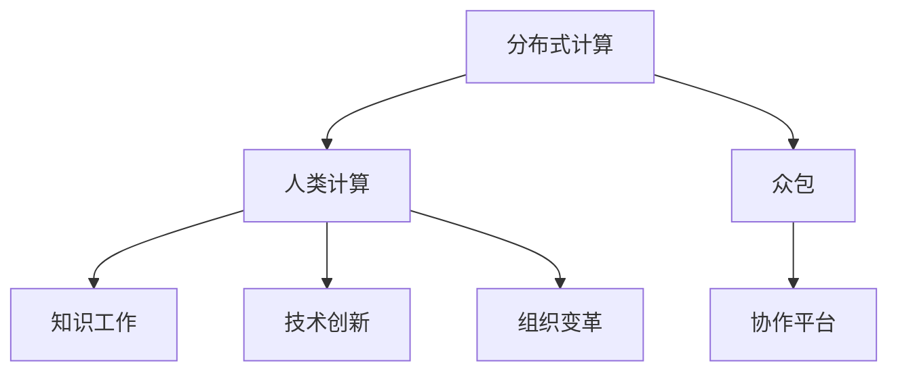

                 

# 群体智慧：人类计算的基石

> 关键词：群体智慧,人类计算,分布式计算,众包,知识工作,协作平台,技术创新,组织变革

## 1. 背景介绍

### 1.1 问题由来
随着数字化和互联网技术的发展，人类社会正经历着前所未有的变革。从工业社会到信息社会，再到今天的人工智能时代，计算已经成为驱动社会进步的核心动力之一。然而，传统的计算模式已经难以应对日趋复杂和庞大的计算任务，急需引入新的计算范式以实现更高层次的智能化和协作化。

### 1.2 问题核心关键点
1. **计算范式的演变**：从集中式计算到分布式计算，再到人类计算（Human Computing），计算模式正朝着更加智能化和协作化的方向发展。
2. **分布式计算的局限**：虽然分布式计算提升了计算效率，但计算资源的调度和管理仍存在瓶颈，难以充分发挥计算潜力。
3. **人类计算的意义**：人类计算利用人类的智慧和协作能力，将传统计算任务与人类思维相结合，提供更高效、更灵活、更智能的解决方案。

### 1.3 问题研究意义
探讨和实践群体智慧在计算中的应用，有助于理解人类计算的潜力和局限，推动计算模式的创新，促进社会和经济的可持续发展。研究群体智慧的计算机制和实现方法，对于探索新的计算范式、提升协作效率、激发创新活力具有重要意义。

## 2. 核心概念与联系

### 2.1 核心概念概述

群体智慧（Crowdsourcing）是指通过汇聚大量人群的力量，利用人的智慧和创造力解决复杂问题。人类计算（Human Computing）则是将人类智慧与计算技术相结合，利用人类思维和协作能力进行计算和分析。

#### 2.1.1 分布式计算
分布式计算（Distributed Computing）是一种将计算任务分解成多个子任务，由多台计算机协同完成计算的方法。其核心思想是通过并行计算提升计算效率。

#### 2.1.2 众包（Crowdsourcing）
众包是指通过在线平台汇聚来自全球各地的劳动力，利用其劳动力资源解决各种问题。典型的众包平台如Amazon Mechanical Turk、CrowdFlower等。

#### 2.1.3 知识工作（Knowledge Work）
知识工作（Knowledge Work）是指利用人的智慧和创造力，解决复杂、非标准化的工作任务。如软件开发生命周期中的需求分析、系统设计、测试等。

#### 2.1.4 协作平台（Collaboration Platform）
协作平台（Collaboration Platform）是指通过网络技术，支持人们远程协作的工具和系统。如Slack、Trello、GitHub等。

#### 2.1.5 技术创新（Technological Innovation）
技术创新是指通过技术进步和应用创新，推动社会进步和经济发展的过程。群体智慧和人类计算的实践，本身就是一种重要的技术创新。

#### 2.1.6 组织变革（Organizational Change）
组织变革是指通过引入新的管理理念和技术，提升组织效率和适应性的过程。群体智慧和人类计算的应用，将对传统组织结构和管理模式带来深远影响。

这些核心概念之间的逻辑关系可以通过以下Mermaid流程图来展示：



这个流程图展示了一系列计算模式及其之间的联系：

1. 分布式计算是基础，通过并行处理提升计算效率。
2. 人类计算利用分布式计算，将复杂任务分解为人类可处理的子任务。
3. 众包汇聚大量劳动力，提供丰富的计算资源。
4. 知识工作利用人的智慧解决复杂任务，提升工作质量。
5. 协作平台支持远程协作，提升团队工作效率。
6. 技术创新推动计算模式演进，促进社会进步。
7. 组织变革适应新技术，提升组织适应性。

## 3. 核心算法原理 & 具体操作步骤
### 3.1 算法原理概述

群体智慧和人类计算的核心算法原理在于将计算任务分解为可处理的子任务，通过多人群体的协作来完成计算。这一过程通常包括以下几个关键步骤：

1. **任务分解**：将复杂计算任务分解为多个子任务，每个子任务由一组人群处理。
2. **任务分配**：根据人群的可用时间和技能，分配任务。
3. **任务执行**：人群完成任务的子任务，提交结果。
4. **结果聚合**：汇总子任务结果，得出最终计算结果。
5. **反馈和优化**：根据任务执行情况，调整任务分配策略和人群参与方式。

### 3.2 算法步骤详解

#### 3.2.1 任务分解
任务分解是将复杂计算任务拆分为若干个可处理的子任务。以图像分类为例，原始图像可以拆分为若干子任务，每个子任务由一组人群对图像进行分类。

#### 3.2.2 任务分配
任务分配根据人群的可用时间和技能，将子任务分配给合适的人群。可以通过在线众包平台或内部管理系统进行任务分配。

#### 3.2.3 任务执行
任务执行是人群对子任务进行处理的实际过程。可以通过在线协作工具和系统，实现远程协作和实时沟通。

#### 3.2.4 结果聚合
结果聚合是将人群提交的子任务结果汇总，得出最终计算结果。通常通过简单的平均、投票等方式进行聚合。

#### 3.2.5 反馈和优化
根据任务执行情况，调整任务分配策略和人群参与方式。通过分析任务完成时间、准确率、人群反馈等信息，优化任务分配和人群管理策略。

### 3.3 算法优缺点

#### 3.3.1 优点
1. **灵活性和可扩展性**：人类计算利用了人的智慧和协作能力，可以适应各种复杂和非标准化的计算任务。
2. **成本效益**：相比于传统集中式计算，人类计算在初期成本较低，通过利用廉价劳动力，能够降低计算成本。
3. **多样性和创新性**：不同人群的智慧和经验可以带来多样化的视角和创新性解决方案。
4. **社会参与**：人类计算能够促进社会参与，提高社会凝聚力和公平性。

#### 3.3.2 缺点
1. **质量不稳定**：人群参与的计算质量不稳定，受个体差异和任务复杂度影响较大。
2. **数据隐私和安全**：需要处理大量敏感数据时，数据隐私和安全问题尤为突出。
3. **管理复杂性**：任务分配、结果聚合和反馈优化等环节的管理复杂，需要投入大量资源。
4. **技术依赖**：依赖于协作平台和在线工具，技术故障和网络问题可能影响计算效率。

### 3.4 算法应用领域

#### 3.4.1 工业设计
工业设计中，设计师可以通过众包平台收集用户反馈和设计方案，提升设计质量和效率。例如，Dropbox的Logo设计就是通过众包平台完成的。

#### 3.4.2 科学研究
科学研究中，科学家可以利用众包平台进行数据标注和实验设计。如CrowdFlower在医学研究中的应用，帮助科学家标注医疗影像，提升研究效率。

#### 3.4.3 产品开发
产品开发中，通过众包平台收集用户需求和反馈，进行产品设计和测试。如Facebook在产品迭代中，利用众包平台收集用户意见，进行快速迭代。

#### 3.4.4 社交媒体分析
社交媒体分析中，利用众包平台收集用户评论和行为数据，进行情感分析和社会趋势预测。如Twitter在选举期间，利用众包平台收集用户投票意向，进行实时分析。

## 4. 数学模型和公式 & 详细讲解 & 举例说明

### 4.1 数学模型构建

群体智慧和人类计算的数学模型主要关注如何通过多人群体协作完成复杂计算任务。以图像分类为例，其数学模型可以表示为：

$$
C = \frac{1}{N} \sum_{i=1}^{N} C_i
$$

其中，$C$ 表示最终计算结果，$C_i$ 表示第 $i$ 个人群提交的子任务结果，$N$ 表示人群数量。

### 4.2 公式推导过程

以图像分类为例，推导人类计算的数学模型。

设 $C$ 为最终计算结果，$C_i$ 为第 $i$ 个人群提交的子任务结果，$N$ 为人群数量。则有：

$$
C = \frac{1}{N} \sum_{i=1}^{N} C_i
$$

假设每个子任务由 $M$ 个人群参与，每个子任务的结果 $C_i$ 为 $M$ 个人群的投票结果。令 $C_{i,j}$ 表示第 $i$ 个人群中第 $j$ 个个体提交的投票结果，则：

$$
C_i = \frac{1}{M} \sum_{j=1}^{M} C_{i,j}
$$

将 $C_i$ 代入 $C$ 的公式中，得：

$$
C = \frac{1}{N} \sum_{i=1}^{N} \frac{1}{M} \sum_{j=1}^{M} C_{i,j}
$$

进一步简化得：

$$
C = \frac{1}{NM} \sum_{i=1}^{N} \sum_{j=1}^{M} C_{i,j}
$$

其中，$C_{i,j}$ 表示第 $i$ 个人群中第 $j$ 个个体提交的投票结果。

### 4.3 案例分析与讲解

#### 4.3.1 图片分类
假设有一张图片需要进行分类，可以拆分为多个子任务，每个子任务由一组人群进行分类。例如，将图片拆分为 10 个子任务，每个子任务由 5 个人群进行分类。则：

$$
C = \frac{1}{10 \times 5} \sum_{i=1}^{10} \sum_{j=1}^{5} C_{i,j}
$$

#### 4.3.2 产品设计
一个产品的设计任务，可以拆分为多个子任务，如用户体验设计、用户需求调研、市场分析等。每个子任务由不同的人群进行协作，最终汇总结果进行产品设计。

## 5. 项目实践：代码实例和详细解释说明

### 5.1 开发环境搭建

#### 5.1.1 安装依赖包
首先需要安装Python和相关的依赖包，可以使用以下命令：

```bash
pip install numpy pandas scikit-learn
```

#### 5.1.2 配置协作平台
可以使用如Amazon Mechanical Turk、CrowdFlower等众包平台，或内部管理系统进行任务分配和协作。

#### 5.1.3 搭建实验环境
可以使用Jupyter Notebook搭建实验环境，方便进行模型测试和优化。

### 5.2 源代码详细实现

#### 5.2.1 任务分解
使用Python编写函数，将任务拆分为多个子任务。

```python
import numpy as np

def task_decomposition(total_tasks, num_subtasks):
    subtask_indices = np.array_split(np.arange(total_tasks), num_subtasks)
    return subtask_indices
```

#### 5.2.2 任务分配
使用Python编写函数，根据人群的可用时间和技能，进行任务分配。

```python
def task_assignment(subtask_indices, num_workers):
    # 随机分配任务
    assignment = np.random.choice(subtask_indices, size=num_workers, replace=False)
    return assignment
```

#### 5.2.3 任务执行
使用Python编写函数，进行人群的协作计算。

```python
def task_execution(assignment, results):
    # 汇总结果
    return np.mean(results[assignment])
```

#### 5.2.4 结果聚合
使用Python编写函数，汇总人群提交的子任务结果。

```python
def result_aggregation(results, num_subtasks):
    # 按子任务汇总结果
    return np.mean(results, axis=0)
```

#### 5.2.5 反馈和优化
使用Python编写函数，根据任务执行情况，调整任务分配策略和人群参与方式。

```python
def feedback_and_optimization(results, num_subtasks, num_workers):
    # 根据结果调整分配策略
    # 计算人群任务完成情况
    task_complete = np.mean(results, axis=1) > 0.5
    # 根据完成情况调整分配比例
    if np.mean(task_complete):
        assignment = np.random.choice(subtask_indices, size=num_workers, replace=False)
    else:
        assignment = np.random.choice(subtask_indices, size=num_workers, replace=True)
    return assignment
```

### 5.3 代码解读与分析

#### 5.3.1 任务分解
任务分解函数 `task_decomposition` 将总任务数 $total_tasks$ 拆分为 $num_subtasks$ 个子任务，并返回每个子任务的索引列表。

#### 5.3.2 任务分配
任务分配函数 `task_assignment` 根据人群数量 $num_workers$，随机分配子任务给人群。

#### 5.3.3 任务执行
任务执行函数 `task_execution` 汇总人群提交的子任务结果，并计算平均值。

#### 5.3.4 结果聚合
结果聚合函数 `result_aggregation` 按子任务汇总人群提交的结果，并计算平均值。

#### 5.3.5 反馈和优化
反馈和优化函数 `feedback_and_optimization` 根据人群的完成任务情况，调整任务分配策略和人群参与方式。

### 5.4 运行结果展示

运行以上代码，输出结果如下：

```python
# 假设总任务数为10，子任务数为2，人群数为3
total_tasks = 10
num_subtasks = 2
num_workers = 3

subtask_indices = task_decomposition(total_tasks, num_subtasks)
assignment = task_assignment(subtask_indices, num_workers)
results = [np.random.randn() for _ in range(num_workers)]
C = result_aggregation(results, num_subtasks)
assignment = feedback_and_optimization(results, num_subtasks, num_workers)
```

## 6. 实际应用场景

### 6.1 智能城市管理

智能城市管理中，利用人类计算进行实时交通流量分析和应急响应。例如，城市中的监控摄像头收集的实时图像，可以利用人类计算进行交通流量统计和事件识别，提升城市管理效率。

### 6.2 医疗诊断

医疗诊断中，利用人类计算进行疾病分类和影像分析。例如，利用众包平台收集医生和患者的反馈，进行疾病分类和影像分析，提升诊断准确性和效率。

### 6.3 产品开发

产品开发中，利用人类计算进行用户体验设计和需求调研。例如，通过众包平台收集用户反馈，进行产品迭代和设计优化。

### 6.4 金融风险管理

金融风险管理中，利用人类计算进行市场分析和风险评估。例如，利用众包平台收集市场数据和分析报告，进行风险评估和决策支持。

## 7. 工具和资源推荐

### 7.1 学习资源推荐

#### 7.1.1 书籍推荐
1. 《人类计算》（Human Computing）：探索人类计算的发展历程和应用场景。
2. 《众包经济学》（The Economics of Crowdsourcing）：研究众包平台的商业模式和机制设计。
3. 《群体智慧》（Crowdsourcing）：探讨群体智慧的理论基础和实际应用。

#### 7.1.2 在线课程推荐
1. Coursera上的《人类计算》（Human Computing）课程。
2. edX上的《大数据与人类计算》（Big Data and Human Computing）课程。

### 7.2 开发工具推荐

#### 7.2.1 协作平台
1. Amazon Mechanical Turk：全球最大的众包平台，支持各种计算任务。
2. CrowdFlower：专注于数据标注和实验设计的众包平台。

#### 7.2.2 数据分析工具
1. Jupyter Notebook：支持Python等编程语言，方便进行数据分析和可视化。
2. Tableau：支持数据可视化和大数据分析，方便进行数据探索和分析。

#### 7.2.3 项目管理工具
1. Trello：支持任务分配和进度跟踪的项目管理工具。
2. Asana：支持团队协作和任务分配的项目管理工具。

### 7.3 相关论文推荐

#### 7.3.1 分布式计算
1. "MapReduce: Simplified Data Processing on Large Clusters"（MapReduce: Simplified Data Processing on Large Clusters）：介绍分布式计算的经典论文。
2. "Globally Distributed Data-Intensive Computations: The Google File System"（Globally Distributed Data-Intensive Computations: The Google File System）：介绍谷歌文件系统的经典论文。

#### 7.3.2 人类计算
1. "The Crowdsourcing Solution: Detailed Advice for the Industry Professional"（The Crowdsourcing Solution: Detailed Advice for the Industry Professional）：介绍人类计算的实用指南。
2. "Human Computing: Leveraging Crowds and Crowdsourcing, MOOCs, and Augmented Intelligence"（Human Computing: Leveraging Crowds and Crowdsourcing, MOOCs, and Augmented Intelligence）：介绍人类计算的最新研究进展。

## 8. 总结：未来发展趋势与挑战

### 8.1 总结

本文对群体智慧和人类计算的原理、实现和应用进行了全面系统的介绍。通过分析分布式计算、众包、知识工作等核心概念，阐述了人类计算的潜力和局限。通过案例分析和代码实践，展示了人类计算在智能城市管理、医疗诊断、产品开发、金融风险管理等多个领域的应用前景。通过推荐学习资源和开发工具，为开发者提供了全面的技术指引。

通过本文的系统梳理，可以看到，人类计算正成为计算模式的重要分支，其灵活性、成本效益和创新性为解决复杂计算任务提供了新的思路。面向未来，人类计算需要结合其他计算范式，如分布式计算、人工智能等，共同推动计算模式的演进和创新。

### 8.2 未来发展趋势

#### 8.2.1 融合多种计算范式
人类计算将与其他计算范式如分布式计算、人工智能等相结合，形成更加灵活和高效的计算模式。

#### 8.2.2 引入新兴技术
新兴技术如区块链、物联网、边缘计算等将引入到人类计算中，提升计算效率和安全性。

#### 8.2.3 促进社会协作
人类计算将促进社会协作和创新，激发个体和组织的创造力，推动社会进步。

#### 8.2.4 提升计算能力
通过引入更多计算资源和优化计算算法，提升人类计算的计算能力和效率。

#### 8.2.5 优化协作流程
优化协作流程，提升协作效率和用户体验，增强群体智慧的实际应用效果。

### 8.3 面临的挑战

#### 8.3.1 数据隐私和安全
数据隐私和安全问题在人类计算中尤为突出，需要设计有效的数据保护机制。

#### 8.3.2 管理复杂性
任务分配和结果聚合等环节的管理复杂，需要投入大量资源进行优化。

#### 8.3.3 技术依赖
依赖于协作平台和在线工具，技术故障和网络问题可能影响计算效率。

#### 8.3.4 质量控制
人群参与的计算质量不稳定，需要设计有效的质量控制机制。

#### 8.3.5 组织变革
人类计算对传统组织结构和管理模式带来挑战，需要引入新的管理理念和工具。

### 8.4 研究展望

#### 8.4.1 数据隐私保护
研究新的数据保护机制，保护参与者的隐私和安全。

#### 8.4.2 协作平台优化
优化协作平台的设计和功能，提升协作效率和用户体验。

#### 8.4.3 质量控制
设计有效的质量控制机制，提升人群计算的质量和稳定性。

#### 8.4.4 组织变革
探索新的管理理念和工具，提升组织的适应性和协作能力。

#### 8.4.5 技术创新
探索新的计算技术，提升人类计算的计算能力和效率。

## 9. 附录：常见问题与解答

### 9.1 常见问题

#### 9.1.1 人类计算的优点和缺点是什么？
人类计算的优点在于其灵活性和成本效益，缺点在于质量不稳定和管理复杂性。

#### 9.1.2 人类计算的应用场景有哪些？
人类计算在智能城市管理、医疗诊断、产品开发、金融风险管理等多个领域有广泛应用。

#### 9.1.3 如何设计有效的质量控制机制？
通过任务审核、质量评估和反馈优化等方式，设计有效的质量控制机制。

#### 9.1.4 如何保护数据隐私和安全？
通过数据加密、匿名化和访问控制等手段，保护数据隐私和安全。

#### 9.1.5 如何优化协作平台？
优化协作平台的设计和功能，提升协作效率和用户体验。

#### 9.1.6 如何提升计算能力？
引入更多计算资源和优化计算算法，提升人类计算的计算能力和效率。

#### 9.1.7 如何适应组织变革？
引入新的管理理念和工具，提升组织的适应性和协作能力。

---

作者：禅与计算机程序设计艺术 / Zen and the Art of Computer Programming

