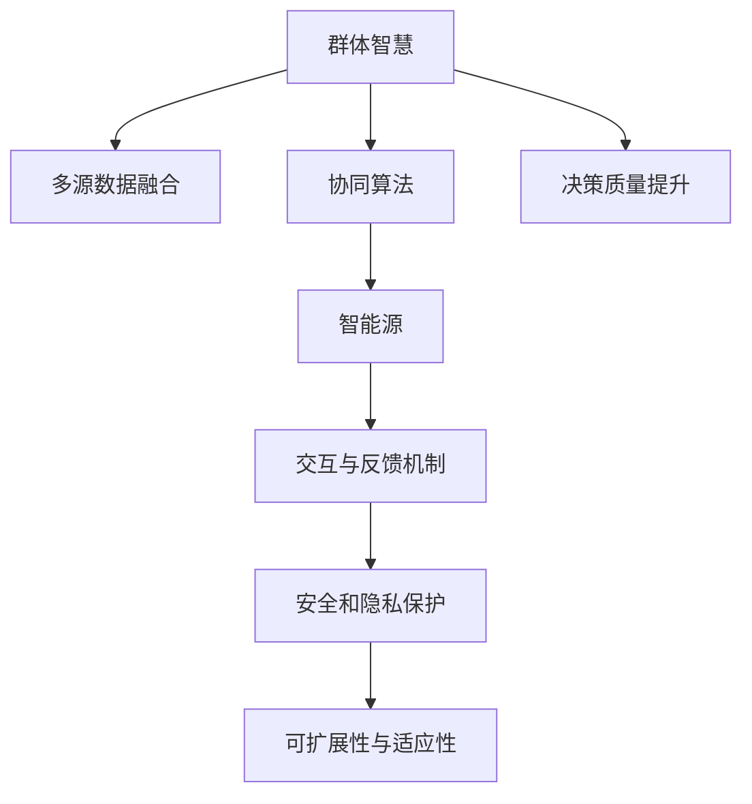

                 

# 群体智慧：决策的新引擎

## 1. 背景介绍

### 1.1 问题由来
随着信息技术的高速发展，数据和计算资源的空前丰富，决策科学迎来了新的时代。从传统的手工决策到基于数据的分析，再到现代的机器学习和人工智能（AI），决策模式的演变经历了深刻变革。然而，在这些技术手段的背后，一个更加深刻的趋势正在悄然兴起——群体智慧（Collective Intelligence）。群体智慧，指的是利用多元化的智能源（包括人、机器、数据等），通过协同交互，实现更为智能、高效、可靠的决策。

群体智慧的概念最早由托马斯·F·威尔逊（Thomas F. Wilson）在1999年提出，强调了“群体”在智能系统中的重要性。近年来，随着AI技术的发展，群体智慧已经不仅仅是一个学术概念，而是成为一种实实在在的技术手段，广泛应用于商业、公共安全、医疗健康、教育等领域。

### 1.2 问题核心关键点
群体智慧的核心在于如何有效地集成和利用多元化的智能源，通过协同决策，提升决策的质量和效率。这一过程中，关键点包括：

- **数据融合与协同决策**：如何整合多源数据，利用协同算法进行高效决策。
- **智能源的多样性**：智能源不仅仅包括人类，还包括机器学习和深度学习模型，甚至是物联网设备等。
- **交互与反馈机制**：建立智能源间的互动机制，确保信息流通和反馈机制的畅通。
- **安全和隐私保护**：群体智慧系统需要确保数据和决策的透明、可解释和可信性。
- **可扩展性与适应性**：系统需要具备良好的可扩展性，以适应复杂多变的环境和需求。

群体智慧的这些关键点，不仅对技术提出了挑战，也对决策科学和组织管理提出了新的要求。

## 2. 核心概念与联系

### 2.1 核心概念概述

为更好地理解群体智慧的原理和应用，本节将介绍几个密切相关的核心概念：

- **群体智慧（Collective Intelligence）**：利用多元智能源，通过协同交互，提升决策质量的系统。
- **多源数据融合（Data Fusion）**：整合来自不同渠道、不同类型的数据，提取有用信息，支持决策过程。
- **协同算法（Collaborative Algorithm）**：设计用于促进智能源间协同决策的算法，如对抗搜索、协商协议等。
- **智能源（Intelligent Agents）**：包括人、机器学习模型、IoT设备等，参与群体智慧的决策过程。
- **交互与反馈机制（Interaction and Feedback）**：建立智能源间的信息交流和反馈机制，确保决策过程的有效性。
- **安全和隐私保护（Security and Privacy）**：确保群体智慧系统数据和决策的透明、可解释和可信性。
- **可扩展性与适应性（Scalability and Adaptability）**：设计具有良好可扩展性和适应性的群体智慧系统，以适应复杂多变的环境和需求。

这些核心概念之间的逻辑关系可以通过以下Mermaid流程图来展示：



这个流程图展示了大语言模型的核心概念及其之间的关系：

1. 群体智慧通过多源数据融合获得多样化的智能信息。
2. 协同算法设计用于促进智能源间的决策协同。
3. 智能源包括人、机器学习模型等，参与群体智慧的决策过程。
4. 交互与反馈机制确保智能源间的信息流通和反馈。
5. 安全和隐私保护保证决策过程的透明性和可信性。
6. 可扩展性和适应性确保系统能够适应复杂多变的环境和需求。
7. 最终，群体智慧提升了决策的质量。

## 3. 核心算法原理 & 具体操作步骤
### 3.1 算法原理概述

群体智慧的核心算法是协同算法，旨在通过多源数据融合和协同决策，提升决策质量。常见的协同算法包括：

- **对抗搜索（Competitive Search）**：多个智能源通过竞争搜索最优决策，适用于结构化问题。
- **协商协议（Negotiation Protocol）**：智能源通过协商达成一致决策，适用于多目标问题。
- **协同进化（Co-evolution）**：多个智能源通过协同进化提升整体性能，适用于动态环境。
- **共识机制（Consensus Mechanism）**：通过投票或平均决策等方式，达成群体共识。

这些算法基于博弈论、机器学习等理论，通过数学模型和算法框架，实现群体智慧的协同决策。

### 3.2 算法步骤详解

群体智慧的协同算法一般包括以下几个关键步骤：

**Step 1: 数据收集与预处理**
- 收集来自不同渠道的数据，并进行清洗和标准化处理，确保数据质量。

**Step 2: 数据融合**
- 使用多源数据融合技术，如信息融合、深度学习等，整合来自不同渠道的数据，提取有用信息。

**Step 3: 模型训练与优化**
- 使用协同算法训练智能源的决策模型，通过模拟市场竞争、谈判等过程，优化模型参数。

**Step 4: 交互与反馈**
- 建立智能源间的交互与反馈机制，通过通信协议、消息传递等方式，实时更新决策信息。

**Step 5: 协同决策**
- 智能源根据收到的决策信息，结合自身模型进行决策，形成最终决策结果。

**Step 6: 评估与调整**
- 对决策结果进行评估，根据反馈信息进行调整和优化，确保决策质量。

### 3.3 算法优缺点

群体智慧的协同算法具有以下优点：

- **多样性**：利用多样化的智能源，提升决策的多样性和鲁棒性。
- **准确性**：通过数据融合和协同决策，提升决策的准确性和可靠性。
- **灵活性**：可以适应复杂的动态环境，灵活应对变化。
- **透明度**：决策过程透明，便于追踪和审计。

同时，这些算法也存在一些局限性：

- **复杂性**：算法设计复杂，需要考虑多个智能源间的交互和协调。
- **延迟**：信息交互和反馈机制可能导致决策延迟。
- **安全性**：数据和决策的隐私和安全问题需要特别注意。
- **可解释性**：协同决策过程可能缺乏可解释性，难以调试和优化。

尽管存在这些局限性，群体智慧的协同算法仍在大数据、智能制造、智慧城市等领域展现出强大的应用潜力。

### 3.4 算法应用领域

群体智慧的协同算法已经在多个领域得到了广泛应用，例如：

- **大数据分析**：通过融合多源数据，进行精准的市场分析和趋势预测。
- **智能制造**：将人、机器和数据整合，实现智能生产流程优化。
- **智慧城市**：通过整合城市数据，优化交通、环境、安全等领域的决策。
- **金融风控**：利用机器学习和人类专家的结合，进行风险评估和管理。
- **医疗健康**：结合医生和机器学习模型，提升疾病诊断和治疗的准确性。

除了这些常见领域外，群体智慧的协同算法还被创新性地应用到更多场景中，如自动化驾驶、无人机编队、智能推荐系统等，为不同行业带来了新的变革。

## 4. 数学模型和公式 & 详细讲解  
### 4.1 数学模型构建

本节将使用数学语言对群体智慧的协同决策过程进行更加严格的刻画。

记智能源为 $A_1, A_2, ..., A_n$，每个智能源的决策变量为 $x_i$，目标函数为 $f_i(x_i)$，表示智能源 $i$ 的决策效果。群体智慧的目标是最小化群体决策的总成本或最大化群体决策的效用，即：

$$
\min \sum_{i=1}^n f_i(x_i) \quad \text{或} \quad \max \sum_{i=1}^n u_i(x_i)
$$

其中 $u_i$ 表示智能源 $i$ 的效用函数。

### 4.2 公式推导过程

以下是博弈论中的Nash协商协议（Nash Bargaining Solution）的公式推导过程。

假设智能源 $A_1$ 和 $A_2$ 进行协商，分别有 $x_1$ 和 $x_2$ 的决策变量，目标分别为 $f_1(x_1)$ 和 $f_2(x_2)$。他们的效用函数分别为 $u_1(x_1)$ 和 $u_2(x_2)$。Nash协商协议的目标是最小化双方的总成本，即：

$$
\min (f_1(x_1) + f_2(x_2))
$$

Nash协商协议的解为：

$$
(x_1^*, x_2^*) = (\frac{u_1(x_1)}{u_1(x_1)+u_2(x_2)} x_1, \frac{u_2(x_2)}{u_1(x_1)+u_2(x_2)} x_2)
$$

其中 $u_1(x_1) + u_2(x_2)$ 为两人的效用总和，确保两人总效用不变。

通过Nash协商协议，可以实现群体智慧的协同决策，确保每个智能源的利益不会受到损害。

### 4.3 案例分析与讲解

考虑一个物流公司需要优化配送路线的问题。公司有多个配送中心，每个配送中心需要向不同的客户配送货物。不同客户的需求不同，配送路线的优化需要考虑多种因素，如距离、成本、时间等。

该公司可以建立多个智能源，每个智能源代表一个配送中心，并使用协同算法进行决策。智能源 $A_i$ 的决策变量 $x_i$ 表示从配送中心 $i$ 到客户 $j$ 的配送路线。决策目标函数可以表示为：

$$
f_i(x_i) = \sum_{j=1}^m c_{ij} x_{ij} + \lambda_i d_{ij}
$$

其中 $c_{ij}$ 表示配送成本，$d_{ij}$ 表示配送时间，$\lambda_i$ 是配送中心 $i$ 的优先级系数。

通过协同算法，可以实现配送路线的优化。例如，使用对抗搜索算法，每个配送中心通过竞争搜索最优路线；使用协商协议，每个配送中心通过协商达成最优路线。

最终，通过协同算法得出的配送路线，可以显著提高物流效率和客户满意度。

## 5. 项目实践：代码实例和详细解释说明
### 5.1 开发环境搭建

在进行群体智慧的协同算法实践前，我们需要准备好开发环境。以下是使用Python进行Sympy开发的环境配置流程：

1. 安装Anaconda：从官网下载并安装Anaconda，用于创建独立的Python环境。

2. 创建并激活虚拟环境：
```bash
conda create -n collective-intelligence python=3.8 
conda activate collective-intelligence
```

3. 安装Sympy：从官网获取安装命令，并使用conda安装。
```bash
conda install sympy
```

4. 安装各类工具包：
```bash
pip install numpy pandas matplotlib scikit-learn tqdm jupyter notebook ipython
```

完成上述步骤后，即可在`collective-intelligence`环境中开始协同算法的实践。

### 5.2 源代码详细实现

这里我们以博弈论中的Nash协商协议为例，给出使用Sympy进行协同决策的Python代码实现。

首先，定义协商协议的求解函数：

```python
from sympy import symbols, Eq, solve

def nash_bargaining(u1, u2):
    x1, x2 = symbols('x1 x2')
    eq1 = Eq(x1/u1 + x2/u2, 1)
    eq2 = Eq(x1/u1, u1/x1 + u2/x2)
    sol = solve((eq1, eq2), (x1, x2))
    return sol[x1], sol[x2]
```

然后，使用Nash协商协议进行决策：

```python
# 定义效用函数
def u1(x1):
    return x1**2

def u2(x2):
    return 2*x2

# 调用nash_bargaining求解
x1, x2 = nash_bargaining(u1, u2)
print(f"协商结果：{x1} 和 {x2}")
```

在以上代码中，我们定义了两个智能源的效用函数，并通过Nash协商协议求解最优决策变量。可以看到，Sympy提供了强大的符号计算能力，可以快速求解复杂的数学问题。

### 5.3 代码解读与分析

让我们再详细解读一下关键代码的实现细节：

**nash_bargaining函数**：
- 定义决策变量 $x_1$ 和 $x_2$，以及目标方程 $eq1$ 和 $eq2$。
- 使用solve函数求解方程组，得到最优解 $x_1^*$ 和 $x_2^*$。
- 返回决策变量的最优解。

**效用函数u1和u2**：
- 定义智能源 $A_1$ 和 $A_2$ 的效用函数，用于衡量决策变量的效果。
- 使用符号计算库Sympy定义函数，确保计算过程的准确性。

**协商协议求解**：
- 调用nash_bargaining函数，传入智能源的效用函数。
- 输出协商结果，即最优决策变量 $x_1^*$ 和 $x_2^*$。

可以看到，Sympy的符号计算能力使得Nash协商协议的求解变得简单高效。开发者可以利用Sympy的符号计算功能，进行更加复杂的多源决策问题的求解。

## 6. 实际应用场景
### 6.1 智能制造

群体智慧的协同算法可以在智能制造领域发挥重要作用。传统制造过程复杂，涉及多种资源和工序，需要多人协作才能完成。利用群体智慧的协同算法，可以优化制造过程，提升生产效率和质量。

在实践中，可以建立多个智能源，每个智能源代表一个设备或工人，使用协同算法进行决策。智能源之间的交互和反馈机制，可以实时调整生产计划和资源分配，确保生产过程的稳定和高效。

### 6.2 智慧城市

智慧城市是群体智慧的重要应用场景。通过整合城市中的各种智能源，如传感器、监控摄像头、居民反馈等，可以实现城市管理的信息化和智能化。

例如，在交通管理中，可以建立多个智能源，每个智能源代表一个交通摄像头或一个传感器。智能源通过协商协议，实现交通信号灯的智能调控，优化交通流量。智能源之间的交互和反馈机制，可以实时调整信号灯的亮度和时长，减少交通拥堵。

### 6.3 金融风险管理

金融风险管理需要实时监测市场变化，及时调整投资策略。利用群体智慧的协同算法，可以整合来自不同渠道的数据，如新闻、社交媒体、金融报告等，进行风险评估和预测。

在实践中，可以建立多个智能源，每个智能源代表一个数据源或一个分析模型。智能源通过协商协议，综合多源数据，进行风险评估和预测。智能源之间的交互和反馈机制，可以实时更新数据和模型，确保风险管理的准确性和及时性。

### 6.4 未来应用展望

随着群体智慧技术的发展，其在更多领域的应用前景将更加广阔。

在智慧医疗领域，通过整合医疗数据、专家知识、AI模型等智能源，可以实现疾病的早期诊断和治疗方案的优化。

在教育领域，利用群体智慧的协同算法，可以整合来自学生的学习数据、教师的反馈、教育资源的推荐等信息，进行个性化教学。

在社会治理领域，通过整合来自公民、政府、非政府组织等智能源的数据，可以实现更有效的社会管理和公共服务的优化。

此外，在金融、物流、能源等多个领域，群体智慧的协同算法也将带来新的变革和机遇。相信随着技术的不断进步，群体智慧将成为决策科学的重要工具，推动社会的全面智能化发展。

## 7. 工具和资源推荐
### 7.1 学习资源推荐

为了帮助开发者系统掌握群体智慧的理论基础和实践技巧，这里推荐一些优质的学习资源：

1. 《群体智慧：从简单到复杂》（Collective Intelligence: Prentice Hall）：作者J. Richard Clift，详细介绍了群体智慧的基本概念、理论框架和应用案例。

2. 《博弈论与演化计算》（Game Theory and Evolutionary Computing）：作者David A. Basin，介绍了博弈论和演化计算在群体智慧中的应用。

3. 《群体智能：算法、挑战与应用》（Swarm Intelligence: Algorithms and Applications）：作者Jonathan R. Dewulf，介绍了群体智能的基本原理和应用。

4. 《多源数据融合：理论、算法与应用》（Multisource Data Fusion: Theory, Algorithms and Applications）：作者Winfried Seidel，介绍了多源数据融合的原理和算法。

5. 《机器学习与博弈论》（Machine Learning and Game Theory）：作者Christopher M. Bishop，介绍了机器学习与博弈论的结合。

通过对这些资源的学习实践，相信你一定能够快速掌握群体智慧的精髓，并用于解决实际的决策问题。

### 7.2 开发工具推荐

高效的开发离不开优秀的工具支持。以下是几款用于群体智慧协同算法开发的常用工具：

1. Sympy：Python的符号计算库，用于高效进行数学建模和求解。

2. TensorFlow：由Google主导开发的深度学习框架，支持大规模分布式计算。

3. PyTorch：由Facebook开发，灵活动态的计算图，支持快速的模型训练和优化。

4. Weights & Biases：模型训练的实验跟踪工具，记录和可视化训练过程，便于调试和优化。

5. TensorBoard：TensorFlow配套的可视化工具，实时监测训练状态，提供丰富的图表支持。

6. Google Colab：谷歌推出的在线Jupyter Notebook环境，免费提供GPU/TPU算力，方便开发者快速实验新模型。

合理利用这些工具，可以显著提升群体智慧协同算法的开发效率，加速创新迭代的步伐。

### 7.3 相关论文推荐

群体智慧和协同算法的发展源于学界的持续研究。以下是几篇奠基性的相关论文，推荐阅读：

1. A Theory of Reasoned Collective Choice（Harsanyi，1977）：提出了群体智慧的理论基础，开创了群体决策研究的新领域。

2. Bayesian Bargaining（Selten，1975）：介绍了Bayesian博弈论在群体决策中的应用。

3. Swarm Intelligence: From Organized Chaos to Intelligent Behavior（Eberhart，2001）：介绍了群体智能的基本原理和应用。

4. Cooperative Multi-Agent Systems: Algorithms and Applications（Sangiovanni-Vincentelli，1988）：介绍了多智能体系统（MAS）在协同决策中的应用。

5. Game Theory and Neuroscience（SElim，2012）：介绍了博弈论在神经科学中的应用。

这些论文代表了大语言模型微调技术的发展脉络。通过学习这些前沿成果，可以帮助研究者把握学科前进方向，激发更多的创新灵感。

## 8. 总结：未来发展趋势与挑战
### 8.1 总结

本文对群体智慧的协同决策方法进行了全面系统的介绍。首先阐述了群体智慧和协同决策的核心概念，明确了其在大数据、智能制造、智慧城市等领域的应用前景。其次，从原理到实践，详细讲解了协同决策的数学模型和关键步骤，给出了协同算法任务开发的完整代码实例。同时，本文还广泛探讨了群体智慧在更多行业领域的应用前景，展示了协同决策范式的巨大潜力。

通过本文的系统梳理，可以看到，群体智慧的协同决策方法正在成为决策科学的重要工具，极大地拓展了智能系统的应用边界，催生了更多的落地场景。得益于多源数据融合和协同算法，群体智慧在决策科学中的应用前景将更加广阔，有望带来新一轮的技术变革。

### 8.2 未来发展趋势

展望未来，群体智慧的协同决策技术将呈现以下几个发展趋势：

1. **智能化水平提升**：随着AI技术的发展，群体智慧的智能源将变得更加智能和自主，协同决策的精度和效率将进一步提升。

2. **自适应能力增强**：智能源能够根据环境变化和任务需求，动态调整决策策略，提高适应性和灵活性。

3. **数据融合技术进步**：多源数据融合技术将进一步发展，能够更准确地整合和利用不同来源的数据，提升决策的准确性和可靠性。

4. **安全性和隐私保护**：群体智慧系统将更加注重数据和决策的安全性和隐私保护，确保智能源之间的信息流通和决策透明。

5. **跨学科融合**：群体智慧将与更多学科进行融合，如神经科学、心理学、社会学等，深入理解智能源的行为和决策机制。

6. **实时化与动态化**：群体智慧系统将更加注重实时性和动态化，能够快速响应环境变化，及时调整决策策略。

以上趋势凸显了群体智慧协同决策技术的广阔前景。这些方向的探索发展，必将进一步提升决策系统的性能和应用范围，为智能决策带来新的突破。

### 8.3 面临的挑战

尽管群体智慧的协同决策技术已经取得了瞩目成就，但在迈向更加智能化、普适化应用的过程中，它仍面临着诸多挑战：

1. **数据质量与多样性**：数据质量和多样性对群体智慧的决策效果至关重要。如何获取高质量、多样化的数据，是协同决策面临的重大挑战。

2. **智能源的自治与合作**：智能源的自治与合作机制需要精心设计，确保各智能源能够在协同决策中保持一致性和效率。

3. **通信延迟与带宽**：群体智慧系统需要大量的通信和交互，通信延迟和带宽问题可能成为性能瓶颈。

4. **系统的可扩展性与稳定性**：群体智慧系统需要具备良好的可扩展性和稳定性，以适应复杂多变的环境和需求。

5. **安全性和隐私保护**：群体智慧系统需要确保数据和决策的透明、可解释和可信性，避免数据泄露和恶意攻击。

6. **复杂性与可解释性**：群体智慧的协同算法设计复杂，决策过程缺乏可解释性，难以调试和优化。

正视群体智慧面临的这些挑战，积极应对并寻求突破，将是大语言模型微调走向成熟的必由之路。相信随着学界和产业界的共同努力，这些挑战终将一一被克服，群体智慧协同决策技术必将在构建人机协同的智能系统中扮演越来越重要的角色。

### 8.4 研究展望

面对群体智慧协同决策所面临的种种挑战，未来的研究需要在以下几个方面寻求新的突破：

1. **自适应协同算法**：开发更加灵活和自适应的协同算法，能够根据环境变化动态调整决策策略。

2. **异构智能源的协同**：研究异构智能源（如人类、机器学习模型、IoT设备等）的协同决策机制，提升协同决策的泛化性和鲁棒性。

3. **分布式协同决策**：研究分布式协同决策技术，通过多节点协同，提高决策的效率和可靠性。

4. **跨领域协同决策**：将群体智慧与其他领域（如经济、金融、社会等）的决策模型进行融合，提升决策的全面性和系统性。

5. **可解释性增强**：研究决策过程的可解释性增强方法，确保群体智慧系统的透明性和可解释性。

6. **智能源的情感与认知**：研究智能源的情感与认知模型，提升决策过程的拟人性。

这些研究方向的探索，必将引领群体智慧协同决策技术迈向更高的台阶，为构建智能决策系统带来新的突破。

## 9. 附录：常见问题与解答

**Q1：群体智慧与传统决策方式有何不同？**

A: 群体智慧和传统决策方式的主要区别在于决策主体和决策过程的多样性和复杂性。传统决策方式往往依赖单一决策者，数据来源单一，决策过程简单直接。而群体智慧利用多元化的智能源，通过协同决策，提升决策的精确性和可靠性。

**Q2：如何设计群体智慧的智能源？**

A: 群体智慧的智能源可以包括人、机器学习模型、IoT设备等。设计智能源时，需要考虑其决策目标、效用函数、交互机制等因素。智能源之间需要进行协同决策，因此需要设计合理的交互协议和反馈机制。

**Q3：群体智慧在实际应用中面临哪些挑战？**

A: 群体智慧在实际应用中面临的数据质量、智能源自治与合作、通信延迟、系统可扩展性、安全性、可解释性等挑战。这些挑战需要从技术、管理、伦理等多个层面进行综合考虑和解决。

**Q4：如何确保群体智慧系统的透明性和可信性？**

A: 确保群体智慧系统的透明性和可信性，需要设计合理的决策过程和反馈机制。智能源之间的决策和交互过程需要公开透明，决策结果需要可解释和可审计。

**Q5：如何实现群体智慧的实时决策？**

A: 实现群体智慧的实时决策，需要优化通信协议和数据融合算法，减少延迟和带宽开销。同时，需要设计动态调整机制，确保智能源能够快速响应环境变化。

通过这些问题的探讨，可以帮助开发者更好地理解群体智慧的原理和应用，解决实际问题。

---

作者：禅与计算机程序设计艺术 / Zen and the Art of Computer Programming

