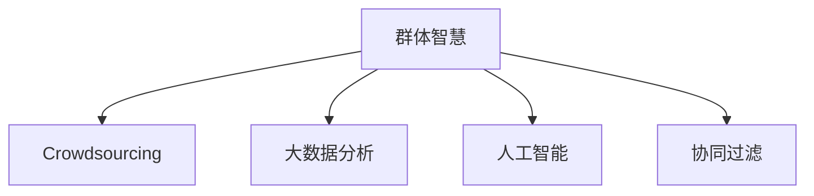

                 

# 群体智慧：决策的新引擎

在人类历史长河中，决策始终是一个重要的主题。从个人决策到群体决策，从传统决策到智能化决策，决策的思维模式和技术手段随着时代的变迁而不断演变。今天，随着人工智能和大数据技术的兴起，群体智慧（Collective Intelligence）正成为决策的新引擎，重新定义了决策的边界和可能性。

## 1. 背景介绍

### 1.1 问题由来

在现代社会，面对复杂多变的市场环境和社会问题，单一决策者的能力和时间都是有限的。因此，人们开始寻求群体的智慧来弥补个体的不足，利用集体的知识和经验，做出更加全面、客观、科学的决策。群体智慧通常指的是一群具有不同背景和能力的个体，通过互动、沟通和协作，共同解决复杂问题的一种方式。

然而，传统的群体智慧往往依赖于个体之间的直接交流和沟通，效率低下，容易受个人偏见和情绪的影响，存在信息不对称和知识不完全等问题。这些问题使得决策的效果往往不尽如人意。

## 2. 核心概念与联系

### 2.1 核心概念概述

为更好地理解群体智慧，本节将介绍几个关键概念及其之间的联系：

- **群体智慧（Collective Intelligence）**：指通过群体合作，将个体的知识和能力整合为集体的智慧，共同解决复杂问题。
- **众包（Crowdsourcing）**：指将任务外包给大规模人群，以低成本、高效的方式获取大量人类劳动力的技术。
- **大数据分析（Big Data Analytics）**：指利用先进技术对大规模数据集进行挖掘和分析，以发现隐藏的模式、趋势和关联。
- **人工智能（Artificial Intelligence）**：指模拟人类智能行为，实现机器的感知、推理、学习等能力的科学和技术。
- **协同过滤（Collaborative Filtering）**：指通过分析用户行为和物品属性，推荐个性化的物品或服务的技术。

这些概念之间的逻辑关系可以通过以下Mermaid流程图来展示：



这个流程图展示了几大核心概念及其之间的关系：

1. 群体智慧通过众包和大数据分析，获取大规模人类的智慧和数据。
2. 人工智能和协同过滤为群体智慧提供了技术手段和算法支持。
3. 群体智慧通过整合个体智慧和数据，形成集体的智慧和决策力。

这些概念共同构成了群体智慧的基本框架，使其能够高效解决复杂问题，做出科学的决策。

## 3. 核心算法原理 & 具体操作步骤

### 3.1 算法原理概述

群体智慧的核心算法原理主要包括：

- **多Agent系统**：将问题分解为多个子任务，每个子任务由一个智能体（Agent）来处理，智能体通过协调和交互，最终达成全局最优决策。
- **强化学习（Reinforcement Learning, RL）**：通过奖励和惩罚机制，不断优化智能体的决策策略，使其在特定环境下最大化收益。
- **贝叶斯网络（Bayesian Network）**：通过概率模型描述变量之间的关系，结合先验知识和数据，推断出最优决策。
- **分布式计算**：将数据和计算任务分布到多个计算节点上，利用并行处理加速计算速度。

### 3.2 算法步骤详解

群体智慧的算法实现可以分为以下几步：

**Step 1: 任务定义与拆分**

- 明确问题目标，将复杂任务拆分为多个子任务，每个子任务对应一个智能体。
- 定义每个智能体的目标函数和约束条件，如最大化收益、最小化损失等。

**Step 2: 智能体设计**

- 设计每个智能体的决策策略和交互机制。如利用强化学习算法，设计智能体的行为策略。
- 实现智能体之间的通信协议，确保智能体之间的信息交换和协调。

**Step 3: 数据收集与处理**

- 收集和整理任务相关的数据，如用户行为数据、市场环境数据等。
- 对数据进行预处理和特征工程，提取有用的特征信息。

**Step 4: 协同计算**

- 将数据和计算任务分布到多个计算节点上，并行计算各智能体的决策结果。
- 通过消息传递和协调机制，使得各智能体能够及时交互，更新决策。

**Step 5: 结果汇总与优化**

- 汇总各智能体的决策结果，生成最终的群体决策。
- 对决策结果进行评估和优化，如通过贝叶斯网络进行后验推理，优化决策结果。

### 3.3 算法优缺点

群体智慧算法具有以下优点：

- **高效协作**：能够利用大规模分布式计算，加速决策过程，提高效率。
- **信息多样性**：多个智能体提供的信息和视角更加丰富多样，有助于发现问题的多个维度。
- **鲁棒性**：多个智能体之间的冗余和协调，能够提高决策的鲁棒性和容错性。

同时，这些算法也存在一些局限性：

- **数据质量依赖**：智能体的决策质量很大程度上取决于数据的准确性和完整性。
- **通信开销大**：多个智能体之间需要频繁通信，可能导致通信开销较大。
- **复杂度较高**：多个智能体之间的协调和交互，增加了算法的复杂度。
- **可解释性不足**：智能体的决策过程通常缺乏可解释性，难以对其推理逻辑进行分析和调试。

尽管存在这些局限性，但就目前而言，群体智慧算法是解决复杂决策问题的有力工具。未来相关研究的重点在于如何进一步降低通信开销，提高决策的可解释性，优化算法性能等。

### 3.4 算法应用领域

群体智慧算法已经在众多领域得到了广泛的应用，例如：

- 金融市场：在股票交易、风险评估、市场预测等任务上，利用群体智慧算法进行实时决策。
- 电子商务：通过群体智慧算法进行个性化推荐、广告投放、库存管理等任务。
- 社交网络：利用群体智慧算法进行话题分析、情感分析、社区管理等任务。
- 医疗健康：通过群体智慧算法进行疾病诊断、治疗方案推荐、药物研发等任务。
- 环境保护：利用群体智慧算法进行环境监测、气候预测、资源分配等任务。

除了上述这些经典应用外，群体智慧算法还在智能交通、城市管理、公共安全等领域展现出巨大的应用潜力，为各行各业带来了新的发展机遇。

## 4. 数学模型和公式 & 详细讲解 & 举例说明

### 4.1 数学模型构建

为了更好地理解群体智慧算法，本节将使用数学语言对算法进行更加严格的刻画。

记群体智慧系统中的智能体数量为 $n$，第 $i$ 个智能体的决策策略为 $f_i$，系统总收益为 $R$。假设每个智能体的收益函数为 $r_i(x)$，则系统总收益函数为：

$$
R = \sum_{i=1}^n r_i(x_i)
$$

其中 $x_i$ 为智能体 $i$ 的决策。

### 4.2 公式推导过程

假设智能体的决策策略为策略梯度算法，其策略更新公式为：

$$
\pi_{t+1}(a_t) = \frac{\pi_t(a_t) \exp(\theta^T A_t a_t)}{\sum_{a_t \in \mathcal{A}} \pi_t(a_t) \exp(\theta^T A_t a_t)}
$$

其中 $\theta$ 为策略参数，$A_t$ 为奖励矩阵，$\mathcal{A}$ 为策略空间。

通过迭代优化上述公式，智能体的策略 $\pi$ 逐渐逼近最优策略，使系统总收益 $R$ 最大化。

### 4.3 案例分析与讲解

以下以金融市场中的股票交易为例，分析群体智慧算法的应用：

假设市场中有多个智能体（如多个交易算法），每个智能体的决策策略为基于强化学习的交易算法。交易算法通过历史交易数据进行学习，得到最优的交易策略。假设智能体的收益函数为交易收益减去交易成本，则系统总收益函数为所有智能体交易收益之和减去总交易成本。

在具体实现时，每个智能体需要通过实时市场数据进行决策，并与其他智能体进行信息交换和协调。通过分布式计算和消息传递机制，智能体能够快速计算和更新决策，并与其他智能体协同工作，最终达成全局最优的交易策略。

## 5. 项目实践：代码实例和详细解释说明

### 5.1 开发环境搭建

在进行群体智慧实践前，我们需要准备好开发环境。以下是使用Python进行PyTorch开发的环境配置流程：

1. 安装Anaconda：从官网下载并安装Anaconda，用于创建独立的Python环境。

2. 创建并激活虚拟环境：
```bash
conda create -n pytorch-env python=3.8 
conda activate pytorch-env
```

3. 安装PyTorch：根据CUDA版本，从官网获取对应的安装命令。例如：
```bash
conda install pytorch torchvision torchaudio cudatoolkit=11.1 -c pytorch -c conda-forge
```

4. 安装TensorFlow：
```bash
conda install tensorflow
```

5. 安装TensorBoard：
```bash
pip install tensorboard
```

完成上述步骤后，即可在`pytorch-env`环境中开始群体智慧实践。

### 5.2 源代码详细实现

下面我们以协同过滤算法为例，给出使用PyTorch进行群体智慧的PyTorch代码实现。

首先，定义协同过滤模型：

```python
import torch
import torch.nn as nn
import torch.nn.functional as F

class CollaborativeFiltering(nn.Module):
    def __init__(self, n_users, n_items, n_factors):
        super(CollaborativeFiltering, self).__init__()
        self.W_user = nn.Parameter(torch.randn(n_users, n_factors))
        self.W_item = nn.Parameter(torch.randn(n_items, n_factors))
        self.V = nn.Parameter(torch.randn(n_factors, 1))
    
    def forward(self, user, item, bias):
        user_vec = torch.matmul(user.unsqueeze(-1), self.W_user).squeeze(-1)
        item_vec = torch.matmul(item.unsqueeze(-1), self.W_item).squeeze(-1)
        pred = user_vec @ item_vec @ self.V
        pred = pred + bias.unsqueeze(-1)
        return pred
```

然后，定义优化器和学习率调度：

```python
from torch.optim import Adam

learning_rate = 0.01
optimizer = Adam(model.parameters(), lr=learning_rate)

scheduler = torch.optim.lr_scheduler.StepLR(optimizer, step_size=5, gamma=0.9)
```

接着，定义损失函数和训练函数：

```python
from torch.nn import MSELoss

criterion = MSELoss()

def train_epoch(model, data_loader):
    model.train()
    total_loss = 0.0
    for user, item, bias in data_loader:
        optimizer.zero_grad()
        pred = model(user, item, bias)
        loss = criterion(pred, target)
        loss.backward()
        optimizer.step()
        total_loss += loss.item()
    return total_loss / len(data_loader)
```

最后，启动训练流程并在测试集上评估：

```python
epochs = 50
batch_size = 64

for epoch in range(epochs):
    loss = train_epoch(model, data_loader)
    print(f"Epoch {epoch+1}, training loss: {loss:.3f}")
    
    print(f"Epoch {epoch+1}, test MSE:")
    test_mse = 0.0
    for user, item, bias in test_loader:
        pred = model(user, item, bias)
        target = bias
        test_mse += criterion(pred, target).item()
    print(f"Test MSE: {test_mse / len(test_loader):.3f}")
    
print("Training finished.")
```

以上就是使用PyTorch进行协同过滤算法的完整代码实现。可以看到，得益于PyTorch的强大封装，我们可以用相对简洁的代码完成群体智慧的实现。

### 5.3 代码解读与分析

让我们再详细解读一下关键代码的实现细节：

**CollaborativeFiltering类**：
- `__init__`方法：初始化用户、物品、因子矩阵等关键组件。
- `forward`方法：定义前向传播过程，将用户、物品、偏置向量通过因子矩阵转换为预测值。

**optimizer和scheduler**：
- 使用Adam优化器进行梯度优化。
- 定义学习率调度策略，自动调整学习率。

**train_epoch函数**：
- 使用batch循环，对每个batch的数据进行前向传播、损失计算和反向传播。
- 使用`optimizer.zero_grad()`清除梯度缓存，避免梯度累积。
- 使用`optimizer.step()`更新模型参数。

**训练流程**：
- 循环迭代多个epoch，记录每个epoch的平均损失。
- 在测试集上评估模型的均方误差（MSE），输出测试结果。
- 输出训练完成信息。

可以看到，PyTorch配合TensorFlow等框架，使得群体智慧算法的代码实现变得简洁高效。开发者可以将更多精力放在数据处理、模型改进等高层逻辑上，而不必过多关注底层的实现细节。

当然，工业级的系统实现还需考虑更多因素，如模型的保存和部署、超参数的自动搜索、更灵活的任务适配层等。但核心的群体智慧算法基本与此类似。

## 6. 实际应用场景

### 6.1 金融市场

基于群体智慧算法的金融市场交易系统，可以实时响应市场变化，快速调整交易策略，减少市场风险。具体而言，系统可以利用多个交易算法的协同决策，结合实时市场数据，进行股票交易、风险评估和市场预测等任务。

在技术实现上，可以收集历史交易数据、市场数据和新闻等，通过协同过滤算法，训练多个交易算法，生成最优的交易策略。系统可以实时接入市场数据，动态更新交易策略，调整交易量，降低市场风险。

### 6.2 电子商务

在电子商务领域，群体智慧算法可以用于个性化推荐、广告投放和库存管理等任务。具体而言，系统可以通过协同过滤算法，结合用户行为数据和物品属性，生成个性化推荐结果。同时，系统可以实时监测库存情况，动态调整采购计划，优化库存管理。

在技术实现上，可以收集用户浏览、点击、购买等行为数据，提取用户偏好和物品属性。通过协同过滤算法，训练多个推荐模型，生成个性化推荐结果。系统可以根据实时库存情况，动态调整采购计划，优化库存管理。

### 6.3 社交网络

在社交网络领域，群体智慧算法可以用于话题分析、情感分析和社区管理等任务。具体而言，系统可以通过协同过滤算法，结合用户发帖、评论等行为数据，分析热门话题和用户情感。同时，系统可以实时监测社区动态，动态调整内容过滤策略，维护社区秩序。

在技术实现上，可以收集用户发帖、评论等行为数据，提取话题和情感。通过协同过滤算法，训练多个分析模型，分析热门话题和用户情感。系统可以根据实时社区动态，动态调整内容过滤策略，维护社区秩序。

### 6.4 医疗健康

在医疗健康领域，群体智慧算法可以用于疾病诊断、治疗方案推荐和药物研发等任务。具体而言，系统可以通过协同过滤算法，结合患者历史数据和医生知识，生成个性化治疗方案。同时，系统可以实时监测疾病趋势，动态调整治疗策略，优化药物研发。

在技术实现上，可以收集患者历史数据和医生知识，提取疾病特征和治疗方法。通过协同过滤算法，训练多个诊断和治疗模型，生成个性化治疗方案。系统可以根据实时疾病趋势，动态调整治疗策略，优化药物研发。

### 6.5 未来应用展望

随着群体智慧算法的不断发展，其在更多领域得到应用，为传统行业带来了新的变革。

在智慧城市治理中，群体智慧算法可以用于城市事件监测、舆情分析、应急指挥等环节，提高城市管理的自动化和智能化水平，构建更安全、高效的未来城市。

在智能交通领域，群体智慧算法可以用于交通流量预测、路线规划、智能调度等任务，优化交通资源配置，提升交通效率。

在智能制造领域，群体智慧算法可以用于生产调度、质量控制、设备维护等任务，提高生产效率和质量，降低生产成本。

此外，在教育、农业、能源等众多领域，群体智慧算法也将不断涌现，为各行各业带来新的发展机遇。相信随着技术的日益成熟，群体智慧算法将成为决策的新引擎，推动各行各业的智能化转型。

## 7. 工具和资源推荐
### 7.1 学习资源推荐

为了帮助开发者系统掌握群体智慧理论基础和实践技巧，这里推荐一些优质的学习资源：

1. 《群体智慧：合作、竞争与集体决策》系列书籍：由群体智慧领域的专家撰写，深入浅出地介绍了群体智慧的基本概念、原理和应用。

2. 斯坦福大学的《群体智慧》课程：由群体智慧领域的知名教授讲授，系统讲解了群体智慧的理论基础和前沿技术。

3. 《大数据群体智慧》一书：详细介绍了大数据技术和群体智慧的结合，提供了许多实用的案例和算法。

4. 《人工智能导论》一书：介绍了人工智能的基本概念和群体智慧算法的经典算法，如强化学习、协同过滤等。

5. 《群体智慧算法与实现》一书：系统讲解了群体智慧算法的实现原理和工程实践，提供了丰富的代码和案例。

通过对这些资源的学习实践，相信你一定能够快速掌握群体智慧算法的精髓，并用于解决实际的决策问题。

### 7.2 开发工具推荐

高效的开发离不开优秀的工具支持。以下是几款用于群体智慧开发的常用工具：

1. PyTorch：基于Python的开源深度学习框架，灵活动态的计算图，适合快速迭代研究。

2. TensorFlow：由Google主导开发的开源深度学习框架，生产部署方便，适合大规模工程应用。

3. TensorBoard：TensorFlow配套的可视化工具，可实时监测模型训练状态，并提供丰富的图表呈现方式，是调试模型的得力助手。

4. Weights & Biases：模型训练的实验跟踪工具，可以记录和可视化模型训练过程中的各项指标，方便对比和调优。

5. Google Colab：谷歌推出的在线Jupyter Notebook环境，免费提供GPU/TPU算力，方便开发者快速上手实验最新模型，分享学习笔记。

合理利用这些工具，可以显著提升群体智慧算法的开发效率，加快创新迭代的步伐。

### 7.3 相关论文推荐

群体智慧算法的不断发展源于学界的持续研究。以下是几篇奠基性的相关论文，推荐阅读：

1. Distributed Algorithms（DIMACS Series in Discrete Mathematics and Theoretical Computer Science）：介绍分布式算法的经典著作，为群体智慧算法提供了理论基础。

2. Game Theory：博弈论的经典著作，提供群体智慧算法中的决策理论基础。

3. A Survey of Game-Theoretic Models in Recommendation Systems（IEEE Transactions on Knowledge and Data Engineering）：介绍博弈论在推荐系统中的应用，为协同过滤算法提供了理论支持。

4. Multi-Agent Systems: Classification of Features, Agents, and Environments（IEEE Transactions on Systems, Man, and Cybernetics, Part C (Applications and Reviews)）：介绍多Agent系统的分类和设计原则，为群体智慧算法提供了设计指导。

这些论文代表了大数据群体智慧算法的发展脉络。通过学习这些前沿成果，可以帮助研究者把握学科前进方向，激发更多的创新灵感。

## 8. 总结：未来发展趋势与挑战

### 8.1 总结

本文对群体智慧算法进行了全面系统的介绍。首先阐述了群体智慧算法的研究背景和意义，明确了其在解决复杂决策问题中的独特价值。其次，从原理到实践，详细讲解了群体智慧算法的数学原理和关键步骤，给出了群体智慧任务开发的完整代码实例。同时，本文还广泛探讨了群体智慧算法在金融、电商、社交等众多领域的应用前景，展示了群体智慧算法的巨大潜力。此外，本文精选了群体智慧算法的各类学习资源，力求为读者提供全方位的技术指引。

通过本文的系统梳理，可以看到，群体智慧算法正在成为复杂决策问题的重要范式，极大地拓展了决策的边界和可能性。受益于大数据技术和人工智能的发展，群体智慧算法能够高效利用人类智慧和数据，实现更加科学、智能的决策。未来，伴随技术的不断演进和应用场景的拓展，群体智慧算法必将在更多领域大放异彩，为各行各业带来新的发展机遇。

### 8.2 未来发展趋势

展望未来，群体智慧算法将呈现以下几个发展趋势：

1. 数据质量更加重要。随着数据量的增加，数据的质量和真实性将成为决定群体智慧算法效果的关键因素。如何保证数据的多样性和准确性，是未来研究的重要方向。

2. 智能体设计更加多样。随着智能体类型的增加，群体的智慧和决策能力将更加丰富多样。如何设计高效、灵活的智能体，是未来研究的重要课题。

3. 分布式计算更加高效。随着计算任务的复杂度增加，分布式计算成为群体智慧算法的瓶颈。如何提高分布式计算的效率和可靠性，是未来研究的重要方向。

4. 多智能体交互更加智能。随着智能体之间的交互变得更加频繁和复杂，群体智慧算法需要更加智能地处理和协调多智能体的决策。

5. 可解释性更加重要。随着决策应用场景的多样化，群体智慧算法的可解释性将成为重要的考虑因素。如何提高群体智慧算法的可解释性，是未来研究的重要方向。

6. 跨领域应用更加广泛。随着技术的发展和场景的多样化，群体智慧算法将在更多领域得到应用，推动各行各业的智能化转型。

以上趋势凸显了群体智慧算法的广阔前景。这些方向的探索发展，必将进一步提升群体智慧算法的性能和应用范围，为构建智能决策系统铺平道路。

### 8.3 面临的挑战

尽管群体智慧算法已经取得了瞩目成就，但在迈向更加智能化、普适化应用的过程中，它仍面临着诸多挑战：

1. 数据依赖问题。智能体的决策质量很大程度上取决于数据的质量和多样性。对于小样本、不平衡的数据集，群体智慧算法的效果往往不佳。

2. 通信开销较大。智能体之间的频繁通信和信息交换，可能导致通信开销较大，影响算法的效率。

3. 算法复杂度高。群体智慧算法的复杂度较高，特别是多智能体协同决策时，算法设计和管理难度较大。

4. 可解释性不足。群体智慧算法的决策过程通常缺乏可解释性，难以对其推理逻辑进行分析和调试。

5. 安全性问题。群体智慧算法可能面临数据泄露、系统攻击等安全风险，保障系统的安全性和稳定性是未来研究的重点。

6. 伦理道德问题。群体智慧算法的决策过程可能涉及伦理和道德问题，如隐私保护、公平性等，如何保障算法的伦理道德，是未来研究的重要方向。

正视群体智慧算法面临的这些挑战，积极应对并寻求突破，将使其逐步走向成熟，为决策智能化提供更加有力的支持。

### 8.4 研究展望

面对群体智慧算法所面临的种种挑战，未来的研究需要在以下几个方面寻求新的突破：

1. 探索更加高效的数据获取和处理技术。利用先进的传感器和大数据分析技术，获取高质量、多样化的数据，提高群体智慧算法的决策质量。

2. 研究更加智能的多智能体协同决策方法。利用人工智能和大数据技术，设计更加智能、高效的智能体协同决策机制，提升群体智慧算法的决策效果。

3. 开发更加灵活、可扩展的群体智慧框架。设计可扩展、灵活的群体智慧算法框架，支持多种智能体类型和应用场景。

4. 引入因果推断和强化学习技术。通过引入因果推断和强化学习技术，增强群体智慧算法建立稳定因果关系的能力，学习更加普适、鲁棒的语言表征。

5. 结合知识图谱和符号化推理。将知识图谱和符号化推理引入群体智慧算法，提升其决策的全面性和准确性。

6. 加强伦理道德和安全性研究。在群体智慧算法的决策过程中，引入伦理道德和安全性约束，确保算法的公平性、公正性和安全性。

这些研究方向将引领群体智慧算法的未来发展，为构建更加智能、可靠的决策系统提供新的思路和技术手段。面向未来，群体智慧算法需要与其他人工智能技术进行更深入的融合，如知识表示、因果推理、强化学习等，多路径协同发力，共同推动决策智能化的进步。只有勇于创新、敢于突破，才能不断拓展群体智慧算法的边界，让智能决策技术更好地服务于人类社会。

## 9. 附录：常见问题与解答

**Q1：群体智慧算法和传统决策方法有何区别？**

A: 群体智慧算法和传统决策方法的最大区别在于，群体智慧算法利用大规模人类智慧和数据，通过协同决策生成最优决策。而传统决策方法则主要依赖单一决策者的经验和知识，进行个体决策。群体智慧算法能够充分利用人类的多样性和智慧，生成更加全面、客观、科学的决策。

**Q2：如何提高群体智慧算法的可解释性？**

A: 提高群体智慧算法的可解释性，可以从以下几个方面入手：
1. 使用可解释性较高的算法，如决策树、线性回归等，降低模型复杂度。
2. 引入符号化推理和知识图谱，增强决策过程的可解释性。
3. 设计更加智能的智能体，使其能够提供决策的详细推理过程。
4. 引入外部专家审核机制，确保决策的公平性和公正性。

**Q3：群体智慧算法和机器学习算法有何区别？**

A: 群体智慧算法和机器学习算法的主要区别在于，群体智慧算法利用人类的智慧和数据，通过协同决策生成最优决策，而机器学习算法则通过训练数据，自动生成决策模型。群体智慧算法能够利用人类的多样性和智慧，生成更加全面、客观、科学的决策，而机器学习算法则更依赖于数据的质量和数量。

**Q4：群体智慧算法的通信开销如何优化？**

A: 优化群体智慧算法的通信开销，可以从以下几个方面入手：
1. 设计高效的消息传递机制，减少通信次数和数据量。
2. 引入分布式计算技术，将数据和计算任务分布到多个节点上进行并行计算。
3. 使用压缩算法，减少数据传输和存储的开销。
4. 设计智能体之间的协同决策机制，减少通信次数和数据量。

**Q5：群体智慧算法在实际应用中需要注意哪些问题？**

A: 在实际应用中，群体智慧算法需要注意以下几个问题：
1. 数据依赖问题：智能体的决策质量很大程度上取决于数据的质量和多样性。
2. 通信开销问题：智能体之间的频繁通信和信息交换，可能导致通信开销较大。
3. 算法复杂度问题：群体智慧算法的复杂度较高，特别是多智能体协同决策时，算法设计和管理难度较大。
4. 可解释性问题：群体智慧算法的决策过程通常缺乏可解释性，难以对其推理逻辑进行分析和调试。
5. 安全性问题：群体智慧算法可能面临数据泄露、系统攻击等安全风险。

通过这些问题的深入分析和解决，可以进一步提升群体智慧算法的应用效果和稳定性。

---

作者：禅与计算机程序设计艺术 / Zen and the Art of Computer Programming

