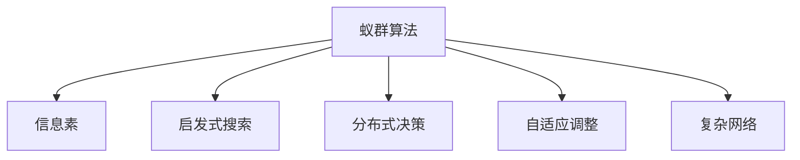

                 

# 群体智能：蚁群算法在人类社会的应用

> 关键词：群体智能,蚁群算法,人类协作,优化问题,复杂网络,应用实例

## 1. 背景介绍

### 1.1 问题由来
在自然界中，蚂蚁群体的组织结构和协同行为表现出极高的智能性。通过简单的个体行为和环境感知，蚂蚁能够高效完成复杂的集体任务，如寻找食物、建造巢穴等。这些行为本质上是一种基于局部信息的群体智能行为，其核心原理不仅在自然界具有重大意义，在人类社会中也得到了广泛应用。

群体智能（Swarm Intelligence）指的是由简单个体组成的群体，在无中央控制的条件下，通过简单的互动规则和局部信息共享，表现出集体智能行为的自组织现象。蚁群算法（Ant Colony Algorithm）是群体智能领域的一个经典算法，其核心思想模仿蚂蚁在寻找食物时的行为模式，通过分布式的信息交流和启发式搜索策略，解决复杂优化问题。

随着计算技术的进步和复杂性理论的发展，蚁群算法被广泛应用于各种优化问题，如路线优化、资源分配、调度问题等。在人类社会中，蚁群算法被用于改善团队协作效率、提升物流管理水平、优化城市交通网络等实际问题。

### 1.2 问题核心关键点
蚁群算法的主要特点包括：

- 分布式：算法不依赖于全局信息，每个个体（如蚂蚁）仅通过局部信息进行决策。
- 自适应：算法能够根据环境和问题的动态变化，自适应地调整行为规则和搜索策略。
- 启发式：算法通过启发式信息（如信息素）引导搜索方向，寻找最优解。
- 鲁棒性：算法具有较高的鲁棒性，在面对噪声和干扰时表现良好。

本文将详细介绍蚁群算法的原理和操作流程，并通过实例展示其在人类社会中的具体应用。

## 2. 核心概念与联系

### 2.1 核心概念概述

为了更好地理解蚁群算法及其在人类社会中的应用，本节将介绍几个核心概念：

- **蚁群算法（Ant Colony Algorithm, ACA）**：基于蚂蚁寻找食物的行为，通过分布式信息和启发式策略解决复杂优化问题。
- **信息素（Pheromone）**：蚂蚁在搜索过程中释放的一种化学物质，用于标记路径和引导信息共享。
- **启发式搜索（Heuristic Search）**：利用启发式规则引导搜索方向，寻找全局最优解。
- **分布式决策（Distributed Decision-making）**：算法中的每个个体独立进行决策，通过局部信息交互实现集体智能行为。
- **自适应调整（Adaptive Adjustment）**：算法能够根据环境变化和问题特性，动态调整行为规则和策略。
- **复杂网络（Complex Network）**：蚁群算法在人类社会中的应用常涉及复杂网络模型，如交通网络、社会网络等。

这些概念之间的逻辑关系可以通过以下Mermaid流程图来展示：



这个流程图展示蚁群算法的主要组成部分及其在人类社会中的应用场景。

## 3. 核心算法原理 & 具体操作步骤
### 3.1 算法原理概述

蚁群算法通过模拟蚂蚁寻找食物的行为，以分布式的方式解决复杂的优化问题。其核心思想如下：

1. **信息素更新**：蚂蚁在搜索过程中会释放信息素，用于标记路径和引导其他蚂蚁。信息素的挥发和更新机制使算法能够适应环境变化。
2. **启发式搜索**：算法通过启发式规则，如启发函数或启发信息，引导蚂蚁的搜索方向。
3. **分布式决策**：每个蚂蚁独立进行决策，通过局部信息交流实现集体智能行为。
4. **自适应调整**：算法根据环境和问题的动态变化，自适应地调整行为规则和搜索策略。

蚁群算法在实际应用中，通常涉及以下步骤：

1. **初始化**：随机初始化蚂蚁的起始位置，并设定相关参数，如信息素初始浓度、启发函数等。
2. **迭代搜索**：蚂蚁根据信息素浓度和启发函数，依次尝试每条路径，并更新信息素浓度。
3. **信息素更新**：根据路径的完成情况和收益，更新信息素浓度，强化有效路径的信息素。
4. **终止条件**：当达到预设的迭代次数或满足特定的优化目标时，算法终止。

### 3.2 算法步骤详解

#### 步骤1：初始化

- 随机生成多个蚂蚁，并为每个蚂蚁随机选择起始点。
- 设定相关参数，如信息素初始浓度、启发函数等。

#### 步骤2：迭代搜索

- 每个蚂蚁根据信息素浓度和启发函数，尝试每条路径。
- 更新信息素浓度，强化成功路径的信息素，并更新启发函数。
- 记录蚂蚁的路径和收益。

#### 步骤3：信息素更新

- 根据路径的完成情况和收益，更新信息素浓度，强化有效路径的信息素。
- 根据信息素挥发和更新规则，调整信息素浓度。

#### 步骤4：终止条件

- 当达到预设的迭代次数或满足特定的优化目标时，算法终止。

### 3.3 算法优缺点

蚁群算法的优点包括：

- **鲁棒性**：算法具有较高的鲁棒性，能够在噪声和干扰下表现良好。
- **分布式决策**：通过分布式决策，算法能够充分利用并行计算的优势，提升搜索效率。
- **启发式搜索**：启发式搜索机制能够引导算法快速接近最优解。

蚁群算法的缺点包括：

- **计算复杂度**：蚁群算法在面对大规模问题时，计算复杂度较高，需要较大的计算资源。
- **参数敏感**：算法的性能很大程度上依赖于参数的设定，参数不当可能导致算法失败。
- **局部最优**：在某些情况下，算法可能陷入局部最优，无法找到全局最优解。

### 3.4 算法应用领域

蚁群算法在多个领域中得到了广泛应用，主要包括：

- **物流与运输**：通过优化配送路线，提高运输效率和成本效益。
- **网络优化**：优化网络拓扑结构和数据传输路径，提升网络性能。
- **资源分配**：解决资源分配问题，如任务调度、设备维护等。
- **社交网络分析**：通过分析社交网络，发现潜在的社区结构和关键节点。
- **城市规划**：优化城市基础设施布局和交通网络设计。

## 4. 数学模型和公式 & 详细讲解  
### 4.1 数学模型构建

蚁群算法可以抽象为一个数学模型，包含以下几个主要组成部分：

- **搜索空间**：定义问题的解空间，如路径集合。
- **信息素浓度**：记录每条路径的信息素强度，用于引导蚂蚁的搜索方向。
- **启发函数**：用于计算启发式值，引导蚂蚁的搜索方向。
- **路径选择规则**：基于信息素浓度和启发函数，选择下一步路径。
- **信息素更新规则**：根据路径完成情况和收益，更新信息素浓度。

数学模型可以表示为：

$$
\begin{aligned}
&\text{搜索空间} \mathcal{X} \\
&\text{信息素浓度} \tau(i, j) \\
&\text{启发函数} h(i) \\
&\text{路径选择规则} \pi_{ij} = \frac{\tau(i,j) \alpha}{\sum_{k} \tau(k,j) \alpha} \cdot \frac{1}{d_{ij}^{\beta}} \\
&\text{信息素更新规则} \tau(i,j) = (1 - \rho) \tau(i,j) + \delta \cdot \frac{C_{ij}}{d_{ij}}
\end{aligned}
$$

其中，$(i,j)$表示路径，$\alpha$和$\beta$是控制信息素和启发函数的参数，$d_{ij}$是路径长度，$\rho$是信息素衰减率，$\delta$是信息素强化系数。

### 4.2 公式推导过程

信息素更新规则的推导如下：

1. **信息素浓度初始化**：
$$
\tau(i,j) = \tau_{\text{init}}
$$

2. **路径选择**：
$$
\pi_{ij} = \frac{\tau(i,j) \alpha}{\sum_{k} \tau(k,j) \alpha} \cdot \frac{1}{d_{ij}^{\beta}}
$$

3. **信息素更新**：
$$
\tau(i,j) = (1 - \rho) \tau(i,j) + \delta \cdot \frac{C_{ij}}{d_{ij}}
$$

其中，$C_{ij}$是路径$i$到路径$j$的收益，$d_{ij}$是路径$i$到路径$j$的长度。

### 4.3 案例分析与讲解

考虑一个物流公司需要配送货物到多个客户，需要优化配送路线以最小化总运输距离。这是一个典型的运输路径问题，可以使用蚁群算法进行优化。

- **初始化**：随机生成多个蚂蚁，并为每个蚂蚁随机选择起始点。设定信息素初始浓度、启发函数等参数。
- **迭代搜索**：每个蚂蚁根据信息素浓度和启发函数，尝试每条路径，并更新信息素浓度。记录蚂蚁的路径和收益。
- **信息素更新**：根据路径的完成情况和收益，更新信息素浓度，强化有效路径的信息素。

通过蚁群算法，可以找到一条成本最低的配送路径，优化物流效率和成本。

## 5. 项目实践：代码实例和详细解释说明
### 5.1 开发环境搭建

在进行蚁群算法实践前，我们需要准备好开发环境。以下是使用Python进行蚁群算法开发的常见环境配置流程：

1. 安装Anaconda：从官网下载并安装Anaconda，用于创建独立的Python环境。

2. 创建并激活虚拟环境：
```bash
conda create -n antcolony python=3.8 
conda activate antcolony
```

3. 安装相关库：
```bash
pip install numpy scipy sympy matplotlib scikit-learn
```

4. 准备数据集：可以使用公开的数据集，如TSP（旅行商问题）数据集，也可以自行生成。

完成上述步骤后，即可在`antcolony`环境中开始蚁群算法的开发。

### 5.2 源代码详细实现

以下是使用Python实现蚁群算法解决TSP问题的代码实现。

```python
import numpy as np
import matplotlib.pyplot as plt

class AntColony:
    def __init__(self, n_cities, n_ants, alpha, beta, rho, delta):
        self.n_cities = n_cities
        self.n_ants = n_ants
        self.alpha = alpha
        self.beta = beta
        self.rho = rho
        self.delta = delta
        self.paths = np.zeros((n_cities, n_cities))
        self.fitness = np.zeros(n_ants)
        self.paths = np.zeros((n_cities, n_cities))
        self.paths[np.eye(n_cities), :] = 1

    def initialize(self):
        self.paths = np.random.randint(0, self.n_cities, size=(self.n_cities, self.n_cities))
        self.paths = self.paths / self.n_cities

    def update(self, distances):
        for i in range(self.n_cities):
            for j in range(self.n_cities):
                self.paths[j, i] = (1 - self.rho) * self.paths[j, i] + self.delta * distances[i, j]

    def fitness_function(self, ants):
        self.fitness = np.zeros(self.n_ants)
        for i in range(self.n_ants):
            path = self.ant_path(self.paths, ants[i])
            self.fitness[i] = self.calculate_fitness(path, distances)

    def ant_path(self, paths, ant):
        path = [ant[0]]
        while True:
            if len(path) == self.n_cities:
                break
            unvisited = [x for x in range(self.n_cities) if x not in path]
            probabilities = paths[path[-1]][unvisited]**self.alpha * (1 / distances[path[-1]][unvisited]**self.beta)
            cumulative_probabilities = np.cumsum(probabilities)
            cumulative_probabilities = cumulative_probabilities / cumulative_probabilities[-1]
            rand = np.random.rand()
            for i in range(len(unvisited)):
                if rand <= cumulative_probabilities[i]:
                    path.append(unvisited[i])
                    break
        return path

    def calculate_fitness(self, path, distances):
        total_distance = 0
        for i in range(self.n_cities):
            total_distance += distances[path[i]][path[(i + 1) % self.n_cities]]
        return total_distance

    def solve(self, distances):
        self.initialize()
        for i in range(self.n_ants):
            self.ant_path(self.paths, i)
        self.update(distances)
        self.fitness_function(self.paths)
        return self.paths, self.fitness
```

在上述代码中，`AntColony`类包含了蚁群算法的主要操作，如初始化、路径选择、信息素更新等。其中，`initialize`方法用于初始化信息素矩阵，`update`方法用于更新信息素浓度，`ant_path`方法用于模拟蚂蚁选择路径，`calculate_fitness`方法用于计算路径的适应度，`solve`方法用于执行完整的蚁群算法。

### 5.3 代码解读与分析

让我们再详细解读一下关键代码的实现细节：

**AntColony类**：
- `__init__`方法：初始化算法参数，如蚂蚁数量、信息素参数等。
- `initialize`方法：随机初始化信息素矩阵。
- `update`方法：更新信息素浓度。
- `ant_path`方法：模拟蚂蚁选择路径，通过信息素和启发函数进行路径选择。
- `calculate_fitness`方法：计算路径的适应度。
- `solve`方法：执行完整的蚁群算法，返回最优路径和适应度。

**TSP问题**：
- `distances`表示城市之间的距离矩阵。
- 通过`initialize`方法随机初始化信息素矩阵。
- 通过`ant_path`方法模拟蚂蚁选择路径。
- 通过`update`方法更新信息素浓度。
- 通过`calculate_fitness`方法计算路径的适应度。
- 通过`solve`方法执行完整的蚁群算法，返回最优路径和适应度。

可以看到，蚁群算法在实际应用中，涉及的计算过程较为复杂，但通过封装和抽象，可以简化算法的实现过程。

## 6. 实际应用场景
### 6.1 物流与运输

蚁群算法在物流与运输中的应用非常广泛。例如，在配送中心进行货物配送时，蚁群算法可以优化配送路线，提升配送效率和降低运输成本。通过模拟蚂蚁寻找食物的行为，蚁群算法能够找到一条成本最低的配送路径，显著提升物流系统的效率。

### 6.2 网络优化

蚁群算法可以优化网络拓扑结构和数据传输路径，提升网络性能。例如，在电信网络中，蚁群算法可以优化路由选择，减少数据传输延迟，提高网络带宽利用率。通过模拟蚂蚁寻找最优路径的行为，蚁群算法能够找到最优的网络拓扑结构，提升网络的整体性能。

### 6.3 资源分配

蚁群算法可以解决资源分配问题，如任务调度、设备维护等。例如，在云计算环境中，蚁群算法可以优化虚拟机资源的分配，提升资源利用率。通过模拟蚂蚁寻找最优路径的行为，蚁群算法能够找到最优的资源分配方案，提高系统的性能和效率。

### 6.4 社交网络分析

蚁群算法可以分析社交网络，发现潜在的社区结构和关键节点。例如，在社交媒体中，蚁群算法可以识别出有影响力的意见领袖，提升信息传播的效率。通过模拟蚂蚁寻找最优路径的行为，蚁群算法能够发现社交网络中的关键节点，优化信息传播路径。

### 6.5 城市规划

蚁群算法可以优化城市基础设施布局和交通网络设计。例如，在城市规划中，蚁群算法可以优化交通信号灯的控制策略，减少交通拥堵。通过模拟蚂蚁寻找最优路径的行为，蚁群算法能够找到最优的交通信号灯控制策略，提升城市交通的效率和安全性。

## 7. 工具和资源推荐
### 7.1 学习资源推荐

为了帮助开发者系统掌握蚁群算法的理论基础和实践技巧，这里推荐一些优质的学习资源：

1. 《蚁群算法：群体智能的一种模型》书籍：由群体智能领域的专家撰写，全面介绍了蚁群算法的原理和应用。
2. 《swarm: Algorithms for a distributed environment》论文：作者J. Kennedy和R. Eberhart，介绍了蚁群算法的经典算法框架。
3. 《Ant Colony Optimization: An Algorithmic Framework for Decision-Making Problems》书籍：介绍了蚁群算法的理论基础和实际应用。
4. 《Swarm Intelligence: From Natural to Artificial Systems》书籍：介绍了群体智能的理论基础和实际应用，涵盖蚁群算法等内容。
5. 《Ant Colony Optimization Techniques for Radio Resource Allocation in 5G Networks》论文：介绍了蚁群算法在5G网络资源分配中的应用。

通过对这些资源的学习实践，相信你一定能够快速掌握蚁群算法的精髓，并用于解决实际的优化问题。

### 7.2 开发工具推荐

高效的开发离不开优秀的工具支持。以下是几款用于蚁群算法开发的常用工具：

1. Python：Python是一种常用的编程语言，拥有丰富的科学计算和数据处理库，适合实现蚁群算法。
2. NumPy：用于高效处理多维数组，是实现蚁群算法的基础。
3. Matplotlib：用于数据可视化，帮助分析算法结果。
4. Scikit-learn：包含多种机器学习算法，支持蚁群算法模型的实现和优化。

合理利用这些工具，可以显著提升蚁群算法的开发效率，加快创新迭代的步伐。

### 7.3 相关论文推荐

蚁群算法的研究涉及众多领域，以下是几篇奠基性的相关论文，推荐阅读：

1. "Artificial Ants"论文：作者M. Dorigo和L. Maniezzo，介绍了蚁群算法的经典算法框架。
2. "A New Metaheuristic for the Traveling Salesman Problem: the Ant System"论文：作者M. Dorigo和L. Maniezzo，介绍了蚁群算法在TSP问题中的应用。
3. "A Colony of Ants: A Stochastic Algorithm for the Traveling Salesman Problem"论文：作者L. Dorigo和A. Colbert，进一步发展了蚁群算法。
4. "Swarm Intelligence"书籍：作者J. Kennedy和R. Eberhart，介绍了群体智能的理论基础和实际应用，涵盖蚁群算法等内容。
5. "A Heuristic Algorithm for the Traveling Salesman Problem"论文：作者M. Trénnes，介绍了蚁群算法在TSP问题中的应用。

这些论文代表了大规模蚁群算法的研究脉络，为理解算法的核心思想和应用提供了重要的理论支持。

## 8. 总结：未来发展趋势与挑战

### 8.1 总结

本文对蚁群算法的原理和操作流程进行了全面系统的介绍。首先阐述了蚁群算法的核心思想和优势，明确了蚁群算法在优化问题中的重要地位。其次，从原理到实践，详细讲解了蚁群算法的数学模型和具体实现步骤，给出了蚁群算法在实际问题中的应用案例。最后，本文还精选了蚁群算法的学习资源、开发工具和相关论文，力求为读者提供全方位的技术指引。

通过本文的系统梳理，可以看到，蚁群算法作为群体智能的一种重要形式，在优化问题中表现出色，能够高效解决各种实际问题。蚁群算法的理论和实践研究，为优化问题求解提供了新的思路和方法，具有广泛的应用前景。

### 8.2 未来发展趋势

展望未来，蚁群算法的研究将呈现以下几个发展趋势：

1. **多模态优化**：未来蚁群算法将更多地应用于多模态优化问题，如同时考虑时间、空间、能量等因素的综合优化。
2. **自适应学习**：算法将具备更强的自适应学习能力，能够根据环境变化动态调整行为规则和搜索策略。
3. **分布式计算**：利用分布式计算技术，提升蚁群算法的计算效率和可扩展性。
4. **混合算法**：结合其他优化算法，如遗传算法、粒子群算法等，提升蚁群算法的性能和鲁棒性。
5. **深度学习融合**：将深度学习与蚁群算法结合，提升算法的搜索能力和精度。

这些趋势将进一步推动蚁群算法的研究与应用，使其在更广泛的问题求解中发挥更大的作用。

### 8.3 面临的挑战

尽管蚁群算法具有诸多优点，但在实际应用中仍面临诸多挑战：

1. **参数调优**：蚁群算法的性能很大程度上依赖于参数的设定，参数不当可能导致算法失败。
2. **计算复杂度**：蚁群算法在面对大规模问题时，计算复杂度较高，需要较大的计算资源。
3. **局部最优**：在某些情况下，算法可能陷入局部最优，无法找到全局最优解。
4. **启发函数设计**：启发函数的合理设计对算法性能至关重要，设计不当可能导致算法失效。
5. **数据结构优化**：蚁群算法涉及复杂的数据结构，如何优化数据结构，提升算法效率，是一个重要的研究方向。

### 8.4 研究展望

面对蚁群算法所面临的挑战，未来的研究需要在以下几个方面寻求新的突破：

1. **自适应学习机制**：发展更强的自适应学习能力，提升蚁群算法对环境变化的响应速度和适应能力。
2. **混合优化策略**：结合其他优化算法，提升蚁群算法的搜索能力和精度。
3. **启发函数优化**：设计更合理的启发函数，提升蚁群算法的全局搜索能力。
4. **分布式计算优化**：利用分布式计算技术，提升蚁群算法的计算效率和可扩展性。
5. **多模态优化方法**：发展多模态优化方法，解决更复杂的问题。

这些研究方向将进一步推动蚁群算法的研究与应用，使其在更广泛的问题求解中发挥更大的作用。

## 9. 附录：常见问题与解答

**Q1：蚁群算法适用于所有优化问题吗？**

A: 蚁群算法在处理优化问题时表现出良好的性能，适用于大多数连续、离散和混合优化问题。但其适用范围受问题特点的影响，如问题的规模、复杂度等。在处理复杂多模态问题时，蚁群算法需要结合其他优化算法进行混合优化。

**Q2：蚁群算法的参数如何设定？**

A: 蚁群算法的性能很大程度上依赖于参数的设定，如信息素初始浓度、启发函数参数、信息素衰减率等。参数设定通常需要根据具体问题进行实验调优，一般采用网格搜索或随机搜索的方法。

**Q3：蚁群算法的计算复杂度如何？**

A: 蚁群算法的计算复杂度较高，主要取决于问题的规模和复杂度。在处理大规模问题时，蚁群算法的计算效率较低，需要优化算法结构和数据结构。

**Q4：蚁群算法可能陷入局部最优吗？**

A: 蚁群算法在面对某些问题时，可能陷入局部最优，无法找到全局最优解。可以通过设计更好的启发函数、引入多模态优化策略等方法，提升算法的全局搜索能力。

**Q5：蚁群算法如何与深度学习结合？**

A: 蚁群算法与深度学习结合，可以提升算法的搜索能力和精度。例如，将深度学习模型作为启发函数，或者将蚁群算法作为优化器，用于训练深度学习模型。

这些回答有助于理解蚁群算法的适用范围、参数设定、计算复杂度等问题，为实际应用提供指导。通过不断优化算法和优化策略，蚁群算法将在更多的实际问题中发挥重要作用，推动群体智能技术的发展和应用。

---

作者：禅与计算机程序设计艺术 / Zen and the Art of Computer Programming

