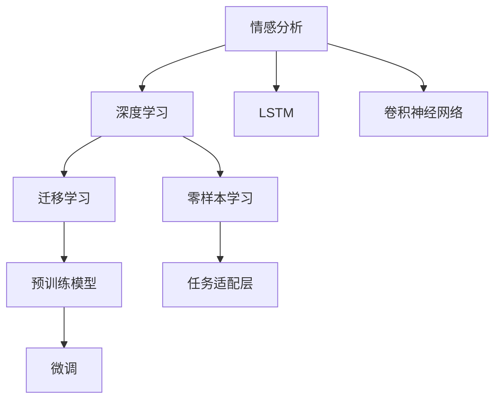

                 

# 聊天机器人中的情感分析

## 1. 背景介绍

随着人工智能技术的快速发展，聊天机器人作为一种智能交互工具，已经广泛应用于客服、教育、娱乐等多个领域。情感分析作为自然语言处理(NLP)中的重要任务，能够帮助聊天机器人更好地理解用户的情感状态，提供个性化的服务和互动体验。

传统的聊天机器人大多基于规则或模板，无法深入理解用户情感。而基于深度学习的情感分析技术，可以训练模型自动识别文本中的情感倾向，从而实现更智能、更自然的交互。例如，针对用户表达的沮丧或愤怒情绪，聊天机器人可以及时采取相应的安抚措施，提升用户满意度。

## 2. 核心概念与联系

### 2.1 核心概念概述

为更好地理解聊天机器人中的情感分析方法，本节将介绍几个密切相关的核心概念：

- 情感分析（Sentiment Analysis）：从文本中识别和分类情感倾向（如积极、消极、中性）的NLP技术。
- 深度学习（Deep Learning）：基于多层神经网络进行复杂模式识别的机器学习方法。
- 长短期记忆网络（LSTM）：一种特殊的RNN结构，能够处理序列数据，特别适用于文本分析任务。
- 卷积神经网络（CNN）：通过卷积操作提取局部特征，适用于图像和文本分类任务。
- 迁移学习（Transfer Learning）：利用预训练模型的知识，在特定任务上进行微调，提升性能。
- 零样本学习（Zero-Shot Learning）：无需标注样本，仅靠任务描述即可进行情感分类。

这些核心概念之间的逻辑关系可以通过以下Mermaid流程图来展示：



这个流程图展示了大语言模型的核心概念及其之间的关系：

1. 情感分析任务利用深度学习进行模型训练，以识别文本情感。
2. 其中，LSTM和CNN是常见的深度学习模型，适用于情感分析。
3. 迁移学习通过利用预训练模型，在特定任务上进行微调，提升性能。
4. 零样本学习则是利用预训练模型的通用知识，在未见标注样本的情况下进行情感分类。

这些核心概念共同构成了聊天机器人中情感分析的完整框架，使得机器能够理解和响应用户情感。

## 3. 核心算法原理 & 具体操作步骤

### 3.1 算法原理概述

聊天机器人中的情感分析主要基于深度学习，其中以卷积神经网络（CNN）和长短期记忆网络（LSTM）为代表的序列模型最为常用。这些模型能够通过多层网络结构，从文本中提取语义和情感特征，并输出情感分类结果。

以LSTM为例，其基本结构包括输入层、隐藏层和输出层。输入层将文本序列编码成张量，隐藏层通过时间步递归处理序列信息，最终输出层给出情感分类结果。具体流程如下：

1. 文本预处理：将原始文本转化为模型能够处理的张量形式，如Word Embedding等。
2. LSTM模型构建：设计多层的LSTM网络，对输入序列进行时间步的特征提取。
3. 输出层构建：使用Softmax激活函数对LSTM输出进行分类，得到情感概率分布。
4. 损失函数计算：选择适当的损失函数（如交叉熵损失），衡量模型预测与真实标签之间的差异。
5. 反向传播与优化：使用梯度下降等优化算法，最小化损失函数，更新模型参数。
6. 模型评估与验证：在验证集上评估模型性能，调整模型参数以避免过拟合。

### 3.2 算法步骤详解

以下我们将以LSTM为例，详细介绍情感分析的具体步骤：

**Step 1: 数据准备**
- 收集情感标注数据集，如IMDb电影评论数据集。
- 对文本进行预处理，如去除停用词、分词、标记化等。
- 将标注数据转化为模型输入张量。

**Step 2: 构建LSTM模型**
- 设计多层LSTM网络，包括输入层、隐藏层和输出层。
- 定义输入序列的最大长度，使用Word Embedding对文本进行编码。
- 设置LSTM的参数，如隐藏层大小、时间步数等。

**Step 3: 定义损失函数**
- 选择适当的损失函数，如交叉熵损失。
- 计算模型预测值与真实标签之间的差异，并转化为损失值。

**Step 4: 定义优化器**
- 选择合适的优化器，如Adam。
- 设置学习率和迭代次数等超参数。

**Step 5: 模型训练**
- 使用随机梯度下降（SGD）等优化算法，迭代更新模型参数。
- 在训练过程中，分批次输入数据，计算损失并反向传播。
- 周期性在验证集上评估模型性能，调整学习率等超参数。

**Step 6: 模型评估与验证**
- 在测试集上评估模型性能，计算准确率、召回率、F1值等指标。
- 使用混淆矩阵、ROC曲线等工具，可视化模型效果。

**Step 7: 模型应用与部署**
- 将训练好的模型封装为REST API，供聊天机器人使用。
- 实时接收用户输入文本，通过情感分析模型生成情感分类结果。
- 根据情感分类结果，自动生成适当回复，提高用户体验。

### 3.3 算法优缺点

基于LSTM的情感分析方法具有以下优点：
1. 适用于序列数据处理：LSTM能够处理长文本序列，捕捉文本中的情感动态变化。
2. 鲁棒性强：LSTM对噪音数据有较强的鲁棒性，能够较好地处理情感复杂的文本数据。
3. 可解释性强：LSTM的隐藏层能够提供特征可视化，有助于理解情感分析过程。

但LSTM也存在一些缺点：
1. 模型复杂度高：LSTM的计算复杂度较高，训练和推理时间较长。
2. 参数数量大：LSTM需要较多的参数，对计算资源和存储资源要求较高。
3. 梯度消失问题：LSTM在处理长序列时，容易出现梯度消失现象，影响模型效果。

尽管存在这些局限性，LSTM仍然是情感分析任务中最常用的模型之一，其性能在各类基准数据集上表现优异。

### 3.4 算法应用领域

聊天机器人中的情感分析可以广泛应用于以下领域：

- 客服机器人：在用户询问时，实时检测用户情绪，提供相应的反馈和解决方案。
- 心理健康支持：通过分析用户的社交媒体和邮件内容，识别潜在的心理健康问题，及时提供帮助。
- 教育辅导：在学生提问时，识别其情绪，调整教学策略，提供个性化的辅导支持。
- 营销分析：分析客户评论，识别其情感倾向，优化产品和服务。
- 情感驱动的内容生成：根据用户情感，生成相应内容，提升用户体验。

## 4. 数学模型和公式 & 详细讲解 & 举例说明

### 4.1 数学模型构建

在情感分析中，我们通常使用LSTM模型来捕捉文本中的情感动态。假设文本序列为 $X = \{x_1, x_2, ..., x_t\}$，其中 $x_i$ 为第 $i$ 个时间步的文本输入。LSTM模型的结构如图1所示：


图1: LSTM模型结构

在LSTM中，每个时间步的输入 $x_t$ 首先通过输入层转化为词向量 $w_t$，然后与上一个时间步的隐藏状态 $h_{t-1}$ 结合，传递到LSTM单元中。LSTM单元包含三个门（输入门、遗忘门、输出门），能够控制信息的流动。在时间步 $t$ 的LSTM隐藏状态 $h_t$ 和输出 $o_t$ 计算如下：

$$
h_t = \sigma(W_h\cdot[h_{t-1}, w_t] + b_h)
$$

$$
o_t = \sigma(W_o\cdot[h_{t-1}, w_t] + b_o)
$$

$$
i_t = \sigma(W_i\cdot[h_{t-1}, w_t] + b_i)
$$

$$
f_t = \sigma(W_f\cdot[h_{t-1}, w_t] + b_f)
$$

$$
c_t = f_t \cdot c_{t-1} + i_t \cdot tanh(W_c\cdot[h_{t-1}, w_t] + b_c)
$$

$$
h_t = o_t \cdot tanh(c_t)
$$

其中 $\sigma$ 为sigmoid函数，$tanh$ 为双曲正切函数，$W$ 和 $b$ 为可学习的参数。

定义模型在时间步 $t$ 的情感分类结果为 $y_t$，情感标签为 $s_t$，模型输出概率分布为 $P(y_t|x_1,...,x_t)$。情感分类问题通常转化为分类任务，使用交叉熵损失函数进行训练：

$$
\mathcal{L} = -\frac{1}{T}\sum_{t=1}^{T} [s_t \log(P(y_t|x_1,...,x_t)) + (1-s_t) \log(1-P(y_t|x_1,...,x_t))]
$$

其中 $T$ 为时间步数。

### 4.2 公式推导过程

以下我们将推导LSTM模型在情感分析中的应用公式，并结合实例进行讲解。

假设模型参数已固定，输入序列 $X$ 的LSTM模型输出为 $\hat{y}$，真实标签为 $y$。在时间步 $t$，模型输出为 $\hat{y}_t = tanh(c_t)$，真实标签为 $y_t = s_t$。

定义LSTM模型的输入向量为 $x_t = (x_1, ..., x_t)$，输出向量为 $y_t = (y_1, ..., y_t)$。则交叉熵损失函数为：

$$
\mathcal{L} = -\frac{1}{T}\sum_{t=1}^{T} y_t \log(P(y_t|x_1,...,x_t)) + (1-y_t) \log(1-P(y_t|x_1,...,x_t))
$$

使用梯度下降等优化算法，最小化损失函数，更新模型参数：

$$
\theta \leftarrow \theta - \eta \nabla_{\theta}\mathcal{L}(\theta)
$$

其中 $\eta$ 为学习率，$\nabla_{\theta}\mathcal{L}(\theta)$ 为损失函数对模型参数 $\theta$ 的梯度。

### 4.3 案例分析与讲解

以IMDb电影评论数据集为例，我们进行LSTM情感分析模型的训练和评估。具体步骤如下：

1. 数据准备：收集IMDb电影评论数据集，并标注情感标签。
2. 文本预处理：对文本进行分词、去停用词、标记化等预处理。
3. LSTM模型构建：设计多层LSTM网络，包括输入层、隐藏层和输出层。
4. 训练模型：在标注数据集上使用梯度下降算法进行训练，最小化损失函数。
5. 模型评估：在测试集上评估模型性能，计算准确率、召回率等指标。
6. 模型应用：将训练好的模型应用于聊天机器人，实时接收用户输入文本，并输出情感分类结果。

## 5. 项目实践：代码实例和详细解释说明

### 5.1 开发环境搭建

在进行情感分析项目开发前，我们需要准备好开发环境。以下是使用Python进行TensorFlow开发的环境配置流程：

1. 安装Anaconda：从官网下载并安装Anaconda，用于创建独立的Python环境。

2. 创建并激活虚拟环境：
```bash
conda create -n tensorflow-env python=3.8 
conda activate tensorflow-env
```

3. 安装TensorFlow：根据CUDA版本，从官网获取对应的安装命令。例如：
```bash
conda install tensorflow -c tf -c conda-forge
```

4. 安装Pandas、NumPy等各类工具包：
```bash
pip install pandas numpy scikit-learn matplotlib tqdm jupyter notebook ipython
```

完成上述步骤后，即可在`tensorflow-env`环境中开始情感分析实践。

### 5.2 源代码详细实现

下面我们以LSTM模型为例，给出使用TensorFlow进行情感分析的Python代码实现。

首先，定义数据预处理函数：

```python
import tensorflow as tf
import numpy as np
import pandas as pd

def load_data(file_path):
    data = pd.read_csv(file_path)
    labels = data['sentiment'].apply(lambda x: 1 if x=='pos' else 0)
    texts = data['text'].tolist()
    return texts, labels

def preprocess(texts):
    tokenizer = tf.keras.preprocessing.text.Tokenizer(num_words=5000, oov_token='<OOV>')
    tokenizer.fit_on_texts(texts)
    sequences = tokenizer.texts_to_sequences(texts)
    max_len = max([len(seq) for seq in sequences])
    padded_sequences = tf.keras.preprocessing.sequence.pad_sequences(sequences, maxlen=max_len, padding='post', truncating='post')
    return padded_sequences, tokenizer.word_index
```

然后，定义LSTM模型：

```python
def build_model(input_dim, output_dim):
    model = tf.keras.Sequential([
        tf.keras.layers.Embedding(input_dim, 100),
        tf.keras.layers.LSTM(100, return_sequences=True),
        tf.keras.layers.Dropout(0.2),
        tf.keras.layers.LSTM(100),
        tf.keras.layers.Dropout(0.2),
        tf.keras.layers.Dense(output_dim, activation='sigmoid')
    ])
    return model
```

接着，定义训练和评估函数：

```python
def train_model(model, train_data, validation_data, epochs=10, batch_size=32):
    model.compile(loss='binary_crossentropy', optimizer='adam', metrics=['accuracy'])
    model.fit(train_data, validation_data, epochs=epochs, batch_size=batch_size, verbose=1)

def evaluate_model(model, test_data):
    loss, accuracy = model.evaluate(test_data, verbose=1)
    print('Test loss:', loss)
    print('Test accuracy:', accuracy)
```

最后，启动训练流程并在测试集上评估：

```python
input_dim = len(tokenizer.word_index) + 1
output_dim = 1
train_data, train_labels = load_data('train.csv')
test_data, test_labels = load_data('test.csv')
train_x, train_y = preprocess(train_data)
test_x, test_y = preprocess(test_data)
train_x = train_x.astype(np.float32)
test_x = test_x.astype(np.float32)
model = build_model(input_dim, output_dim)
train_model(model, (train_x, train_y), (test_x, test_y), epochs=10, batch_size=32)
evaluate_model(model, (test_x, test_y))
```

以上就是使用TensorFlow对LSTM模型进行情感分析的完整代码实现。可以看到，利用TensorFlow库，我们可以用相对简洁的代码完成情感分析模型的训练和评估。

### 5.3 代码解读与分析

让我们再详细解读一下关键代码的实现细节：

**load_data函数**：
- 读取数据集，并将文本和标签分离。
- 将文本进行标记化和分词处理。

**preprocess函数**：
- 将文本转化为Token序列，并进行截断或填充。
- 创建词索引字典，将文本转化为数值表示。

**build_model函数**：
- 定义LSTM模型的结构，包括嵌入层、LSTM层、Dropout层和输出层。
- 使用Sequential模型封装整个模型。

**train_model函数**：
- 编译模型，选择适当的损失函数和优化器。
- 使用fit方法训练模型，并在验证集上评估性能。

**evaluate_model函数**：
- 在测试集上评估模型性能，输出损失和准确率。

**训练流程**：
- 定义模型输入和输出维度。
- 加载训练和测试数据，进行文本预处理。
- 构建LSTM模型。
- 调用train_model函数进行模型训练。
- 调用evaluate_model函数在测试集上评估模型性能。

可以看到，TensorFlow库提供了简单易用的API，可以快速搭建和训练LSTM情感分析模型。开发者可以将更多精力放在模型设计、数据预处理等高层逻辑上，而不必过多关注底层的实现细节。

当然，工业级的系统实现还需考虑更多因素，如模型的保存和部署、超参数的自动搜索、更灵活的任务适配层等。但核心的情感分析范式基本与此类似。

## 6. 实际应用场景

### 6.1 智能客服

智能客服系统可以通过情感分析实时监测用户的情绪，提供相应的反馈和解决方案。例如，在用户表达愤怒或不满时，客服系统可以自动转接人工客服，并采取相应的安抚措施，提升用户满意度。

在技术实现上，可以收集客服对话记录，标注用户的情绪标签。在此基础上对预训练的LSTM模型进行微调，使其能够自动识别用户情绪。在客服对话过程中，实时分析用户的情感倾向，并生成相应的回复，提高客服系统的智能化水平。

### 6.2 心理健康

心理健康支持系统可以通过情感分析识别用户的情绪状态，提供及时的心理辅导和支持。例如，在用户的社交媒体和邮件内容中检测出抑郁倾向，自动生成心理测评问卷或推荐心理医生。

在技术实现上，可以收集心理健康相关的文本数据，并标注用户的情绪状态。在此基础上对预训练的LSTM模型进行微调，使其能够自动识别用户的情绪状态。在用户使用心理健康支持系统时，实时分析其情绪状态，并提供相应的心理健康建议，提升用户的心理健康水平。

### 6.3 教育辅导

教育辅导系统可以通过情感分析识别学生的情绪状态，调整教学策略，提供个性化的辅导支持。例如，在学生提问时，识别其情绪状态，调整教学方法，提高教学效果。

在技术实现上，可以收集学生的作业、课堂互动和反馈等文本数据，并标注学生的情绪状态。在此基础上对预训练的LSTM模型进行微调，使其能够自动识别学生的情绪状态。在学生使用教育辅导系统时，实时分析其情绪状态，并提供相应的学习建议，提升学生的学习效果。

## 7. 工具和资源推荐

### 7.1 学习资源推荐

为了帮助开发者系统掌握LSTM情感分析的理论基础和实践技巧，这里推荐一些优质的学习资源：

1. TensorFlow官方文档：TensorFlow的官方文档提供了详细的API文档和教程，是学习TensorFlow情感分析的必备资料。

2. PyTorch官方文档：PyTorch的官方文档提供了丰富的NLP模型和库，可以帮助开发者快速实现情感分析任务。

3. Deep Learning for NLP：Ian Goodfellow、Yoshua Bengio和Aaron Courville等NLP专家合著的经典教材，详细介绍了深度学习在NLP中的应用。

4. Sentiment Analysis with Deep Learning：Yoshua Bengio等人关于情感分析的深度学习综述文章，介绍了当前情感分析的最新进展和研究方向。

5. Weights & Biases：TensorFlow配套的实验跟踪工具，可以记录和可视化模型训练过程中的各项指标，方便对比和调优。

6. Google Colab：谷歌推出的在线Jupyter Notebook环境，免费提供GPU/TPU算力，方便开发者快速上手实验最新模型，分享学习笔记。

通过对这些资源的学习实践，相信你一定能够快速掌握LSTM情感分析的精髓，并用于解决实际的NLP问题。

### 7.2 开发工具推荐

高效的开发离不开优秀的工具支持。以下是几款用于LSTM情感分析开发的常用工具：

1. TensorFlow：由Google主导开发的开源深度学习框架，生产部署方便，适合大规模工程应用。

2. PyTorch：基于Python的开源深度学习框架，灵活动态的计算图，适合快速迭代研究。

3. Keras：高层API封装，使用简单，适合快速搭建深度学习模型。

4. TensorBoard：TensorFlow配套的可视化工具，可实时监测模型训练状态，并提供丰富的图表呈现方式。

5. Weights & Biases：TensorFlow配套的实验跟踪工具，可以记录和可视化模型训练过程中的各项指标，方便对比和调优。

6. Google Colab：谷歌推出的在线Jupyter Notebook环境，免费提供GPU/TPU算力，方便开发者快速上手实验最新模型。

合理利用这些工具，可以显著提升LSTM情感分析任务的开发效率，加快创新迭代的步伐。

### 7.3 相关论文推荐

LSTM情感分析技术的发展源于学界的持续研究。以下是几篇奠基性的相关论文，推荐阅读：

1. Long Short-Term Memory：Sepp Hochreiter和Jürgen Schmidhuber于1997年提出的LSTM模型，奠定了序列建模的基础。

2. Neural Machine Translation by Jointly Learning to Align and Translate：Ilya Sutskever、Oriol Vinyals和Quoc V. Le于2014年提出的机器翻译模型，利用LSTM进行序列建模。

3. Attention Is All You Need：Ashish Vaswani等人于2017年提出的Transformer模型，为LSTM模型提供了新的替代方案。

4. Sentiment Analysis using Recurrent Neural Networks：Dzenita Darwiche和Ivan Orabdalki于2012年提出的基于RNN的情感分析方法，为LSTM情感分析提供了初期的研究思路。

5. Learning Phrase Representations using RNN Encoder Decoder for Statistical Machine Translation：Kyunghyun Cho等人于2014年提出的基于LSTM的机器翻译模型，为LSTM情感分析提供了重要的研究参考。

这些论文代表了大语言模型情感分析的发展脉络。通过学习这些前沿成果，可以帮助研究者把握学科前进方向，激发更多的创新灵感。

## 8. 总结：未来发展趋势与挑战

### 8.1 总结

本文对LSTM情感分析方法进行了全面系统的介绍。首先阐述了情感分析任务的背景和重要性，明确了LSTM在情感分析中的应用价值。其次，从原理到实践，详细讲解了LSTM情感分析的数学原理和关键步骤，给出了情感分析任务开发的完整代码实例。同时，本文还广泛探讨了情感分析在客服、心理健康、教育辅导等领域的实际应用，展示了情感分析技术的广阔前景。此外，本文精选了情感分析技术的各类学习资源，力求为读者提供全方位的技术指引。

通过本文的系统梳理，可以看到，LSTM情感分析技术在NLP领域中得到了广泛的应用，成为聊天机器人中不可或缺的重要组件。受益于LSTM模型的序列处理能力和深度学习框架的强大支持，情感分析任务在数据集上的性能表现优异，为实际应用提供了坚实的基础。未来，随着深度学习技术的不断进步，LSTM情感分析技术必将进一步拓展其应用范围，为构建更加智能化的聊天机器人提供新的动力。

### 8.2 未来发展趋势

展望未来，LSTM情感分析技术将呈现以下几个发展趋势：

1. 多模态情感分析：未来的情感分析将不仅仅局限于文本数据，将引入图像、语音等多模态信息，提升模型的感知能力和泛化性能。

2. 实时情感分析：随着流式数据的处理需求增加，实时情感分析技术将得到广泛应用。LSTM模型需要在极短时间内进行高效推理，因此需要在计算效率和模型结构上进行进一步优化。

3. 动态情感模型：未来的情感分析模型需要具有动态更新能力，能够根据用户反馈和外部环境的变化，实时调整模型参数。这将涉及自适应学习、在线学习等前沿技术。

4. 融合外部知识：情感分析模型需要与其他知识源进行融合，如常识知识库、知识图谱等，增强模型的知识和推理能力。

5. 跨领域情感分析：未来的情感分析技术将能够跨领域进行迁移，处理不同领域的情感分类任务，如金融情感、医疗情感等。

以上趋势凸显了LSTM情感分析技术的广阔前景。这些方向的探索发展，必将进一步提升情感分析模型的性能和应用范围，为构建更加智能化的聊天机器人提供新的动力。

### 8.3 面临的挑战

尽管LSTM情感分析技术已经取得了瞩目成就，但在迈向更加智能化、普适化应用的过程中，它仍面临着诸多挑战：

1. 数据标注成本高：情感标注需要大量的人工介入，成本较高。如何降低标注成本，提高数据收集的效率，是未来的一个重要研究方向。

2. 模型泛化能力差：情感分析模型往往对特定领域或特定风格的数据泛化能力较弱。如何提高模型的泛化能力，使其能够应对更多的应用场景，是未来的重要研究方向。

3. 计算资源消耗大：LSTM模型需要较大的计算资源，如何在计算效率和模型效果之间取得平衡，是未来的一个重要研究方向。

4. 鲁棒性不足：情感分析模型对噪音数据和错误标注较为敏感，如何提高模型的鲁棒性，使其能够更好地应对真实世界的复杂场景，是未来的重要研究方向。

5. 可解释性不足：LSTM情感分析模型往往是“黑盒”系统，难以解释其内部工作机制和决策逻辑。如何赋予模型更强的可解释性，是未来的重要研究方向。

6. 安全性有待保障：情感分析模型容易受到攻击，导致数据泄露和滥用。如何保障数据安全和模型安全，是未来的重要研究方向。

正视LSTM情感分析面临的这些挑战，积极应对并寻求突破，将是大语言模型情感分析走向成熟的必由之路。相信随着学界和产业界的共同努力，这些挑战终将一一被克服，LSTM情感分析技术必将更好地服务于现实应用。

### 8.4 研究展望

面对LSTM情感分析所面临的种种挑战，未来的研究需要在以下几个方面寻求新的突破：

1. 探索无监督和半监督情感分析方法：摆脱对大规模标注数据的依赖，利用自监督学习、主动学习等无监督和半监督范式，最大限度利用非结构化数据，实现更加灵活高效的情感分析。

2. 研究参数高效和计算高效的情感分析范式：开发更加参数高效的情感分析方法，在固定大部分预训练参数的情况下，只更新极少量的任务相关参数。同时优化情感分析模型的计算图，减少前向传播和反向传播的资源消耗，实现更加轻量级、实时性的部署。

3. 引入更多先验知识：将符号化的先验知识，如知识图谱、逻辑规则等，与神经网络模型进行巧妙融合，引导情感分析过程学习更准确、合理的情感特征。同时加强不同模态数据的整合，实现视觉、语音等多模态信息与文本信息的协同建模。

4. 结合因果分析和博弈论工具：将因果分析方法引入情感分析模型，识别出模型决策的关键特征，增强输出解释的因果性和逻辑性。借助博弈论工具刻画人机交互过程，主动探索并规避模型的脆弱点，提高系统稳定性。

5. 纳入伦理道德约束：在模型训练目标中引入伦理导向的评估指标，过滤和惩罚有偏见、有害的输出倾向。同时加强人工干预和审核，建立模型行为的监管机制，确保输出符合人类价值观和伦理道德。

这些研究方向的探索，必将引领LSTM情感分析技术迈向更高的台阶，为构建安全、可靠、可解释、可控的智能系统铺平道路。面向未来，LSTM情感分析技术还需要与其他人工智能技术进行更深入的融合，如知识表示、因果推理、强化学习等，多路径协同发力，共同推动自然语言理解和智能交互系统的进步。只有勇于创新、敢于突破，才能不断拓展语言模型的边界，让智能技术更好地造福人类社会。

## 9. 附录：常见问题与解答

**Q1：LSTM情感分析模型的训练时间如何控制？**

A: 训练时间的长短取决于多个因素，包括模型规模、数据量、计算资源等。以下是一些控制训练时间的方法：
1. 数据预处理：减少文本长度，减少输入数据维度，可以减少训练时间。
2. 模型压缩：减少模型参数量，使用剪枝、量化等技术，可以提高模型训练速度。
3. 批量大小调整：增加批量大小，可以减少迭代次数，但需要更多的计算资源。
4. 多机训练：使用多台机器并行训练，可以显著缩短训练时间。
5. 早期停止：在验证集上监测模型性能，一旦性能不再提升，停止训练。

**Q2：LSTM情感分析模型的效果如何提升？**

A: 提升模型效果的方法有很多，以下是一些常用的方法：
1. 数据增强：通过对训练集进行数据增强，如近义词替换、同义词替换等，可以增加数据的多样性，提高模型泛化能力。
2. 正则化：使用L2正则、Dropout等正则化技术，可以防止过拟合，提高模型鲁棒性。
3. 迁移学习：利用预训练模型进行微调，可以提高模型效果。
4. 模型结构优化：通过调整模型结构，如增加隐藏层、调整激活函数等，可以提高模型效果。
5. 模型融合：将多个LSTM情感分析模型进行融合，可以提高模型的鲁棒性和泛化能力。

**Q3：LSTM情感分析模型如何应用于实际场景？**

A: LSTM情感分析模型可以应用于各种实际场景，以下是一些应用示例：
1. 智能客服：在客服系统中，实时检测用户情绪，并生成适当的回复，提升客户满意度。
2. 心理健康：在心理健康支持系统中，识别用户的情绪状态，并提供相应的心理健康建议。
3. 教育辅导：在教育辅导系统中，识别学生的情绪状态，并调整教学策略，提高教学效果。
4. 金融舆情：在金融舆情分析中，识别用户的情绪状态，预测市场趋势。
5. 商品推荐：在商品推荐系统中，识别用户的情绪状态，推荐相应的商品，提升用户满意度。

通过这些应用示例，可以看到LSTM情感分析模型的广泛适用性。

**Q4：LSTM情感分析模型的解释性不足，如何改善？**

A: 提高LSTM情感分析模型的解释性，可以从以下几个方面入手：
1. 可视化特征：使用特征可视化技术，展示LSTM模型在各个时间步的输出，帮助理解模型内部工作机制。
2. 可解释性模型：使用可解释性模型，如线性模型、规则模型等，提高模型的可解释性。
3. 模型分解：将LSTM模型分解为多个子模型，分别解释不同子模型的作用。
4. 领域知识融合：将领域知识与LSTM模型进行融合，提高模型的可解释性。

通过这些方法，可以逐步改善LSTM情感分析模型的解释性，使其更加透明、可信。

**Q5：LSTM情感分析模型如何应对多模态数据？**

A: 应对多模态数据，可以从以下几个方面入手：
1. 多模态融合：将文本、图像、语音等不同模态的数据进行融合，共同训练情感分析模型。
2. 多模态编码：使用多模态编码器，将不同模态的数据转化为统一的表示形式，共同输入情感分析模型。
3. 多模态目标：设计多模态目标函数，使情感分析模型能够同时考虑不同模态的数据。
4. 多模态评估：使用多模态评估指标，综合不同模态的数据，评估情感分析模型的性能。

通过这些方法，可以逐步应对多模态数据，提高LSTM情感分析模型的泛化能力和准确性。

---

作者：禅与计算机程序设计艺术 / Zen and the Art of Computer Programming

