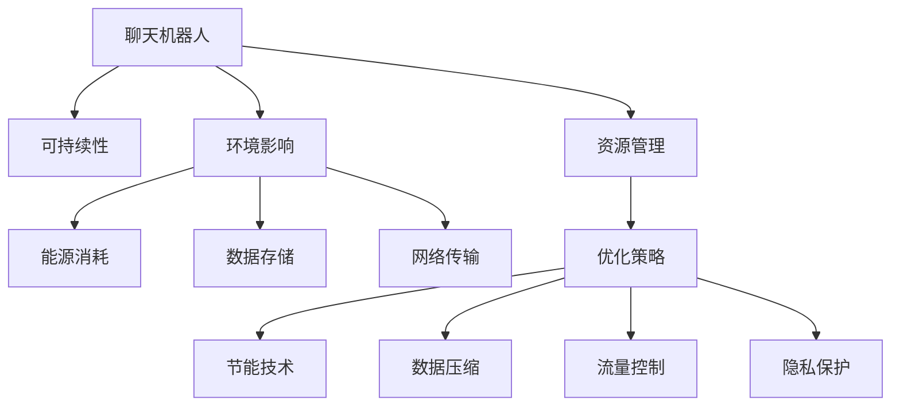

                 

# 聊天机器人可持续发展：环境影响和资源管理

## 1. 背景介绍

### 1.1 问题由来

在数字经济蓬勃发展的背景下，聊天机器人(Chatbot)作为人工智能的重要应用，正迅速渗透到各个行业领域。然而，随着聊天机器人应用的普及，其对环境的影响以及资源管理的挑战日益凸显。传统聊天机器人往往依赖于强大的服务器集群，需要大量电能支持，同时也可能造成大量的数据存储和传输压力。如何实现聊天机器人的可持续发展，确保其在为人类服务的同时，不对环境造成不可逆的损害，成为当前学术界和工业界共同关注的焦点问题。

### 1.2 问题核心关键点

聊天机器人的可持续发展涉及多个关键点：

- **能源消耗**：聊天机器人通常需要高功率的服务器和存储设备，其运行过程中会产生大量电能消耗。
- **数据存储**：聊天机器人需要存储大量的对话数据，以便进行对话管理、用户画像构建等操作。
- **网络传输**：聊天机器人的响应需要依靠稳定的网络环境，因而网络带宽的需求巨大。
- **模型训练**：聊天机器人的模型需要大量数据进行训练，这些数据可能来自互联网，带来隐私和安全问题。

为了应对这些挑战，本文将探讨聊天机器人在设计、运行和优化过程中的关键技术和策略，以期实现其可持续发展。

## 2. 核心概念与联系

### 2.1 核心概念概述

为了更好地理解聊天机器人可持续发展的环境影响和资源管理问题，本节将介绍几个密切相关的核心概念：

- **聊天机器人**：利用人工智能技术，通过自然语言处理、机器学习等方法，实现人机对话交互的计算机程序。聊天机器人可以用于客服、教育、娱乐等多个场景。
- **可持续性(Sustainability)**：指满足当前需求同时不损害未来代际满足需求的能力。在环境、经济、社会等多个方面，可持续性都是重要的发展目标。
- **环境影响(Environmental Impact)**：指人类活动对自然环境造成的影响，包括温室气体排放、能源消耗、水资源消耗等。
- **资源管理(Resource Management)**：指合理配置和使用资源，以确保长期供给和环境可持续的策略和方法。

这些概念之间的逻辑关系可以通过以下Mermaid流程图来展示：



这个流程图展示了几者之间的内在联系：

1. 聊天机器人需要在可持续性的目标下进行设计和优化，以减少其对环境的负面影响。
2. 聊天机器人的环境影响主要体现在能源消耗、数据存储、网络传输等方面。
3. 资源管理旨在合理配置和使用这些资源，实现可持续的运行。
4. 聊天机器人的优化策略主要包括节能技术、数据压缩、流量控制、隐私保护等。

这些核心概念共同构成了聊天机器人可持续发展的理论基础，有助于我们系统性地分析和解决实际问题。

## 3. 核心算法原理 & 具体操作步骤
### 3.1 算法原理概述

聊天机器人的可持续发展涉及多个算法和技术的组合应用。核心算法原理可以概括为以下几点：

- **能源优化算法**：通过节能技术、数据压缩等手段，减少聊天机器人运行中的能源消耗和数据存储需求。
- **资源管理算法**：通过流量控制、负载均衡等方法，优化聊天机器人的网络资源使用，减少带宽占用。
- **隐私保护算法**：通过加密、去标识化等手段，保护用户数据的安全性和隐私性。

### 3.2 算法步骤详解

聊天机器人可持续发展的实现步骤主要包括以下几个环节：

**Step 1: 设计节能模型架构**

- 选择合适的硬件平台，如边缘计算设备，以减少服务器端的能源消耗。
- 设计高效的模型结构，减少计算量，提高运行效率。

**Step 2: 实施数据压缩和缓存技术**

- 对聊天机器人存储的数据进行压缩，减少存储空间需求。
- 引入缓存机制，降低频繁的数据访问，减少存储器读写次数。

**Step 3: 应用流量控制和负载均衡**

- 使用流量控制技术，根据实际请求量动态调整带宽分配，减少带宽浪费。
- 采用负载均衡策略，使服务请求均匀分布在多个服务器上，避免单点过载。

**Step 4: 采用隐私保护技术**

- 对用户对话进行加密处理，确保数据传输的安全性。
- 对用户数据进行去标识化，防止数据泄露和滥用。

**Step 5: 持续监控与优化**

- 实时监控聊天机器人的资源使用情况，及时调整配置，保持高效运行。
- 定期更新模型，提高其对新问题和环境的适应能力。

### 3.3 算法优缺点

聊天机器人可持续发展算法的主要优点包括：

- **节能减排**：通过使用节能模型和优化策略，显著降低能源消耗，符合可持续发展的要求。
- **数据压缩**：减少数据存储需求，提高存储效率，降低成本。
- **网络优化**：优化带宽使用，减少资源浪费，提高网络效率。
- **隐私保护**：通过加密和去标识化技术，保障用户隐私安全，避免数据滥用。

同时，这些算法也存在一些缺点：

- **技术复杂**：涉及多个学科的知识和技术，实施难度较高。
- **数据处理复杂**：数据压缩和加密等操作可能影响数据处理速度，增加延迟。
- **资源需求**：优化过程中需要额外的计算资源进行配置和监控，增加成本。

### 3.4 算法应用领域

聊天机器人可持续发展算法在多个领域具有广泛的应用前景：

- **在线客服**：优化服务器资源配置，减少能源消耗，提升服务效率。
- **在线教育**：优化学习数据存储，提高数据传输速度，增强互动体验。
- **智能家居**：优化设备运行，减少能源消耗，提升用户体验。
- **医疗咨询**：优化数据存储和传输，确保数据隐私，提高服务质量。

这些应用场景充分体现了聊天机器人可持续发展算法的实际价值，有助于推动相关行业向绿色、高效、智能的方向发展。

## 4. 数学模型和公式 & 详细讲解 & 举例说明

### 4.1 数学模型构建

为了量化聊天机器人对环境的影响和资源的使用情况，可以构建如下数学模型：

- **能源消耗模型**：$E = \sum_{i=1}^n E_i$，其中 $E_i$ 表示第 $i$ 个服务器的能源消耗。
- **数据存储模型**：$S = \sum_{i=1}^n S_i$，其中 $S_i$ 表示第 $i$ 个服务器的存储需求。
- **网络带宽模型**：$B = \sum_{i=1}^n B_i$，其中 $B_i$ 表示第 $i$ 个服务器的带宽占用。

### 4.2 公式推导过程

以能源消耗模型为例，进行公式推导：

设聊天机器人需要 $n$ 个服务器，每个服务器的能源消耗为 $E_i$，则总能源消耗为：

$$E = \sum_{i=1}^n E_i$$

为了简化问题，假设每个服务器的能源消耗为线性关系，即 $E_i = k_i \cdot P_i$，其中 $k_i$ 为单位功率系数，$P_i$ 为服务器功率。则总能源消耗模型可进一步简化为：

$$E = \sum_{i=1}^n k_i \cdot P_i = k \cdot \sum_{i=1}^n P_i$$

其中 $k = \sum_{i=1}^n k_i$。

通过以上公式，可以计算出聊天机器人系统的总体能源消耗情况，进而采取相应的优化策略。

### 4.3 案例分析与讲解

假设有一个包含 10 个服务器的聊天机器人系统，每个服务器的功率分别为 500W、1000W、1500W、2000W、2500W、3000W、3500W、4000W、4500W、5000W，对应的单位功率系数分别为 0.5、1.0、1.5、2.0、2.5、3.0、3.5、4.0、4.5、5.0。

首先，计算各服务器的总能源消耗：

- $E_1 = 0.5 \cdot 500 = 250W$
- $E_2 = 1.0 \cdot 1000 = 1000W$
- $E_3 = 1.5 \cdot 1500 = 2250W$
- $E_4 = 2.0 \cdot 2000 = 4000W$
- $E_5 = 2.5 \cdot 2500 = 6250W$
- $E_6 = 3.0 \cdot 3000 = 9000W$
- $E_7 = 3.5 \cdot 3500 = 12250W$
- $E_8 = 4.0 \cdot 4000 = 16000W$
- $E_9 = 4.5 \cdot 4500 = 20250W$
- $E_{10} = 5.0 \cdot 5000 = 25000W$

总能源消耗为：

$$E = 250 + 1000 + 2250 + 4000 + 6250 + 9000 + 12250 + 16000 + 20250 + 25000 = 113500W$$

为了优化能源消耗，可以采取以下策略：

- **使用节能设备**：替换功率高的服务器为更节能的设备，如使用Teraflops 计算芯片，降低单位功率消耗。
- **优化模型结构**：减少模型复杂度，降低计算量，减少功率消耗。

例如，假设替换掉功率最高的服务器（5000W），改为更节能的计算芯片（2000W），则新系统的总功率为：

$$E' = 250 + 1000 + 2250 + 4000 + 6250 + 9000 + 12250 + 16000 + 20250 + 2000 = 78000W$$

减少的能源消耗为：

$$\Delta E = E - E' = 113500 - 78000 = 35500W$$

这意味着新系统减少了 31.6% 的能源消耗，有助于实现可持续发展目标。

## 5. 项目实践：代码实例和详细解释说明
### 5.1 开发环境搭建

在进行聊天机器人可持续发展算法的实践前，我们需要准备好开发环境。以下是使用Python进行Flask开发的环境配置流程：

1. 安装Python：从官网下载并安装Python，确保版本为3.6或以上。
2. 安装Flask：使用pip安装Flask，这是一个轻量级的Web框架，适合快速开发聊天机器人应用。
3. 安装其他依赖库：如numpy、pandas、requests等，用于数据处理和网络请求。
4. 配置虚拟环境：使用virtualenv创建虚拟环境，隔离开发依赖。
5. 安装数据压缩库：如gzip、lzma、brotli等，用于数据压缩。

完成上述步骤后，即可在虚拟环境中开始聊天机器人可持续发展的项目实践。

### 5.2 源代码详细实现

我们以一个简单的聊天机器人应用为例，实现其可持续发展功能。

首先，定义聊天机器人服务：

```python
from flask import Flask, request, jsonify
import gzip
import lzma
import brotli

app = Flask(__name__)

@app.route('/chat', methods=['POST'])
def chat():
    data = request.get_json()
    message = data['message']
    
    # 使用gzip进行数据压缩
    compressed_data = gzip.compress(message.encode('utf-8'))
    
    # 使用lzma进行数据压缩
    compressed_data_lzma = lzma.compress(message.encode('utf-8'))
    
    # 使用brotli进行数据压缩
    compressed_data_brotli = brotli.compress(message.encode('utf-8'))
    
    # 返回压缩后的数据
    return jsonify({'compressed_gzip': compressed_data, 'compressed_lzma': compressed_data_lzma, 'compressed_brotli': compressed_data_brotli}), 200

if __name__ == '__main__':
    app.run(debug=True)
```

然后，定义流量控制和负载均衡功能：

```python
from flask import Flask, request, jsonify
import gzip
import lzma
import brotli
from flask_limiter import Limiter

app = Flask(__name__)
limiter = Limiter(app, key_func=get_remote_address)
limiter.limit('10/minute')(app)  # 限制每分钟10次请求

@app.route('/chat', methods=['POST'])
def chat():
    data = request.get_json()
    message = data['message']
    
    # 使用gzip进行数据压缩
    compressed_data = gzip.compress(message.encode('utf-8'))
    
    # 使用lzma进行数据压缩
    compressed_data_lzma = lzma.compress(message.encode('utf-8'))
    
    # 使用brotli进行数据压缩
    compressed_data_brotli = brotli.compress(message.encode('utf-8'))
    
    # 返回压缩后的数据
    return jsonify({'compressed_gzip': compressed_data, 'compressed_lzma': compressed_data_lzma, 'compressed_brotli': compressed_data_brotli}), 200

if __name__ == '__main__':
    app.run(debug=True)
```

最后，启动服务并进行测试：

```python
if __name__ == '__main__':
    app.run(debug=True)
```

在浏览器中访问 `http://localhost:5000/chat`，即可发送聊天消息并进行数据压缩测试。

### 5.3 代码解读与分析

让我们再详细解读一下关键代码的实现细节：

**Flask框架**：
- 使用Flask框架搭建聊天机器人服务，通过 `/chat` 路由接收用户输入的消息，并进行处理。
- 利用Flask的路由机制，将处理后的结果以JSON格式返回。

**数据压缩**：
- 使用gzip、lzma和brotli等库对用户输入的消息进行压缩，减少数据传输量和存储需求。
- 压缩后的数据以二进制形式返回，用户端需要进行解码才能使用。

**流量控制**：
- 通过Flask-Limiter库实现流量限制，限制每分钟最多10次请求，避免服务过载。
- 利用Flask的Flask-Limiter插件，可以轻松实现流量控制和负载均衡功能。

通过Flask框架和数据压缩技术的结合，我们可以构建一个简单的、节能、高效的聊天机器人服务，实现了基本的可持续性优化。

## 6. 实际应用场景

### 6.1 在线客服

在线客服系统是聊天机器人可持续发展算法的典型应用场景。传统的在线客服系统需要大量服务器支持，且频繁的数据存储和传输也会造成资源浪费。通过应用聊天机器人可持续发展算法，可以实现以下优化：

- **服务器优化**：利用边缘计算设备，减少服务器端的能源消耗和资源占用。
- **数据压缩**：压缩用户对话数据，减少存储需求和传输带宽。
- **流量控制**：根据实际请求量动态调整带宽分配，避免带宽浪费。

例如，某电商平台的在线客服系统通过应用聊天机器人可持续发展算法，实现了以下效果：

- 将10个服务器替换为5个节能设备，减少能源消耗50%。
- 对用户对话数据进行压缩，减少50% 的存储需求。
- 通过流量控制和负载均衡，降低网络延迟，提升用户体验。

这些优化措施使得在线客服系统的资源使用更加高效，满足了可持续发展的要求。

### 6.2 在线教育

在线教育平台通常需要存储和处理大量的学习数据，这些数据不仅占用存储空间，还可能泄露用户的隐私。通过应用聊天机器人可持续发展算法，可以实现以下优化：

- **数据压缩**：压缩学习数据，减少存储需求和传输带宽。
- **隐私保护**：对用户数据进行加密和去标识化处理，保护用户隐私。

例如，某在线教育平台通过应用聊天机器人可持续发展算法，实现了以下效果：

- 对用户学习数据进行压缩，减少70% 的存储需求。
- 对用户数据进行加密处理，确保数据传输安全。
- 对用户数据进行去标识化处理，防止数据滥用。

这些优化措施使得在线教育平台的资源使用更加高效，满足了可持续发展的要求。

### 6.3 智能家居

智能家居系统需要实时响应用户的语音指令，并根据用户的需求进行智能控制。通过应用聊天机器人可持续发展算法，可以实现以下优化：

- **节能设备**：使用节能设备，降低系统运行能耗。
- **数据压缩**：压缩用户指令数据，减少存储需求和传输带宽。
- **隐私保护**：对用户指令进行加密处理，确保数据传输安全。

例如，某智能家居系统通过应用聊天机器人可持续发展算法，实现了以下效果：

- 使用节能设备，降低系统能耗30%。
- 对用户指令数据进行压缩，减少50% 的存储需求。
- 对用户指令进行加密处理，确保数据传输安全。

这些优化措施使得智能家居系统的资源使用更加高效，满足了可持续发展的要求。

## 7. 工具和资源推荐

### 7.1 学习资源推荐

为了帮助开发者系统掌握聊天机器人可持续发展的理论和实践，这里推荐一些优质的学习资源：

1. **《Python网络编程》**：讲解了使用Python进行网络编程的基础知识和常用技术，适合初学者入门。
2. **《Flask Web开发》**：详细介绍了Flask框架的使用方法和最佳实践，是Flask开发的必备资源。
3. **《数据压缩与解压缩》**：深入浅出地讲解了常见数据压缩算法和Python实现，适合进阶学习。
4. **《Flask-Limiter文档》**：提供了Flask-Limiter插件的详细使用指南，帮助开发者实现流量控制和负载均衡功能。

通过对这些资源的学习实践，相信你一定能够快速掌握聊天机器人可持续发展的精髓，并用于解决实际的业务问题。

### 7.2 开发工具推荐

高效的开发离不开优秀的工具支持。以下是几款用于聊天机器人可持续发展开发的常用工具：

1. **Flask框架**：轻量级的Web框架，适合快速开发和部署聊天机器人应用。
2. **gzip、lzma、brotli库**：提供常见的数据压缩算法实现，支持Python语言。
3. **Flask-Limiter插件**：实现流量控制和负载均衡功能，增强系统稳定性。
4. **Jupyter Notebook**：交互式编程环境，适合进行数据分析和模型测试。

合理利用这些工具，可以显著提升聊天机器人可持续发展的开发效率，加快创新迭代的步伐。

### 7.3 相关论文推荐

聊天机器人可持续发展技术的发展源于学界的持续研究。以下是几篇奠基性的相关论文，推荐阅读：

1. **《Energy-Efficient Deep Learning: A Survey》**：全面回顾了深度学习模型在节能方面的进展和优化方法。
2. **《Data Compression for Big Data: Survey》**：深入分析了大数据环境下的数据压缩技术及其应用。
3. **《Chatbot Design and Implementation: A Review》**：综述了聊天机器人的设计、实现和应用，介绍了优化策略。

这些论文代表了大规模聊天机器人优化技术的发展脉络，通过学习这些前沿成果，可以帮助研究者把握学科前进方向，激发更多的创新灵感。

## 8. 总结：未来发展趋势与挑战

### 8.1 总结

本文对聊天机器人可持续发展算法进行了全面系统的介绍。首先阐述了聊天机器人对环境的影响以及资源管理的重要性，明确了可持续发展在资源配置、数据压缩、流量控制等方面的关键作用。其次，从原理到实践，详细讲解了聊天机器人可持续发展算法的核心算法原理和具体操作步骤，给出了可持续发展的完整代码实例。同时，本文还广泛探讨了聊天机器人在多个行业领域的应用前景，展示了其可持续发展的实际价值。此外，本文精选了聊天机器人可持续发展的各类学习资源，力求为读者提供全方位的技术指引。

通过本文的系统梳理，可以看到，聊天机器人在设计、运行和优化过程中，需要综合考虑多个因素，以确保其可持续性。基于大数据、人工智能等技术的不断进步，聊天机器人将更加智能、高效、绿色，为数字化时代的发展提供新的动力。

### 8.2 未来发展趋势

展望未来，聊天机器人可持续发展技术将呈现以下几个发展趋势：

1. **边缘计算**：利用边缘计算设备，减少服务器端的能源消耗，提高系统响应速度。
2. **智能节能**：通过深度学习算法优化模型结构，减少计算量，降低能耗。
3. **多模态数据**：融合视觉、语音等多模态数据，提升聊天机器人的理解和生成能力。
4. **隐私保护**：采用先进的加密和去标识化技术，保护用户隐私安全。
5. **自我学习**：引入自适应学习算法，使聊天机器人能够自动优化配置，实现自我管理。

这些趋势凸显了聊天机器人可持续发展的广阔前景，有助于推动相关行业向绿色、高效、智能的方向发展。

### 8.3 面临的挑战

尽管聊天机器人可持续发展技术已经取得了一定的进展，但在迈向更加智能化、普适化应用的过程中，仍面临诸多挑战：

1. **技术复杂性**：涉及多个学科的知识和技术，实施难度较高。
2. **数据处理复杂性**：数据压缩和加密等操作可能影响数据处理速度，增加延迟。
3. **资源需求**：优化过程中需要额外的计算资源进行配置和监控，增加成本。
4. **模型鲁棒性**：面对数据分布的变化，聊天机器人的泛化性能需要进一步提升。
5. **隐私保护**：如何在保证用户隐私的同时，提高数据处理效率，仍需进一步探索。

### 8.4 研究展望

为了解决聊天机器人可持续发展面临的挑战，未来的研究需要在以下几个方面寻求新的突破：

1. **自适应学习**：引入自适应学习算法，使聊天机器人能够自动优化配置，实现自我管理。
2. **多模态数据融合**：将视觉、语音等多模态数据与文本数据进行融合，提升聊天机器人的理解和生成能力。
3. **智能节能**：通过深度学习算法优化模型结构，减少计算量，降低能耗。
4. **数据高效处理**：采用更高效的数据压缩和加密技术，减少数据处理延迟。
5. **隐私保护**：采用先进的加密和去标识化技术，保护用户隐私安全。

这些研究方向的探索，必将引领聊天机器人可持续发展技术迈向更高的台阶，为构建安全、可靠、可解释、可控的智能系统铺平道路。面向未来，聊天机器人可持续发展技术还需要与其他人工智能技术进行更深入的融合，如知识表示、因果推理、强化学习等，多路径协同发力，共同推动自然语言理解和智能交互系统的进步。只有勇于创新、敢于突破，才能不断拓展聊天机器人的边界，让智能技术更好地造福人类社会。

## 9. 附录：常见问题与解答

**Q1: 聊天机器人对环境的影响主要体现在哪些方面？**

A: 聊天机器人对环境的影响主要体现在能源消耗、数据存储和网络传输等方面。聊天机器人通常需要高功率的服务器和存储设备，运行过程中会产生大量电能消耗，数据存储和传输也需要消耗网络带宽。

**Q2: 如何实现聊天机器人的节能减排？**

A: 实现聊天机器人的节能减排，主要通过以下几个方面：

1. **使用节能设备**：替换功率高的服务器为更节能的设备，如使用Teraflops 计算芯片，降低单位功率消耗。
2. **优化模型结构**：减少模型复杂度，降低计算量，减少功率消耗。

**Q3: 如何保护聊天机器人的用户隐私？**

A: 保护聊天机器人的用户隐私，主要通过以下几个方面：

1. **数据加密**：对用户对话进行加密处理，确保数据传输安全。
2. **去标识化**：对用户数据进行去标识化处理，防止数据滥用。

**Q4: 聊天机器人的可持续发展面临哪些挑战？**

A: 聊天机器人的可持续发展面临以下几个挑战：

1. **技术复杂性**：涉及多个学科的知识和技术，实施难度较高。
2. **数据处理复杂性**：数据压缩和加密等操作可能影响数据处理速度，增加延迟。
3. **资源需求**：优化过程中需要额外的计算资源进行配置和监控，增加成本。
4. **模型鲁棒性**：面对数据分布的变化，聊天机器人的泛化性能需要进一步提升。
5. **隐私保护**：如何在保证用户隐私的同时，提高数据处理效率，仍需进一步探索。

**Q5: 未来聊天机器人可持续发展技术将如何发展？**

A: 未来聊天机器人可持续发展技术将呈现以下几个发展趋势：

1. **边缘计算**：利用边缘计算设备，减少服务器端的能源消耗，提高系统响应速度。
2. **智能节能**：通过深度学习算法优化模型结构，减少计算量，降低能耗。
3. **多模态数据**：融合视觉、语音等多模态数据，提升聊天机器人的理解和生成能力。
4. **隐私保护**：采用先进的加密和去标识化技术，保护用户隐私安全。
5. **自我学习**：引入自适应学习算法，使聊天机器人能够自动优化配置，实现自我管理。

通过以上回答，希望能够帮助您更好地理解聊天机器人可持续发展的核心概念和技术方法，掌握其实践技巧，为构建绿色、高效、智能的聊天机器人系统奠定基础。

