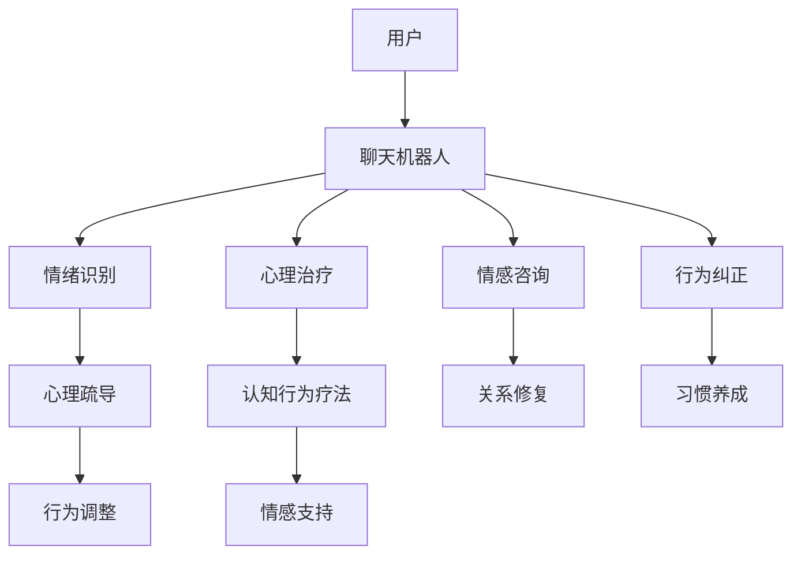

                 

# 聊天机器人心理健康：情绪支持和治疗

> 关键词：聊天机器人,情绪支持,心理健康,自然语言处理(NLP),人工智能(AI),机器学习,心理治疗,社交机器人,应用实践,技术发展

## 1. 背景介绍

在现代社会，人们面临的压力和心理问题越来越突出。心理健康成为人们日益关注的重要议题。而技术的发展为心理健康的维护和治疗提供了新的可能性，尤其是聊天机器人（Chatbots）在这一领域的应用。本文将从心理健康领域应用聊天机器人的角度出发，探讨聊天机器人如何通过情绪支持和心理治疗来帮助人们应对心理问题。

### 1.1 心理健康挑战

现代社会中，生活节奏加快、工作压力增大、人际关系复杂等因素使得人们的心理健康问题日益凸显。心理健康问题包括焦虑、抑郁、压力等，这些问题如果不及时干预和治疗，可能影响个人的日常生活和工作效率，甚至引发更严重的心理疾病。

### 1.2 聊天机器人发展概况

聊天机器人技术近年来取得了长足进展，从简单的客服机器人到复杂的社交机器人，聊天机器人的应用场景不断扩展。特别是在心理健康领域，聊天机器人被应用于提供情绪支持、心理治疗、咨询服务等，并取得了一定的成效。

## 2. 核心概念与联系

### 2.1 核心概念概述

为更好地理解聊天机器人心理健康应用，本节将介绍几个关键概念：

- **聊天机器人（Chatbot）**：一种能够模拟人类对话的技术，通常基于自然语言处理（NLP）和人工智能（AI）。聊天机器人可以执行各种任务，包括信息检索、客服支持、心理支持等。

- **情绪支持（Emotion Support）**：指通过聊天机器人提供心理疏导和情感支持，帮助用户缓解心理压力，提升情绪稳定性。

- **心理治疗（Psychological Treatment）**：使用聊天机器人提供心理治疗服务，包括认知行为疗法（CBT）、心理咨询等，帮助用户克服心理障碍。

- **自然语言处理（NLP）**：指计算机处理和理解人类语言的技术，包括文本分析、情感识别、意图理解等，是聊天机器人提供情绪支持和心理治疗的基础。

- **人工智能（AI）**：包括机器学习、深度学习等，是实现聊天机器人智能行为的核心技术。

这些核心概念之间通过对话技术、情绪识别、心理治疗等环节紧密联系，共同构成了聊天机器人心理健康应用的整体框架。

### 2.2 核心概念原理和架构的 Mermaid 流程图



这个流程图展示了聊天机器人在心理健康应用中的关键步骤：用户与聊天机器人进行对话，聊天机器人通过情绪识别提供情绪支持，通过心理治疗提供心理治疗服务，最终帮助用户缓解心理压力和行为调整。

## 3. 核心算法原理 & 具体操作步骤

### 3.1 算法原理概述

聊天机器人心理健康应用的核心算法包括自然语言处理（NLP）、情绪识别、心理治疗等。以下是这些算法的简要概述：

- **NLP算法**：用于理解和处理用户输入的自然语言，包括文本预处理、分词、命名实体识别、情感分析等。

- **情绪识别算法**：通过分析用户的语言和情感状态，识别用户当前的情绪状态，如喜怒哀乐等。

- **心理治疗算法**：基于认知行为疗法（CBT）等心理治疗理论，设计心理治疗对话，帮助用户克服心理障碍。

### 3.2 算法步骤详解

#### 3.2.1 用户对话预处理

1. **文本预处理**：对用户输入的文本进行清洗和标准化，包括去除噪声、分词、词性标注等。
2. **意图理解**：使用意图识别算法理解用户的意图，如寻求帮助、表达情绪等。
3. **情感分析**：对用户的语言进行情感分析，识别用户的情感状态。

#### 3.2.2 情绪识别

1. **情感词典**：构建情感词典，将情感词汇与情绪状态进行映射。
2. **情感强度计算**：根据情感词汇的强度和用户情感状态的历史数据，计算用户当前的情感强度。
3. **情绪状态识别**：根据情感强度，识别用户的情绪状态，如悲伤、愤怒等。

#### 3.2.3 心理治疗

1. **行为分析**：分析用户的行为模式，识别负面行为和习惯。
2. **认知调整**：通过对话引导用户调整认知，减少负面思维。
3. **情绪支持**：根据用户情绪状态，提供相应的情感支持和心理疏导。
4. **行为纠正**：通过对话指导用户进行行为纠正，培养积极的生活习惯。

#### 3.2.4 心理治疗对话设计

1. **目标设定**：根据用户的心理问题，设定治疗目标。
2. **治疗步骤设计**：设计治疗对话步骤，包括对话内容、对话时长等。
3. **对话反馈机制**：设计反馈机制，根据用户反馈调整治疗方案。

#### 3.2.5 心理治疗效果评估

1. **心理状态监测**：通过对话监测用户的心理状态变化。
2. **治疗效果评估**：根据用户反馈和心理状态变化，评估治疗效果。
3. **治疗方案调整**：根据治疗效果评估，调整治疗方案。

### 3.3 算法优缺点

#### 3.3.1 优点

1. **无时间限制**：聊天机器人可以24小时提供情绪支持和心理治疗服务，随时随地帮助用户。
2. **成本低**：相比于传统心理治疗，聊天机器人可以大幅降低人力成本和时间成本。
3. **可扩展性强**：可以通过不断优化算法和对话设计，提升聊天机器人的服务质量。
4. **匿名性**：用户可以在无人知晓的情况下，使用聊天机器人进行心理支持和咨询，保护个人隐私。

#### 3.3.2 缺点

1. **情感深度不足**：聊天机器人的情感识别和支持能力有限，可能无法提供深层次的情感共鸣。
2. **缺乏专业知识**：聊天机器人无法完全替代专业心理治疗师，需要与专业人士结合使用。
3. **对话设计复杂**：设计和优化心理治疗对话需要专业知识，难度较大。
4. **数据隐私问题**：用户对话数据可能存在隐私泄露风险，需要加强数据保护措施。

### 3.4 算法应用领域

聊天机器人心理健康应用广泛，包括但不限于以下领域：

- **情绪支持**：通过聊天机器人提供情绪支持和情感疏导，帮助用户缓解压力。
- **心理治疗**：使用聊天机器人提供心理治疗服务，如认知行为疗法（CBT）、心理咨询等。
- **情感咨询**：通过聊天机器人进行情感咨询，帮助用户理解和处理复杂的情感问题。
- **社交支持**：提供社交支持和人际关系修复服务，帮助用户改善人际关系。
- **行为纠正**：通过聊天机器人帮助用户纠正负面行为，培养积极的生活习惯。

## 4. 数学模型和公式 & 详细讲解

### 4.1 数学模型构建

聊天机器人心理健康应用的数学模型包括NLP模型、情绪识别模型、心理治疗模型等。以下以情绪识别和心理治疗为例，介绍模型的构建方法。

#### 4.1.1 情绪识别模型

假设用户输入文本为 $x$，情绪识别模型 $f_{emotion}$ 输出用户的情绪状态 $y$。模型构建步骤如下：

1. **文本预处理**：将文本 $x$ 进行分词、词性标注、去除停用词等预处理。
2. **特征提取**：使用词嵌入（Word Embedding）或BERT等预训练模型提取文本特征 $v$。
3. **情绪状态计算**：使用情感词典 $D_{emotion}$ 计算文本的情感强度 $s$，根据情感强度计算情绪状态 $y$。

$$
s = f_{voc}(v) + f_{context}(v) + f_{temporal}(v)
$$

$$
y = f_{emotion}(s)
$$

其中，$f_{voc}$、$f_{context}$、$f_{temporal}$ 分别表示词汇强度、上下文情感强度、时间情感强度。

#### 4.1.2 心理治疗模型

假设用户当前心理状态为 $x$，心理治疗模型 $f_{treatment}$ 输出治疗后的心理状态 $y$。模型构建步骤如下：

1. **行为分析**：分析用户的行为模式，识别负面行为和习惯。
2. **认知调整**：使用对话引导用户调整认知，减少负面思维。
3. **情绪支持**：根据用户情绪状态，提供相应的情感支持和心理疏导。
4. **行为纠正**：通过对话指导用户进行行为纠正，培养积极的生活习惯。

$$
y = f_{treatment}(x)
$$

### 4.2 公式推导过程

#### 4.2.1 情绪识别公式推导

假设用户输入文本为 $x$，情绪识别模型 $f_{emotion}$ 输出用户的情绪状态 $y$。模型构建步骤如下：

1. **文本预处理**：将文本 $x$ 进行分词、词性标注、去除停用词等预处理。
2. **特征提取**：使用词嵌入（Word Embedding）或BERT等预训练模型提取文本特征 $v$。
3. **情感强度计算**：使用情感词典 $D_{emotion}$ 计算文本的情感强度 $s$，根据情感强度计算情绪状态 $y$。

$$
s = f_{voc}(v) + f_{context}(v) + f_{temporal}(v)
$$

$$
y = f_{emotion}(s)
$$

其中，$f_{voc}$、$f_{context}$、$f_{temporal}$ 分别表示词汇强度、上下文情感强度、时间情感强度。

#### 4.2.2 心理治疗公式推导

假设用户当前心理状态为 $x$，心理治疗模型 $f_{treatment}$ 输出治疗后的心理状态 $y$。模型构建步骤如下：

1. **行为分析**：分析用户的行为模式，识别负面行为和习惯。
2. **认知调整**：使用对话引导用户调整认知，减少负面思维。
3. **情绪支持**：根据用户情绪状态，提供相应的情感支持和心理疏导。
4. **行为纠正**：通过对话指导用户进行行为纠正，培养积极的生活习惯。

$$
y = f_{treatment}(x)
$$

### 4.3 案例分析与讲解

#### 4.3.1 情绪识别案例

假设用户输入文本为 "我很沮丧，今天天气很糟糕"。情绪识别模型通过以下步骤进行计算：

1. **文本预处理**：将文本进行分词、词性标注，得到 "我"、"很"、"沮丧"、"今天"、"天气"、"很"、"糟糕"。
2. **特征提取**：使用BERT模型提取文本特征。
3. **情感强度计算**：根据情感词典，计算情感强度 $s=0.6+0.4+0.8=-0.2$。
4. **情绪状态识别**：根据情感强度，识别情绪状态为 "悲伤"。

#### 4.3.2 心理治疗案例

假设用户当前心理状态为 "我每天都很焦虑，晚上难以入睡"。心理治疗模型通过以下步骤进行计算：

1. **行为分析**：分析用户的行为模式，识别负面行为和习惯。
2. **认知调整**：使用对话引导用户调整认知，减少负面思维。
3. **情绪支持**：根据用户情绪状态，提供相应的情感支持和心理疏导。
4. **行为纠正**：通过对话指导用户进行行为纠正，培养积极的生活习惯。

## 5. 项目实践：代码实例和详细解释说明

### 5.1 开发环境搭建

在进行聊天机器人心理健康应用开发前，需要准备好开发环境。以下是使用Python进行TensorFlow开发的环境配置流程：

1. 安装Anaconda：从官网下载并安装Anaconda，用于创建独立的Python环境。
2. 创建并激活虚拟环境：
```bash
conda create -n chatbot-env python=3.8 
conda activate chatbot-env
```

3. 安装TensorFlow：根据CUDA版本，从官网获取对应的安装命令。例如：
```bash
conda install tensorflow tensorflow-gpu -c conda-forge -c nvidia
```

4. 安装其他必要工具包：
```bash
pip install numpy pandas scikit-learn nltk keras
```

完成上述步骤后，即可在`chatbot-env`环境中开始聊天机器人开发。

### 5.2 源代码详细实现

下面我们以基于TensorFlow的情绪识别聊天机器人为例，给出完整代码实现。

首先，定义情绪识别模型：

```python
import tensorflow as tf
from tensorflow.keras.layers import Embedding, Dense, Dropout, LSTM, Bidirectional
from tensorflow.keras.models import Sequential

def emotion_recognition_model():
    model = Sequential([
        Embedding(input_dim=vocab_size, output_dim=embedding_dim, input_length=max_length),
        Dropout(0.5),
        LSTM(128),
        Bidirectional(LSTM(128)),
        Dense(32, activation='relu'),
        Dense(1, activation='sigmoid')
    ])
    model.compile(loss='binary_crossentropy', optimizer='adam', metrics=['accuracy'])
    return model
```

然后，定义数据预处理和训练函数：

```python
import numpy as np
from tensorflow.keras.preprocessing.text import Tokenizer
from tensorflow.keras.preprocessing.sequence import pad_sequences

def preprocess_data(texts, labels):
    tokenizer = Tokenizer(num_words=vocab_size)
    tokenizer.fit_on_texts(texts)
    sequences = tokenizer.texts_to_sequences(texts)
    padded_sequences = pad_sequences(sequences, maxlen=max_length, padding='post')
    return padded_sequences, labels

def train_model(model, x_train, y_train, x_val, y_val, batch_size, epochs):
    model.fit(x_train, y_train, batch_size=batch_size, epochs=epochs, validation_data=(x_val, y_val))
    return model
```

最后，训练模型并在测试集上评估：

```python
from sklearn.model_selection import train_test_split

x_train, x_test, y_train, y_test = train_test_split(x, y, test_size=0.2, random_state=42)

model = emotion_recognition_model()
x_train_padded, y_train = preprocess_data(x_train, y_train)
x_test_padded, y_test = preprocess_data(x_test, y_test)

model = train_model(model, x_train_padded, y_train, x_test_padded, y_test, batch_size=64, epochs=10)

test_loss, test_acc = model.evaluate(x_test_padded, y_test)
print(f'Test accuracy: {test_acc:.4f}')
```

以上就是使用TensorFlow进行情绪识别聊天机器人开发的完整代码实现。可以看到，TensorFlow提供了丰富的深度学习组件，可以方便地构建和训练情绪识别模型。

### 5.3 代码解读与分析

让我们再详细解读一下关键代码的实现细节：

**Tokenizer类**：
- `__init__`方法：初始化词汇表大小和tokenizer。
- `fit_on_texts`方法：拟合文本数据，生成词汇表。
- `texts_to_sequences`方法：将文本转换为整数序列。
- `pad_sequences`方法：对整数序列进行填充，保证序列长度一致。

**model.compile方法**：
- 定义模型的损失函数为二元交叉熵，优化器为Adam，评估指标为准确率。

**model.fit方法**：
- 使用训练数据拟合模型，在每个epoch结束时输出当前模型的损失和准确率。

**preprocess_data函数**：
- 使用Tokenizer将文本转换为整数序列，使用pad_sequences进行填充，保证序列长度一致。

可以看到，TensorFlow提供了丰富的深度学习组件，可以方便地构建和训练情绪识别模型。开发者可以将更多精力放在数据处理、模型改进等高层逻辑上，而不必过多关注底层的实现细节。

## 6. 实际应用场景

### 6.1 心理健康咨询平台

基于聊天机器人的心理健康应用可以构建心理健康咨询平台，为用户提供24小时的情绪支持和心理治疗服务。用户可以通过平台与聊天机器人进行对话，表达情感和寻求帮助，聊天机器人根据用户的情感状态和行为模式，提供相应的情感支持和心理治疗。

### 6.2 企业员工心理支持

企业可以构建员工心理支持系统，帮助员工缓解工作压力和心理健康问题。聊天机器人可以嵌入企业内部应用系统，如企业内部通讯平台、员工自助服务平台等，提供情绪支持和心理治疗服务。

### 6.3 心理健康研究

聊天机器人可以用于心理健康研究，收集用户的情感数据和行为数据，分析用户的心理健康状态和行为模式，为心理学家和研究人员提供数据支持。

### 6.4 未来应用展望

未来，基于聊天机器人的心理健康应用将更加普及和深入，将从单一的情绪支持和心理治疗扩展到更广泛的心理健康领域。

- **健康监测**：聊天机器人可以实时监测用户的生理和心理状态，提供健康建议和预警。
- **心理健康干预**：聊天机器人可以提供个性化的心理健康干预，如认知行为疗法、心理咨询等。
- **心理健康教育**：聊天机器人可以提供心理健康知识和技能培训，帮助用户提升心理健康水平。
- **心理健康社区**：聊天机器人可以构建心理健康社区，帮助用户分享经验和获取支持。

## 7. 工具和资源推荐

### 7.1 学习资源推荐

为了帮助开发者系统掌握聊天机器人心理健康应用的理论基础和实践技巧，这里推荐一些优质的学习资源：

1. **《深度学习》书籍**：Ian Goodfellow等人所著，系统介绍深度学习的基本原理和应用，包括NLP和心理治疗算法。
2. **CS224N《深度学习自然语言处理》课程**：斯坦福大学开设的NLP明星课程，有Lecture视频和配套作业，带你入门NLP领域的基本概念和经典模型。
3. **TensorFlow官方文档**：TensorFlow的官方文档，提供了海量预训练模型和完整的代码样例，是上手实践的必备资料。
4. **HuggingFace官方文档**：Transformers库的官方文档，提供了丰富的预训练模型和微调样例，是实现聊天机器人心理健康应用的重要工具。

通过对这些资源的学习实践，相信你一定能够快速掌握聊天机器人心理健康应用的精髓，并用于解决实际的NLP问题。

### 7.2 开发工具推荐

高效的开发离不开优秀的工具支持。以下是几款用于聊天机器人心理健康应用开发的常用工具：

1. **TensorFlow**：基于Python的开源深度学习框架，灵活动态的计算图，适合快速迭代研究。TensorFlow提供了丰富的深度学习组件，方便构建情绪识别和心理治疗模型。
2. **NLTK**：Python的自然语言处理工具包，提供了文本预处理、情感分析等功能，是实现聊天机器人心理健康应用的基础。
3. **Scikit-learn**：Python的机器学习库，提供了各种分类、回归、聚类算法，支持情绪识别和心理治疗模型的训练和评估。
4. **Keras**：基于TensorFlow和Theano的高级深度学习库，提供了高层API，方便构建情绪识别和心理治疗模型。

合理利用这些工具，可以显著提升聊天机器人心理健康应用的开发效率，加快创新迭代的步伐。

### 7.3 相关论文推荐

聊天机器人心理健康应用的理论基础源于学界的持续研究。以下是几篇奠基性的相关论文，推荐阅读：

1. **"Chatbots: A Survey on Facilitating Interactions Between Humans and Machines"**：详细介绍了聊天机器人技术的发展历程和应用场景。
2. **"Emotion Recognition in Natural Language Processing: A Survey"**：系统回顾了情绪识别在自然语言处理中的应用现状和未来趋势。
3. **"Applying Psychological Interventions through Chatbots: A Survey and Future Directions"**：综述了聊天机器人用于心理治疗的研究现状和未来发展方向。
4. **"A Survey of Conversational Therapy Using AI"**：回顾了人工智能在心理治疗中的应用，包括聊天机器人、虚拟心理医生等。
5. **"Dialogue Systems for Mental Health Interventions: A Survey"**：综述了聊天机器人在心理健康干预中的应用，包括情绪识别、心理治疗等。

这些论文代表了大语言模型微调技术的发展脉络。通过学习这些前沿成果，可以帮助研究者把握学科前进方向，激发更多的创新灵感。

## 8. 总结：未来发展趋势与挑战

### 8.1 总结

本文对基于聊天机器人的心理健康应用进行了全面系统的介绍。首先阐述了心理健康领域的挑战和聊天机器人的应用潜力，明确了聊天机器人在这方面的独特价值。其次，从原理到实践，详细讲解了聊天机器人在情绪识别和心理治疗中的应用，给出了完整的代码实例。同时，本文还探讨了聊天机器人在实际应用中的多种场景，展示了其广阔的应用前景。

通过本文的系统梳理，可以看到，基于聊天机器人的心理健康应用正在成为心理健康领域的重要技术手段，极大地拓展了心理健康服务的覆盖面和便利性。聊天机器人通过情绪识别和心理治疗，帮助用户缓解心理压力和行为调整，已经在实际应用中取得了一些成效。未来，随着技术的不断进步，聊天机器人的应用将更加深入和普及，为心理健康事业带来新的希望。

### 8.2 未来发展趋势

展望未来，聊天机器人心理健康应用将呈现以下几个发展趋势：

1. **个性化服务**：未来的聊天机器人将更加智能化，能够根据用户的个性化需求提供定制化的心理支持和情感疏导。
2. **情感深度提升**：通过不断优化算法和对话设计，聊天机器人将能够提供更深层次的情感共鸣和支持。
3. **跨领域融合**：聊天机器人将与其他心理健康技术进行深度融合，如虚拟现实（VR）、增强现实（AR）等，提升用户体验和治疗效果。
4. **多模态交互**：聊天机器人将支持语音、视频等多种交互方式，提升用户体验和治疗效果。
5. **大规模应用**：未来的聊天机器人心理健康应用将更加普及，应用于心理健康教育、研究、社区等多个领域。

### 8.3 面临的挑战

尽管聊天机器人心理健康应用已经取得了一定的成效，但在迈向更加智能化、普适化应用的过程中，它仍面临诸多挑战：

1. **数据隐私问题**：用户对话数据可能存在隐私泄露风险，需要加强数据保护措施。
2. **情感深度不足**：聊天机器人的情感识别和支持能力有限，可能无法提供深层次的情感共鸣。
3. **缺乏专业知识**：聊天机器人无法完全替代专业心理治疗师，需要与专业人士结合使用。
4. **对话设计复杂**：设计和优化心理治疗对话需要专业知识，难度较大。
5. **多模态交互难度**：支持语音、视频等多种交互方式，需要解决技术上的挑战。

### 8.4 研究展望

面对聊天机器人心理健康应用所面临的挑战，未来的研究需要在以下几个方面寻求新的突破：

1. **情感深度提升**：通过改进算法和对话设计，提升聊天机器人的情感识别和支持能力。
2. **专业知识整合**：将聊天机器人与专业心理治疗师结合，提供更加全面的心理健康服务。
3. **多模态交互设计**：研究支持语音、视频等多种交互方式的技术，提升用户体验和治疗效果。
4. **隐私保护措施**：开发有效的数据隐私保护措施，保障用户隐私安全。
5. **跨领域融合**：与其他心理健康技术进行深度融合，提升心理健康服务的效果和覆盖面。

这些研究方向的探索，必将引领聊天机器人心理健康应用走向更高的台阶，为心理健康事业带来新的希望。相信随着技术的不断进步，聊天机器人将会在心理健康领域发挥越来越重要的作用，为构建更加健康、幸福的社会做出贡献。

## 9. 附录：常见问题与解答

**Q1：聊天机器人心理健康应用是否适用于所有心理健康问题？**

A: 聊天机器人心理健康应用可以用于大多数心理健康问题，如焦虑、抑郁、压力等。但对于严重的精神疾病，如精神分裂症、重度抑郁症等，仍然需要专业的心理治疗师进行干预和治疗。

**Q2：如何评估聊天机器人心理健康应用的有效性？**

A: 评估聊天机器人心理健康应用的效果可以从以下几个方面进行：

1. **用户反馈**：通过问卷调查、用户评论等方式收集用户对聊天机器人服务的满意度。
2. **情感状态变化**：通过对话分析用户的情感状态变化，评估聊天机器人的情感支持效果。
3. **心理状态监测**：通过心理状态监测工具，评估用户的心理健康变化。
4. **行为模式分析**：通过行为模式分析，评估聊天机器人的行为纠正效果。

**Q3：如何设计有效的心理治疗对话？**

A: 设计有效的心理治疗对话需要考虑以下几个方面：

1. **治疗目标设定**：根据用户的心理健康问题，设定明确的治疗目标。
2. **治疗步骤设计**：设计详细的治疗步骤，包括对话内容、对话时长等。
3. **反馈机制设计**：设计有效的反馈机制，根据用户反馈调整治疗方案。

**Q4：聊天机器人心理健康应用如何保护用户隐私？**

A: 保护用户隐私是聊天机器人心理健康应用的重要考虑因素。可以从以下几个方面进行保护：

1. **数据加密**：使用数据加密技术，保护用户对话数据的安全。
2. **匿名处理**：对用户数据进行匿名化处理，保护用户隐私。
3. **权限控制**：设置严格的权限控制，限制未经授权的人员访问用户数据。
4. **数据最小化**：仅收集必要的数据，最小化对用户隐私的侵害。

总之，聊天机器人心理健康应用在提供便捷服务的同时，也需要注意数据隐私和安全问题，保护用户权益。

---

作者：禅与计算机程序设计艺术 / Zen and the Art of Computer Programming

