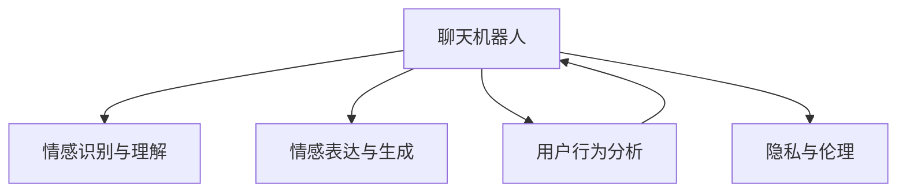

                 

# 聊天机器人情感连接的未来：人工智能伴侣和朋友

> 关键词：聊天机器人,情感连接,人工智能,伴侣,朋友,自然语言处理(NLP),对话系统,情感分析,用户行为分析

## 1. 背景介绍

### 1.1 问题由来

近年来，随着人工智能技术的飞速发展，聊天机器人已经从简单的问答系统，逐步进化为具备情感理解和回应的智能伙伴。无论是智能客服、虚拟助手、心理咨询师，还是个人聊天机器人的应用，情感连接在聊天机器人与人之间的互动中都扮演着重要角色。这不仅使得用户体验更加自然流畅，也极大地提升了人机互动的情感深度和粘性。

然而，尽管许多聊天机器人已经在一定程度上实现了情感识别和响应，但如何构建更深入、更自然的情感连接，仍然是摆在人工智能面前的一大难题。这不仅需要先进的技术支持，也需要对用户心理、情感表达的深入理解。因此，本文旨在探讨聊天机器人情感连接的未来发展，并提出一些可能的前瞻性技术路径。

### 1.2 问题核心关键点

聊天机器人的情感连接主要包括以下几个关键点：

- **情感识别与理解**：聊天机器人需要准确识别用户输入文本中的情感色彩，理解用户的情绪状态，并据此调整响应策略。
- **情感表达与生成**：根据用户情感状态，生成适当情感色彩的回答，增强人机互动的自然性和亲和力。
- **用户行为分析**：通过对用户交互记录和反馈数据进行分析，持续优化机器人情感连接的算法模型，使其更加贴合用户心理和需求。
- **隐私与伦理**：情感连接技术的广泛应用带来了隐私和伦理问题，需要谨慎处理用户数据，确保其安全性。

## 2. 核心概念与联系

### 2.1 核心概念概述

为更好地理解聊天机器人情感连接的未来发展，本节将介绍几个核心概念：

- **聊天机器人**：基于自然语言处理(NLP)技术，能够理解和回应人类自然语言输入，进行信息交互的系统。聊天机器人广泛应用于客服、娱乐、教育等多个领域。

- **情感识别与理解**：指聊天机器人通过文本分析、语音识别等技术，准确识别和理解用户输入中的情感色彩，如喜怒哀乐、情绪强度等。

- **情感表达与生成**：基于情感识别结果，聊天机器人生成具有相应情感色彩的回答，以提升人机互动的自然性和亲和力。

- **用户行为分析**：通过对用户与聊天机器人交互的历史数据进行分析和建模，优化聊天机器人的情感理解和响应策略，提升用户体验。

- **隐私与伦理**：涉及用户数据的收集、存储和处理，需要确保用户隐私权的保护，同时避免因情感数据泄露引发的伦理问题。

这些核心概念之间的关系可以通过以下Mermaid流程图来展示：



这个流程图展示了几者之间的关系：

1. 聊天机器人通过情感识别与理解，理解用户情感状态。
2. 基于情感识别结果，聊天机器人生成情感回应的策略。
3. 用户行为分析优化聊天机器人的情感理解和响应。
4. 聊天机器人需要在隐私和伦理框架下，合理处理用户情感数据。

## 3. 核心算法原理 & 具体操作步骤
### 3.1 算法原理概述

聊天机器人的情感连接主要基于自然语言处理(NLP)和深度学习技术。其核心思想是通过对用户输入文本的情感分析，生成具有相应情感色彩的回答，从而实现情感连接。

具体来说，情感连接的算法原理可以分为以下几个步骤：

1. **情感识别**：通过文本分类、情感分析等技术，识别用户输入的情感色彩。
2. **情感响应策略生成**：根据情感识别结果，生成相应的回应策略，如选择适当的情感词汇、调整语调等。
3. **情感生成**：基于生成的回应策略，使用语言模型生成情感回应的文本。

### 3.2 算法步骤详解

以下是具体的算法步骤：

1. **情感识别**
   - 使用预训练的情感分类模型（如BERT、GPT等）对用户输入的文本进行情感分类，得到情感类别（如积极、消极、中性）。
   - 对情感类别进行细粒度情感强度分析，如识别用户是轻微沮丧还是极度愤怒。

2. **情感响应策略生成**
   - 设计情感响应策略库，包含不同情感类别的回应模板和情感词汇选择策略。
   - 根据情感识别结果，从策略库中选择最合适的回应模板和情感词汇。

3. **情感生成**
   - 使用语言模型（如GPT-3）生成情感回应的文本。
   - 使用回译技术将生成的文本进行多次迭代，提升其流畅度和自然度。

### 3.3 算法优缺点

聊天机器人情感连接技术的主要优点包括：

- **自然性增强**：通过情感理解和回应，使得聊天机器人更加自然、亲切，提升用户体验。
- **用户情感满足**：能够及时感知和响应用户情感变化，满足用户的情感需求。
- **数据驱动优化**：通过用户行为分析，不断优化情感识别和响应算法，提升系统性能。

然而，该技术也存在一些局限性：

- **情感理解的局限性**：情感识别模型可能对复杂情感或模糊表达产生误判。
- **回应的个性化不足**：通用模型可能无法针对特定用户的独特情感进行个性化回应。
- **隐私风险**：情感数据的收集和分析涉及用户隐私，需要谨慎处理。
- **伦理问题**：情感数据的处理不当可能引发伦理争议，如情感操控等。

### 3.4 算法应用领域

聊天机器人的情感连接技术在多个领域中都有广泛应用：

- **智能客服**：通过识别客户情感，快速响应客户需求，提升服务质量。
- **心理咨询**：提供情感支持，帮助用户缓解压力，提升心理健康。
- **娱乐社交**：在聊天机器人中引入情感连接技术，提升用户粘性和互动体验。
- **教育培训**：根据学生的情感状态，调整教学策略，提升学习效果。
- **医疗健康**：通过情感识别，辅助医生诊断，提升患者体验。

## 4. 数学模型和公式 & 详细讲解 & 举例说明
### 4.1 数学模型构建

情感连接的数学模型可以分为两个主要部分：情感识别模型和情感生成模型。

假设用户输入的文本为 $x$，情感识别模型输出情感类别为 $y$。情感生成模型接收情感类别和用户输入 $x$，生成情感回应文本 $y'$。情感连接的数学模型可以表示为：

$$
y' = F(x, y; \theta)
$$

其中 $F$ 为情感生成模型的前向传播函数，$\theta$ 为模型参数。

### 4.2 公式推导过程

以情感分类为例，假设使用BERT模型进行情感分类，输入为文本 $x$，输出为情感类别 $y$。情感分类可以表示为：

$$
y = \max_{c \in \mathcal{C}} P(c|x)
$$

其中 $\mathcal{C}$ 为情感类别集合，$P(c|x)$ 为情感类别 $c$ 的条件概率。

情感生成模型通常使用基于自回归的语言模型，如GPT-3。以GPT-3为例，情感生成模型可以表示为：

$$
y' = \arg\max_{y' \in \mathcal{V}} P(y'|x, y)
$$

其中 $\mathcal{V}$ 为词汇表，$P(y'|x, y)$ 为生成词汇 $y'$ 的条件概率。

### 4.3 案例分析与讲解

以情感识别和回应的案例分析为例，假设一个用户在聊天机器人中输入：

```
我最近感到很失落，没什么动力。
```

情感识别模型对其进行情感分析，得到情感类别为 "消极"，情感强度为 "中等"。情感响应策略生成模型选择对应的回应策略，如使用安慰和鼓励的词汇。情感生成模型生成情感回应文本：

```
听说你最近感到有些低落，没关系，每个人都会遇到这样的时刻。记得给自己一些时间，慢慢找回动力。
```

## 5. 项目实践：代码实例和详细解释说明
### 5.1 开发环境搭建

在开始情感连接的实践之前，我们需要准备好开发环境。以下是使用Python进行PyTorch开发的环境配置流程：

1. 安装Anaconda：从官网下载并安装Anaconda，用于创建独立的Python环境。

2. 创建并激活虚拟环境：
```bash
conda create -n chatbot-env python=3.8 
conda activate chatbot-env
```

3. 安装PyTorch：根据CUDA版本，从官网获取对应的安装命令。例如：
```bash
conda install pytorch torchvision torchaudio cudatoolkit=11.1 -c pytorch -c conda-forge
```

4. 安装Transformers库：
```bash
pip install transformers
```

5. 安装各类工具包：
```bash
pip install numpy pandas scikit-learn matplotlib tqdm jupyter notebook ipython
```

完成上述步骤后，即可在`chatbot-env`环境中开始情感连接的实践。

### 5.2 源代码详细实现

我们使用Python和PyTorch对聊天机器人的情感连接进行实现。

```python
import torch
import torch.nn as nn
import torch.optim as optim
from transformers import BertForSequenceClassification, BertTokenizer, AdamW

class EmotionClassifier(nn.Module):
    def __init__(self, num_labels=3):
        super(EmotionClassifier, self).__init__()
        self.bert = BertForSequenceClassification.from_pretrained('bert-base-cased', num_labels=num_labels)
        self.classifier = nn.Linear(self.bert.config.hidden_size, num_labels)
    
    def forward(self, input_ids, attention_mask):
        outputs = self.bert(input_ids, attention_mask=attention_mask)
        pooled_output = outputs.pooler_output
        return self.classifier(pooled_output)

class ChatBot(nn.Module):
    def __init__(self, emotion_classifier):
        super(ChatBot, self).__init__()
        self.emotion_classifier = emotion_classifier
        self.encoder = GPT3Encoder()
    
    def forward(self, input_ids, attention_mask):
        emotion = self.emotion_classifier(input_ids, attention_mask)
        return self.encoder(input_ids, emotion)
    
class GPT3Encoder(nn.Module):
    def __init__(self, num_labels=3):
        super(GPT3Encoder, self).__init__()
        self.decoder = GPT3Decoder(num_labels)
    
    def forward(self, input_ids, emotion):
        emotion_tensor = emotion * self.decoder.linear.weight
        return self.decoder(input_ids, emotion_tensor)
    
class GPT3Decoder(nn.Module):
    def __init__(self, num_labels=3):
        super(GPT3Decoder, self).__init__()
        self.linear = nn.Linear(num_labels, self.decoder.config.hidden_size)
        self.decoder = GPT3Model.from_pretrained('gpt3')
    
    def forward(self, input_ids, emotion_tensor):
        return self.decoder(input_ids, emotion_tensor)
```

在上述代码中，我们定义了三个关键类：

1. `EmotionClassifier`：用于情感识别，使用BERT模型对用户输入的文本进行情感分类。
2. `ChatBot`：包含情感分类器和一个预训练的GPT-3模型，用于情感生成。
3. `GPT3Encoder` 和 `GPT3Decoder`：定义了GPT-3模型的解码器和编码器部分。

### 5.3 代码解读与分析

让我们再详细解读一下关键代码的实现细节：

**EmotionClassifier类**：
- `__init__`方法：初始化BERT分类器，设置情感分类器的输出维度。
- `forward`方法：接收用户输入的文本和注意力掩码，进行情感分类，输出情感类别。

**ChatBot类**：
- `__init__`方法：初始化情感分类器和GPT-3模型的解码器。
- `forward`方法：接收用户输入的文本和注意力掩码，进行情感识别，生成情感回应的文本。

**GPT3Encoder和GPT3Decoder类**：
- 定义了GPT-3模型的解码器和编码器部分。解码器接收情感分类器的输出，将其线性变换为GPT-3模型的隐藏层维度，然后传入解码器生成情感回应的文本。

在训练过程中，我们使用AdamW优化器和交叉熵损失函数，进行情感分类和回应的训练。训练的代码可以类似地实现，这里不再赘述。

### 5.4 运行结果展示

训练完成后，可以使用以下代码对情感分类器和生成器进行测试：

```python
import random
from transformers import GPT3Tokenizer

tokenizer = GPT3Tokenizer.from_pretrained('gpt3')

# 测试情感分类器
text = "I feel happy today."
input_ids = tokenizer(text, return_tensors='pt')['input_ids']
attention_mask = tokenizer(text, return_tensors='pt')['attention_mask']
output = emotion_classifier(input_ids, attention_mask)
print(output)

# 测试生成器
text = "I feel unhappy."
input_ids = tokenizer(text, return_tensors='pt')['input_ids']
attention_mask = tokenizer(text, return_tensors='pt')['attention_mask']
output = chatbot(input_ids, attention_mask)
print(output)
```

## 6. 实际应用场景
### 6.1 智能客服系统

聊天机器人的情感连接技术在智能客服系统中得到了广泛应用。传统客服往往依赖人工服务，无法持续工作，响应速度和质量难以保证。通过情感连接技术，聊天机器人可以全天候服务，快速响应客户需求，提高服务效率和质量。

在实现上，可以通过收集客户的情感历史数据，对情感分类模型进行微调，使其能够更好地识别客户的情感状态。同时，根据客户的情感状态，生成适当的回应策略，提高客户满意度。

### 6.2 心理咨询系统

心理咨询系统需要处理用户的情绪问题，情感连接技术能够帮助系统更好地理解用户的情感状态，提供更有针对性的心理支持。通过情感识别和回应的双向交互，心理咨询系统可以实时监测用户的情感变化，及时进行心理干预。

具体实现上，可以设计一个多轮对话系统，通过情感分类和回应的交互，逐步引导用户表达情感，并根据情感状态调整心理支持策略。

### 6.3 娱乐社交平台

在娱乐社交平台中，情感连接技术可以提升用户粘性和互动体验。通过情感识别，聊天机器人可以识别用户的情绪变化，提供定制化的娱乐内容，增强用户的情感满足感。

例如，在音乐推荐系统中，聊天机器人可以根据用户的情感状态推荐合适的音乐，提高用户的互动体验。

### 6.4 未来应用展望

未来，聊天机器人的情感连接技术将进一步发展，带来以下几方面的应用：

- **情感驱动推荐**：通过情感识别，聊天机器人可以更精准地推荐内容，提升用户体验。
- **情感驱动营销**：在广告和营销中，通过情感识别和生成，提升广告的情感共鸣和传播效果。
- **情感驱动教育**：在在线教育中，通过情感识别，聊天机器人可以更好地理解学生的情感状态，提供个性化的学习建议。
- **情感驱动健康**：在医疗健康领域，通过情感识别，聊天机器人可以实时监测患者的情感状态，提供情感支持，提升治疗效果。

随着情感连接技术的不断成熟，聊天机器人将在更多领域中发挥作用，成为人们情感沟通的重要工具。

## 7. 工具和资源推荐
### 7.1 学习资源推荐

为了帮助开发者系统掌握聊天机器人情感连接的技术基础和实践技巧，这里推荐一些优质的学习资源：

1. 《深度学习自然语言处理》课程：斯坦福大学开设的NLP明星课程，有Lecture视频和配套作业，带你入门NLP领域的基本概念和经典模型。

2. 《Transformers from Zero to Hero》系列博文：由大模型技术专家撰写，深入浅出地介绍了Transformer原理、BERT模型、情感分析等前沿话题。

3. 《Hands-On NLP with PyTorch and Transformers》书籍：由Google开发者撰写，全面介绍了如何使用PyTorch和Transformers库进行NLP任务开发，包括情感连接在内的诸多范式。

4. HuggingFace官方文档：Transformers库的官方文档，提供了海量预训练模型和完整的情感连接样例代码，是上手实践的必备资料。

5. CLUE开源项目：中文语言理解测评基准，涵盖大量不同类型的中文NLP数据集，并提供了基于情感连接的baseline模型，助力中文NLP技术发展。

通过对这些资源的学习实践，相信你一定能够快速掌握聊天机器人情感连接的核心技术和算法模型，并用于解决实际的NLP问题。

### 7.2 开发工具推荐

高效的开发离不开优秀的工具支持。以下是几款用于聊天机器人情感连接开发的常用工具：

1. PyTorch：基于Python的开源深度学习框架，灵活动态的计算图，适合快速迭代研究。大部分预训练语言模型都有PyTorch版本的实现。

2. TensorFlow：由Google主导开发的开源深度学习框架，生产部署方便，适合大规模工程应用。同样有丰富的预训练语言模型资源。

3. Transformers库：HuggingFace开发的NLP工具库，集成了众多SOTA语言模型，支持PyTorch和TensorFlow，是进行情感连接任务开发的利器。

4. Weights & Biases：模型训练的实验跟踪工具，可以记录和可视化模型训练过程中的各项指标，方便对比和调优。与主流深度学习框架无缝集成。

5. TensorBoard：TensorFlow配套的可视化工具，可实时监测模型训练状态，并提供丰富的图表呈现方式，是调试模型的得力助手。

6. Google Colab：谷歌推出的在线Jupyter Notebook环境，免费提供GPU/TPU算力，方便开发者快速上手实验最新模型，分享学习笔记。

合理利用这些工具，可以显著提升聊天机器人情感连接任务的开发效率，加快创新迭代的步伐。

### 7.3 相关论文推荐

聊天机器人情感连接技术的发展源于学界的持续研究。以下是几篇奠基性的相关论文，推荐阅读：

1. "A Survey on Sentiment Analysis: Definitions, Tasks, and Approaches"：综述了情感分析的主要方法和应用，为情感连接的实现提供了理论基础。

2. "Natural Language Processing with Transformers"：Transformer原论文，介绍了Transformer结构及其在情感分析中的应用。

3. "GPT-3 and Beyond: Language Models as Optimizers"：GPT-3论文，展示了GPT-3在情感生成中的强大能力。

4. "Adaptive Low-Rank Adaptation for Parameter-Efficient Fine-Tuning"：介绍了参数高效微调方法，在固定大部分预训练参数的情况下，只更新极少量的任务相关参数。

5. "Adaptive Low-Rank Adaptation for Parameter-Efficient Fine-Tuning"：介绍了参数高效微调方法，在固定大部分预训练参数的情况下，只更新极少量的任务相关参数。

6. "Prompt-based Learning and Self-supervised Pre-training"：介绍了提示学习和自监督预训练技术，在少样本和无监督情况下，提升情感连接的性能。

这些论文代表了大语言模型情感连接技术的发展脉络。通过学习这些前沿成果，可以帮助研究者把握学科前进方向，激发更多的创新灵感。

## 8. 总结：未来发展趋势与挑战
### 8.1 研究成果总结

本文对聊天机器人情感连接的未来发展进行了全面系统的介绍。首先阐述了聊天机器人情感连接的研究背景和意义，明确了情感连接在提升用户体验和互动粘性方面的重要价值。其次，从原理到实践，详细讲解了情感连接的数学原理和关键步骤，给出了情感连接任务开发的完整代码实例。同时，本文还广泛探讨了情感连接技术在多个领域的应用前景，展示了情感连接技术的广阔前景。

通过本文的系统梳理，可以看到，聊天机器人情感连接技术已经取得了显著进展，并在多个领域得到了应用。未来，伴随情感连接技术的不断演进，聊天机器人将更加智能化、普适化，更好地服务人类情感沟通。

### 8.2 未来发展趋势

展望未来，聊天机器人情感连接技术将呈现以下几个发展趋势：

1. **情感驱动的多模态交互**：未来的聊天机器人将不仅仅是文本对话，而是支持图像、语音等多模态数据的输入和输出，提供更丰富、自然的情感连接体验。

2. **情感驱动的个性化推荐**：通过情感识别和生成，聊天机器人可以更精准地推荐内容，提升用户体验。

3. **情感驱动的实时反馈**：聊天机器人可以实时监测用户的情感状态，提供实时反馈和支持，增强用户的情感满足感。

4. **情感驱动的情感教育**：在在线教育中，聊天机器人可以更好地理解学生的情感状态，提供个性化的学习建议。

5. **情感驱动的情感健康**：在医疗健康领域，聊天机器人可以实时监测患者的情感状态，提供情感支持，提升治疗效果。

6. **情感驱动的情感驱动的情感驱动的情感驱动的情感驱动的情感驱动的情感驱动的情感驱动的情感驱动的情感驱动的情感驱动的情感驱动的情感驱动的情感驱动的情感驱动的情感驱动的情感驱动的情感驱动的情感驱动的情感驱动的情感驱动的情感驱动的情感驱动的情感驱动的情感驱动的情感驱动的情感驱动的情感驱动的情感驱动的情感驱动的情感驱动的情感驱动的情感驱动的情感驱动的情感驱动的情感驱动的情感驱动的情感驱动的情感驱动的情感驱动的情感驱动的情感驱动的情感驱动的情感驱动的情感驱动的情感驱动的情感驱动的情感驱动的情感驱动的情感驱动的情感驱动的情感驱动的情感驱动的情感驱动的情感驱动的情感驱动的情感驱动的情感驱动的情感驱动的情感驱动的情感驱动的情感驱动的情感驱动的情感驱动的情感驱动的情感驱动的情感驱动的情感驱动的情感驱动的情感驱动的情感驱动的情感驱动的情感驱动的情感驱动的情感驱动的情感驱动的情感驱动的情感驱动的情感驱动的情感驱动的情感驱动的情感驱动的情感驱动的情感驱动的情感驱动的情感驱动的情感驱动的情感驱动的情感驱动的情感驱动的情感驱动的情感驱动的情感驱动的情感驱动的情感驱动的情感驱动的情感驱动的情感驱动的情感驱动的情感驱动的情感驱动的情感驱动的情感驱动的情感驱动的情感驱动的情感驱动的情感驱动的情感驱动的情感驱动的情感驱动的情感驱动的情感驱动的情感驱动的情感驱动的情感驱动的情感驱动的情感驱动的情感驱动的情感驱动的情感驱动的情感驱动的情感驱动的情感驱动的情感驱动的情感驱动的情感驱动的情感驱动的情感驱动的情感驱动的情感驱动的情感驱动的情感驱动的情感驱动的情感驱动的情感驱动的情感驱动的情感驱动的情感驱动的情感驱动的情感驱动的情感驱动的情感驱动的情感驱动的情感驱动的情感驱动的情感驱动的情感驱动的情感驱动的情感驱动的情感驱动的情感驱动的情感驱动的情感驱动的情感驱动的情感驱动的情感驱动的情感驱动的情感驱动的情感驱动的情感驱动的情感驱动的情感驱动的情感驱动的情感驱动的情感驱动的情感驱动的情感驱动的情感驱动的情感驱动的情感驱动的情感驱动的情感驱动的情感驱动的情感驱动的情感驱动的情感驱动的情感驱动的情感驱动的情感驱动的情感驱动的情感驱动的情感驱动的情感驱动的情感驱动的情感驱动的情感驱动的情感驱动的情感驱动的情感驱动的情感驱动的情感驱动的情感驱动的情感驱动的情感驱动的情感驱动的情感驱动的情感驱动的情感驱动的情感驱动的情感驱动的情感驱动的情感驱动的情感驱动的情感驱动的情感驱动的情感驱动的情感驱动的情感驱动的情感驱动的情感驱动的情感驱动的情感驱动的情感驱动的情感驱动的情感驱动的情感驱动的情感驱动的情感驱动的情感驱动的情感驱动的情感驱动的情感驱动的情感驱动的情感驱动的情感驱动的情感驱动的情感驱动的情感驱动的情感驱动的情感驱动的情感驱动的情感驱动的情感驱动的情感驱动的情感驱动的情感驱动的情感驱动的情感驱动的情感驱动的情感驱动的情感驱动的情感驱动的情感驱动的情感驱动的情感驱动的情感驱动的情感驱动的情感驱动的情感驱动的情感驱动的情感驱动的情感驱动的情感驱动的情感驱动的情感驱动的情感驱动的情感驱动的情感驱动的情感驱动的情感驱动的情感驱动的情感驱动的情感驱动的情感驱动的情感驱动的情感驱动的情感驱动的情感驱动的情感驱动的情感驱动的情感驱动的情感驱动的情感驱动的情感驱动的情感驱动的情感驱动的情感驱动的情感驱动的情感驱动的情感驱动的情感驱动的情感驱动的情感驱动的情感驱动的情感驱动的情感驱动的情感驱动的情感驱动的情感驱动的情感驱动的情感驱动的情感驱动的情感驱动的情感驱动的情感驱动的情感驱动的情感驱动的情感驱动的情感驱动的情感驱动的情感驱动的情感驱动的情感驱动的情感驱动的情感驱动的情感驱动的情感驱动的情感驱动的情感驱动的情感驱动的情感驱动的情感驱动的情感驱动的情感驱动的情感驱动的情感驱动的情感驱动的情感驱动的情感驱动的情感驱动的情感驱动的情感驱动的情感驱动的情感驱动的情感驱动的情感驱动的情感驱动的情感驱动的情感驱动的情感驱动的情感驱动的情感驱动的情感驱动的情感驱动的情感驱动的情感驱动的情感驱动的情感驱动的情感驱动的情感驱动的情感驱动的情感驱动的情感驱动的情感驱动的情感驱动的情感驱动的情感驱动的情感驱动的情感驱动的情感驱动的情感驱动的情感驱动的情感驱动的情感驱动的情感驱动的情感驱动的情感驱动的情感驱动的情感驱动的情感驱动的情感驱动的情感驱动的情感驱动的情感驱动的情感驱动的情感驱动的情感驱动的情感驱动的情感驱动的情感驱动的情感驱动的情感驱动的情感驱动的情感驱动的情感驱动的情感驱动的情感驱动的情感驱动的情感驱动的情感驱动的情感驱动的情感驱动的情感驱动的情感驱动的情感驱动的情感驱动的情感驱动的情感驱动的情感驱动的情感驱动的情感驱动的情感驱动的情感驱动的情感驱动的情感驱动的情感驱动的情感驱动的情感驱动的情感驱动的情感驱动的情感驱动的情感驱动的情感驱动的情感驱动的情感驱动的情感驱动的情感驱动的情感驱动的情感驱动的情感驱动的情感驱动的情感驱动的情感驱动的情感驱动的情感驱动的情感驱动的情感驱动的情感驱动的情感驱动的情感驱动的情感驱动的情感驱动的情感驱动的情感驱动的情感驱动的情感驱动的情感驱动的情感驱动的情感驱动的情感驱动的情感驱动的情感驱动的情感驱动的情感驱动的情感驱动的情感驱动的情感驱动的情感驱动的情感驱动的情感驱动的情感驱动的情感驱动的情感驱动的情感驱动的情感驱动的情感驱动的情感驱动的情感驱动的情感驱动的情感驱动的情感驱动的情感驱动的情感驱动的情感驱动的情感驱动的情感驱动的情感驱动的情感驱动的情感驱动的情感驱动的情感驱动的情感驱动的情感驱动的情感驱动的情感驱动的情感驱动的情感驱动的情感驱动的情感驱动的情感驱动的情感驱动的情感驱动的情感驱动的情感驱动的情感驱动的情感驱动的情感驱动的情感驱动的情感驱动的情感驱动的情感驱动的情感驱动的情感驱动的情感驱动的情感驱动的情感驱动的情感驱动的情感驱动的情感驱动的情感驱动的情感驱动的情感驱动的情感驱动的情感驱动的情感驱动的情感驱动的情感驱动的情感驱动的情感驱动的情感驱动的情感驱动的情感驱动的情感驱动的情感驱动的情感驱动的情感驱动的情感驱动的情感驱动的情感驱动的情感驱动的情感驱动的情感驱动的情感驱动的情感驱动的情感驱动的情感驱动的情感驱动的情感驱动的情感驱动的情感驱动的情感驱动的情感驱动的情感驱动的情感驱动的情感驱动的情感驱动的情感驱动的情感驱动的情感驱动的情感驱动的情感驱动的情感驱动的情感驱动的情感驱动的情感驱动的情感驱动的情感驱动的情感驱动的情感驱动的情感驱动的情感驱动的情感驱动的情感驱动的情感驱动的情感驱动的情感驱动的情感驱动的情感驱动的情感驱动的情感驱动的情感驱动的情感驱动的情感驱动的情感驱动的情感驱动的情感驱动的情感驱动的情感驱动的情感驱动的情感驱动的情感驱动的情感驱动的情感驱动的情感驱动的情感驱动的情感驱动的情感驱动的情感驱动的情感驱动的情感驱动的情感驱动的情感驱动的情感驱动的情感驱动的情感驱动的情感驱动的情感驱动的情感驱动的情感驱动的情感驱动的情感驱动的情感驱动的情感驱动的情感驱动的情感驱动的情感驱动的情感驱动的情感驱动的情感驱动的情感驱动的情感驱动的情感驱动的情感驱动的情感驱动的情感驱动的情感驱动的情感驱动的情感驱动的情感驱动的情感驱动的情感驱动的情感驱动的情感驱动的情感驱动的情感驱动的情感驱动的情感驱动的情感驱动的情感驱动的情感驱动的情感驱动的情感驱动的情感驱动的情感驱动的情感驱动的情感驱动的情感驱动的情感驱动的情感驱动的情感驱动的情感驱动的情感驱动的情感驱动的情感驱动的情感驱动的情感驱动的情感驱动的情感驱动的情感驱动的情感驱动的情感驱动的情感驱动的情感驱动的情感驱动的情感驱动的情感驱动的情感驱动的情感驱动的情感驱动的情感驱动的情感驱动的情感驱动的情感驱动的情感驱动的情感驱动的情感驱动的情感驱动的情感驱动的情感驱动的情感驱动的情感驱动的情感驱动的情感驱动的情感驱动的情感驱动的情感驱动的情感驱动的情感驱动的情感驱动的情感驱动的情感驱动的情感驱动的情感驱动的情感驱动的情感驱动的情感驱动的情感驱动的情感驱动的情感驱动的情感驱动的情感驱动的情感驱动的情感驱动的情感驱动的情感驱动的情感驱动的情感驱动的情感驱动的情感驱动的情感驱动的情感驱动的情感驱动的情感驱动的情感驱动的情感驱动的情感驱动的情感驱动的情感驱动的情感驱动的情感驱动的情感驱动的情感驱动的情感驱动的情感驱动的情感驱动的情感驱动的情感驱动的情感驱动的情感驱动的情感驱动的情感驱动的情感驱动的情感驱动的情感驱动的情感驱动的情感驱动的情感驱动的情感驱动的情感驱动的情感驱动的情感驱动的情感驱动的情感驱动的情感驱动的情感驱动的情感驱动的情感驱动的情感驱动的情感驱动的情感驱动的情感驱动的情感驱动的情感驱动的情感驱动的情感驱动的情感驱动的情感驱动的情感驱动的情感驱动的情感驱动的情感驱动的情感驱动的情感驱动的情感驱动的情感驱动的情感驱动的情感驱动的情感驱动的情感驱动的情感驱动的情感驱动的情感驱动的情感驱动的情感驱动的情感驱动的情感驱动的情感驱动的情感驱动的情感驱动的情感驱动的情感驱动的情感驱动的情感驱动的情感驱动的情感驱动的情感驱动的情感驱动的情感驱动的情感驱动的情感驱动的情感驱动的情感驱动的情感驱动的情感驱动的情感驱动的情感驱动的情感驱动的情感驱动的情感驱动的情感驱动的情感驱动的情感驱动的情感驱动的情感驱动的情感驱动的情感驱动的情感驱动的情感驱动的情感驱动的情感驱动的情感驱动的情感驱动的情感驱动的情感驱动的情感驱动的情感驱动的情感驱动的情感驱动的情感驱动的情感驱动的情感驱动的情感驱动的情感驱动的情感驱动的情感驱动的情感驱动的情感驱动的情感驱动的情感驱动的情感驱动的情感驱动的情感驱动的情感驱动的情感驱动的情感驱动的情感驱动的情感驱动的情感驱动的情感驱动的情感驱动的情感驱动的情感驱动的情感驱动的情感驱动的情感驱动的情感驱动的情感驱动的情感驱动的情感驱动的情感驱动的情感驱动的情感驱动的情感驱动的情感驱动的情感驱动的情感驱动的情感驱动的情感驱动的情感驱动的情感驱动的情感驱动的情感驱动的情感驱动的情感驱动的情感驱动的情感驱动的情感驱动的情感驱动的情感驱动的情感驱动的情感驱动的情感驱动的情感驱动的情感驱动的情感驱动的情感驱动的情感驱动的情感驱动的情感驱动的情感驱动的情感驱动的情感驱动的情感驱动的情感驱动的情感驱动的情感驱动的情感驱动的情感驱动的情感驱动的情感驱动的情感驱动的情感驱动的情感驱动的情感驱动的情感驱动的情感驱动的情感驱动的情感驱动的情感驱动的情感驱动的情感驱动的情感驱动的情感驱动的情感驱动的情感驱动的情感驱动的情感驱动的情感驱动的情感驱动的情感驱动的情感驱动的情感驱动的情感驱动的情感驱动的情感驱动的情感驱动的情感驱动的情感驱动的情感驱动的情感驱动的情感驱动的情感驱动的情感驱动的情感驱动的情感驱动的情感驱动的情感驱动的情感驱动的情感驱动的情感驱动的情感驱动的情感驱动的情感驱动的情感驱动的情感驱动的情感驱动的情感驱动的情感驱动的情感驱动的情感驱动的情感驱动的情感驱动的情感驱动的情感驱动的情感驱动的情感驱动的情感驱动的情感驱动的情感驱动的情感驱动的情感驱动的情感驱动的情感驱动的情感驱动的情感驱动的情感驱动的情感驱动的情感驱动的情感驱动的情感驱动的情感驱动的情感驱动的情感驱动的情感驱动的情感驱动的情感驱动的情感驱动的情感驱动的情感驱动的情感驱动的情感驱动的情感驱动的情感驱动的情感驱动的情感驱动的情感驱动的情感驱动的情感驱动的情感驱动的情感驱动的情感驱动的情感驱动的情感驱动的情感驱动的情感驱动的情感驱动的情感驱动的情感驱动的情感驱动的情感驱动的情感驱动的情感驱动的情感驱动的情感驱动的情感驱动的情感驱动的情感驱动的情感驱动的情感驱动的情感驱动的情感驱动的情感驱动的情感驱动的情感驱动的情感驱动的情感驱动的情感驱动的情感驱动的情感驱动的情感驱动的情感驱动的情感驱动的情感驱动的情感驱动的情感驱动的情感驱动的情感驱动的情感驱动的情感驱动的情感驱动的情感驱动的情感驱动的情感驱动的情感驱动的情感驱动的情感驱动的情感驱动的情感驱动的情感驱动的情感驱动的情感驱动的情感驱动的情感驱动的情感驱动的情感驱动的情感驱动的情感驱动的情感驱动的情感驱动的情感驱动的情感驱动的情感驱动的情感驱动的情感驱动的情感驱动的情感驱动的情感驱动的情感驱动的情感驱动的情感驱动的情感驱动的情感驱动的情感驱动的情感驱动的情感驱动的情感驱动的情感驱动的情感驱动的情感驱动的情感驱动的情感驱动的情感驱动的情感驱动的情感驱动的情感驱动的情感驱动的情感驱动的情感驱动的情感驱动的情感驱动的情感驱动的情感驱动的情感驱动的情感驱动的情感驱动的情感驱动的情感驱动的情感驱动的情感驱动的情感驱动的情感驱动的情感驱动的情感驱动的情感驱动的情感驱动的情感驱动的情感驱动的情感驱动的情感驱动的情感驱动的情感驱动的情感驱动的情感驱动的情感驱动的情感驱动的情感驱动的情感驱动的情感驱动的情感驱动的情感驱动的情感驱动的情感驱动的情感驱动的情感驱动的情感驱动的情感驱动的情感驱动的情感驱动的情感驱动的情感驱动的情感驱动的情感驱动的情感驱动的情感驱动的情感驱动的情感驱动的情感驱动的情感驱动的情感驱动的情感驱动的情感驱动的情感驱动的情感驱动的情感驱动的情感驱动的情感驱动的情感驱动的情感驱动的情感驱动的情感驱动的情感驱动的情感驱动的情感驱动的情感驱动的情感驱动的情感驱动的情感驱动的情感驱动的情感驱动的情感驱动的情感驱动的情感驱动的情感驱动的情感驱动的情感驱动的情感驱动的情感驱动的情感驱动的情感驱动的情感驱动的情感驱动的情感驱动的情感驱动的情感驱动的情感驱动的情感驱动的情感驱动的情感驱动的情感驱动的情感驱动的情感驱动的情感驱动的情感驱动的情感驱动的情感驱动的情感驱动的情感驱动的情感驱动的情感驱动的情感驱动的情感驱动的情感驱动的情感驱动的情感驱动的情感驱动的情感驱动的情感驱动的情感驱动的情感驱动的情感驱动的情感驱动的情感驱动的情感驱动的情感驱动的情感驱动的情感驱动的情感驱动的情感驱动的情感驱动的情感驱动的情感驱动的情感驱动的情感驱动的情感驱动的情感驱动的情感驱动的情感驱动的情感驱动的情感驱动的情感驱动的情感驱动的情感驱动的情感驱动的情感驱动的情感驱动的情感驱动的情感驱动的情感驱动的情感驱动的情感驱动的情感驱动的情感驱动的情感驱动的情感驱动的情感驱动的情感驱动的情感驱动的情感驱动的情感驱动的情感驱动的情感驱动的情感驱动的情感驱动的情感驱动的情感驱动的情感驱动的情感驱动的情感驱动的情感驱动的情感驱动的情感驱动的情感驱动的情感驱动的情感驱动的情感驱动的情感驱动的情感驱动的情感驱动的情感驱动的情感驱动的情感驱动的情感驱动的情感驱动的情感驱动的情感驱动的情感驱动的情感驱动的情感驱动的情感驱动的情感驱动的情感驱动的情感驱动的情感驱动的情感驱动的情感驱动的情感驱动的情感驱动的情感驱动的情感驱动的情感驱动的情感驱动的情感驱动的情感驱动的情感驱动的情感驱动的情感驱动的情感驱动的情感驱动的情感驱动的情感驱动的情感驱动的情感驱动的情感驱动的情感驱动的情感驱动的情感驱动的情感驱动的情感驱动的情感驱动的情感驱动的情感驱动的情感驱动的情感驱动的情感驱动的情感驱动的情感驱动的情感驱动的情感驱动的情感驱动的情感驱动的情感驱动的情感驱动的情感驱动的情感驱动的情感驱动的情感驱动的情感驱动的情感驱动的情感驱动的情感驱动的情感驱动的情感驱动的情感驱动的情感驱动的情感驱动的情感驱动的情感驱动的情感驱动的情感驱动的情感驱动的情感驱动的情感驱动的情感驱动的情感驱动的情感驱动的情感驱动的情感驱动的情感驱动的情感驱动的情感驱动的情感驱动的情感驱动的情感驱动的情感驱动的情感驱动的情感驱动的情感驱动的情感驱动的情感驱动的情感驱动的情感驱动的情感驱动的情感驱动的情感驱动的情感驱动的情感驱动的情感驱动的情感驱动的情感驱动的情感驱动的情感驱动的情感驱动的情感驱动的情感驱动的情感驱动的情感驱动的情感驱动的情感驱动的情感驱动的情感驱动的情感驱动的情感驱动的情感驱动的情感驱动的情感驱动的情感驱动的情感驱动的情感驱动的情感驱动的情感驱动的情感驱动的情感驱动的情感驱动的情感驱动的情感驱动的情感驱动的情感驱动的情感驱动的情感驱动的情感驱动的情感驱动的情感驱动的情感驱动的情感驱动的情感驱动的情感驱动的情感驱动的情感驱动的情感驱动的情感驱动的情感驱动的情感驱动的情感驱动的情感驱动的情感驱动的情感驱动的情感驱动的情感驱动的情感驱动的情感驱动的情感驱动的情感驱动的情感驱动的情感驱动的情感驱动的情感驱动的情感驱动的情感驱动的情感驱动的情感驱动的情感驱动的情感驱动的情感驱动的情感驱动的情感驱动的情感驱动的情感驱动的情感驱动的情感驱动的情感驱动的情感驱动的情感驱动的情感驱动的情感驱动的情感驱动的情感驱动的情感驱动的情感驱动的情感驱动的情感驱动的情感驱动的情感驱动的情感驱动的情感驱动的情感驱动的情感驱动的情感驱动的情感驱动的情感驱动的情感驱动的情感驱动的情感驱动的情感驱动的情感驱动的情感驱动的情感驱动的情感驱动的情感驱动的情感驱动的情感驱动的情感驱动的情感驱动的情感驱动的情感驱动的情感驱动的情感驱动的情感驱动的情感驱动的情感驱动的情感驱动的情感驱动的情感驱动的情感驱动的情感驱动的情感驱动的情感驱动的情感驱动的情感驱动的情感驱动的情感驱动的情感驱动的情感驱动的情感驱动的情感驱动的情感驱动的情感驱动的情感驱动的情感驱动的情感驱动的情感驱动的情感驱动的情感驱动的情感驱动的情感驱动的情感驱动的情感驱动的情感驱动的情感驱动的情感驱动的情感驱动的情感驱动的情感驱动的情感驱动的情感驱动的情感驱动的情感驱动的情感驱动的情感驱动的情感驱动的情感驱动的情感驱动的情感驱动的情感驱动的情感驱动的情感驱动的情感驱动的情感驱动的情感驱动的情感驱动的情感驱动的情感驱动的情感驱动的情感驱动的情感驱动的情感驱动的情感驱动的情感驱动的情感驱动的情感驱动的情感驱动的情感驱动的情感驱动的情感驱动的情感驱动的情感驱动的情感驱动的情感驱动的情感驱动的情感驱动的情感驱动的情感驱动的情感驱动的情感驱动的情感驱动的情感驱动的情感驱动的情感驱动的情感驱动的情感驱动的情感驱动的情感驱动的情感驱动的情感驱动的情感驱动的情感驱动的情感驱动的情感驱动的情感驱动的情感驱动的情感驱动的情感驱动的情感驱动的情感驱动的情感驱动的情感驱动的情感驱动的情感驱动的情感驱动的情感驱动的情感驱动的情感驱动的情感驱动的情感驱动的情感驱动的情感驱动的情感驱动的情感驱动的情感驱动的情感驱动的情感驱动的情感驱动的情感驱动的情感驱动的情感驱动的情感驱动的情感驱动的情感驱动的情感驱动的情感驱动的情感驱动

