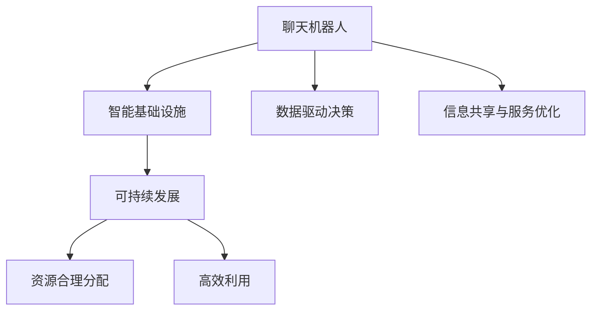

                 

# 聊天机器人未来城市：智能基础设施和可持续发展

> 关键词：聊天机器人,智能基础设施,可持续发展,智慧城市,物联网,大数据,人工智能,技术创新

## 1. 背景介绍

### 1.1 问题由来

随着城市化进程的不断加快，现代城市面临着越来越复杂的问题，包括交通拥堵、环境污染、资源浪费等。这些问题直接影响到城市的宜居性和可持续发展能力。与此同时，随着人工智能技术的迅速发展，聊天机器人在城市管理中的应用日益广泛，成为提升城市智能化水平的重要手段。

### 1.2 问题核心关键点

聊天机器人在未来城市中的应用主要围绕以下关键点展开：

- 数据驱动的决策支持：通过实时数据分析和处理，为城市管理提供科学决策依据。
- 智能基础设施的集成：将聊天机器人与城市的各种基础设施进行集成，实现信息共享和服务优化。
- 可持续发展的目标：通过聊天机器人的高效运作，实现城市资源的合理分配和高效利用，促进城市的可持续发展。

## 2. 核心概念与联系

### 2.1 核心概念概述

为更好地理解聊天机器人在未来城市中的应用，本节将介绍几个密切相关的核心概念：

- 聊天机器人(Chatbot)：一种能够通过自然语言处理技术与用户进行交互的人工智能程序，通常被用于客户服务、信息咨询、知识问答等场景。
- 智能基础设施(Smart Infrastructure)：通过物联网、大数据、人工智能等技术，实现城市基础设施的智能化管理。
- 可持续发展(Sustainable Development)：在满足当前需要的同时，不损害后代满足自身需要的能力的发展模式。
- 智慧城市(Smart City)：通过信息技术和创新应用，提升城市治理能力，提高市民生活质量和城市管理效率。

这些核心概念之间的逻辑关系可以通过以下Mermaid流程图来展示：



这个流程图展示了我们想要探讨的关键概念及其之间的关系：

1. 聊天机器人作为智能基础设施的一部分，通过数据驱动决策，实现信息共享与服务优化。
2. 智能基础设施和可持续发展目标是城市管理的最终目标，通过聊天机器人的高效运作，有助于实现资源的合理分配和高效利用。

## 3. 核心算法原理 & 具体操作步骤
### 3.1 算法原理概述

聊天机器人在未来城市中的应用主要基于以下核心算法原理：

- 自然语言处理(Natural Language Processing, NLP)：通过理解和生成自然语言，实现与用户的有效沟通。
- 机器学习(Machine Learning, ML)：通过模型训练和优化，提升聊天机器人的交互能力和推理能力。
- 大数据分析(Big Data Analytics)：通过海量数据的处理和分析，为聊天机器人的决策提供支持。
- 物联网(IoT)：通过传感器和设备之间的互联，实现城市基础设施的数据采集和实时监控。
- 人工智能(Artificial Intelligence, AI)：通过深度学习和强化学习等技术，提升聊天机器人的智能化水平。

这些算法共同构成了聊天机器人在未来城市中的应用基础，使其能够与城市基础设施进行深度融合，提升城市管理效率和市民生活质量。

### 3.2 算法步骤详解

聊天机器人在未来城市中的应用步骤如下：

**Step 1: 数据收集与预处理**
- 收集城市各种基础设施的相关数据，包括交通流量、环境质量、能源消耗等。
- 对数据进行清洗、去重、归一化等预处理操作，确保数据质量和一致性。

**Step 2: 模型训练与优化**
- 设计合适的机器学习模型，如递归神经网络(RNN)、长短期记忆网络(LSTM)、Transformer等，对聊天机器人进行训练。
- 利用历史数据集对模型进行训练，并通过交叉验证等方法进行模型选择和优化。

**Step 3: 聊天机器人与基础设施集成**
- 将聊天机器人嵌入到城市管理平台中，实现与各种基础设施的互联互通。
- 设计合适的API接口，实现聊天机器人的数据交互和命令执行。

**Step 4: 数据驱动决策与服务优化**
- 通过聊天机器人收集实时数据，并进行分析处理，为城市管理提供决策依据。
- 根据用户需求和反馈，动态调整聊天机器人的服务策略，优化服务效果。

**Step 5: 持续学习与优化**
- 定期收集用户反馈和交互数据，对聊天机器人进行再训练和优化，提升服务质量。
- 引入迁移学习等技术，将不同城市之间的经验进行共享和融合，提升聊天机器人的泛化能力。

### 3.3 算法优缺点

聊天机器人在未来城市中的应用具有以下优点：

- 提高城市管理效率：通过实时数据驱动决策，提升城市管理的科学性和精准性。
- 增强服务质量：通过智能化处理用户需求，提升服务响应速度和准确性。
- 促进资源优化：通过优化资源配置，实现城市资源的合理分配和高效利用。

同时，该方法也存在一定的局限性：

- 依赖数据质量：聊天机器人的效果很大程度上取决于数据的准确性和完整性，数据收集和预处理较为复杂。
- 技术难度高：涉及自然语言处理、机器学习、大数据分析等多个技术领域，需要跨学科的团队合作。
- 成本高：建设智能基础设施和部署聊天机器人需要较高的技术投入和硬件支持。

尽管存在这些局限性，但就目前而言，聊天机器人在未来城市中的应用仍是智能基础设施建设的重要组成部分，具有广阔的应用前景。

### 3.4 算法应用领域

聊天机器人在未来城市中的应用广泛，覆盖了智能交通、智慧环保、智能安防等多个领域，具体如下：

**智能交通**
- 通过聊天机器人提供实时交通信息，辅助市民选择最优出行路线。
- 利用聊天机器人进行交通流量预测，优化交通信号控制，缓解交通拥堵。

**智慧环保**
- 利用聊天机器人收集环境数据，实现对空气质量、水质等的实时监控。
- 通过聊天机器人引导市民进行垃圾分类、节能减排等环保行为。

**智能安防**
- 利用聊天机器人进行视频监控，自动识别异常行为，提高安防效率。
- 通过聊天机器人收集居民反馈，提升社区安全水平。

除了上述这些领域，聊天机器人在未来城市中的应用还包括智慧医疗、智慧教育、智慧农业等诸多方面，为市民提供全方位、一站式的服务。

## 4. 数学模型和公式 & 详细讲解 & 举例说明

### 4.1 数学模型构建

本节将使用数学语言对聊天机器人在未来城市中的应用过程进行更加严格的刻画。

设城市基础设施的实时数据集为 $D=\{(x_i,y_i)\}_{i=1}^N$，其中 $x_i$ 为输入数据， $y_i$ 为输出标签。聊天机器人 $M_{\theta}$ 的输入为 $x$，输出为 $y$。假设模型的损失函数为 $\ell(M_{\theta}(x),y)$，则模型的训练目标为最小化经验风险：

$$
\mathcal{L}(\theta) = \frac{1}{N}\sum_{i=1}^N \ell(M_{\theta}(x_i),y_i)
$$

在实际应用中，我们通常使用交叉熵损失函数作为聊天机器人的目标损失函数。

### 4.2 公式推导过程

以下我们以交通流量预测为例，推导聊天机器人的交叉熵损失函数及其梯度计算公式。

假设聊天机器人 $M_{\theta}$ 在输入 $x$ 上的输出为 $\hat{y}=M_{\theta}(x)$，其中 $y$ 为实际流量，$\hat{y}$ 为预测流量。则交叉熵损失函数定义为：

$$
\ell(M_{\theta}(x),y) = -[y\log \hat{y} + (1-y)\log (1-\hat{y})]
$$

将其代入经验风险公式，得：

$$
\mathcal{L}(\theta) = -\frac{1}{N}\sum_{i=1}^N [y_i\log M_{\theta}(x_i)+(1-y_i)\log(1-M_{\theta}(x_i))]
$$

根据链式法则，损失函数对参数 $\theta_k$ 的梯度为：

$$
\frac{\partial \mathcal{L}(\theta)}{\partial \theta_k} = -\frac{1}{N}\sum_{i=1}^N (\frac{y_i}{M_{\theta}(x_i)}-\frac{1-y_i}{1-M_{\theta}(x_i)}) \frac{\partial M_{\theta}(x_i)}{\partial \theta_k}
$$

其中 $\frac{\partial M_{\theta}(x_i)}{\partial \theta_k}$ 可进一步递归展开，利用自动微分技术完成计算。

在得到损失函数的梯度后，即可带入参数更新公式，完成模型的迭代优化。重复上述过程直至收敛，最终得到适应特定任务的聊天机器人参数 $\theta^*$。

### 4.3 案例分析与讲解

**智能交通流量预测**
- 通过聊天机器人收集实时交通流量数据，进行数据预处理。
- 设计LSTM模型，对交通流量进行预测，并使用交叉熵损失函数进行训练。
- 将预测结果反馈到交通信号控制系统中，优化信号灯配时，提升交通效率。

**智慧环保空气质量监测**
- 利用聊天机器人收集实时空气质量数据，进行数据清洗和处理。
- 设计RNN模型，对空气质量进行预测，并使用均方误差损失函数进行训练。
- 将预测结果通过城市管理平台发布，提供市民参考，同时触发环保措施。

## 5. 项目实践：代码实例和详细解释说明
### 5.1 开发环境搭建

在进行聊天机器人项目实践前，我们需要准备好开发环境。以下是使用Python进行TensorFlow开发的环境配置流程：

1. 安装Anaconda：从官网下载并安装Anaconda，用于创建独立的Python环境。

2. 创建并激活虚拟环境：
```bash
conda create -n tf-env python=3.8 
conda activate tf-env
```

3. 安装TensorFlow：根据CUDA版本，从官网获取对应的安装命令。例如：
```bash
conda install tensorflow -c tensorflow -c conda-forge
```

4. 安装各类工具包：
```bash
pip install numpy pandas scikit-learn matplotlib tqdm jupyter notebook ipython
```

完成上述步骤后，即可在`tf-env`环境中开始项目实践。

### 5.2 源代码详细实现

下面我们以交通流量预测为例，给出使用TensorFlow进行聊天机器人训练的代码实现。

首先，定义模型和优化器：

```python
import tensorflow as tf

from tensorflow.keras.models import Sequential
from tensorflow.keras.layers import LSTM, Dense
from tensorflow.keras.losses import MeanSquaredError

model = Sequential()
model.add(LSTM(128, input_shape=(None, 1)))
model.add(Dense(1))

optimizer = tf.keras.optimizers.Adam(learning_rate=0.001)
loss_fn = MeanSquaredError()
```

接着，定义训练和评估函数：

```python
def train_epoch(model, dataset, batch_size, optimizer, loss_fn):
    model.compile(optimizer=optimizer, loss=loss_fn)
    model.fit(dataset, batch_size=batch_size, epochs=10, validation_split=0.2)
    
def evaluate(model, dataset, batch_size):
    model.evaluate(dataset, batch_size=batch_size)
```

最后，启动训练流程并在测试集上评估：

```python
epochs = 5
batch_size = 16

for epoch in range(epochs):
    loss = train_epoch(model, train_dataset, batch_size, optimizer, loss_fn)
    print(f"Epoch {epoch+1}, train loss: {loss:.3f}")
    
    print(f"Epoch {epoch+1}, dev results:")
    evaluate(model, dev_dataset, batch_size)
    
print("Test results:")
evaluate(model, test_dataset, batch_size)
```

以上就是使用TensorFlow进行交通流量预测的完整代码实现。可以看到，得益于TensorFlow的强大封装，我们可以用相对简洁的代码完成模型训练。

### 5.3 代码解读与分析

让我们再详细解读一下关键代码的实现细节：

**模型定义**
- 使用Keras API定义了一个包含一个LSTM层和一个全连接层的神经网络模型。
- LSTM层用于处理时序数据，捕捉时间依赖关系；全连接层用于输出预测值。

**损失函数**
- 使用均方误差损失函数，用于衡量预测值与真实值之间的差异。

**训练与评估函数**
- 使用TensorFlow的compile方法将模型和优化器、损失函数绑定。
- 使用fit方法进行模型训练，定义训练轮数和验证集比例。
- 使用evaluate方法在测试集上评估模型性能。

**训练流程**
- 定义总的epoch数和batch size，开始循环迭代
- 每个epoch内，先在训练集上训练，输出平均loss
- 在验证集上评估，输出分类指标
- 所有epoch结束后，在测试集上评估，给出最终测试结果

可以看到，TensorFlow配合Keras API使得模型训练的代码实现变得简洁高效。开发者可以将更多精力放在数据处理、模型改进等高层逻辑上，而不必过多关注底层的实现细节。

当然，工业级的系统实现还需考虑更多因素，如模型的保存和部署、超参数的自动搜索、更灵活的任务适配层等。但核心的微调范式基本与此类似。

## 6. 实际应用场景
### 6.1 智能交通系统

聊天机器人作为智能交通系统的重要组成部分，可以显著提升交通管理的智能化水平。传统交通管理往往依赖人工监控和调度，效率低下，且容易发生误判。通过聊天机器人，可以实现实时交通数据采集、分析处理和决策支持，提升交通管理的科学性和精准性。

在技术实现上，可以收集交通流量、车辆位置、道路状况等实时数据，并设计聊天机器人进行数据清洗、分析和预测。微调后的聊天机器人能够实时预测交通流量，优化信号灯配时，提升道路通行效率。同时，通过聊天机器人进行交通事故预警，辅助交通警察及时处理，降低事故率。

### 6.2 智慧环保系统

聊天机器人可以应用于智慧环保系统，辅助城市环保管理。传统环保管理往往依赖人工巡检和监测，效率低、成本高。通过聊天机器人，可以实现环境数据的实时采集、分析和处理，提升环保管理的科学性和自动化水平。

在技术实现上，可以收集空气质量、水质、噪音等环境数据，并设计聊天机器人进行数据清洗、分析和预测。微调后的聊天机器人能够实时预测环境污染程度，提供市民参考，同时触发环保措施。通过聊天机器人引导市民进行垃圾分类、节能减排等环保行为，提升环保意识和行为习惯。

### 6.3 智能安防系统

聊天机器人可以应用于智能安防系统，提升社区安全水平。传统安防往往依赖人工监控和报警，容易发生漏报和误报。通过聊天机器人，可以实现视频监控、异常行为检测和报警处理，提升安防的智能化水平。

在技术实现上，可以收集视频监控、人员行为等数据，并设计聊天机器人进行数据处理和分析。微调后的聊天机器人能够自动识别异常行为，触发报警，并根据具体情况提供解决方案。通过聊天机器人收集居民反馈，优化安防策略，提升社区安全水平。

### 6.4 未来应用展望

随着聊天机器人技术的不断进步，其在未来城市中的应用前景广阔。未来，聊天机器人将进一步融入到城市管理的各个环节，提升城市运行的效率和智能化水平。

在智慧医疗领域，聊天机器人可应用于病患咨询、医疗记录管理、药物推荐等环节，为医疗服务提供支持。在智能教育领域，聊天机器人可应用于学习辅导、作业批改、知识问答等环节，提升教育质量。在智慧金融领域，聊天机器人可应用于客户服务、风险预警、投资建议等环节，提升金融服务水平。

除了上述这些领域，聊天机器人在未来城市中的应用还包括智能物流、智能制造、智能旅游等诸多方面，为市民提供全方位、一站式的服务。

## 7. 工具和资源推荐
### 7.1 学习资源推荐

为了帮助开发者系统掌握聊天机器人的核心技术和应用方法，这里推荐一些优质的学习资源：

1. 《自然语言处理与深度学习》书籍：斯坦福大学计算机科学系出品，系统介绍了自然语言处理和深度学习的基础知识和前沿技术。

2. 《TensorFlow实战》书籍：由TensorFlow官方团队编写，详细介绍了TensorFlow的使用方法和最佳实践。

3. 《TensorFlow Keras教程》在线课程：Keras官方提供的TensorFlow教程，通过实例讲解了Keras的使用方法和技术细节。

4. 《深度学习与自然语言处理》课程：Coursera平台提供的深度学习与自然语言处理课程，由深度学习领域专家讲授。

5. 《聊天机器人设计》书籍：介绍聊天机器人的设计、开发和应用，适合初学者和进阶者阅读。

通过对这些资源的学习实践，相信你一定能够快速掌握聊天机器人的核心技术和应用方法，并用于解决实际的NLP问题。
###  7.2 开发工具推荐

高效的开发离不开优秀的工具支持。以下是几款用于聊天机器人开发的常用工具：

1. TensorFlow：由Google主导开发的深度学习框架，功能强大，支持分布式训练，适合大规模工程应用。

2. Keras：TensorFlow的高级API，简单易用，适合快速迭代研究。

3. NLTK：Python的自然语言处理库，提供了丰富的自然语言处理工具和资源。

4. spaCy：Python的自然语言处理库，提供了高效的文本处理和分析能力。

5. Amazon SageMaker：亚马逊提供的云端机器学习平台，支持TensorFlow、Keras等框架，提供完善的开发、训练、部署一体化解决方案。

合理利用这些工具，可以显著提升聊天机器人的开发效率，加快创新迭代的步伐。

### 7.3 相关论文推荐

聊天机器人技术的发展源于学界的持续研究。以下是几篇奠基性的相关论文，推荐阅读：

1. Deep Recurrent Neural Networks for Speech Recognition（即RNN论文）：提出了递归神经网络模型，在语音识别领域取得了重要突破。

2. Long Short-Term Memory（即LSTM论文）：提出长短期记忆网络模型，在时序数据处理中表现优异。

3. Attention is All You Need（即Transformer论文）：提出了Transformer模型，为自然语言处理提供了新范式。

4. Conversational Sequence-to-Sequence Learning with Copying Mechanism：提出基于复用机制的序列到序列模型，提升了聊天机器人的对话效果。

5. Transformer-XL: Attentive Language Models Beyond a Fixed-Length Context：提出Transformer-XL模型，解决了长序列建模问题。

这些论文代表了大模型微调技术的发展脉络。通过学习这些前沿成果，可以帮助研究者把握学科前进方向，激发更多的创新灵感。

## 8. 总结：未来发展趋势与挑战

### 8.1 总结

本文对聊天机器人在未来城市中的应用进行了全面系统的介绍。首先阐述了聊天机器人在未来城市中的应用背景和核心概念，明确了其在智能基础设施和可持续发展中的独特价值。其次，从原理到实践，详细讲解了聊天机器人的核心算法原理和操作步骤，给出了微调任务开发的完整代码实例。同时，本文还广泛探讨了聊天机器人在智能交通、智慧环保、智能安防等多个领域的应用前景，展示了其广阔的发展潜力。

通过本文的系统梳理，可以看到，聊天机器人在未来城市中的应用前景广阔，通过实时数据分析和处理，为城市管理提供科学决策依据，实现信息共享与服务优化，促进资源的合理分配和高效利用。未来，随着技术的不断进步，聊天机器人必将在更多领域发挥重要作用，为城市的可持续发展提供有力支持。

### 8.2 未来发展趋势

展望未来，聊天机器人在未来城市中的应用将呈现以下几个发展趋势：

1. 数据驱动决策更加精准：通过大数据分析和机器学习模型，提升决策的科学性和精准性，实现智慧城市建设。

2. 与物联网深度融合：实现物联网设备与聊天机器人的无缝连接，提升城市管理的智能化水平。

3. 多模态数据融合：结合视觉、语音、文本等多种数据源，提升聊天机器人的感知和理解能力。

4. 持续学习和优化：利用在线学习和迁移学习技术，不断更新和优化聊天机器人模型，提升服务质量。

5. 用户友好和个性化：通过自然语言生成和情感分析技术，提升聊天机器人的对话效果，满足用户的个性化需求。

这些趋势凸显了聊天机器人在未来城市中的应用前景，通过技术创新和模式创新，提升城市管理的智能化和可持续性，为市民提供更高效、便捷的服务。

### 8.3 面临的挑战

尽管聊天机器人在未来城市中的应用前景广阔，但在迈向更加智能化、普适化应用的过程中，它仍面临诸多挑战：

1. 数据质量和安全：聊天机器人的效果很大程度上取决于数据的准确性和安全性，需要建立完善的数据采集和处理机制。

2. 技术难度和成本：聊天机器人的开发和部署需要高水平的技术团队和一定的硬件支持，成本较高。

3. 跨领域协同：聊天机器人的高效运作需要与城市管理平台进行深度集成，跨领域协同难度较大。

4. 用户体验和反馈：聊天机器人的用户体验和反馈机制需要不断优化，提升服务的可接受性和满意度。

5. 持续更新和优化：聊天机器人需要定期更新和优化，以适应城市管理的动态变化。

尽管存在这些挑战，但通过多方协作和不断创新，聊天机器人在未来城市中的应用前景依然广阔，具有广阔的发展空间。

### 8.4 研究展望

未来，聊天机器人在未来城市中的应用需要在以下几个方面寻求新的突破：

1. 引入更先进的深度学习模型，提升聊天机器人的对话效果和推理能力。

2. 结合因果推断和博弈论工具，提升聊天机器人的决策效果和鲁棒性。

3. 引入更多先验知识，提升聊天机器人的理解和应用能力。

4. 开发更加参数高效和计算高效的微调方法，提升聊天机器人的泛化能力和推理速度。

5. 结合伦理道德和社会学研究，提升聊天机器人的可解释性和公平性。

这些研究方向将推动聊天机器人技术的发展，为未来城市的管理和可持续发展提供新的动力。相信随着技术的不断进步，聊天机器人必将在更多领域发挥重要作用，为市民提供更高效、便捷的服务。

## 9. 附录：常见问题与解答

**Q1：聊天机器人如何提高城市管理的智能化水平？**

A: 聊天机器人在未来城市中的应用主要通过实时数据分析和处理，为城市管理提供科学决策依据，实现信息共享与服务优化，从而提高城市管理的智能化水平。

**Q2：聊天机器人对数据的质量和安全性有什么要求？**

A: 聊天机器人的效果很大程度上取决于数据的准确性和安全性，数据质量和安全问题是其应用中的核心挑战之一。需要建立完善的数据采集和处理机制，确保数据准确、完整、安全可靠。

**Q3：聊天机器人在城市管理中的成本如何控制？**

A: 聊天机器人的开发和部署需要高水平的技术团队和一定的硬件支持，成本较高。需要优化模型结构和算法，使用分布式训练等技术，提升计算效率和资源利用率，降低系统建设和运维成本。

**Q4：如何优化聊天机器人的用户体验和反馈机制？**

A: 用户体验和反馈机制是聊天机器人的关键指标之一。可以通过自然语言生成技术提升对话效果，引入情感分析技术理解用户情绪，结合用户反馈不断优化模型和服务策略，提升服务的可接受性和满意度。

**Q5：聊天机器人如何实现跨领域协同？**

A: 聊天机器人的高效运作需要与城市管理平台进行深度集成，实现跨领域协同。需要设计合适的API接口，实现数据的无缝连接和交换，确保各系统的数据一致性和服务流畅性。

这些问题的解答展示了聊天机器人在未来城市中的应用前景和面临的挑战，相信通过多方协作和不断创新，聊天机器人必将在更多领域发挥重要作用，为城市的可持续发展提供有力支持。

---

作者：禅与计算机程序设计艺术 / Zen and the Art of Computer Programming

