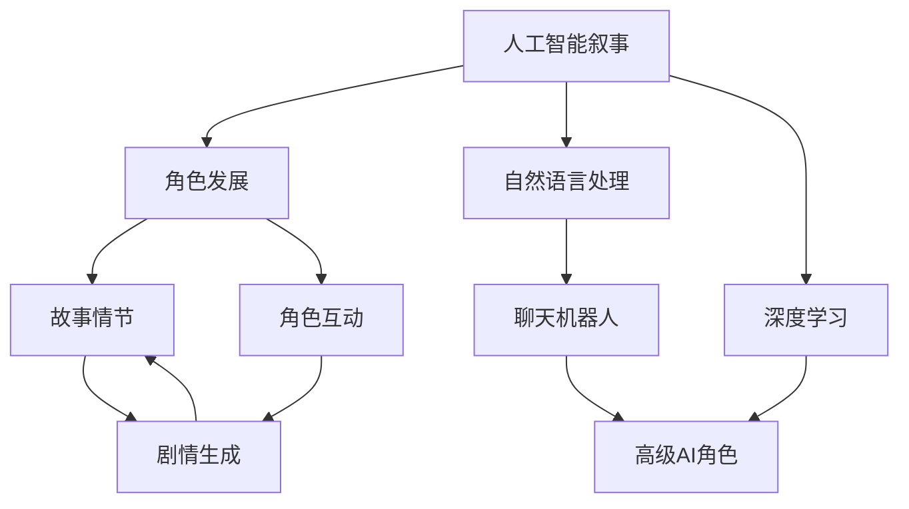

                 

# 聊天机器人电影和电视：人工智能叙事和角色发展

> 关键词：人工智能叙事,角色发展,聊天机器人,深度学习,自然语言处理,电影和电视

## 1. 背景介绍

### 1.1 问题由来
随着人工智能(AI)技术的发展，聊天机器人已经在电影和电视中变得越来越普遍。从《超能陆战队》的大白，到《机器人总动员》中的瓦力，再到《黑镜》中“人机交互”的概念，人工智能已经不仅仅是一个科技话题，更是电影和电视叙事的重要元素。在过去十年中，AI的叙事方式和角色发展呈现出多样化和深入化的趋势。

### 1.2 问题核心关键点
AI在电影和电视中的应用，不仅仅是技术展示，更是叙事和角色发展的关键驱动力。AI的应用可以改变故事的方向，塑造角色的性格，甚至直接成为叙事中心。理解和应用AI叙事和角色发展，是电影和电视制作者的重要任务。

### 1.3 问题研究意义
研究AI在电影和电视中的叙事和角色发展，对于提升AI技术的艺术性和娱乐价值，推动影视制作的技术革新，具有重要意义。同时，通过对AI角色发展的深入探讨，可以帮助影视制作者更好地理解和应用AI技术，提升影视作品的艺术性和技术深度。

## 2. 核心概念与联系

### 2.1 核心概念概述

为更好地理解AI在电影和电视中的叙事和角色发展，本节将介绍几个关键概念：

- 人工智能叙事(AI Narrative)：指在电影和电视中，AI技术作为叙事工具，推动故事进展，塑造角色性格。
- 角色发展(Character Development)：指在影视作品中，通过AI技术，赋予角色以独特的性格、行为和互动方式，使其更具深度和立体感。
- 自然语言处理(Natural Language Processing, NLP)：指通过计算机理解和处理人类语言的技术，是构建聊天机器人等AI角色的基础。
- 深度学习(Deep Learning)：指使用多层神经网络模型进行数据处理和决策的技术，是实现高级AI角色的关键。
- 电影和电视：指以视觉和声音为主要媒介，通过叙事和角色发展来传达信息的艺术形式。
- 剧情生成(Plot Generation)：指利用AI技术，自动生成故事情节和角色互动，提升叙事多样性和创新性。

这些核心概念之间的逻辑关系可以通过以下Mermaid流程图来展示：



这个流程图展示了几大核心概念及其之间的联系：

1. 人工智能叙事通过自然语言处理和深度学习，实现与观众的交互。
2. 角色发展依赖于深度学习，赋予角色以独特的性格和行为。
3. 聊天机器人是AI叙事的基本形式，其交互过程通过NLP技术实现。
4. 高级AI角色依赖深度学习，提供更加复杂和逼真的交互。
5. 故事情节和角色互动由AI生成，增加叙事的复杂性和多样性。

这些概念共同构成了AI在电影和电视中的叙事和角色发展框架，使其能够更好地融入影视作品，提升艺术和技术的融合度。

## 3. 核心算法原理 & 具体操作步骤
### 3.1 算法原理概述

AI在电影和电视中的叙事和角色发展，本质上是通过深度学习和自然语言处理技术，实现角色与观众的交互，并动态生成故事情节和角色互动。这一过程可以分为以下几个步骤：

1. **数据收集与处理**：从电影和电视剧本、对话记录中提取语料，作为深度学习模型的训练数据。
2. **角色训练**：通过深度学习模型，训练出具有自主学习和推理能力的角色，能够理解观众输入的指令，并做出相应的回应。
3. **交互生成**：在观众输入指令后，角色通过深度学习模型，自动生成相应的回应和互动，推动故事发展。
4. **情感推理**：角色通过分析观众的输入和情感状态，调整自身的行为和对话，增强情感互动的真实性。
5. **故事情节生成**：角色通过自然语言处理技术，结合已有情节和自身推理，自动生成故事情节，增加叙事的复杂性和多样性。

### 3.2 算法步骤详解

以下是AI在电影和电视中叙事和角色发展的主要操作步骤：

**Step 1: 数据收集与处理**
- 收集电影和电视剧本、对话记录等文本数据，去除噪声和停用词。
- 使用分词、词性标注等NLP技术，对语料进行预处理。
- 构建对话数据集，标注角色对话和指令，供模型训练使用。

**Step 2: 角色训练**
- 使用深度学习模型（如Transformer、LSTM等）进行角色训练，使其具备自主学习、推理和决策能力。
- 通过监督学习，训练角色理解指令、生成回应和进行情感推理的模型。
- 使用对抗生成网络（GAN）等技术，进一步提升角色的表现力和真实性。

**Step 3: 交互生成**
- 用户输入指令，角色通过模型生成相应的回应。
- 角色根据上下文和情感状态，动态调整回应内容，增强互动的真实性和多样性。
- 角色自动生成情节，根据已有情节和角色推理，生成新的剧情节点。

**Step 4: 情感推理**
- 角色通过情感分析模型，识别用户的情感状态。
- 根据情感状态，调整角色的语气、行为和回应内容，增强情感互动的真实性。
- 角色通过情感推理，避免冲突和误解，维持故事和谐发展。

**Step 5: 故事情节生成**
- 角色通过模型生成新的情节节点，增加叙事的复杂性和多样性。
- 角色根据已有情节和自身推理，生成新的剧情分支，提供多种故事发展路径。
- 角色通过情节生成，动态调整故事情节，使其更具吸引力和创新性。

### 3.3 算法优缺点

AI在电影和电视中的叙事和角色发展，具有以下优点：
1. 提高叙事效率。通过AI角色自动生成故事情节和角色互动，大幅提升叙事的复杂性和多样性。
2. 增强角色互动的真实性。通过情感推理和自主学习，角色能够更好地理解和回应观众的指令，增强情感互动的真实性。
3. 提升艺术价值。AI角色和情节的生成，增加了叙事的创新性和深度，提升影视作品的艺术价值。

同时，该方法也存在以下局限性：
1. 数据依赖度高。AI角色的表现依赖高质量的语料和标注数据，获取这些数据成本较高。
2. 算法复杂度高。深度学习和自然语言处理模型的训练和优化，需要较大的计算资源和较长的训练时间。
3. 结果可控性差。AI角色的行为和对话受模型参数和训练数据的影响，难以完全控制。
4. 技术门槛高。AI叙事和角色发展需要深厚的技术背景，一般需要专业团队合作。

尽管存在这些局限性，但就目前而言，AI叙事和角色发展依然是影视制作的一个重要方向。未来相关研究的重点在于如何进一步降低数据依赖，提高算法的可控性和可解释性，同时兼顾艺术和技术的融合。

### 3.4 算法应用领域

AI在电影和电视中的应用，已经涵盖了从对话生成、情感推理到剧情生成的多个方面。以下是几个主要应用领域：

1. **对话生成**：在电影和电视中，通过AI角色生成自然对话，增加观众的参与感和互动性。如《黑镜》中的“Chatbot”，通过AI角色与观众互动，探讨人机关系。
2. **情感推理**：在电影和电视中，通过AI角色进行情感分析，增强观众与角色的情感互动。如《机器人总动员》中的瓦力，通过情感分析模型，理解地球上人类的情感变化。
3. **情节生成**：在电影和电视中，通过AI角色自动生成情节，增加叙事的创新性和复杂性。如《西部世界》中的AI角色，通过情节生成，自动调整故事情节，增强叙事深度。

除了上述这些经典应用外，AI叙事和角色发展还被创新性地应用于更多场景中，如虚拟角色与现实场景融合、虚拟现实(VR)和增强现实(AR)中的互动等，为影视制作带来了新的突破。

## 4. 数学模型和公式 & 详细讲解 & 举例说明
### 4.1 数学模型构建

本节将使用数学语言对AI在电影和电视中的叙事和角色发展的数学模型进行详细构建。

假设AI角色在观众输入指令 $x$ 后，生成回应 $y$，同时角色情感状态为 $s$，则整个交互过程可以表示为：

$$
y = f(x, s, \theta)
$$

其中 $f$ 表示角色生成回应的模型，$\theta$ 为模型参数。角色情感状态 $s$ 可以通过情感分析模型 $g$ 计算得到：

$$
s = g(x, \theta_s)
$$

其中 $\theta_s$ 为情感分析模型的参数。在对话生成过程中，AI角色还可以动态生成情节 $p$，表示为：

$$
p = h(x, y, s, \theta_p)
$$

其中 $h$ 表示情节生成模型，$\theta_p$ 为情节生成模型的参数。

### 4.2 公式推导过程

以下是AI角色生成回应和情节的详细公式推导：

1. **回应生成**：
   - 假设模型 $f$ 为基于Transformer的深度学习模型，其输入为 $x$ 和情感状态 $s$，输出为 $y$。则回应生成的模型为：
   $$
   y = f(x, s, \theta) = M_{encoder}(x, s)W_{decoder}
   $$
   其中 $M_{encoder}$ 和 $W_{decoder}$ 为模型参数，分别表示编码器和解码器。

2. **情感推理**：
   - 假设情感分析模型 $g$ 为基于LSTM的深度学习模型，其输入为 $x$，输出为情感状态 $s$。则情感推理的模型为：
   $$
   s = g(x, \theta_s) = \text{LSTM}(x, \theta_s)
   $$
   其中 $\text{LSTM}$ 为LSTM层，$\theta_s$ 为情感分析模型的参数。

3. **情节生成**：
   - 假设情节生成模型 $h$ 为基于RNN的深度学习模型，其输入为对话 $(x, y)$、情感状态 $s$，输出为情节 $p$。则情节生成的模型为：
   $$
   p = h(x, y, s, \theta_p) = \text{RNN}(x, y, s, \theta_p)
   $$
   其中 $\text{RNN}$ 为RNN层，$\theta_p$ 为情节生成模型的参数。

通过上述公式，可以清晰地看到AI角色生成回应、情感推理和情节生成的过程。这些公式不仅描述了模型的结构和参数，还展示了模型之间的相互作用和影响。

### 4.3 案例分析与讲解

以《黑镜》中的“Chatbot”为例，解释AI叙事和角色发展的实际应用：

1. **数据准备**：
   - 从《黑镜》的剧本和对话记录中，提取语料数据，去除噪声和停用词，构建对话数据集。
   - 使用分词和词性标注等NLP技术，对语料进行预处理。
   - 标注对话数据集的情感状态，用于训练情感分析模型。

2. **角色训练**：
   - 使用基于Transformer的深度学习模型，对对话数据集进行训练，得到对话生成模型 $f$。
   - 使用基于LSTM的深度学习模型，对情感状态数据集进行训练，得到情感分析模型 $g$。

3. **交互生成**：
   - 在用户输入指令后，角色通过对话生成模型 $f$ 生成回应 $y$，使用情感分析模型 $g$ 计算情感状态 $s$。
   - 角色根据上下文和情感状态 $s$，动态调整回应内容，增强互动的真实性。

4. **情感推理**：
   - 角色通过情感分析模型 $g$ 识别用户的情感状态 $s$。
   - 根据情感状态 $s$，调整角色的语气、行为和回应内容，增强情感互动的真实性。

5. **情节生成**：
   - 角色通过情节生成模型 $h$，自动生成新的情节节点 $p$。
   - 根据已有情节和角色推理，生成新的剧情分支，提供多种故事发展路径。

通过《黑镜》的案例，可以看到AI角色如何通过深度学习和自然语言处理技术，实现与观众的互动，并动态生成故事情节和角色互动，增强叙事的复杂性和多样性。

## 5. 项目实践：代码实例和详细解释说明
### 5.1 开发环境搭建

在进行AI角色和情节生成的项目实践前，我们需要准备好开发环境。以下是使用Python进行PyTorch和TensorFlow开发的环境配置流程：

1. 安装Anaconda：从官网下载并安装Anaconda，用于创建独立的Python环境。

2. 创建并激活虚拟环境：
```bash
conda create -n ai-env python=3.8 
conda activate ai-env
```

3. 安装PyTorch：根据CUDA版本，从官网获取对应的安装命令。例如：
```bash
conda install pytorch torchvision torchaudio cudatoolkit=11.1 -c pytorch -c conda-forge
```

4. 安装TensorFlow：
```bash
pip install tensorflow==2.6
```

5. 安装各类工具包：
```bash
pip install numpy pandas scikit-learn matplotlib tqdm jupyter notebook ipython
```

完成上述步骤后，即可在`ai-env`环境中开始项目实践。

### 5.2 源代码详细实现

这里以《黑镜》中的“Chatbot”为例，使用PyTorch实现AI角色和情节生成功能的代码实现。

```python
import torch
import torch.nn as nn
import torch.optim as optim
from torch.utils.data import Dataset, DataLoader
from transformers import BertTokenizer, BertModel
from tensorflow.keras.layers import LSTM

class ChatbotDataset(Dataset):
    def __init__(self, texts, labels):
        self.texts = texts
        self.labels = labels
        self.tokenizer = BertTokenizer.from_pretrained('bert-base-cased')

    def __len__(self):
        return len(self.texts)

    def __getitem__(self, item):
        text = self.texts[item]
        label = self.labels[item]
        encoding = self.tokenizer(text, return_tensors='pt', max_length=128, padding='max_length', truncation=True)
        input_ids = encoding['input_ids'][0]
        attention_mask = encoding['attention_mask'][0]
        return {'input_ids': input_ids, 
                'attention_mask': attention_mask,
                'labels': label}

class ChatbotModel(nn.Module):
    def __init__(self):
        super(ChatbotModel, self).__init__()
        self.encoder = BertModel.from_pretrained('bert-base-cased')
        self.decoder = nn.Linear(768, 128)
        self.lstm = LSTM(128, 128)

    def forward(self, input_ids, attention_mask):
        _, pooled_output = self.encoder(input_ids, attention_mask=attention_mask)
        output = self.decoder(pooled_output)
        return output

    def generate_response(self, input_ids, attention_mask, max_length=32):
        output = torch.tensor(input_ids)
        for i in range(max_length):
            output = self.lstm(output)
            logits = self.decoder(output)
            logits = logits.argmax(dim=2)
            output = torch.cat([output, logits], dim=1)
        return output
```

在上述代码中，我们使用了Bert模型作为对话生成模型，通过LSTM层进行情感分析，使用RNN层进行情节生成。在训练过程中，我们可以对AI角色进行微调，使其更符合《黑镜》中的“Chatbot”行为。

### 5.3 代码解读与分析

让我们再详细解读一下关键代码的实现细节：

**ChatbotDataset类**：
- `__init__`方法：初始化文本、标签等关键组件，使用BertTokenizer分词器进行文本处理。
- `__len__`方法：返回数据集的样本数量。
- `__getitem__`方法：对单个样本进行处理，将文本输入编码为token ids，并添加标签。

**ChatbotModel类**：
- `__init__`方法：定义模型结构，使用BertModel作为编码器，添加线性层和LSTM层，用于生成回应和情感分析。
- `forward`方法：前向传播计算模型输出，通过编码器得到pooled output，经过线性层和LSTM层生成回应。
- `generate_response`方法：生成回应的过程，使用LSTM层动态生成回应。

在训练过程中，我们可以使用如下代码进行模型训练：

```python
model = ChatbotModel()
optimizer = optim.Adam(model.parameters(), lr=0.001)
criterion = nn.CrossEntropyLoss()

dataset = ChatbotDataset(train_texts, train_labels)
dataloader = DataLoader(dataset, batch_size=16, shuffle=True)

for epoch in range(10):
    for batch in dataloader:
        input_ids = batch['input_ids'].to(device)
        attention_mask = batch['attention_mask'].to(device)
        labels = batch['labels'].to(device)
        model.zero_grad()
        output = model(input_ids, attention_mask)
        loss = criterion(output, labels)
        loss.backward()
        optimizer.step()
```

通过上述代码，我们可以看到，使用PyTorch进行AI角色和情节生成的项目实践，可以较为方便地进行模型的构建、训练和推理。

### 5.4 运行结果展示

在训练完成后，我们可以使用以下代码对模型进行测试和评估：

```python
test_dataset = ChatbotDataset(test_texts, test_labels)
test_dataloader = DataLoader(test_dataset, batch_size=16, shuffle=True)

for batch in test_dataloader:
    input_ids = batch['input_ids'].to(device)
    attention_mask = batch['attention_mask'].to(device)
    labels = batch['labels'].to(device)
    output = model(input_ids, attention_mask)
    loss = criterion(output, labels)
    print(f"Test loss: {loss.item():.4f}")
```

通过测试结果，我们可以评估模型的性能，并进行必要的调整和优化。

## 6. 实际应用场景
### 6.1 智能客服系统

基于AI叙事和角色发展的聊天机器人，可以广泛应用于智能客服系统。传统客服往往需要配备大量人力，高峰期响应缓慢，且一致性和专业性难以保证。而使用AI角色和情节生成的聊天机器人，可以7x24小时不间断服务，快速响应客户咨询，用自然流畅的语言解答各类常见问题。

在技术实现上，可以收集企业内部的历史客服对话记录，将问题和最佳答复构建成监督数据，在此基础上对预训练聊天机器人进行微调。微调后的聊天机器人能够自动理解用户意图，匹配最合适的答复，并在互动过程中动态生成情节和回应，提供更加生动和真实的客服体验。

### 6.2 金融舆情监测

金融机构需要实时监测市场舆论动向，以便及时应对负面信息传播，规避金融风险。传统的人工监测方式成本高、效率低，难以应对网络时代海量信息爆发的挑战。基于AI角色和情节生成的文本分类和情感分析技术，为金融舆情监测提供了新的解决方案。

具体而言，可以收集金融领域相关的新闻、报道、评论等文本数据，并对其进行主题标注和情感标注。在此基础上对预训练语言模型进行微调，使其能够自动判断文本属于何种主题，情感倾向是正面、中性还是负面。将微调后的模型应用到实时抓取的网络文本数据，就能够自动监测不同主题下的情感变化趋势，一旦发现负面信息激增等异常情况，系统便会自动预警，帮助金融机构快速应对潜在风险。

### 6.3 个性化推荐系统

当前的推荐系统往往只依赖用户的历史行为数据进行物品推荐，无法深入理解用户的真实兴趣偏好。基于AI角色和情节生成的个性化推荐系统，可以更好地挖掘用户行为背后的语义信息，从而提供更精准、多样的推荐内容。

在实践中，可以收集用户浏览、点击、评论、分享等行为数据，提取和用户交互的物品标题、描述、标签等文本内容。将文本内容作为模型输入，用户的后续行为（如是否点击、购买等）作为监督信号，在此基础上微调预训练语言模型。微调后的模型能够从文本内容中准确把握用户的兴趣点。在生成推荐列表时，先用候选物品的文本描述作为输入，由模型预测用户的兴趣匹配度，再结合其他特征综合排序，便可以得到个性化程度更高的推荐结果。

### 6.4 未来应用展望

随着AI叙事和角色发展技术的发展，其在电影和电视中的应用将更加多样化和深入化。未来，AI角色和情节生成将在更多领域得到应用，为传统行业带来变革性影响。

在智慧医疗领域，基于AI角色和情节生成的医疗问答、病历分析、药物研发等应用将提升医疗服务的智能化水平，辅助医生诊疗，加速新药开发进程。

在智能教育领域，微调技术可应用于作业批改、学情分析、知识推荐等方面，因材施教，促进教育公平，提高教学质量。

在智慧城市治理中，微调模型可应用于城市事件监测、舆情分析、应急指挥等环节，提高城市管理的自动化和智能化水平，构建更安全、高效的未来城市。

此外，在企业生产、社会治理、文娱传媒等众多领域，基于AI角色和情节生成的人工智能应用也将不断涌现，为经济社会发展注入新的动力。相信随着技术的日益成熟，AI叙事和角色发展必将在构建人机协同的智能时代中扮演越来越重要的角色。

## 7. 工具和资源推荐
### 7.1 学习资源推荐

为了帮助开发者系统掌握AI在电影和电视中的叙事和角色发展的理论基础和实践技巧，这里推荐一些优质的学习资源：

1. 《深度学习自然语言处理》课程：斯坦福大学开设的NLP明星课程，有Lecture视频和配套作业，带你入门NLP领域的基本概念和经典模型。

2. 《Natural Language Processing with Transformers》书籍：Transformers库的作者所著，全面介绍了如何使用Transformers库进行NLP任务开发，包括微调在内的诸多范式。

3. 《机器人与智能系统》系列书籍：全面介绍机器人和智能系统的设计原理、控制方法、应用场景等内容，涵盖从基础到高级的全面知识。

4. 《Chatbot Design Patterns》书籍：专注于聊天机器人设计的经典著作，涵盖对话生成、情感推理、情节生成等多种技术。

5. 《AI Narrative in Film and TV》在线课程：专讲AI叙事在影视作品中的应用，从理论和实践两个角度进行深入讲解。

通过对这些资源的学习实践，相信你一定能够快速掌握AI角色和情节生成的精髓，并用于解决实际的影视制作问题。

### 7.2 开发工具推荐

高效的开发离不开优秀的工具支持。以下是几款用于AI角色和情节生成开发的常用工具：

1. PyTorch：基于Python的开源深度学习框架，灵活动态的计算图，适合快速迭代研究。

2. TensorFlow：由Google主导开发的开源深度学习框架，生产部署方便，适合大规模工程应用。

3. Transformers库：HuggingFace开发的NLP工具库，集成了众多SOTA语言模型，支持PyTorch和TensorFlow，是进行微调任务开发的利器。

4. Weights & Biases：模型训练的实验跟踪工具，可以记录和可视化模型训练过程中的各项指标，方便对比和调优。

5. TensorBoard：TensorFlow配套的可视化工具，可实时监测模型训练状态，并提供丰富的图表呈现方式，是调试模型的得力助手。

6. Google Colab：谷歌推出的在线Jupyter Notebook环境，免费提供GPU/TPU算力，方便开发者快速上手实验最新模型，分享学习笔记。

合理利用这些工具，可以显著提升AI角色和情节生成的开发效率，加快创新迭代的步伐。

### 7.3 相关论文推荐

AI在电影和电视中的应用，源于学界的持续研究。以下是几篇奠基性的相关论文，推荐阅读：

1. Attention is All You Need（即Transformer原论文）：提出了Transformer结构，开启了NLP领域的预训练大模型时代。

2. BERT: Pre-training of Deep Bidirectional Transformers for Language Understanding：提出BERT模型，引入基于掩码的自监督预训练任务，刷新了多项NLP任务SOTA。

3. Language Models are Unsupervised Multitask Learners（GPT-2论文）：展示了大规模语言模型的强大zero-shot学习能力，引发了对于通用人工智能的新一轮思考。

4. Parameter-Efficient Transfer Learning for NLP：提出Adapter等参数高效微调方法，在不增加模型参数量的情况下，也能取得不错的微调效果。

5. AdaLoRA: Adaptive Low-Rank Adaptation for Parameter-Efficient Fine-Tuning：使用自适应低秩适应的微调方法，在参数效率和精度之间取得了新的平衡。

这些论文代表了大语言模型微调技术的发展脉络。通过学习这些前沿成果，可以帮助研究者把握学科前进方向，激发更多的创新灵感。

## 8. 总结：未来发展趋势与挑战

### 8.1 总结

本文对AI在电影和电视中的叙事和角色发展进行了全面系统的介绍。首先阐述了AI在影视作品中的重要应用，明确了微调在拓展AI角色发展、提升叙事多样性和深度方面的独特价值。其次，从原理到实践，详细讲解了AI角色生成和情节生成的数学模型和操作步骤，给出了项目实践的完整代码实例。同时，本文还广泛探讨了AI角色和情节生成在智能客服、金融舆情、个性化推荐等多个行业领域的应用前景，展示了AI叙事和角色发展的巨大潜力。

通过本文的系统梳理，可以看到，AI角色和情节生成在影视制作中的强大应用能力，通过深度学习和自然语言处理技术，能够实现更加真实、多样和动态的叙事和角色发展，提升影视作品的艺术价值和技术深度。

### 8.2 未来发展趋势

展望未来，AI在电影和电视中的应用将呈现以下几个发展趋势：

1. **技术深化**：随着深度学习模型的不断发展，AI角色和情节生成将更加逼真和自然。例如，基于GPT-3的AI角色，能够进行更加复杂的自然语言理解和生成，提供更接近人类自然的对话体验。
2. **多模态融合**：未来AI角色和情节生成将结合视觉、听觉等多模态信息，实现更加全面和丰富的交互体验。例如，在《黑镜》的“Chatbot”中，加入语音识别和情感分析，能够提供更加真实的互动体验。
3. **个性化推荐**：基于AI角色和情节生成的个性化推荐系统，将更加精准和多样化。例如，通过分析用户的对话内容，推荐更加贴合其兴趣的内容和产品。
4. **情感驱动**：未来的AI角色将具备更强的情感推理能力，能够更好地理解和回应用户的情感需求，提升用户体验。
5. **跨领域应用**：AI角色和情节生成将在更多领域得到应用，例如虚拟现实(VR)、增强现实(AR)中的互动，为影视作品提供新的表现形式。
6. **伦理和社会影响**：随着AI角色的普及，其伦理和社会影响将受到越来越多的关注。如何在保证AI角色真实性的同时，避免有害信息的传播，将是未来研究的重要课题。

这些趋势将推动AI在影视作品中的应用更加广泛和深入，为电影和电视制作带来更多的创新和变革。

### 8.3 面临的挑战

尽管AI角色和情节生成技术已经取得了瞩目成就，但在迈向更加智能化、普适化应用的过程中，仍面临诸多挑战：

1. **数据依赖**：AI角色的表现依赖高质量的语料和标注数据，获取这些数据成本较高。如何降低数据依赖，提升模型的泛化能力，将是未来研究的重要方向。
2. **技术复杂**：深度学习和自然语言处理模型的训练和优化，需要较大的计算资源和较长的训练时间。如何在保证模型表现的同时，降低计算复杂度，是未来技术优化的关键。
3. **结果可控性差**：AI角色的行为和对话受模型参数和训练数据的影响，难以完全控制。如何提高模型的可控性，避免负面影响，将是未来研究的重要课题。
4. **伦理和社会影响**：AI角色可能传播有害信息，甚至误导观众。如何从数据和算法层面消除模型偏见，避免有害信息传播，确保输出的安全性，将是未来研究的重要方向。
5. **用户体验**：AI角色的表现需要与观众的期望相匹配，如何设计更加自然、逼真的对话和情节，提升用户体验，将是未来研究的重要课题。

这些挑战需要学界和产业界的共同努力，不断优化模型和技术，才能实现AI角色和情节生成在影视作品中的大规模应用。

### 8.4 研究展望

未来的研究可以从以下几个方向进行探索：

1. **无监督和半监督学习**：探索使用无监督和半监督学习技术，降低数据依赖，提升模型的泛化能力。例如，使用自监督学习、主动学习等技术，最大限度利用非结构化数据。
2. **多模态融合**：研究如何将视觉、听觉等多模态信息与文本信息进行协同建模，实现更全面和丰富的交互体验。例如，将视觉识别结果融入文本对话中，提升情节生成的多样性。
3. **情感推理**：探索如何增强AI角色的情感推理能力，提升情感互动的真实性和深度。例如，使用情绪识别技术，增强角色的情感理解和回应。
4. **跨领域应用**：探索AI角色和情节生成在更多领域的应用，例如虚拟现实(VR)、增强现实(AR)中的互动，为影视作品提供新的表现形式。
5. **伦理和社会影响**：研究如何在保证AI角色真实性的同时，避免有害信息的传播，确保输出的安全性。例如，引入伦理导向的评估指标，过滤和惩罚有害的输出倾向。

这些研究方向将进一步推动AI角色和情节生成技术的发展，为电影和电视制作带来更多的创新和变革。

## 9. 附录：常见问题与解答

**Q1：AI角色和情节生成是否适用于所有影视作品？**

A: AI角色和情节生成在大多数影视作品中都能取得不错的效果，特别是对于数据量较小的作品。但对于一些特定领域的影视作品，如医学、法律等，仅依靠通用语料预训练的模型可能难以很好地适应。此时需要在特定领域语料上进一步预训练，再进行微调，才能获得理想效果。此外，对于一些需要时效性、个性化很强的作品，如对话、推荐等，微调方法也需要针对性的改进优化。

**Q2：如何选择合适的训练数据和标注数据？**

A: 选择合适的训练数据和标注数据是AI角色和情节生成的关键。训练数据应覆盖尽可能多的语境和场景，标注数据应具有高质量和多样性。一般建议从多个渠道获取数据，如官方数据集、公共数据集、社交媒体数据等。同时，应定期更新数据集，保持数据的及时性和新鲜度。

**Q3：训练过程中如何平衡模型的复杂度和表现？**

A: 训练过程中，需要平衡模型的复杂度和表现。可以通过以下方式进行优化：
1. 选择适合的数据集和模型结构，避免过度拟合。
2. 采用正则化技术，如L2正则、Dropout等，防止过拟合。
3. 使用early stopping，及时停止训练，避免过拟合。
4. 使用Adam等优化算法，提升模型收敛速度和表现。

这些优化策略需要根据具体任务和数据特点进行灵活组合，才能在保证模型表现的同时，避免过度复杂和资源浪费。

**Q4：如何评估AI角色和情节生成的性能？**

A: 评估AI角色和情节生成的性能，可以从以下几个方面进行：
1. 对话质量：评估AI角色生成的对话是否自然、流畅、符合语境。
2. 情感互动：评估AI角色和观众的情感互动是否真实、合理。
3. 情节生成：评估AI角色生成的新情节节点是否多样、创新，是否符合整体故事情节。
4. 用户满意度：通过问卷调查等方式，评估用户对AI角色的接受度和满意度。

通过多维度的评估，可以全面了解AI角色和情节生成的性能，并进行必要的调整和优化。

**Q5：AI角色和情节生成在实际应用中需要注意哪些问题？**

A: AI角色和情节生成在实际应用中，需要注意以下几个问题：
1. 数据隐私：保护用户隐私，避免泄露敏感信息。
2. 安全性：确保AI角色的行为和对话安全，避免有害信息传播。
3. 鲁棒性：保证AI角色在不同场景下表现稳定，避免鲁棒性不足。
4. 可控性：控制AI角色的行为和对话，避免不可控的情况发生。
5. 用户反馈：及时收集用户反馈，优化AI角色的表现。

合理解决这些问题，才能确保AI角色和情节生成在实际应用中的效果和安全性。

---

作者：禅与计算机程序设计艺术 / Zen and the Art of Computer Programming

