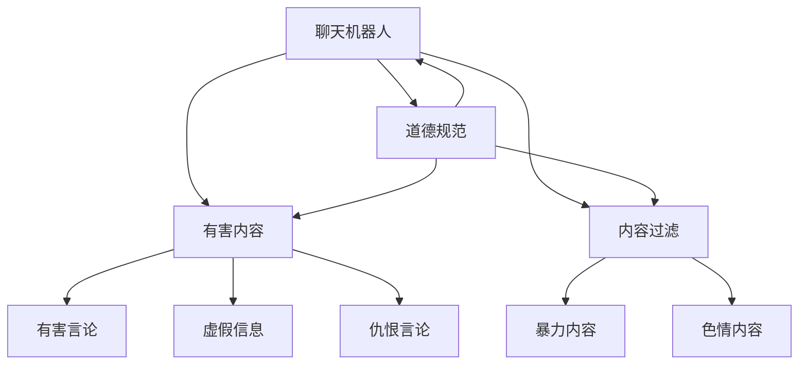

                 

# 聊天机器人道德规范：避免有害内容

> 关键词：聊天机器人,道德规范,有害内容,过滤技术,自然语言处理(NLP)

## 1. 背景介绍

随着人工智能技术的不断进步，聊天机器人已经广泛应用于各行各业，从客户服务、教育辅导到健康咨询、娱乐互动，无处不在。然而，聊天机器人在带来便利的同时，也面临着道德和伦理问题，特别是有害内容的传播，给社会带来严重的影响。例如，暴力、仇恨言论、虚假信息等，可能引发恐慌、歧视、甚至暴力行为，对社会的稳定和谐构成威胁。因此，制定一套有效的道德规范和过滤机制，对于保障聊天机器人的健康发展，构建安全的智能交互环境，具有重要的意义。

## 2. 核心概念与联系

### 2.1 核心概念概述

为更好地理解聊天机器人的道德规范和有害内容过滤技术，本节将介绍几个密切相关的核心概念：

- **聊天机器人(Chatbot)**：基于人工智能技术的自然语言处理(Natural Language Processing, NLP)应用，能够模拟人类对话，实现问答、推荐、推荐等功能。
- **道德规范(Ethical Guidelines)**：指在设计和应用聊天机器人时，需要遵守的道德原则和行为准则，确保聊天机器人的行为符合社会价值观和伦理标准。
- **有害内容(Harmful Content)**：指含有暴力、仇恨、色情、虚假等有害信息的文本或语言表达，可能引发社会不良影响。
- **内容过滤(Content Filtering)**：指通过算法和规则，自动识别并过滤掉有害内容，避免其传播的技术手段。
- **自然语言处理(NLP)**：利用计算机科学和人工智能技术，处理和理解人类语言的技术，包括文本预处理、语义分析、情感识别等。

这些核心概念之间的逻辑关系可以通过以下Mermaid流程图来展示：



这个流程图展示了一组核心概念及其之间的关系：

1. 聊天机器人通过NLP技术实现对话功能。
2. 聊天机器人的行为受道德规范指导，确保其符合社会价值观。
3. 有害内容对聊天机器人构成挑战，需要通过内容过滤技术进行防范。
4. 道德规范指导内容过滤策略，确保过滤过程公平、透明。

这些概念共同构成了聊天机器人应用的基础框架，为其健康发展提供了保障。

## 3. 核心算法原理 & 具体操作步骤
### 3.1 算法原理概述

聊天机器人的道德规范和有害内容过滤技术，主要基于自然语言处理(NLP)和机器学习(ML)技术，通过训练模型和规则，实现对有害内容的自动识别和过滤。其核心思想是：利用NLP技术对聊天内容进行文本预处理和情感识别，再结合机器学习算法对有害内容进行分类和过滤。

形式化地，假设聊天机器人从用户输入 $x$ 生成对话回复 $y$，则对话过程可以表示为：

$$
y = f(x)
$$

其中 $f$ 为聊天机器人对话生成函数，可以是基于规则的模板匹配，也可以是基于深度学习的神经网络模型。为避免有害内容的传播，需要在生成回复时，对输入 $x$ 进行过滤，确保输出的 $y$ 不会包含有害内容。

### 3.2 算法步骤详解

聊天机器人道德规范和有害内容过滤的算法主要包括以下几个步骤：

**Step 1: 定义有害内容类型**
- 根据具体应用场景，明确有害内容类型，如暴力、仇恨、色情、虚假信息等。
- 针对每种有害内容，设计相应的过滤规则和指标。

**Step 2: 文本预处理**
- 对用户输入进行分词、词性标注、去除停用词等预处理操作，降低噪声干扰。
- 通过词向量表示，将预处理后的文本转化为计算机可处理的向量形式。

**Step 3: 情感分析**
- 利用情感分析技术，识别输入文本的情感极性，如正面、负面、中性等。
- 针对不同情感极性的文本，采取不同的处理策略，如敏感词过滤、情感调节等。

**Step 4: 有害内容检测**
- 通过监督学习或无监督学习算法，训练有害内容检测模型。
- 将预处理后的文本输入模型，获取模型预测结果。

**Step 5: 有害内容过滤**
- 根据有害内容检测结果，判断是否进行过滤。
- 如果检测到有害内容，返回空字符串或提示信息，终止对话过程。

**Step 6: 对话生成**
- 根据过滤后的输入，利用聊天机器人生成函数生成回复。

**Step 7: 反馈和优化**
- 收集用户反馈，评估过滤效果，持续优化模型和规则。

### 3.3 算法优缺点

聊天机器人道德规范和有害内容过滤技术，具有以下优点：
1. 自动化过滤：利用算法自动检测和过滤有害内容，减少人工干预。
2. 实时响应：对有害内容实时检测，防止其扩散。
3. 精准度高：利用深度学习模型，可提高有害内容检测的精准度。
4. 应用广泛：适用于各类聊天机器人应用，如客户服务、健康咨询等。

同时，该技术也存在一些局限性：
1. 依赖标注数据：模型的训练和优化，依赖于大量标注的有害内容数据，标注成本较高。
2. 解释性不足：过滤过程复杂，难以解释模型内部决策逻辑。
3. 误判风险：模型可能误判无害内容为有害内容，或漏判有害内容为无害内容。
4. 隐性歧视：模型的训练数据可能存在偏见，导致过滤结果具有隐性歧视。

尽管存在这些局限性，但聊天机器人道德规范和有害内容过滤技术，仍然是当前保障聊天机器人健康发展的重要手段。未来相关研究的重点在于如何进一步降低标注成本，提高模型的透明性和公平性，减少误判和歧视，以构建更加安全和可信赖的智能交互环境。

### 3.4 算法应用领域

聊天机器人道德规范和有害内容过滤技术，已在多个领域得到了应用，以下是几个典型应用场景：

- **客户服务机器人**：通过过滤客户咨询中的有害内容，保障客户服务的质量和礼貌度，避免引发争议和投诉。
- **健康咨询机器人**：识别有害内容，避免患者因错误信息导致健康风险，保障咨询服务的准确性和安全性。
- **教育辅导机器人**：通过情感分析和有害内容过滤，引导学生建立正确的价值观，避免传播不良信息。
- **社交媒体监控**：通过实时监控和过滤有害内容，防止虚假信息传播，维护社会稳定。

这些应用场景展示了有害内容过滤技术的重要价值，但也揭示了其在实际应用中仍需面临的挑战。

## 4. 数学模型和公式 & 详细讲解 & 举例说明

### 4.1 数学模型构建

本节将使用数学语言对聊天机器人有害内容过滤技术进行更加严格的刻画。

记聊天机器人对话生成函数为 $f(x)$，其中 $x$ 为用户输入文本，$y$ 为对话回复。假设有害内容检测模型为 $M(x)$，其输出 $M(x)$ 表示文本 $x$ 是否包含有害内容。聊天机器人的对话生成过程可以表示为：

$$
y = f(x) \quad \text{s.t.} \quad M(x) = 0
$$

其中 $M(x) = 0$ 表示 $x$ 不含有害内容。

### 4.2 公式推导过程

以暴力内容检测为例，其基本流程如图：


步骤如下：

1. 将用户输入 $x$ 进行预处理，得到预处理后的文本 $x'$。
2. 利用词向量表示，将 $x'$ 转化为计算机可处理的向量 $x_v$。
3. 将 $x_v$ 输入暴力内容检测模型 $M$，获取模型预测结果 $M(x_v)$。
4. 如果 $M(x_v) = 0$，则判断 $x$ 不含暴力内容，进行正常对话生成；否则，返回提示信息或空字符串，终止对话。

### 4.3 案例分析与讲解

假设我们需要构建一个针对校园霸凌言论的检测模型，具体流程如下：

1. 收集校园霸凌相关的有害内容数据集，并进行标注。
2. 使用词向量将文本表示，如Word2Vec、BERT等。
3. 利用监督学习算法，如RNN、LSTM、BERT等，训练有害内容检测模型 $M$。
4. 在实际应用中，将用户输入 $x$ 进行预处理和向量表示，得到 $x_v$。
5. 将 $x_v$ 输入模型 $M$，获取预测结果 $M(x_v)$。
6. 如果 $M(x_v) = 0$，则进行正常对话；否则，返回提示信息，避免传播霸凌言论。

## 5. 项目实践：代码实例和详细解释说明
### 5.1 开发环境搭建

在进行有害内容过滤项目实践前，我们需要准备好开发环境。以下是使用Python进行PyTorch开发的简单环境配置流程：

1. 安装Anaconda：从官网下载并安装Anaconda，用于创建独立的Python环境。

2. 创建并激活虚拟环境：
```bash
conda create -n chatbot-env python=3.8 
conda activate chatbot-env
```

3. 安装PyTorch：根据CUDA版本，从官网获取对应的安装命令。例如：
```bash
conda install pytorch torchvision torchaudio cudatoolkit=11.1 -c pytorch -c conda-forge
```

4. 安装相关工具包：
```bash
pip install numpy pandas scikit-learn nltk transformers tokenizers
```

5. 安装相关预训练模型：
```bash
pip install bert-serving-server bert-serving-client
```

完成上述步骤后，即可在`chatbot-env`环境中开始实践。

### 5.2 源代码详细实现

下面我们以暴力内容检测为例，给出使用Transformers库进行有害内容过滤的Python代码实现。

首先，定义文本预处理函数：

```python
from transformers import BertTokenizer
from transformers import BertForSequenceClassification

tokenizer = BertTokenizer.from_pretrained('bert-base-cased')

def preprocess_text(text):
    inputs = tokenizer.encode_plus(text, add_special_tokens=True, return_tensors='pt', max_length=512, truncation=True, padding='max_length')
    return inputs['input_ids'], inputs['attention_mask']
```

然后，定义有害内容检测模型：

```python
model = BertForSequenceClassification.from_pretrained('bert-base-cased', num_labels=2)
model.to(device)
```

接着，定义暴力内容过滤函数：

```python
def filter_violence(text):
    input_ids, attention_mask = preprocess_text(text)
    outputs = model(input_ids, attention_mask=attention_mask)
    logits = outputs.logits
    probs = torch.softmax(logits, dim=-1).tolist()[0]
    if probs[1] > threshold:
        return '暴力内容'
    else:
        return '正常对话'
```

最后，启动对话生成过程：

```python
while True:
    text = input('请输入对话内容：')
    result = filter_violence(text)
    if result == '暴力内容':
        print('检测到暴力内容，对话终止！')
        break
    else:
        # 生成回复，并继续对话
        # ...
```

### 5.3 代码解读与分析

让我们再详细解读一下关键代码的实现细节：

**preprocess_text函数**：
- 使用BertTokenizer对输入文本进行分词和向量表示，返回所需的输入_ids和attention_mask。
- 利用BertForSequenceClassification进行有害内容检测，返回预测结果。

**filter_violence函数**：
- 对输入文本进行预处理，得到模型所需的向量表示。
- 利用检测模型进行有害内容预测，得到模型输出概率。
- 根据设定的阈值判断是否进行过滤，返回过滤结果。

**对话生成过程**：
- 循环读取用户输入，进行有害内容检测。
- 如果检测到暴力内容，终止对话。
- 否则，进行正常的回复生成和对话继续。

这个代码实例展示了如何利用大模型和机器学习技术，实现对有害内容的过滤。通过简单的接口设计，开发者可以很方便地将有害内容过滤功能集成到各类聊天机器人应用中。

当然，工业级的系统实现还需考虑更多因素，如模型的保存和部署、超参数的自动搜索、更灵活的任务适配层等。但核心的过滤范式基本与此类似。

## 6. 实际应用场景
### 6.1 校园霸凌检测

在校园霸凌检测应用中，有害内容过滤技术可以广泛应用于学生间的网络对话中。通过构建基于暴力、仇恨言论等有害内容的检测模型，实时监测学生间的对话内容，避免霸凌言论的传播。

具体而言，可以收集校园霸凌相关的有害内容数据集，并构建基于BERT等模型的有害内容检测模型。在学生间的对话中，实时检测对话内容，如果检测到有害内容，即时反馈给管理员进行处理。这样不仅可以防止霸凌言论的传播，还可以及时发现校园霸凌行为，保障学生的身心健康。

### 6.2 医疗咨询辅助

在医疗咨询应用中，有害内容过滤技术可以用于防止虚假信息的传播，保护患者的健康和安全。通过构建基于假药、虚假诊疗信息等有害内容的检测模型，实时监测患者咨询内容，避免误导性的信息传播。

具体而言，可以收集医疗咨询相关的有害内容数据集，并构建基于BERT等模型的有害内容检测模型。在患者咨询中，实时检测咨询内容，如果检测到有害内容，及时反馈给医生进行处理。这样不仅可以保障患者的健康，还可以提升医疗咨询的准确性和安全性。

### 6.3 社交媒体监控

在社交媒体监控应用中，有害内容过滤技术可以用于防止虚假信息的传播，维护社会的稳定和和谐。通过构建基于假新闻、仇恨言论等有害内容的检测模型，实时监测社交媒体内容，避免有害信息的扩散。

具体而言，可以收集社交媒体上的有害内容数据集，并构建基于BERT等模型的有害内容检测模型。在社交媒体平台上，实时检测用户发布的内容，如果检测到有害内容，及时反馈给平台进行处理。这样不仅可以防止虚假信息的传播，还可以维护社会的稳定和和谐。

### 6.4 未来应用展望

随着有害内容过滤技术的不断发展，其在更多领域得到应用，为社会带来新的挑战和机遇。

在智慧城市治理中，有害内容过滤技术可以用于城市事件监测、舆情分析、应急指挥等环节，提高城市管理的自动化和智能化水平，构建更安全、高效的未来城市。

在智能教育领域，有害内容过滤技术可以应用于作业批改、学情分析、知识推荐等方面，因材施教，促进教育公平，提高教学质量。

在智慧医疗领域，有害内容过滤技术可以用于医疗问答、病历分析、药物研发等环节，辅助医生诊疗，加速新药开发进程。

此外，在企业生产、社会治理、文娱传媒等众多领域，有害内容过滤技术也将不断涌现，为传统行业数字化转型升级提供新的技术路径。相信随着技术的日益成熟，有害内容过滤技术必将进一步拓展其应用边界，为人类社会带来新的福祉。

## 7. 工具和资源推荐
### 7.1 学习资源推荐

为了帮助开发者系统掌握聊天机器人有害内容过滤的理论基础和实践技巧，这里推荐一些优质的学习资源：

1. 《自然语言处理与深度学习》系列博文：由大模型技术专家撰写，深入浅出地介绍了自然语言处理原理、深度学习模型和有害内容检测技术等前沿话题。

2. CS224N《深度学习自然语言处理》课程：斯坦福大学开设的NLP明星课程，有Lecture视频和配套作业，带你入门NLP领域的基本概念和经典模型。

3. 《深度学习与自然语言处理》书籍：Deep Learning and Natural Language Processing的中文版，全面介绍了深度学习与NLP技术，包括有害内容过滤在内的多项应用。

4. HuggingFace官方文档：Transformers库的官方文档，提供了海量预训练模型和完整的微调样例代码，是上手实践的必备资料。

5. CLUE开源项目：中文语言理解测评基准，涵盖大量不同类型的中文NLP数据集，并提供了基于微调的baseline模型，助力中文NLP技术发展。

通过对这些资源的学习实践，相信你一定能够快速掌握有害内容过滤的精髓，并用于解决实际的NLP问题。

### 7.2 开发工具推荐

高效的开发离不开优秀的工具支持。以下是几款用于有害内容过滤开发的常用工具：

1. PyTorch：基于Python的开源深度学习框架，灵活动态的计算图，适合快速迭代研究。大部分预训练语言模型都有PyTorch版本的实现。

2. TensorFlow：由Google主导开发的开源深度学习框架，生产部署方便，适合大规模工程应用。同样有丰富的预训练语言模型资源。

3. Transformers库：HuggingFace开发的NLP工具库，集成了众多SOTA语言模型，支持PyTorch和TensorFlow，是进行有害内容过滤任务的开发的利器。

4. Weights & Biases：模型训练的实验跟踪工具，可以记录和可视化模型训练过程中的各项指标，方便对比和调优。与主流深度学习框架无缝集成。

5. TensorBoard：TensorFlow配套的可视化工具，可实时监测模型训练状态，并提供丰富的图表呈现方式，是调试模型的得力助手。

6. Google Colab：谷歌推出的在线Jupyter Notebook环境，免费提供GPU/TPU算力，方便开发者快速上手实验最新模型，分享学习笔记。

合理利用这些工具，可以显著提升有害内容过滤任务的开发效率，加快创新迭代的步伐。

### 7.3 相关论文推荐

有害内容过滤技术的发展源于学界的持续研究。以下是几篇奠基性的相关论文，推荐阅读：

1. Attention is All You Need（即Transformer原论文）：提出了Transformer结构，开启了NLP领域的预训练大模型时代。

2. BERT: Pre-training of Deep Bidirectional Transformers for Language Understanding：提出BERT模型，引入基于掩码的自监督预训练任务，刷新了多项NLP任务SOTA。

3. Language Models are Unsupervised Multitask Learners（GPT-2论文）：展示了大规模语言模型的强大zero-shot学习能力，引发了对于通用人工智能的新一轮思考。

4. Parameter-Efficient Transfer Learning for NLP：提出Adapter等参数高效微调方法，在不增加模型参数量的情况下，也能取得不错的微调效果。

5. Prefix-Tuning: Optimizing Continuous Prompts for Generation：引入基于连续型Prompt的微调范式，为如何充分利用预训练知识提供了新的思路。

6. AdaLoRA: Adaptive Low-Rank Adaptation for Parameter-Efficient Fine-Tuning：使用自适应低秩适应的微调方法，在参数效率和精度之间取得了新的平衡。

这些论文代表了大语言模型有害内容过滤技术的发展脉络。通过学习这些前沿成果，可以帮助研究者把握学科前进方向，激发更多的创新灵感。

## 8. 总结：未来发展趋势与挑战

### 8.1 总结

本文对聊天机器人有害内容过滤技术进行了全面系统的介绍。首先阐述了有害内容过滤技术的研究背景和意义，明确了过滤技术在保障聊天机器人健康发展、构建智能交互环境中的重要价值。其次，从原理到实践，详细讲解了有害内容过滤的数学原理和关键步骤，给出了过滤任务开发的完整代码实例。同时，本文还广泛探讨了有害内容过滤技术在多个行业领域的应用前景，展示了过滤技术的重要价值。此外，本文精选了有害内容过滤技术的各类学习资源，力求为读者提供全方位的技术指引。

通过本文的系统梳理，可以看到，有害内容过滤技术正在成为聊天机器人健康发展的重要保障，极大地拓展了自然语言处理技术的应用边界，催生了更多的落地场景。受益于大规模语料的预训练和机器学习技术的进步，有害内容过滤模型在精度和泛化性上取得了显著进展。未来，伴随技术的不断演进，有害内容过滤技术必将在构建安全、可信赖的智能交互环境方面发挥更大的作用。

### 8.2 未来发展趋势

展望未来，有害内容过滤技术将呈现以下几个发展趋势：

1. 模型规模持续增大。随着算力成本的下降和数据规模的扩张，有害内容检测模型的参数量还将持续增长。超大规模模型蕴含的丰富语言知识，有望支撑更加复杂多变的有害内容检测任务。

2. 检测技术日趋多样。除了传统的监督学习和无监督学习外，未来会涌现更多高效的检测方法，如BERT-CoVe、XLM等，在提高检测精度的同时，减少计算资源消耗。

3. 实时性需求提升。随着应用场景的增多，有害内容检测技术的实时性需求日益增长。需要在不增加过多计算成本的前提下，提升检测速度和准确度。

4. 多模态融合。当前的有害内容检测主要聚焦于文本数据，未来会进一步拓展到图像、视频、语音等多模态数据检测。多模态信息的融合，将显著提升有害内容检测的全面性和鲁棒性。

5. 跨领域应用拓展。有害内容过滤技术将在更多领域得到应用，如医疗、法律、教育等，为这些领域的智能应用提供保障。

6. 安全性增强。随着有害内容检测技术的广泛应用，安全性成为重要课题。需要引入更多的技术手段，如数据加密、隐私保护等，确保用户隐私和数据安全。

以上趋势凸显了有害内容过滤技术的广阔前景。这些方向的探索发展，必将进一步提升有害内容检测的性能和应用范围，为构建安全、可靠、可信赖的智能交互环境铺平道路。

### 8.3 面临的挑战

尽管有害内容过滤技术已经取得了瞩目成就，但在迈向更加智能化、普适化应用的过程中，它仍面临着诸多挑战：

1. 标注成本瓶颈。有害内容标注数据获取成本较高，对大规模标注数据的需求，可能成为有害内容检测技术的瓶颈。如何进一步降低标注成本，提高数据获取效率，将是一大难题。

2. 模型鲁棒性不足。当前有害内容检测模型面对域外数据时，泛化性能往往大打折扣。对于测试样本的微小扰动，检测模型的输出容易发生波动。如何提高有害内容检测模型的鲁棒性，避免误判和漏判，还需要更多理论和实践的积累。

3. 资源消耗巨大。有害内容检测模型的计算量较大，可能面临资源消耗巨大的问题。如何在保证检测精度的前提下，优化模型结构，提升计算效率，是亟待解决的问题。

4. 模型公平性问题。有害内容检测模型可能存在偏见，导致对某些群体的检测效果不佳。如何构建公平、透明的有害内容检测模型，减少隐性歧视，将是一大挑战。

5. 技术风险与法律问题。有害内容检测技术可能引发技术风险和法律问题，如过度过滤、侵犯隐私等。如何平衡技术应用与法律规范，保障技术安全合规，是未来发展的重要课题。

6. 隐性偏见与伦理问题。有害内容检测模型可能学习到数据中的隐性偏见，导致对某些群体的检测效果不佳。如何构建公平、透明的有害内容检测模型，减少隐性歧视，将是一大挑战。

这些挑战凸显了有害内容过滤技术的复杂性和多样性。只有在技术、伦理、法律等各个维度进行全面优化，才能构建更加安全、可靠、公平的有害内容检测系统。

### 8.4 未来突破

面对有害内容过滤技术所面临的种种挑战，未来的研究需要在以下几个方面寻求新的突破：

1. 探索无监督和半监督检测方法。摆脱对大规模标注数据的依赖，利用自监督学习、主动学习等无监督和半监督范式，最大限度利用非结构化数据，实现更加灵活高效的检测。

2. 研究参数高效和计算高效的检测范式。开发更加参数高效的检测方法，在固定大部分预训练参数的同时，只更新极少量的任务相关参数。同时优化检测模型的计算图，减少前向传播和反向传播的资源消耗，实现更加轻量级、实时性的部署。

3. 引入更多先验知识。将符号化的先验知识，如知识图谱、逻辑规则等，与神经网络模型进行巧妙融合，引导检测过程学习更准确、合理的语言模型。同时加强不同模态数据的整合，实现视觉、语音等多模态信息与文本信息的协同建模。

4. 结合因果分析和博弈论工具。将因果分析方法引入有害内容检测模型，识别出模型决策的关键特征，增强输出解释的因果性和逻辑性。借助博弈论工具刻画人机交互过程，主动探索并规避模型的脆弱点，提高系统稳定性。

5. 纳入伦理道德约束。在模型训练目标中引入伦理导向的评估指标，过滤和惩罚有偏见、有害的输出倾向。同时加强人工干预和审核，建立模型行为的监管机制，确保输出符合人类价值观和伦理道德。

这些研究方向的探索，必将引领有害内容过滤技术迈向更高的台阶，为构建安全、可靠、可信赖的智能交互环境提供新的技术路径。面向未来，有害内容过滤技术还需要与其他人工智能技术进行更深入的融合，如知识表示、因果推理、强化学习等，多路径协同发力，共同推动有害内容检测技术的进步。只有勇于创新、敢于突破，才能不断拓展有害内容检测技术的边界，让智能技术更好地造福人类社会。

## 9. 附录：常见问题与解答

**Q1：有害内容过滤技术是否适用于所有聊天机器人应用？**

A: 有害内容过滤技术在大多数聊天机器人应用中都能取得不错的效果，特别是对于需要保障用户安全和礼貌度的应用。但对于一些特定领域的聊天机器人，如医疗咨询、教育辅导等，还需结合领域特点进行优化。例如，在医疗咨询应用中，可能需要构建更加专业的医疗术语检测模型，避免误判医疗专业术语。

**Q2：有害内容检测技术的准确率如何保证？**

A: 有害内容检测技术的准确率受多种因素影响，包括标注数据的质量、检测模型的设计和训练、有害内容类型的复杂性等。为了提高准确率，可以采取以下策略：
1. 收集大量标注数据，并进行严格的标注审查，减少误标注和噪音数据。
2. 设计合适的模型结构，如BERT、LSTM等，并结合迁移学习和多任务学习，提高泛化能力。
3. 引入对抗样本训练和数据增强技术，增强模型鲁棒性。
4. 定期更新和优化模型，确保其与时俱进，适应新的有害内容类型和传播方式。

**Q3：有害内容检测技术是否会对用户的隐私和自由造成影响？**

A: 有害内容检测技术在保障用户安全和健康的同时，确实会对用户的隐私和自由造成一定的影响。例如，在智能客服应用中，用户可能会感觉到被监控，不自在。为了平衡技术应用与用户隐私自由，可以采取以下策略：
1. 明确告知用户有害内容检测的实施情况，尊重用户的选择权。
2. 最小化有害内容检测的数据范围，仅检测与用户输入相关的有害内容。
3. 设置严格的隐私保护措施，如数据加密、匿名化等，保护用户隐私。
4. 定期进行隐私评估和合规审查，确保技术应用符合法律法规和伦理标准。

**Q4：有害内容检测技术是否会对内容的真实性进行审查？**

A: 有害内容检测技术主要关注文本内容的真实性和可信度，并不直接涉及内容的真实性审查。例如，在医疗咨询应用中，有害内容检测技术可以用于防止虚假诊疗信息的传播，但无法判断诊疗信息是否真实可信。因此，有害内容检测技术不能替代真实性审查，还需要结合其他技术手段，如专家评审、数据交叉验证等，共同保障内容质量。

**Q5：有害内容检测技术是否会对内容的创新性造成影响？**

A: 有害内容检测技术主要是对有害内容进行过滤，并不直接涉及内容的创新性。例如，在创意写作应用中，有害内容检测技术可以用于防止暴力、仇恨等内容的传播，但不会对用户的创作自由造成限制。然而，一些具有创新性的、但同时可能带有轻微负面影响的文本内容，如黑色幽默、讽刺等，需要在设计和实施过程中进行精细化管理，避免过度限制用户创作自由。

**Q6：有害内容检测技术是否会对内容的语言风格造成影响？**

A: 有害内容检测技术主要是对有害内容进行过滤，并不直接涉及内容的语言风格。例如，在文学创作应用中，有害内容检测技术可以用于防止暴力、仇恨等内容的传播，但不会对用户的语言风格造成限制。然而，一些具有攻击性、不当表达的语言风格，需要在设计和实施过程中进行精细化管理，避免用户利用不当语言风格进行有害内容传播。

通过以上常见问题的解答，可以更好地理解有害内容过滤技术的实际应用和潜在影响，为技术设计和实施提供参考。

---

作者：禅与计算机程序设计艺术 / Zen and the Art of Computer Programming

