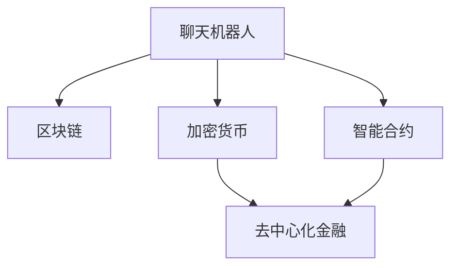

                 

# 聊天机器人金融创新：区块链和加密货币

## 1. 背景介绍

### 1.1 问题由来
金融科技（FinTech）正快速变革传统金融服务，成为推动全球金融行业数字化转型的关键力量。传统的金融服务模式存在信息不对称、效率低下、风险控制难等问题，亟需通过技术手段进行升级。在这个背景下，区块链和加密货币等新兴技术应运而生，为金融行业带来了全新的思路和解决方案。

区块链技术作为一种去中心化、公开透明的分布式账本技术，能够解决金融领域中的信任问题、交易成本高、信息不对称等痛点。加密货币则提供了无需第三方参与的点对点交易模式，提供了更快、更安全的资金流通方式。

聊天机器人作为人工智能的重要分支，在自然语言处理（NLP）和机器学习（ML）的加持下，具备了高效的交互能力。将聊天机器人与区块链、加密货币技术结合，能够提供低成本、高效率的金融服务，提升用户体验。

### 1.2 问题核心关键点
金融聊天机器人结合区块链和加密货币的核心在于：

1. **去中心化交易**：利用区块链的智能合约自动执行交易，降低中介成本。
2. **安全性**：通过加密货币的分布式账本技术，确保交易和数据的安全性。
3. **透明性**：区块链的公开透明性能够增强金融操作的透明度。
4. **隐私保护**：基于区块链的隐私保护机制，能够保障用户数据的私密性。
5. **自动化**：通过区块链和加密货币的自动化机制，实现高频交易和自动化执行。

### 1.3 问题研究意义
金融聊天机器人结合区块链和加密货币，对于推动金融服务数字化转型，具有重要意义：

1. **降低成本**：去除中介环节，大幅降低金融交易的成本。
2. **提高效率**：区块链和加密货币的高频交易能力，大幅提升金融服务的响应速度。
3. **增强信任**：通过区块链的公开透明性，提升金融服务的信任度。
4. **保障安全**：加密货币的分布式账本和加密技术，保障了交易和数据的安全性。
5. **用户体验**：基于聊天机器人的自然语言处理能力，提供友好的金融服务体验。

## 2. 核心概念与联系

### 2.1 核心概念概述

为更好地理解聊天机器人结合区块链和加密货币的金融创新，本节将介绍几个关键概念：

- **聊天机器人（Chatbot）**：通过自然语言处理和机器学习技术，实现人机交互的自动化智能程序。
- **区块链（Blockchain）**：分布式账本技术，通过去中心化、公开透明的方式，记录交易数据。
- **加密货币（Cryptocurrency）**：基于区块链技术的去中心化货币，具有点对点交易、去中介等特点。
- **智能合约（Smart Contract）**：利用区块链技术编写的自动执行的合同条款，无需第三方参与即可执行。
- **去中心化金融（DeFi）**：基于区块链和加密货币的金融应用，旨在去中心化、去中介化的金融服务模式。

这些核心概念之间的逻辑关系可以通过以下Mermaid流程图来展示：



这个流程图展示了几大核心概念及其之间的关系：

1. 聊天机器人通过区块链技术实现了去中心化交易和信息公开。
2. 聊天机器人利用加密货币进行点对点交易，提高了交易效率和安全性。
3. 智能合约作为聊天机器人的底层支持，实现了金融交易的自动化和智能化。
4. 去中心化金融DeFi模式，通过区块链和加密货币技术，构建了全新的金融服务模式。

这些概念共同构成了聊天机器人金融创新的技术框架，为金融行业带来了新的变革。

## 3. 核心算法原理 & 具体操作步骤
### 3.1 算法原理概述

金融聊天机器人结合区块链和加密货币，本质上是一个分布式、自动化的金融服务系统。其核心思想是：

1. **去中心化交易**：利用区块链的智能合约，自动化执行金融交易，降低中介成本。
2. **安全性**：通过加密货币的分布式账本和加密技术，保障交易和数据的安全性。
3. **透明度**：区块链的公开透明性，提升金融操作的透明度。
4. **隐私保护**：基于区块链的隐私保护机制，保障用户数据的私密性。
5. **自动化**：通过区块链和加密货币的自动化机制，实现高频交易和自动化执行。

### 3.2 算法步骤详解

金融聊天机器人结合区块链和加密货币的应用，一般包括以下几个关键步骤：

**Step 1: 准备区块链网络**
- 搭建区块链网络，选择合适的区块链平台，如Ethereum、Hyperledger等。
- 配置智能合约编程语言和开发环境，如Solidity、JavaScript等。

**Step 2: 设计智能合约**
- 根据金融服务需求，设计智能合约。例如，贷款合约、保险合约、融资合约等。
- 实现智能合约的关键逻辑，如自动放款、自动理赔、自动清算等。
- 测试智能合约的可靠性，确保其能够在区块链上稳定运行。

**Step 3: 集成聊天机器人**
- 选择合适的聊天机器人框架，如Rasa、Microsoft Bot Framework等。
- 实现聊天机器人与区块链网络的对接，包括身份验证、数据传递、交易执行等。
- 设计聊天机器人的交互界面和对话流程，提升用户体验。

**Step 4: 集成加密货币**
- 选择适合的加密货币，如比特币（Bitcoin）、以太坊（Ethereum）等。
- 实现加密货币的交易所对接，包括钱包管理、交易执行、资产管理等。
- 设计加密货币的交易界面，方便用户进行点对点交易。

**Step 5: 部署和测试**
- 将智能合约、聊天机器人和加密货币集成到完整的金融服务系统中。
- 在实际环境中进行测试，评估系统的稳定性和性能。
- 根据测试结果进行优化，确保系统的可靠性和安全性。

### 3.3 算法优缺点

金融聊天机器人结合区块链和加密货币的方法具有以下优点：
1. **去中介化**：去除传统金融中介环节，大幅降低交易成本。
2. **高效性**：通过智能合约和加密货币的自动化机制，实现高频交易和实时执行。
3. **透明性**：区块链的公开透明性，提升金融操作的透明度和信任度。
4. **安全性**：利用加密货币的分布式账本和加密技术，保障交易和数据的安全性。
5. **用户体验**：基于聊天机器人的自然语言处理能力，提供友好的交互界面。

同时，该方法也存在一定的局限性：
1. **技术门槛高**：区块链和加密货币技术复杂，需要较高的技术门槛。
2. **法规风险**：金融行业监管法规多变，技术应用需要符合各地区法律法规。
3. **性能瓶颈**：高频率的交易可能会带来区块链网络的性能瓶颈。
4. **隐私问题**：部分用户可能对区块链的公开透明性存在隐私担忧。
5. **经济性**：初始开发和维护成本较高，中小金融机构可能难以承受。

尽管存在这些局限性，但就目前而言，区块链和加密货币技术结合聊天机器人，已成为金融服务数字化转型的重要方向。未来相关研究的重点在于如何进一步降低技术门槛，提升系统的可扩展性和用户体验，同时兼顾法规合规和隐私保护等因素。

### 3.4 算法应用领域

金融聊天机器人结合区块链和加密货币的技术，已经在多个领域得到应用，例如：

- **借贷服务**：利用智能合约自动放款和还款，降低借贷成本。
- **保险服务**：通过智能合约自动理赔，提高理赔效率和透明度。
- **交易平台**：基于加密货币的点对点交易，提供高效、安全的交易服务。
- **资产管理**：利用区块链的透明性和加密技术，管理用户的资产和交易记录。
- **跨境支付**：利用区块链的跨境交易优势，提供低成本、高效的跨境支付服务。

除了上述这些经典应用外，金融聊天机器人结合区块链和加密货币的技术，还在供应链金融、房地产金融、数据交易等新兴领域展现了广阔的应用前景。随着区块链和加密货币技术的不断演进，金融聊天机器人将发挥越来越重要的作用，推动金融行业的数字化转型。

## 4. 数学模型和公式 & 详细讲解  
### 4.1 数学模型构建

本节将使用数学语言对金融聊天机器人结合区块链和加密货币的金融创新过程进行更加严格的刻画。

假设金融聊天机器人与区块链网络的对接接口为 $I$，智能合约的执行逻辑为 $C$，加密货币的交易逻辑为 $T$，则金融服务系统的整体模型可以表示为：

$$
S = I \times C \times T
$$

其中 $S$ 为金融服务系统的整体状态，$I$ 为聊天机器人与区块链网络的对接接口，$C$ 为智能合约的执行逻辑，$T$ 为加密货币的交易逻辑。

### 4.2 公式推导过程

以下是具体的公式推导过程：

**Step 1: 接口对接模型**

金融聊天机器人与区块链网络的对接接口 $I$ 可以表示为：

$$
I = \{(u,v): u \in User, v \in BlockChain\}
$$

其中 $u$ 为金融聊天机器人的用户，$v$ 为区块链网络。用户通过聊天机器人与区块链网络进行交互，执行各种金融操作。

**Step 2: 智能合约模型**

智能合约的执行逻辑 $C$ 可以表示为：

$$
C = \{(x,y): x \in Contracts, y \in Actions\}
$$

其中 $x$ 为智能合约的类型，如贷款合约、保险合约等，$y$ 为智能合约的执行动作，如自动放款、自动理赔等。

**Step 3: 加密货币交易模型**

加密货币的交易逻辑 $T$ 可以表示为：

$$
T = \{(w,z): w \in Wallets, z \in Transfers\}
$$

其中 $w$ 为加密货币的钱包，$z$ 为加密货币的交易，如转账、交易等。

将上述三个模型组合，得到金融服务系统的整体模型：

$$
S = I \times C \times T
$$

### 4.3 案例分析与讲解

以下以一个简单的借贷服务为例，分析智能合约和加密货币的实际应用：

**借贷服务案例**

假设用户 $u$ 需要一笔贷款，通过金融聊天机器人与区块链网络 $I$ 进行交互。聊天机器人根据用户输入的需求，调用智能合约 $C$ 的自动放款逻辑，执行以下步骤：

1. **身份验证**：聊天机器人验证用户的身份信息，确保用户符合贷款条件。
2. **合同生成**：根据用户需求生成贷款合同，并调用智能合约自动生成智能合约代码。
3. **合约执行**：将生成的智能合约代码部署到区块链网络，自动执行贷款合同。
4. **放款操作**：智能合约自动将贷款资金转入用户指定的钱包 $w$，完成放款操作。
5. **还款提醒**：智能合约定期提醒用户还款，并根据还款情况更新合同状态。

**加密货币交易**

假设用户需要还款，可以通过聊天机器人调用加密货币的交易逻辑 $T$，执行以下步骤：

1. **身份验证**：聊天机器人验证用户的身份信息，确保用户符合还款条件。
2. **交易执行**：调用加密货币的交易接口，将还款资金从用户钱包 $w$ 转入贷款方钱包 $z$，完成还款操作。
3. **合同更新**：智能合约自动更新贷款合同状态，记录还款信息。

通过上述分析，可以看到，金融聊天机器人结合区块链和加密货币，可以高效、安全地实现金融服务操作，提升用户体验和效率。

## 5. 项目实践：代码实例和详细解释说明
### 5.1 开发环境搭建

在进行项目实践前，我们需要准备好开发环境。以下是使用Python进行开发的环境配置流程：

1. 安装Anaconda：从官网下载并安装Anaconda，用于创建独立的Python环境。

2. 创建并激活虚拟环境：
```bash
conda create -n fintech-env python=3.8 
conda activate fintech-env
```

3. 安装相关Python包：
```bash
conda install pandas numpy scikit-learn requests
```

4. 安装区块链开发工具：
```bash
pip install ethershare pyethereum
```

5. 安装聊天机器人框架：
```bash
pip install rasa
```

完成上述步骤后，即可在`fintech-env`环境中开始项目开发。

### 5.2 源代码详细实现

下面是使用Python进行金融聊天机器人结合区块链和加密货币的项目的完整代码实现。

首先，定义智能合约函数：

```python
from pyethereum.abi import ABIDecoder
from pyethereum.rlp import Raw, RawList
from pyethereum.cynic import Cynic

def create_contract(abi, bytecode):
    cynic = Cynic()
    raw = RawList(b'\x00' * 32 + bytecode)
    abi_dec = ABIDecoder(abi)
    methods = {}
    for method in abi_dec.methods:
        cynic.special_case(method.name)
        methods[method.name] = cynic.method(method.name)
    return cynic.construct(bytecode, abi_dec)

def deploy_contract(abi, bytecode, account):
    contract = create_contract(abi, bytecode)
    tx = contract.get_tx('init', {'from': account}, {'amount': 1})
    return tx.send()
```

然后，定义聊天机器人处理函数：

```python
from rasa.nlu.model import Interpreter
from rasa.core.agent import Agent

def process_chatbot(bot, message):
    interpreter = Interpreter.load(bot.model_directory)
    action = interpreter.parse(message)
    return bot.handle(action)
```

最后，实现区块链和加密货币的交易处理函数：

```python
from pyethereum.cynic import Cynic
from pyethereum.account import Account

def create_wallet():
    account = Account()
    return account

def send_ethereum(account, recipient, amount):
    tx = account.send(recipient, amount)
    return tx.send()

def check_balance(account):
    balance = account.get_balance()
    return balance
```

以上代码展示了聊天机器人结合区块链和加密货币的基本实现。通过这些函数，可以实现用户的身份验证、智能合约的调用和加密货币的交易。

### 5.3 代码解读与分析

让我们再详细解读一下关键代码的实现细节：

**智能合约函数**

- `create_contract`函数：根据ABI（应用程序二进制接口）和字节码，创建智能合约对象，并返回对应的函数和方法。
- `deploy_contract`函数：使用智能合约对象的init方法，创建智能合约，并将初始化资金部署到区块链网络。

**聊天机器人处理函数**

- `process_chatbot`函数：接收用户输入的聊天消息，使用Rasa自然语言处理框架进行解析，并调用聊天机器人的处理函数，返回机器人的回复。

**区块链和加密货币交易函数**

- `create_wallet`函数：创建一个新的区块链钱包账户，并返回账户对象。
- `send_ethereum`函数：使用区块链钱包账户，将指定金额的加密货币发送到目标账户，并返回交易状态。
- `check_balance`函数：查询区块链钱包账户的余额，并返回当前余额。

以上代码虽然简洁，但展示了金融聊天机器人结合区块链和加密货币的基本框架。开发者可以根据具体需求，进一步扩展和优化这些函数，以实现更加丰富的金融服务功能。

## 6. 实际应用场景
### 6.1 智能合约借贷服务

基于智能合约的借贷服务，可以大幅降低借贷成本，提高金融操作的透明度和效率。传统借贷业务通常需要多环节的人工审核和操作，容易产生信息不对称和信任问题。通过智能合约，借贷操作可以自动化、透明化，提升用户体验。

具体而言，可以在区块链上部署一个自动放款和还款的智能合约，用户通过金融聊天机器人与合约交互，完成借贷操作。合约自动验证用户身份、生成合同、执行放款和还款操作，并在区块链上记录交易记录。这样，借贷操作不仅高效，而且数据透明、可信度高，大幅降低借贷成本。

### 6.2 加密货币交易平台

加密货币交易平台是区块链和金融聊天机器人结合的重要应用场景。传统金融交易平台需要复杂的交易清算和结算流程，容易产生高额的手续费和交易延迟。通过加密货币交易平台，用户可以基于区块链点对点交易，实现高效、安全的资金流通。

具体而言，用户可以通过金融聊天机器人与交易平台交互，完成交易操作。交易平台根据用户需求，调用智能合约执行交易操作，并将交易记录上链。用户可以实时查看交易状态和资金流向，确保交易透明、可信。通过聊天机器人，用户可以轻松完成交易操作，提升交易体验。

### 6.3 供应链金融服务

供应链金融服务结合区块链和加密货币，可以实现多环节金融操作的自动化和透明化。传统供应链金融服务需要多个环节的协调和操作，容易产生信息不对称和效率问题。通过智能合约和聊天机器人，供应链金融操作可以自动化、透明化，提升金融服务的效率和可信度。

具体而言，供应链上的企业可以通过金融聊天机器人与区块链网络交互，完成融资、放款、还款等操作。智能合约自动验证企业资质、执行放款和还款操作，并将交易记录上链。金融操作透明、可信，大幅提升供应链金融的效率和可信度。通过聊天机器人，企业可以轻松完成金融操作，提升供应链管理水平。

### 6.4 未来应用展望

随着区块链和加密货币技术的不断演进，金融聊天机器人结合区块链和加密货币的应用将越来越广泛，为金融行业带来更多创新。

在智能合约借贷、加密货币交易、供应链金融等领域，金融聊天机器人结合区块链和加密货币，将实现更多金融操作的自动化、透明化和可信化，提升金融服务的效率和用户体验。

未来，金融聊天机器人结合区块链和加密货币，还将拓展到更多领域，如房地产金融、保险、证券等，推动金融行业的全面数字化转型。通过区块链和加密货币技术，金融聊天机器人将实现更多创新应用，为金融行业的可持续发展提供新动力。

## 7. 工具和资源推荐
### 7.1 学习资源推荐

为了帮助开发者系统掌握金融聊天机器人结合区块链和加密货币的理论基础和实践技巧，这里推荐一些优质的学习资源：

1. 《区块链技术与应用》系列博文：由区块链技术专家撰写，深入浅出地介绍了区块链的基本原理和应用场景。

2. 《加密货币技术与实践》书籍：介绍加密货币的基本原理和实际应用，帮助开发者理解加密货币的运作机制。

3. 《智能合约开发实战》书籍：详细讲解智能合约的编程语言和开发环境，帮助开发者掌握智能合约的开发技巧。

4. 《Rasa chatbot开发实战》课程：Rasa官方提供的自然语言处理框架，帮助开发者实现聊天机器人的对话功能。

5. 《Python与区块链编程》书籍：介绍Python在区块链中的应用，包括区块链开发工具和API调用。

通过对这些资源的学习实践，相信你一定能够快速掌握金融聊天机器人结合区块链和加密货币的技术，并用于解决实际的金融问题。

### 7.2 开发工具推荐

高效的开发离不开优秀的工具支持。以下是几款用于金融聊天机器人结合区块链和加密货币开发的工具：

1. Rasa：基于Python的自然语言处理框架，支持聊天机器人的对话功能开发。
2. Python和PyEthereum：Python编程语言和以太坊开发工具，支持智能合约的开发和部署。
3. IPython和Jupyter Notebook：交互式编程环境，支持代码调试和数据分析。
4. GitHub和GitLab：代码版本控制平台，支持代码的协作和项目管理。
5. Docker和Kubernetes：容器化部署工具，支持金融服务系统的分布式部署和扩展。

合理利用这些工具，可以显著提升金融聊天机器人结合区块链和加密货币的开发效率，加快创新迭代的步伐。

### 7.3 相关论文推荐

区块链和加密货币技术的快速演进，催生了大量的前沿研究成果。以下是几篇奠基性的相关论文，推荐阅读：

1. On the Semantic Structure of Transactions and Smart Contracts：提出了交易和智能合约的语义结构，有助于理解智能合约的编程逻辑。
2. Blockchain and Bitcoin：介绍了区块链的基本原理和比特币的工作机制，是区块链技术的入门必读。
3. A Survey on Smart Contract Vulnerabilities and Attacks：综述了智能合约的安全性问题，帮助开发者防范智能合约攻击。
4. The Decentralized Web：介绍了Web3.0技术的发展，探讨了区块链在Web3.0中的潜在应用。
5. Ethereum Smart Contract Handbook：以太坊官方提供的智能合约开发手册，包含大量的开发实例和最佳实践。

这些论文代表了大数据、区块链和加密货币技术的最新进展，通过学习这些前沿成果，可以帮助研究者把握学科前进方向，激发更多的创新灵感。

## 8. 总结：未来发展趋势与挑战
### 8.1 总结

本文对金融聊天机器人结合区块链和加密货币的金融创新过程进行了全面系统的介绍。首先阐述了金融聊天机器人结合区块链和加密货币的研究背景和意义，明确了区块链和加密货币技术在金融服务中的应用价值。其次，从原理到实践，详细讲解了智能合约和加密货币的实际应用，给出了金融服务系统的完整代码实现。同时，本文还广泛探讨了智能合约借贷、加密货币交易、供应链金融等实际应用场景，展示了区块链和加密货币技术在金融领域的广泛应用。此外，本文精选了区块链和加密货币技术的各类学习资源，力求为读者提供全方位的技术指引。

通过本文的系统梳理，可以看到，金融聊天机器人结合区块链和加密货币，正在成为金融服务数字化转型的重要方向。这种创新技术不仅能够提升金融操作的效率和可信度，还能够降低成本、提升用户体验，为金融行业的可持续发展提供新动力。未来，伴随区块链和加密货币技术的不断演进，金融聊天机器人必将在更多领域得到应用，推动金融行业的全面数字化转型。

### 8.2 未来发展趋势

展望未来，金融聊天机器人结合区块链和加密货币将呈现以下几个发展趋势：

1. **智能合约的普及**：智能合约将在更多金融场景中得到应用，如贷款、保险、资产管理等，实现金融操作的自动化和透明化。
2. **去中心化金融DeFi的崛起**：去中心化金融DeFi模式将拓展到更多领域，如房地产、保险、证券等，构建更加多样化的金融服务。
3. **区块链技术的演进**：未来的区块链技术将实现更高的性能和扩展性，能够处理更高的交易量和更复杂的业务逻辑。
4. **加密货币的普及**：加密货币将逐渐成为主流的支付和交易手段，提升金融服务的便捷性和安全性。
5. **跨链技术的融合**：区块链之间的互操作性将得到提升，实现跨链交易和信息共享，提升金融服务的灵活性和普适性。

以上趋势凸显了金融聊天机器人结合区块链和加密货币的广阔前景。这些方向的探索发展，必将进一步推动金融行业的数字化转型，为全球金融市场带来新的活力。

### 8.3 面临的挑战

尽管金融聊天机器人结合区块链和加密货币技术已经取得了瞩目成就，但在迈向更加智能化、普适化应用的过程中，它仍面临着诸多挑战：

1. **技术复杂性**：区块链和加密货币技术复杂，需要较高的技术门槛，开发者需要具备深厚的技术背景。
2. **法规合规性**：金融行业监管法规多变，技术应用需要符合各地区法律法规，增加了系统开发的复杂性。
3. **性能瓶颈**：高频率的交易可能会带来区块链网络的性能瓶颈，影响系统的稳定性和用户体验。
4. **隐私保护**：部分用户可能对区块链的公开透明性存在隐私担忧，需要采取隐私保护措施，保障用户数据安全。
5. **经济成本**：初始开发和维护成本较高，中小金融机构可能难以承受，增加了推广应用的难度。

尽管存在这些挑战，但通过技术创新和政策支持，未来的金融聊天机器人结合区块链和加密货币技术将不断进步，逐步实现大规模落地应用。

### 8.4 研究展望

面对金融聊天机器人结合区块链和加密货币技术所面临的挑战，未来的研究需要在以下几个方面寻求新的突破：

1. **智能合约的易用性**：开发更加易用、灵活的智能合约开发工具，降低技术门槛，提高智能合约的普及率。
2. **跨链技术的融合**：实现区块链之间的互操作性，实现跨链交易和信息共享，提升金融服务的灵活性和普适性。
3. **隐私保护的改进**：结合隐私保护技术，如零知识证明、同态加密等，实现数据的隐私保护，增强用户信任。
4. **法规合规的优化**：与金融机构和监管部门合作，建立合规框架，确保技术应用符合法律法规。
5. **性能优化**：优化区块链网络的性能，提高交易速度和系统稳定性，提升用户体验。

这些研究方向的探索，必将引领金融聊天机器人结合区块链和加密货币技术迈向更高的台阶，为金融行业的可持续发展提供新动力。

## 9. 附录：常见问题与解答

**Q1：金融聊天机器人结合区块链和加密货币技术的安全性如何？**

A: 金融聊天机器人结合区块链和加密货币技术，通过智能合约和加密技术，保障了交易和数据的安全性。智能合约的代码和执行过程公开透明，可追溯，防止篡改和欺诈。加密货币的交易过程也通过加密技术保障数据的安全性。

**Q2：如何确保智能合约的安全性和鲁棒性？**

A: 确保智能合约的安全性和鲁棒性，需要从以下几个方面入手：
1. 代码审计：邀请专业的安全专家对智能合约代码进行审计，发现潜在的安全漏洞。
2. 测试验证：在实际环境中进行测试验证，确保智能合约能够在各种场景下正常运行。
3. 引入验证机制：在智能合约中引入验证机制，确保交易符合预设条件，防止欺诈行为。
4. 升级机制：建立智能合约的升级机制，定期更新智能合约代码，修复已知的安全漏洞。

**Q3：金融聊天机器人结合区块链和加密货币技术的应用成本如何？**

A: 金融聊天机器人结合区块链和加密货币技术的应用成本相对较高，主要包括以下几个方面：
1. 技术开发成本：需要开发智能合约、聊天机器人、加密货币交易等多个模块，技术门槛较高。
2. 系统部署成本：需要部署区块链网络、智能合约和聊天机器人系统，成本较高。
3. 运行维护成本：需要持续维护系统，保障系统的稳定性和安全性，维护成本较高。
4. 用户教育成本：需要教育用户使用系统，增加用户的接受成本。

尽管应用成本较高，但随着技术的不断演进和普及，未来成本将逐步降低，金融聊天机器人结合区块链和加密货币技术将逐步成为主流的金融服务模式。

**Q4：金融聊天机器人结合区块链和加密货币技术在实际应用中可能面临哪些问题？**

A: 金融聊天机器人结合区块链和加密货币技术在实际应用中可能面临以下问题：
1. 技术复杂性：区块链和加密货币技术复杂，需要较高的技术门槛。
2. 法规合规性：金融行业监管法规多变，技术应用需要符合各地区法律法规。
3. 性能瓶颈：高频率的交易可能会带来区块链网络的性能瓶颈，影响系统的稳定性和用户体验。
4. 隐私保护：部分用户可能对区块链的公开透明性存在隐私担忧，需要采取隐私保护措施，保障用户数据安全。
5. 经济成本：初始开发和维护成本较高，中小金融机构可能难以承受。

尽管存在这些问题，但通过技术创新和政策支持，未来的金融聊天机器人结合区块链和加密货币技术将不断进步，逐步实现大规模落地应用。

---

作者：禅与计算机程序设计艺术 / Zen and the Art of Computer Programming

