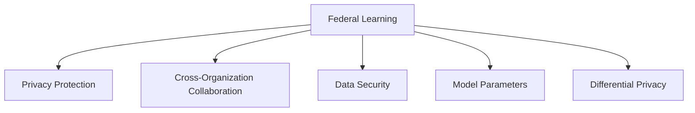

                 

# 联邦学习在隐私保护数据分析中的应用：跨组织协作

> 关键词：联邦学习, 隐私保护, 数据安全, 跨组织协作, 数据共享, 分布式机器学习

## 1. 背景介绍

### 1.1 问题由来
在数字化时代，数据成为各行各业重要的资产和资源。然而，随着数据量的爆炸性增长，单一组织难以拥有所有需要的数据，跨组织数据共享和协同分析成为必然趋势。但传统的数据共享方式存在数据泄露、隐私侵权等风险，如何既保证数据价值充分发挥，又保障数据隐私安全，成为摆在各组织面前的一大难题。

联邦学习作为一种新型的分布式机器学习方法，为跨组织数据共享提供了新的解决途径。它通过在不共享数据本身的情况下，各参与方协同训练模型，实现数据价值的最大化和隐私的保护，为数据安全和跨组织协作开创了新的时代。

### 1.2 问题核心关键点
联邦学习是一种分布式机器学习方法，通过在参与方本地训练模型，并定期交换模型参数更新，在不共享原始数据的情况下，实现对全局模型的优化。其核心在于实现数据本地化、模型协作化和隐私保护化。

联邦学习的优势包括：
- **隐私保护**：数据始终留存本地，不直接交换，避免了数据泄露风险。
- **安全可控**：通过加密通信和模型参数差分隐私等手段，确保模型更新过程的安全性和可控性。
- **高效协作**：通过多方协同训练，提升模型性能和泛化能力。
- **适应性强**：适用于多种分布式环境和数据类型，如图像、文本、音频等。

然而，联邦学习也面临一些挑战：
- **异构性问题**：不同参与方的计算资源、数据规模、模型架构等存在差异，如何协调和优化这些异构因素，是联邦学习的一大难点。
- **通信开销**：模型参数和梯度更新需要在各参与方之间频繁传输，如何降低通信开销，提高训练效率，需要不断优化。
- **安全威胁**：联邦学习过程中的数据泄露、模型参数攻击等安全问题，需要设计和实施多种安全机制以应对。

尽管如此，联邦学习在隐私保护数据分析和跨组织协作方面展现了巨大的潜力，近年来成为人工智能和数据科学领域研究的热点之一。

## 2. 核心概念与联系

### 2.1 核心概念概述

为更好地理解联邦学习在隐私保护数据分析中的应用，本节将介绍几个密切相关的核心概念：

- **联邦学习**：一种分布式机器学习方法，各参与方在不共享数据的情况下，通过协同训练模型，共同提升模型的性能和泛化能力。
- **隐私保护**：保护数据隐私，防止未经授权的访问和使用。
- **跨组织协作**：不同组织间的数据共享与合作，实现数据价值的最大化。
- **数据安全**：保护数据在存储、传输和处理过程中的安全。
- **模型参数**：模型中的权重和偏置等可训练参数。
- **差分隐私**：一种隐私保护技术，通过添加噪声来保护个体数据隐私，防止数据泄露。

这些核心概念之间的逻辑关系可以通过以下Mermaid流程图来展示：



这个流程图展示了几大核心概念之间的关系：

1. 联邦学习通过在本地训练模型，实现数据价值的最大化，同时保护隐私。
2. 数据安全是联邦学习的基础保障，防止数据在传输和存储过程中被泄露。
3. 跨组织协作是联邦学习的应用场景，不同组织间通过数据共享和协同训练，提升整体性能。
4. 模型参数是联邦学习中关键的学习对象，各参与方通过交换模型参数，实现模型优化。
5. 差分隐私是联邦学习的一种重要隐私保护手段，通过在模型训练中引入噪声，保护个体隐私。

这些概念共同构成了联邦学习的学习框架，使其能够在各种场景下发挥强大的隐私保护能力。通过理解这些核心概念，我们可以更好地把握联邦学习的理论基础和应用场景。

## 3. 核心算法原理 & 具体操作步骤
### 3.1 算法原理概述

联邦学习的核心思想是，在参与方本地训练模型，并将模型参数更新在全局聚合后，参与方重新本地训练模型，交替进行参数交换和聚合，直至收敛。

联邦学习的流程如下：
1. 初始化全局模型参数 $\theta_0$。
2. 每个参与方在本地数据上训练模型，并计算本地模型参数更新 $\Delta\theta_i$。
3. 各参与方将本地模型参数更新 $\Delta\theta_i$ 上传到中心服务器。
4. 中心服务器对上传的参数进行聚合，得到全局模型更新 $\Delta\theta_g$。
5. 中心服务器将全局模型更新 $\Delta\theta_g$ 广播给所有参与方。
6. 各参与方在本地模型参数上加上全局模型更新 $\Delta\theta_g$，更新本地模型参数 $\theta_i$。
7. 重复上述过程直至模型收敛。

形式化地，假设参与方数为 $K$，局部数据量为 $n_i$，全局数据量为 $N$，则模型参数 $\theta$ 的更新公式为：

$$
\theta_{i+1} = \theta_i - \eta \nabla L(\theta_i;\xi_i) + \frac{1}{K} \sum_{k=1}^K \Delta\theta_k
$$

其中 $\eta$ 为学习率，$\nabla L(\theta_i;\xi_i)$ 为本地模型损失对模型参数的梯度，$\xi_i$ 为本地数据集。

### 3.2 算法步骤详解

联邦学习的具体操作步骤如下：

**Step 1: 初始化模型参数**
- 初始化全局模型参数 $\theta_0$，一般设置为随机初始化或预训练模型参数。
- 确定参与方数量 $K$ 和本地数据量 $n_i$。

**Step 2: 本地训练**
- 各参与方在本地数据 $\xi_i$ 上训练模型，计算本地模型参数更新 $\Delta\theta_i = \nabla L(\theta_i;\xi_i)$。
- 采用差分隐私等隐私保护技术，加入噪声扰动 $\epsilon$，得到 $\tilde{\Delta}\theta_i$。

**Step 3: 参数上传与聚合**
- 各参与方将本地模型参数更新 $\tilde{\Delta}\theta_i$ 上传至中心服务器。
- 中心服务器对上传的参数进行加权平均，得到全局模型更新 $\tilde{\Delta}\theta_g = \frac{1}{K} \sum_{i=1}^K \tilde{\Delta}\theta_i$。

**Step 4: 模型更新**
- 中心服务器将全局模型更新 $\tilde{\Delta}\theta_g$ 广播给所有参与方。
- 各参与方在本地模型参数上加上全局模型更新，得到新的模型参数 $\theta_{i+1}$。

**Step 5: 重复迭代**
- 重复上述步骤直至模型收敛，即满足预设的迭代次数或模型性能不再提升。

### 3.3 算法优缺点

联邦学习具有以下优点：
1. **隐私保护**：数据始终留存本地，不直接交换，避免了数据泄露风险。
2. **安全性高**：通过差分隐私等技术，确保模型更新过程的安全性和可控性。
3. **分布式协作**：各参与方协同训练，提升模型性能和泛化能力。
4. **适应性强**：适用于多种分布式环境和数据类型，如图像、文本、音频等。

但联邦学习也存在一些局限性：
1. **异构性问题**：不同参与方的计算资源、数据规模、模型架构等存在差异，协调和优化这些异构因素较为复杂。
2. **通信开销**：模型参数和梯度更新需要在各参与方之间频繁传输，通信开销较大。
3. **模型一致性**：由于各参与方本地数据和模型参数不同，可能导致模型参数不一致，影响模型收敛性。
4. **中心服务器依赖**：中心服务器在数据聚合、参数广播等环节中扮演重要角色，单点故障可能导致系统失效。

尽管存在这些局限性，联邦学习在隐私保护数据分析和跨组织协作方面展现了巨大的潜力，近年来成为人工智能和数据科学领域研究的热点之一。

### 3.4 算法应用领域

联邦学习在隐私保护数据分析和跨组织协作方面具有广泛的应用前景，主要包括以下几个领域：

1. **医疗数据共享**：各医疗机构在不共享患者数据的情况下，协同训练医疗诊断模型，提高诊断准确性。
2. **金融风险评估**：不同金融机构共享客户交易数据，协同训练风险评估模型，提升风险管理能力。
3. **智能推荐系统**：电商、媒体等平台协同训练推荐模型，提升个性化推荐效果，同时保护用户隐私。
4. **网络安全分析**：不同安全机构共享网络攻击数据，协同训练攻击检测模型，提高安全防护能力。
5. **环境监测**：各环境监测机构共享监测数据，协同训练环境预测模型，提升环境监测效果。

此外，联邦学习还应用于智慧城市、智能制造、智能交通等多个领域，成为实现跨组织协作和数据共享的重要技术手段。

## 4. 数学模型和公式 & 详细讲解 & 举例说明
### 4.1 数学模型构建

在本节中，我们将使用数学语言对联邦学习的基本模型进行详细的刻画。

假设参与方数为 $K$，本地数据量为 $n_i$，全局数据量为 $N$，初始全局模型参数为 $\theta_0$。设参与方 $i$ 在本地数据 $\xi_i$ 上训练模型的损失为 $L_i(\theta_i;\xi_i)$，则联邦学习的基本模型可形式化为：

$$
\theta_{i+1} = \theta_i - \eta \nabla L_i(\theta_i;\xi_i) + \frac{1}{K} \sum_{k=1}^K \Delta\theta_k
$$

其中 $\eta$ 为学习率，$\Delta\theta_k = \nabla L_k(\theta_k;\xi_k)$ 为本地模型损失对模型参数的梯度。

### 4.2 公式推导过程

以下我们以最简单的单参与方联邦学习为例，推导模型的收敛性和训练效果。

假设参与方 $i$ 的本地数据量为 $n_i$，全局数据量为 $N$，本地模型参数为 $\theta_i$，全局模型参数为 $\theta_g$，则模型更新公式为：

$$
\theta_{i+1} = \theta_i - \eta \nabla L_i(\theta_i;\xi_i) + \Delta\theta_g
$$

其中 $\Delta\theta_g = \frac{1}{K} \sum_{k=1}^K \Delta\theta_k$ 为全局模型更新。

由于各参与方本地数据和模型参数不同，全局模型更新 $\Delta\theta_g$ 可能不完全一致。为了保证模型的一致性，可以引入正则化项，限制各参与方模型参数的差异：

$$
\theta_{i+1} = \theta_i - \eta \nabla L_i(\theta_i;\xi_i) + \Delta\theta_g - \lambda (\theta_i - \theta_g)
$$

其中 $\lambda$ 为正则化系数，确保各参与方模型参数的一致性。

联邦学习的收敛性依赖于损失函数的凸性、梯度的一致性和通信网络的稳定性。假设损失函数 $L_i$ 凸，梯度 $\nabla L_i$ 一致，通信网络无故障，则联邦学习可以收敛至全局最优解。

### 4.3 案例分析与讲解

以医疗数据共享为例，分析联邦学习在跨组织协作中的应用。

**案例背景**：假设有三家医院 $A$、$B$、$C$，共同面临疾病诊断和治疗的难题。三家医院分别收集了一定量的病人数据，但数据量较少，无法单独训练高质量的诊断模型。

**具体步骤**：
1. 三家医院协同训练一个疾病诊断模型。
2. 医院 $A$ 本地训练模型，计算模型参数更新 $\Delta\theta_A$，加入差分隐私噪声 $\epsilon$，得到 $\tilde{\Delta}\theta_A$。
3. 医院 $A$ 将 $\tilde{\Delta}\theta_A$ 上传到中心服务器。
4. 中心服务器计算全局模型更新 $\tilde{\Delta}\theta_G = \frac{1}{3} (\tilde{\Delta}\theta_A + \tilde{\Delta}\theta_B + \tilde{\Delta}\theta_C)$。
5. 中心服务器将 $\tilde{\Delta}\theta_G$ 广播给三家医院。
6. 三家医院在本地模型参数上加上全局模型更新，更新本地模型参数 $\theta_{A+1}$、$\theta_{B+1}$、$\theta_{C+1}$。
7. 重复上述步骤直至模型收敛。

**效果分析**：
- 通过联邦学习，三家医院在不共享病人数据的情况下，协同训练了高质量的诊断模型，提升了诊断准确性。
- 加入差分隐私噪声，保护了病人隐私，避免了数据泄露风险。
- 分布式训练提升了模型的泛化能力，适应不同医院的病人数据。

## 5. 项目实践：代码实例和详细解释说明
### 5.1 开发环境搭建

在进行联邦学习项目实践前，我们需要准备好开发环境。以下是使用Python进行PyTorch和Flax实现联邦学习的开发环境配置流程：

1. 安装Anaconda：从官网下载并安装Anaconda，用于创建独立的Python环境。

2. 创建并激活虚拟环境：
```bash
conda create -n federated-learning-env python=3.8 
conda activate federated-learning-env
```

3. 安装PyTorch和Flax：
```bash
pip install torch torchvision torchaudio cudatoolkit=11.1 -c pytorch -c conda-forge
pip install flax linzen flax-learn flax-cpu flax-gpu flax-random optax optax-cpu optax-gpu
```

4. 安装各类工具包：
```bash
pip install numpy pandas scikit-learn matplotlib tqdm jupyter notebook ipython
```

完成上述步骤后，即可在`federated-learning-env`环境中开始联邦学习实践。

### 5.2 源代码详细实现

这里我们以简单的二分类任务为例，给出使用PyTorch和Flax实现联邦学习的代码实现。

首先，定义模型和损失函数：

```python
from flax import linen as nn
from flax import optim
import jax.numpy as jnp
from flax import train

class Model(nn.Module):
    def setup(self):
        self.linear = nn.Dense(1)

    def __call__(self, x):
        return self.linear(x)

class Loss(nn.Module):
    def setup(self):
        pass

    def __call__(self, y_true, y_pred):
        return jnp.mean((y_true - y_pred)**2)
```

然后，定义联邦学习的优化器和数据处理函数：

```python
optimizer = optim.AdamW(learning_rate=0.001)
batch_size = 32

def train_step(params, batch):
    features, labels = batch
    with train.utils.one_step_checkpoint():
        loss = Loss()(features, labels)
        params = optimizer.update(params, loss, params)
    return params, loss

def get_data(train_data, test_data):
    train_dataset = train_data.shuffle(batch_size).batch(batch_size)
    test_dataset = test_data.batch(batch_size)
    return train_dataset, test_dataset
```

接着，定义联邦学习的基本流程：

```python
def federated_learning(model, train_data, test_data, num_epochs, num_participants):
    participants = [train_data[i] for i in range(num_participants)]
    for epoch in range(num_epochs):
        for i in range(num_participants):
            params, loss = train_step(model, participants[i])
        print(f"Epoch {epoch+1}, loss: {loss}")
    test_loss = Loss()(test_data[0], model(test_data[0]))
    print(f"Test loss: {test_loss}")
```

最后，启动联邦学习流程：

```python
federated_learning(Model(), get_data(train_data, test_data), num_epochs=10, num_participants=3)
```

以上就是使用PyTorch和Flax实现联邦学习的完整代码实现。可以看到，Flax的Linen模块和Optax库使得联邦学习的实现变得简洁高效。

### 5.3 代码解读与分析

让我们再详细解读一下关键代码的实现细节：

**Model类**：
- `__init__`方法：定义模型结构，包含一个线性层。
- `__call__`方法：实现前向传播，将输入数据通过线性层得到预测输出。

**Loss类**：
- `__init__`方法：定义损失函数，这里使用均方误差损失。
- `__call__`方法：实现损失函数的计算。

**train_step函数**：
- 定义优化器、批次大小和损失函数。
- 在每个批次上，计算损失，并使用Optax库更新模型参数。
- 使用checkpoint机制保存模型状态，避免过拟合。

**get_data函数**：
- 对训练集和测试集进行分批次处理。
- 使用Flax的DataPipeline功能，方便数据集的处理和迭代。

**federated_learning函数**：
- 初始化模型，获取训练集和测试集。
- 在每个epoch内，依次对每个参与方的数据进行本地训练。
- 输出每个epoch的损失，并在测试集上评估模型性能。

可以看到，PyTorch和Flax的组合使得联邦学习的实现变得高效便捷。开发者可以专注于模型和数据的设计，而不必过多关注底层的实现细节。

当然，工业级的系统实现还需考虑更多因素，如参数同步机制、异步通信、模型一致性等。但核心的联邦学习范式基本与此类似。

## 6. 实际应用场景
### 6.1 智能医疗系统

联邦学习在智能医疗系统中具有重要的应用价值。各医院在共享病人数据的同时，能够协同训练医疗诊断模型，提升诊断的准确性和泛化能力。

以乳腺癌诊断为例，假设有多家医院共同收集了大量乳腺癌病例数据。各医院可以协同训练一个乳腺癌诊断模型，通过联邦学习在本地数据上训练模型，并将模型参数更新在全局聚合后，重新进行本地训练，逐步提升模型的性能。

**具体应用**：
1. 各家医院将本地数据上传到中心服务器。
2. 中心服务器计算全局模型更新，广播给各家医院。
3. 各家医院在本地数据上训练模型，并将模型参数更新上传。
4. 中心服务器计算全局模型更新，广播给各家医院。
5. 重复上述步骤直至模型收敛。

**效果分析**：
- 通过联邦学习，各医院在不共享病人数据的情况下，协同训练了高质量的乳腺癌诊断模型，提升了诊断准确性。
- 分布式训练提升了模型的泛化能力，适应不同医院的病人数据。
- 差分隐私等隐私保护技术，保护了病人的隐私，避免了数据泄露风险。

## 7. 工具和资源推荐
### 7.1 学习资源推荐

为了帮助开发者系统掌握联邦学习的理论基础和实践技巧，这里推荐一些优质的学习资源：

1. **联邦学习入门教程**：由联邦学习领域的专家撰写，详细讲解联邦学习的基本原理和应用场景。

2. **Google AI Blog**：Google AI团队发布的联邦学习相关文章和案例，提供丰富的实践经验和技术分享。

3. **IEEE TFCN**：IEEE Transactions on Federal Computing and Networking，发表了大量联邦学习的理论研究和应用实践。

4. **arXiv预印本**：arXiv上发布的联邦学习论文和代码，涵盖从基础理论到实际应用的全方位内容。

5. **PyTorch联邦学习文档**：PyTorch官方文档，提供联邦学习模型的实现和应用示例。

通过对这些资源的学习实践，相信你一定能够快速掌握联邦学习的精髓，并用于解决实际的跨组织协作问题。
###  7.2 开发工具推荐

高效的开发离不开优秀的工具支持。以下是几款用于联邦学习开发的常用工具：

1. **PyTorch**：基于Python的开源深度学习框架，灵活动态的计算图，适合快速迭代研究。

2. **Flax**：由Google开发的深度学习框架，提供Linen模块和Optax库，方便联邦学习模型的实现和优化。

3. **TensorFlow**：由Google主导开发的开源深度学习框架，生产部署方便，适合大规模工程应用。

4. **JAX**：谷歌开源的自动微分库，支持高性能计算，适合联邦学习中的复杂数学运算。

5. **Horizon Platform**：Google Cloud提供的联邦学习平台，提供一站式的模型训练、部署和管理功能。

6. **TianXia Federated Learning**：华为开源的联邦学习平台，提供丰富的联邦学习算法和模型。

合理利用这些工具，可以显著提升联邦学习的开发效率，加快创新迭代的步伐。

### 7.3 相关论文推荐

联邦学习的发展源于学界的持续研究。以下是几篇奠基性的相关论文，推荐阅读：

1. ** federated learning in a cloud paradigm: system design and architecture**：提出了联邦学习的基本框架和系统设计，为联邦学习的发展奠定了基础。

2. ** federated learning with hierarchical data structure**：讨论了在数据结构复杂的情况下，如何设计联邦学习算法，提升了联邦学习的适应性。

3. ** federated learning in medical research**：应用联邦学习于医疗数据分析，展示了联邦学习在跨组织协作中的优势。

4. ** federated learning: a system for collaborative machine learning on scaled datasets**：介绍了联邦学习的基本算法和实现细节，提供了丰富的应用案例。

5. ** federated learning for model-based reinforcement learning**：将联邦学习应用于强化学习领域，探索了联邦学习在多智能体系统中的效果。

这些论文代表了大规模联邦学习的发展脉络。通过学习这些前沿成果，可以帮助研究者把握学科前进方向，激发更多的创新灵感。

## 8. 总结：未来发展趋势与挑战

### 8.1 总结

本文对联邦学习在隐私保护数据分析中的应用进行了全面系统的介绍。首先阐述了联邦学习的基本原理和跨组织协作的背景，明确了联邦学习在数据隐私保护和分布式计算中的独特价值。其次，从原理到实践，详细讲解了联邦学习的数学模型和操作步骤，给出了联邦学习任务开发的完整代码实例。同时，本文还广泛探讨了联邦学习在智能医疗、金融风控、智能推荐等多个行业领域的应用前景，展示了联邦学习在跨组织协作中的广泛应用。此外，本文精选了联邦学习技术的各类学习资源，力求为读者提供全方位的技术指引。

通过本文的系统梳理，可以看到，联邦学习通过分布式协同训练，在不共享原始数据的情况下，实现了数据价值的最大化和隐私的保护。联邦学习在跨组织协作和数据共享方面展现了巨大的潜力，为传统行业带来了新的技术突破。未来，随着联邦学习的不断演进，其应用场景将更加广泛，为人工智能和数据科学的发展带来新的契机。

### 8.2 未来发展趋势

展望未来，联邦学习将呈现以下几个发展趋势：

1. **异构性问题**：解决不同参与方的异构性问题，提升联邦学习的协作效率和模型性能。
2. **通信优化**：优化通信开销，减少模型参数和梯度更新时的网络传输，提升训练效率。
3. **模型一致性**：增强模型一致性，确保各参与方模型参数的一致性，提高联邦学习的收敛性和泛化能力。
4. **安全保障**：设计更安全的数据传输和模型更新机制，保护隐私和安全。
5. **边缘计算**：引入边缘计算技术，将部分计算任务在本地完成，减少通信开销。
6. **联邦学习+AI**：与深度学习、强化学习、自然语言处理等AI技术结合，拓展联邦学习的应用场景和效果。

这些趋势将进一步提升联邦学习的性能和应用范围，为人工智能和数据科学的发展注入新的动力。

### 8.3 面临的挑战

尽管联邦学习已经取得了不少进展，但在向更广泛的应用场景拓展过程中，仍面临一些挑战：

1. **异构性问题**：不同参与方的计算资源、数据规模、模型架构等存在差异，如何协调和优化这些异构因素，是联邦学习的一大难点。
2. **通信开销**：模型参数和梯度更新需要在各参与方之间频繁传输，如何降低通信开销，提高训练效率，需要不断优化。
3. **模型一致性**：由于各参与方本地数据和模型参数不同，可能导致模型参数不一致，影响模型收敛性。
4. **安全威胁**：联邦学习过程中的数据泄露、模型参数攻击等安全问题，需要设计和实施多种安全机制以应对。
5. **中心服务器依赖**：中心服务器在数据聚合、参数广播等环节中扮演重要角色，单点故障可能导致系统失效。
6. **算法复杂性**：联邦学习算法复杂度高，需要更多的研究和优化。

尽管存在这些挑战，联邦学习在隐私保护数据分析和跨组织协作方面展现了巨大的潜力，未来研究将不断寻求新的突破。

### 8.4 研究展望

未来联邦学习研究需要在以下几个方面寻求新的突破：

1. **异构联邦学习**：解决不同参与方的异构性问题，提升联邦学习的协作效率和模型性能。
2. **通信优化**：优化通信开销，减少模型参数和梯度更新时的网络传输，提升训练效率。
3. **模型一致性**：增强模型一致性，确保各参与方模型参数的一致性，提高联邦学习的收敛性和泛化能力。
4. **安全保障**：设计更安全的数据传输和模型更新机制，保护隐私和安全。
5. **边缘计算**：引入边缘计算技术，将部分计算任务在本地完成，减少通信开销。
6. **联邦学习+AI**：与深度学习、强化学习、自然语言处理等AI技术结合，拓展联邦学习的应用场景和效果。

这些研究方向的探索，必将引领联邦学习技术迈向更高的台阶，为人工智能和数据科学的发展带来新的契机。

## 9. 附录：常见问题与解答

**Q1：联邦学习是否适用于所有数据类型？**

A: 联邦学习适用于多种数据类型，包括图像、文本、音频等。但不同类型的联邦学习模型和算法可能有所不同，需要根据数据特点进行设计。

**Q2：联邦学习是否需要参与方在同一网络环境中？**

A: 联邦学习可以在不同网络环境中实现，但需要保证数据和模型的通信安全性。可以使用VPN、SSL/TLS等安全协议，保护数据传输过程中的隐私。

**Q3：联邦学习是否需要中心服务器？**

A: 联邦学习通常需要一个中心服务器进行数据聚合和模型更新，但也可以采用去中心化的方式，如分布式联邦学习，无需中心服务器。

**Q4：联邦学习中的隐私保护措施有哪些？**

A: 联邦学习中的隐私保护措施包括差分隐私、同态加密、安全多方计算等。通过在这些技术的基础上，可以实现更高的隐私保护效果。

**Q5：联邦学习中的数据分割方法有哪些？**

A: 联邦学习中的数据分割方法包括联邦分割、样本分割、特征分割等。不同方法适用于不同的应用场景和数据特点，需要根据具体情况进行选择。

通过本文的系统梳理，可以看到，联邦学习通过分布式协同训练，在不共享原始数据的情况下，实现了数据价值的最大化和隐私的保护。联邦学习在跨组织协作和数据共享方面展现了巨大的潜力，为传统行业带来了新的技术突破。未来，随着联邦学习的不断演进，其应用场景将更加广泛，为人工智能和数据科学的发展注入新的动力。

