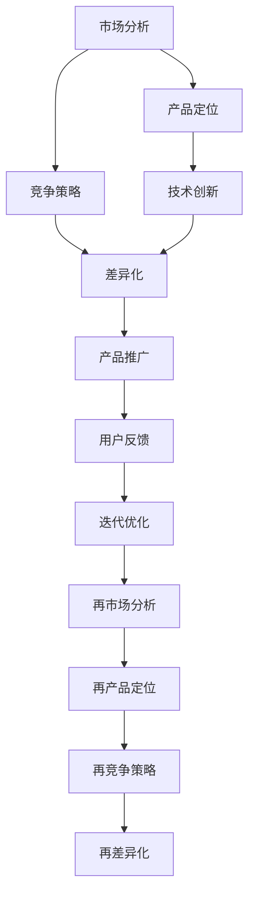

                 

# 自动化创业中的产品定位与差异化

> 关键词：自动化, 创业, 产品定位, 差异化, 市场分析, 竞争策略, 技术创新

## 1. 背景介绍

### 1.1 问题由来
在当今数字化转型加速的时代，自动化创业成为越来越多企业关注的焦点。自动化技术可以大幅提升生产效率，降低人力成本，改善工作环境。然而，尽管市场对自动化解决方案的需求旺盛，但如何从众多竞争者中脱颖而出，获得市场份额，却是一个具有挑战性的问题。因此，本文旨在探讨自动化创业中产品定位与差异化的关键策略，帮助创业者更好地把握市场机遇，创造独特价值。

### 1.2 问题核心关键点
自动化创业成功的关键在于其产品是否能够满足特定市场需求，并与其竞争者有所区别。核心关键点包括：
- 市场分析：识别目标市场的痛点和需求，细分市场以明确目标用户。
- 产品定位：根据市场分析结果，定义产品的独特卖点（Unique Selling Proposition, USP）。
- 竞争策略：分析竞争环境，识别差异化优势，制定有效的市场策略。
- 技术创新：不断引入新技术、新方法，保持产品竞争力。

## 2. 核心概念与联系

### 2.1 核心概念概述

为更好地理解自动化创业中产品定位与差异化，本节将介绍几个密切相关的核心概念：

- 自动化(Automation)：指使用计算机和软件技术，自动完成原本需要人工操作的流程，提高生产效率。
- 创业(Entrepreneurship)：指通过创新技术、产品或服务，在市场中创造并获取价值的过程。
- 产品定位(Product Positioning)：指根据目标市场和竞争环境，确定产品或服务在用户心中的定位，使产品具有独特价值和竞争优势。
- 差异化(Differentiation)：指通过独特的特征、优势或价值，使产品与竞争者区别开来，提升用户满意度和市场竞争力。
- 市场分析(Market Analysis)：指通过对目标市场的调查和分析，了解市场需求、竞争态势和潜在机会。
- 竞争策略(Competitive Strategy)：指针对竞争对手的策略制定，采取合理措施，保持市场优势。

这些核心概念之间的逻辑关系可以通过以下Mermaid流程图来展示：



这个流程图展示了大语言模型微调的核心概念及其之间的关系：

1. 市场分析为产品定位提供基础数据。
2. 产品定位明确了产品的目标用户和独特价值。
3. 竞争策略基于市场分析，制定差异化措施。
4. 技术创新支持产品差异化，提升产品竞争力。
5. 产品推广将差异化优势传递给用户。
6. 用户反馈指导产品迭代优化。
7. 不断循环的市场分析、产品定位、竞争策略和差异化，实现产品持续优化和市场竞争优势的提升。

这些概念共同构成了自动化创业中产品定位与差异化的框架，使其能够在竞争激烈的市场中获得优势。通过理解这些核心概念，我们可以更好地把握自动化创业的精髓，制定有效的策略。

## 3. 核心算法原理 & 具体操作步骤
### 3.1 算法原理概述

自动化创业中的产品定位与差异化，本质上是一个市场分析和产品优化的迭代过程。其核心思想是：通过分析市场需求和竞争态势，确定产品的独特卖点和差异化优势，同时在产品设计和推广中不断迭代优化，以适应市场变化，提升用户满意度和市场竞争力。

形式化地，假设目标市场为 $M$，市场份额为 $S$，竞争者数量为 $C$，每个竞争者的市场份额为 $s_i$。设产品 $P$ 在市场 $M$ 中的差异化程度为 $D$，则理想的产品定位与差异化模型为：

$$
\max_{D} S \times D
$$

其中 $S \times D$ 为产品市场份额与差异化程度的乘积，表示产品在市场中的总体竞争力。

通过优化该模型，可找到最佳的差异化策略。在实际操作中，需结合市场分析结果，定义合适的优化目标函数，并通过优化算法求解。

### 3.2 算法步骤详解

自动化创业中产品定位与差异化的一般流程如下：

**Step 1: 市场分析与需求识别**
- 通过问卷调查、用户访谈、竞争对手分析等方法，了解目标市场的需求和痛点。
- 进行市场细分，确定目标用户群体的特征和需求。

**Step 2: 产品定位与价值定义**
- 根据市场分析结果，确定产品的核心功能和独特卖点（USP）。
- 分析竞争对手的产品特点，确定差异化优势。
- 定义产品价值主张（Value Proposition），清晰传达产品价值。

**Step 3: 竞争策略与市场定位**
- 分析竞争对手的优劣势，制定差异化策略。
- 确定产品的市场定位，选择最合适的渠道和定价策略。

**Step 4: 技术创新与产品开发**
- 引入新技术或改进现有技术，提升产品性能和用户体验。
- 开发产品原型，进行用户测试，收集反馈进行迭代优化。

**Step 5: 产品推广与用户反馈**
- 制定推广策略，通过广告、社交媒体、口碑等渠道推广产品。
- 收集用户反馈，分析产品效果，进行优化调整。

**Step 6: 持续优化与再市场分析**
- 根据市场变化和新用户反馈，持续优化产品设计和功能。
- 定期进行市场分析，评估产品竞争力和市场机会，进行调整。

以上流程不断循环，确保产品在市场中保持竞争优势。

### 3.3 算法优缺点

自动化创业中产品定位与差异化方法具有以下优点：
1. 动态适应市场变化。根据市场反馈和竞争态势，不断调整产品策略，保持市场竞争力。
2. 提升用户体验。通过差异化设计和功能，满足用户痛点，提升满意度。
3. 降低风险。在市场分析的基础上，制定明确的差异化策略，避免盲目投资和决策失误。
4. 创造附加值。通过技术创新和独特功能，增加产品附加值，形成品牌差异化。

同时，该方法也存在一定的局限性：
1. 需要持续的市场调研和数据分析，投入较大。
2. 差异化策略制定和产品优化需紧密结合，需有较强的技术积累和团队协作。
3. 用户需求和市场趋势变化快，需及时响应和调整。
4. 需要综合考虑成本和收益，避免过度差异化导致的成本增加。

尽管存在这些局限性，但就目前而言，产品定位与差异化方法仍是自动化创业的重要策略。未来相关研究的重点在于如何更高效地进行市场分析，更准确地识别用户需求，以及如何在技术创新和产品优化之间找到最优平衡。

### 3.4 算法应用领域

基于产品定位与差异化的方法，已经在自动化创业的多个领域得到广泛应用，例如：

- 工业自动化：设计高效的生产线和控制系统，提升生产效率和质量。
- 医疗自动化：开发智能诊断和辅助诊疗系统，改善医疗服务质量。
- 农业自动化：引入智能化设备和技术，优化农业生产流程。
- 服务自动化：构建智能客服和虚拟助手，提升客户服务效率。
- 物流自动化：利用无人机和自动化仓库，提升物流配送速度和准确性。

除了上述这些经典应用外，自动化创业还在更多场景中得到创新性地应用，如智能家居、智慧城市、智能交通等，为各行各业带来新的增长点。随着技术的不断进步和市场需求的变化，相信自动化创业将不断拓展其应用边界，带来更多的商业模式创新。

## 4. 数学模型和公式 & 详细讲解 & 举例说明
### 4.1 数学模型构建

本节将使用数学语言对自动化创业中产品定位与差异化的过程进行更加严格的刻画。

假设市场规模为 $M$，市场份额为 $S$，竞争者数量为 $C$，每个竞争者的市场份额为 $s_i$。设产品 $P$ 在市场 $M$ 中的差异化程度为 $D$，产品核心竞争力为 $C_0$，则产品的市场份额为：

$$
S = \frac{C_0}{1+\sum_{i=1}^{C}s_i+\frac{D}{1+C_0}}
$$

产品的差异化程度 $D$ 可由用户调研、市场反馈等方法获取，表示产品的独特卖点和用户体验。通过最大化上述模型，可找到最佳差异化策略。

### 4.2 公式推导过程

以下我们以工业自动化为例，推导差异化程度 $D$ 和市场份额 $S$ 的关系：

假设产品 $P$ 的核心功能为 $F$，独特卖点为 $D$，则产品竞争优势为：

$$
C_0 = F \times D
$$

市场份额 $S$ 的计算公式为：

$$
S = \frac{C_0}{1+\sum_{i=1}^{C}s_i+\frac{D}{1+C_0}}
$$

将 $C_0$ 代入上式，得：

$$
S = \frac{F \times D}{1+\sum_{i=1}^{C}s_i+\frac{D}{F \times D+1}}
$$

通过求解上述公式，可以得到 $D$ 的最优值，进而确定产品差异化策略。

### 4.3 案例分析与讲解

以工业自动化为例，分析产品差异化策略的选择：

假设市场规模为 $M=1000$，竞争者数量为 $C=3$，每个竞争者的市场份额为 $s_i=0.1,0.2,0.3$。假设产品 $P$ 的核心功能 $F=0.8$，用户调研得出的差异化程度 $D=0.5$。代入上述公式，得：

$$
S = \frac{0.8 \times 0.5}{1+0.1+0.2+0.3+\frac{0.5}{0.8 \times 0.5+1}} \approx 0.3
$$

此时，产品 $P$ 的市场份额为 $0.3$。通过增加 $D$ 值，可进一步提升 $S$，但需权衡成本和用户接受度。例如，将 $D$ 增加至 $0.8$，可得：

$$
S = \frac{0.8 \times 0.8}{1+0.1+0.2+0.3+\frac{0.8}{0.8 \times 0.8+1}} \approx 0.45
$$

此时，产品 $P$ 的市场份额提升至 $0.45$。通过上述分析，可以理解差异化策略在提升产品市场份额中的关键作用，同时认识到需要权衡成本和效益。

## 5. 项目实践：代码实例和详细解释说明
### 5.1 开发环境搭建

在进行自动化创业中产品定位与差异化实践前，我们需要准备好开发环境。以下是使用Python进行PyTorch开发的环境配置流程：

1. 安装Anaconda：从官网下载并安装Anaconda，用于创建独立的Python环境。

2. 创建并激活虚拟环境：
```bash
conda create -n pytorch-env python=3.8 
conda activate pytorch-env
```

3. 安装PyTorch：根据CUDA版本，从官网获取对应的安装命令。例如：
```bash
conda install pytorch torchvision torchaudio cudatoolkit=11.1 -c pytorch -c conda-forge
```

4. 安装各类工具包：
```bash
pip install numpy pandas scikit-learn matplotlib tqdm jupyter notebook ipython
```

完成上述步骤后，即可在`pytorch-env`环境中开始实践。

### 5.2 源代码详细实现

下面我们以工业自动化为例，给出使用Transformers库对BERT模型进行微调的PyTorch代码实现。

首先，定义工业自动化问题的数据处理函数：

```python
from transformers import BertTokenizer
from torch.utils.data import Dataset
import torch

class IndustrialAutomationDataset(Dataset):
    def __init__(self, texts, labels, tokenizer, max_len=128):
        self.texts = texts
        self.labels = labels
        self.tokenizer = tokenizer
        self.max_len = max_len
        
    def __len__(self):
        return len(self.texts)
    
    def __getitem__(self, item):
        text = self.texts[item]
        label = self.labels[item]
        
        encoding = self.tokenizer(text, return_tensors='pt', max_length=self.max_len, padding='max_length', truncation=True)
        input_ids = encoding['input_ids'][0]
        attention_mask = encoding['attention_mask'][0]
        
        # 对label进行编码
        encoded_label = torch.tensor(label, dtype=torch.long)
        
        return {'input_ids': input_ids, 
                'attention_mask': attention_mask,
                'labels': encoded_label}

# 标签与id的映射
label2id = {'Classic Automation': 0, 'Industrial Robotics': 1, 'Advanced Manufacturing': 2}
id2label = {v: k for k, v in label2id.items()}

# 创建dataset
tokenizer = BertTokenizer.from_pretrained('bert-base-cased')

train_dataset = IndustrialAutomationDataset(train_texts, train_labels, tokenizer)
dev_dataset = IndustrialAutomationDataset(dev_texts, dev_labels, tokenizer)
test_dataset = IndustrialAutomationDataset(test_texts, test_labels, tokenizer)
```

然后，定义模型和优化器：

```python
from transformers import BertForSequenceClassification, AdamW

model = BertForSequenceClassification.from_pretrained('bert-base-cased', num_labels=len(label2id))

optimizer = AdamW(model.parameters(), lr=2e-5)
```

接着，定义训练和评估函数：

```python
from torch.utils.data import DataLoader
from tqdm import tqdm
from sklearn.metrics import classification_report

device = torch.device('cuda') if torch.cuda.is_available() else torch.device('cpu')
model.to(device)

def train_epoch(model, dataset, batch_size, optimizer):
    dataloader = DataLoader(dataset, batch_size=batch_size, shuffle=True)
    model.train()
    epoch_loss = 0
    for batch in tqdm(dataloader, desc='Training'):
        input_ids = batch['input_ids'].to(device)
        attention_mask = batch['attention_mask'].to(device)
        labels = batch['labels'].to(device)
        model.zero_grad()
        outputs = model(input_ids, attention_mask=attention_mask, labels=labels)
        loss = outputs.loss
        epoch_loss += loss.item()
        loss.backward()
        optimizer.step()
    return epoch_loss / len(dataloader)

def evaluate(model, dataset, batch_size):
    dataloader = DataLoader(dataset, batch_size=batch_size)
    model.eval()
    preds, labels = [], []
    with torch.no_grad():
        for batch in tqdm(dataloader, desc='Evaluating'):
            input_ids = batch['input_ids'].to(device)
            attention_mask = batch['attention_mask'].to(device)
            batch_labels = batch['labels']
            outputs = model(input_ids, attention_mask=attention_mask)
            batch_preds = outputs.logits.argmax(dim=2).to('cpu').tolist()
            batch_labels = batch_labels.to('cpu').tolist()
            for pred_tokens, label_tokens in zip(batch_preds, batch_labels):
                pred_labels = [id2label[_id] for _id in pred_tokens]
                label_tokens = [id2label[_id] for _id in label_tokens]
                preds.append(pred_labels[:len(label_tokens)])
                labels.append(label_tokens)
                
    print(classification_report(labels, preds))
```

最后，启动训练流程并在测试集上评估：

```python
epochs = 5
batch_size = 16

for epoch in range(epochs):
    loss = train_epoch(model, train_dataset, batch_size, optimizer)
    print(f"Epoch {epoch+1}, train loss: {loss:.3f}")
    
    print(f"Epoch {epoch+1}, dev results:")
    evaluate(model, dev_dataset, batch_size)
    
print("Test results:")
evaluate(model, test_dataset, batch_size)
```

以上就是使用PyTorch对BERT进行工业自动化任务微调的完整代码实现。可以看到，得益于Transformers库的强大封装，我们可以用相对简洁的代码完成BERT模型的加载和微调。

### 5.3 代码解读与分析

让我们再详细解读一下关键代码的实现细节：

**IndustrialAutomationDataset类**：
- `__init__`方法：初始化文本、标签、分词器等关键组件。
- `__len__`方法：返回数据集的样本数量。
- `__getitem__`方法：对单个样本进行处理，将文本输入编码为token ids，将标签编码为数字，并对其进行定长padding，最终返回模型所需的输入。

**label2id和id2label字典**：
- 定义了标签与数字id之间的映射关系，用于将预测结果解码回真实的标签。

**训练和评估函数**：
- 使用PyTorch的DataLoader对数据集进行批次化加载，供模型训练和推理使用。
- 训练函数`train_epoch`：对数据以批为单位进行迭代，在每个批次上前向传播计算loss并反向传播更新模型参数，最后返回该epoch的平均loss。
- 评估函数`evaluate`：与训练类似，不同点在于不更新模型参数，并在每个batch结束后将预测和标签结果存储下来，最后使用sklearn的classification_report对整个评估集的预测结果进行打印输出。

**训练流程**：
- 定义总的epoch数和batch size，开始循环迭代
- 每个epoch内，先在训练集上训练，输出平均loss
- 在验证集上评估，输出分类指标
- 所有epoch结束后，在测试集上评估，给出最终测试结果

可以看到，PyTorch配合Transformers库使得BERT微调的代码实现变得简洁高效。开发者可以将更多精力放在数据处理、模型改进等高层逻辑上，而不必过多关注底层的实现细节。

当然，工业级的系统实现还需考虑更多因素，如模型的保存和部署、超参数的自动搜索、更灵活的任务适配层等。但核心的微调范式基本与此类似。

## 6. 实际应用场景
### 6.1 工业自动化

基于自动化创业中产品定位与差异化的方法，工业自动化可以设计高效的生产线和控制系统，提升生产效率和质量。通过市场调研和用户访谈，可以明确目标市场的痛点和需求。根据分析结果，确定产品的核心功能和独特卖点，如无人操作、智能化调度、实时监控等，并进行相应的技术开发和产品优化。

在实际应用中，工业自动化还需要考虑以下因素：
- 引入人工智能和物联网技术，实现生产线的智能化管理。
- 优化生产流程，提升生产效率和资源利用率。
- 通过数据分析和机器学习，预测设备故障，提前维护，减少停机时间。
- 引入人机协作系统，提高工人作业的安全性和舒适性。

### 6.2 智慧医疗

智慧医疗是另一个典型应用场景。通过自动化创业，开发智能诊断和辅助诊疗系统，可以改善医疗服务质量，提高诊疗效率。根据市场调研和用户反馈，可以明确目标用户的痛点，如疾病诊断、治疗方案推荐、药物副作用监测等。确定产品的核心功能和独特卖点，如AI辅助诊断、个性化治疗方案、实时健康监测等，并进行相应的技术开发和产品优化。

在实际应用中，智慧医疗还需要考虑以下因素：
- 引入深度学习和自然语言处理技术，提高诊断和分析的准确性。
- 结合远程医疗和互联网医疗，提供更加便捷和高效的诊疗服务。
- 引入大数据和机器学习，实现精准医疗和疾病预测。
- 引入智能设备，提高病患的健康管理和自我监测能力。

### 6.3 农业自动化

农业自动化利用自动化技术和智能化设备，优化农业生产流程，提高生产效率和资源利用率。通过市场调研和用户访谈，可以明确目标市场的痛点和需求。确定产品的核心功能和独特卖点，如智能灌溉、自动化种植、精准施肥等，并进行相应的技术开发和产品优化。

在实际应用中，农业自动化还需要考虑以下因素：
- 引入智能传感器和物联网技术，实时监测土壤湿度、气温、光照等环境数据，优化种植方案。
- 引入无人机和机器人，进行精准农业作业，提高生产效率。
- 引入机器学习和大数据技术，分析农作物的生长数据，提高产量和质量。
- 引入人机协作系统，提高作业的舒适性和安全性。

### 6.4 未来应用展望

随着自动化创业中产品定位与差异化技术的不断发展，未来将在更多领域得到应用，为各行各业带来变革性影响。

在智慧医疗领域，基于自动化创业的智能诊断和辅助诊疗系统将提升医疗服务的智能化水平，辅助医生诊疗，加速新药开发进程。

在智能教育领域，通过自动化创业，开发智能教育平台，可以为学生提供个性化的学习方案，提升教学效果。

在智慧城市治理中，基于自动化创业的智能监测和控制系统，可以提高城市管理的自动化和智能化水平，构建更安全、高效的未来城市。

此外，在企业生产、社会治理、文娱传媒等众多领域，基于自动化创业的人工智能应用也将不断涌现，为经济社会发展注入新的动力。相信随着技术的日益成熟，自动化创业必将在构建人机协同的智能时代中扮演越来越重要的角色。

## 7. 工具和资源推荐
### 7.1 学习资源推荐

为了帮助开发者系统掌握自动化创业中产品定位与差异化的理论基础和实践技巧，这里推荐一些优质的学习资源：

1. 《创业创新：理论与实践》系列博文：由创业专家撰写，深入浅出地介绍了创业创新中的核心概念和关键策略。

2. 《人工智能创业》课程：由知名AI专家开设的在线课程，涵盖人工智能技术和创业方法。

3. 《创业心理学》书籍：解析创业过程中的心理现象和行为规律，帮助创业者更好地把握市场机遇和团队管理。

4. 《市场分析与商业洞察》书籍：提供系统化的市场分析方法和工具，帮助创业者洞察市场需求和竞争态势。

5. 《项目管理与领导力》书籍：介绍项目管理的基本方法和领导力技巧，帮助创业者高效管理项目和团队。

通过对这些资源的学习实践，相信你一定能够快速掌握自动化创业中产品定位与差异化的精髓，并用于解决实际的自动化创业问题。
###  7.2 开发工具推荐

高效的开发离不开优秀的工具支持。以下是几款用于自动化创业中产品定位与差异化开发的常用工具：

1. Python：功能强大的编程语言，广泛用于数据处理、机器学习和软件开发。

2. PyTorch：基于Python的开源深度学习框架，灵活的计算图和丰富的模型库，适合快速迭代研究。

3. TensorFlow：由Google主导开发的开源深度学习框架，生产部署方便，适合大规模工程应用。

4. Jupyter Notebook：交互式的编程环境，支持代码编辑、运行和展示，适合快速开发和验证算法。

5. Microsoft Azure：云服务平台，提供强大的计算资源和机器学习工具，支持自动化创业中产品定位与差异化项目的部署和运行。

6. AWS云平台：云服务平台，提供丰富的计算资源和AI工具，支持自动化创业中产品定位与差异化项目的部署和运行。

合理利用这些工具，可以显著提升自动化创业中产品定位与差异化任务的开发效率，加快创新迭代的步伐。

### 7.3 相关论文推荐

自动化创业中产品定位与差异化技术的发展源于学界的持续研究。以下是几篇奠基性的相关论文，推荐阅读：

1. "Market Segmentation and Targeting: Concepts, Methods, and Strategies"：市场细分和定位的综述，介绍了多种市场分析方法和策略。

2. "Product Differentiation in International Markets"：国际市场产品差异化的研究，探讨了差异化策略的有效性和实施方法。

3. "The Impact of Product Differentiation on Firm Performance"：产品差异化对企业绩效的影响研究，提供了差异化策略的实证分析。

4. "The Dynamics of Product Differentiation and Market Entry"：产品差异化和市场进入策略的动态分析，探讨了差异化策略的持续性和市场竞争力。

5. "AI-driven Personalization in Business Models"：AI驱动的个性化业务模式，分析了个性化推荐系统的实现方法和应用场景。

这些论文代表了大语言模型微调技术的发展脉络。通过学习这些前沿成果，可以帮助研究者把握学科前进方向，激发更多的创新灵感。

## 8. 总结：未来发展趋势与挑战
### 8.1 研究成果总结

本文对自动化创业中产品定位与差异化方法进行了全面系统的介绍。首先阐述了自动化创业成功的关键在于其产品是否能够满足特定市场需求，并与其竞争者有所区别。其次，从原理到实践，详细讲解了市场分析、产品定位、竞争策略和差异化优势的关键步骤，给出了微调任务开发的完整代码实例。同时，本文还广泛探讨了自动化创业在工业自动化、智慧医疗、农业自动化等诸多领域的应用前景，展示了差异化策略的巨大潜力。最后，本文精选了产品定位与差异化技术的各类学习资源，力求为读者提供全方位的技术指引。

通过本文的系统梳理，可以看到，基于产品定位与差异化的方法在自动化创业中具有广泛应用前景，不仅能提升产品的市场竞争力，还能满足用户多样化的需求，推动技术进步和行业发展。

### 8.2 未来发展趋势

展望未来，自动化创业中产品定位与差异化技术将呈现以下几个发展趋势：

1. 产品差异化策略的多样化。随着市场和技术的发展，将涌现更多差异化策略，如功能、性能、品牌、服务等方面，满足用户不同层次的需求。

2. 智能化和个性化。借助人工智能和机器学习技术，实现产品的智能化和个性化推荐，提升用户体验和满意度。

3. 动态优化和持续改进。通过市场分析和用户反馈，持续优化产品设计和功能，保持市场竞争力。

4. 全球化布局。借助全球化市场分析和用户调研，开拓新的市场机会，提升全球竞争力。

5. 新兴技术和应用的融合。将新兴技术和应用（如5G、IoT、区块链等）与产品差异化策略相结合，拓展应用场景。

以上趋势凸显了产品定位与差异化技术的广阔前景。这些方向的探索发展，必将进一步提升自动化创业项目的市场竞争力，为技术创新和产业升级带来新的机遇。

### 8.3 面临的挑战

尽管自动化创业中产品定位与差异化技术已经取得了一定进展，但在迈向更加智能化、普适化应用的过程中，仍面临诸多挑战：

1. 市场变化快。快速变化的市场需求和竞争态势，对产品策略和迭代优化提出了更高的要求。

2. 用户需求复杂。不同用户对产品功能、性能和价格等要求差异较大，需要灵活设计差异化策略。

3. 技术壁垒高。实现产品差异化，需要较高的技术积累和团队协作，同时需不断进行技术创新和优化。

4. 成本与效益平衡。差异化策略往往意味着成本增加，需进行精细化的成本效益分析，避免过度投资。

5. 数据隐私和安全。产品开发过程中涉及大量用户数据，需加强数据保护和隐私管理。

6. 法规和合规。产品差异化策略需遵守相关法规和标准，确保合规性。

正视这些挑战，积极应对并寻求突破，将是大语言模型微调走向成熟的必由之路。相信随着学界和产业界的共同努力，这些挑战终将一一被克服，产品定位与差异化技术必将引领自动化创业进入新的发展阶段。

### 8.4 研究展望

面向未来，产品定位与差异化技术需要在以下几个方面寻求新的突破：

1. 引入新兴技术和应用。如区块链、5G、IoT等，拓展自动化创业的业务场景和应用边界。

2. 探索数据驱动的决策方法。利用大数据和机器学习技术，精准把握市场需求和用户行为，优化产品定位与差异化策略。

3. 实现多模态数据融合。将文本、图像、语音等多模态数据进行融合，提升产品的感知能力和智能水平。

4. 增强产品生态系统。通过生态系统的建设和优化，增强产品的市场竞争力和用户体验。

5. 加强伦理和安全研究。在产品设计和开发过程中，加强伦理和安全研究，确保产品的社会责任和合规性。

这些研究方向的探索，必将引领自动化创业中产品定位与差异化技术迈向更高的台阶，为构建智能化的未来社会提供新的技术支持。总之，自动化创业需要从市场调研、产品设计、技术开发到市场推广的全链条协同发力，才能真正实现产品的差异化和市场竞争力提升。

## 9. 附录：常见问题与解答

**Q1：自动化创业中如何确定产品的核心功能和独特卖点？**

A: 自动化创业中确定产品的核心功能和独特卖点，需进行系统的市场调研和用户访谈，了解目标市场的痛点和需求。根据调研结果，分析竞争对手的产品特点，确定产品的独特卖点和差异化优势。同时，需结合技术可行性和市场需求，制定明确的产品定位和价值主张。

**Q2：产品差异化策略制定的关键是什么？**

A: 产品差异化策略制定的关键在于充分了解市场和用户需求，分析竞争对手的优势和劣势，结合技术可行性和成本效益，确定产品的核心功能和独特卖点。同时，需通过反复的测试和优化，确保产品差异化策略的有效性和持续性。

**Q3：自动化创业中如何应对市场变化？**

A: 自动化创业中应对市场变化的关键在于及时进行市场调研和用户反馈收集，分析市场趋势和用户需求的变化。根据分析结果，调整产品策略和差异化措施，进行快速的迭代优化。同时，需加强团队的灵活性和协作能力，确保产品策略的动态调整和实施。

**Q4：如何平衡产品差异化与成本效益？**

A: 平衡产品差异化与成本效益的关键在于进行精细化的成本效益分析，确定合理的差异化策略。通过控制生产成本、优化供应链管理、引入技术创新等手段，降低成本，提高产品竞争力和市场份额。同时，需根据市场需求和用户反馈，灵活调整产品策略，确保产品的差异化优势和成本效益的平衡。

**Q5：自动化创业中如何确保数据隐私和安全？**

A: 自动化创业中确保数据隐私和安全的措施包括：
1. 数据加密：对敏感数据进行加密处理，确保数据在传输和存储过程中的安全性。
2. 访问控制：对数据访问进行严格的权限控制，确保只有授权人员能够访问数据。
3. 数据脱敏：对敏感数据进行脱敏处理，确保数据在分析和处理过程中不泄露用户隐私。
4. 安全审计：定期进行安全审计，发现和修复数据泄露和安全漏洞。

这些措施可以确保在自动化创业中，数据的隐私和安全得到有效保障。

---

作者：禅与计算机程序设计艺术 / Zen and the Art of Computer Programming

