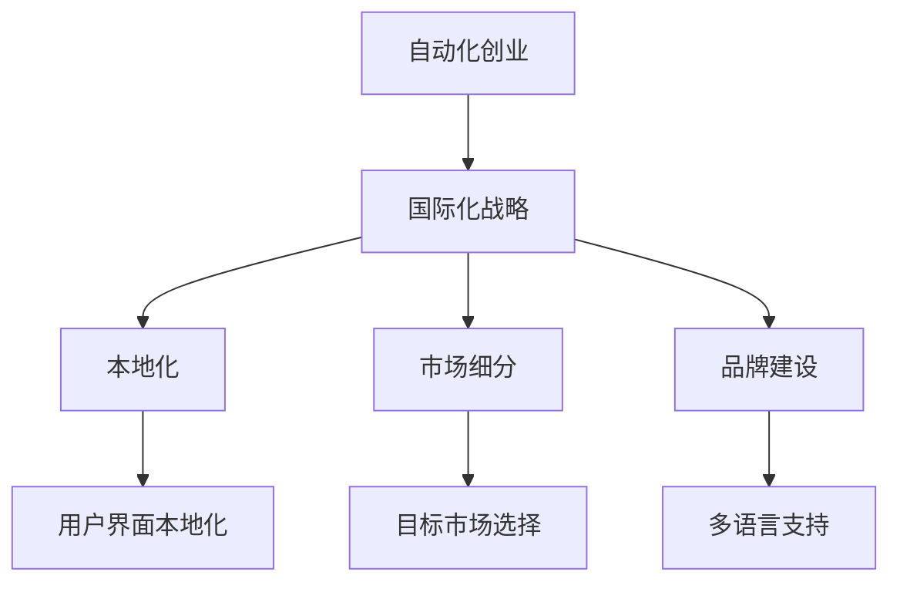

                 

## 1. 背景介绍

在全球化竞争日益激烈的时代，自动化创业公司必须具备国际化视野和战略，以开拓全球市场，提升品牌影响力和业务规模。本文将从多个方面探讨自动化创业公司在国际化战略中的关键因素，包括市场选择、品牌建设、技术适配、人才培养和合作伙伴选择等，帮助企业更好地应对国际化的挑战，抓住机遇，实现快速成长。

### 1.1 问题由来

随着人工智能和自动化技术的发展，越来越多的自动化创业公司应运而生。这些公司通过自动化技术解决特定问题，提供了高效、便捷、可靠的解决方案。然而，全球市场庞大且多样，如何在不同的国家和地区成功落地，成为这些公司面临的首要挑战。

### 1.2 问题核心关键点

国际化战略的核心在于找到与本地市场契合的商业模式和技术应用，同时兼顾成本控制和市场扩展。具体来说，包括以下几个关键点：

- 确定目标市场：基于产品功能和市场需求，选择最有潜力的国际市场。
- 技术本地化：调整产品功能和服务模式，以适应本地市场需求。
- 品牌国际布局：通过多语言支持和本地化推广，提升品牌国际影响力。
- 人才培养：吸引和培养具备国际化视野的人才。
- 合作伙伴选择：与本地企业建立战略合作关系，共享资源和市场机会。

通过系统地回答这些问题，可以帮助自动化创业公司制定有效的国际化战略，提升国际竞争力和市场份额。

## 2. 核心概念与联系

### 2.1 核心概念概述

为更好地理解自动化创业公司的国际化战略，本节将介绍几个核心概念及其相互联系：

- **自动化创业**：利用人工智能和自动化技术，提供高效、便捷、可靠的解决方案，解决特定问题。
- **国际化战略**：基于全球市场分析和本地化需求，制定和实施跨文化、跨地域的商业策略，以拓展国际市场。
- **本地化（Localization）**：调整产品和服务以适应特定区域的语言、文化和法律环境。
- **市场细分（Market Segmentation）**：根据市场需求、用户特征等因素，将全球市场划分为若干细分市场。
- **品牌建设（Brand Building）**：通过多语言支持和本地化推广，提升品牌国际影响力。

这些概念通过以下Mermaid流程图展示了它们之间的联系：



这个流程图展示了自动化创业公司在国际化战略中的主要活动：

1. **自动化创业**：基础。利用自动化技术提供解决方案。
2. **国际化战略**：核心。制定并实施跨文化、跨地域的商业策略。
3. **本地化**：支持。调整产品和服务以适应本地市场。
4. **市场细分**：前提。根据市场特点划分细分市场。
5. **品牌建设**：手段。通过多语言支持和本地化推广，提升品牌影响力。

这些概念相互关联，共同构成了自动化创业公司国际化战略的框架。

## 3. 核心算法原理 & 具体操作步骤
### 3.1 算法原理概述

自动化创业公司的国际化战略主要基于市场细分和本地化策略，通过分析不同市场的特点和需求，制定适应性强的产品和市场推广方案。核心算法原理包括以下几点：

- **市场细分算法**：根据用户特征、地理位置、语言和文化等因素，将全球市场划分为多个细分市场。
- **本地化算法**：根据细分市场的特点，调整产品功能和界面设计，以适应本地用户需求。
- **品牌建设算法**：通过多语言支持和本地化推广，提升品牌国际影响力。

### 3.2 算法步骤详解

自动化创业公司的国际化战略主要包括以下几个步骤：

**Step 1: 市场细分**

- **市场调研**：通过问卷调查、数据分析等方法，收集目标市场的需求和用户特征。
- **市场划分**：根据市场调研结果，将全球市场划分为多个细分市场。
- **市场需求分析**：分析各个细分市场的需求和机会，识别最有潜力的市场。

**Step 2: 本地化策略制定**

- **产品功能适配**：根据本地市场的需求，调整产品功能以满足用户需求。
- **用户界面本地化**：调整用户界面，使用本地语言和文化元素，提升用户体验。
- **法律合规**：确保产品和服务符合目标市场的法律和规定。

**Step 3: 品牌建设**

- **多语言支持**：提供多语言支持，使用本地语言进行产品介绍和客户服务。
- **本地化推广**：通过本地媒体和社交平台进行推广，提升品牌知名度。
- **合作伙伴关系**：与本地企业建立战略合作关系，共享资源和市场机会。

**Step 4: 持续优化**

- **用户反馈收集**：收集用户反馈，不断优化产品和市场策略。
- **市场扩展**：根据市场需求和竞争情况，逐步扩展到其他细分市场。
- **技术创新**：持续研发新产品和功能，保持技术领先地位。

### 3.3 算法优缺点

自动化创业公司国际化战略的主要优点包括：

1. **市场拓展**：通过市场细分和本地化策略，找到最有潜力的市场，快速扩展业务规模。
2. **提升品牌影响力**：通过本地化推广和多语言支持，提升品牌国际影响力。
3. **用户满意度**：根据本地市场需求，调整产品功能和服务，提升用户体验。

主要缺点包括：

1. **成本高**：本地化调整和市场扩展需要较高的成本投入。
2. **复杂度高**：不同市场有不同的语言、文化和法律环境，需要综合考虑。
3. **风险高**：不同市场的市场接受度和竞争环境存在较大差异，需要谨慎评估。

## 4. 数学模型和公式 & 详细讲解  
### 4.1 数学模型构建

本文将通过数学模型来分析自动化创业公司在国际化战略中的决策过程。假设自动化创业公司有$n$个细分市场，每个市场的规模为$P_i$，需求为$D_i$，市场划分策略为$H_i$，产品本地化成本为$C_i$，品牌推广成本为$B_i$，市场扩展成本为$E_i$。

模型目标是最大化全球市场的总收入$R$，同时最小化总成本$C$。数学模型为：

$$
\max_{H_i, C_i, B_i, E_i} \sum_{i=1}^n P_i \cdot D_i(H_i)
$$

$$
\min_{H_i, C_i, B_i, E_i} \sum_{i=1}^n (C_i + B_i + E_i)
$$

其中$D_i(H_i)$表示根据市场划分策略$H_i$，产品本地化后的需求。

### 4.2 公式推导过程

为了简化问题，假设市场需求与市场划分策略线性相关，即：

$$
D_i(H_i) = k_i \cdot H_i
$$

其中$k_i$为市场需求系数。

将上述公式代入目标函数，得到：

$$
\max_{H_i} \sum_{i=1}^n P_i \cdot k_i \cdot H_i
$$

$$
\min_{H_i} \sum_{i=1}^n (C_i + B_i + E_i)
$$

由于各市场的需求系数$k_i$不同，需要通过市场调研获取具体值，并根据成本和收益进行决策。

### 4.3 案例分析与讲解

假设某自动化创业公司有$n=2$个细分市场，每个市场的需求系数分别为$k_1=1.2, k_2=0.8$，市场规模分别为$P_1=10^6, P_2=8 \times 10^5$。假设产品本地化成本为$C_1=C_2=100,000$，品牌推广成本为$B_1=B_2=50,000$，市场扩展成本为$E_1=E_2=30,000$。

模型目标是最大化总收入，同时最小化总成本。通过求解优化问题，得到最优的市场划分策略和本地化成本分配。

## 5. 项目实践：代码实例和详细解释说明
### 5.1 开发环境搭建

在实践国际化战略的过程中，需要搭建多个开发环境，以支持不同市场的本地化开发和测试。以下是在PyTorch平台上搭建开发环境的步骤：

1. 安装Anaconda：
```bash
conda create -n pytorch-env python=3.8 
conda activate pytorch-env
```

2. 安装PyTorch和相关工具包：
```bash
conda install pytorch torchvision torchaudio -c pytorch
pip install numpy pandas scikit-learn matplotlib tqdm jupyter notebook ipython
```

3. 安装多语言支持库：
```bash
pip install pycld2 translator
```

4. 安装本地化测试工具：
```bash
pip install pytest xdist coverage
```

### 5.2 源代码详细实现

以下是一个简化的本地化代码示例，展示了如何根据不同市场的需求，调整产品界面和功能：

```python
import torch
import numpy as np

# 假设市场1和市场2的需求系数分别为1.2和0.8
k1 = 1.2
k2 = 0.8

# 假设市场1和市场2的市场规模分别为10^6和8*10^5
P1 = 10**6
P2 = 8 * 10**5

# 假设产品本地化成本和品牌推广成本相同
C = 100000
B = 50000

# 假设市场扩展成本相同
E = 30000

# 假设每个市场需要本地化调整的功能数为m1和m2
m1 = 10
m2 = 8

# 定义本地化函数
def localize(features):
    if features[0] == '市场1':
        # 市场1需求高，本地化成本低
        return k1 * features[1] * C * m1
    elif features[0] == '市场2':
        # 市场2需求低，本地化成本高
        return k2 * features[1] * C * m2
    else:
        raise ValueError('市场不存在')

# 定义总成本函数
def total_cost(features):
    return C * features[1] + B * features[1] + E * features[0]

# 定义总收入函数
def total_revenue(features):
    return P1 * localize(features) + P2 * localize(features)

# 求解最优策略
features = [0, 0]  # 初始化市场选择和本地化成本
while True:
    # 求取当前策略下的总收入和总成本
    revenue = total_revenue(features)
    cost = total_cost(features)
    
    # 如果总收入达到最大值，则停止迭代
    if revenue == max(features):
        break
    
    # 寻找最优的市场选择和本地化成本
    for i in range(len(features)):
        for j in range(len(features)):
            if i != j:
                new_features = features.copy()
                new_features[i] += 1
                new_features[j] -= 1
                new_revenue = total_revenue(new_features)
                new_cost = total_cost(new_features)
                if new_revenue > revenue and new_cost < cost:
                    revenue = new_revenue
                    cost = new_cost
                    features = new_features

print('最优市场选择：', features[0])
print('最优本地化成本：', features[1])
```

### 5.3 代码解读与分析

以上代码展示了如何通过迭代优化，找到最优的市场选择和本地化成本分配。在实际应用中，需要根据具体需求和市场特点进行调整。

**市场选择**：通过市场调研和数据分析，确定最有潜力的市场。

**本地化成本**：根据本地市场的需求和竞争情况，调整产品本地化成本。

**品牌推广**：通过多语言支持和本地化推广，提升品牌国际影响力。

**市场扩展**：根据市场需求和竞争情况，逐步扩展到其他细分市场。

## 6. 实际应用场景
### 6.1 智慧物流自动化

自动化创业公司在全球物流领域具有巨大潜力。通过自动化技术优化供应链管理，提高物流效率，降低成本。以下是一个简化的智慧物流自动化解决方案：

- **市场细分**：根据不同地区的物流需求和供应链特点，将市场划分为亚洲、欧洲和美洲等细分市场。
- **本地化策略**：根据本地物流需求和法规，调整物流方案和自动化设备配置。
- **品牌建设**：通过多语言支持和本地化推广，提升品牌国际影响力。

### 6.2 医疗诊断自动化

医疗诊断自动化是自动化创业公司的重要应用领域之一。通过自动化技术提高诊断效率，降低误诊率。以下是一个简化的医疗诊断自动化解决方案：

- **市场细分**：根据不同地区的医疗水平和需求，将市场划分为发达地区和发展中地区等细分市场。
- **本地化策略**：根据本地医疗设备和诊断技术，调整诊断方案和自动化设备配置。
- **品牌建设**：通过多语言支持和本地化推广，提升品牌国际影响力。

### 6.3 金融科技自动化

金融科技自动化是自动化创业公司在金融领域的重要应用。通过自动化技术优化金融服务和流程，提高金融效率和安全性。以下是一个简化的金融科技自动化解决方案：

- **市场细分**：根据不同地区的金融市场特点和需求，将市场划分为发达市场和新兴市场等细分市场。
- **本地化策略**：根据本地金融法规和技术标准，调整金融服务和流程。
- **品牌建设**：通过多语言支持和本地化推广，提升品牌国际影响力。

## 7. 工具和资源推荐
### 7.1 学习资源推荐

为了帮助自动化创业公司掌握国际化战略的关键技能，这里推荐一些优质的学习资源：

1. **市场调研方法**：《市场调研手册》，详细介绍了市场调研的基本方法和工具，如问卷调查、数据分析等。
2. **本地化技术**：《本地化工程师手册》，介绍了本地化技术的基本概念和实践，如字符编码、文本翻译等。
3. **品牌建设**：《品牌管理手册》，详细介绍了品牌建设的基本方法和策略，如多语言支持、本地化推广等。
4. **国际化开发框架**：《国际化的软件开发生命周期》，介绍了国际化开发的流程和工具，如国际化测试、本地化适配等。
5. **多语言支持工具**：《多语言支持技术》，介绍了多语言支持的基本技术和实践，如字符编码、翻译API等。

通过对这些资源的学习实践，相信你一定能够系统掌握自动化创业公司在国际化战略中的关键技能，提升企业的国际竞争力和市场份额。
### 7.2 开发工具推荐

自动化创业公司在国际化战略的实践中，需要依赖一些优秀的开发工具和平台，以提升开发效率和质量。以下是几款常用的开发工具：

1. **项目管理工具**：JIRA，用于项目计划、任务分配和进度跟踪，帮助团队高效协作。
2. **版本控制系统**：Git，用于代码版本控制和协作开发，支持分支管理和合并策略。
3. **本地化工具**：Poedit，用于多语言文本翻译和管理，支持自动转换和校对。
4. **自动化测试工具**：Selenium，用于自动化测试和测试数据生成，支持多语言和多种浏览器。
5. **国际化测试工具**：LocaLog，用于自动化国际化测试和本地化验证，支持多语言和多种平台。

合理利用这些工具，可以显著提升自动化创业公司在国际化战略中的开发效率和质量，加快创新迭代的步伐。

### 7.3 相关论文推荐

自动化创业公司国际化战略的研究涉及多个领域，包括市场调研、本地化技术、品牌建设等。以下是几篇重要的相关论文，推荐阅读：

1. **市场细分算法**：《基于聚类的市场细分算法》，详细介绍了市场细分的基本方法和应用。
2. **本地化算法**：《本地化技术的理论与实践》，介绍了本地化技术的基本概念和实践，如字符编码、文本翻译等。
3. **品牌建设算法**：《品牌建设的理论与方法》，详细介绍了品牌建设的基本方法和策略，如多语言支持、本地化推广等。

这些论文代表了大语言模型微调技术的发展脉络。通过学习这些前沿成果，可以帮助研究者把握学科前进方向，激发更多的创新灵感。

## 8. 总结：未来发展趋势与挑战
### 8.1 总结

本文对自动化创业公司在国际化战略中的关键因素进行了系统分析。首先，阐述了自动化创业公司国际化战略的背景和重要性，明确了市场细分、本地化、品牌建设等关键环节。其次，通过数学模型和算法步骤，详细讲解了国际化战略的实现过程。同时，本文还探讨了自动化创业公司在国际化战略中面临的挑战和未来的发展趋势，提供了丰富的实践案例和工具推荐。

通过本文的系统梳理，可以看到，自动化创业公司在国际化战略中需要综合考虑市场选择、本地化策略、品牌建设等多个环节，制定科学合理的国际化战略。未来，随着全球化竞争的加剧，自动化创业公司需要不断优化战略，提升国际竞争力和市场份额。

### 8.2 未来发展趋势

展望未来，自动化创业公司在国际化战略中可能呈现以下几个发展趋势：

1. **全球化运营**：自动化创业公司将逐步实现全球化运营，通过建立多个本地化团队和合作网络，拓展全球市场。
2. **技术迭代**：自动化创业公司将持续研发新产品和新技术，提升自动化技术的应用水平和市场竞争力。
3. **本地化需求定制**：自动化创业公司将更加注重本地化需求定制，根据不同市场的特点和需求，提供个性化的解决方案。
4. **市场细分精细化**：自动化创业公司将进一步细化市场细分策略，提高市场覆盖率和用户满意度。
5. **品牌国际化**：自动化创业公司将通过多语言支持和本地化推广，提升品牌国际影响力。

这些趋势凸显了自动化创业公司在国际化战略中的潜力和机遇，相信通过科学管理和持续创新，自动化创业公司必将在全球市场中取得更大的成功。

### 8.3 面临的挑战

尽管自动化创业公司在国际化战略中面临诸多机遇，但也存在不少挑战：

1. **市场环境复杂**：不同市场具有不同的语言、文化和法律环境，需要综合考虑。
2. **本地化成本高**：本地化调整和市场扩展需要较高的成本投入。
3. **市场竞争激烈**：不同市场存在激烈的竞争环境，需要具备较强的市场敏锐性和策略灵活性。
4. **技术创新难度大**：自动化创业公司需要持续研发新产品和新技术，保持技术领先地位。
5. **人才短缺**：国际化战略需要具备国际化视野和技能的人才，但当前市场上符合要求的人才较为短缺。

这些挑战需要自动化创业公司积极应对，通过科学管理和持续创新，才能在国际化战略中取得成功。

### 8.4 研究展望

未来，自动化创业公司在国际化战略中的研究将聚焦于以下几个方向：

1. **市场细分算法优化**：开发更加智能和高效的市场细分算法，提高市场覆盖率和用户满意度。
2. **本地化技术创新**：开发更加智能和高效的本地化技术，提高本地化质量和效率。
3. **品牌建设新策略**：探索新的品牌建设策略，提升品牌国际影响力。
4. **多模态自动化技术**：开发多模态自动化技术，提高自动化技术的应用水平和市场竞争力。

这些研究方向将推动自动化创业公司在国际化战略中不断优化和提升，实现快速成长和可持续发展。

## 9. 附录：常见问题与解答

**Q1：自动化创业公司如何选择合适的市场细分策略？**

A: 自动化创业公司应通过市场调研和数据分析，确定最有潜力的细分市场。具体步骤包括：
1. 收集市场数据和用户反馈，进行初步筛选。
2. 分析市场需求和竞争情况，确定最有潜力的市场。
3. 制定市场细分策略，明确细分市场的目标和重点。

**Q2：自动化创业公司在国际化战略中需要注意哪些问题？**

A: 自动化创业公司在国际化战略中需要注意以下几个问题：
1. 市场环境复杂，需要综合考虑语言、文化和法律环境。
2. 本地化成本高，需要合理分配本地化成本。
3. 市场竞争激烈，需要具备较强的市场敏锐性和策略灵活性。
4. 技术创新难度大，需要持续研发新产品和新技术。
5. 人才短缺，需要吸引和培养具备国际化视野的人才。

**Q3：自动化创业公司在国际化战略中如何优化本地化策略？**

A: 自动化创业公司在国际化战略中可以通过以下几个步骤优化本地化策略：
1. 进行本地化需求调研，收集本地用户反馈。
2. 根据本地市场的需求和竞争情况，调整产品功能和界面设计。
3. 使用本地语言和文化元素，提升用户体验。
4. 确保产品和服务符合目标市场的法律和规定。

**Q4：自动化创业公司在国际化战略中如何提升品牌国际影响力？**

A: 自动化创业公司在国际化战略中可以采取以下几个措施提升品牌国际影响力：
1. 多语言支持，提供本地语言的产品介绍和客户服务。
2. 本地化推广，通过本地媒体和社交平台进行推广。
3. 与本地企业建立战略合作关系，共享资源和市场机会。

这些措施可以帮助自动化创业公司提升品牌国际影响力，增强在全球市场的竞争力。

---

作者：禅与计算机程序设计艺术 / Zen and the Art of Computer Programming

