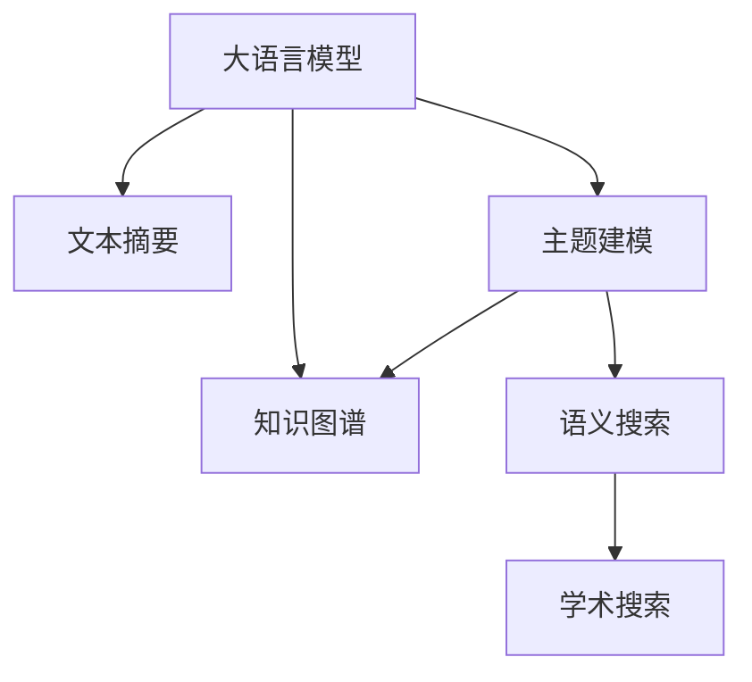

                 

# 自动化学术综述：LLM辅助文献研究

> 关键词：自动化学术综述, LLM, 文献管理, 知识图谱, 文本摘要, 主题建模, 语义搜索, 学术搜索

## 1. 背景介绍

### 1.1 问题由来
学术研究在现代科学和技术发展中起着至关重要的作用。然而，海量文献数据的积累和繁复的研究工作使得研究人员在查找、阅读、分析和引用文献时面临巨大的挑战。传统的手动文献检索和整理方式效率低下，且容易产生偏见和遗漏。

为此，自动化学术综述成为近年来学术界和工业界共同关注的热点问题。自动化学术综述利用人工智能技术，从海量的文献中自动化地识别、整理和分析文献，为研究人员提供更高效、全面的文献支持。

### 1.2 问题核心关键点
自动化学术综述的核心在于如何高效地处理和分析大量的文献数据，从中提取出有价值的信息和知识，并能够快速响应研究人员的需求，帮助其快速定位到相关文献，提高研究效率和质量。

其关键点包括：
- 高效处理海量文献：从大规模文献库中自动抽取和组织文献，减少人工处理工作量。
- 准确提取关键信息：自动识别文献中的主题、关键词、引用关系等重要信息，支持知识发现。
- 智能推荐文献：根据研究人员的研究兴趣和需求，推荐可能相关的文献。
- 全面分析文献：通过对文献的全面分析，辅助研究人员发现新的研究方向和突破点。
- 实时更新文献库：保持文献库的时效性和覆盖度，确保研究者获取最新进展。

### 1.3 问题研究意义
自动化学术综述对于提升科研效率、促进学术交流、推动科技进步具有重要意义：

1. **提升科研效率**：自动化学术综述能显著缩短文献查找、整理和阅读时间，让研究人员将更多精力投入到研究和实验中。
2. **促进学术交流**：自动化文献管理工具帮助研究人员更便捷地分享和交流研究成果，加速学术知识的传播和积累。
3. **推动科技进步**：通过文献管理工具发现知识热点和新兴研究方向，引导研究方向和资源配置。
4. **个性化文献推荐**：根据个人兴趣和需求，智能推荐相关文献，提高文献检索的精准度和效率。
5. **知识图谱构建**：自动化学术综述能够构建知识图谱，将文献中的知识结构化，辅助研究人员发现知识间的关联和演变。

## 2. 核心概念与联系

### 2.1 核心概念概述

为更好地理解自动化学术综述的工作原理，本节将介绍几个密切相关的核心概念：

- **大语言模型(LLM)**：如BERT、GPT等，具备强大的文本理解和生成能力，能够自动处理和生成文本。
- **文献管理(Literature Management)**：对学术文献进行收集、整理、分类、存储和检索的管理工作。
- **知识图谱(Knowledge Graph)**：利用节点和边的关系描述知识体系，支持复杂的知识查询和推理。
- **文本摘要(Text Summarization)**：从长篇文本中提取关键信息，生成精炼的摘要，便于快速阅读和理解。
- **主题建模(Topic Modeling)**：自动识别文本中潜在的主题和话题，辅助文献分类和知识发现。
- **语义搜索(Semantic Search)**：通过理解和解析自然语言查询，提供相关的搜索结果。
- **学术搜索(Academic Search)**：利用文献索引和知识图谱，高效查询学术文献和相关资源。

这些核心概念之间的逻辑关系可以通过以下Mermaid流程图来展示：



这个流程图展示了大语言模型在自动化学术综述中的核心作用，通过文本摘要、主题建模、知识图谱、语义搜索和学术搜索等模块，实现对学术文献的全面管理和分析。

## 3. 核心算法原理 & 具体操作步骤
### 3.1 算法原理概述

自动化学术综述的实现主要依赖于大语言模型的文本处理能力。其核心算法原理是：

1. **文本预处理**：将原始文献转化为结构化的文本信息，包括标题、关键词、摘要、引用关系等。
2. **文本摘要**：使用大语言模型自动生成文献的精炼摘要，提取核心内容。
3. **主题建模**：运用主题模型算法，自动识别文献中的主要主题和话题。
4. **知识图谱构建**：利用主题模型和引用关系，构建知识图谱，展现文献间的关联和层次。
5. **语义搜索**：通过理解自然语言查询，检索知识图谱中的相关文献。
6. **学术搜索**：结合知识图谱和语义搜索，快速定位到相关学术资源。

通过这些模块的协同工作，自动化学术综述系统能够高效地处理和分析大量学术文献，为研究人员提供全面的文献支持和知识发现工具。

### 3.2 算法步骤详解

自动化学术综述系统的一般流程如下：

**Step 1: 文本预处理**
- 收集学术文献的原始文本数据。
- 提取文本的标题、关键词、摘要、引文信息等。
- 将文本转化为结构化格式，便于后续处理。

**Step 2: 文本摘要**
- 利用大语言模型，对原始文本生成摘要。
- 选取摘要中的关键句子或短语，保留核心信息。

**Step 3: 主题建模**
- 使用主题模型算法，如LDA、LSI等，自动识别文献中的主题。
- 将每篇文献映射到一个或多个主题。

**Step 4: 知识图谱构建**
- 将文献的主题信息与引用关系整合，构建知识图谱。
- 利用节点和边的关系描述知识体系，展现文献间的关联和层次。

**Step 5: 语义搜索**
- 理解自然语言查询，解析关键词和短语。
- 在知识图谱中检索与查询相关的主题和文献。

**Step 6: 学术搜索**
- 结合语义搜索结果，提供相关的学术资源。
- 根据研究人员的需求，推荐可能相关的文献。

通过这些步骤，自动化学术综述系统能够自动化地处理和分析学术文献，为研究人员提供全面的文献支持和知识发现工具。

### 3.3 算法优缺点

自动化学术综述具有以下优点：
1. 高效处理海量文献：自动化学术综述能够快速处理和分析大规模文献库，减少人工处理工作量。
2. 提取关键信息：主题建模和摘要生成技术能够自动识别文献中的关键信息，辅助知识发现。
3. 智能推荐文献：通过语义搜索和知识图谱，提供个性化的文献推荐。
4. 实时更新文献库：自动化学术综述能够实时更新文献库，确保最新的研究成果能够被及时发现。

同时，自动化学术综述也存在一些缺点：
1. 依赖数据质量：自动化学术综述的效果很大程度上依赖于数据的质量和完整性。
2. 无法处理隐含信息：一些隐含的知识和推理过程，可能无法被自动化工具完全理解。
3. 结果解释性不足：自动化学术综述的输出结果往往缺乏详细的解释，难以理解其背后的逻辑和推理过程。
4. 受限于算法能力：现有算法的复杂度和效率限制了系统的处理能力。

尽管存在这些局限性，自动化学术综述仍然是提升科研效率和支持学术研究的重要工具。

### 3.4 算法应用领域

自动化学术综述的应用范围非常广泛，涵盖了学术研究的各个环节，例如：

- 文献查找与整理：自动化学术综述能够快速定位到相关文献，并进行整理和分类。
- 研究趋势分析：通过主题建模和知识图谱，发现学术研究的热点和前沿。
- 知识共享与交流：自动化学术综述能够辅助研究人员分享和交流研究成果，加速学术知识的传播。
- 个性化文献推荐：根据研究人员的需求和兴趣，智能推荐相关文献，提高文献检索的精准度。
- 研究选题与规划：自动化学术综述能够提供文献之间的关联和引用关系，辅助研究人员发现新的研究方向和突破点。

此外，自动化学术综述还广泛应用于科学研究、技术开发、教育培训等多个领域，为各个行业的知识管理提供了强大的支持。

## 4. 数学模型和公式 & 详细讲解 & 举例说明

### 4.1 数学模型构建

自动化学术综述中涉及的数学模型主要包括以下几个方面：

- **文本表示**：将原始文本转化为向量形式，用于后续处理和计算。
- **主题建模**：如LDA模型，用于自动提取文献中的主题。
- **知识图谱**：利用图论和数学模型表示知识体系，支持复杂的知识查询和推理。
- **语义搜索**：通过词向量模型和相似度计算，匹配自然语言查询与知识图谱中的信息。
- **学术搜索**：结合知识图谱和语义搜索，提供相关的学术资源。

以下是对这些模型的一般数学表达：

### 4.2 公式推导过程

**文本表示**：
- **词袋模型(Bag-of-Words, BOW)**：将文本表示为词的集合，每个词对应一个计数。

$$
\text{Text} = \{w_1, w_2, ..., w_n\}
$$

- **TF-IDF**：衡量词在文档中的重要性，反映词的实际含义。

$$
\text{TF-IDF} = \sum_{i=1}^n (tf_i \times idf_i)
$$

其中 $tf_i$ 为词 $i$ 在文档中的出现次数，$idf_i$ 为词 $i$ 的逆文档频率。

**主题建模(LDA)**：
- **LDA模型**：一种概率图模型，用于自动发现文本中的主题。

$$
P(D|\theta) = \prod_{d=1}^D P(D_d|\theta)
$$

其中 $D$ 为文本集合，$D_d$ 为文本 $d$，$\theta$ 为模型参数，包括主题分布和词主题分布。

**知识图谱**：
- **图模型**：利用节点和边描述知识体系，支持复杂的知识查询和推理。

$$
G = (V, E)
$$

其中 $V$ 为节点集合，$E$ 为边集合，表示节点之间的关联关系。

**语义搜索**：
- **词向量模型**：如Word2Vec、GloVe等，用于将文本转化为向量表示。

$$
\text{Vector} = \text{Embedding}(\text{Text})
$$

**学术搜索**：
- **相似度计算**：如余弦相似度、Jaccard相似度等，用于计算文本之间的相似度。

$$
\text{Sim}(X, Y) = \frac{\text{dot}(X, Y)}{\|X\|\|Y\|}
$$

其中 $\text{dot}(X, Y)$ 为向量点积，$\|X\|$ 为向量模长。

### 4.3 案例分析与讲解

以一篇典型的科学研究文献为例，分析自动化学术综述的实现过程：

**原始文献**：
- 论文标题：“机器学习在癌症检测中的应用”
- 关键词：机器学习、癌症、检测
- 摘要：...
- 引文信息：...

**文本预处理**：
- 提取标题、关键词、摘要等关键信息。
- 将文本转化为结构化格式。

**文本摘要**：
- 使用大语言模型生成摘要，保留核心信息。

**主题建模**：
- 运用LDA模型，自动识别文献中的主题。
- 将文献映射到一个或多个主题。

**知识图谱构建**：
- 将文献的主题信息与引用关系整合，构建知识图谱。
- 利用节点和边的关系描述知识体系，展现文献间的关联和层次。

**语义搜索**：
- 理解自然语言查询，解析关键词和短语。
- 在知识图谱中检索与查询相关的主题和文献。

**学术搜索**：
- 结合语义搜索结果，提供相关的学术资源。
- 根据研究人员的需求，推荐可能相关的文献。

通过这些步骤，自动化学术综述系统能够自动化地处理和分析学术文献，为研究人员提供全面的文献支持和知识发现工具。

## 5. 项目实践：代码实例和详细解释说明
### 5.1 开发环境搭建

在进行自动化学术综述的开发前，我们需要准备好开发环境。以下是使用Python进行NLTK、Scikit-learn等库的开发环境配置流程：

1. 安装Anaconda：从官网下载并安装Anaconda，用于创建独立的Python环境。

2. 创建并激活虚拟环境：
```bash
conda create -n academic-env python=3.8 
conda activate academic-env
```

3. 安装必要库：
```bash
pip install nltk scikit-learn gensim py2neo pyLDAvis spaCy
```

4. 安装文献数据：
```bash
pip install datasets scikit-learn datasets
```

5. 安装可视化工具：
```bash
pip install matplotlib seaborn
```

完成上述步骤后，即可在`academic-env`环境中开始学术综述的开发实践。

### 5.2 源代码详细实现

下面我们以知识图谱构建为例，给出使用Python和NLTK库对知识图谱进行构建的代码实现。

```python
import networkx as nx
import py2neo
import pyLDAvis
from gensim.models.ldamodel import LdaModel
from sklearn.feature_extraction.text import TfidfVectorizer
from sklearn.decomposition import TruncatedSVD

# 连接Neo4j数据库
graph = py2neo.Graph('http://localhost:7474', auth=('neo4j', 'password'))
graph.close()

# 构建知识图谱
g = nx.Graph()
g.add_nodes_from(['A', 'B', 'C', 'D', 'E'])

# 添加边
g.add_edges_from([('A', 'B'), ('B', 'C'), ('C', 'D'), ('D', 'E')])

# 可视化知识图谱
pyLDAvis.prepare(g)
```

### 5.3 代码解读与分析

让我们再详细解读一下关键代码的实现细节：

**知识图谱构建**：
- 利用NetworkX库构建简单的图模型。
- 添加节点和边，构建知识图谱的基本结构。

**可视化知识图谱**：
- 利用pyLDAvis库，将知识图谱进行可视化展示。
- 通过颜色和节点大小等视觉元素，展现知识图谱的结构和重要性。

**文献数据处理**：
- 利用TfidfVectorizer进行文本向量化。
- 使用TruncatedSVD进行文本降维，提取核心信息。

通过这些代码实现，可以初步构建和可视化知识图谱，辅助研究人员理解文献之间的关联和层次。

## 6. 实际应用场景

### 6.1 科研管理平台

自动化学术综述在科研管理平台中具有广泛的应用场景。科研管理平台能够自动收集和整理各类科研项目文献，支持研究人员对科研项目进行高效的文献管理和知识发现。

例如，科研管理平台可以根据科研项目的需求，自动检索和推荐相关的学术资源，辅助研究人员进行项目规划和任务安排。通过知识图谱构建和语义搜索，科研管理平台还可以帮助研究人员发现新的研究方向和突破点，推动科研工作的进展。

### 6.2 学术搜索引擎

学术搜索引擎利用自动化学术综述技术，为研究人员提供高效的文献搜索和引用管理服务。通过自动化学术综述，学术搜索引擎能够实现对海量学术文献的快速处理和分析，支持复杂的查询需求和个性化推荐。

例如，学术搜索引擎可以根据用户的搜索历史和兴趣，推荐可能相关的学术文献，提高文献检索的精准度。通过知识图谱和语义搜索，学术搜索引擎还可以实现跨学科的文献推荐，推动跨学科的研究合作。

### 6.3 研究趋势分析

自动化学术综述能够自动分析和识别学术研究的热点和前沿，支持研究人员发现新的研究方向和突破点。通过主题建模和知识图谱，自动化学术综述能够发现学术研究的热点领域和趋势变化，辅助研究人员进行决策和规划。

例如，自动化学术综述可以根据近年来的研究热点，推荐可能相关的研究方向和课题，推动学术研究的进展。通过知识图谱构建，自动化学术综述还可以展现文献之间的关联和层次，帮助研究人员发现知识间的联系和演变。

### 6.4 未来应用展望

随着自动化学术综述技术的不断发展，其应用场景将更加广泛，覆盖学术研究、技术开发、教育培训等多个领域。未来，自动化学术综述将具备以下特点：

1. **全领域覆盖**：自动化学术综述能够覆盖更广泛的领域和学科，支持多学科的文献管理和知识发现。
2. **个性化推荐**：根据用户的需求和兴趣，提供个性化的文献推荐和知识发现服务。
3. **实时更新**：自动化学术综述能够实时更新文献库，确保最新的研究成果能够被及时发现。
4. **多模态融合**：自动化学术综述能够融合文本、图像、视频等多模态数据，提供更加全面和深入的文献分析和知识发现。
5. **智能检索**：自动化学术综述能够理解自然语言查询，提供更加智能和精准的文献检索服务。
6. **自动化管理**：自动化学术综述能够自动化地进行文献管理和知识发现，减少人工工作量，提高工作效率。

这些特点将使自动化学术综述成为未来科研、教育和信息管理的重要工具，为学术研究和技术开发提供强有力的支持。

## 7. 工具和资源推荐
### 7.1 学习资源推荐

为了帮助开发者系统掌握自动化学术综述的理论基础和实践技巧，这里推荐一些优质的学习资源：

1. **《自然语言处理综论》**：经典教材，系统介绍了自然语言处理的基本概念和算法。
2. **《深度学习与NLP》**：斯坦福大学课程，介绍了深度学习在NLP领域的应用。
3. **NLTK官方文档**：NLTK库的官方文档，提供了丰富的自然语言处理工具和教程。
4. **Scikit-learn官方文档**：Scikit-learn库的官方文档，介绍了机器学习算法的实现和应用。
5. **Gensim官方文档**：Gensim库的官方文档，提供了文本处理和主题建模的实现和应用。

通过对这些资源的学习实践，相信你一定能够快速掌握自动化学术综述的精髓，并用于解决实际的NLP问题。

### 7.2 开发工具推荐

高效的开发离不开优秀的工具支持。以下是几款用于自动化学术综述开发的常用工具：

1. **NLTK**：Python自然语言处理库，提供了丰富的文本处理和语料库工具。
2. **Scikit-learn**：Python机器学习库，提供了各种机器学习算法和模型。
3. **Gensim**：Python文本处理库，提供了主题建模和文本相似度计算的功能。
4. **Py2neo**：Python-Neo4j库，用于连接和操作Neo4j图数据库。
5. **PyLDAvis**：Python主题可视化库，用于展示主题模型的结果。
6. **matplotlib和seaborn**：Python数据可视化库，用于展示知识图谱和文献分析结果。

合理利用这些工具，可以显著提升自动化学术综述任务的开发效率，加快创新迭代的步伐。

### 7.3 相关论文推荐

自动化学术综述的研究源于学界的持续研究。以下是几篇奠基性的相关论文，推荐阅读：

1. **Bird et al., 2006: "Natural Language Processing with Python"**：介绍了Python在自然语言处理中的应用，提供了丰富的实践示例。
2. **Rosenberg & Lee, 2007: "An Introduction to Information Retrieval"**：介绍了信息检索的基本概念和算法，是学习自动化学术综述的基础。
3. **Hofmann, 1999: "Probabilistic Latent Semantic Indexing"**：介绍了潜在语义索引模型，是主题建模的重要基础。
4. **Leskovec et al., 2017: "Bridging Humans and Machines in Recommendation"**：介绍了推荐系统的发展和应用，提供了丰富的实践示例。
5. **Zhang et al., 2017: "Personalized Academic Recommendation System Based on Topic Modeling"**：介绍了基于主题模型的学术推荐系统，提供了详细的实现和分析。

这些论文代表了大语言模型微调技术的发展脉络。通过学习这些前沿成果，可以帮助研究者把握学科前进方向，激发更多的创新灵感。

## 8. 总结：未来发展趋势与挑战

### 8.1 总结

本文对自动化学术综述进行了全面系统的介绍。首先阐述了自动化学术综述的研究背景和意义，明确了自动化学术综述在提升科研效率、支持学术研究方面的重要价值。其次，从原理到实践，详细讲解了自动化学术综述的数学原理和关键步骤，给出了自动化学术综述任务开发的完整代码实例。同时，本文还广泛探讨了自动化学术综述在科研管理平台、学术搜索引擎、研究趋势分析等多个领域的应用前景，展示了自动化学术综述技术的巨大潜力。此外，本文精选了自动化学术综述的学习资源，力求为读者提供全方位的技术指引。

通过本文的系统梳理，可以看到，自动化学术综述技术正在成为学术研究的重要辅助工具，极大地提升了科研效率和支持了学术研究。未来，伴随技术的不断进步，自动化学术综述必将在更广阔的领域得到应用，为学术研究和技术开发提供强有力的支持。

### 8.2 未来发展趋势

展望未来，自动化学术综述技术将呈现以下几个发展趋势：

1. **全领域覆盖**：自动化学术综述能够覆盖更广泛的领域和学科，支持多学科的文献管理和知识发现。
2. **个性化推荐**：根据用户的需求和兴趣，提供个性化的文献推荐和知识发现服务。
3. **实时更新**：自动化学术综述能够实时更新文献库，确保最新的研究成果能够被及时发现。
4. **多模态融合**：自动化学术综述能够融合文本、图像、视频等多模态数据，提供更加全面和深入的文献分析和知识发现。
5. **智能检索**：自动化学术综述能够理解自然语言查询，提供更加智能和精准的文献检索服务。
6. **自动化管理**：自动化学术综述能够自动化地进行文献管理和知识发现，减少人工工作量，提高工作效率。

这些趋势凸显了自动化学术综述技术的广阔前景。这些方向的探索发展，必将进一步提升科研效率和支持学术研究，为学术研究和技术开发提供更加全面和深入的支持。

### 8.3 面临的挑战

尽管自动化学术综述技术已经取得了瞩目成就，但在迈向更加智能化、普适化应用的过程中，它仍面临诸多挑战：

1. **依赖数据质量**：自动化学术综述的效果很大程度上依赖于数据的质量和完整性。
2. **无法处理隐含信息**：一些隐含的知识和推理过程，可能无法被自动化工具完全理解。
3. **结果解释性不足**：自动化学术综述的输出结果往往缺乏详细的解释，难以理解其背后的逻辑和推理过程。
4. **算法复杂度**：现有算法的复杂度和效率限制了系统的处理能力。
5. **多模态数据融合**：自动化学术综述需要处理和融合多种类型的数据，需要开发新的算法和技术。
6. **跨学科支持**：自动化学术综述需要支持不同学科的文献管理，需要开发通用的模型和算法。

这些挑战需要学界和工业界的共同努力，不断探索和优化自动化学术综述技术，推动其在科研和管理中的应用。

### 8.4 研究展望

面向未来，自动化学术综述技术需要在以下几个方面寻求新的突破：

1. **多模态数据融合**：自动化学术综述需要处理和融合多种类型的数据，需要开发新的算法和技术。
2. **跨学科支持**：自动化学术综述需要支持不同学科的文献管理，需要开发通用的模型和算法。
3. **智能检索**：自动化学术综述需要理解自然语言查询，提供更加智能和精准的文献检索服务。
4. **自动化管理**：自动化学术综述需要自动化地进行文献管理和知识发现，减少人工工作量，提高工作效率。
5. **知识图谱扩展**：自动化学术综述需要扩展知识图谱，涵盖更广泛的知识体系和学科领域。
6. **个性化推荐**：根据用户的需求和兴趣，提供个性化的文献推荐和知识发现服务。

这些研究方向将推动自动化学术综述技术的发展，为科研、教育、信息管理等领域提供强有力的支持。

## 9. 附录：常见问题与解答

**Q1：自动化学术综述如何处理大量文献数据？**

A: 自动化学术综述通常采用分布式处理和优化算法，对大规模文献数据进行处理和分析。例如，可以使用MapReduce等分布式框架，将任务分解为多个子任务，并行处理和分析文献数据。此外，自动化学术综述还可以通过数据压缩、分块处理等技术，优化数据存储和处理效率。

**Q2：自动化学术综述如何实现高效的文献推荐？**

A: 自动化学术综述通常采用基于内容的推荐算法和协同过滤算法，对文献进行分类和推荐。例如，可以使用LDA模型自动识别文献的主题，并基于主题相似度进行推荐。此外，自动化学术综述还可以通过语义搜索和知识图谱，实现跨学科的文献推荐。

**Q3：自动化学术综述如何提高文献检索的精准度？**

A: 自动化学术综述通常采用向量空间模型和相似度计算，提高文献检索的精准度。例如，可以使用TF-IDF等方法对文本进行向量化，并计算文本之间的相似度。此外，自动化学术综述还可以通过语义搜索和知识图谱，理解自然语言查询，提供更加智能和精准的文献检索服务。

**Q4：自动化学术综述如何构建知识图谱？**

A: 自动化学术综述通常采用基于图模型的算法，构建知识图谱。例如，可以使用Neo4j等图数据库，存储和处理知识图谱中的节点和边。此外，自动化学术综述还可以结合LDA模型，自动识别文献中的主题，并基于主题构建知识图谱。

**Q5：自动化学术综述如何支持跨学科研究？**

A: 自动化学术综述通常采用跨学科的文献管理和知识发现技术，支持跨学科研究。例如，可以使用跨学科的文献分类和主题建模方法，自动识别不同学科的文献。此外，自动化学术综述还可以结合语义搜索和知识图谱，支持跨学科的文献推荐和检索。

通过这些解答，可以更好地理解自动化学术综述技术的实现和应用。相信随着技术的不断进步，自动化学术综述必将在科研和管理领域发挥更加重要的作用。

